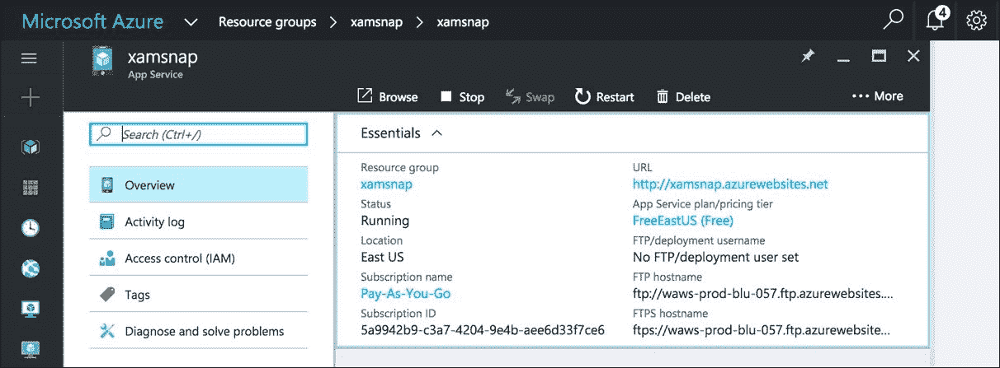
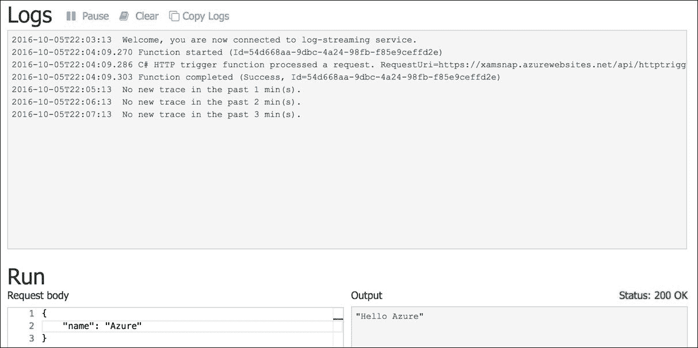
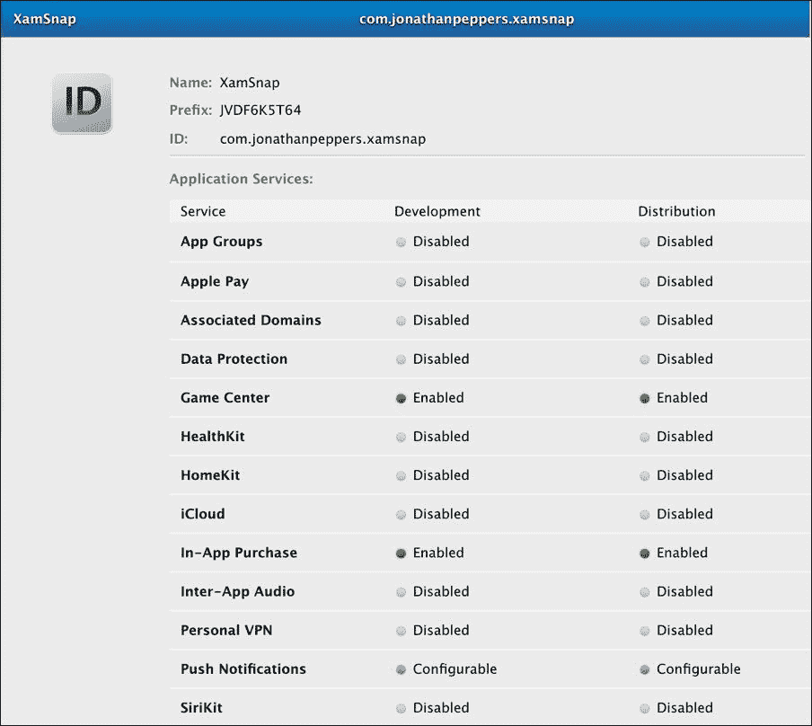
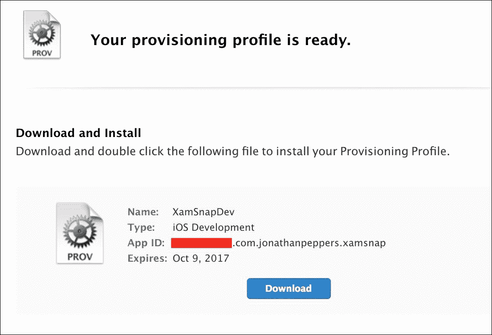
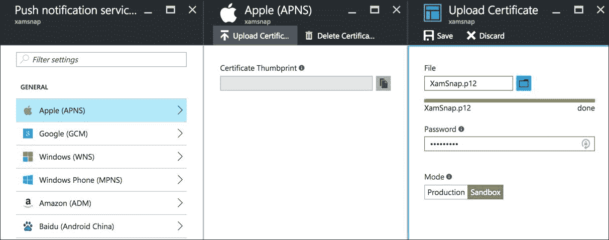
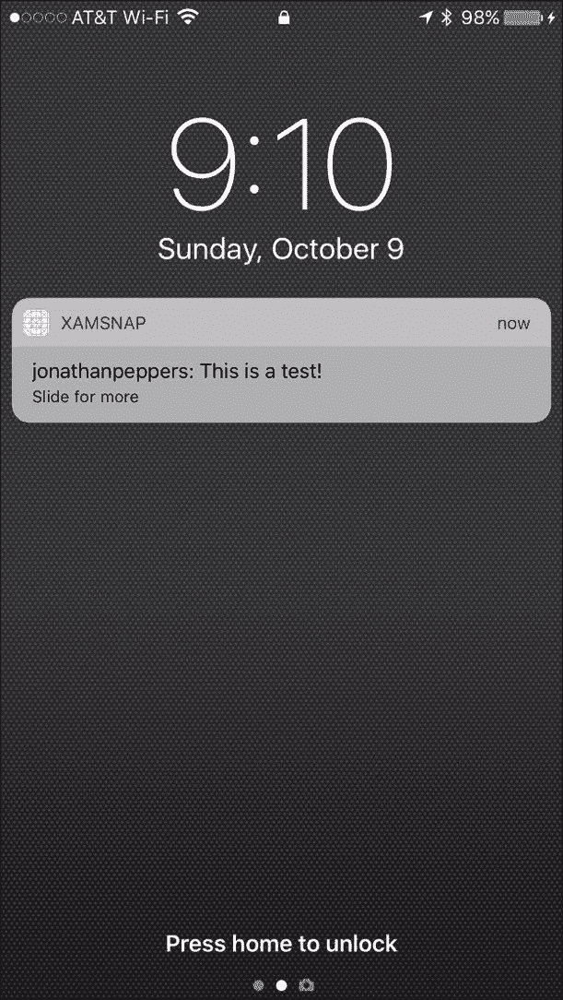
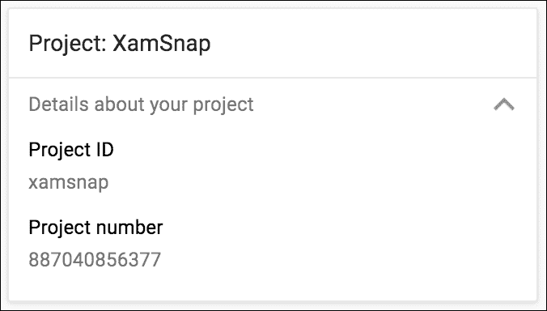
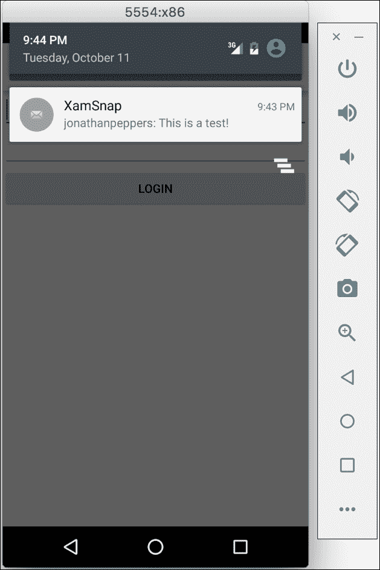

# 第九章：带推送通知的 web 服务

现代移动应用程序以其网络连接性为特征。一个不与 web 服务器交互的移动应用既难得一见，也可能是一个无聊的应用。在本书中，我们将使用**Windows Azure**云平台为我们的 XamSnap 应用实现服务器端后端。我们将使用一个名为**Azure Functions**的功能，它非常适合作为我们应用程序的简单后端，并且可以通过**Azure Notification Hubs**发送推送通知。完成这一章节后，我们的 XamSnap 示例应用程序将更接近一个真正的应用程序，并允许其用户相互交互。

本章节，我们将涵盖以下主题：

+   Windows Azure 提供的服务

+   设置你的 Azure 账户

+   Azure Functions 作为 XamSnap 的后端

+   为 XamSnap 实现真实的 web 服务

+   编写客户端代码以调用 Azure Functions

+   使用苹果推送通知服务

+   使用 Google Cloud Messaging 发送通知

# 学习 Windows Azure

Windows Azure 是微软在 2010 年推出的卓越云平台。Azure 提供了**基础设施即服务**（**IaaS**）和**平台即服务**（**PaaS**），用于构建现代的 web 应用程序和服务。这意味着它可以直接为你提供虚拟机的访问，你可以在其中部署任何你选择的操作系统或软件。这称为 IaaS。Azure 还提供了多个用于构建应用程序的平台，如**Azure Web Apps**或**SQL Azure**。这些平台被称为 PaaS，因为你可以在高层次部署软件，并且不需要直接处理虚拟机或管理软件升级。

让我们了解 Windows Azure 提供的以下更常见服务：

+   **虚拟机**：Azure 提供各种规模的虚拟机访问。你可以安装几乎任何你选择的操作系统；Azure 图库中有许多预制的发行版可供选择。

+   **Web Apps**：你可以部署任何类型的网站，这些网站将在 Microsoft **IIS** 中运行，从 ASP .NET 站点到 **PHP** 或 **Node.js**。

+   **SQL Azure**：这是基于云的微软 SQL Server 版本，它是一个功能完整的**区域数据库管理系统**（**RDMS**）用于存储数据。

+   **移动应用**：这是一个用于构建移动应用 web 服务的简单平台。它使用 **SQL Azure** 作为后端存储，并基于 Node.js 的简单 JavaScript 脚本系统来添加业务逻辑。

+   **Azure Functions**：Windows Azure 推出的首款支持新兴“无服务器”架构的产品，这成为了当今的热门词汇。你可以在浏览器中直接使用多种语言开发简单的 API、后台作业、web 钩子等。Azure 会根据传入的请求自动扩展你的函数。

+   **存储**：Azure 提供了**块存储**，用于存储二进制文件，以及**表存储**，这是一种 **NoSQL** 数据持久化解决方案。

+   **服务总线**（Service bus）：这是一个基于云的解决方案，用于创建队列，以便与其他云服务之间的通信提供便利。它还包括通知中心，作为向移动应用提供推送通知的简单方式。

+   **通知中心**（Notification Hubs）：这是一种向 Android、iOS 和 Windows 设备等不同平台发送推送通知的简单方式。

+   **DocumentDB**：一个功能完备的 NoSQL 数据存储，与其他 NoSQL 数据库（如**MongoDB**）相当。

+   **HDInsight**：在 Windows Azure 中运行的 Apache Hadoop 版本，用于管理极大数据集，这也被称为大数据。

除了这些服务外，还有许多正在积极开发的新服务。我们将使用 Azure Functions，并利用 Azure Storage Tables，为 XamSnap 构建我们的 Web 服务。你可以访问[`windowsazure.com`](http://windowsazure.com)了解提供的完整价格和服务列表。

在本书中，我们选择使用 Windows Azure 作为 XamSnap 的 Web 服务后端进行演示，因为它与 C#、Visual Studio 和其他 Microsoft 工具相辅相成。但是，除了 Azure 之外，还有许多其他选择，你可能想要看看。选择 Xamarin 并不会限制你的应用程序可以交互的 Web 服务类型。

下面是一些更常见的服务：

+   **Firebase**：谷歌提供的这项服务与 Azure Mobile Apps 类似，包括数据存储和推送通知等功能。你可以访问[`firebase.google.com`](https://firebase.google.com)了解更多信息。

+   **Urban airship**：这项服务为跨多个平台的移动应用提供推送通知。你可以访问[`urbanairship.com`](http://urbanairship.com)了解更多信息。

+   **亚马逊网络服务**（Amazon Web Services）：这项服务是一个完整的云解决方案，与 Windows Azure 相当。它拥有部署云应用所需的一切，包括完全的虚拟机支持。此外，还有一个名为 **AWS Mobile Hub** 的功能，专门针对移动开发而定制。你可以访问[`aws.amazon.com`](http://aws.amazon.com)获取更多信息。

此外，你可以使用本地 Web 服务器或低成本的托管服务，用你选择的语言和技术开发自己的 Web 服务。

## 设置你的 Azure 账户

要开始使用 Windows Azure 进行开发，你可以订阅一个月的免费试用，并获得 200 美元的 Azure 信用。与此相伴的是，它的许多服务都有免费层级，为你提供性能较低的版本。因此，如果你的试用期结束，你可以根据所使用的服务，继续开发，费用很少或没有。

首先，导航到[`azure.microsoft.com/en-us/free`](http://azure.microsoft.com/en-us/free)，然后执行以下步骤：

1.  点击 **开始免费** 链接。

1.  使用 Windows Live ID 登录。

1.  出于安全考虑，通过你的手机或短信验证你的账户。

1.  输入支付信息。这只在你超出消费限额时使用。在开发你的应用程序时，你不会意外超出预算——通常在真实用户开始与服务互动之前不会意外消费。

1.  勾选**我同意**政策，并点击**注册**。

1.  检查最终设置并点击**提交**。

如果所有必需的信息都正确输入，你现在终于可以访问你的 Azure 账户了。你可以点击页面右上角的**门户**链接来访问你的账户。将来，你可以在 [`portal.azure.com`](http://portal.azure.com) 管理你的 Azure 服务。

Azure 门户使用一组名为 blades 的面板，以便快速导航并深入了解更详细的信息，如下面的屏幕截图所示：



这就完成了你的 Windows Azure 注册。与 Apple 和 Google Play 开发者计划相比，这相当简单。随意尝试，但不必太担心花费问题。Azure 大多数服务都有免费版本，并且还提供一定量的免费带宽。你可以访问 [`azure.microsoft.com/en-us/pricing`](http://azure.microsoft.com/en-us/pricing) 获取更多关于定价的信息。

请注意，关于 Windows Azure 价格昂贵的误解很多。你可以在免费层为应用程序进行所有开发而不花一分钱。将应用程序投入生产时，你可以轻松地增加或减少虚拟机实例的数量，以控制成本。通常，如果你没有很多用户，你不会花很多钱。同样，如果你恰好有很多用户，你应该能赚取足够的收入。

# 探索 Azure Functions

对于 XamSnap 的服务器端，我们将使用 Azure Functions 以及 Azure Storage Tables 为应用程序提供后端存储。Azure Functions 是加速服务器端应用程序开发的简单解决方案，可以利用 Windows Azure 的所有功能。我们将使用 .NET 基础类库中的标准 `HttpClient` 类，从 C# 与服务进行交互。

Azure Functions 的几个亮点如下：

+   你可以使用多种编程语言编写函数，如 JavaScript、C#、Python、PHP，以及一些脚本语言，如 Batch、Bash 和 PowerShell

+   Azure Functions 与 Visual Studio Team Services、Bitbucket 和 GitHub 集成，支持**持续集成**（**CI**）场景

+   你可以轻松地使用 Azure Active Directory、Windows Live ID、Facebook、Google 和 Twitter 设置身份验证

+   函数可以通过 HTTP、计划或定时器、Azure 队列等触发

+   Azure Functions 真正实现了无服务器，并且可以动态扩展处理大量数据

你可以了解到为什么 Azure Functions 对于简单的移动应用程序是一个好的选择。加速开发以及它提供的许多特性非常适合我们的 XamSnap 示例应用程序。

在[`portal.azure.com`](http://portal.azure.com)访问你的账户，并执行以下步骤来创建 Azure Function：

1.  点击页面左上角的加号按钮。

1.  通过菜单导航到**计算** | **函数应用**。

1.  输入你选择的域名，比如`yourname-xamsnap`。

1.  选择一个订阅，以便将服务放置在下面。

1.  选择一个现有的**资源组**，或者创建一个新的名为`xamsnap`的资源组。

1.  选择一个**动态应用服务**计划开始。如果你已经有了一个应用服务计划，可以使用现有以**经典**模式运行的计划。

1.  选择一个现有的**存储账户**或创建一个新的。

1.  查看你的最终设置并点击**创建**按钮。

管理门户将显示进度，创建你的 Azure Function App 实例可能需要几秒钟。

让我们创建一个简单的 Hello World 函数来观察其工作情况：

1.  导航到你的 Function App。

1.  点击**快速入门**。

1.  点击选择 C#的**Webhook + API**，然后点击**创建此函数**。

1.  Azure 门户会提供一个快速浏览，如果需要，你可以跳过。

1.  滚动到底部，点击**运行**以查看 Azure Function 的操作。

完成后，你应在日志窗口中看到输出，以及带有`Hello Azure`输出的成功 HTTP 请求。你应该会看到类似于以下截图的内容：



## 创建和调用 Azure Functions

为了开始为 XamSnap 设置后端，我们需要创建一个登录函数。我们还需要实现由应用程序其他部分使用的`IWebService`接口。由于我们的 MVVM 架构，我们应该能够替换当前正在使用的假服务，而不需要更改位于其上的任何层。

返回 Azure 门户，选择你的 Function App 实例，并执行以下步骤：

1.  点击**新建函数**按钮。

1.  选择**空 - C#**模板。

1.  输入`login`作为函数名称。

1.  点击**创建**按钮。

1.  点击**集成**部分。

1.  添加一个带有默认设置的**HTTP**触发器和输出，然后点击**保存**。

1.  添加一个**Azure 表存储**输出，将表名更改为`users`，然后点击**保存**。

现在让我们为我们的函数编写一些代码，切换到**开发**部分，并添加以下代码作为起点：

```kt
#r "Microsoft.WindowsAzure.Storage" 

using System.Net; 
using System.Text; 
using Microsoft.WindowsAzure.Storage.Table; 

private const string PartitionKey = "XamSnap"; 

public static async Task<HttpResponseMessage>  
  Run(HttpRequestMessage req, CloudTable outputTable,  
  TraceWriter log) 
{ 
  dynamic data = await req.Content.ReadAsAsync<object>(); 
  string userName = data?.userName; 
  string password = data?.password; 

  if (string.IsNullOrEmpty(userName) ||  
    string.IsNullOrEmpty(password)) 
  { 
    return new HttpResponseMessage(HttpStatusCode.BadRequest); 
  } 
} 

```

首先，我们添加了对 Azure 存储 SDK 的引用。这是内置的，可供 Azure Functions 使用，我们稍后会用到它。接下来，我们添加了一些 using 语句和一个常量。我们创建了一个静态函数，处理我们之前定义的输入和输出。`req`是 HTTP 输入，`outputTable`是 Azure 表输出。`log`是一个`TraceWriter`，可用于调试和日志记录。最后，我们使用了内置方法将 POST 数据读取到`username`和`password`变量中，以便在我们的函数中使用。

然后，我们需要填充我们功能的剩余部分。将此代码放在我们开始的功能的底部：

```kt
//Let's hash all incoming passwords 
password = Hash(password); 

var operation = TableOperation.Retrieve<User>( 
  PartitionKey, userName); 
var result = outputTable.Execute(operation); 
var existing = result.Result as User; 
if (existing == null) 
{ 
  operation = TableOperation.Insert(new User 
  { 
    RowKey = userName, 
    PartitionKey = PartitionKey, 
    PasswordHash = password, 
  }); 
  result = outputTable.Execute(operation); 

  if (result.HttpStatusCode == (int)HttpStatusCode.Created) 
  { 
    return new HttpResponseMessage(HttpStatusCode.OK); 
  } 
  else 
  { 
    return new HttpResponseMessage( 
      (HttpStatusCode)result.HttpStatusCode); 
  } 
} 
else if (existing.PasswordHash != password) 
{ 
  return new HttpResponseMessage(HttpStatusCode.Unauthorized); 
} 
else 
{ 
  return new HttpResponseMessage(HttpStatusCode.OK); 
} 

```

让我们总结一下我们在前面的 C# 中做了什么：

1.  首先，我们用稍后要添加的函数对传入的密码进行哈希处理。请注意，Azure Functions 有内置的身份验证功能，这对于生产应用来说非常棒。对于我们的示例应用，我们至少采取措施，不将密码以明文形式存储到我们的数据库中。

1.  接下来，我们使用了 Azure 存储 SDK 来检查现有用户。

1.  如果没有结果，我们将继续创建一个新用户。分区键和行键是 Azure 表存储中的概念。在大多数情况下，你会选择一个键来分区你的数据，比如州或邮政编码，而行键是一个唯一的键。对于这个示例，我们只是为分区键使用了一个常量值。

1.  否则，我们比较哈希密码并返回成功。

1.  如果密码不匹配，我们将返回一个未经授权的错误代码。

之后，我们只需要一点代码来定义`Hash`函数和`User`类：

```kt
private static string Hash(string password) 
{ 
  var crypt = new System.Security.Cryptography.SHA256Managed(); 
  var hash = new StringBuilder(); 
  byte[] crypto = crypt.ComputeHash( 
    Encoding.UTF8.GetBytes(password), 0,  
    Encoding.UTF8.GetByteCount(password)); 
  foreach (byte b in crypto) 
  { 
    hash.Append(b.ToString("x2")); 
  } 
  return hash.ToString(); 
} 

public class User : TableEntity 
{ 
  public string PasswordHash { get; set; } 
} 

```

我们使用了`System.Security`命名空间中内置的 SHA-256 哈希算法。这至少比常见的被破解的 MD5 哈希要安全一些。我们还声明了`User`类作为一个表实体，并带有一个额外的列包含哈希。

在这里，只需确保点击**保存**按钮以应用你的更改。Azure Functions 还提供了通过几个源代码控制提供程序为你的脚本提供源代码控制的选项。如果你想在本地的你喜欢的编辑器而不是网站编辑器中更改脚本，可以充分利用这个功能。你应该能够通过以下示例 JSON 测试该功能：

```kt
{ 
  "userName":"test", 
  "password":"password" 
} 

```

要获取 Azure 存储 SDK 的完整文档，请确保查看 MSDN：[`msdn.microsoft.com/en-us/library/azure/mt347887.aspx`](https://msdn.microsoft.com/en-us/library/azure/mt347887.aspx)。

### 在 C# 中使用 HttpClient

我们的 server-side 更改完成后，下一步是在我们的 XamSnap iOS 和 Android 应用程序中实现我们的新服务。幸运的是，由于我们使用了名为`IWebService`的接口，我们只需实现该接口即可在我们的应用程序中使其工作。

现在，通过执行以下步骤，我们可以在 iOS 应用程序中开始设置我们的服务：

1.  打开我们之前在书中创建的`XamSnap.Core`项目。

1.  在项目中创建一个`Azure`文件夹。

1.  创建一个名为`AzureWebService.cs`的新类。

1.  将类设置为`public`并实现`IWebService`。

1.  在你的代码中右键点击`IWebService`，选择**重构** | **实现接口**。

1.  将会出现一行；按**Enter**键以插入方法存根。

当这个设置完成后，你的类看起来会像下面这样：

```kt
public class AzureWebService : IWebService 
{ 
  #region IWebService implementation 

  public Task<User> Login(string username, string password) 
  { 
    throw new NotImplementedException(); 
  } 

  // -- More methods here --  

  #endregion 
} 

```

接下来，我们需要添加对 JSON .NET 库的引用。为此，我们将使用 NuGet 来添加库。右键点击`XamSnap.Core`项目，选择**添加** | **添加包**，并安装 Json .NET。

现在，让我们修改我们的`AzureWebService.cs`文件。为了开始，我们将进行以下更改：

```kt
using System.Net.Http; 
using System.Net.Http.Headers; 
using System.Threading.Tasks; 
using Newtonsoft.Json; 

public class AzureWebService : IWebService 
{ 
  private const string BaseUrl =  
    "https://xamsnap.azurewebsites.net/api/"; 
  private const string ContentType = "application/json"; 
  private readonly HttpClient httpClient = new HttpClient(); 

  // -- Existing code here -- 
} 

```

我们定义了一些 using 语句和几个变量，这些将在这个类中用到。请确保你填写了 Azure Function App 的正确 URL。

接下来，让我们编写一些辅助方法，以简化调用网络请求的过程：

```kt
private async Task<HttpResponseMessage> Post( 
  string url, string code, object obj) 
{ 
  string json = JsonConvert.SerializeObject(obj); 
  var content = new StringContent(json); 
  content.Headers.ContentType =  
    new MediaTypeHeaderValue(ContentType); 

  var response = await httpClient.PostAsync( 
    BaseUrl + url + "?code=" + code, content); 
  response.EnsureSuccessStatusCode(); 
  return response; 
} 

private async Task<T> Post<T>(string url, string code, object obj) 
{ 
  var response = await Post(url, code, obj); 
  string json = await response.Content.ReadAsStringAsync(); 
  return JsonConvert.DeserializeObject<T>(json); 
}} 

```

这段代码的大部分是在 C#中实现调用 RESTful 端点的基础。首先，我们将对象序列化为 JSON，并创建一个带有头部声明为 JSON 的`StringContent`对象。我们用`code`参数格式化 URL，这是 Azure Functions 默认开启的一个简单安全机制。接下来，我们向服务器发送一个 POST 请求，并调用`EnsureSuccessStatusCode`，以便对失败的请求抛出异常。最后，我们添加了第二个方法，将 JSON 响应解析为 C#对象。我们的某些 Azure Functions 将返回数据，所以我们需要这个功能。

现在，让我们按照以下方式实现我们的第一个方法`Login`：

```kt
public async Task<User> Login(string userName, string password) 
{ 
  await Post("login", "key_here", new 
  { 
    userName, 
    password, 
  }); 

  return new User 
  { 
    Name = userName, 
    Password = password, 
  }; 
}} 

```

这非常简单，因为我们已经设置了辅助方法。我们只需要传递我们的函数名称、它的键以及代表我们想要传递给 HTTP 请求的 JSON 的对象。你可以在 Azure Portal 的**开发**部分下的**Function URL**找到所需的键。

接下来，打开`AppDelegate.cs`文件以设置我们的新服务，并添加以下代码：

```kt
//Replace this line 
ServiceContainer.Register<IWebService>( 
  () => new FakeWebService()); 

//With this line 
ServiceContainer.Register<IWebService>( 
  () => new AzureWebService()); 

```

现在，如果你在登录时编译并运行你的应用程序，你的应用应该能够成功调用 Azure Function，并将新用户插入 Azure Table Storage。

### 提示：

如果你正在寻找一个快速管理 Azure Tables 的方法，微软已经发布了一个免费的工具，叫做 Azure Storage Explorer。它适用于 Mac OS X 和 Windows，可以在[`storageexplorer.com`](http://storageexplorer.com)找到。第二个选择是 Visual Studio 中的**Cloud Explorer**，如果你安装了 Azure SDK for .NET，就可以使用。

## 添加更多的 Azure Functions。

我们还需要实现几个方法，用于我们的`IWebService`实现。让我们从添加两个新的 Azure Functions 开始，一个用于获取用户朋友列表，另一个用于添加朋友。

返回 Azure Portal，执行以下步骤：

1.  点击**新建函数**按钮。

1.  选择**Empty - C#**模板。

1.  输入`friends`作为函数名称。

1.  点击**创建**按钮。

1.  点击**集成**部分。

1.  添加一个带有默认设置的**HTTP**触发器和输出，然后点击**保存**。

1.  添加一个**Azure Table Storage**输入，将表名更改为`friends`，然后点击**保存**。

1.  对名为`addfriend`的第二个函数重复这些步骤，但将**Azure Table Storage**设置为输出而不是输入。

接下来，让我们使用以下 C#代码实现`friends` Azure Function：

```kt
#r "Microsoft.WindowsAzure.Storage" 

using System.Net; 
using Microsoft.WindowsAzure.Storage.Table; 

public async static Task<HttpResponseMessage> Run( 
  HttpRequestMessage req, IQueryable<TableEntity> inputTable, 
  TraceWriter log) 
{ 
    dynamic data = await req.Content.ReadAsAsync<object>(); 
    string userName = data?.userName; 
    if (string.IsNullOrEmpty(userName)) 
    { 
      return new HttpResponseMessage(HttpStatusCode.BadRequest); 
    } 

    var results = inputTable 
      .Where(r => r.PartitionKey == userName) 
      .Select(r => new { Name = r.RowKey }) 
      .ToList(); 
    return req.CreateResponse(HttpStatusCode.OK, results); 
} 

```

这比我们的`login`函数简单一些。Azure Functions 可以选择使用不同于我们之前使用的`CloudTable`的不同类型的参数。当使用`IQueryable`时，我们只需编写 LINQ 表达式即可提取此函数所需的数据：指定用户的 friend 列表。我们计划将用户的名字作为`PartitionKey`，朋友的名字作为`RowKey`。然后我们只需在 HTTP 响应中返回这些值。

现在，让我们使用以下 C#代码实现`addfriend`函数：

```kt
#r "Microsoft.WindowsAzure.Storage" 

using System.Net; 
using Microsoft.WindowsAzure.Storage.Table; 

public async static Task<HttpResponseMessage> Run( 
  HttpRequestMessage req, CloudTable outputTable, TraceWriter log) 
{ 
  dynamic data = await req.Content.ReadAsAsync<object>(); 
  string userName = data?.userName; 
  string friendName = data?.friendName; 
  if (string.IsNullOrEmpty(userName) || 
    string.IsNullOrEmpty(friendName)) 
  { 
    return new HttpResponseMessage(HttpStatusCode.BadRequest); 
  } 

  var operation = TableOperation.InsertOrReplace(new TableEntity 
  { 
    PartitionKey = userName, 
    RowKey = friendName, 
  }); 
  var result = outputTable.Execute(operation); 

  return req.CreateResponse( 
    (HttpStatusCode)result.HttpStatusCode); 
} 

```

就像之前使用`login`函数一样，我们使用`CloudTable`向 Azure Storage Table 添加一行。同样，我们处理空白输入的可能性，并返回 Azure Storage SDK 返回的相同状态码。

最后，让我们修改`AzureWebService.cs`：

```kt
public Task<User[]> GetFriends(string userName) 
{ 
  return Post<User[]>("friends", "key_here", new 
  { 
    userName 
  }); 
}
public async Task<User> AddFriend( 
  string userName, string friendName) 
{ 
  await Post("addfriend", "key_here", new 
  { 
    userName, 
    friendName 
  }); 

  return new User 
  { 
    Name = friendName 
  }; 
} 

```

我们调用本章前面创建的帮助方法，以便轻松处理 HTTP 输入和输出到我们的 Azure Functions。确保为每个 Azure Function 使用正确的密钥。您可能需要使用工具向`friends` Azure Storage 表插入或填充一些测试数据，以便我们的 Azure Function 可以处理。

最后，我们需要创建三个更多的 Azure Functions 来处理对话和消息。返回 Azure 门户，并执行以下步骤：

1.  点击**新建函数**按钮。

1.  选择**Empty - C#**模板。

1.  输入`conversations`作为函数名称。

1.  点击**创建**按钮。

1.  点击**集成**部分。

1.  添加一个带有默认设置的**HTTP**触发器和输出，然后点击**保存**。

1.  添加一个**Azure Table Storage**输入，将表名更改为`friends`，然后点击**保存**。

1.  对名为`messages`的第二个函数重复这些步骤，表名为`messages`。

1.  对名为`sendmessage`的第三个函数重复这些步骤，但将**Azure Table Storage**设置为输出而不是输入。

`conversations`函数的 C#代码如下：

```kt
#r "Microsoft.WindowsAzure.Storage" 

using System.Net; 
using Microsoft.WindowsAzure.Storage.Table; 

public async static Task<HttpResponseMessage> Run( 
  HttpRequestMessage req, IQueryable<Conversation> inputTable, 
  TraceWriter log) 
{ 
  dynamic data = await req.Content.ReadAsAsync<object>(); 
  string userName = data?.userName; 
  if (string.IsNullOrEmpty(userName)) 
  { 
    return new HttpResponseMessage(HttpStatusCode.BadRequest); 
  } 

  var results = inputTable 
    .Where(r => r.PartitionKey == userName) 
    .Select(r => new { Id = r.RowKey, UserName = r.UserName }) 
    .ToList(); 
  return req.CreateResponse(HttpStatusCode.OK, results); 
} 

public class Conversation : TableEntity 
{ 
  public string UserName { get; set; } 
} 

```

这段代码几乎与我们之前编写的`friends`函数相同。但是，我们需要定义一个`Conversation`类，以便在表中对默认的`RowKey`和`PartitionKey`之外添加一个额外的列。

接下来，让我们为`messages`函数添加以下 C#代码：

```kt
#r "Microsoft.WindowsAzure.Storage" 

using System.Net; 
using Microsoft.WindowsAzure.Storage.Table; 

public async static Task<HttpResponseMessage> Run( 
  HttpRequestMessage req, IQueryable<Message> inputTable, 
  TraceWriter log) 
{ 
  dynamic data = await req.Content.ReadAsAsync<object>(); 
  string conversation = data?.conversation; 
  if (string.IsNullOrEmpty(conversation)) 
  { 
    return new HttpResponseMessage(HttpStatusCode.BadRequest); 
  } 

  var results = inputTable 
    .Where(r => r.PartitionKey == conversation) 
    .Select(r => new { Id = r.RowKey,  
      UserName = r.UserName, Text = r.Text }) 
    .ToList(); 
  return req.CreateResponse(HttpStatusCode.OK, results); 
} 

public class Message : TableEntity 
{ 
  public string UserName { get; set; } 
  public string Text { get; set; } 
} 

```

同样，对于我们为`friends`和`conversations`函数所做的，这应该非常直观。

最后，让我们按照以下方式为`sendmessage`函数添加以下代码：

```kt
#r "Microsoft.WindowsAzure.Storage" 

using System.Net; 
using Microsoft.WindowsAzure.Storage.Table; 

public async static Task<HttpResponseMessage> Run( 
  HttpRequestMessage req, CloudTable outputTable, TraceWriter log) 
{ 
  dynamic data = await req.Content.ReadAsAsync<object>(); 
  if (data == null) 
    return req.CreateResponse(HttpStatusCode.BadRequest); 

  var operation = TableOperation.InsertOrReplace(new Message 
  { 
    PartitionKey = data.Conversation, 
    RowKey = data.Id, 
    UserName = data.UserName, 
    Text = data.Text, 
  }); 
  var result = outputTable.Execute(operation); 

  return req.CreateResponse( 
    (HttpStatusCode)result.HttpStatusCode); 
} 

public class Message : TableEntity 
{ 
    public string UserName { get; set; } 
    public string Text { get; set; } 
} 

```

这个函数与我们处理`addfriend`的方式非常相似。在本章后面，我们将在该函数中发送推送通知。

在继续之前，让我们实现`IWebService`接口的其余部分。可以按照以下方式完成：

```kt
public Task<Conversation[]> GetConversations(string userName) 
{ 
  return Post<Conversation[]>("conversations", "key_here", new 
  { 
    userName 
  }); 
} 

public Task<Message[]> GetMessages(string conversation) 
{ 
  return Post<Message[]>("messages", "key_here", new 
  { 
    conversation 
  }); 
} 

public async Task<Message> SendMessage(Message message) 
{ 
  message.Id = Guid.NewGuid().ToString("N"); 
  await Post("sendmessage", "key_here", message); 
  return message; 
} 

```

我们客户端代码中的每个方法都非常简单，与我们调用其他 Azure 函数时所做的类似。`SendMessage`是我们唯一需要新做的一件事：为新的消息生成一个唯一的消息 ID。

这完成了我们`IWebService`的实现。如果你在此时运行应用程序，它将和之前一样运行，区别在于实际上应用程序正在与真实的网络服务器通信。新消息将保存在 Azure 存储表中，我们的 Azure 函数将处理所需的定制逻辑。请随意尝试我们的实现；你可能会发现一些 Azure 函数功能，它们与你的应用程序非常契合。

在这一点上，另一个好的练习是在我们的 Android 应用程序中设置`AzureWebService`。你应该能够在你的`Application`类中的`ServiceContainer.Register`调用进行替换。所有功能将完全与 iOS 相同。跨平台开发不是很好吗？

# 使用苹果推送通知服务

在 Azure 的角度来看，使用 Azure 通知中心在 iOS 上实现推送通知非常简单。最复杂的部分是完成苹果公司创建证书和配置文件的过程，以便配置你的 iOS 应用程序。在继续之前，请确保你有一个有效的 iOS 开发者计划账户，因为没有它你将无法发送推送通知。如果你不熟悉推送通知的概念，请查看苹果的文档，链接为[`tinyurl.com/XamarinAPNS`](http://tinyurl.com/XamarinAPNS)。

要发送推送通知，你需要设置以下内容：

+   已注册的显式 App ID 与苹果

+   针对该 App ID 的一个配置文件

+   用于触发推送通知的服务器证书

苹果提供了开发和生产两种证书，你可以使用它们从你的服务器发送推送通知。

## 设置你的配置文件

让我们从[`developer.apple.com/account`](http://developer.apple.com/account)开始，执行以下步骤：

1.  点击**标识符**链接。

1.  点击窗口右上角的加号按钮。

1.  为捆绑 ID 输入描述，例如`XamSnap`。

1.  在**显式 App ID**部分输入你的捆绑 ID。这应该与你`Info.plist`文件中设置的捆绑 ID 相匹配，例如，`com.yourcompanyname.xamsnap`。

1.  在**应用服务**下，确保勾选了**推送通知**。

1.  现在，点击**继续**。

1.  审核你的最终设置，然后点击**提交**。

这将创建一个显式 App ID，类似于我们可以在以下屏幕截图中看到的 ID，我们可以使用它来发送推送通知：



对于推送通知，我们必须使用一个显式 App ID 的配置文件，这不是一个开发证书。现在让我们设置一个配置文件：

1.  点击右侧**供应配置文件**下的**开发**链接。

1.  点击右上角的加号按钮。

1.  勾选**iOS 应用开发**并点击**继续**。

1.  选择我们刚刚创建的应用 ID 并点击**继续**。

1.  选择开发者并点击**继续**。

1.  选择你将要使用的设备并点击**继续**。

1.  为配置文件输入一个名称并点击**生成**。

1.  下载配置文件并安装，或者在**XCode**的**偏好设置** | **账户**中使用同步按钮。

完成后，你应该会看到一个如下所示的成功的网页：



## 设置推送通知的证书

接下来，我们执行以下步骤来设置服务器需要的证书：

1.  点击右侧**证书**下的**开发**链接。

1.  点击右上角的加号按钮。

1.  启用**苹果推送通知服务 SSL（沙盒）**并点击**继续**。

1.  像之前一样选择你的应用 ID 并点击**继续**。

1.  按照苹果的说明创建一个新的证书签名请求。你也可以参考第七章，*在设备上部署和测试*，或者找到之前的`*.certSigningRequest`文件。

1.  然后，点击**继续**。

1.  上传签名请求文件并点击**生成**。

1.  接下来，点击**下载**。

1.  打开文件，将证书导入**钥匙串**。

1.  在**钥匙串**中找到证书。它将被命名为**Apple Development iOS Push Services**，并包含你的捆绑 ID。

1.  右键点击证书并将其导出到你的文件系统的某个位置。输入一个你能记住的密码。

这将创建我们需要从 Azure 通知中心向用户发送推送通知的证书。

返回 Azure 门户，执行以下步骤创建 Azure 通知中心：

1.  导航到存放你的**Azure Function App**的资源组。

1.  点击加号按钮，向资源组添加新服务。

1.  选择一个**通知中心名称**和**命名空间**，例如`xamsnap`。

1.  确保选择了所需的数据中心和资源组并点击**创建**。

剩下的工作就是回到 Azure 门户，从你的 Azure 通知中心上传证书。你可以在**通知服务** | **苹果(APNS)** | **上传证书**中找到这个设置，如下截图所示：



这个上传完成了我们需要从苹果方面进行的配置。

## 为推送通知进行客户端侧的更改

接下来，让我们回到 Xamarin Studio 中的`XamSnap.iOS`项目，进行客户端必要的推送通知更改。我们首先需要在共享代码中添加几个新的类。

在我们的 XamSnap PCL 项目中，创建一个名为`INotificationService`的新接口，如下所示：

```kt
public interface INotificationService 
{ 
  void Start(string userName); 
  void SetToken(object deviceToken); 
} 

```

接下来，我们需要在登录完成后调用`Start`。在`LoginViewModel.cs`中，在成功登录后添加以下几行：

```kt
//At the top of the class 
readonly INotificationService notificationService =  
  ServiceContainer.Resolve<INotificationService>();

//Later, after a successful login 
notificationService.Start(UserName); 

```

接下来，让我们在 iOS 项目中的一个名为`AppleNotificationService`的新类中实现这个接口，如下所示：

```kt
public class AppleNotificationService : INotificationService 
{ 
  private readonly CultureInfo enUS =  
    CultureInfo.CreateSpecificCulture("en-US"); 
  private SBNotificationHub hub; 
  private string userName; 
} 

```

我们需要定义一个`CultureInfo`对象供稍后使用，还需要两个私有变量，分别用于我们的通知中心和当前登录的用户名。

现在，让我们实现`Start`方法：

```kt
public void Start(string userName) 
{ 
  this.userName = userName; 

  var pushSettings =  
    UIUserNotificationSettings.GetSettingsForTypes( 
    UIUserNotificationType.Alert |  
    UIUserNotificationType.Badge |  
    UIUserNotificationType.Sound, null); 

  UIApplication.SharedApplication 
    .RegisterUserNotificationSettings(pushSettings); 
} 

```

我们将用户名存储在成员变量中，然后调用原生 iOS API 来为远程通知设置注册。

接下来，我们需要如下实现`SetToken`方法：

```kt
public void SetToken(object deviceToken) 
{ 
    if (hub == null) 
    { 
        hub = new SBNotificationHub("yourconnection", "xamsnap"); 
    } 

    string template = "{"aps": {"alert": "$(message)"}}"; 
    var tags = new NSSet(userName); 
    hub.RegisterTemplateAsync((NSData)deviceToken, "iOS",  
      template, DateTime.Now.AddDays(90).ToString(enUS), tags, 
      errorCallback => 
      { 
        if (errorCallback != null) 
          Console.WriteLine("Push Error: " + errorCallback); 
      }); 
}} 

```

首先，如有需要，我们创建了一个新的通知中心。确保将`yourconnection`替换为只有**监听**权限的真实连接字符串。这可以在 Azure 门户的**设置** | **访问策略** | **DefaultListenSharedAccessSignature**中找到。接下来，我们声明了一个 iOS 模板，它使用`message`变量以 iOS 推送通知的正确格式。这是通知中心的一个特性，支持跨平台推送通知。最后，我们将设备令牌与通知中心注册，并记录可能发生的任何错误。

接下来，我们需要对`AppDelegate.cs`进行一些 iOS 特定的更改：

```kt
public override void DidRegisterUserNotificationSettings( 
  UIApplication application,  
  UIUserNotificationSettings notificationSettings) 
{ 
  application.RegisterForRemoteNotifications(); 
} 

public override void RegisteredForRemoteNotifications( 
  UIApplication application, NSData deviceToken) 
{ 
  var notificationService =  
    ServiceContainer.Resolve<INotificationService>(); 
  notificationService.SetToken(deviceToken); 
} 

public override void FailedToRegisterForRemoteNotifications( 
  UIApplication application, NSError error) 
{ 
  Console.WriteLine("Push Error: " + error.LocalizedDescription); 
} 

```

在前面的代码片段中，我们实现了一些重要方法。`DidRegisterUserNotificationSettings`是用户接受 iOS 权限弹窗时的回调。`RegisteredForRemoteNotifications`将在 Apple 成功从其服务器返回设备令牌时发生。我们将设备令牌通过`INotificationService`传递给 Azure 通知中心。我们还实现了`FailedToRegisterForRemoteNotifications`，以报告整个过程中可能发生的任何错误。

最后，我们需要添加一个小修改来注册我们的`INotificationService`实现：

```kt
ServiceContainer.Register<INotificationService>( 
  () => new AppleNotificationService()); 

```

## 从服务器端发送推送通知

由于我们已经成功为 iOS 配置了推送通知，现在是从我们的`sendmessage` Azure Function 实际发送它们的时候了。Azure Functions 开箱即支持通知中心，但在撰写本文时，无法将它们作为输出使用，并指定针对特定用户的标签。幸运的是，Azure Functions 只是 C#代码，因此我们可以轻松利用 Azure 通知中心 SDK 从代码手动发送推送通知。让我们切换到 Azure 门户，并在服务器端进行剩余的更改。

首先，让我们在顶部添加几条语句以包含 Azure 通知中心 SDK：

```kt
#r "Microsoft.Azure.NotificationHubs"  
using Microsoft.Azure.NotificationHubs; 

```

接下来，让我们添加一个快速发送推送通知的方法：

```kt
private async static Task SendPush( 
  string userName, string message) 
{ 
  var dictionary = new Dictionary<string, string>(); 
  dictionary["message"] = userName + ": " + message; 

  var hub = NotificationHubClient 
    .CreateClientFromConnectionString("yourconnection "xamsnap"); 
  await hub.SendTemplateNotificationAsync(dictionary, userName); 
} 

```

确保将`yourconnection`替换为具有**发送**和**监听**权限的有效连接字符串。默认情况下，您可以在 Azure 门户中使用名为**DefaultFullSharedAccessSignature**的那个。

最后，我们需要在 Azure 函数被调用时实际发送推送通知：

```kt
//Place this right before returning the HTTP response 
await SendPush((string)data.UserName, (string)data.Text); 

```

要测试推送通知，请部署应用程序并使用辅助用户登录。登录后，你可以使用主页按钮将应用程序后台运行。接下来，在你的 iOS 模拟器上以主要用户身份登录并发送消息。你应该会收到推送通知，如下面的截图所示：



### 提示

如果你遇到一些问题，尝试从 Azure 门户下的通知中心发送测试通知，然后点击**故障排除** | **测试发送**。你可以使用本章中使用的原生格式或自定义模板格式发送测试通知。

# 实现 Google Cloud Messaging

由于我们已经在前面的共享代码和 Azure 上设置好了所需的一切，此时为 Android 设置推送通知将少很多工作。继续操作，你需要一个带有验证电子邮件地址的 Google 帐户；不过，如果你有的话，我建议使用在**Google Play**注册的账户。你可以参考关于 **Google Cloud Messaging** (**GCM**) 的完整文档，地址是 [`developers.google.com/cloud-messaging/`](https://developers.google.com/cloud-messaging/)。

### 提示

请注意，Google Cloud Messaging 需要 Android 设备上安装了 Google APIs，并且 Android 操作系统至少是版本 2.2。

首先，访问 [`cloud.google.com/console`](http://cloud.google.com/console)，然后执行以下步骤：

1.  点击**创建项目**按钮。

1.  输入一个适当的项目名称，如`XamSnap`。

1.  同意**服务条款**。

1.  点击**创建**按钮。

1.  在创建你的第一个项目时，你可能需要验证与你的账户关联的手机号码。

1.  注意**概述**页面上的**项目编号**字段。我们稍后需要这个数字。

下面的截图展示了我们的项目小部件在**仪表盘**标签上的样子：



现在，我们可以按照以下步骤继续我们的设置：

1.  点击**使用 Google APIs**小部件。

1.  点击**库**，搜索**Google Cloud Messaging for Android**。

1.  点击顶部的**启用**按钮以启用服务。你可能需要接受另一个协议。

1.  点击顶部警告提示中出现的**前往凭据**。

1.  点击**我需要哪些凭据？**按钮。

1.  点击**限制密钥**，选择**IP 地址**，并输入**0.0.0.0/0**。

1.  复制密钥到剪贴板以备后用，并点击**保存**。

1.  切换到 Azure 门户，导航到你的 Azure 通知中心实例中的**通知服务** | **Google (GCM)**部分。

1.  在**API 密钥**字段中粘贴 API 密钥，并点击**保存**。请注意，第一次，Google 控制台可能需要长达五分钟的时间密钥才能生效。

这就完成了我们在 Azure 方面的设置。我们需要为 Xamarin.Android 应用获取几个开源库。首先，从 NuGet 安装 **Xamarin.Azure.NotificationHubs.Android**，然后从 Xamarin 组件商店安装 **Google Cloud Messaging Client**。

接下来，创建一个名为 `Constants.cs` 的新类，如下所示：

```kt
public static class Constants 
{ 
    public const string ProjectId = "yourprojectid"; 
    public const string ConnectionString = "yourconnectionstring"; 
    public const string HubName = "xamsnap"; 
} 

```

使用之前在 Google 云控制台 **概览** 页面找到的项目编号填写 `ProjectId` 值。`ConnectionString` 和 `HubName` 应该与为 iOS 输入的内容完全相同。

接下来，我们需要设置一些权限以支持我们应用中的推送通知。在这个文件中的命名空间声明之上，添加以下内容：

```kt
[assembly: Permission(Name =  
  "@PACKAGE_NAME@.permission.C2D_MESSAGE")] 
[assembly: UsesPermission(Name =  
  "@PACKAGE_NAME@.permission.C2D_MESSAGE")] 
[assembly: UsesPermission(Name =  
  "com.google.android.c2dm.permission.RECEIVE")] 
[assembly: UsesPermission( 
  Name = "android.permission.GET_ACCOUNTS")] 
[assembly: UsesPermission( 
  Name = "android.permission.WAKE_LOCK")] 

```

你也可以在我们的 `AndroidManifest.xml` 文件中进行这些更改；然而，使用 C# 属性可能更好，因为它在输入时提供了代码补全的能力。

接下来，创建另一个名为 `PushBroadcastReceiver.cs` 的新类，如下所示：

```kt
[BroadcastReceiver(Permission =  
  Gcm.Client.Constants.PERMISSION_GCM_INTENTS)] 
[IntentFilter(new string[] {  
  Gcm.Client.Constants.INTENT_FROM_GCM_MESSAGE },  
  Categories = new string[] { "@PACKAGE_NAME@" })] 
[IntentFilter(new string[] {  
  Gcm.Client.Constants.INTENT_FROM_GCM_REGISTRATION_CALLBACK },  
  Categories = new string[] { "@PACKAGE_NAME@" })] 
[IntentFilter(new string[] {  
  Gcm.Client.Constants.INTENT_FROM_GCM_LIBRARY_RETRY },  
  Categories = new string[] { "@PACKAGE_NAME@" })] 
public class PushBroadcastReceiver :  
  GcmBroadcastReceiverBase<PushHandlerService> 
{ } 

```

`PushBroadcastReceiver.cs` 类设置了 `BroadcastReceiver`，这是安卓应用之间通信的原生方式。关于这个主题的更多信息，请查看安卓文档中的相关内容：[`developer.android.com/reference/android/content/BroadcastReceiver.html.`](http://developer.android.com/reference/android/content/BroadcastReceiver.html)

接下来，创建最后一个名为 `PushHandlerService.cs` 的类，如下所示：

```kt
[Service] 
public class PushHandlerService : GcmServiceBase  
{ 
  public PushHandlerService() : base (PushConstants.ProjectNumber)  
  { } 
} 

```

现在，右键点击 `GcmServiceBase` 并选择 **重构** | **实现抽象成员**。接下来，让我们逐个实现每个成员：

```kt
protected async override void OnRegistered( 
  Context context, string registrationId) 
{     
  var notificationService =  
    ServiceContainer.Resolve<INotificationService>(); 
  notificationService.SetToken(registrationId); 
} 

```

上述代码与我们之前在 iOS 上的操作非常相似。我们只需将 `registrationId` 值发送给 `INotificationService`。

接下来，当接收到消息时，我们需要编写以下代码：

```kt
protected override void OnMessage( 
  Context context, Intent intent) 
{ 
  string message = intent.Extras.GetString("message"); 
  if (!string.IsNullOrEmpty(message)) 
  { 
    var notificationManager = (NotificationManager) 
      GetSystemService(Context.NotificationService); 

    var notification = new NotificationCompat.Builder(this) 
      .SetContentIntent( 
        PendingIntent.GetActivity(this, 0,  
          new Intent(this, typeof(LoginActivity)), 0)) 
      .SetSmallIcon(Android.Resource.Drawable.SymActionEmail) 
      .SetAutoCancel(true) 
      .SetContentTitle("XamSnap") 
      .SetContentText(message) 
      .Build(); 
    notificationManager.Notify(1, notification); 
  } 
} 

```

这段代码实际上会从通知中提取值，并在安卓设备的消息中心显示它们。我们使用了内置资源 `SymActionEmail` 来在通知中显示一个电子邮件图标。

然后，我们只需要实现两个更多的抽象方法。现在，我们只需使用 `Console.WriteLine` 来报告这些事件，如下所示：

```kt
protected override void OnUnRegistered( 
  Context context, string registrationId) 
{ 
  Console.WriteLine("GCM unregistered!"); 
} 

protected override void OnError ( 
  Context context, string errorId) 
{ 
  Console.WriteLine("GCM error: " + errorId); 
} 

```

在未来的开发中，你应该考虑在调用 `OnUnRegistered` 时从 Azure 移除注册。有时，用户的 `registrationId` 会发生变化，因此这里是应用程序得到通知的地方。

接下来，我们需要为安卓实现 `INotificationService`。首先创建一个名为 `GoogleNotificationService.cs` 的新文件，并添加以下代码：

```kt
public class GoogleNotificationService : INotificationService 
{ 
  readonly Context context; 
  NotificationHub hub; 
  string userName; 

  public GoogleNotificationService(Context context) 
  { 
    this.context = context; 
  } 

  public void SetToken(object deviceToken) 
  { 
    hub = new NotificationHub( 
      Constants.HubName, Constants.ConnectionString, context); 
    try 
    { 
      string template = "{"data":{"message":"$(message)"}}"; 
      hub.RegisterTemplate((string)deviceToken,  
        "Android", template, userName); 
    } 
    catch (Exception exc) 
    { 
      Console.WriteLine("RegisterTemplate Error: " + exc.Message); 
    } 
  } 

  public void Start(string userName) 
  { 
    this.userName = userName; 
    GcmClient.CheckDevice(context); 
    GcmClient.CheckManifest(context); 
    GcmClient.Register(context, Constants.ProjectId); 
  } 
} 

```

接下来，打开 `Application.cs` 并添加以下行来注册我们的新服务：

```kt
ServiceContainer.Register<INotificationService>( 
  () => new GoogleNotificationService(this)); 

```

现在，如果你重复在 iOS 上测试推送通知的步骤，你应该能够向我们的安卓应用发送一个推送通知。甚至更好，你应该能够跨平台发送推送通知，因为 iOS 用户可以向安卓用户发送消息：



# 总结

在本章中，我们了解了 Windows Azure 提供的服务：基础设施即服务和平台即服务。我们注册了一个免费的 Windows Azure 账户并设置了一个 Azure Function App 实例。我们实现了客户端代码，以便针对我们的 Azure Functions 发起请求。最后，我们使用 Azure 通知中心为 iOS 实现了推送通知，以通过 Apple 推送通知服务和 Google 云消息将消息集中发送到 iOS 和 Android 设备。

使用 Azure Functions，我们可以在不编写太多服务器端代码的情况下完成任务。在下一章中，我们将探讨如何使用 Xamarin 使用第三方库。这包括从 Xamarin 组件商店到使用本地 Objective-C 或 Java 库的所有内容。
