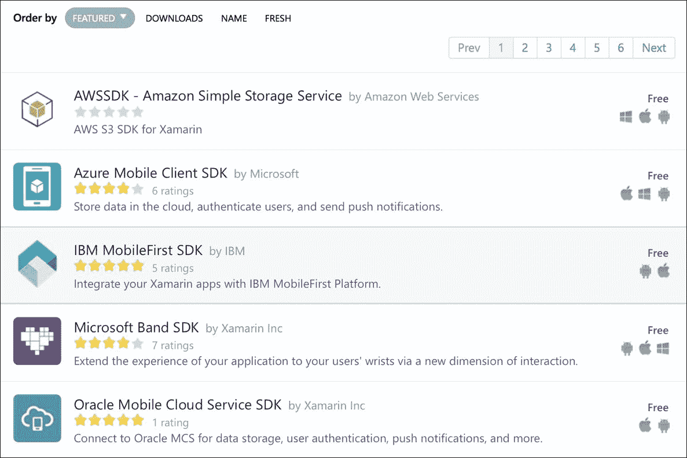
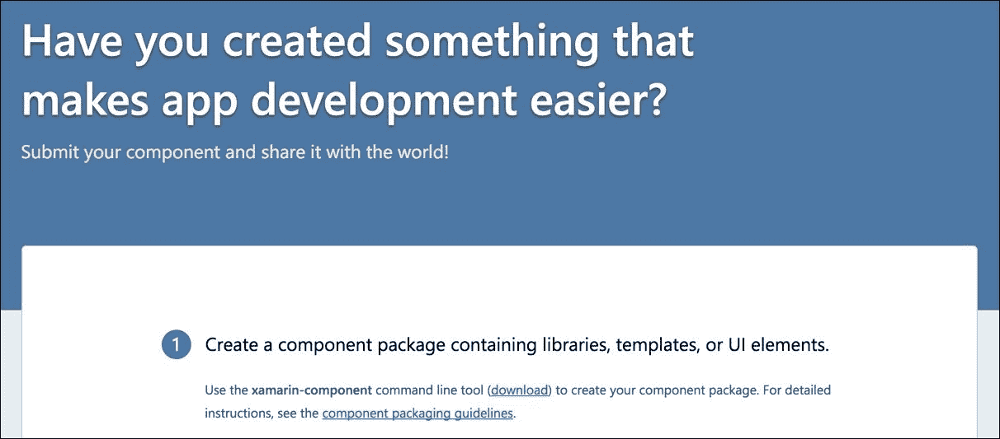
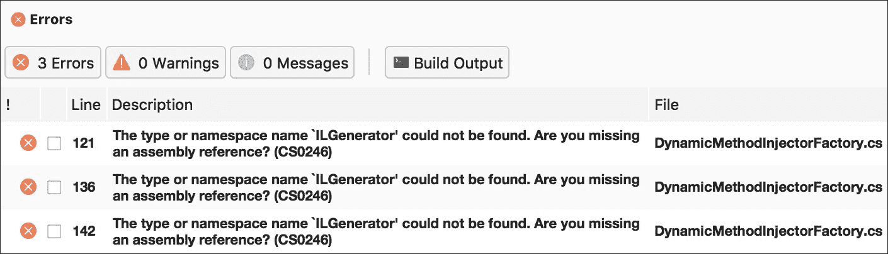
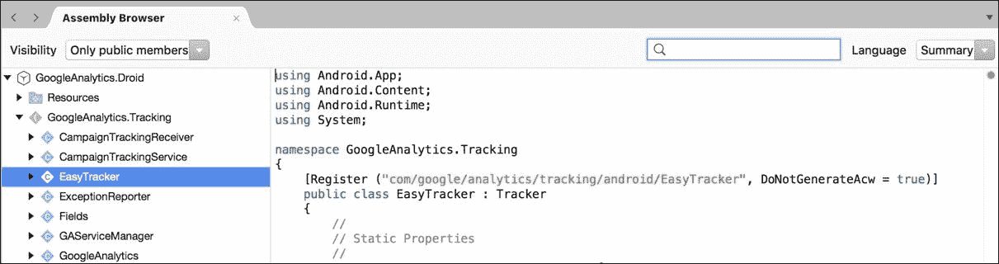

# 第十章：第三方库

Xamarin 支持.NET 框架的一个子集，但大部分包括了您在.NET 基类库中期望的所有标准 API。因此，大量的 C#开源库可以直接在 Xamarin 项目中使用。此外，如果一个开源项目没有 Xamarin 或可移植类库版本，将代码移植到 Xamarin 项目中通常非常直接。Xamarin 还支持调用原生 Objective-C 和 Java 库，因此我们将探索这些作为重用现有代码的额外手段。

在本章中，我们将涵盖以下内容：

+   Xamarin 组件商店

+   移植现有的 C#库

+   Objective-C 绑定

+   Java 绑定

# Xamarin 组件商店

向项目中添加第三方组件的主要且明显的方式是通过 Xamarin 组件商店。组件商店与所有 C#开发者都熟悉的*NuGet 包管理器*非常相似，不同之处在于组件商店还包含不免费的付费组件。所有 Xamarin 组件还必须包含完整的示例项目和入门指南，而 NuGet 在其包中并不固有地提供文档。

所有`Xamarin.iOS`和`Xamarin.Android`项目都带有一个`Components`文件夹。要开始使用，只需右键点击该文件夹，选择**获取更多组件**来启动商店对话框，如下面的截图所示：



在撰写本书时，有超过 200 个组件可用于增强您的 iOS 和 Android 应用程序。这是寻找 Xamarin 应用程序中最常见组件的好地方。每个组件都附有插图、可能的演示视频、评论以及其他在购买付费组件之前需要的信息。

最知名且有用的组件如下：

+   **Json.NET**：这是在 C#中解析和序列化 JSON 的事实上的标准。 

+   **RestSharp**：这是一个在.NET 中常用的简单 REST 客户端。

+   **SQLite.NET**：这是一个简单的**对象关系映射**（**ORM**）工具，用于在移动应用程序中操作本地 SQLite 数据库。

+   **Facebook SDK**：这是 Facebook 提供的标准软件开发工具包，用于将 Facebook 的服务集成到您的应用程序中。

+   **Xamarin.Mobile**：这是一个跨平台库，通过公共 API 访问设备的联系人、GPS、照片库和相机。

+   **ZXing.Net.Mobile**：流行的条形码扫描库**ZXing**（**Zebra Crossing**）的.NET 版本。

请注意，其中一些库是原生 Java 或 Objective-C 库，而有些则是纯 C#库。Xamarin 从底层开始构建，以支持调用原生库，因此组件商店提供了许多 Objective-C 或 Java 开发者在开发移动应用程序时会使用的常见库。

你也可以将你自己的组件提交到组件商店。如果你有一个有用的开源项目，或者只是想赚点外快，创建一个组件很简单。我们在这本书中不会涉及，但可以访问[`components.xamarin.com/submit`](http://components.xamarin.com/submit)了解该主题的完整文档，如下面的截图所示：



# 迁移现有 C#库

尽管 Xamarin 正在成为一个流行的平台，但许多开源.NET 库在支持`Xamarin.iOS`和`Xamarin.Android`方面还远远跟不上。但在这些情况下，你绝对不是没有机会。通常，如果库有 Silverlight 或 Windows Phone 版本，你可以简单创建一个 iOS 或 Android 类库，并添加文件，无需更改代码。

为了说明这个过程，让我们迁移一个没有 Xamarin 或可移植类库支持的的开源项目。我选择了一个名为**Ninject**的依赖注入库，因为它的实用性和与忍者的关联。更多关于该库的信息可以在[`www.ninject.org/`](http://www.ninject.org/)找到。

让我们开始设置库以与 Xamarin 项目一起工作，如下所示：

1.  首先，从[`github.com/ninject/ninject`](https://github.com/ninject/ninject)下载 Ninject 的源代码。

1.  创建一个名为`Ninject.iOS`的新的解决方案，其中包含一个**iOS 类库**项目。

1.  将`Ninject`主项目中的所有文件链接进来。确保使用**添加现有文件夹**对话框以加快此过程。

### 提示

如果你不太熟悉 GitHub，我建议下载 GitHub 桌面客户端，这是一个适用于 Windows 或 OS X 的优质客户端应用，可在[`desktop.github.com/`](https://desktop.github.com/)找到。

现在，尝试编译`Ninject.iOS`项目；你会在一个名为`DynamicMethodFactory.cs`的文件中遇到几个编译错误，如下面的截图所示：



打开`DynamicMethodInjectorFactory.cs`文件，并注意文件顶部以下代码：

```kt
#if !NO_LCG 
namespace Ninject.Injection 
{ 
    using System; 
    using System.Reflection; 
    using System.Reflection.Emit; 
    using Ninject.Components; 

/// *** File contents here *** 

#endif 

```

由于苹果平台的限制，在 iOS 上无法使用`System.Reflection.Emit`。幸运的是，库作者创建了一个名为`NO_LCG`（代表**轻量级代码生成**）的预处理器指令，以允许库在不支持`System.Reflection.Emit`的平台运行。

为了修复我们的 iOS 项目，请按照以下步骤操作：

1.  打开项目选项，导航到**构建** | **编译器**部分。

1.  在**配置**下拉菜单中，为**调试**和**发布**的**定义符号**字段添加`NO_LCG`。

1.  点击**确定**以保存你的更改。

如果你现在编译项目，它将成功完成，并创建一个`Ninject.iOS.dll`文件，你可以从任何`Xamarin.iOS`项目中引用它。你也可以直接引用`Ninject.iOS`项目，而不是使用`*.dll`文件。

在这一点上，你可能希望重复该过程以创建一个`Xamarin.Android`类库项目。幸运的是，`Xamarin.Android`支持`System.Reflection.Emit`，所以如果你愿意，可以跳过添加额外的预处理器指令。

# Objective-C 绑定

Xamarin 开发了一个复杂的系统，用于在 iOS 项目中从 C#调用本地 Objective-C 库。`Xamarin.iOS`的核心使用相同的技术来调用**UIKit**、**CoreGraphics**和其他 iOS 框架中的本地 Apple API。开发者可以使用简单的接口和属性创建 iOS 绑定项目，将 Objective-C 类和方法暴露给 C#。

为了帮助创建 Objective-C 绑定，Xamarin 创建了一个名为**Objective Sharpie**的小工具，它可以处理 Objective-C 头文件并导出有效的 C#定义，以便添加到绑定项目中。这个工具是大多数绑定的良好起点，在大多数情况下，它可以让你的绑定项目完成大约 75%的工作。大多数时候，你可能想要手动编辑并精细调整，使其更友好地适应 C#。

### 提示

请注意，iOS 绑定项目可以在 Visual Studio 中创建；然而，Objective Sharpie 是一个 OS X 的命令行工具。它利用了 Xcode 中包含的工具，因此 iOS 绑定开发最好在 Mac OS X 上完成。

作为示例，我们将为 iOS 编写 Google Analytics 库的绑定。这是一个简单且有用的库，可以跟踪你的 iOS 或 Android 应用程序中的用户活动。在编写时，Google Analytics SDK 的版本是 3.17，因此随着新版本的发布，这些说明可能会发生变化。

从[`developer.xamarin.com/guides/cross-platform/macios/binding/objective-sharpie/`](https://developer.xamarin.com/guides/cross-platform/macios/binding/objective-sharpie/)下载并安装 Objective Sharpie，并执行以下步骤：

1.  从[`tinyurl.com/GoogleAnalyticsForiOS`](https://tinyurl.com/GoogleAnalyticsForiOS)下载最新的 iOS Google Analytics SDK。

1.  创建一个新的**iOS** | **绑定库**项目，名为`GoogleAnalytics.iOS`。

1.  从第一步中提取 zip 文件的内容，并将`GoogleAnalytics`文件夹移动到与绑定项目相同的目录中。

1.  打开**终端**并导航到新项目的同一目录。

1.  使用以下命令运行**Objective Sharpie**：

```kt
        sharpie bind --output=. --namespace=GoogleAnalytics.iOS 
          --sdk=iphoneos10.0 ./GoogleAnalytics/Library/*.h 
        mv -f ApiDefinitions.cs ApiDefinition.cs 
        mv -f StructsAndEnums.cs Structs.cs 

```

Objective Sharpie 将输出两个文件：`ApiDefinitions.cs`和`Structs.cs`。接下来的两个命令将把文件复制到由**绑定库**项目模板创建的默认文件之上。

### 提示

请注意，在编写此命令时，使用了 iOS 10 SDK。要发现你需要为`--sdk`选项输入什么，请运行`sharpie xcode --sdks`，你将在输出中看到打印出的值。

现在，回到你的绑定项目，你会注意到 Objective Sharpie 已经为库中头文件中发现的每个类生成了一个接口定义。它还生成了库使用的许多 `enum` 值，并在可能的情况下更改大小写和命名约定以更接近 C#。

在阅读绑定内容时，你会注意到几个 C# 属性，它们定义了关于 Objective-C 库的不同方面，例如以下内容：

+   `BaseType`：这会将接口声明为一个 Objective-C 类。基类（也称为超类）会传递给属性。如果没有基类，应使用 `NSObject`。

+   `Export`：这会在 Objective-C 类上声明一个方法或属性。传递一个将 Objective-C 名称映射到 C# 名称的字符串。Objective-C 方法名通常如下形式：`myMethod:someParam:someOtherParam`。

+   `Static`：这会将方法或属性标记为 C# 中的 `static`。

+   `Bind`：用于属性上，将 getter 或 setter 映射到不同的 Objective-C 方法。Objective-C 属性可以为属性的 getter 或 setter 重命名。

+   `NullAllowed`：这允许将 `null` 传递给方法或属性。默认情况下，如果发生这种情况，将抛出异常。

+   `Field`：这会声明一个 Objective-C 字段，在 C# 中作为公共变量暴露。

+   `Model`：这标识了一个类到 `Xamarin.iOS`，其方法可以选择性地被重写。这通常用于 Objective-C 委托。

+   `Internal`：这用 C# 内部关键字标记生成的成员。它可以用来隐藏那些你不想暴露给外部世界的特定成员。

+   `Abstract`：这标识了一个 Objective-C 方法为必需的，与 `Model` 密切相关。在 C# 中，它将生成一个抽象方法。

需要知道的唯一其他规则是如何定义构造函数。由于 C# 接口不支持构造函数，Xamarin 必须为此发明一个约定。

要定义除了默认构造函数之外的构造函数，请使用以下代码：

```kt
[Export("initWithFrame:")] 
IntPtr Constructor(RectangleF frame); 

```

这将在类上定义一个构造函数，该构造函数以 `RectangleF` 作为参数。方法名 `Constructor` 和返回类型 `IntPtr` 会让 Xamarin 编译器生成一个构造函数。

现在，让我们回到我们的绑定项目以完成所有设置。如果在这一点上编译项目，你会得到几个编译错误。让我们逐一修复它们，如下所示：

1.  将 Google Analytics 下载中的 `libGoogleAnalyticsServices.a` 和 `libAdIdAccess.a` 添加为**本地引用**。

1.  更改 `Structs.cs` 中找到的枚举 `GAILogLevel` 和 `GAIDispatchResult` 的基类型为 `ulong`。

1.  从 `ApiDefinitions.cs` 中找到的 `Constants` 类中移除 `[Static]` 的重复声明。

1.  移除所有的 `Verify` 属性。这些是 Objective Sharpie 对其执行的操作不确定的地方。在我们的示例中，它们都是好的，所以安全地移除它们。

在这一点上，如果你尝试在 iOS 项目中使用该库，你会得到如下错误：

```kt
Error MT5210: Native linking failed, undefined symbol:
 _FooBar. Please verify that all the necessary frameworks
 have been referenced and native libraries are properly
 linked in.

```

我们需要定义 Objective-C 库使用的其他框架和库。这类似于 C#中引用的工作方式。如果我们查看 Google Analytics 文档，它会告诉你必须添加`CoreData`、`SystemConfiguration`和`libsqlite3.dylib`。

右键点击到`libGoogleAnalyticsServices`的本地引用，选择**属性**，并进行以下更改：

1.  将`Frameworks`设置为`CoreData SystemConfiguration`。

1.  将`Linker Flags`设置为`-lsqlite3`。

原生 Objective-C 库通过以下选项之一引用其他库：

+   **框架**：将它们添加到`LinkWith`属性的`Frameworks`值中，用空格分隔。

+   **弱框架**：以同样的方式将它们添加到`LinkWith`属性的`WeakFrameworks`属性中。弱框架是可以忽略的库（如果找不到）。在这种情况下，iOS 6 中添加了`AdSupport`；然而，这个库仍然可以在旧版本的 iOS 上工作。

+   **动态库**：如`libz.dylib`可以在`LinkerFlags`中声明。通常，去掉`.dylib`扩展名，并将`lib`替换为`-l`。

实施这些更改后，你将能够从 iOS 项目中成功使用该库。要了解有关 Objective-C 绑定的完整文档，请访问 Xamarin 文档网站：[`developer.xamarin.com/guides/ios/`](https://developer.xamarin.com/guides/ios/)。

# Java 绑定

与 iOS 类似，Xamarin 完全支持通过`Xamarin.Android`从 C#调用 Java 库。原生 Android SDK 以这种方式工作，开发者可以利用`Android Java Bindings`项目在 C#中利用其他原生 Java 库。这里的主要区别是，与 Objective-C 绑定相比，手动操作要少得多。Java 语法与 C#非常相似，因此许多映射都是一一对应的。此外，Java 的库中包含了元数据信息，Xamarin 利用这些信息自动生成调用 Java 所需的 C#代码。

举个例子，让我们为 Google Analytics SDK 的 Android 版本创建一个绑定。在开始之前，下载 SDK：[`developers.google.com/analytics/devguides/collection/android/v3/`](https://developers.google.com/analytics/devguides/collection/android/v3/)。在撰写本文时，Google Analytics 正在迁移到 Google Play Services，但我们将使用这个 Java 库作为一个练习，用于创建供 C#使用的 Java 绑定。

让我们按照以下步骤开始创建 Java 绑定：

1.  在 Xamarin Studio 中启动一个全新的`Android | Library | Bindings Library`项目。如果你愿意，可以使用与 iOS 相同的解决方案。

1.  将项目命名为`GoogleAnalytics.Droid`。

1.  从 Android SDK 中将`libGoogleAnalyticsServices.jar`添加到项目下的`Jars`文件夹中。

1.  构建项目。你将得到一些错误，我们稍后会解决这些问题。

你在 Java 绑定上花费的大部分时间将用于修复阻止生成的 C#代码编译的小问题。但是不要担心；许多库在第一次尝试时无需进行任何更改就能正常工作。通常，Java 库越大，你需要做的工作就越多，以使其与 C#一起工作。

### 提示

请注意，如果你首次编译时没有错误，但是有许多警告，提示类似于`unsupported major.minor version 52.0`的内容，那么你需要安装较新版本的 Java JDK。从[`tinyurl.com/XamarinJDK8`](http://tinyurl.com/XamarinJDK8)下载 JDK 1.8，并在设置中指向 Xamarin Studio 或 Visual Studio 的新版本 JDK。

你可能会遇到以下问题类型：

+   **Java 混淆**：如果库通过像**ProGuard**这样的混淆工具运行，那么类和方法名称可能不是有效的 C#名称。

+   **协变返回类型**：Java 对于子类中重写方法的返回类型有不同的规则。因此，你可能需要修改生成的 C#代码的返回类型以编译通过。

+   **可见性**：Java 的访问性规则与 C#的不同；子类中方法的可见性可以改变。有时你需要在 C#中改变可见性以使其编译通过。

+   **命名冲突**：有时，C#代码生成器可能会犯一些错误，生成两个名称相同的成员或类。

+   **Java 泛型**：Java 中的泛型类常常会在 C#中引起问题。

# 在 Java 绑定中使用 XPath

因此，在我们开始解决 Java 绑定中的这些问题之前，首先让我们清理项目中的命名空间。默认情况下，Java 命名空间的形式为`com.mycompany.mylibrary`，所以让我们将定义更改为更接近 C#的形式。在项目的`Transforms`目录中，打开`Metadata.xml`，并在根元数据节点内添加以下 XML 标签：

```kt
<attr path="/api/package[@name='com.google.analytics.tracking   
  .android']" name="managedName">GoogleAnalytics.Tracking</attr> 

```

`attr`节点告诉 Xamarin 编译器需要替换 Java 定义中的什么内容，以另一个值。在这种情况下，我们将包的`managedName`替换为`GoogleAnalytics.Tracking`，因为它在 C#中更有意义。路径值可能看起来有点奇怪，这是因为它使用了名为**XPath**的 XML 匹配查询语言。一般来说，可以把它看作是 XML 的模式匹配查询。要了解 XPath 语法的完整文档，请查看网络上的一些资源，例如[`w3schools.com/xpath`](http://w3schools.com/xpath)。

在这一点上，你可能会问自己，XPath 表达式与什么匹配？回到 Xamarin Studio，在顶部的解决方案上右键点击。选择 **显示选项** | **显示所有文件**。在 `obj` 文件夹下的 `Debug` 文件夹中打开 `api.xml`。这是 Java 定义文件，描述了 Java 库中的所有类型和方法。你可能注意到这里的 XML 直接与我们即将编写的 XPath 表达式相关。

接下来的一步，让我们移除所有我们不打算在此库中使用的包（或命名空间）。对于大型库来说，这通常是个好主意，因为你不想浪费时间修复你甚至不会从 C# 调用的库部分的问题。

在 `Metadata.xml` 中添加以下声明：

```kt
<remove-node path="/api/package[@name='com.google.analytics
   .containertag.common']" /> 
<remove-node path="/api/package[@name='com.google.analytics
   .containertag.proto']" /> 
<remove-node path="/api/package[@name='com.google.analytics
   .midtier.proto.containertag']" /> 
<remove-node path="/api/package[@name='com.google.android
   .gms.analytics.internal']" /> 
<remove-node path="/api/package[@name='com.google.android
   .gms.common.util']" /> 
<remove-node 
   path="/api/package[@name='com.google.tagmanager']" /> 
<remove-node
   path="/api/package[@name='com.google.tagmanager.proto']" /> 
<remove-node
   path="/api/package[@name='com.google.tagmanager.protobuf.nano']" /> 

```

### 提示

请注意，移除这些命名空间实际上并没有从你的绑定中删除编译后的 Java 代码。它只是阻止绑定项目生成使用此命名空间中的类的 C# 代码。

现在当你构建库时，我们可以开始解决问题。你收到的第一个错误将是如下所示的内容：

```kt
GoogleAnalytics.Tracking.GoogleAnalytics.cs(74,74):
 Error CS0234: The type or namespace name `TrackerHandler'
 does not exist in the namespace `GoogleAnalytics.Tracking'.
 Are you missing an assembly reference?

```

如果我们在 `api.xml` 文件中找到 `TrackerHandler`，我们会看到以下类声明：

```kt
<class
   abstract="true" deprecated="not deprecated"
   extends="java.lang.Object"
   extends-generic-aware="java.lang.Object"
   final="false" name="TrackerHandler"
   static="false" visibility=""/> 

```

那么，你能发现问题所在吗？我们需要填写 `visibility` XML 属性，不知何故它是空的。在 `Metadata.xml` 中添加以下行：

```kt
<attr
  path="/api/package[@name='com.google.analytics
  .tracking.android']/class[@name='TrackerHandler']"
  name="visibility">public</attr> 

```

这个 XPath 表达式将在 `com.google.analytics.tracking.android` 包内定位 `TrackerHandler` 类，并将 `visibility` 更改为 `public`。

如果你现在构建项目，它将成功完成，但会有一些警告。在 Java 绑定项目中，尽可能修复警告是个好主意，因为它们通常表示一个类或方法被排除在绑定之外。注意以下警告：

```kt
GoogleAnalytics.Droid: Warning BG8102:
 Class GoogleAnalytics.Tracking.CampaignTrackingService has 
 unknown base type android.app.IntentService (BG8102) 
 (GoogleAnalytics.Droid)

```

要解决这个问题，在 `api.xml` 中找到 `CampaignTrackingService` 的类型定义，如下所示：

```kt
<class
   abstract="false" deprecated="not deprecated"
   extends="android.app.IntentService"
   extends-generic-aware="android.app.IntentService"
   final="false" name="CampaignTrackingService"
   static="false" visibility="public"> 

```

解决此问题的方法是将基类更改为 `Xamarin.Android` 对 `IntentService` 的定义。在 `Metadata.xml` 中添加以下代码：

```kt
<attr
   path="/api/package[@name='com.google.analytics
   .tracking.android']/class[@name='CampaignTrackingService']"
   name="extends">mono.android.app.IntentService</attr> 

```

这将 `extends` 属性更改为使用 `Mono.Android.dll` 中的 `IntentService`。我通过在 Xamarin Studio 的 **程序集浏览器** 中打开 `Mono.Android.dll` 并查看 `Register` 属性找到了这个类的 Java 名称，如下面的截图所示：



在 Xamarin Studio 中查看 `*.dll` 文件，你只需打开它们即可。你也可以在你的项目中的 `References` 文件夹里双击任何程序集。

如果你现在构建绑定项目，我们剩下最后一个错误，如下所示：

```kt
GoogleAnalytics.Tracking.CampaignTrackingService.cs(24,24):
 Error CS0507:
 `CampaignTrackingService.OnHandleIntent(Intent)':
 cannot change access modifiers when overriding `protected' 
 inherited member
 `IntentService.OnHandleIntent(Android.Content.Intent)'
 (CS0507) (GoogleAnalytics.Droid)

```

如果你导航到 `api.xml` 文件，你可以看到 `OnHandleIntent` 的定义如下：

```kt
<method
   abstract="false" deprecated="not deprecated" final="false"
   name="onHandleIntent" native="false" return="void"
   static="false" synchronized="false" visibility="public"> 

```

我们可以看到，这个类的 Java 方法是`public`，但基类是`protected`。因此，最好的解决办法是将 C# 版本也改为`protected`。编写一个匹配此条件的 XPath 表达式要复杂一些，但幸运的是，Xamarin 有一个简单的方法来获取它。如果你在 Xamarin Studio 的**错误**面板中双击错误消息，你会在生成的 C# 代码中看到以下注释：

```kt
// Metadata.xml XPath method reference:
   path="/api/package[@name='com.google.analytics
   .tracking.android']/class[@name='CampaignTrackingService']
   /method[@name='onHandleIntent' and count(parameter)=1 and
   parameter[1][@type='android.content.Intent']]" 

```

复制`path`的值，并在`Metadata.xml`中添加以下内容：

```kt
<attr path="/api/package[@name='com.google.analytics
   .tracking.android']/class[@name='CampaignTrackingService']
   /method[@name='onHandleIntent' and count(parameter)=1 and
   parameter[1][@type='android.content.Intent']]"
   name="visibility">protected</attr> 

```

现在，我们可以构建项目，并且只有与`[Obsolete]`成员被覆盖相关的警告（无需担心）。这个库现在可以用于你的`Xamarin.Android`项目中了。

但是，如果你开始使用这个库，会注意到方法的参数名称是`p0`、`p1`、`p2`等等。以下是`EasyTracker`类的几个方法定义：

```kt
public static EasyTracker GetInstance(Context p0); 
public static void SetResourcePackageName(string p0); 
public virtual void ActivityStart(Activity p0); 
public virtual void ActivityStop(Activity p0); 

```

你可以想象，在不了解正确的参数名称的情况下使用 Java 库会有多困难。之所以这样命名参数，是因为 Java 库的元数据不包括为每个参数设置正确名称的信息。因此，`Xamarin.Android`尽其所能，按顺序自动为每个参数命名。

要重命名这个类中的参数，我们可以在`Metadata.xml`中添加以下内容：

```kt
<attr path="/api/package[@name='com.google.analytics
   .tracking.android']/class[@name='EasyTracker']
   /method[@name='getInstance']/parameter[@name='p0']"
   name="name">context</attr> 
<attr path="/api/package[@name='com.google.analytics
   .tracking.android']/class[@name='EasyTracker']
   /method[@name='setResourcePackageName']/parameter[@name='p0']"
   name="name">packageName</attr> 
<attr path="/api/package[@name='com.google.analytics
   .tracking.android']/class[@name='EasyTracker']
   /method[@name='activityStart']/parameter[@name='p0']"
   name="name">activity</attr> 
<attr path="/api/package[@name='com.google.analytics
   .tracking.android']/class[@name='EasyTracker'] 
  /method[@name='activityStop']/parameter[@name='p0']"
   name="name">activity</attr> 

```

在重新构建绑定项目时，这将有效地为`EasyTracker`类中的这四个方法重命名参数。此时，我建议你查看计划在应用程序中使用的类，并重命名这些参数，以便它们对你更有意义。你可能需要参考 Google Analytics 的文档来确保命名正确。幸运的是，SDK 中包含了一个`javadocs.zip`文件，提供了库的 HTML 参考资料。

要了解有关实现 Java 绑定的完整参考，请务必查看 Xamarin 的文档网站：[`developer.xamarin.com/guides/android/`](https://developer.xamarin.com/guides/android/)。我们在为 Google Analytics 库创建绑定时遇到的肯定还有比这更复杂的情况。

# 摘要

在本章中，我们从 Xamarin 组件商店向 Xamarin 项目添加了库，并将现有的 C# 库 Ninject 移植到了`Xamarin.iOS`和`Xamarin.Android`。接下来，我们安装了 Objective Sharpie 并探索了其生成 Objective-C 绑定的用法。最后，我们为 iOS 的 Google Analytics SDK 编写了一个功能性的 Objective-C 绑定，以及为 Android 的 Google Analytics SDK 编写了一个 Java 绑定。我们还编写了几个 XPath 表达式来清理 Java 绑定。

对于从您的 `Xamarin.iOS` 和 `Xamarin.Android` 应用程序中使用现有的第三方库，有几种可用的选项。我们从使用 Xamarin 组件商店、移植现有代码，以及设置可供 C# 使用的 Java 和 Objective-C 库等方面进行了全面了解。在下一章中，我们将介绍 `Xamarin.Mobile` 库，作为一种访问用户联系人、相机和 GPS 位置的方法。
