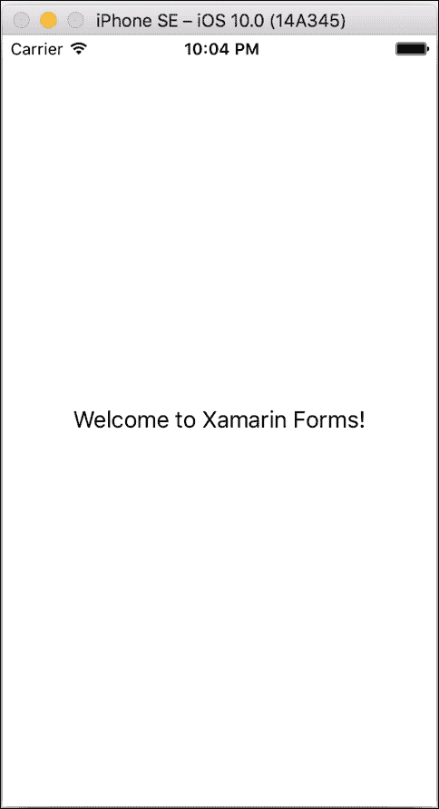
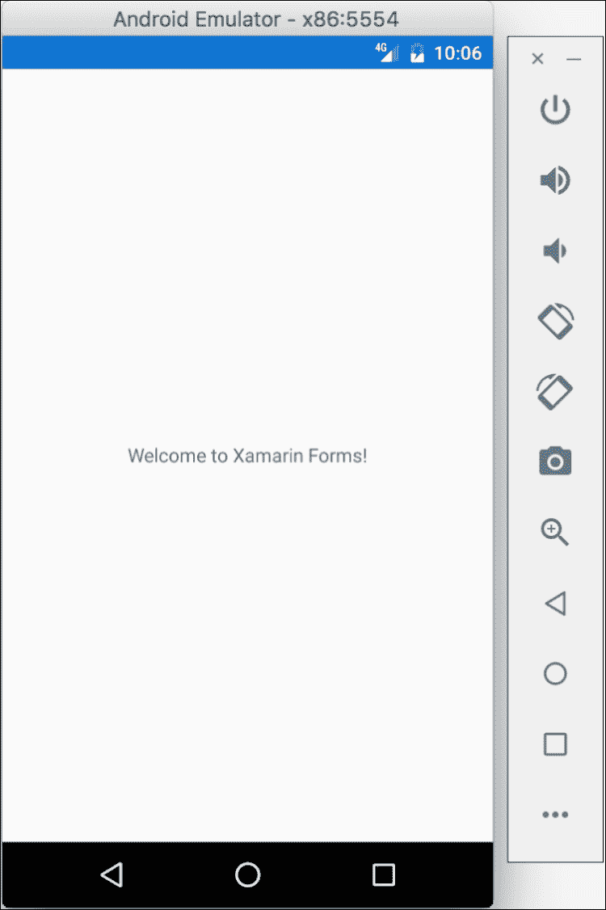
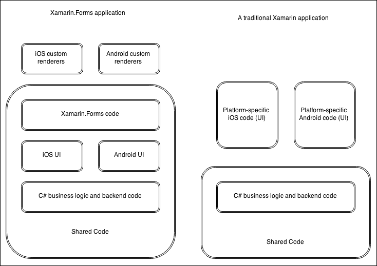
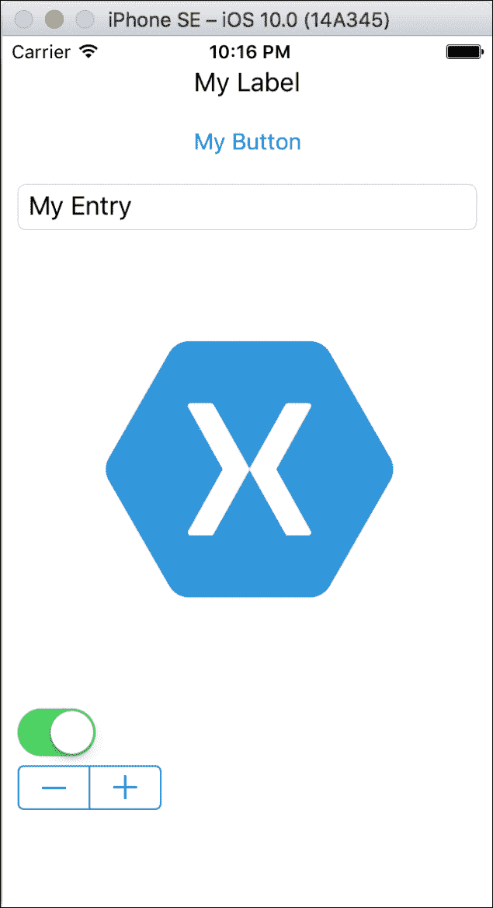
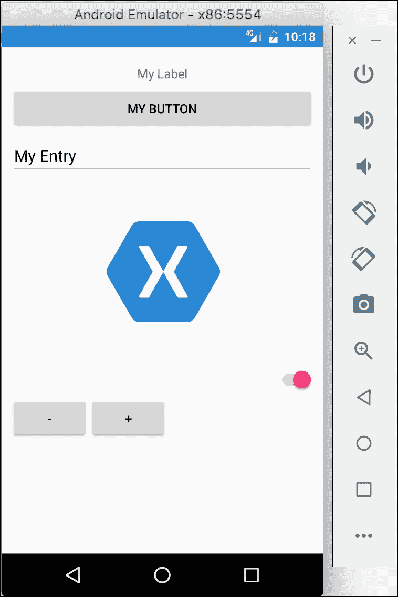
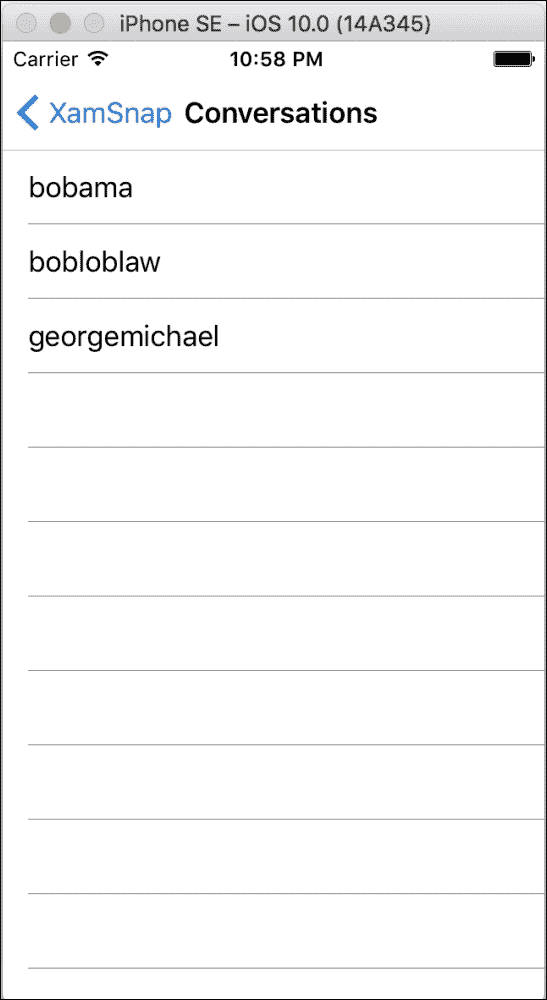

# 第十一章：Xamarin.Forms

自从 Xamarin 公司成立以来，他们的宗旨一直是将 iOS 和 Android 的本地 API 以符合 C# 习惯的方式呈现出来。这在最初是一个很好的策略，因为使用 Xamarin.iOS 或 Xamarin.Android 构建的应用程序几乎与本地 Objective-C 或 Java 应用程序无法区分。代码共享通常仅限于非 UI 代码，这为 Xamarin 生态系统留下了一个潜在的空白：跨平台 UI 抽象。Xamarin.Forms 就是解决这一问题的方案，它是一个跨平台 UI 框架，在每个平台上渲染本地控件。`Xamarin.Forms` 是一个非常适合那些懂 C#（和 XAML）但可能不想深入了解本地 iOS 和 Android API 的人的框架。

在本章中，我们将进行以下操作：

+   创建 Xamarin.Forms 中的 *Hello World*

+   讨论 Xamarin.Forms 架构

+   在 Xamarin.Forms 中使用 XAML

+   学习 Xamarin.Forms 中的数据绑定和 MVVM

# 在 Xamarin.Forms 中创建 Hello World

要了解如何组合 Xamarin.Forms 应用程序，让我们先创建一个简单的 *Hello World* 应用程序。

打开 Xamarin Studio 并执行以下步骤：

1.  从新建解决方案对话框中创建一个新的**多平台** | **应用** | **表单应用**项目。

1.  为你的解决方案取一个合适的名字，比如 `HelloForms`。

1.  确保**使用便携式类库**被选中。

1.  点击**下一步**，然后点击**创建**。

注意到成功创建了以下三个新项目：

+   HelloForms

+   HelloForms.Android

+   HelloForms.iOS

在 `Xamarin.Forms` 应用程序中，大部分代码将是共享的，每个特定平台的项目只是一小部分代码，用于启动 Xamarin.Forms 框架。

让我们检查一下 Xamarin.Forms 应用程序的最小组成部分：

+   `HelloForms` PCL 库中的 `App.xaml` 和 `App.xaml.cs` —— 这个类是 Xamarin.Forms 应用程序的主要启动点。一个简单的属性 `MainPage` 被设置为应用程序中的第一页。在默认项目模板中，`HelloFormsPage` 被创建，其中有一个单一标签，在 iOS 上将渲染为 `UILabel`，在 Android 上将渲染为 `TextView`。

+   `HelloForms.Android` Android 项目中的 `MainActivity.cs` —— Android 应用程序的主要启动活动。对于 Xamarin.Forms 来说，这里重要的是调用 `Forms.Init(this, bundle)`，它初始化了 Xamarin.Forms 框架的 Android 特定部分。接下来是调用 `LoadApplication(new App())`，它启动了我们的 Xamarin.Forms 应用程序。

+   `HelloForms.iOS` iOS 项目中的 `AppDelegate.cs` —— 与 Android 非常相似，不同之处在于 iOS 应用程序使用 `UIApplicationDelegate` 类启动。`Forms.Init()` 将初始化 Xamarin.Forms 的 iOS 特定部分，与 Android 的 `LoadApplication(new App())` 类似，将启动 Xamarin.Forms 应用程序。

接着运行 iOS 项目；你应该能看到类似以下截图的内容：



如果您运行 Android 项目，将得到一个非常类似于以下屏幕截图所示的 iOS UI，但使用的是原生 Android 控件：



### 提示

尽管这本书没有涉及，但 Xamarin.Forms 也支持 Windows Phone、WinRT 和 UWP 应用程序。然而，要为 Windows 平台开发，需要一台运行 Windows 和 Visual Studio 的 PC。如果您能让 Xamarin.Forms 应用程序在 iOS 和 Android 上运行，那么让 Windows Phone 版本运行应该轻而易举。

# 理解 Xamarin.Forms 背后的架构

开始使用 Xamarin.Forms 非常简单，但深入了解其幕后原理以理解一切是如何组合在一起的总是好的。在这本书的前几章中，我们使用原生 iOS 和 Android API 直接创建了一个跨平台应用程序。某些应用程序更适合这种开发方法，因此在选择最适合您应用框架时，理解 Xamarin.Forms 应用程序与*传统* Xamarin 应用程序之间的区别非常重要。

Xamarin.Forms 是原生 iOS 和 Android API 之上的抽象，您可以直接从 C#调用。因此，Xamarin.Forms 使用的是与*传统* Xamarin 应用程序相同的 API，同时提供了一个框架，允许您以跨平台的方式定义 UI。这样的抽象层在很多方面都是非常好的，因为它不仅允许您共享推动 UI 的代码，还可以共享可能在标准 Xamarin 应用程序中共享的任何后端 C#代码。然而，主要缺点是性能上会有轻微的影响，这可能使得创建完美流畅的体验变得更加困难。Xamarin.Forms 提供了编写**渲染器**和**效果**的选项，允许您以特定于平台的方式覆盖 UI。这使您能够根据需要使用原生控件。

请查看以下图表中 Xamarin.Forms 应用程序与传统 Xamarin 应用程序之间的区别：



在这两个应用程序中，应用程序的业务逻辑和后端代码可以共享，但 Xamarin.Forms 允许您也可以共享 UI 代码，这是一个巨大的优势。

此外，Xamarin.Forms 应用程序有两个项目模板可供选择，让我们来了解每个选项：

+   **Xamarin.Forms Shared**：创建一个包含所有 Xamarin.Forms 代码的共享项目，以及 iOS 项目和 Android 项目

+   **Xamarin.Forms Portable**：创建一个包含所有共享 Xamarin.Forms 代码的**便携式类库**（**PCL**），以及 iOS 项目和 Android 项目

通常来说，这两种选项对任何应用程序都适用。共享项目基本上是一组代码文件，当其他项目引用它时，这些文件会自动添加。使用共享项目允许你使用预处理器语句来实现平台特定的代码。另一方面，PCL 项目创建了一个可移植的.NET 程序集，可以在 iOS、Android 以及各种其他平台上使用。PCL 不能使用预处理器语句，因此你通常可以使用接口或抽象/基类来设置平台特定的代码。在大多数情况下，我认为 PCL 是一个更好的选择，因为它本质上鼓励更好的编程实践。有关这两种代码共享技术的优缺点，请参见第三章，*iOS 和 Android 之间的代码共享*。

# 在 Xamarin.Forms 中使用 XAML

除了从 C#代码定义 Xamarin.Forms 控件外，Xamarin 还提供了在**可扩展应用程序标记语言（XAML）**中开发用户界面的工具。XAML 是一种声明性语言，基本上是一组映射到 Xamarin.Forms 框架中某个控件的 XML 元素。使用 XAML 类似于使用 HTML 定义网页上的 UI，不同之处在于 Xamarin.Forms 中的 XAML 创建代表原生 UI 的 C#对象。

为了了解 XAML 在 Xamarin.Forms 中的工作原理，让我们创建一个带有不同类型的 Xamarin.Forms 控件的新页面。回到之前的项目`HelloForms`，打开`HelloFormsPage.xaml`文件。在`<ContentPage>`标签之间添加以下 XAML 代码：

```kt
<StackLayout Orientation="Vertical" Padding="10,20,10,10"> 
    <Label Text="My Label" XAlign="Center" /> 
    <Button Text="My Button" /> 
    <Entry Text="My Entry" /> 
    <Image Source="https://www.xamarin.com/content/images/ 
      pages/branding/assets/xamagon.png" /> 
    <Switch IsToggled="true" /> 
    <Stepper Value="10" /> 
</StackLayout> 

```

接着在 iOS 上运行应用程序；你的应用程序看起来会像以下截图：



在 Android 上，应用程序与 iOS 看起来完全相同，只是使用了原生的 Android 控件而不是 iOS 的对应控件：



在我们的 XAML 中，我们创建了一个`StackLayout`控件，它是其他控件的容器。它可以按顺序垂直或水平地布局控件，由`Orientation`值定义。我们还应用了四周和底部 10 的填充，以及顶部 20 的调整以适应 iOS 状态栏。如果你熟悉 WPF 或 Silverlight，你可能熟悉这种定义矩形的语法。Xamarin.Forms 使用相同的语法，即左、上、右和下值，由逗号分隔。

我们还使用了几个内置的 Xamarin.Forms 控件来看看它们是如何工作的：

1.  `Label`：我们在这章前面已经使用过它。仅用于显示文本，在 iOS 上它对应于`UILabel`，在 Android 上对应于`TextView`。

1.  `Button`：一个通用按钮，可以被用户点击。这个控件在 iOS 上映射到`UIButton`，在 Android 上映射到`Button`。

1.  `Entry`：这个控件是单行文本输入。在 iOS 上它映射到`UITextField`，在 Android 上映射到`EditText`。

1.  `Image`：这是一个简单的控件，用于在屏幕上显示图像，对应于 iOS 上的`UIImage`和 Android 上的`ImageView`。我们使用了这个控件的`Source`属性，它从网络地址加载图像。在这个属性上使用 URL 很好，但在可能的情况下最好将图像包含在你的项目中以获得最佳性能。

1.  `Switch`：这是一个开关或切换按钮。在 iOS 上映射到`UISwitch`，在 Android 上映射到`Switch`。

1.  `Stepper`：这是一个通用输入控件，通过两个加减按钮来输入数字。在 iOS 上，这对应于`UIStepper`，而在 Android 上，Xamarin.Forms 使用两个按钮来实现这一功能。

这些只是 Xamarin.Forms 提供的一些控件。还有更复杂的控件，比如`ListView`和`TableView`，你可以期待它们用于提供移动 UI。

尽管在这个例子中我们使用了 XAML，但你也可以用 C# 实现 Xamarin.Forms 页面。下面是使用 C# 实现的例子：

```kt
public class UIDemoPageFromCode : ContentPage 
{ 
  public UIDemoPageFromCode() 
  { 
    var layout = new StackLayout  
    { 
      Orientation = StackOrientation.Vertical, 
      Padding = new Thickness(10, 20, 10, 10), 
    }; 

    layout.Children.Add(new Label  
    { 
      Text = "My Label", 
      XAlign = TextAlignment.Center, 
    }); 

    layout.Children.Add(new Button  
    { 
      Text = "My Button", 
    }); 

    layout.Children.Add(new Image  
    { 
      Source = "https://www.xamarin.com/content/images/pages/ 
        branding/assets/xamagon.png", 
    }); 

    layout.Children.Add(new Switch  
    { 
      IsToggled = true, 
    }); 

    layout.Children.Add(new Stepper  
    { 
      Value = 10, 
    }); 

    Content = layout; 
  } 
} 

```

因此，你可以看到使用 XAML 可能会更加易读，通常在声明 UI 方面比 C# 更好。但是，使用 C# 来定义你的 UI 仍然是一个可行且直接的方法。

# 使用数据绑定和 MVVM

在这一点上，你应该已经掌握了 Xamarin.Forms 的基础知识，但可能会想知道 MVVM 设计模式如何融入其中。MVVM 设计模式最初是为了与 XAML 一起使用，以及 XAML 提供的强大的数据绑定功能，因此它与 Xamarin.Forms 一起使用是一个完美的设计模式。

让我们了解一些关于如何使用 Xamarin.Forms 设置数据绑定和 MVVM 的基础知识：

1.  你的模型和 ViewModel 层在本书前面讲到的 MVVM 模式中基本上保持不变。

1.  你的 ViewModel 应该实现`INotifyPropertyChanged`接口，这有助于数据绑定。为了简化在 Xamarin.Forms 中的操作，你可以使用`BindableObject`基类，并在你的 ViewModel 中值发生变化时调用`OnPropertyChanged`。

1.  Xamarin.Forms 中的任何`Page`或控件都有一个`BindingContext`，这是它绑定的数据对象。通常，你可以为每个视图的`BindingContext`属性设置一个相应的 ViewModel。

1.  在 XAML 中，你可以使用`Text="{Binding Name}"`这样的语法设置数据绑定。这个例子将控件的`Text`属性绑定到`BindingContext`中的对象的`Name`属性。

1.  结合数据绑定，事件可以使用`ICommand`接口转换为命令。因此，例如，`Button`的点击事件可以绑定到 ViewModel 公开的命令。Xamarin.Forms 中有一个内置的`Command`类来支持这一点。

### 提示

在 Xamarin.Forms 中，也可以使用`Binding`类通过 C# 代码设置数据绑定。但是，通常使用 XAML 设置绑定要容易得多，因为语法已经通过 XAML 标记扩展简化了。

现在我们已经了解了基础知识，让我们一步一步地部分转换本书前面提到的`XamSnap`示例应用程序以使用 Xamarin.Forms。在大多数情况下，我们可以重用 Model 和 ViewModel 层，尽管我们需要进行一些小改动以支持与 XAML 的数据绑定。

让我们从创建一个由 PCL 支持的新的 Xamarin.Forms 应用程序开始，名为`XamSnap`：

1.  首先，在`XamSnap`项目中创建三个名为`Views`、`ViewModels`和`Models`的文件夹。

1.  从前面的章节中添加适当的`ViewModels`和`Models`类到`XamSnap`应用程序中，这些可以在`XamSnap`项目中找到。

1.  构建项目，确保一切已保存。你可能会遇到几个编译错误，我们很快就会解决。

我们需要编辑的第一个类是`BaseViewModel`类；打开它并进行以下更改：

```kt
public class BaseViewModel : BindableObject 
{ 
  protected readonly IWebService service =  
    DependencyService.Get<IWebService>(); 
  protected readonly ISettings settings =  
    DependencyService.Get<ISettings>(); 

  bool isBusy = false; 

  public bool IsBusy 
  { 
    get { return isBusy; } 
    set 
    { 
      isBusy = value; 
      OnPropertyChanged(); 
    } 
  } 
} 

```

首先，我们移除了对`ServiceContainer`类的调用，因为 Xamarin.Forms 提供了自己的 IoC 容器，名为`DependencyService`。它的功能与我们前几章构建的容器非常相似，不同之处在于它只有一个方法`Get<T>`，并且通过我们很快会设置的程序集属性来设置注册。

此外，我们移除了`IsBusyChanged`事件，转而使用支持数据绑定的`INotifyPropertyChanged`接口。从`BindableObject`继承为我们提供了辅助方法`OnPropertyChanged`，我们用它来通知 Xamarin.Forms 中的绑定值已更改。注意我们没有向`OnPropertyChanged`传递包含属性名称的`string`。这个方法使用了.NET 4.0 的一个不太知名的特性，称为`CallerMemberName`，它将在运行时自动填充调用属性的名字。

接下来，让我们用`DependencyService`设置所需的服务。打开 PCL 项目根目录中的`App.xaml.cs`文件，并在命名空间声明上方添加以下两行：

```kt
[assembly: Dependency(typeof(XamSnap.FakeWebService))] 
[assembly: Dependency(typeof(XamSnap.FakeSettings))] 

```

`DependencyService`将自动识别这些属性并检查我们声明的类型。这些类型实现的任何接口都将返回给任何未来调用`DependencyService.Get<T>`的调用者。我通常将所有的`Dependency`声明放在`App.cs`文件中，这样它们易于管理和集中管理。

接下来，让我们通过添加一个新属性来修改`LoginViewModel`：

```kt
public Command LoginCommand { get; set; } 

```

我们将很快使用它来绑定`Button`的命令。在视图模型层的最后一个变化是为`MessageViewModel`设置`INotifyPropertyChanged`：

```kt
Conversation[] conversations; 

public Conversation[] Conversations 
{ 
  get { return conversations; } 
  set 
  { 
    conversations = value; 
    OnPropertyChanged(); 
  } 
} 

```

同样，你可以对视图模型层中其余的公共属性重复这个模式，但这个例子我们只需要这些。接下来，在`Views`文件夹中创建一个新的`Forms ContentPage Xaml`文件，名为`LoginPage`。在代码隐藏文件`LoginPage.xaml.cs`中，我们只需要进行一些更改：

```kt
public partial class LoginPage : ContentPage 
{     
  readonly LoginViewModel loginViewModel = new LoginViewModel(); 

  public LoginPage() 
  { 
    Title = "XamSnap"; 
    BindingContext = loginViewModel; 

    loginViewModel.LoginCommand = new Command(async () => 
    { 
      try 
      { 
        await loginViewModel.Login(); 
        await Navigation.PushAsync(new ConversationsPage()); 
      } 
      catch (Exception exc) 
      { 
        await DisplayAlert("Oops!", exc.Message, "Ok");                 
      } 
    }); 

    InitializeComponent(); 
  } 
} 

```

我们在这里做了几件重要的事情，包括将`BindingContext`设置为我们`LoginViewModel`。我们设置了`LoginCommand`，它基本上调用了`Login`方法，并在出现问题时显示消息。如果成功，它还会导航到一个新页面。我们还设置了`Title`，它将显示在应用程序的顶部导航栏中。

接下来，打开`LoginPage.xaml`，我们将在`ContentPage`内添加以下 XAML 代码：

```kt
<StackLayout Orientation="Vertical" Padding="10,10,10,10"> 
    <Entry  
        Placeholder="Username" Text="{Binding UserName}" /> 
    <Entry  
        Placeholder="Password" Text="{Binding Password}"  
        IsPassword="true" /> 
    <Button  
        Text="Login" Command="{Binding LoginCommand}" /> 
    <ActivityIndicator  
        IsVisible="{Binding IsBusy}"  
        IsRunning="true" /> 
</StackLayout> 

```

这将设置两个文本字段、一个按钮和一个微调器的基础，以及使所有内容正常工作的所有绑定。由于我们从`LoginPage`代码后台文件中设置了`BindingContext`，所有属性都绑定到了`LoginViewModel`。

接下来，像之前一样创建一个 XAML 页面`ConversationsPage`，并编辑`ConversationsPage.xaml.cs`代码后台文件：

```kt
public partial class ConversationsPage : ContentPage 
{     
  readonly MessageViewModel messageViewModel =  
    new MessageViewModel(); 

  public ConversationsPage() 
  { 
    Title = "Conversations"; 
    BindingContext = messageViewModel; 

    InitializeComponent(); 
  } 

  protected async override void OnAppearing() 
  { 
    try 
    { 
      await messageViewModel.GetConversations(); 
    } 
    catch (Exception exc) 
    { 
      await DisplayAlert("Oops!", exc.Message, "Ok"); 
    } 
  } 
} 

```

在这个案例中，我们重复了许多相同的步骤。不同之处在于我们使用了`OnAppearing`方法来加载屏幕上显示的对话。

现在，将以下 XAML 代码添加到`ConversationsPage.xaml`中：

```kt
<ListView ItemsSource="{Binding Conversations}"> 
    <ListView.ItemTemplate> 
        <DataTemplate> 
            <TextCell Text="{Binding UserName}" /> 
        </DataTemplate> 
    </ListView.ItemTemplate> 
</ListView> 

```

在这个例子中，我们使用了`ListView`来数据绑定一个项目列表并在屏幕上显示。我们定义了一个`DataTemplate`类，它表示了列表中每个项目的单元集合，这些项目与`ItemsSource`进行了数据绑定。在我们的例子中，为`Conversations`列表中的每个项目创建了一个显示`Username`的`TextCell`。

最后但同样重要的是，我们必须回到`App.xaml.cs`文件并修改启动页面：

```kt
MainPage = new NavigationPage(new LoginPage());  

```

我们在这里使用了`NavigationPage`，以便 Xamarin.Forms 可以在不同的页面之间推送和弹出。这在 iOS 上使用了`UINavigationController`，因此你可以看到每个平台上是如何使用原生 API 的。

在这一点上，如果你编译并运行应用程序，你将得到一个功能性的 iOS 和 Android 应用程序，可以登录并查看对话列表：



# 概述

在本章中，我们介绍了 Xamarin.Forms 的基础知识以及如何用它来构建自己的跨平台应用程序。Xamarin.Forms 对于某些类型的应用程序非常出色，但如果你需要编写更复杂的 UI 或利用原生绘图 API，它可能会有所限制。我们了解了如何使用 XAML 声明 Xamarin.Forms UI，并理解了 Xamarin.Forms 控件在每个平台上的渲染方式。我们还深入探讨了数据绑定的概念以及如何将 MVVM 设计模式与 Xamarin.Forms 一起使用。最后但同样重要的是，我们从本书前面开始将`XamSnap`应用程序移植到 Xamarin.Forms，并且能够重用我们的大部分现有代码。

在下一章中，我们将介绍将应用程序提交到 iOS App Store 和 Google Play 的过程。将你的应用程序放入商店可能是一个耗时的过程，但下一章的指导将为你提供一个良好的开端。
