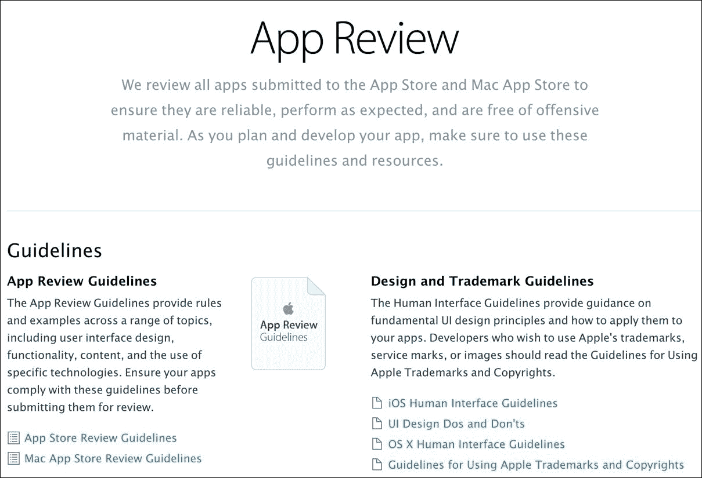
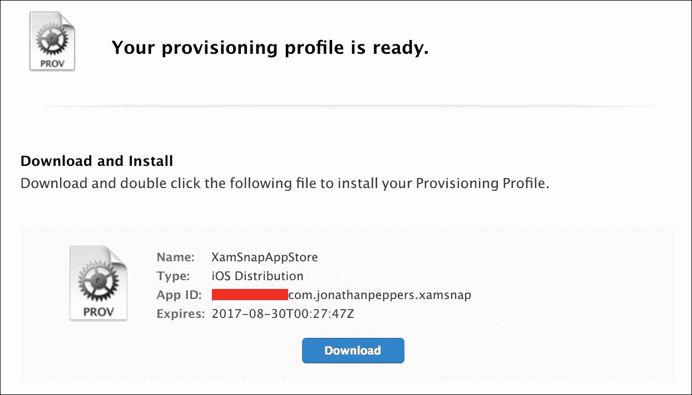
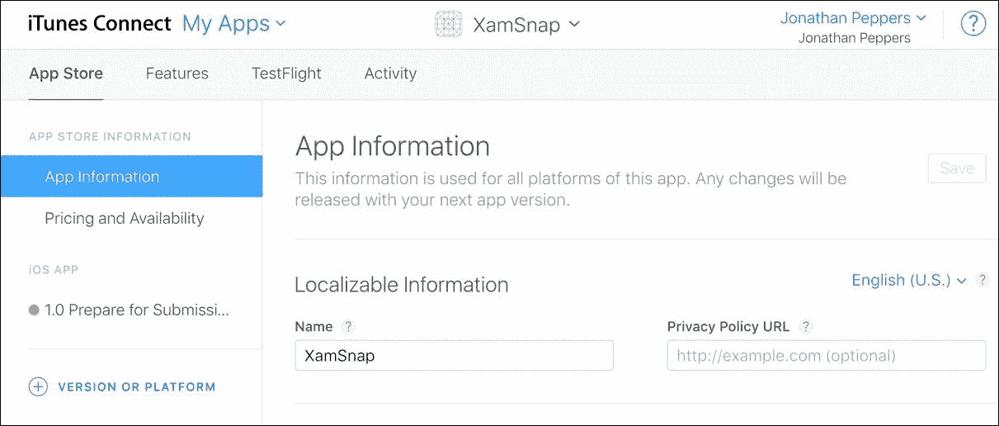
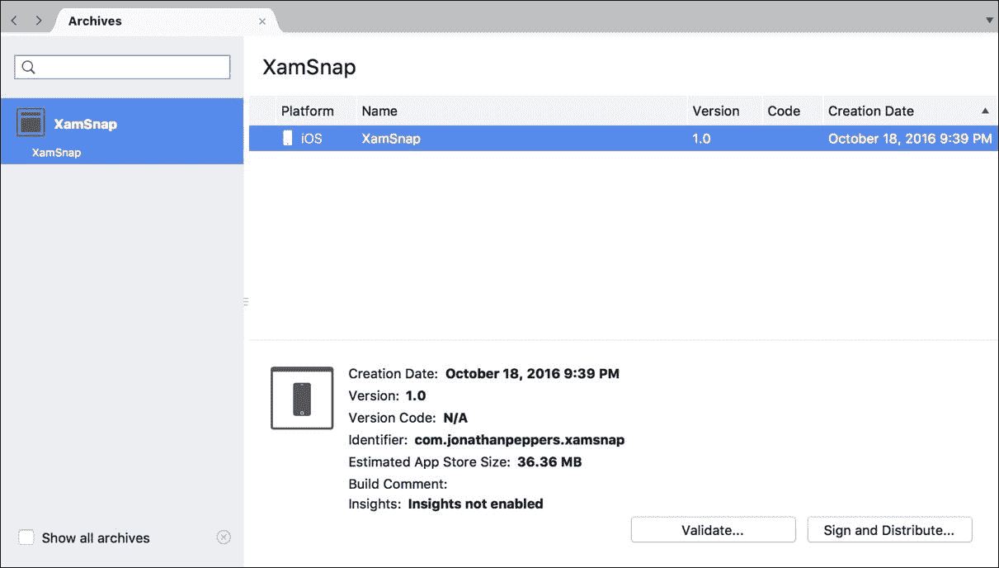
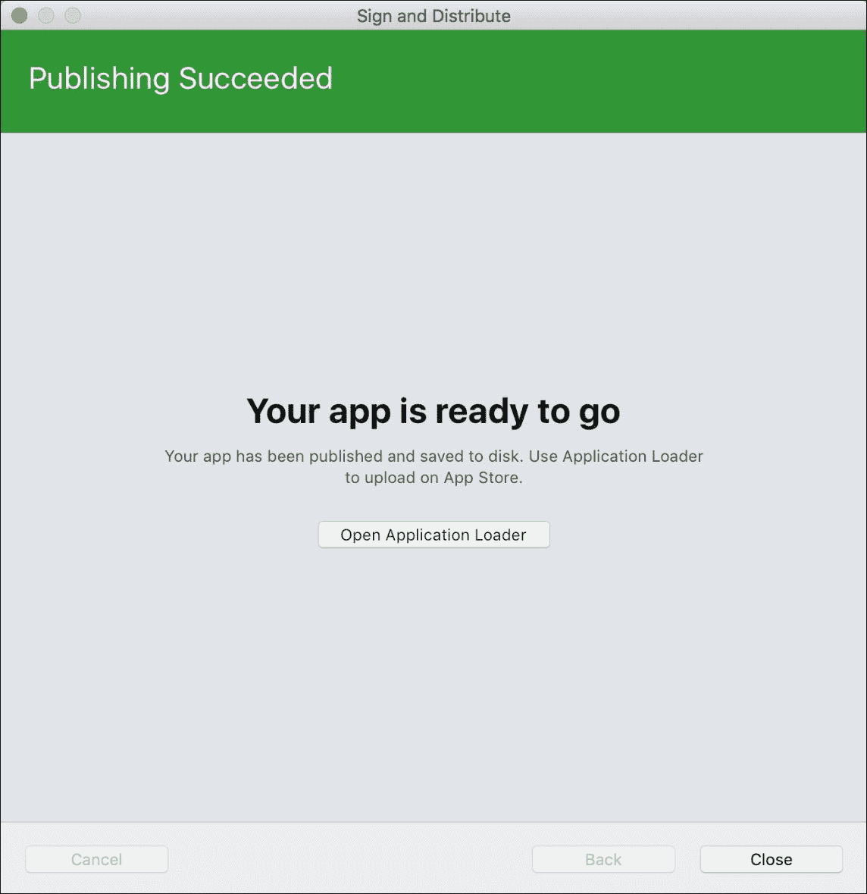
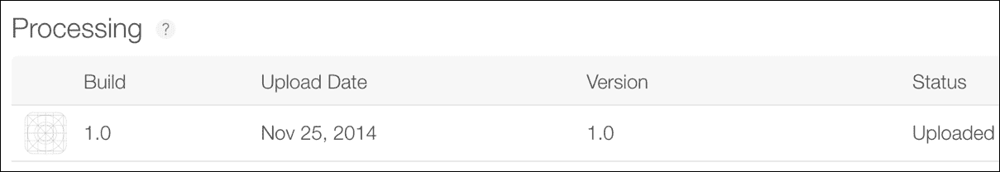
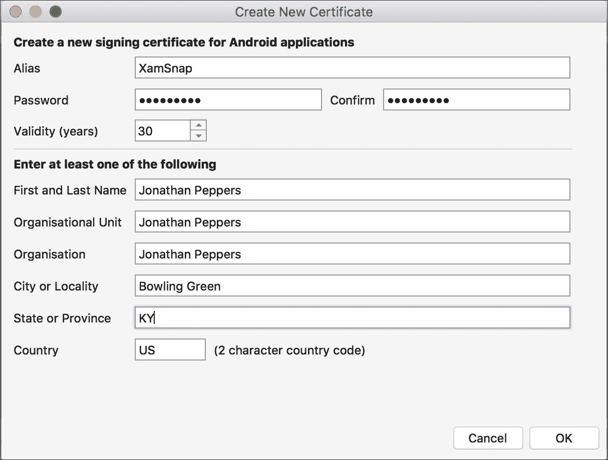
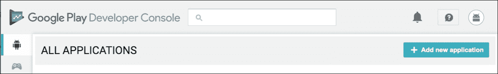
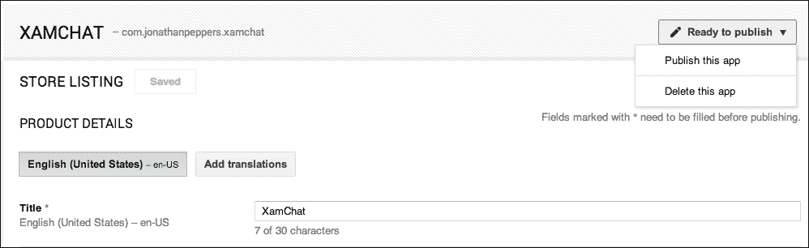
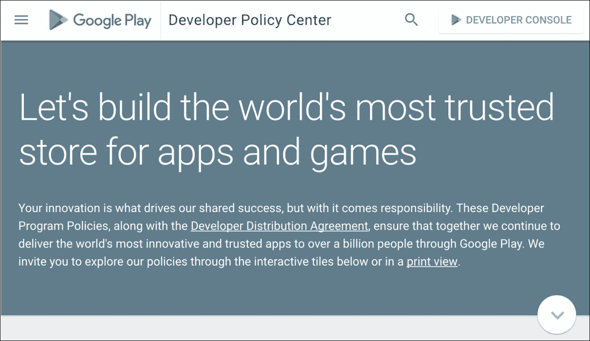

# 第十二章：应用商店提交

既然你已经完成了跨平台应用程序的开发，下一步显然是将你的应用发布在 Google Play 和 iOS App Store 上。Xamarin 应用与 Java 或 Objective-C 应用完全以相同的方式分发；然而，将你的应用通过这个过程可能会有些痛苦。iOS 有一个官方的审批系统，这使得应用商店提交的过程比 Android 要长。开发者可能需要等待一周或更长时间，这取决于应用被拒绝的次数。与调试应用程序相比，Android 在提交应用到 Google Play 时需要一些额外的步骤，但你仍然可以在短短几小时内提交你的应用程序。

在本章中，我们将涵盖：

+   App Store 审核指南

+   向 App Store 提交 iOS 应用

+   设置 Android 签名密钥

+   向 Google Play 提交 Android 应用

+   在应用商店成功的技巧

# 遵循 iOS App Store 审核指南

你的应用程序名称、应用图标、屏幕截图和其他方面都在苹果公司的网站 iTunes Connect 上声明。销售报告、应用商店拒绝、合同和银行信息以及应用更新都可以通过网站[`itunesconnect.apple.com`](http://itunesconnect.apple.com)进行管理。

苹果公司指南的主要目的是保持 iOS App Store 的安全，免受恶意软件的侵害。iOS App Store 上几乎找不到恶意软件。通常，iOS 应用程序能对你做的最糟糕的事情就是向你推送大量广告。在一定程度上，这些指南还加强了应用内支付时苹果公司的收入分成。遗憾的是，苹果公司的一些有争议的指南在 iOS 上的关键领域排除了竞争对手：

这里的关键点是让你的应用程序通过商店审批过程，避免面临 App Store 拒绝。只要你不故意违反规定，大多数应用程序在获得批准时不会遇到困难。最常见的拒绝与开发者的错误有关，这是件好事，因为你不希望向公众发布一个带有严重问题的应用。

App Store 审核指南相当长，因此我们将分解成你可能遇到的最常见情况。完整的指南列表可以在[`developer.apple.com/app-store/review/guidelines/`](https://developer.apple.com/app-store/review/guidelines/)找到。

需要注意的一些通用规则包括：

+   出现崩溃、有错误或严重失败的应用程序将被拒绝

+   与宣传不符或含有隐藏功能的应用程序将被拒绝

+   使用非公开 Apple API，或在文件系统上禁止的位置读写文件的应用程序将被拒绝

+   提供价值不大或过度开发的应用（如手电筒、打嗝或放屁应用）将被拒绝

+   应用程序不能未经商标持有者许可，将商标词作为应用名称或关键词

+   应用程序不得非法分发受版权保护的材料

+   可以通过移动友好的网站简单实现的应用程序，如包含大量 HTML 内容但没有本地功能的应用程序，可能会被拒绝

这些规则有助于保持 iOS App Store 的整体质量和安全性，否则可能会降低。由于这些规则，有时很难将功能非常少的应用程序放入商店，因此请确保您的应用程序足够有用和吸引人，以便 App Store 审核团队能够允许它在商店上可用。

关于开发者在 iTunes Connect 中犯的错误或不正确标记的一些规则如下：

+   提到其他移动平台，如 Android 的应用程序或元数据将被拒绝

+   标签不正确或不适当的应用程序类别/类型、屏幕截图或图标将被拒绝

+   开发者必须为应用程序提供适当的年龄评级和关键词

+   在应用程序审核时，支持、隐私政策和市场营销 URL 必须能正常使用

+   开发者不应声明未使用的 iOS 功能；例如，如果您的应用程序实际上未使用 Game Center 或 iCloud，请不要声明这些功能的使用

+   在未经用户同意的情况下使用位置或推送通知等功能的应用程序将被拒绝

这些有时可能仅仅是开发者的一部分失误。只需确保在最终提交到 iOS App Store 之前，再次检查您的应用程序的所有信息。

此外，苹果还有关于应用程序内可以包含内容的以下规则：

+   包含令人反感内容或可能被认为粗鲁的应用程序将被拒绝

+   设计用来打扰或让用户感到厌恶的应用程序将被拒绝

+   包含过多暴力图像的应用程序将被拒绝

+   针对特定政府、种族、文化或公司作为敌人的应用程序将被拒绝

+   图标或屏幕截图不符合 4+年龄评级的应用程序可能会被拒绝

App Store 为儿童和成人提供应用程序。苹果还支持*17 岁以上*的应用程序年龄限制；然而，这将严重限制潜在用户数量。最好让应用程序保持清洁，适合尽可能多的年龄段。

下一个规则类别，如下所示，与 App Store 中苹果 70/30 的收入分成有关：

+   链接到网站上销售的产品或软件的应用程序可能会被拒绝。

+   使用 iOS **应用内购买**（**IAPs**）以外的支付机制的应用程序将被拒绝。

+   使用 IAP 购买实物商品的应用程序将被拒绝。

+   应用可以展示在应用外部购买的数字内容，只要你不从应用内链接或购买。应用内购买的数字内容必须使用 IAPs（应用内购买）。

只要你不是试图规避苹果应用商店的收入分成，这些规则很容易遵守。在你的应用内解锁数字内容时，请始终使用 IAPs。

最后但同样重要的是，以下是一些与 App Store 拒绝相关的一般性建议：

+   如果你的应用需要用户名和密码，请确保在**演示账户信息**部分提供凭证，以便应用审查团队使用。

+   如果你的应用包含 IAPs 或其他需要应用审查团队明确测试的功能，请确保在**审查备注**中提供操作说明，以便审查团队能够到达应用中的适当屏幕。

+   提前规划！不要让你的产品应用被拒绝而影响截止日期；至少在你的计划中预留几周时间用于应用商店的审批。另一个选择是在正式发布前提前提交一个测试版本以待审批，并将发布日期设定在未来。你可以在接近发布日期时上传最终版本。

+   如有疑问，请在 iTunes Connect 的**审查备注**部分尽可能详细地描述。

如果你的应用被拒绝，大多数情况下解决方法都很简单。苹果的审查团队会明确引用指南，如果违反了规则，还会附上相关的崩溃日志和屏幕截图。如果可以在不提交新版本的情况下解决问题，你可以在 iTunes Connect 网站的**解决方案中心**回应应用审查团队。如果你上传了一个新版本，这将会让你的应用排在审查队列的最后。

对于 iOS 的功能，肯定有更深入和具体的规则，所以如果你打算对某个 iOS 功能进行创新或非同寻常的尝试，请确保查看完整的指导方针。如果你对某个具体指导方针不确定，最好寻求专业法律意见。拨打苹果支持电话不会有任何帮助，因为其支持人员不被允许提供与 App Store 审查指南相关的建议。

# 向 iOS App Store 提交应用

在将应用提交到商店之前，我们需要检查一个简短的清单，以确保你已经准备好这样做。在流程的某个阶段发现问题遗漏或未正确处理是一件痛苦的事。此外，有一些要求需要由设计师或营销团队来完成，这些工作不一定应该由开发者承担。

在开始提交之前，请确保你已经完成了以下工作：

+   你的应用程序的`Info.plist`文件应完全填写好。这包括启动画面图像、应用图标、应用名称以及其他需要为高级功能填写的设置。请注意，这里的 app 名称是在应用图标下显示的内容。它可以与 App Store 名称不同，而且与 App Store 名称不同，它不需要在商店中与其他所有应用保持唯一性。

+   在 App Store 上至少为你的应用选择三个名称。即使某个名称在 App Store 当前未被占用，也可能不可用，因为它可能已经被其他开发者用于因某些原因而被移除的应用。如果你愿意，也可以提前预留一个名称。

+   你有一张大的 1024x1024 应用图标图像。除非你通过 iTunes（桌面应用程序）分发企业或 Ad Hoc 版本，否则无需将此文件包含在应用程序中。

+   针对应用所针对的每个设备，你至少有一张截图。这包括 iPhone 6 Plus、iPhone 6、iPhone 5、iPhone 4、iPad mini、iPad 视网膜和 iPad Pro 尺寸的通用 iOS 应用程序截图。我强烈建议填写所有可能的截图槽位。

+   你为 App Store 准备了一份精心编写和编辑的描述。

+   你选择了一系列关键词以提高应用程序的搜索效果。

## 创建一个分发配置文件

当你再次检查了上述清单后，我们可以开始提交的过程。我们的第一步将是为 App Store 分发创建一个配置文件。

让我们通过执行以下步骤开始创建一个新的配置文件：

1.  导航至[`developer.apple.com/account/`](https://developer.apple.com/account/)。

1.  在右侧导航栏中点击**证书、ID 与配置文件**。

1.  点击**配置文件** | **全部**。

1.  点击窗口右上角的加号按钮。

1.  在**分发**下选择**App Store**并点击**继续**。

1.  选择你的应用 ID。你应该在第七章，*在设备上部署和测试*中已经创建了一个；点击**继续**。

1.  选择为提供配置文件而使用的证书。通常这里只有一个选项。点击**继续**。

1.  为配置文件选择一个合适的名称，如`MyAppAppStore`。点击**生成**。

1.  完成后，你可以手动下载并安装配置文件，或者在 Xcode 的**偏好设置** | **账户**中同步你的配置文件，正如我们在本书前面所做的那样。

成功后，你将看到以下屏幕：

## 将你的应用添加到 iTunes Connect

接下来的一系列步骤，我们将开始填写你的应用程序在 Apple App Store 上显示的详细信息。

我们可以通过执行以下一系列步骤开始在 iTunes Connect 中设置你的应用：

1.  导航到[`itunesconnect.apple.com`](http://itunesconnect.apple.com)并登录。

1.  点击**我的应用**。

1.  点击窗口左上角的加号按钮，然后选择**新建应用**。

1.  选择平台为**iOS**。

1.  输入在 App Store 上显示的应用**名称**。

1.  为你的应用选择一个**主要语言**。

1.  选择你的**Bundle ID**。你应该在第七章，*在设备上部署和测试*中已经创建了一个。

1.  在**SKU**字段中输入一个值。这用于在报告中识别你的应用。

1.  点击**继续**。

1.  从这里开始，需要填写很多必填信息。如果你遗漏了任何信息，iTunes Connect 在显示警告方面会非常有帮助。该网站对市场营销专业人士以及开发者来说应该是相当用户友好的。

1.  在进行更改后点击**保存**。

还有许多可选字段。如果你有需要应用审核团队审核你的应用程序的任何额外信息，请确保填写**审核备注**或**演示账户信息**。完成后，你将看到你的应用程序状态为**准备提交**，如下截图所示：

现在，我们需要将我们的应用实际上传到 iTunes Connect。你必须从 Xcode 或 Application Loader 上传一个构建版本。这两种方法会产生相同的结果，但如果非开发者提交应用，有些人更喜欢使用 Application Loader。

## 为 App Store 制作 iOS 二进制文件

我们提交到 App Store 的最后一步是向商店提供包含我们应用程序的二进制文件。我们需要创建应用程序的发布版本，使用本章早些时候创建的分发配置文件进行签名。

Xamarin Studio 使这个过程变得非常简单。我们可以按以下方式配置构建：

1.  点击 Xamarin Studio 左上角的项目配置下拉菜单，并选择**AppStore**。

1.  默认情况下，Xamarin Studio 将设置你需要提交此构建配置的所有配置选项。

1.  接下来，选择你的 iOS 应用程序项目，然后点击**Build** | **Archive for Publishing**。

几分钟后，Xamarin Studio 将打开已归档构建的菜单，如下所示：

该过程将在`~/Library/Developer/Xcode/Archives`中创建一个`xarchive`文件。**验证...**按钮将检查你的归档在上传过程中可能出现的任何潜在错误，而**签名并分发...**将实际提交应用程序到商店。

若要提交你的应用程序到商店，请执行以下步骤：

1.  点击**签名并分发...**。别担心，它在上传之前会验证归档。

1.  选择**App Store**，然后点击**Next**。

1.  确保列出的配置文件是为 App Store 准备的，然后点击**下一步**。

1.  审核你的更改并点击**发布**。

1.  选择一个位置来保存`*.ipa`文件，然后点击**保存**。

1.  点击**打开 Application Loader**以开始上传过程。

你应该会在 Xamarin Studio 中看到一个与以下截图类似的屏幕：

从这里开始，使用**Application Loader**相当直接：

1.  使用你的 iTunes Connect 凭据登录。

1.  选择**交付你的应用**并点击**选择**。

1.  选择你在 Xamarin Studio 中创建的`*.ipa`文件，然后点击**打开**。

1.  审核为构建选择的应用并点击**下一步**。

1.  如果一切操作都正确，你应该会看到一个上传进度条，然后是一个成功对话框。

如果你回到 iTunes Connect，并导航到**TestFlight** | **Test Flight Builds**标签，你会看到你刚才上传的构建状态为**处理中**：

几分钟后，构建将被处理，并可以添加到 App Store 发布中。下一步是在**App Store** | **iOS App**标签下的**构建**部分选择构建。

点击**保存**后，你应该可以点击**提交审核**，而不会有任何剩余警告。接下来，回答关于出口法、广告标识符等三个问题，并点击**提交**作为最后一步来提交你的应用。

在这一点上，当你的应用在等待苹果员工审核时，你无法控制其状态。这可能需要一周或更长时间，具体取决于待审核应用的工作量和一年中的时间。更新也将通过这个过程，但等待时间通常比新应用提交要短一些。

幸运的是，有些情况下你可以快速推进这个过程。如果你访问[`developer.apple.com/contact/app-store/?topic=expedite`](https://developer.apple.com/contact/app-store/?topic=expedite)，你可以请求加速应用审核。你的问题必须是关键的错误修复或与你的应用程序相关的时间敏感事件。苹果并不保证接受加速请求，但在需要的时候它可能是一个救星。

此外，如果你提交的构建出现了问题，你可以通过进入应用详情页顶部并选择**从审核中移除这个版本**来取消提交。在提交后发现错误的情况下，这允许你上传一个新的构建来替代。

# 签名你的 Android 应用

所有 Android 软件包（`apk`文件）都由证书或密钥库文件签名，以便在设备上安装。当您调试/开发应用程序时，您的软件包会自动由 Android SDK 生成的开发密钥签名。使用此调试密钥进行开发甚至测试版测试是可以的；然而，它不能用于在 Google Play 分发的应用程序。

完成以下设置以创建签名的 APK：

1.  在 Xamarin Studio 左上角点击解决方案配置下拉菜单，并选择**发布**。

1.  接下来，选择您的 Android 应用程序项目，并点击**构建** | **归档以发布**。

1.  接下来，选择创建的 Android 归档并点击**签名与分发**。

1.  选择**Ad Hoc**并点击**下一步**。Google Play 也是您稍后可能考虑的选项，但它需要更多时间来设置（它也不能上传应用程序的第一个 APK）。

1.  选择**创建新密钥**。

1.  填写 Android 密钥库文件所需的信息并点击**确定**。

1.  选择您创建的密钥库文件并点击**下一步**。

1.  点击**发布**并选择保存 APK 的位置。

您的密钥库文件设置应类似于以下截图：

完成后，您应该将密钥库文件和密码保存在一个非常安全的地方。默认情况下，Xamarin Studio 将您的密钥放在`~/Library/Developer/Xamarin/KeyStore`。一旦您使用此`keystore`文件签名应用程序并将其提交到 Google Play，如果没有相同的密钥签名，您将无法提交应用程序的更新。没有机制可以找回丢失的密钥库文件。如果您不幸丢失了它，您的唯一选择是从商店中删除现有应用并提交包含您更新更改的新应用。这可能会导致您失去大量用户。

# 将应用提交至 Google Play

一旦您有了签名的 Android 软件包，与 iOS 相比，提交应用程序到 Google Play 相对简单。所有操作都可以通过浏览器中的**开发者控制台**标签完成，无需使用 OS X 应用程序上传软件包。

在开始提交之前，请确保您已经完成了以下清单上的任务：

+   您声明了一个`AndroidManifest.xml`文件，其中包含您的应用程序名称、包名称和图标。

+   您有一个使用生产密钥签名的`apk`文件。

+   您为 Google Play 选择了一个应用程序名称。这个名称在商店中不是唯一的。

+   您有一个 512x512 高分辨率的 Google Play 图标图像。

+   您为商店编写并编辑了一个详尽的描述。

+   您至少需要两张截图。不过，我建议使用所有可用的位置，包括 7 英寸和 10 英寸平板电脑的尺寸。

完成清单检查后，您应完全准备好将应用程序提交至 Google Play。添加新应用的标签如下所示：

首先，访问[`play.google.com/apps/publish`](https://play.google.com/apps/publish)并登录您的账户，然后执行以下步骤：

1.  选择**所有应用程序**标签，然后点击**添加新应用程序**。

1.  输入在 Google Play 上显示的应用名称，然后点击**上传 APK**。

1.  点击**将您的第一个 APK 上传至生产环境**或**Beta**或**Alpha**渠道。

1.  浏览到您的签名`.apk`文件，然后点击**确定**。您会看到**APK**标签的勾号变绿。

1.  选择**商店列表**标签。

1.  填写所有必填字段，包括**描述**、**高分辨率图标**、**分类**和**隐私政策**（或选择表示您没有提交政策的复选框），并提供至少两张截图。

1.  点击**保存**。您会看到**商店列表**标签上的勾号变绿。

1.  选择**内容分级**标签，并填写选择应用程序年龄分级的问卷调查。

1.  选择**定价与分销**标签。

1.  选择一个价格和您希望分销的国家。

1.  接受**内容指南**和**美国出口法律**的协议。

1.  点击**保存**。您会看到**定价与分销**标签上的勾号变绿。

1.  如下图所示，在右上角选择**准备发布**下拉菜单，并选择**发布此应用**：

几个小时后，您的应用程序将在 Google Play 上提供。无需审批流程，且应用程序的更新同样轻松。

## Google Play 开发者计划政策

为了提供一个安全的商店环境，Google 会追溯删除违反其政策的应用程序，并通常会禁止整个开发者账户，而不仅仅是应用程序。Google 的政策旨在提高 Google Play 上可用应用程序的质量，并不像 iOS 的规则集那样冗长。话虽如此，以下是 Google 政策的基本摘要：

+   应用程序不能包含色情材料、无端的暴力或仇恨言论。

+   应用程序不能侵犯版权材料。

+   应用程序不能具有恶意性质，或在用户不知情的情况下捕获用户的私人信息。

+   应用程序在未经用户同意的情况下，不能修改用户设备的基本功能（如修改主屏幕）。如果应用程序包含此类功能，用户必须能够轻松关闭。

+   应用程序内的所有数字内容必须使用 Google Play 的应用内购买（或 IAP）。物理商品不能使用 IAP 购买。

+   应用程序不得滥用可能导致用户产生高额账单的蜂窝网络使用：

就像 iOS 一样，如果你对某项政策有疑虑，最好寻求专业法律意见。要查看政策的完整列表，请访问[`play.google.com/about/developer-content-policy/`](https://play.google.com/about/developer-content-policy/)。

# 构建成功移动应用的技巧。

根据我的个人经验，我使用 Xamarin 构建的应用已经提交到 iOS App Store 和 Google Play 有一段时间了。在交付了近 50 款总下载量达数百万的移动应用后，我学到了很多关于什么因素能使移动应用成功或失败的经验。对于最终用户来说，Xamarin 应用与 Java 或 Objective-C 应用是无法区分的，所以你可以通过遵循标准的 iOS 或 Android 应用的相同模式来使你的应用成功。

你可以采取很多措施让你的应用更成功。以下是一些可以遵循的建议：

+   **定价要合适**：如果你的应用面向所有人，无处不在，可以考虑采用广告植入或 IAPs 的*fremium*模式来获得收入。然而，如果你的应用相对小众，将应用定价在 4.99 美元或更高会更有利。高级应用必须保持更高的质量标准，但可以在较少的用户中获得不错的收入。

+   **了解你的竞争对手**：如果你的应用领域内还有其他应用，请确保你的应用要么更好，要么提供比竞争对手更广泛的功能集。如果已经有几个应用在与你的应用竞争，那么完全避开这个领域也许也是个好主意。

+   **提示忠实用户进行评价**：在用户多次打开你的应用后，提示他们进行评价是一个好主意。这给了那些积极使用你应用的用户一个机会，去撰写好评。

+   **支持你的用户**：提供一个有效的支持电子邮件地址或 Facebook 页面，以便你能够轻松地与用户互动。回复 bug 报告和负面评价。Google Play 甚至有向撰写应用评价的用户发送电子邮件的选项。

+   **保持应用体积小**：在 iOS 上保持在 100MB 以下，或在 Google Play 上保持在 50MB 以下，这将允许用户使用他们的手机数据计划下载你的应用。这样做可以减少安装应用的摩擦，因为用户会将漫长的下载时间与运行缓慢的应用联系起来。

+   **将你的应用提交到评测网站**：尽量在网上获得尽可能多的评测。苹果提供了发送优惠券代码的功能，但对于你的安卓版本应用，你可以发送实际的安卓安装包。将你的应用提交到评测网站或热门 YouTube 频道，可以成为获得免费广告的好方法。

+   **使用应用程序分析或跟踪服务**：报告你的应用程序的使用情况和崩溃报告对于理解用户非常有帮助。在野外修复崩溃并修改用户界面以改善消费行为非常重要。

没有银弹可以保证移动应用程序的成功。如果你的应用程序引人注目，满足需求，并且运行快速、正确，你手中可能就有一个下一个热门应用。使用 Xamarin 提供一致的跨平台体验，也将使你在竞争中处于领先地位。

# 概述

在本章中，我们涵盖了将你的应用程序提交到 iOS App Store 和 Google Play 所需知道的一切。我们介绍了 App Store 审核指南，并为你在审核过程中可能遇到的最常见情况进行了简化。我们详述了为你的应用程序配置元数据并在 iTunes Connect 上传二进制文件的过程。对于 Android，我们讲解了如何创建生产签名密钥并签署你的 Android 包（APK）文件。我们介绍了向 Google Play 提交应用程序的过程，并以关于如何向应用商店成功交付一个有望盈利的应用程序的技巧结束了这一章。

我希望这本书能让你体验到一个端到端的、实用的演练，以使用 Xamarin 开发真实世界的跨平台应用程序。相比其他移动开发选项，C# 应该能让你更加高效。此外，通过共享代码，你将节省时间，同时不会以任何方式限制用户的原生体验。
