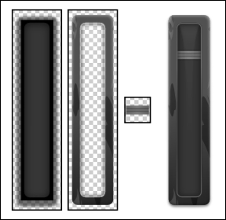
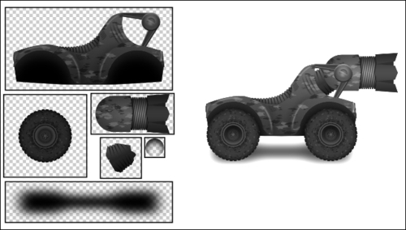
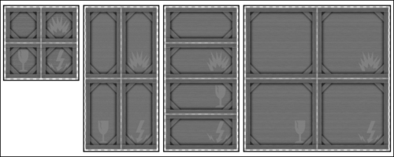
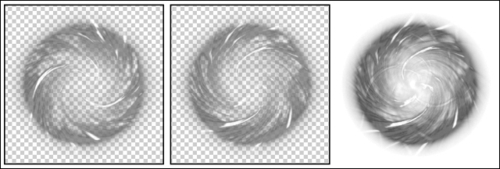
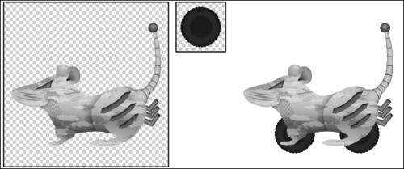
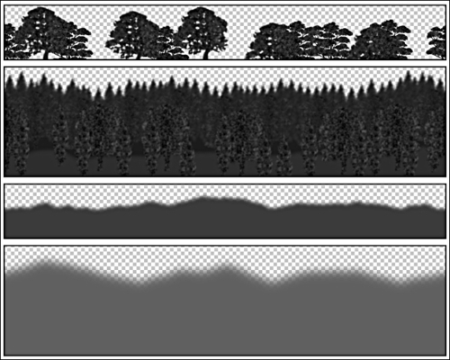

# 十一、附录 a：MagneTank 源代码

本章提供了游戏中使用的所有职业的简短描述和参考资料**MagneTank**T2。MagneTank 可在谷歌 Play 商店([http://play.google.com/store/apps/details?)上获得 id=ifl.games.MagneTank](http://play.google.com/store/apps/details?id=ifl.games.MagneTank) ，原名**安卓市场** ，源代码可以在本书的代码包中找到。游戏包括瞄准坦克的炮塔，触摸炮塔应该指向的地方，并在同一位置敲击以射击炮塔。为了演示支持物理的车辆，可以通过首先触摸油箱，然后向所需方向滑动，将油箱拉到左侧或右侧。

游戏的课程分布在以下主题中:

*   游戏级职业
*   输入类
*   图层类
*   经理课程
*   菜单类
*   活动和引擎类别

下图是 MagneTank 第二关的游戏内截图:

# 游戏级职业

这些职业出现在游戏的可玩部分:

## ManagedGameScene.java

MagneTank 的`ManagedGameScene`类建立在[第 5 章](05.html "Chapter 5. Scene and Layer Management")、*场景和图层管理*中的`ManagedGameScene`类的基础上，增加了一个阶梯式加载屏幕，显示游戏为每个关卡加载了什么。使用加载步骤背后的想法与加载游戏之前显示一帧的加载屏幕相同，很像`SceneManager`类在显示新场景时的功能，但是加载屏幕会针对每个加载步骤进行更新，而不是在首次显示加载屏幕时只更新一次。

本课程基于以下食谱:

*   *将文本应用于图层[第 2 章](02.html "Chapter 2. Working with Entities")、*使用实体**
*   *创建场景管理器[第五章](05.html "Chapter 5. Scene and Layer Management")、*场景和图层管理**
*   *什么是更新处理器？[第 7 章](07.html "Chapter 7. Working with Update Handlers")*中的*与更新处理器*一起工作

## 游戏等级. java

`GameLevel`职业将所有其他游戏中的职业聚集在一起，形成了 MagneTank 的可玩部分。它处理每个实际游戏关卡的构建和执行。它扩展了一个定制的`ManagedGameScene`类，该类包含了一系列`LoadingRunnable`对象，这些对象以允许在屏幕上显示关卡构建的每个进程的步骤来创建关卡。`GameLevel`类还使用`GameManager`类来测试输赢情况，从而确定每个游戏级别的完成与否。

本课程基于以下食谱:

*   *理解和设计实体[第 2 章](02.html "Chapter 2. Working with Entities")、*使用实体**
*   *在[第二章](02.html "Chapter 2. Working with Entities")、*与实体合作*中用精灵*将场景带入生活
*   *将文本应用于图层[第 2 章](02.html "Chapter 2. Working with Entities")、*使用实体**
*   *覆盖[第 2 章](02.html "Chapter 2. Working with Entities")、*中的【管理日期】方法*与实体一起工作*
*   *在[第二章](02.html "Chapter 2. Working with Entities")、*中使用修改器和实体修改器*处理实体*
*   *使用视差背景创建透视[第三章](03.html "Chapter 3. Designing Your Menu")、*设计你的菜单**
*   *介绍[第四章](04.html "Chapter 4. Working with Cameras")、*中的相机对象*使用相机*
*   *在[第 4 章](04.html "Chapter 4. Working with Cameras")、*中用绑定的摄像头*限制摄像头区域使用摄像头*
*   *在[第四章](04.html "Chapter 4. Working with Cameras")、*使用相机*中，使用变焦相机*仔细观察
*   *将平视显示器应用于摄像机[第 4 章](04.html "Chapter 4. Working with Cameras")、*中的*使用摄像机*
*   *在[第五章](05.html "Chapter 5. Scene and Layer Management")、*场景和图层管理*中自定义管理的场景和图层*
*   *[第 6 章](06.html "Chapter 6. Applications of Physics")*物理学应用*中的 Box2D 物理学扩展*介绍
*   *什么是更新处理器？[第 7 章](07.html "Chapter 7. Working with Update Handlers")*中的*与更新处理器*一起工作
*   *创建雪碧池[第 8 章](08.html "Chapter 8. Maximizing Performance")、*最大化性能**

## 加载可运行.java

`LoadingRunnable`类充当`Runnable`对象，同时也更新`ManagedGameScene`类中的加载屏幕。每个`ManagedGameScene`类中都有一个`ArrayList`类型的`LoadingRunnable`对象，让开发人员可以控制向玩家显示多少加载进度。重要的是要注意，虽然在 MagneTank 中加载屏幕的更新不是处理器密集型的，但是更复杂、图形复杂的加载屏幕可能会对 eah 级别的加载时间造成很大影响。

## Levels.java

`Levels`类保存了游戏中可以玩的所有关卡的数组，以及检索特定关卡的辅助方法。

## BouncingPowerBar.java

`BouncingPowerBar`级向玩家显示一个弹跳指示器，指示车辆的每次射击威力有多大。它将指示器的可见位置转换为一个分数值，然后应用三次曲线，在试图实现最强有力的射击时增加更多的挑战。下图显示了由三个独立图像构建的电源条的外观:

`BouncingPowerBar`课程基于以下食谱:

*   *理解和设计实体[第 2 章](02.html "Chapter 2. Working with Entities")、*使用实体**
*   *在[第二章](02.html "Chapter 2. Working with Entities")、*与实体合作*中用精灵*将场景带入生活
*   *覆盖[第 2 章](02.html "Chapter 2. Working with Entities")、*中的【管理日期】方法*与实体一起工作*
*   *将平视显示器应用到相机上[第 2 章](02.html "Chapter 2. Working with Entities")、*与实体一起工作**

## 磁库. java

`MagneTank`类创建并控制游戏所基于的车辆。它使用关节将 Box2D 车身拼接在一起，创建了一个启用物理功能的车辆，并通过`BoundTouchInputs`使用玩家的输入来控制车辆的每个部分如何移动和运行。下图显示了建造前后的 MagneTank:

`MagneTank`课程基于以下食谱:

*   *理解和设计实体[第 2 章](02.html "Chapter 2. Working with Entities")、*使用实体**
*   *在[第二章](02.html "Chapter 2. Working with Entities")、*与实体合作*中用精灵*将场景带入生活
*   *使用相对旋转[第 2 章](02.html "Chapter 2. Working with Entities")、*中的*与实体一起工作*
*   *覆盖[第 2 章](02.html "Chapter 2. Working with Entities")、*中的【管理日期】方法*与实体一起工作*
*   *在[第 4 章](04.html "Chapter 4. Working with Cameras")、*中用绑定的摄像头*限制摄像头区域使用摄像头*
*   *[第 6 章](06.html "Chapter 6. Applications of Physics")*物理学应用*中的 Box2D 物理学扩展*介绍
*   *了解不同体型[第六章](06.html "Chapter 6. Applications of Physics")、*物理学应用**
*   *通过在[第 6 章](06.html "Chapter 6. Applications of Physics")、*物理学应用*中指定顶点*来创建独特的物体
*   *使用力、速度和扭矩[第 6 章](06.html "Chapter 6. Applications of Physics")、*物理学的应用**
*   [第 6 章](06.html "Chapter 6. Applications of Physics")、*物理学应用*中的*关节工作*
*   *什么是更新处理器？[第 7 章](07.html "Chapter 7. Working with Update Handlers")*中的*与更新处理器*一起工作
*   *在[第 10 章](10.html "Chapter 10. Getting More From AndEngine")、*中应用基于精灵的阴影*，从安德工程*中获取更多

## 磁力仪. java

`MagneticCrate`类扩展了`MagneticPhysObject`类。它创造和处理各种类型的板条箱，可从 MagneTank 车发射。每个板条箱都以平铺精灵的形式显示，平铺精灵的图像索引设置为板条箱的类型。`MagneticCrate`课程利用了来自物理世界`ContactListener`的 Box2D`postSolve()`方法。下图显示了游戏中可用的各种大小和类型的板条箱:

`MagneticCrate`课程基于以下食谱:

*   *理解和设计实体[第 2 章](02.html "Chapter 2. Working with Entities")、*使用实体**
*   *在[第二章](02.html "Chapter 2. Working with Entities")、*与实体合作*中用精灵*将场景带入生活
*   *覆盖[第 2 章](02.html "Chapter 2. Working with Entities")、*中的【管理日期】方法*与实体一起工作*
*   *[第 6 章](06.html "Chapter 6. Applications of Physics")*物理学应用*中的 Box2D 物理学扩展*介绍
*   *了解不同体型[第六章](06.html "Chapter 6. Applications of Physics")、*物理学应用**
*   *使用[第 6 章](06.html "Chapter 6. Applications of Physics")、*物理学应用*中的预求解和后求解*
*   *什么是更新处理器？[第 7 章](07.html "Chapter 7. Working with Update Handlers")*中的*与更新处理器*一起工作

## MagneticOrb.java

`MagneticOrb`职业在 MagneTank 当前的抛射体周围创造一个视觉效果。它以相反的方向旋转两个漩涡图像(见下图)，以产生球形力的错觉。`MagneticOrb`类随着射弹的装填和射击而形成和消失。

`MagneticOrb`课程基于以下食谱:

*   *理解和设计实体[第 2 章](02.html "Chapter 2. Working with Entities")、*使用实体**
*   *在[第二章](02.html "Chapter 2. Working with Entities")、*与实体合作*中用精灵*将场景带入生活
*   *使用相对旋转[第 2 章](02.html "Chapter 2. Working with Entities")、*中的*与实体一起工作*
*   *覆盖[第 2 章](02.html "Chapter 2. Working with Entities")、*中的【管理日期】方法*与实体一起工作*

## 磁物理对象. java

`MagneticPhysObject`类扩展了`PhysObject`类，允许 MagneTank 车抓取或释放物体。当被抓住时，物体受到反重力以及将物体拉向磁坦克炮塔的力。

`MagneticPhysObject`课程基于以下食谱:

*   *在[第 6 章](06.html "Chapter 6. Applications of Physics")中介绍 Box2D 物理扩展，物理应用*
*   *了解不同体型[第六章](06.html "Chapter 6. Applications of Physics")物理学的应用*
*   *使用力、速度和扭矩[第 6 章](06.html "Chapter 6. Applications of Physics")物理学的应用*
*   *对特定物体施加反重力[第 6 章](06.html "Chapter 6. Applications of Physics")物理学的应用*
*   *什么是更新处理器？[第 6 章](06.html "Chapter 6. Applications of Physics")使用更新处理器*

## MechRat.java

`MechRat`类扩展了`PhysObject`类，以利用`postSolve()`方法，该方法在与另一个支持物理的对象碰撞时被调用。如果力足够大，机甲就会被摧毁，之前加载的粒子效果会立即显示出来。MechRat 也有通过旋转关节连接的轮子，这增加了摧毁它的挑战。下图显示了 MechRat 的视觉构成:

本课程基于以下食谱:

*   *了解和设计实体[第 2 章](02.html "Chapter 2. Working with Entities")、*中的*使用更新处理器*
*   *在[第二章](02.html "Chapter 2. Working with Entities")、*与更新处理器*合作中，用精灵*将场景带入生活
*   *覆盖[第 2 章](02.html "Chapter 2. Working with Entities")、*中的 onManagedUpdate 方法*使用更新处理器*
*   *使用粒子系统[第 2 章](02.html "Chapter 2. Working with Entities")、*使用更新处理器**
*   *[第 6 章](06.html "Chapter 6. Applications of Physics")*物理学应用*中的 Box2D 物理学扩展*介绍
*   *了解不同体型[第六章](06.html "Chapter 6. Applications of Physics")、*物理学应用**
*   *通过在[第 6 章](06.html "Chapter 6. Applications of Physics")、*物理学应用*中指定顶点*来创建独特的物体
*   [第 6 章](06.html "Chapter 6. Applications of Physics")、*物理学应用*中的*关节工作*
*   *使用[第 6 章](06.html "Chapter 6. Applications of Physics")、*物理学应用*中的预求解和后求解*
*   [第六章](06.html "Chapter 6. Applications of Physics")、*物理应用*中的*创建可破坏对象*
*   *什么是更新处理器？[第 7 章](07.html "Chapter 7. Working with Update Handlers")*中的*与更新处理器*一起工作

## MetalBeamDynamic.java

这个类代表游戏中看到的非静态的、物理激活的大梁。由于其重复的纹理，可以设置每个光束的长度。

`MetalBeamDynamic`类基于以下食谱:

*   *理解和设计实体[第 2 章](02.html "Chapter 2. Working with Entities")、*使用实体**
*   *在[第二章](02.html "Chapter 2. Working with Entities")、*与实体合作*中用精灵*将场景带入生活
*   *使用相对旋转[第 2 章](02.html "Chapter 2. Working with Entities")、*中的*与实体一起工作*
*   *覆盖[第 2 章](02.html "Chapter 2. Working with Entities")、*中的【管理日期】方法*与实体一起工作*
*   *[第 6 章](06.html "Chapter 6. Applications of Physics")*物理学应用*中的 Box2D 物理学扩展*介绍
*   *了解不同体型[第六章](06.html "Chapter 6. Applications of Physics")、*物理学应用**

## MetalBeamStatic.java

类似于上面的`MetalBeamDynamic`类，这个类也代表一个大梁，但是这个对象的`BodyType`选项被设置为`Static`来创建一个不动的屏障。

`MetalBeamStatic`课程基于以下食谱:

*   *理解和设计实体[第 2 章](02.html "Chapter 2. Working with Entities")、*使用实体**
*   *在[第二章](02.html "Chapter 2. Working with Entities")、*与实体合作*中用精灵*将场景带入生活
*   *使用相对旋转[第 2 章](02.html "Chapter 2. Working with Entities")、*中的*与实体一起工作*
*   *[第 6 章](06.html "Chapter 6. Applications of Physics")*物理学应用*中的 Box2D 物理学扩展*介绍
*   *了解不同体型[第六章](06.html "Chapter 6. Applications of Physics")、*物理学应用**

## 视差层. java

由本书的合著者杰伊·施罗德编写并发布的`ParallaxLayer`类允许轻松创建`ParallaxEntity`对象，当`Camera`对象在场景中移动时，这些对象会给人以深度感。可以设置视差效果的级别，`ParallaxLayer`类负责正确渲染每个`ParallaxEntity`对象。下图显示了附属于`ParallaxLayer`类的 MagneTank 的背景层:

`ParallaxLayer`课程基于以下食谱:

*   *理解和设计实体[第 2 章](02.html "Chapter 2. Working with Entities")、*使用实体**
*   *在[第二章](02.html "Chapter 2. Working with Entities")、*中使用 OpenGL* 使用实体*
*   *覆盖[第 2 章](02.html "Chapter 2. Working with Entities")、*中的【管理日期】方法*与实体一起工作*
*   *使用视差背景创建透视[第三章](03.html "Chapter 3. Designing Your Menu")、*设计你的菜单**

## 物理对象. java

`PhysObject`类在 MagneTank 中用于委托从物理世界的`ContactListener`接收的联系。这也促进了一种`destroy()`方法，使摧毁物理物体变得更容易。

`PhysObject`课程基于以下食谱:

*   *理解和设计实体[第 2 章](02.html "Chapter 2. Working with Entities")、*使用实体**
*   *[第 6 章](06.html "Chapter 6. Applications of Physics")*物理学应用*中的 Box2D 物理学扩展*介绍
*   *了解不同体型[第六章](06.html "Chapter 6. Applications of Physics")、*物理学应用**
*   *使用[第 6 章](06.html "Chapter 6. Applications of Physics")、*物理学应用*中的预求解和后求解*
*   *什么是更新处理器？[第 7 章](07.html "Chapter 7. Working with Update Handlers")*中的*与更新处理器* 一起工作

## RemainingCratesBar.java

`RemainingCratesBar`类为玩家提供了一个可视化的表示，让 MagneTank 拍摄哪个板条箱。每一层中剩余的板条箱的尺寸、类型和数量从`GameLevel`类中检索，并因层而异。当一个箱子被射击时，`RemainingCratesBar`类会产生动画来反映游戏状态的变化。

本课程基于以下食谱:

*   *理解和设计实体[第 2 章](02.html "Chapter 2. Working with Entities")、*使用实体**
*   *在[第二章](02.html "Chapter 2. Working with Entities")、*与实体合作*中用精灵*将场景带入生活
*   *在[第二章](02.html "Chapter 2. Working with Entities")、*中使用 OpenGL* 使用实体*
*   *覆盖[第 2 章](02.html "Chapter 2. Working with Entities")、*中的【管理日期】方法*与实体一起工作*
*   *在[第二章](02.html "Chapter 2. Working with Entities")、*中使用修改器和实体修改器*处理实体*

## TexturedBezierLandscape.java

`TexturedBezierLandscape`类创建了两个纹理网格和一个物理实体来表示关卡的地面。顾名思义，风景由贝塞尔曲线组成，以显示上升或下降的坡度。纹理网格由重复纹理制成，以避免景观区域之间的任何可见接缝。下图显示了用于创建风景的两个纹理，以及应用贝塞尔曲线斜率后组合网格的显示示例:

`TexturedBezierLandscape`课程基于以下食谱:

*   *理解和设计实体[第 2 章](02.html "Chapter 2. Working with Entities")、*使用实体**
*   *在[第二章](02.html "Chapter 2. Working with Entities")、*中使用 OpenGL* 使用实体*
*   *[第 6 章](06.html "Chapter 6. Applications of Physics")*物理学应用*中的 Box2D 物理学扩展*介绍
*   *了解不同体型[第六章](06.html "Chapter 6. Applications of Physics")、*物理学应用**
*   *通过在[第 6 章](06.html "Chapter 6. Applications of Physics")、*物理学应用*中指定顶点*来创建独特的物体
*   *[第 10 章](10.html "Chapter 10. Getting More From AndEngine")*中的纹理网格*从和发动机*中获取更多信息

## TexturedMesh.java

这个类和食谱中的`TexturedMesh`类是一样的，*纹理网格*在[第 10 章](10.html "Chapter 10. Getting More From AndEngine")、*从 AndEngine* 中获取更多。

## WoodenBeamDynamic.java

这个类类似于`MetalBeam`类，但是增加了一个生命值方面，一旦`WoodenBeamDynamic`类的生命值达到零，就会被粒子效果取代。

`WoodenBeamDynamic`类基于以下食谱:

*   *理解和设计实体[第 2 章](02.html "Chapter 2. Working with Entities")、*使用实体**
*   *在[第二章](02.html "Chapter 2. Working with Entities")、*与实体合作*中用精灵*将场景带入生活
*   *使用相对旋转[第 2 章](02.html "Chapter 2. Working with Entities")、*中的*与实体一起工作*
*   *覆盖[第 2 章](02.html "Chapter 2. Working with Entities")、*中的【管理日期】方法*与实体一起工作*
*   *使用粒子系统[第 2 章](02.html "Chapter 2. Working with Entities")、*使用实体**
*   *[第 6 章](06.html "Chapter 6. Applications of Physics")*物理学应用*中的 Box2D 物理学扩展*介绍
*   *了解不同体型[第六章](06.html "Chapter 6. Applications of Physics")、*物理学应用**
*   *使用[第 6 章](06.html "Chapter 6. Applications of Physics")、*物理学应用*中的预求解和后求解*
*   *什么是更新处理器？[第 7 章](07.html "Chapter 7. Working with Update Handlers")*中的*与更新处理器*一起工作

# 输入类别

这些类中的每一个都处理游戏中使用的特定输入法:

## BoundTouchInput.java

`BoundTouchInput`类方便了输入的委托，然后输入被绑定到`BoundTouchInput`类。这可以很容易地在游戏中看到，当移动 MagneTank 瞄准炮塔。当触摸进入另一个可触摸区域时，它会保持与原始区域的联系。

## GrowButton.java

`GrowButton`类只是显示一个图像，当玩家触摸它时，它会增长到特定的比例，当触摸解除或丢失时，它会恢复到原始比例。

本课程基于以下食谱:

*   *理解和设计实体[第 2 章](02.html "Chapter 2. Working with Entities")、*使用实体**
*   *在[第二章](02.html "Chapter 2. Working with Entities")、*与实体合作*中用精灵*将场景带入生活
*   *覆盖[第 2 章](02.html "Chapter 2. Working with Entities")、*中的【管理日期】方法*与实体一起工作*
*   *在[第二章](02.html "Chapter 2. Working with Entities")、*中使用修改器和实体修改器*处理实体*

## GrowToggleButton.java

基于`GrowButton`类，该类增加了显示一个或两个`TiledTextureRegion`索引的功能，具体取决于条件的状态。

`GrowToggleButton`课程基于以下食谱:

*   *理解和设计实体[第 2 章](02.html "Chapter 2. Working with Entities")、*使用实体**
*   *在[第二章](02.html "Chapter 2. Working with Entities")、*与实体合作*中用精灵*将场景带入生活
*   *覆盖[第 2 章](02.html "Chapter 2. Working with Entities")、*中的【管理日期】方法*与实体一起工作*
*   *在[第二章](02.html "Chapter 2. Working with Entities")、*中使用修改器和实体修改器*处理实体*

## 生长切换文本按钮.java

基于`GrowToggleButton`类，这个类使用`Text`对象而不是`TiledTextureRegion`对象来显示条件的状态。

`GrowToggleTextButton`课程基于以下食谱:

*   *理解和设计实体[第 2 章](02.html "Chapter 2. Working with Entities")、*使用实体**
*   *在[第二章](02.html "Chapter 2. Working with Entities")、*与实体合作*中用精灵*将场景带入生活
*   *将文本应用于图层[第 2 章](02.html "Chapter 2. Working with Entities")、*使用实体**
*   *覆盖[第 2 章](02.html "Chapter 2. Working with Entities")、*中的【管理日期】方法*与实体一起工作*
*   *在[第二章](02.html "Chapter 2. Working with Entities")、*中使用修改器和实体修改器*处理实体*

# 图层类别

这些类代表游戏中存在的层:

## LevelPauseLayer.java

`LevelPauseLayer`类表示当一个关卡暂停时显示给玩家的图层。它显示当前的关卡编号、分数和高分，以及返回游戏、返回关卡选择屏幕、重新开始关卡或跳到下一个关卡的按钮。

本课程基于以下食谱:

*   *理解和设计实体[第 2 章](02.html "Chapter 2. Working with Entities")、*使用实体**
*   *在[第二章](02.html "Chapter 2. Working with Entities")、*与实体合作*中用精灵*将场景带入生活
*   *将文本应用于图层[第 2 章](02.html "Chapter 2. Working with Entities")、*使用实体**
*   *在[第五章](05.html "Chapter 5. Scene and Layer Management")、*场景和图层管理*中自定义管理的场景和图层*
*   *什么是更新处理器？[第 7 章](07.html "Chapter 7. Working with Update Handlers")*中的*与更新处理器*一起工作

## levelwonlyesterday . Java

`LevelWonLayer`类表示当一个关卡成功完成时显示给玩家的图层。它显示当前的等级号、分数和高分，以及玩家获得的星级。它还包括按钮，返回到级别选择屏幕，重播级别，或继续到下一个级别。下图显示了`LevelWonLayer`类纹理以及它们在游戏中组装时的样子:

`LevelWonLayer`课程基于以下食谱:

*   *理解和设计实体[第 2 章](02.html "Chapter 2. Working with Entities")、*使用实体**
*   *在[第二章](02.html "Chapter 2. Working with Entities")、*与实体合作*中用精灵*将场景带入生活
*   *将文本应用于图层[第 2 章](02.html "Chapter 2. Working with Entities")、*使用实体**
*   *在[第二章](02.html "Chapter 2. Working with Entities")、*中使用修改器和实体修改器*处理实体*
*   *在[第五章](05.html "Chapter 5. Scene and Layer Management")、*场景和图层管理*中自定义管理的场景和图层*
*   *什么是更新处理器？[第 7 章](07.html "Chapter 7. Working with Update Handlers")*中的*与更新处理器*一起工作

## ManagedLayer.java

该类与[第 5 章](05.html "Chapter 5. Scene and Layer Management")、*场景和图层管理*中*创建场景管理器*配方中的`ManagedLayer`类相同。

## 选项层. java

该层可从`MainMenu`场景访问，并允许播放器启用或禁用音乐和声音，以及选择图形质量或重置他们已经实现的级别完成数据。

`OptionsLayer`课程基于以下食谱:

*   *理解和设计实体[第 2 章](02.html "Chapter 2. Working with Entities")、*使用实体**
*   *在[第二章](02.html "Chapter 2. Working with Entities")、*与实体合作*中用精灵*将场景带入生活
*   *将文本应用于图层[第 2 章](02.html "Chapter 2. Working with Entities")、*使用实体**
*   *在[第五章](05.html "Chapter 5. Scene and Layer Management")、*场景和图层管理*中自定义管理的场景和图层*
*   *什么是更新处理器？[第 7 章](07.html "Chapter 7. Working with Update Handlers")*中的*与更新处理器*一起工作

# 经理班

这些类各自管理游戏的特定方面:

## 游戏管理员. java

`GameManager`类只是便于检查两个条件，以确定一个级别是完成还是失败。利用这些信息，游戏管理器调用`GameLevel`类中设置的适当方法。

本课程基于以下食谱:

*   *在[第一章](01.html "Chapter 1. AndEngine Game Structure")、*和*中创建游戏管理器*
*   *什么是更新处理器？[第 7 章](07.html "Chapter 7. Working with Update Handlers")*中的*与更新处理器*一起工作

## ResourceManager.java

`ResourceManager`类与[第一章](01.html "Chapter 1. AndEngine Game Structure")、*和【引擎游戏结构】*中的非常相似，但是如果需要，增加了使用一组较低质量纹理的能力。它还包括确定准确字体纹理大小的方法，以防止浪费宝贵的纹理内存。

本课程基于以下食谱:

*   *在[第 1 章](01.html "Chapter 1. AndEngine Game Structure")、*和引擎游戏结构*中应用纹理选项*
*   *使用[第一章](01.html "Chapter 1. AndEngine Game Structure")、*和*中的安卓引擎字体资源*
*   *在[第一章](01.html "Chapter 1. AndEngine Game Structure")、*和引擎游戏结构*中创建资源管理器*
*   *在[第二章](02.html "Chapter 2. Working with Entities")、*中使用 OpenGL* 使用实体*
*   *在[第五章](05.html "Chapter 5. Scene and Layer Management")、*场景和图层管理*中设置场景资源的资源管理器*

## SceneManager.java

该类与[第 5 章](05.html "Chapter 5. Scene and Layer Management")、*场景和图层管理*中*创建场景管理器*配方中的`SceneManager`类相同。

## sfxmmanager . Java

这个简单的类处理音乐和声音的回放以及它们的静音状态。

`SFXManager`类基于以下配方:

*   *在[第一章](01.html "Chapter 1. AndEngine Game Structure")、*和引擎游戏结构*中介绍声音和音乐*

# 菜单类

这些类只用于游戏中的菜单。

## LevelSelector.java

这个类非常类似于[第 3 章](03.html "Chapter 3. Designing Your Menu")、*设计你的菜单*中的等级选择器，但是使用了一系列`LevelSelectorButton`对象而不是精灵。

本课程基于以下食谱:

*   *理解和设计实体[第 2 章](02.html "Chapter 2. Working with Entities")、*使用实体**
*   *在[第二章](02.html "Chapter 2. Working with Entities")、*与实体合作*中用精灵*将场景带入生活
*   *在[第三章](03.html "Chapter 3. Designing Your Menu")、*设计您的菜单*中创建我们的等级选择系统*

## LevelSelectorButton.java

`LevelSelectorButton`类直观地向玩家显示一个关卡的状态，锁定或解锁，以及如果关卡解锁所达到的星级数。

本课程基于以下食谱:

*   *理解和设计实体[第 2 章](02.html "Chapter 2. Working with Entities")、*使用实体**
*   *在[第二章](02.html "Chapter 2. Working with Entities")、*与实体合作*中用精灵*将场景带入生活
*   *将文本应用于图层[第 2 章](02.html "Chapter 2. Working with Entities")、*使用实体**
*   *覆盖[第 2 章](02.html "Chapter 2. Working with Entities")、*中的【管理日期】方法*与实体一起工作*
*   *在[第二章](02.html "Chapter 2. Working with Entities")、*中使用修改器和实体修改器*处理实体*

## MainMenu.java

`MainMenu`类包含两个`Entity`对象，一个代表标题屏幕，一个代表级别选择屏幕。两个屏幕之间的移动是使用实体修改器实现的。在主菜单的第一次显示期间，当游戏资源被加载时，加载屏幕被显示。

`MainMenu`课程基于以下食谱:

*   *理解和设计实体[第 2 章](02.html "Chapter 2. Working with Entities")、*使用实体**
*   *在[第二章](02.html "Chapter 2. Working with Entities")、*与实体合作*中用精灵*将场景带入生活
*   *覆盖[第 2 章](02.html "Chapter 2. Working with Entities")、*中的【管理日期】方法*与实体一起工作*
*   *在[第二章](02.html "Chapter 2. Working with Entities")、*中使用修改器和实体修改器*处理实体*
*   *在[第五章](05.html "Chapter 5. Scene and Layer Management")、*场景和图层管理*中自定义管理的场景和图层*

## ManagedMenuScene.java

该类与[第 5 章](05.html "Chapter 5. Scene and Layer Management")、*场景和图层管理*中*创建场景管理器*配方中的`ManagedMenuScene`类相同。

## ManagedSplashScreen.java 版

本课程基于第 5 章*场景和图层管理*中*定制管理场景和图层*食谱中的`ManagedMenuScene`课程。它会在闪屏隐藏后添加卸载`Entity`对象的代码。

## splash screen . Java 版

`SplashScreen`类使用实体修改器和分辨率无关的定位来显示游戏的闪屏。每个标志都是可点击的，并开始一个与标志相关的意图。

本课程基于以下食谱:

*   *在[第二章](02.html "Chapter 2. Working with Entities")、*与实体合作*中用精灵*将场景带入生活
*   *将文本应用于图层[第 2 章](02.html "Chapter 2. Working with Entities")、*使用实体**
*   *在[第二章](02.html "Chapter 2. Working with Entities")、*中使用修改器和实体修改器*处理实体*
*   *在[第五章](05.html "Chapter 5. Scene and Layer Management")、*场景和图层管理*中自定义管理的场景和图层*
*   *什么是更新处理器？[第 7 章](07.html "Chapter 7. Working with Update Handlers")*中的*与更新处理器*一起工作

## 活动和引擎类别

这些课程是游戏的支柱。

## MagneTankActivity.java

这个活动类建立在标准和工程`BaseGameActivity`类的基础上，增加了广告、一些在 `onCreateEngineOptions()`方法中执行的高级分辨率缩放，以及保存和恢复选项和分数的共享偏好方法。

本课程基于以下食谱:

*   *了解[第一章](01.html "Chapter 1. AndEngine Game Structure")、*和*中的生命周期*
*   *在[第一章](01.html "Chapter 1. AndEngine Game Structure")、*和引擎游戏结构*中选择我们的引擎类型*
*   *在[第一章](01.html "Chapter 1. AndEngine Game Structure")、*和*中保存和加载游戏数据*
*   *使用[第五章](05.html "Chapter 5. Scene and Layer Management")、*场景和图层管理*中的场景管理器*设置活动

## 电磁铁平滑相机. java

该职业扩展了`SmoothCamera`对象，但包括在指定时间内平移到敌方基地的能力，以及追踪`MagneTank`对象的能力。

本课程基于以下食谱:

*   *介绍[第四章](04.html "Chapter 4. Working with Cameras")、*中的相机对象*使用相机*
*   *在[第 4 章](04.html "Chapter 4. Working with Cameras")、*使用相机*中使用平滑相机*创建平滑移动
*   *什么是更新处理器？[第 7 章](07.html "Chapter 7. Working with Update Handlers")*中的*与更新处理器*一起工作

## ManagedScene.java

该类与[第 5 章](05.html "Chapter 5. Scene and Layer Management")、*场景和图层管理*中*创建场景管理器*配方中的`ManagedScene`类相同。

## 可切换的 FixedStepEngine.java

当调用了 `EnableFixedStep()`方法时，这个`Engine`对象的行为完全像一个`FixedStepEngine`对象。

本课程基于以下食谱:

*   *在[第一章](01.html "Chapter 1. AndEngine Game Structure")、*和引擎游戏结构*中选择我们的引擎类型*
*   *什么是更新处理器？[第 7 章](07.html "Chapter 7. Working with Update Handlers")*中的*与更新处理器*一起工作