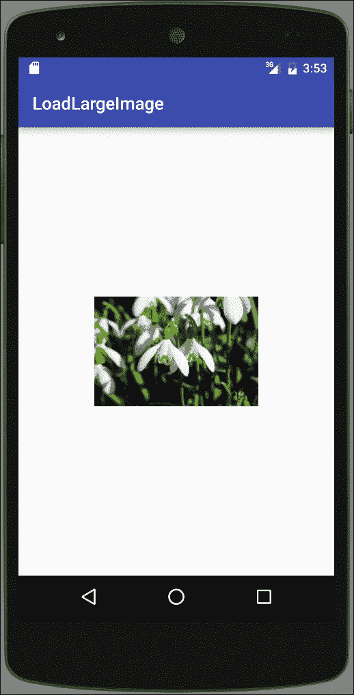
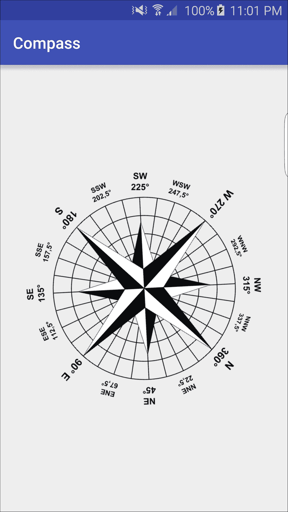
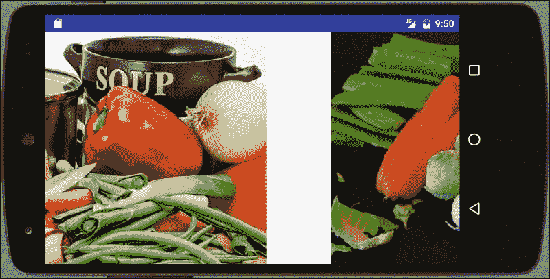
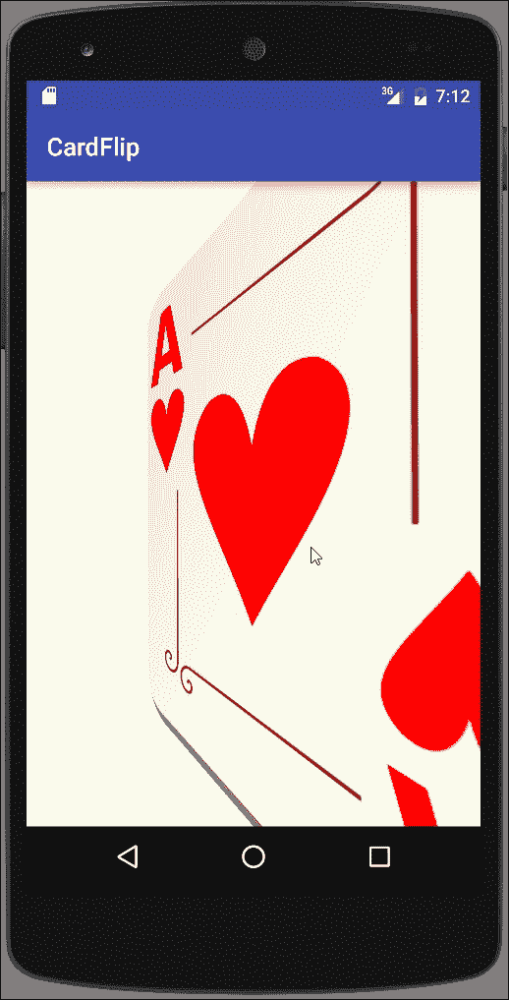

# 第九章。图形和动画

在本章中，我们将涵盖以下主题:

*   缩小大图像以避免内存不足异常
*   过渡动画–定义场景并应用过渡
*   使用传感器数据和旋转创建指南针
*   使用可视寻呼机创建幻灯片显示
*   用片段创建翻牌动画
*   使用自定义过渡创建缩放动画

# 简介

动画可以是视觉上吸引人的，也可以是功能性的，就像简单的按键一样。按钮按下的图形表示使应用程序充满活力，此外，它还通过向用户提供对事件的视觉响应来提供功能价值。

安卓框架提供了几个动画系统，使得在你自己的应用程序中包含动画变得更加容易。它们包括以下内容:

*   **查看动画**:(原动画系统。)它通常需要更少的代码，但是的动画选项有限
*   **属性动画**:这是一个更加灵活的系统，允许对任何对象的任何属性进行动画制作
*   **可绘制动画**:使用可绘制资源制作逐帧动画(像电影一样)

属性动画系统是在安卓 3.0 中引入的，由于灵活性，通常比视图动画更受青睐。观看动画的主要缺点包括:

*   可以设置动画的有限方面，例如缩放和旋转
*   只能动画显示视图的内容，不能改变视图在屏幕上的绘制位置(因此不能动画显示在屏幕上移动球)
*   只能动画显示视图对象

下面是一个演示视图动画“闪烁”视图的简单示例(按钮按压的简单模拟):

```java
Animation blink =AnimationUtils.loadAnimation(this,R.anim.blink);
view.startAnimation(blink);
```

以下是位于`res/anim`文件夹中的`blink.xml`资源文件的内容:

```java
<?xml version="1.0" encoding="utf-8"?>
<set xmlns:android="http://schemas.android.com/apk/res/android">
    <alpha android:fromAlpha="1.0"
        android:toAlpha="0.0"
        android:background="#000000"
        android:interpolator="@android:anim/linear_interpolator"
        android:duration="100"
        android:repeatMode="restart"
        android:repeatCount="0"/>
</set>
```

如您所见，创建此动画非常简单，因此如果视图动画实现了您的目标，请使用它。当它不能满足你的需求时，转向属性动画系统。我们将在*中使用新的`objectAnimator`演示属性动画，使用片段*和*创建卡片翻转动画，使用自定义过渡*制作缩放动画。

过渡动画-定义场景和应用过渡配方将提供关于安卓过渡框架的附加信息，我们将在许多配方中使用。

### 注

插值器是一个定义动画变化率的函数。

`Interpolators`将在本章的几个食谱中以及之前的眨眼示例中提到。插值器定义如何计算过渡。线性插值器将在设定的持续时间内均匀计算变化，而`AccelerateInterpolator` 函数将在整个持续时间内产生更快的运动。以下是可用插值器的完整列表，以及 XML 标识符:

*   `AccelerateDecelerateInterpolator (@android:anim/accelerate_decelerate_interpolator)`
*   `AccelerateInterpolator (@android:anim/accelerate_interpolator)`
*   `AnticipateInterpolator (@android:anim/anticipate_interpolator)`
*   `AnticipateOvershootInterpolator (@android:anim/anticipate_overshoot_interpolator)`
*   `BounceInterpolator (@android:anim/bounce_interpolator)`
*   `CycleInterpolator (@android:anim/cycle_interpolator)`
*   `DecelerateInterpolator (@android:anim/decelerate_interpolator)`
*   `LinearInterpolator (@android:anim/linear_interpolator)`
*   `OvershootInterpolator (@android:anim/overshoot_interpolator)`

虽然动画通常不需要太多内存，但图形资源经常需要。您可能想要处理的许多图像经常超出可用的设备内存。在本章的第一个食谱*缩小大图像以避免内存不足异常*中，我们将讨论如何二次采样(或缩小)图像。

# 缩小大图像以避免内存不足异常

处理图像可能会占用大量内存，通常会导致应用程序崩溃，出现内存不足的异常情况(T2)。用设备摄像头拍摄的照片尤其如此，因为它们的分辨率通常比设备本身高得多。

由于在本例中加载比用户界面支持的分辨率更高的图像不会带来任何视觉上的好处，因此本食谱将演示如何获取较小的图像样本进行显示。我们将使用`BitmapFactory`首先检查图像大小，然后加载缩小的图像。

下面是这个食谱的截图，显示了一个非常大的图像的缩略图:



## 做好准备

在 Android Studio 中创建新的项目，并将其称为:`LoadLargeImage`。使用默认的**电话&平板电脑**选项，并在提示输入**活动类型**时选择**空活动**。

我们需要这个食谱的大图片；所以我们求助于[www.Pixabay.com](http://www.Pixabay.com)获取图像。由于图像本身无关紧要，我们下载了当时显示的第一张图像。(全尺寸图像为 6000 x 4000 和 3.4MB。)

## 怎么做...

如前面在*准备*中所述，我们需要一个大的图像来演示缩放。获得图像后，请按照下列步骤操作:

1.  将图像复制到`res/drawable`作为`image_large.jpg`(如果选择不同的文件类型，请使用适当的扩展名)。
2.  打开`activity_main.xml`，用以下`ImageView` :

    ```java
    <ImageView
        android:id="@+id/imageViewThumbnail"
        android:layout_width="100dp"
        android:layout_height="100dp"
        android:layout_centerInParent="true" />
    ```

    替换现有的`TextView`
3.  现在打开`MainActivity.java`添加这个方法，我们稍后解释:

    ```java
    public Bitmap loadSampledResource(int imageID, int targetHeight, int targetWidth) {
        final BitmapFactory.Options options = new BitmapFactory.Options();
        options.inJustDecodeBounds = true;
        BitmapFactory.decodeResource(getResources(), imageID, options);
        final int originalHeight = options.outHeight;
        final int originalWidth = options.outWidth;
        int inSampleSize = 1;
        while ((originalHeight / (inSampleSize *2)) > targetHeight && (originalWidth / (inSampleSize *2)) > targetWidth) {
            inSampleSize *= 2;
        }
        options.inSampleSize = inSampleSize;
        options.inJustDecodeBounds = false;
        return BitmapFactory.decodeResource(getResources(), imageID, options);
    }
    ```

4.  将以下代码添加到现有的`onCreate()`方法中:

    ```java
    ImageView imageView = (ImageView)findViewById(R.id.imageViewThumbnail);
    imageView.setImageBitmap(loadSampledResource(R.drawable.image_large, 100, 100));
    ```

5.  在设备或模拟器上运行应用程序。

## 它是如何工作的...

`loadSampledResource()`方法的目的是加载较小的图像，以减少图像的内存消耗。如果我们试图加载从[www.Pixabay.Com](http://www.Pixabay.Com)中选择的完整图像(参见前面的*准备*部分)，该应用将需要超过 3 MB 的内存来加载。这比大多数设备所能处理的内存都多(无论如何，目前都是如此)，即使它可以完全加载，也不会为我们的缩略图视图提供任何视觉优势。

为了避免出现`Out of Memory`的情况，我们使用`BitmapFactory.Options`的`inSampleSize`属性来减少或二次采样图像。(如果我们设置`inSampleSize=2`，图像会减少一半。如果我们使用`inSampleSize=4`，它将减少四分之一的图像)要计算`inSampleSize`，首先我们需要知道图像大小。我们可以如下使用`inJustDecodeBounds`属性:

```java
options.inJustDecodeBounds = true;
```

这告诉`BitmapFactory`获取图像尺寸，而不实际存储图像内容。一旦我们有了图像大小，我们就可以使用以下代码计算样本:

```java
while ((originalHeight / (inSampleSize *2)) > targetHeight && (originalWidth / (inSampleSize *2)) > targetWidth) {
        inSampleSize *= 2;
}
```

该代码的目的是确定不将图像降低到目标尺寸以下的最大样本量。为此，我们将样本量加倍，并检查样本量是否超过目标尺寸。如果没有，我们保存双倍的样本量并重复。一旦减小的尺寸低于目标尺寸，我们使用最后保存的`inSampleSize`。

### 注

从`inSampleSize`文档(以下*中的链接，另请参见*部分)中，请注意解码器使用基于 2 的幂的最终值，任何其他值都将向下舍入到最接近的 2 的幂。

一旦我们有了样本量，我们设置`inSampleSize`属性并将`inJustDecodeBounds`设置为`false`，以正常加载。下面是代码:

```java
options.inSampleSize = inSampleSize;
options.inJustDecodeBounds = false;
```

需要注意的是，这个方法说明了在您自己的应用程序中应用任务的概念。加载和处理图像可能是一个漫长的操作，这可能会导致您的应用程序停止响应。这不是一件好事，可能会导致安卓显示**应用不响应** ( **ANR** ) 对话框。建议在后台线程上执行长时间的任务，以保持用户界面线程的响应。`AsyncTask`类可用于进行后台网络处理，但也有许多其他库可用(配方末尾的链接):

*   **截击**:通过网络执行快速、可扩展的用户界面操作(参见[第 12 章](12.html "Chapter 12. Telephony, Networks, and the Web")、*电话、网络和网络*
*   **Picasso** :一个功能强大的安卓图像下载和缓存库
*   **安卓通用图像加载器**:强大灵活的库，用于加载、缓存和显示图像

## 还有更多...

需要注意的是，我们传递给`loadSampledResource()`方法的`targetHeight`和`targetWidth`参数实际上并没有设置图像大小。如果您使用我们使用的相同大小的图像运行应用程序，样本大小将为 32，导致加载的图像大小为 187 x 125。

如果您的布局需要特定大小的图像，可以在布局文件中设置大小，也可以直接使用位图类修改图像大小。

## 另见

*   **开发者文档:[https://Developer . Android . com/reference/Android/img/BitmapFactory](https://developer.android.com/reference/android/img/BitmapFactory.Options.html#inSampleSize)**。选项. html # in simplesize
*   参考[https://github.com/nostra13/Android-Universal-Image-Loader](https://github.com/nostra13/Android-Universal-Image-Loader)的**安卓通用图像加载器**页面
*   参考 https://square.github.io/picasso/[毕加索 T2](https://square.github.io/picasso/)
*   检查[第 14 章](14.html "Chapter 14. Getting your app ready for the Play Store")、*中的 *AsyncTask* 任务，为游戏商店*准备好您的应用程序，以便在后台线程上处理长时间运行的操作。

# 过渡动画–定义场景并应用过渡

安卓过渡框架提供以下功能:

*   **组级动画**:动画适用于层次结构中的所有视图
*   **基于过渡的动画**:基于开始和结束属性变化的动画
*   **内置动画**:一些常见的过渡效果，比如淡入淡出和移动
*   **资源文件支持**:将动画值保存到资源(XML)文件中，以便在运行时加载
*   **生命周期回调**:动画期间接收回调通知

过渡动画由以下内容组成:

*   **起始场景**:动画开始时的视图(或`ViewGroup`
*   **过渡**:T2 变化类型(见后面)
*   **结局场景**:结局视图(或`ViewGroup`
*   **过渡**:安卓内置支持以下三种过渡:
    *   **自动渐变(默认过渡)**:淡出，移动并调整大小，然后淡入(按此顺序)
    *   **淡入**:淡入、淡出(默认)或两者(指定顺序)
    *   **改变边界**:移动并调整大小

过渡框架将自动创建从开始到结束场景动画所需的帧。

以下是使用以下类时过渡框架的一些已知限制:

*   **表面视图**:动画可能看起来不正确，因为`SurfaceView`动画是在非用户界面线程上执行的，所以它们可能与应用程序不同步
*   **文本视图**:设置文本大小变化的动画可能无法正常工作，导致文本跳转到最终状态
*   **AdapterView** :延伸`AdapterView`的类，比如`ListView`和`GridView`可能会挂
*   **纹理查看**:有些过渡可能不起作用

这个食谱提供了一个使用过渡动画系统的快速教程。我们将从定义场景和过渡资源开始，然后应用过渡，这将创建动画。以下步骤将引导您创建 XML 格式的资源，因为它们通常是推荐的。资源也可以通过代码来创建，我们将在*中讨论，还有更多*部分。

## 做好准备

在 Android Studio 中创建新项目，并将其称为:`TransitionAnimation`。在**目标安卓设备**对话框中，选择**手机&平板电脑**选项，并选择**最小软件开发工具包的 API 19(或以上)。**当提示输入**活动类型**时，选择**空活动**。

## 怎么做...

以下是创建资源文件和应用过渡动画的步骤:

1.  更改现有的`activity.main.xml`布局文件如下:

    ```java
    <?xml version="1.0" encoding="utf-8"?>
    <RelativeLayout xmlns:android="http://schemas.android.com/apk/res/android"
        xmlns:tools="http://schemas.android.com/tools"
        android:id="@+id/layout"
        android:layout_width="match_parent"
        android:layout_height="match_parent">
        <TextView
            android:layout_width="wrap_content"
            android:layout_height="wrap_content"
            android:text="Top"
            android:id="@+id/textViewTop"
            android:layout_alignParentTop="true"
            android:layout_centerHorizontal="true" />
        <TextView
            android:layout_width="wrap_content"
            android:layout_height="wrap_content"
            android:text="Bottom"
            android:id="@+id/textViewBottom"
            android:layout_alignParentBottom="true"
            android:layout_centerHorizontal="true" />
        <Button
            android:layout_width="wrap_content"
            android:layout_height="wrap_content"
            android:text="Go"
            android:id="@+id/button"
            android:layout_centerInParent="true"
            android:onClick="goAnimate"/>
    </RelativeLayout>
    ```

2.  使用以下 XML 创建名为`activity_main_end.xml`的新布局文件:

    ```java
    <?xml version="1.0" encoding="utf-8"?>
    <RelativeLayout xmlns:android="http://schemas.android.com/apk/res/android"
        xmlns:tools="http://schemas.android.com/tools"
        android:id="@+id/layout"
        android:layout_width="match_parent"
        android:layout_height="match_parent">
        <TextView
            android:layout_width="wrap_content"
            android:layout_height="wrap_content"
            android:text="Bottom"
            android:id="@+id/textViewBottom"
            android:layout_alignParentTop="true"
            android:layout_centerHorizontal="true" />
        <TextView
            android:layout_width="wrap_content"
            android:layout_height="wrap_content"
            android:text="Top"
            android:id="@+id/textViewTop"
            android:layout_alignParentBottom="true"
            android:layout_centerHorizontal="true" />
        <Button
            android:layout_width="wrap_content"
            android:layout_height="wrap_content"
            android:text="Go"
            android:id="@+id/button"
            android:layout_centerInParent="true"/>
    </RelativeLayout>
    ```

3.  新建过渡资源目录(**文件** | **新建** | **安卓资源目录**选择**过渡**作为**资源类型**)。
4.  使用以下 XML 在名为`transition_move.xml`的`res/transition`文件夹中创建一个新文件:

    ```java
    <?xml version="1.0" encoding="utf-8"?>
    <changeBounds xmlns:android="http://schemas.android.com/apk/res/android" />
    ```

5.  使用以下代码添加`goAnimate()`方法:

    ```java
    public void goAnimate(View view) {
        ViewGroup root = (ViewGroup) findViewById(R.id.layout);
        Scene scene = Scene.getSceneForLayout(root, R.layout.activity_main_end, this);
        Transition transition = TransitionInflater.from(this).inflateTransition(R.transition.transition_move);
        TransitionManager.go(scene, transition);
    }
    ```

6.  您已经准备好在设备或模拟器上运行应用程序。

## 它是如何工作的...

你可能会发现代码本身相当简单。正如食谱介绍中所概述的，我们只需要创建开始和结束场景，并设置过渡类型。下面是代码的详细分解。

### 创建开始场景

运行以下行代码将创建开始场景:

```java
ViewGroup root = (ViewGroup) findViewById(R.id.layout);
```

### 创建过渡:

运行以下代码行将创建转换:

```java
Transition transition = TransitionInflater.from(this).inflateTransition(R.transition.transition_move);
```

### 定义结局场景:

运行下面一行代码将定义结束场景:

```java
Scene scene = Scene.getSceneForLayout(root, R.layout.activity_main_end, this);
```

### 开始过渡:

运行以下代码行将开始转换:

```java
TransitionManager.go(scene, transition);
```

虽然很简单，但是这个方法的大部分工作是创建必要的资源文件。

## 还有更多...

现在我们来看一下用一个纯代码的解决方案创建同样的过渡动画(尽管我们仍然使用初始的`activity_main.xml`布局文件):

```java
ViewGroup root = (ViewGroup) findViewById(R.id.layout);
Scene scene = new Scene(root);

Transition transition = new ChangeBounds();
TransitionManager.beginDelayedTransition(root,transition);

TextView textViewTop = (TextView)findViewById(R.id.textViewTop);
RelativeLayout.LayoutParams params = (RelativeLayout.LayoutParams)textViewTop.getLayoutParams();
params.addRule(RelativeLayout.ALIGN_PARENT_BOTTOM,1);
params.addRule(RelativeLayout.ALIGN_PARENT_TOP, 0);
textViewTop.setLayoutParams(params);

TextView textViewBottom = (TextView)findViewById(R.id.textViewBottom);
params = (RelativeLayout.LayoutParams)textViewBottom.getLayoutParams();
params.addRule(RelativeLayout.ALIGN_PARENT_BOTTOM,0);
params.addRule(RelativeLayout.ALIGN_PARENT_TOP, 1);
textViewBottom.setLayoutParams(params);

TransitionManager.go(scene);
```

随着过渡，我们仍然需要开始和结束的场景；唯一的区别是我们如何创造资源。在前面的代码中，我们使用当前布局创建了开始场景。

在我们开始通过代码修改布局之前，我们用转换类型调用`TransitionManager`的`beginDelayedTransition()`方法。`TransitionManager`将跟踪结局场景的变化。当我们调用`go()`方法时，`TransitionManager`会自动激活变化。

## 另见

*   参考[的动画资源网页https://developer . Android . com/guide/topics/resources/Animation-resource . html](https://developer.android.com/guide/topics/resources/animation-resource.html)

# 使用传感器数据和旋转图像创建指南针

在前一章中，我们演示了从物理设备传感器读取传感器数据。在这个配方中，我们使用了光传感器，因为来自环境传感器的数据通常不需要任何额外的处理。虽然很容易获得磁场强度数据，但这些数字本身没有太多意义，当然也不会产生吸引人的显示。

在本食谱中，我们将演示如何获取磁场数据和加速度计数据来计算磁北。我们将使用`SensorManager.getRotationMatrix`来激活指南针，同时响应设备移动。这是我们的指南针应用程序在物理设备上的截图:



## 做好准备

在 Android Studio 中创建新项目，并将其称为:`Compass`。当提示输入**活动类型**时，使用默认的**手机&平板电脑**选项和选择**空活动**。

我们需要指南针指示器的图像。同样，我们可以求助于[www.Pixabay.Com](http://www.Pixabay.Com)获取图像。我们使用了以下图像:

[https://pix abay . com/en/geography-map-compass-rose-plot-42608/](https://pixabay.com/en/geography-map-compass-rose-plot-42608/)

虽然不是必需的，但此图像具有透明背景，旋转图像时看起来更好。

## 怎么做...

正如在之前的*准备*部分所提到的，我们需要一个图像作为指南针。您可以下载之前链接的图片，或者使用您喜欢的任何图片，然后按照以下步骤操作:

1.  将您的图像复制到`res/drawable`文件夹并命名为`compass.png`。
2.  打开`activity_main.xml`，用以下`ImageView` :

    ```java
    <ImageView
        android:id="@+id/imageViewCompass"
        android:layout_width="wrap_content"
        android:layout_height="wrap_content"
        android:layout_centerInParent="true"
        android:src="@drawable/compass"/>
    ```

    替换现有的`TextView`
3.  现在打开`MainActivity.java`并添加以下全局变量声明:

    ```java
    private SensorManager mSensorManager;
    private Sensor mMagnetometer;
    private Sensor mAccelerometer;
    private ImageView mImageViewCompass;
    private float[] mGravityValues=new float[3];
    private float[] mAccelerationValues=new float[3];
    private float[] mRotationMatrix=new float[9];
    private float mLastDirectionInDegrees = 0f;
    ```

4.  将以下`SensorEventListener`类添加到`MainActivity`类:

    ```java
    private SensorEventListener mSensorListener = new SensorEventListener() {
        @Override
        public void onSensorChanged(SensorEvent event) {
            calculateCompassDirection(event);
        }
        @Override
        public void onAccuracyChanged(Sensor sensor, int accuracy) {
            //Nothing to do
        }
    };
    ```

5.  覆盖`onResume()`和`onPause()`，如下所示:

    ```java
    @Override
    protected void onResume() {
        super.onResume();
        mSensorManager.registerListener(mSensorListener, mMagnetometer, SensorManager.SENSOR_DELAY_FASTEST);
        mSensorManager.registerListener(mSensorListener, mAccelerometer, SensorManager.SENSOR_DELAY_FASTEST);
    }

    @Override
    protected void onPause() {
        super.onPause();
        mSensorManager.unregisterListener(mSensorListener);
    }
    ```

6.  将下面的代码添加到现有的 `onCreate()` 方法中:

    ```java
    mImageViewCompass=(ImageView)findViewById(R.id.imageViewCompass);
    mSensorManager = (SensorManager) getSystemService(Context.SENSOR_SERVICE);
    mMagnetometer = mSensorManager.getDefaultSensor(Sensor.TYPE_MAGNETIC_FIELD);
    mAccelerometer = mSensorManager.getDefaultSensor(Sensor.TYPE_ACCELEROMETER);
    ```

7.  最终代码进行实际计算和动画:

    ```java
    private void calculateCompassDirection(SensorEvent event) {
        switch (event.sensor.getType()) {
            case Sensor.TYPE_ACCELEROMETER:
                mAccelerationValues = event.values.clone();
                break;
            case Sensor.TYPE_MAGNETIC_FIELD:
                mGravityValues = event.values.clone();
                break;
        }
        boolean success = SensorManager.getRotationMatrix(mRotationMatrix, null, mAccelerationValues, mGravityValues);
        if(success){
            float[] orientationValues = new float[3];
            SensorManager.getOrientation(mRotationMatrix, orientationValues);
            float azimuth = (float)Math.toDegrees(-orientationValues[0]);
            RotateAnimation rotateAnimation = new RotateAnimation(mLastDirectionInDegrees, azimuth, Animation.RELATIVE_TO_SELF, 0.5f, Animation.RELATIVE_TO_SELF, 0.5f);
            rotateAnimation.setDuration(50);
            rotateAnimation.setFillAfter(true);
            mImageViewCompass.startAnimation(rotateAnimation);
            mLastDirectionInDegrees = azimuth;
        }
    ```

8.  您已经准备好运行应用程序。虽然你可以在模拟器上运行这个应用，没有加速计和磁力计，你不会看到指南针移动。

## 它是如何工作的...

由于我们已经在*读取传感器数据–使用安卓传感器框架*(上一章)中介绍了读取传感器数据，我们不再重复解释传感器框架，而是直接跳到`calculateCompassDirection()`方法。

我们直接从`onSensorChanged()`回调调用这个方法。由于我们使用同一个类来处理磁力计和加速度计的传感器回调，我们首先检查在`SensorEvent`中报告的是哪个传感器。然后我们调用`SensorManager.getRotationMatrix()`，传入最后一个传感器数据。如果计算成功，它会返回一个`RotationMatrix,`，我们用它来调用`SensorManager.getOrientation()`方法。`getOrientation()`将在`orientationValues`数组中返回以下数据:

*   **方位** : `value [0]`
*   **投球** : `value [1]`
*   **角色** : `value [2]`

方位角以弧度报告，方向相反，因此我们反转符号，并使用`Math.toDegrees()`将其转换为度数。方位角代表北的方向，所以我们在`RotateAnimation`中使用它。

数学已经由`SensorManager`完成，实际的指南针动画非常简单。我们使用先前的方向，即新方向，创建一个`RotateAnimation`。我们使用`Animation.RELATIVE_TO_SELF`标志和 0.5f(或 50%)来设置图像的中心作为旋转点。在调用`startAnimation()`更新指南针之前，我们使用`setDuration()`和`setFillAfter(true)`设置动画时长。(使用`true`表示我们希望动画完成后图像保持“原样”，否则图像将重置回原始图像。)最后我们保存方位为下一次传感器更新。

## 还有更多...

值得花一些时间来试验`RotationAnimation`设置和传感器更新时间。在我们注册传感器监听器的调用中，我们使用`SensorManager.SENSOR_DELAY_FASTEST`和`setDuration()`的 50 毫秒来创建快速动画。您也可以尝试使用较慢的传感器更新和较慢的动画，并比较结果。

## 另见

*   *读取传感器数据–使用上一章中的安卓传感器框架*获取读取传感器数据的详细信息。
*   参考 **getRotationMatrix()开发者文档**[http://Developer . Android . com/reference/Android/hardware/sensor manager . html # getRotationMatrix(float[]，float[]，float[]，float[])](http://developer.android.com/reference/android/hardware/SensorManager.html#getRotationMatrix(float%5B%5D,%20float%5B%5D,%20float%5B%5D,%20float%5B%5D))
*   参考[的 **getOrientation()开发者文档**http://Developer . Android . com/reference/Android/hardware/sensor manager . html # getOrientation(float[]，float[])](http://developer.android.com/reference/android/hardware/SensorManager.html#getOrientation(float%5B%5D,%20float%5B%5D))
*   参考[的**rotateimation 开发者文档**](http://developer.android.com/reference/android/view/animation/RotateAnimation.html)

# 使用可视寻呼机创建幻灯片显示

这个食谱将向你展示如何使用`ViewPager`类创建幻灯片。下面是一张截图，显示了从一张图片到另一张图片的过渡:



## 做好准备

在安卓工作室创建一个新项目，并将其命名为:`SlideShow`。使用默认的**电话&平板**选项，当提示输入**活动类型**时，选择**空活动**。

我们需要几张幻灯片的图片。出于演示的目的，我们从[www.Pixabay.com](http://www.Pixabay.com)下载了四张图片以包含在项目源文件中，但是您可以使用任何图片。

## 怎么做...

我们将创建一个片段来显示幻灯片显示的每个图像，然后在主活动中设置`ViewPager`。以下是步骤:

1.  将四张图片复制到`/res/drawable`文件夹，并通过`slide_3`命名为`slide_0`，保留其原始文件扩展名。
2.  使用以下 XML 创建名为`fragment_slide.xml`的新布局文件:

    ```java
    <?xml version="1.0" encoding="utf-8"?>
    <LinearLayout xmlns:android="http://schemas.android.com/apk/res/android"
        android:orientation="vertical"
        android:layout_width="match_parent"
        android:layout_height="match_parent">
        <ImageView
            android:layout_width="wrap_content"
            android:layout_height="wrap_content"
            android:id="@+id/imageView"
            android:layout_gravity="center_horizontal" />
    </LinearLayout>
    ```

3.  Now create a new Java class called `SlideFragment.` It will extend `Fragment` as follows:

    ```java
    public class SlideFragment extends Fragment {
    ```

    使用以下导入:

    ```java
    import android.support.v4.app.Fragment;
    ```

4.  增加如下全局申报:

    ```java
    private int mImageResourceID;
    ```

5.  添加以下空的默认片段构造函数:

    ```java
    public SlideFragment() {}
    ```

6.  添加以下方法保存图片资源 ID:

    ```java
    public void setImage(int resourceID) {
        mImageResourceID=resourceID;
    }
    ```

7.  覆盖`onCreateView()`，如下所示:

    ```java
    @Override
    public View onCreateView(LayoutInflater inflater, ViewGroup container, Bundle savedInstanceState) {
        ViewGroup rootView = (ViewGroup) inflater.inflate(R.layout.fragment_slide, container, false);
        ImageView imageView = (ImageView)rootView.findViewById(R.id.imageView);
        imageView.setImageResource(mImageResourceID);
        return rootView;
    }
    ```

8.  我们的主活动将只显示 a `ViewPager`。打开`activity_main.xml`，替换文件内容如下:

    ```java
    <android.support.v4.view.ViewPager
        xmlns:android="http://schemas.android.com/apk/res/android"
        android:id="@+id/viewPager"
        android:layout_width="match_parent"
        android:layout_height="match_parent" />
    ```

9.  Now open `MainActivity.java` and change `MainActivity` to extend `FragmentActivity` as shown:

    ```java
    public class MainActivity extends FragmentActivity {
    ```

    使用以下导入:

    ```java
    import android.support.v4.app.FragmentActivity;
    ```

10.  Add the following global declarations:

    ```java
    private final int PAGE_COUNT=4;
    private ViewPager mViewPager;
    private PagerAdapter mPagerAdapter;
    ```

    使用以下导入:

    ```java
    import android.support.v4.view.PagerAdapter;
    import android.support.v4.view.ViewPager;
    ```

11.  Create the following subclass within `MainActivity`:

    ```java
    private class SlideAdapter extends FragmentStatePagerAdapter {
        public SlideAdapter(FragmentManager fm) {
            super(fm);
        }
        @Override
        public Fragment getItem(int position) {
            SlideFragment slideFragment = new SlideFragment();
            switch (position) {
                case 0:
                    slideFragment.setImage(R.drawable.slide_0);
                    break;
                case 1:
                    slideFragment.setImage(R.drawable.slide_1);
                    break;
                case 2:
                    slideFragment.setImage(R.drawable.slide_2);
                    break;
                case 3:
                    slideFragment.setImage(R.drawable.slide_3);
                    break;
            }
            return slideFragment;
        }
        @Override
        public int getCount() {
            return PAGE_COUNT;
        }
    }
    ```

    使用以下导入:

    ```java
    import android.support.v4.app.Fragment;
    import android.support.v4.app.FragmentManager;
    import android.support.v4.app.FragmentStatePagerAdapter;
    ```

12.  覆盖 `onBackPressed()`如下:

    ```java
    @Override
    public void onBackPressed() {
        if (mViewPager.getCurrentItem() == 0) {
            super.onBackPressed();
        } else {
            mViewPager.setCurrentItem(mViewPager.getCurrentItem() - 1);
        }
    }
    ```

13.  将以下代码添加到`onCreate()`方法中:

    ```java
    mViewPager = (ViewPager) findViewById(R.id.viewPager);
    mPagerAdapter = new SlideAdapter(getSupportFragmentManager());
    mViewPager.setAdapter(mPagerAdapter);
    ```

14.  在设备或模拟器上运行应用程序。

## 它是如何工作的...

第一步是创建一个片段。既然我们在做幻灯片，我们只需要一个`ImageViewer`。我们还将`MainActivity`更改为扩展`FragmentActivity`以将碎片加载到`ViewPager`中。

`ViewPager`使用一个`FragmentStatePagerAdapter`作为片段转换的来源。我们创建了`SlideAdapter`来处理来自`FragmentStatePagerAdapter`类的两个回调:

*   `getCount()`
*   `getItem()`

`getCount()`简单地返回我们幻灯片中的页数。`getItem()`返回要显示的实际片段。这是我们指定要显示的图像的地方。如您所见，添加或更改幻灯片显示非常容易。

处理*后退*键并不是`ViewPager`的要求，但它确实提供了更好的用户体验。`onBackPressed()`递减当前页面，直到到达第一页，然后向超级类发送返回*键，超级类退出应用。*

## 还有更多...

从例子中可以看出，`ViewPager`处理了大部分工作，包括处理过渡动画。如果我们愿意，我们可以通过在`ViewPager.PageTransformer`界面上实现`transformPage()`回调来定制转换。(参见下一个自定义动画的制作方法。)

### 创建设置向导

`ViewPager` 也可以用来创建设置向导。不是创建单个片段来显示图像，而是为向导的每个步骤创建一个片段，并在`getItem()`回调中返回适当的片段。

## 另见

*   参考**安卓可视寻呼机文档**T2
*   有关创建自定义动画的示例，请参考*创建自定义缩放动画*配方。

# 用片段创建翻牌动画

翻牌是我们将使用片段转场演示的常见动画。我们将使用两个不同的图像——一个用于正面，一个用于背面，来创建卡片翻转效果。我们将需要四个动画资源:两个用于前过渡，两个用于后过渡，我们将使用`objectAnimator`在 XML 中定义它们。

这是我们将要构建的应用程序的屏幕截图，显示了卡片翻转动画的动作:



## 做好准备

在 Android Studio 中创建新项目，并将其称为:`CardFlip`。使用默认的**电话&平板电脑**选项，并在提示输入**活动类型**时选择**空活动**。

对于扑克牌的正面和背面图像，我们在[www.Pixabay.com](http://www.Pixabay.com)上找到了以下图像:

*   [https://pix abay . com/en/ace-heads-playing-cards-poker-28357/](https://pixabay.com/en/ace-hearts-playing-cards-poker-28357/)
*   [https://pix abay . com/en/card-game-一副牌-card-game-48978/](https://pixabay.com/en/card-game-deck-of-cards-card-game-48978/)

## 怎么做...

我们需要两个碎片——一个用于卡的正面，另一个用于背面。每个片段将定义卡片的图像。然后我们需要四个动画文件来实现完全的翻牌效果。以下是正确设置项目结构和创建所需资源的步骤:

1.  一旦你有了卡片的正面和背面图像，将它们复制到`res/drawable`文件夹作为`card_front.jpg`和`card_back.jpg`(如果不同，保留图像的原始文件扩展名)。
2.  创建动画师资源目录:`res/animator`。(在安卓工作室，转到**文件** | **新建** | **安卓资源目录**。当**新安卓资源**对话框显示时，在**资源类型**下拉列表中选择`animator`。)
3.  使用以下 XML 在`res/animator`中创建`card_flip_left_enter.xml`:

    ```java
    <set xmlns:android="http://schemas.android.com/apk/res/android">
        <objectAnimator
            android:valueFrom="1.0"
            android:valueTo="0.0"
            android:propertyName="alpha"
            android:duration="0" />
        <objectAnimator
            android:valueFrom="-180"
            android:valueTo="0"
            android:propertyName="rotationY"
            android:interpolator="@android:interpolator/accelerate_decelerate"
            android:duration="@integer/card_flip_duration_full"/>
        <objectAnimator
            android:valueFrom="0.0"
            android:valueTo="1.0"
            android:propertyName="alpha"
            android:startOffset="@integer/card_flip_duration_half"
            android:duration="1" />
    </set>
    ```

4.  使用以下 XML 在`res/animator`中创建`card_flip_left_exit.xml`:

    ```java
    <set xmlns:android="http://schemas.android.com/apk/res/android">
        <objectAnimator
            android:valueFrom="0"
            android:valueTo="180"
            android:propertyName="rotationY"
            android:interpolator="@android:interpolator/accelerate_decelerate"
            android:duration="@integer/card_flip_duration_full"/>
        <objectAnimator
            android:valueFrom="1.0"
            android:valueTo="0.0"
            android:propertyName="alpha"
            android:startOffset="@integer/card_flip_duration_half"
            android:duration="1" />
    </set>
    ```

5.  使用以下 XML 在`res/animator`中创建`card_flip_right_enter.xml`:

    ```java
    <set xmlns:android="http://schemas.android.com/apk/res/android">
        <objectAnimator
            android:valueFrom="1.0"
            android:valueTo="0.0"
            android:propertyName="alpha"
            android:duration="0" />
        <objectAnimator
            android:valueFrom="180"
            android:valueTo="0"
            android:propertyName="rotationY"
            android:interpolator="@android:interpolator/accelerate_decelerate"
            android:duration="@integer/card_flip_duration_full" />
        <objectAnimator
            android:valueFrom="0.0"
            android:valueTo="1.0"
            android:propertyName="alpha"
            android:startOffset="@integer/card_flip_duration_half"
            android:duration="1" />
    </set>
    ```

6.  使用以下 XML 在`res/animator`中创建`card_flip_right_exit.xml`:

    ```java
    <set xmlns:android="http://schemas.android.com/apk/res/android">
        <objectAnimator
            android:valueFrom="0"
            android:valueTo="-180"
            android:propertyName="rotationY"
            android:interpolator="@android:interpolator/accelerate_decelerate"
            android:duration="@integer/card_flip_duration_full" />
        <objectAnimator
            android:valueFrom="1.0"
            android:valueTo="0.0"
            android:propertyName="alpha"
            android:startOffset="@integer/card_flip_duration_half"
            android:duration="1" />
    </set>
    ```

7.  使用以下 XML 在名为`timing.xml`的`res/values`中创建新的资源文件:

    ```java
    <?xml version="1.0" encoding="utf-8"?>
    <resources>
        <integer name="card_flip_duration_full">1000</integer>
        <integer name="card_flip_duration_half">500</integer>
    </resources>
    ```

8.  使用以下 XML 在`res/layout`中创建新文件，称为【T1:

    ```java
    <?xml version="1.0" encoding="utf-8"?>
    <ImageView xmlns:android="http://schemas.android.com/apk/res/android"
        android:layout_width="match_parent"
        android:layout_height="match_parent"
        android:src="@drawable/card_front"
        android:scaleType="centerCrop" />
    ```

9.  使用以下 XML 在`res/layout`中创建新文件，称为【T1:

    ```java
    <?xml version="1.0" encoding="utf-8"?>
    <ImageView xmlns:android="http://schemas.android.com/apk/res/android"
        android:layout_width="match_parent"
        android:layout_height="match_parent"
        android:src="@drawable/card_back"
        android:scaleType="centerCrop" />
    ```

10.  使用以下代码创建一个名为`CardFrontFragment`的新 Java 类:

    ```java
    public class CardFrontFragment extends Fragment {
        @Override
        public View onCreateView(LayoutInflater inflater, ViewGroup container, Bundle savedInstanceState) {
            return inflater.inflate(R.layout.fragment_card_front, container, false);
        }
    }
    ```

11.  使用以下代码创建一个名为`CardBackFragment`的新 Java 类
12.  用以下 XML 替换现有的`activity_main.xml`文件:

    ```java
    <FrameLayout
        xmlns:android="http://schemas.android.com/apk/res/android"
        android:id="@+id/container"
        android:layout_width="match_parent"
        android:layout_height="match_parent" />
    ```

13.  打开`MainActivity.java`，添加如下全局申报:

    ```java
    boolean mShowingBack = false;
    ```

14.  将以下代码添加到现有的`onCreate()`方法中:

    ```java
    FrameLayout frameLayout = (FrameLayout)findViewById(R.id.frameLayout);
    frameLayout.setOnClickListener(new View.OnClickListener() {
        @Override
        public void onClick(View v) {
            flipCard();
        }
    });

    if (savedInstanceState == null) {
        getFragmentManager()
            .beginTransaction()
            .add(R.id.frameLayout, new CardFrontFragment())
            .commit();
    }
    ```

15.  添加以下方法，处理实际片段过渡:

    ```java
    private void flipCard() {
        if (mShowingBack) {
            mShowingBack = false;
            getFragmentManager().popBackStack();
        } else {
            mShowingBack = true;
            getFragmentManager()
                .beginTransaction()
                .setCustomAnimations(
                    R.animator.card_flip_right_enter, R.animator.card_flip_right_exit, R.animator.card_flip_left_enter, R.animator.card_flip_left_exit)
                .replace(R.id.frameLayout, new CardBackFragment())
                .addToBackStack(null)
                .commit();
        }
    }
    ```

16.  您已经准备好在设备或模拟器上运行应用程序。

## 它是如何工作的...

创建卡片翻转的大部分工作是在设置资源。因为我们想要卡片的前视图和后视图，所以我们用适当的图像创建了两个片段。当卡被按下时，我们称之为`flipCard()`方法。实际动画由`setCustomAnimations()`处理。这是我们传递用 XML 定义的四个动画资源的地方。如你所见，安卓让它变得非常容易。

需要注意的是，我们没有使用支持库片段管理器，因为支持库不支持`objectAnimator`。如果您想要支持 preAndroid 3.0，您将需要包含旧的`anim`资源并在运行时检查操作系统版本，或者在代码中创建动画资源。(见下一个食谱。)

## 另见

*   有关在代码中创建的动画资源的示例，请参见下一个食谱*创建带有自定义过渡的缩放动画*
*   参考**整数资源类型**网页在[https://developer . Android . com/guide/topics/resources/more-resources . html # Integer](https://developer.android.com/guide/topics/resources/more-resources.html#Integer)

# 创建带有自定义过渡的缩放动画

上一个食谱*用片段*创建翻牌动画，演示了使用动画资源文件的过渡动画。在这个食谱中，我们将使用在代码中创建的动画资源来创建缩放效果。该应用程序显示一个缩略图，然后在按下时扩展为放大图像。

下图包含三个显示缩放动画的截图:


## 做好准备

在 Android Studio 中创建新项目，并将其称为:`<project name>`。使用默认的**电话&平板电脑**选项，并在提示输入**活动类型**时选择**空活动**。

对于这个食谱需要的图片，我们从[www.Pixabay.com](http://www.Pixabay.com)下载了一张图片包含在项目源文件中，但是你可以使用任何图片。

## 怎么做...

如前所述准备好图像后，请执行以下步骤:

1.  将您的图像复制到`res/drawable`文件夹并命名为`image.jpg`(如果不是 jpeg 图像，请保留原始文件扩展名)。
2.  现在打开`activity_main.xml`并用以下内容替换现有的 XML:

    ```java
    <?xml version="1.0" encoding="utf-8"?>
    <FrameLayout xmlns:android="http://schemas.android.com/apk/res/android"
        android:id="@+id/frameLayout"
        android:layout_width="match_parent"
        android:layout_height="match_parent">
        <LinearLayout
            android:layout_width="match_parent"
            android:layout_height="wrap_content"
            android:orientation="vertical"
            android:padding="16dp">
            <ImageButton
                android:id="@+id/imageViewThumbnail"
                android:layout_width="wrap_content"
                android:layout_height="wrap_content"
                android:scaleType="centerCrop"
                android:background="@android:color/transparent"/>
        </LinearLayout>
        <ImageView
            android:id="@+id/imageViewExpanded"
            android:layout_width="match_parent"
            android:layout_height="match_parent"
            android:visibility="invisible" />
    </FrameLayout>
    ```

3.  现在打开`MainActivity.java`并声明以下全局变量:

    ```java
    private Animator mCurrentAnimator;
    private ImageView mImageViewExpanded;
    ```

4.  添加我们在*中创建的`loadSampledResource()`方法缩小大图像以避免内存不足异常*方法来缩小图像:

    ```java
    public Bitmap loadSampledResource(int imageID, int targetHeight, int targetWidth) {
        final BitmapFactory.Options options = new BitmapFactory.Options();
        options.inJustDecodeBounds = true;
        BitmapFactory.decodeResource(getResources(), imageID, options);
        final int originalHeight = options.outHeight;
        final int originalWidth = options.outWidth;
        int inSampleSize = 1;
        while ((originalHeight / (inSampleSize *2)) > targetHeight && (originalWidth / (inSampleSize *2)) > targetWidth) {
            inSampleSize *= 2;
        }
        options.inSampleSize =inSampleSize;
        options.inJustDecodeBounds = false;
        return (BitmapFactory.decodeResource(getResources(), imageID, options));
    }
    ```

5.  将代码后面的添加到`onCreate()`方法中:

    ```java
    final ImageView imageViewThumbnail = (ImageView)findViewById(R.id.imageViewThumbnail);
    imageViewThumbnail.setImageBitmap(loadSampledResource(R.drawable.image, 100, 100));
    imageViewThumbnail.setOnClickListener(new View.OnClickListener() {
        @Override
        public void onClick(View view) {
            zoomFromThumbnail((ImageView) view);
        }
    });
    mImageViewExpanded = (ImageView) findViewById(R.id.imageViewExpanded);
    mImageViewExpanded.setOnClickListener(new View.OnClickListener() {
        @Override
        public void onClick(View v) {
            mImageViewExpanded.setVisibility(View.GONE);
            mImageViewExpanded.setImageBitmap(null);
            imageViewThumbnail.setVisibility(View.VISIBLE);
        }
    });
    ```

6.  增加以下`zoomFromThumbnail()`方法，处理实际动画，稍后解释:

    ```java
    private void zoomFromThumbnail(final ImageView imageViewThumb) {
        if (mCurrentAnimator != null) {
            mCurrentAnimator.cancel();
        }

        final Rect startBounds = new Rect();
        final Rect finalBounds = new Rect();
        final Point globalOffset = new Point();

        imageViewThumb.getGlobalVisibleRect(startBounds);
        findViewById(R.id.frameLayout).getGlobalVisibleRect(finalBounds, globalOffset);
        mImageViewExpanded.setImageBitmap(loadSampledResource(R.drawable.image, finalBounds.height(), finalBounds.width()));

        startBounds.offset(-globalOffset.x, -globalOffset.y);
        finalBounds.offset(-globalOffset.x, -globalOffset.y);

        float startScale;
        if ((float) finalBounds.width() / finalBounds.height() > (float) startBounds.width() / startBounds.height()) {
            startScale = (float) startBounds.height() / finalBounds.height();
            float startWidth = startScale * finalBounds.width();
            float deltaWidth = (startWidth - startBounds.width()) / 2;
            startBounds.left -= deltaWidth;
            startBounds.right += deltaWidth;
        } else {
            startScale = (float) startBounds.width() / finalBounds.width();
            float startHeight = startScale * finalBounds.height();
            float deltaHeight = (startHeight - startBounds.height()) / 2;
            startBounds.top -= deltaHeight;
            startBounds.bottom += deltaHeight;
        }

        imageViewThumb.setVisibility(View.GONE);
        mImageViewExpanded.setVisibility(View.VISIBLE);
        mImageViewExpanded.setPivotX(0f);
        mImageViewExpanded.setPivotY(0f);

        AnimatorSet animatorSet = new AnimatorSet();
        animatorSet.play(ObjectAnimator.ofFloat(mImageViewExpanded, View.X,startBounds.left, finalBounds.left)).with(ObjectAnimator.ofFloat(mImageViewExpanded, View.Y,startBounds.top, finalBounds.top))
                    .with(ObjectAnimator.ofFloat(mImageViewExpanded, View.SCALE_X, startScale, 1f))
                    .with(ObjectAnimator.ofFloat(mImageViewExpanded, View.SCALE_Y, startScale, 1f));
        animatorSet.setDuration(1000);
        animatorSet.setInterpolator(new DecelerateInterpolator());
        animatorSet.addListener(new AnimatorListenerAdapter() {
            @Override
            public void onAnimationEnd(Animator animation) {
                mCurrentAnimator = null;
            }
            @Override
            public void onAnimationCancel(Animator animation) {
                mCurrentAnimator = null;
            }
        });
        animatorSet.start();
        mCurrentAnimator = animatorSet;
    }
    ```

7.  在设备或模拟器上运行应用程序。

## 它是如何工作的...

首先，看看我们使用的布局文件。这里有两个部分——带缩略图`ImageView`的`LinearLayout`和扩展的`ImageView`。单击图像时，我们控制两个视图的可见性。我们使用与*缩小大图像中讨论的相同的`loadSampledResource()`设置开始缩略图图像，以避免内存不足异常*配方。

`zoomFromThumbnail()`是这个演示真正工作的地方。有很多代码，细分如下。

首先，我们将当前动画存储在`mCurrentAnimator`中，所以如果动画当前正在运行，我们可以取消。

接下来，我们使用`getGlobalVisibleRect()`方法获得图像的开始位置。这将返回视图的屏幕位置。当我们得到扩展的`ImageView`的可见边界时，我们也得到视图的`GlobalOffset`，以将坐标从应用坐标偏移到屏幕坐标。

设置好开始界限后，下一步是计算结束界限。我们希望为最终图像保持相同的纵横比，以防止图像倾斜。我们需要计算如何调整边界，以将纵横比保持在扩展的`ImageView`内。介绍中显示的截图显示了该图像的大小，但这将因图像和设备而异。

计算出开始和结束边界后，我们现在可以创建动画了——实际上，在本例中是四个动画。矩形的每个点都有一个动画，如代码所示:

```java
animatorSet.play(ObjectAnimator.ofFloat(mImageViewExpanded, View.X,startBounds.left, finalBounds.left)).with(ObjectAnimator.ofFloat(mImageViewExpanded, View.Y,startBounds.top, finalBounds.top)).with(ObjectAnimator.ofFloat(mImageViewExpanded, View.SCALE_X,startScale, 1f)).with(ObjectAnimator.ofFloat(mImageViewExpanded, View.SCALE_Y, startScale, 1f));
```

这两行代码控制动画的显示方式:

```java
animatorSet.setDuration(1000);
animatorSet.setInterpolator(new AccelerateInterpolator());
```

`setDuration()`方法告诉动画师对象制作之前设置的平移动画需要多长时间。`setInterpolator()`控制翻译的方式。(内插器在*介绍*中提到过，后面会提供一个链接。)使用`start()`方法开始动画后，我们将当前动画保存到`mCurrentAnimator`变量，因此如果需要，可以取消动画。我们创建一个`AnimatorListenerAdapter`来响应动画事件，清除`mCurrentAnimator`变量。

## 还有更多...

当用户按下展开图像时，应用程序只是隐藏展开的`ImageView`并将缩略图设置为`visible`。我们可以在`mImageViewExpanded`点击事件中创建反向缩放动画，使用扩展的边界作为返回缩略图边界的起点。(在`zoomFromThumbnail()`中创建`mImageViewExpanded`事件可能会更容易，以避免不得不再次重复计算开始和停止界限。)

### 获取默认动画时长

我们的代码在用`setDuration()`设置持续时间时使用了 1000 毫秒。我们特意使用了较长的持续时间，以便于观看动画。我们可以使用以下代码获得默认的安卓动画持续时间:

```java
getResources().getInteger(android.R.integer.config_shortAnimTime)
```

## 另见

*   第一个方法，*缩小大图像以避免内存不足异常*，详细解释`loadSampledResource()`方法。
*   参考[的](http://developer.android.com/reference/android/view/animation/Interpolator.html) **插值器开发者文档**