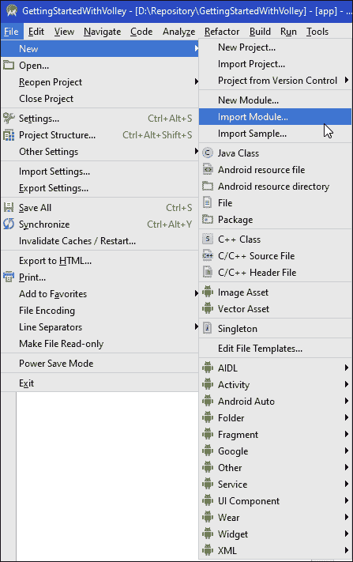
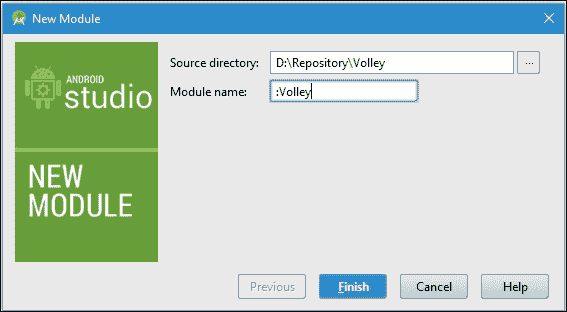

# 十二、电话和网络

在本章中，我们将涵盖以下主题:

*   如何打电话
*   监控电话事件
*   如何发送短信
*   接收短信
*   在应用中显示网页
*   检查联机状态和连接类型
*   互联网请求截击入门
*   取消截击请求
*   使用凌空请求 JSON 响应
*   使用截击请求图像
*   使用凌空的网络图像视图和图像加载器

# 简介

我们将从查看电话功能*如何拨打电话*开始这一章。在探索了如何拨打电话之后，我们来看看如何使用*监控电话事件*来监控电话。接下来我们将通过*了解如何发送短信*，然后我们将通过*了解接收短信。*

然后我们将探索`WebView`为您的应用添加浏览器功能。在基本层面上，`WebView`是一个基本的 HTML 查看器。我们将展示如何扩展`WebViewClient`类，并通过`WebSettings`修改设置，以创建完整的浏览器功能，包括 JavaScript 和缩放功能。

剩下的一章将涵盖凌空，一个通过 AOSP 提供的新图书馆。*互联网请求的凌空入门*介绍将给出安卓上可用的在线库的一些背景信息，并谈论凌空为什么被创建。它还提供了将凌空添加到您的安卓工作室项目的完整演练。

# 如何打电话

正如我们在之前的食谱中看到的，我们可以简单地通过使用一个意图来调用默认的应用。要拨打电话，请在创建意向时使用`Intent.ACTION_DIAL`。您可以使用`setData()`方法输入电话号码。下面是使用指定电话号码调用拨号器应用的示例代码:

```java
Intent intent = new Intent(Intent.ACTION_DIAL);
intent.setData(Uri.parse("tel:" + number));
startActivity(intent);
```

由于您的应用没有拨号，用户必须按下**拨号**按钮，因此您的应用不需要任何拨号权限。下面的食谱将告诉你如何直接拨打电话，绕过`Dial`活动。(为此，您需要添加权限。)

## 做好准备

在 Android Studio 中创建新项目，并将其称为`DialPhone`。使用默认的**电话&平板电脑**选项，当提示输入**活动类型**时，选择**清空活动**。

## 怎么做...

首先，我们需要添加适当的权限来拨打电话。然后，我们需要添加一个按钮来调用我们的`Dial`方法。首先打开安卓清单，然后按照以下步骤操作:

1.  添加以下权限:

    ```java
    <uses-permission android:name="android.permission.CALL_PHONE"></uses-permission>
    ```

2.  打开`activity_main.xml`并用以下按钮替换现有的【T1:

    ```java
    <Button
        android:id="@+id/button"
        android:layout_width="wrap_content"
        android:layout_height="wrap_content"
        android:text="Dial"
        android:layout_centerInParent="true"
        android:onClick="dialPhone"/>
    ```

3.  添加此方法将检查您的应用是否已被授予`CALL_PHONE`权限:

    ```java
    private boolean checkPermission(String permission) {
        int permissionCheck = ContextCompat.checkSelfPermission(
                this, permission);
        return (permissionCheck == PackageManager.PERMISSION_GRANTED);
    }
    ```

4.  添加要拨打的号码:

    ```java
    public void dialPhone(View view){
        if (checkPermission("android.permission.CALL_PHONE")) {
            Intent intent = new Intent(Intent.ACTION_CALL);
            intent.setData(Uri.parse("tel:0123456789"));
            startActivity(intent);
        }
    }
    ```

5.  在您的设备上运行此程序之前，请确保将`0123456789`替换为有效的数字。

## 它是如何工作的...

正如我们从介绍中的代码中看到的，在调用默认的 Dialer 应用时，我们不需要任何权限。但是如果我们想直接拨号，需要添加`CALL_PHONE`权限。从 Android 6.0 棉花糖(API 23)开始，安装过程中不再授予权限，因此，我们在尝试拨号之前会检查应用是否有权限。

## 另见

*   有关更多信息，请参考[第 14 章](14.html "Chapter 14. Getting your app ready for the Play Store")*中的*新运行时权限模型*配方，您的应用已准备好进入游戏商店*。

# 监控电话事件

在之前的食谱中，我们演示了如何打电话，既可以通过一个意图来调用默认应用，也可以通过直接拨打没有用户界面的号码。

如果您想在通话结束时得到通知，该怎么办？这就有点复杂了，因为您需要监控电话事件并跟踪电话状态。在这个食谱中，我们将演示如何创建一个`PhoneStateListener`来读取电话状态事件。

## 做好准备

在 Android Studio 中创建新项目，并将其称为`PhoneStateListener`。使用默认的**电话&平板电脑**选项，当提示输入**活动类型**时，选择**清空活动**。

虽然这不是必需的，但您可以使用之前的方法发起电话来查看事件。否则，使用默认拨号器和/或观察来电事件。(下载文件中提供的示例代码包括以前的配方，以便于查看事件。)

## 怎么做...

我们只需要布局上的单个来显示事件信息。如果您从上一个配方继续或开始新的配方，请打开`activity_main.xml`文件并按照以下步骤操作:

1.  添加或修改`TextView`如下:

    ```java
    <TextView
        android:id="@+id/textView"
        android:layout_width="wrap_content"
        android:layout_height="wrap_content" />
    ```

2.  将以下权限添加到安卓清单中:

    ```java
    <uses-permission android:name="android.permission.READ_PHONE_STATE">
    </uses-permission>
    ```

3.  打开`MainActivity.java`，将以下`PhoneStateListener`类添加到`MainActivity`类:

    ```java
    PhoneStateListener mPhoneStateListener = new PhoneStateListener() {
        @Override
        public void onCallStateChanged(int state, String number) {
            String phoneState = number;
            switch (state) {
                case TelephonyManager.CALL_STATE_IDLE:
                    phoneState += "CALL_STATE_IDLE\n";
                case TelephonyManager.CALL_STATE_RINGING:
                    phoneState += "CALL_STATE_RINGING\n";
                case TelephonyManager.CALL_STATE_OFFHOOK:
                    phoneState += "CALL_STATE_OFFHOOK\n";
            }
            TextView textView = (TextView)findViewById(R.id.textView);
            textView.append(phoneState);
        }
    };
    ```

4.  修改`onCreate()`设置监听器:

    ```java
    final TelephonyManager telephonyManager = (TelephonyManager)getSystemService(Context.TELEPHONY_SERVICE);
    telephonyManager.listen(mPhoneStateListener,PhoneStateListener.LISTEN_CALL_STATE);
    ```

5.  在设备上运行应用，并发起和/或接收电话来查看事件。

## 它是如何工作的...

为了演示如何使用监听器，我们在`onCreate()`中用这两行代码创建了电话监听器:

```java
final TelephonyManager telephonyManager = (TelephonyManager)getSystemService(Context.TELEPHONY_SERVICE);
telephonyManager.listen(mPhoneStateListener,PhoneStateListener.LISTEN_CALL_STATE);
```

当`PhoneState`事件发生时，会发送到我们的`PhoneStateListener`类。

## 还有更多...

在这个配方中，我们正在监控呼叫状态事件，如这个常数所示:`LISTEN_CALL_STATE`。其他有趣的选项包括:

*   `LISTEN_CALL_FORWARDING_INDICATOR`
*   `LISTEN_DATA_CONNECTION_STATE`
*   `LISTEN_SIGNAL_STRENGTHS`

完整列表请看下面`PhoneStateListener`链接。

当我们监听完事件后，调用`listen()`方法并传递`LISTEN_NONE`，如下所示:

```java
telephonyManager.listen(mPhoneStateListener,PhoneStateListener.LISTEN_NONE);
```

## 另见

*   **开发者文档:电话状态列表**[T2](https://developer.android.com/reference/android/telephony/PhoneStateListener.html)

# 如何发送短信(短信)

既然你可能已经熟悉了短信(或短信)，我们就不花时间解释它们是什么或者它们为什么重要了。(如果您不熟悉短信或想了解更多信息，请查看本食谱*参见*部分提供的链接。)本食谱将演示如何发送短信。(下一个食谱将演示如何接收新消息的通知以及如何阅读现有消息。)

## 做好准备

在 Android Studio 中创建新项目，并将其称为`SendSMS`。使用默认的**电话&平板电脑**选项，当提示输入**活动类型**时，选择**清空活动**。

## 怎么做...

首先，我们将添加发送短信所需的权限。然后，我们将创建一个带有**电话号码**和**消息**字段以及**发送**按钮的布局。点击发送按钮后，我们将创建并发送短信。以下是步骤:

1.  打开安卓清单，添加以下权限:

    ```java
    <uses-permission android:name="android.permission.SEND_SMS"/>
    ```

2.  打开`activity_main.xml`并用以下 XML 替换现有的【T1:

    ```java
    <EditText
        android:id="@+id/editTextNumber"
        android:layout_width="match_parent"
        android:layout_height="wrap_content"
        android:inputType="number"
        android:ems="10"
        android:layout_alignParentTop="true"
        android:layout_centerHorizontal="true"
        android:hint="Number"/>
    <EditText
        android:id="@+id/editTextMsg"
        android:layout_width="match_parent"
        android:layout_height="wrap_content"
        android:layout_below="@+id/editTextNumber"
        android:layout_centerHorizontal="true"
        android:hint="Message"/>
    <Button
        android:id="@+id/buttonSend"
        android:layout_width="wrap_content"
        android:layout_height="wrap_content"
        android:text="Send"
        android:layout_below="@+id/editTextMsg"
        android:layout_centerHorizontal="true"
        android:onClick="send"/>
    ```

3.  打开`MainActivity.java`并添加以下全局变量:

    ```java
    final int SEND_SMS_PERMISSION_REQUEST_CODE=1;
    Button mButtonSend;
    ```

4.  将以下代码添加到现有的`onCreate()`回调中:

    ```java
    mButtonSend = (Button)findViewById(R.id.buttonSend);
    mButtonSend.setEnabled(false);

    if (checkCallPermission(Manifest.permission.SEND_SMS)) {
        mButtonSend.setEnabled(true);
    } else {
        ActivityCompat.requestPermissions(this,
                new String[]{Manifest.permission.SEND_SMS},
                SEND_SMS_PERMISSION_REQUEST_CODE);
    }
    ```

5.  增加以下方法检查权限:

    ```java
    private boolean checkPermission(String permission) {
        int permissionCheck = ContextCompat.checkSelfPermission(this,permission);
        return (permissionCheck == PackageManager.PERMISSION_GRANTED);
    }
    ```

6.  覆盖`onRequestPermissionsResult()`处理许可请求响应:

    ```java
    @Override
    public void onRequestPermissionsResult(int requestCode,String permissions[], int[] grantResults) {
        switch (requestCode) {
            case SEND_SMS_PERMISSION_REQUEST_CODE: {
                if (grantResults.length > 0 && grantResults[0] == PackageManager.PERMISSION_GRANTED) {
                    mButtonSend.setEnabled(true);
                }
                return;
            }
        }
    }
    ```

7.  最后，添加方法实际发送短信:

    ```java
    public void send(View view) {
        String phoneNumber = ((EditText)findViewById(R.id.editTextNumber)).getText().toString();
        String msg = ((EditText)findViewById(R.id.editTextMsg)).getText().toString();

        if (phoneNumber==null || phoneNumber.length()==0 || msg==null || msg.length()==0 ) {
            return;
        }

        if (checkPermission(Manifest.permission.SEND_SMS)) {
            SmsManager smsManager = SmsManager.getDefault();
            smsManager.sendTextMessage(phoneNumber, null, msg, null, null);
        } else {
            Toast.makeText(MainActivity.this, "No Permission", Toast.LENGTH_SHORT).show();
        }
    }
    ```

8.  您已经准备好在设备或模拟器上运行应用。(发送到另一个仿真器时，请使用仿真器设备号，如 5556。)

## 它是如何工作的...

发送短信的代码只有两行，如下所示:

```java
SmsManager smsManager = SmsManager.getDefault();
smsManager.sendTextMessage(phoneNumber, null, msg, null, null);
```

`sendTextMessage()`方法进行实际发送。这个食谱的大部分代码是为了设置权限，因为权限模型在安卓 6.0 棉花糖(API 23)中被改变了。

## 还有更多...

发送短信这么简单，我们还有几个选择。

### 多部分消息

虽然它可能因承运人而异，但 160 通常是每个文本消息允许的最大字符数。您可以修改前面的代码来检查消息是否超过 160 个字符，如果超过，您可以调用 SMSManager `divideMessage()`方法。该方法返回一个`ArrayList`，可以发送到`sendMultipartTextMessage()`。这里有一个例子:

```java
ArrayList<String> messages=smsManager.divideMessage(msg);
smsManager.sendMultipartTextMessage(phoneNumber, null, messages, null, null);
```

### 类型

请注意，使用模拟器时，使用`sendMultipartTextMessage()`发送的消息可能无法正常工作，因此请务必在真实设备上进行测试。

### 交货状态通知

如果您希望收到消息状态的通知，有两个可选字段可以使用。以下是**经理**文件中定义的`sendTextMessage()`方法:

```java
sendTextMessage(String destinationAddress, String scAddress, String text, PendingIntent sentIntent, PendingIntent deliveryIntent)
```

您可以包含一个待处理的意向，以获得发送状态和/或交付状态的通知。收到您的待处理意向后，如果发送成功，它将包含带有`Activity.RESULT_OK`的结果代码，或者包含在**管理器**文档中定义的错误代码(以下*中提到的链接，另请参见*部分):

*   `RESULT_ERROR_GENERIC_FAILURE`:一般故障原因
*   `RESULT_ERROR_NO_SERVICE`:失败，因为服务当前不可用
*   `RESULT_ERROR_NULL_PDU`:失败，因为没有提供 PDU
*   `RESULT_ERROR_RADIO_OFF`:失败，因为无线电被明确关闭

## 另见

*   https://en.wikipedia.org/wiki/Short_Message_Service 维基百科上的短消息服务
*   **开发者文档:SMSManager**[T2](https://developer.android.com/reference/android/telephony/SmsManager.html)

# 接收短信

本食谱将演示如何设置广播接收器来通知您新的短信。值得注意的是，您的应用不需要运行就能接收短信意图。安卓会启动你的服务来处理短信。

## 做好准备

在 Android Studio 中创建新项目，并将其称为`ReceiveSMS`。使用默认的**电话&平板电脑**选项，当提示输入**活动类型**时，选择**清空活动**。

## 怎么做...

我们不会在这个演示中使用布局，因为所有的工作都将在广播接收器中进行。我们将使用祝酒词来显示收到的短信。打开安卓清单，按照以下步骤操作:

1.  添加以下权限:

    ```java
    <uses-permission android:name="android.permission.RECEIVE_SMS" />
    ```

2.  将广播接收器的以下声明添加到`<application>`元素中:

    ```java
    <receiver android:name=".SMSBroadcastReceiver">
        <intent-filter>
            <action android:name="android.provider.Telephony.SMS_RECEIVED">
            </action>
        </intent-filter>
    </receiver>
    ```

3.  打开`MainActivity.java`添加如下方法:

    ```java
    private boolean checkPermission(String permission) {
        int permissionCheck = ContextCompat.checkSelfPermission(
                this, permission);
        return (permissionCheck == PackageManager.PERMISSION_GRANTED);
    }
    ```

4.  修改已有的`onCreate()`回调检查权限:

    ```java
    if (!checkPermission(Manifest.permission.RECEIVE_SMS)) {
        ActivityCompat.requestPermissions(this,new String[]{Manifest.permission.RECEIVE_SMS}, 0);
    }
    ```

5.  使用以下代码向名为`SMSBroadcastReceiver`的项目中添加一个新的 Java 类:

    ```java
    public class SMSBroadcastReceiver extends BroadcastReceiver {
        final String SMS_RECEIVED = "android.provider.Telephony.SMS_RECEIVED";

        @Override
        public void onReceive(Context context, Intent intent) {
            if (SMS_RECEIVED.equals(intent.getAction())) {
                Bundle bundle = intent.getExtras();
                if (bundle != null) {
                    Object[] pdus = (Object[]) bundle.get("pdus");
                    String format = bundle.getString("format");
                    final SmsMessage[] messages = new SmsMessage[pdus.length];
                    for (int i = 0; i < pdus.length; i++) {
                        if (Build.VERSION.SDK_INT >= Build.VERSION_CODES.M) {
                            messages[i] = SmsMessage.createFromPdu((byte[]) pdus[i], format);
                        } else {
                            messages[i] = SmsMessage.createFromPdu((byte[]) pdus[i]);
                        }
                        Toast.makeText(context, messages[0].getMessageBody(), Toast.LENGTH_SHORT).show();
                    }
                }
            }
        }
    }
    ```

6.  您已经准备好在设备或模拟器上运行应用。

## 它是如何工作的...

就像前面关于发送短信的食谱一样，我们首先需要检查应用是否有权限。(在安卓 6.0 之前的设备上，清单声明将自动提供权限，但是对于棉花糖和更高版本，我们需要像这里一样提示用户。)

如您所见，广播接收器会收到新短信的通知。我们告诉系统，我们希望使用安卓清单中的代码接收新的短信接收广播:

```java
<receiver android:name=".SMSBroadcastReceiver">
    <intent-filter>
        <action android:name="android.provider.Telephony.SMS_RECEIVED"></action>
    </intent-filter>
</receiver>
```

通知通过标准的`onRecieve()`回调进入，因此我们使用以下代码检查操作:

```java
if (SMS_RECEIVED.equals(intent.getAction())) {}
```

这可能是本演示中最复杂的一行代码:

```java
messages[i] = SmsMessage.createFromPdu((byte[]) pdus[i]);
```

基本上，它调用 `SmsMessage`库从 PDU 创建一个 SMSMessage 对象。(协议数据单元的缩写，是短信的二进制数据格式。)如果你不熟悉 PDU 阵型，那就不需要。`SmsMessage`库会为您处理，并返回一个短信对象。

### 类型

如果您的应用没有接收到短信广播消息，则可能是现有应用阻止了您的应用。您可以尝试增加`intent-filter`中的优先级值，如下所示，或者禁用/卸载其他应用:

```java
<intent-filter android:priority="100">
    <action android:name="android.provider.Telephony.SMS_RECEIVED" />
</intent-filter>
```

## 还有更多...

这个方法演示了在收到短信时显示短信，但是阅读现有的短信呢？

### 阅读现有短信

首先，要阅读现有的消息，您需要以下权限:

```java
<uses-permission android:name="android.permission.READ_SMS" />
```

以下是使用短信内容提供商获取光标的示例:

```java
Cursor cursor = getContentResolver().query(Uri.parse("content://sms/"), null, null, null, null);
while (cursor.moveToNext()) {
    textView.append("From :" + cursor.getString(1) + " : " + cursor.getString(11)+"\n");
}
```

在撰写本文时，短信内容提供商有 30 多个栏目。以下是最有用的前 12 个(记住，列数从零开始):

0.`_id`

1.`thread_id`

2.`address`

3.`person`

4.`date`

5.`protocol`

6.`read`

7.`status`

8.`type`

9.`reply_path_present`

10.`subject`

11.`body`

请记住，内容提供者不是公共 API 的一部分，可以在不通知的情况下进行更改。

## 另见

*   **开发者文档:SmsManager**[T2](https://developer.android.com/reference/android/telephony/SmsManager.html)
*   **协议数据单元(协议数据单元)**[https://en.wikipedia.org/wiki/Protocol_data_unit](https://en.wikipedia.org/wiki/Protocol_data_unit)的 T2
*   **开发者文档:电话。**T2[短信。Sms.Intents.html](https://developer.android.com/reference/android/provider/Telephony.Sms.Intents.html)

# 在应用中显示网页

当你想要在网页上显示 HTML 内容时，你有两个选择:调用默认浏览器或者在你的应用内显示。如果您只想调用默认浏览器，请使用如下的意图:

```java
Uri uri = Uri.parse("https://www.packtpub.com/");
Intent intent = new Intent(Intent.ACTION_VIEW, uri);
startActivity(intent);
```

如果您需要在自己的应用中显示内容，您可以使用`WebView`。这个方法将展示如何在你的应用中显示一个网页，如这个截图所示:


## 做好准备

在 Android Studio 中创建新项目，并将其称为`WebView`。使用默认的**电话&平板电脑**选项，当提示输入**活动类型**时，选择**清空活动**。

## 怎么做...

我们将通过代码创建`WebView`，这样我们就不会修改布局。我们将从打开安卓清单开始，并遵循以下步骤:

1.  添加以下权限:

    ```java
    <uses-permission android:name="android.permission.INTERNET"/>
    ```

2.  修改现有的`onCreate()`包括以下代码:

    ```java
    WebView webview = new WebView(this);
    setContentView(webview);
    webview.loadUrl("https://www.packtpub.com/");
    ```

3.  您已经准备好在设备或模拟器上运行应用。

## 它是如何工作的...

我们创建一个 `WebView`作为我们的布局，并用`loadUrl()`加载我们的网页。前面的代码可以工作，但是在这个级别上，它是非常基本的，只显示第一页。如果您点击任何链接，默认浏览器将处理该请求。

## 还有更多...

如果你想要完整的网页浏览功能，这样他们点击的任何链接仍然会加载到你的`WebView`中呢？创建一个`WebViewClient`，如该代码所示:

```java
webview.setWebViewClient(new WebViewClient());
```

### 控制页面导航

如果你想要更多的控制页面导航，比如只允许自己网站内的链接，你可以创建自己的`WebViewClient`类并覆盖`shouldOverrideUrlLoading()`回调，如下图所示:

```java
private class mWebViewClient extends WebViewClient {
    @Override
    public boolean shouldOverrideUrlLoading(WebView view, String url) {
        if (Uri.parse(url).getHost().equals("www.packtpub.com")) {
            return false;  //Don't override since it's the same //host
        } else {
            return true; //Stop the navigation since it's a //different site
        }
    }
}
```

### 如何启用 JavaScript

还有很多其他的变化我们可以通过`WebView`的`WebSettings`定制。如果要启用 JavaScript，获取`WebView`的`WebSettings`，调用`setJavaScriptEnabled()`，如图:

```java
WebSettings webSettings = webview.getSettings();
webSettings.setJavaScriptEnabled(true);
```

### 启用内置缩放

另一个 `webSetting`选项是`setBuiltInZoomControls()`。继续前面的代码，只需添加:

```java
webSettings.setBuiltInZoomControls(true);
```

查看下一部分的`webSetting`链接，查看更多选项的列表。

## 另见

*   **开发者文档:位于[的](https://developer.android.com/reference/android/webkit/WebView.html)网络视图**
*   **开发者文档:位于[的](https://developer.android.com/reference/android/webkit/WebSettings.html)网站设置**
*   **开发者文档:安卓.网络工具包**[T2](https://developer.android.com/reference/android/webkit/package-summary.html)

# 检查在线状态和连接类型

这是一个简单的食谱，但是一个非常常见的食谱，可能会包含在您构建的每个互联网应用中:检查在线状态。在检查在线状态的同时，我们还可以检查连接类型:WIFI 或 MOBILE。

## 做好准备

在 Android Studio 中创建新项目，并将其称为`isOnline`。使用默认的**电话&平板电脑**选项，当提示输入**活动类型**时，选择**清空活动**。

## 怎么做...

首先，我们需要添加访问网络的必要权限。然后，我们将用`Button`和`TextView`创建一个简单的布局。要开始，请打开安卓清单并按照以下步骤操作:

1.  添加以下权限:

    ```java
    <uses-permission android:name="android.permission.INTERNET"/>
    <uses-permission android:name="android.permission.ACCESS_NETWORK_STATE" />
    ```

2.  打开`activity_main.xml`文件，将现有的`TextView`替换为以下视图:

    ```java
    <TextView
        android:id="@+id/textView"
        android:layout_width="wrap_content"
        android:layout_height="wrap_content"
        android:text="" />
    <Button
        android:layout_width="wrap_content"
        android:layout_height="wrap_content"
        android:text="Check"
        android:layout_centerInParent="true"
        android:onClick="checkStatus"/>
    ```

3.  如果连接，将此方法添加到报告中:

    ```java
    private boolean isOnline() {
        ConnectivityManager connectivityManager = (ConnectivityManager)getSystemService(Context.CONNECTIVITY_SERVICE);
        NetworkInfo networkInfo = connectivityManager.getActiveNetworkInfo();
        return (networkInfo != null && networkInfo.isConnected());
    }
    ```

4.  添加以下方法处理按钮点击:

    ```java
    public void checkStatus(View view) {
        TextView textView = (TextView)findViewById(R.id.textView);
        if (isOnline()) {
            ConnectivityManager connectivityManager = (ConnectivityManager)getSystemService(Context.CONNECTIVITY_SERVICE);
            NetworkInfo networkInfo = connectivityManager.getActiveNetworkInfo();
            textView.setText(networkInfo.getTypeName());
        } else {
            textView.setText("Offline");
        }
    }
    ```

5.  您已经准备好在设备或模拟器上运行应用。

## 它是如何工作的...

我们创建了`isOnline()`方法，以便于重用这些代码。

为了检查状态，我们获得一个`ConnectivityManager`的实例来读取的`NetworkInfo`状态。如果它报告我们已连接，我们通过调用`getType()`获得活动网络的名称，这将返回以下常量之一:

*   `TYPE_MOBILE`
*   `TYPE_WIFI`
*   `TYPE_WIMAX`
*   `TYPE_ETHERNET`
*   `TYPE_BLUETOOTH`

另外，更多常量请参见后面的`ConnectivityManager`链接。出于显示目的，我们称之为`getTypeName()`。我们可以调用`getType()`来获得一个数字常量。

## 还有更多...

让我们看看`ConnectivityManager`的一些附加常数。

### 监测网络状态变化

如果您的应用需要来响应网络状态的变化，请查看`ConnectivityManager`中的`CONNECTIVITY_ACTION`。您需要创建一个广播接收器，然后注册该事件。下面是一个如何通过安卓清单将动作包含在接收者意图过滤器中的例子:

```java
<receiver android:name="com.vcs.timetrac.VCSBroadcastReceiver">
    <intent-filter>
        <action android:name="android.net.conn.CONNECTIVITY_CHANGE" />
    </intent-filter>
</receiver>
```

小心使用安卓清单，因为每当网络状态发生变化时，它都会通知你的应用，即使你的应用没有被使用。这会导致不必要的电池消耗。如果您的应用只需要在用户实际使用您的应用时响应网络变化，请改为在代码中创建监听器。

## 另见

*   **开发者文档:ConnectivityManager**[T2](https://developer.android.com/reference/android/net/ConnectivityManager.html)
*   **开发者文档:网络信息**[T2](https://developer.android.com/reference/android/net/NetworkInfo.html)

# 开始使用网络请求截击

安卓包括多个互联网查询库，包括 Apache `HttpClient`和`HttpURLConnection`。Apache `HttpClient`是安卓 2.3 姜饼(API 9)之前推荐的库。安卓 2.3 姜饼(API 9)看到`HttpURLConnection`库有很多改进，成为推荐库，直到今天依然如此。随着 Android 6.0 的发布，Apache `HttpClient`已经从 SDK 中完全移除，剩下`HttpURLConnection`库作为推荐的替代。

虽然`HttpURLConnection`库仍然可以工作并且有它的用途，但是它也有缺点:如果你是写 web 请求的新手，它不是最容易使用的库，并且它需要大量重复的开销代码。幸运的是，我们从谷歌游戏小组的谷歌开发者*费克斯·柯克帕特里克*那里获得了一个新的选择。他发布了一个名为凌空的库，它提供了一个简化的包装。(默认使用`HttpURLConnection`库，也可以和其他库一起使用。)

### 注

你可以在这里看到他的谷歌输入输出演示:

[https://www.youtube.com/watch?v=yhv8l9F44qo](https://www.youtube.com/watch?v=yhv8l9F44qo)

在`HttpURLConnection`上使用截击的几个原因包括:

*   线程池(默认为四个线程)
*   透明磁盘缓存
*   队列优先级设置

还有额外的好处，但仅这三点就使它值得学习凌空。第四个好处是缺少样板代码，如果你曾经使用过`HttpURLConnection`的话，这个好处会变得很明显。库将在内部处理这些检查，让您能够更专注于手头的特定任务，而不是必须围绕您的许多调用编写一堆标准的`try` / `catch`代码。

凌空内置支持以下请求类型:

*   线
*   JSON
*   图像
*   习俗

虽然凌空擅长多个小请求调用(如滚动一个`ListView`时)，但不擅长大文件下载，因为返回的对象在内存中解析。对于更大的文件下载，看看`DownloadManager`(见食谱末尾的链接)。同样，出于同样的原因，它不是流媒体内容的解决方案；关于这一点，请参考`HttpURLConnection`。

由于凌空目前不在安卓软件开发工具包中，我们需要下载代码并将其添加到我们的项目中。这个方法将引导你完成向你的应用项目添加截击和发出简单请求的步骤。

## 做好准备

在创建新项目之前，使用以下 Git 命令下载**安卓开源项目**(**【AOSP】**)网站上托管的凌空项目文件:

```java
git clone https://android.googlesource.com/platform/frameworks/volley

```

如果您不熟悉 Git，请查看本食谱末尾的 Git(软件)链接，了解更多信息，并帮助您为您的平台找到 Git 客户端。Git 是一款在很多平台上使用的**版本控制软件** ( **VCS** ) 。(安装完成后，还可以在 Android Studio 中集成 Git VCS。)

在 Android Studio 中创建新项目，并将其称为`SetupVolley`。使用默认的**电话&平板电脑**选项，当提示输入**活动类型**时，选择**清空活动**。

## 怎么做...

在开始这些步骤之前，请确保您已经如前所述下载了凌空项目。我们将通过在项目中添加凌空来开始下面的步骤，进行一个简单的互联网调用。我们将使用布局中的一个按钮启动请求，并使用`TextView`显示结果。以下是步骤:

1.  打开安卓清单，添加以下权限:

    ```java
    <uses-permission android:name="android.permission.INTERNET"/>
    ```

2.  Import the `Volley` module by going to **File** | **New** | **Import Module** (see the following screenshot) and follow the wizard.

    

3.  On the second page of the **New Module** Import Wizard (see the following screenshot), you need to specify the location of the Volley files and assign the **Module name**. This is the name we'll need in the next step:

    

4.  Under the `Gradle Scripts` section, open the `build.gradle (Module: app)` file. See the following screenshot:

    

5.  Add/verify the following statement in the `dependencies` section:

    ```java
    compile project(":Volley")
    ```

    ### 注

    括号中的值需要与您在上一步中指定的模块名称相匹配。

6.  在`Gradle Scripts`下，打开`settings.gradle`文件，验证内容如下:

    ```java
    include ':app', ':Volley'
    ```

7.  打开`activity_main.xml`文件，用以下`TextView`和`Button`元素替换现有的`TextView`:

    ```java
    <TextView
        android:id="@+id/textView"
        android:layout_width="wrap_content"
        android:layout_height="wrap_content"
        android:layout_alignParentTop="true"
        android:layout_alignParentLeft="true"
        android:layout_above="@+id/button" />
    <Button
        android:id="@+id/button"
        android:layout_width="wrap_content"
        android:layout_height="wrap_content"
        android:text="Request"
        android:layout_alignParentBottom="true"
        android:layout_centerHorizontal="true"
        android:onClick="sendRequest"/>
    ```

8.  添加按钮调用的`sendRequest()`方法点击:

    ```java
    public void sendRequest(View view) {
        final TextView textView = (TextView)findViewById(R.id.textView);
        RequestQueue queue = Volley.newRequestQueue(this);
        String url ="https://www.packtpub.com/";
        StringRequest stringRequest = new StringRequest(Request.Method.GET, url,new Response.Listener<String>() {
            @Override
            public void onResponse(String response) {
                textView.setText(response.substring(0,500));
            }
        }, new Response.ErrorListener() {
            @Override
            public void onErrorResponse(VolleyError error) {
                textView.setText("onErrorResponse(): "+ error.getMessage());
            }
        });
        queue.add(stringRequest);
    }
    ```

9.  您已经准备好在设备或模拟器上运行应用。

## 它是如何工作的...

了解在凌空中，互联网交易被称为*请求*可能会有所帮助。要执行请求，请将其添加到队列中。为了实现这一点，我们首先创建一个凌空的实例`RequestQueue`，然后创建一个`StringRequest`并将其添加到队列中。一`StringRequest`正是它听起来的样子；我们请求字符串响应。

对于这个食谱，我们只需调用 Packt Publishing 网站，并获得字符串响应的页面。由于这只是为了说明，我们只显示前 500 个字符。

## 还有更多...

现在您已经正确设置了凌空并进行互联网请求，该食谱将成为后续凌空食谱的构建模块。

## 另见

*   **截击**:在Git 在[谷歌在](https://android.googlesource.com/platform/frameworks/volley)https://android.googlesource.com/platform/frameworks/volley
*   **Git** (软件):维基百科，位于[的](https://en.wikipedia.org/wiki/Git_(software))免费百科全书
*   **开发者文档:下载管理器**[T2](http://developer.android.com/reference/android/app/DownloadManager.html)
*   **开发者文档:HttpURLConnection**[T2](https://developer.android.com/reference/java/net/HttpURLConnection.html)

# 取消截击请求

在前面的食谱中，我们演示了如何向凌空队列添加请求。如果你不再需要回应会发生什么？如果用户正在滚动一个`ListView`，而你正在通过从网上获取信息来更新`ListItems`，这可能会发生。让请求在知道您将丢弃响应的情况下完成将会浪费带宽、功率和 CPU 周期。

如果您正在使用`HTTPURLConnection`库，您将需要跟踪所有请求并手动取消它们。这个食谱会告诉你在截击中取消请求有多容易。

## 做好准备

如果您还没有完成之前的食谱*开始使用网络请求截击*，您需要按照步骤 1-5 将截击模块添加到您的应用中。

在 Android Studio 中创建新项目，并将其称为`CancelVolleyRequest`。使用默认的**电话&平板电脑**选项，当提示输入**活动类型**时，选择**清空活动**。

## 怎么做...

如果您还没有将截击模块添加到您的应用中，请查看前面的部分。将凌空添加到您的项目中，请遵循以下步骤:

1.  打开`activity_main.xml`并用以下 XML 替换现有的【T1:

    ```java
    <TextView
        android:id="@+id/textView"
        android:layout_width="wrap_content"
        android:layout_height="wrap_content"
        android:layout_alignParentTop="true"
        android:layout_alignParentLeft="true"
        android:layout_above="@+id/button" />
    <Button
        android:id="@+id/button"
        android:layout_width="100dp"
        android:layout_height="wrap_content"
        android:text="Request"
        android:layout_centerInParent="true"
        android:onClick="sendRequest"/>
    <Button
        android:id="@+id/buttonClose"
        android:layout_width="100dp"
        android:layout_height="wrap_content"
        android:layout_below="@+id/button"
        android:layout_centerHorizontal="true"
        android:text="Close"
        android:onClick="close"/>
    ```

2.  打开`MainActivity.java`并添加以下全局变量:

    ```java
    RequestQueue mRequestQueue;
    ```

3.  编辑现有的`onCreate()`来初始化`RequestQueue` :

    ```java
    mRequestQueue = Volley.newRequestQueue(this);
    ```

4.  添加以下`sendRequest()`方法(注意，这类似于之前食谱中的`sendRequest()`方法，但有几处更改):

    ```java
    public void sendRequest(View view) {
        final TextView textView = (TextView)findViewById(R.id.textView);

        String url ="https://www.packtpub.com/";
        StringRequest stringRequest = new StringRequest(Request.Method.GET, url,new Response.Listener<String>() {
            @Override
            public void onResponse(String response) {
                textView.setText(response.substring(0,500));
            }
        }, new Response.ErrorListener() {
            @Override
            public void onErrorResponse(VolleyError error) {
                textView.setText("onErrorResponse(): "+ error.getMessage());
            }
        });
        stringRequest.setTag(this);
        mRequestQueue.add(stringRequest);
        finish();
    }
    ```

5.  添加**关闭**按钮的`onClick`方法:

    ```java
    public void close(View view){
        finish();
    }
    ```

6.  为`onStop()`回调创建以下覆盖:

    ```java
    @Override
    protected void onStop() {
        super.onStop();
        mRequestQueue.cancelAll(this);
    }
    ```

7.  您已经准备好在设备或模拟器上运行应用。

## 它是如何工作的...

要取消请求，我们可以调用`RequestQueue` `cancelAll()`方法并传入我们的标签。在这个例子中，我们使用活动`this`作为我们的标签，但是我们可以使用任何对象作为我们的标签。这允许为您的请求创建您可能需要的任何分组。

## 还有更多...

我们不仅展示了取消请求有多容易，我们还展示了一种防御性编程策略。通过确保我们的所有请求都被取消，我们将不必添加代码来检查我们的响应中的空活动，因为凌空保证我们不会在请求被取消后收到任何来自请求的响应。

# 使用凌空请求 JSON 响应

由于 JavaScript 对象符号(JSON)可能是最常见的数据交换格式，您可能会发现自己需要调用一个 JSON 网络服务。(如果您不熟悉 JSON，请查看本食谱末尾的链接。)这个食谱将演示如何使用截击进行 JSON 请求。

## 做好准备

在 Android Studio 中创建新项目，并将其称为`JSONRequest`。使用默认的**电话&平板电脑**选项，当提示输入**活动类型**时，选择**清空活动**。

本食谱将使用截击设置，如*互联网请求截击入门*中所述。按照步骤 1-5 将凌空添加到您的新项目。

## 怎么做...

如前所述，将凌空添加到项目中后，请执行以下步骤:

1.  打开`activity_main.xml`并用以下 XML 替换现有的【T1:

    ```java
    <TextView
        android:id="@+id/textView"
        android:layout_width="wrap_content"
        android:layout_height="wrap_content"
        android:layout_alignParentTop="true"
        android:layout_alignParentLeft="true"
        android:layout_above="@+id/button" />
    <Button
        android:id="@+id/button"
        android:layout_width="wrap_content"
        android:layout_height="wrap_content"
        android:text="Request"
        android:layout_alignParentBottom="true"
        android:layout_centerHorizontal="true"
        android:onClick="sendRequest"/>
    ```

2.  增加以下`sendRequest()`方法:

    ```java
    public void sendRequest(View view) {
        final TextView textView = (TextView)findViewById(R.id.textView);
        RequestQueue queue = Volley.newRequestQueue(this);
        String url ="<json service>";
        //"http://ip.jsontest.com/"

        JsonObjectRequest jsonObjectRequest = new JsonObjectRequest(Request.Method.GET, url, null, new Response.Listener<JSONObject>() {
            @Override
            public void onResponse(JSONObject response) {
                textView.setText(response.toString());
            }
        }, new Response.ErrorListener() {
            @Override
            public void onErrorResponse(VolleyError error) {
                textView.setText("onErrorResponse(): "+ error.getMessage());
            }
        });
        queue.add(jsonObjectRequest);
    }
    ```

3.  在运行此应用之前，在代码中替换中的字符串。

## 它是如何工作的...

使用`JsonObjectRequest()`请求 JSON 响应的工作原理与`StringRequest()`基本相同。不同的是回应，回复为`JSONObject`。

要运行此代码，您需要用您的 web 服务 URL 替换`url`参数。如果你没有可以测试的网络服务，你可以从 JSON 测试网站([http://www.jsontest.com/](http://www.jsontest.com/)上尝试一个链接。

## 还有更多...

在前面的例子中，我们用`JsonObjectRequest`请求了一个`JSONObject`。我们也可以用`JsonArrayRequest`要求一个`JSONARray`。

## 另见

*   访问 http://json.org/的 JSON 网页
*   **开发者文档:org.json (JSON Libraries)** 在[http://Developer . Android . com/reference/org/JSON/package-summary . html](http://developer.android.com/reference/org/json/package-summary.html)

# 使用凌空请求图像

一旦你做出了上一个食谱中展示的【JSON 请求，下一个最有可能的调用就是获取图像。本食谱将演示如何请求图像更新`ImageView`。

## 做好准备

在 Android Studio 中创建新项目，并将其称为`ImageRequest`。使用默认的**电话&平板电脑**选项，当提示输入**活动类型**时，选择**清空活动**。

该配方将使用*互联网请求凌空入门*配方中描述的设置。按照步骤 1-5 将凌空添加到您的新项目。

## 怎么做...

如前所述，将凌空添加到项目中后，请执行以下步骤:

1.  打开`activity_main.xml`并用以下 XML 替换现有的【T1:

    ```java
    <ImageView
        android:id="@+id/imageView"
        android:layout_width="wrap_content"
        android:layout_height="wrap_content"
        android:layout_centerInParent="true" />
    <Button
        android:id="@+id/button"
        android:layout_width="wrap_content"
        android:layout_height="wrap_content"
        android:text="Request"
        android:layout_alignParentBottom="true"
        android:layout_centerHorizontal="true"
        android:onClick="sendRequest"/>
    ```

2.  添加以下`sendRequest()`方法:

    ```java
    public void sendRequest(View view) {
        final ImageView imageView = (ImageView)findViewById(R.id.imageView);
        RequestQueue queue = Volley.newRequestQueue(this);
        String url ="http://www.android.com/static/img/logos-2x/android-wordmark-8EC047.png";
        ImageRequest imageRequest = new ImageRequest(url,
            new Response.Listener<Bitmap>() {
                @Override
                public void onResponse(Bitmap bitmap) {
                    imageView.setImageBitmap(bitmap);
                }
            }, 0, 0, ImageView.ScaleType.CENTER, null,
            new Response.ErrorListener() {
                @Override
                public void onErrorResponse(VolleyError error) {
                    error.printStackTrace();
                }
            });
        queue.add(imageRequest);
    }
    ```

3.  在设备或模拟器上运行应用。

## 它是如何工作的...

这个食谱基本上和前面两个截击请求的工作方式相同。在这个食谱中，我们将一个网址传递给一个图像，并在响应中加载`ImageView`。

我们现在已经讨论了三种基本的请求类型:字符串、JSON 和图像。

## 还有更多...

虽然基本类型可能会满足您的大部分需求，但是凌空是可扩展的，您也可以通过扩展`Request<T>`来实现自定义响应。

这个配方展示了我们的示例代码的一个问题。如果您更改设备的方向，您将看到图像在重新创建活动时闪烁。

### 创建一个单次齐射

建议将凌空实例化为单体。(另一种方法是在应用类中创建队列。)在安卓工作室创建一个 singleton 类，去**新建** | **文件** | **Singleton** 给它一个类名，比如`VolleySingleton`。

将创建请求队列的代码移到 singleton 类中。如果您创建如下方法:

```java
public <T> void addToRequestQueue(Request<T> req) {
    mRequestQueue.add(req);
}
```

然后，您可以使用以下代码从任何位置添加到队列中:

```java
VolleySingleton.getInstance(this).addToRequestQueue(stringRequest);
```

使其正常工作的关键是通过对传入的上下文调用`getApplicationContext()`，始终使用应用上下文(而不是活动或广播接收器上下文)。

## 另见

*   **开发者文档:应用(类)** 在[https://Developer . Android . com/reference/Android/app/Application . html](https://developer.android.com/reference/android/app/Application.html)

# 使用凌空的网络图像视图和图像加载器

我们截击的最后一个食谱本身不是一个请求，而是 `ImageView`的替代品。请求图像来填充`ImageView`是这样一个常见的任务；凌空将这一功能结合到一个名为`NetworkImageView`的新视图中。这个食谱将演示如何使用`NetworkImageView`。

## 做好准备

在 Android Studio 中创建新项目，并将其称为`NetworkImageView`。使用默认的**电话&平板电脑**选项，当提示输入**活动类型**时，选择**清空活动**。

该配方将使用*互联网请求凌空入门*配方中描述的设置。按照步骤 1-5 将凌空添加到您的新项目。

## 怎么做...

如前所述，将“截击”添加到您的项目中后，请按照以下步骤操作:

1.  打开`activity_main.xml`并用以下 XML 替换现有的【T1:

    ```java
    <com.android.volley.toolbox.NetworkImageView
        android:id="@+id/networkImageView"
        android:layout_width="wrap_content"
        android:layout_height="wrap_content"
        android:layout_centerInParent="true" />
    ```

2.  将以下代码添加到现有的`onCreate()`回调中:

    ```java
    NetworkImageView networkImageView = (NetworkImageView)findViewById(R.id.networkImageView);
    String url="http://www.android.com/static/img/logos-2x/android-wordmark-8EC047.png";
    RequestQueue queue = Volley.newRequestQueue(this);
    ImageLoader imageLoader = new ImageLoader(queue,new ImageLoader.ImageCache() {
            private final LruCache<String, Bitmap>cache = new LruCache<String, Bitmap>(20);

            @Override
            public Bitmap getBitmap(String url) {
                return cache.get(url);
            }

            @Override
            public void putBitmap(String url, Bitmap bitmap) {
                cache.put(url, bitmap);
            }
        });
    networkImageView.setImageUrl(url,imageLoader);
    ```

3.  您已经准备好在设备或模拟器上运行应用。

## 它是如何工作的...

这个例子与前面的凌空例子非常不同。我们不创建请求对象，而是创建一个`ImageLoader`。`ImageLoader`类允许我们覆盖默认的缓存行为，比如位图的数量或者大小是如何计算的。(我们可以将缓存更改为基于总内存，而不是图像数量。)更多信息请参见后面的`LruCache`链接。

创建`ImageLoader`后，可以将图像 URL 分配给`NetworkImageView`，并将`ImageLoader`作为第二个参数。

## 还有更多...

正如我们在前面的食谱中提到的，我们的凌空示例的问题是我们在活动中创建了队列。这在图像中最明显，但是无论如何，建议创建一个凌空单例。更多信息请参见上一个食谱中的*创建凌空单例*部分。

如果您按照前面的方法创建了单例，您也可以将`ImageLoader`代码移动到单例中，并像这样公开`ImageLoader`:

```java
public ImageLoader getImageLoader() {
    return mImageLoader;
}
```

创建单例后，该配方可以编码如下:

```java
NetworkImageView networkImageView = (NetworkImageView)findViewById(R.id.networkImageView);
String url="http://www.android.com/static/img/logos-2x/android-wordmark-8EC047.png";
networkImageView.setImageUrl(url, VolleySingleton.getInstance(this).getImageLoader());
```

## 另见

*   **开发者文档:LruCache**[T2](https://developer.android.com/reference/android/util/LruCache.html)