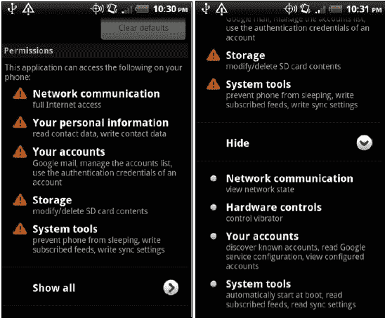
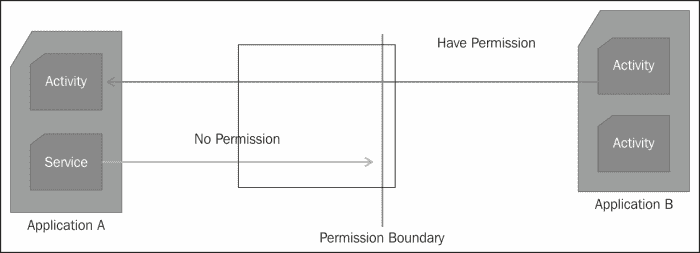

# 第三章。许可

权限是本章的重点。它们是安卓应用不可或缺的一部分，几乎所有的应用开发人员和用户都会遇到它们。正如我们在[第 1 章](01.html "Chapter 1. The Android Security Model – the Big Picture")、*安卓安全模型–大局观*中所讨论的，安装时间应用审查是最重要的安全门。这一步由用户决定是全有还是全无；用户要么接受所有列出的权限，要么拒绝下载应用。因此，作为安卓手机的用户，了解权限对于谨慎决定安装哪个应用非常重要。权限是保护组件和用户数据的基础。

本章首先介绍安卓系统中的现有权限。我们讨论了四种权限保护级别，即正常、危险、签名和签名系统。然后，我们将讨论如何使用权限保护应用及其组件。接下来，我们学习如何通过添加用户定义的权限来扩展权限模型。本节将讨论权限组、权限树以及在清单文件中创建新权限的语法。

# 权限保护级别

在应用层面，安卓安全基于权限。使用这种基于权限的模型，安卓系统保护系统资源，如相机和蓝牙，以及应用资源，如文件和组件。应用应该拥有对这些资源进行操作或使用的特权。任何打算使用这些资源的应用都需要向用户声明它将访问这些资源。例如，如果一个应用将发送和读取一条短信，它将需要在清单文件中声明`android.permission.SEND_SMS`和`android.permission.READ_SMS`。

权限也是应用之间访问控制的有效方法。应用的清单文件包含权限列表。任何希望访问此应用资源的外部应用都应该拥有这些权限。这将在下一章详细讨论。

所有安卓权限在`Manifest.permission`类中声明为常量。但是这个类没有提到权限的类型。这可以用来检查安卓源代码。我已经尝试在下面的部分中列出其中的一些权限。权限列表会根据功能不断变化，所以最好参考安卓源代码获取最新的权限列表。例如，`android.permission.BLUETOOTH`从原料药一级开始就有了，但是`android.permission.AUTHENTICATE_ACCOUNTS`被添加到原料药五级。你可以在[source.android.com](http://source.android.com)获取信息获取安卓源代码。

所有安卓权限都位于四个保护级别之一。任何保护级别的权限都需要在清单文件中声明。第三方应用只能使用保护级别为 0 和 1 的权限。这些保护级别讨论如下:

*   Normal permissions: Permissions in this level (level 0) cannot do much harm to the user. They generally do not cost users money, but they might cause users some annoyance. When downloading an app, these permissions can be viewed by clicking on the **See All** arrow. These permissions are automatically granted to the app. For example, permissions `android.permission.GET_PACKAGE_SIZE` and `android.permission.FLASHLIGHT` lets the application get the size of any package and access a flashlight respectively.

    以下是写书时安卓系统中存在的一些正常权限列表。

    用于设置用户偏好的权限包括:

    *   `android.permission.EXPAND_STATUS_BAR`
    *   `android.permission.KILL_BACKGROUND_PROCESSES`
    *   `android.permission.SET_WALLPAPER`
    *   `android.permission.SET_WALLPAPER_HINTS`
    *   `android.permission.VIBRATE`
    *   `android.permission.DISABLE_KEYGUARD`
    *   `android.permission.FLASHLIGHT`

    允许用户访问系统或应用信息的权限包括:

    *   `android.permission.ACCESS_LOCATION_EXTRA_COMMANDS`
    *   `android.permission.ACCESS_NETWORK_STATE`
    *   `android.permission.ACCESS_WIFI_STATE`
    *   `android.permission.BATTERY_STATS`
    *   `android.permission.GET_ACCOUNTS`
    *   `android.permission.GET_PACKAGE_SIZE`
    *   `android.permission.READ_SYNC_SETTINGS`
    *   `android.permission.READ_SYNC_STATS`
    *   `android.permission.RECEIVE_BOOT_COMPLETED`
    *   `android.permission.SUBSCRIBED_FEEDS_READ`
    *   `android.permission.WRITE_USER_DICTIONARY`

    应该仔细询问用户的权限包括`android.permission.BROADCAST_STICKY`，它允许应用发送一个粘性的广播，该广播即使在广播被发送后仍然有效。

*   Dangerous permissions: Permissions in this protection level (level 1) are always shown to the user. Granting dangerous permissions to apps allow them to access device features and data. These permissions cause user privacy or financial loss. For example, granting dangerous permissions, such as `android.permission.ACCESS_FINE_LOCATION` and `android.permission.ACCESS_COARSE_LOCATION`, lets an app access the user's location that might be a privacy concern if the app does not need such a capability. Similarly, granting an app `android.permission.READ_SMS` and `android.permission.SEND_SMS` permission lets an application send and receive SMS which might be a privacy issue.

    在任何给定的时间点，用户都可以通过转到设置并选择应用来检查授予任何应用的权限。请参考下面两张显示 Gmail 应用权限的图片。第一个图像显示了总是向用户显示的危险权限。注意下拉菜单按钮**显示全部**。此选项显示应用请求的所有权限。请注意权限、**硬件控制**，以及默认情况下不向用户显示的正常权限。

    

    下面的是写书时安卓系统中一些危险权限的列表。

    一些危险的权限对用户来说代价很高。例如，发送短信或订阅付费订阅源的应用可能会给用户带来巨额收入。以下是其他一些例子:

    *   `android.permission.RECEIVE_MMS`
    *   `android.permission.RECEIVE_SMS`
    *   `android.permission.SEND_SMS`
    *   `android.permission.SUBSCRIBED_FEEDS_WRITE`

    有权更改手机状态的权限包括以下内容。这些要谨慎使用，因为它们会使系统不稳定，造成烦扰，还会使系统不太安全。例如，装载和卸载文件系统的权限可以改变手机的状态。任何允许录制音频的恶意应用都很容易用垃圾音频耗尽手机内存。以下是一些例子:

    *   `android.permission.MODIFY_AUDIO_SETTINGS`
    *   `android.permission.MODIFY_PHONE_STATE`
    *   `android.permission.MOUNT_FORMAT_FILESYSTEMS`
    *   `android.permission.WAKE_LOCK`
    *   `android.permission.WRITE_APN_SETTINGS`
    *   `android.permission.WRITE_CALENDAR`
    *   `android.permission.WRITE_CONTACTS`
    *   `android.permission.WRITE_EXTERNAL_STORAGE`
    *   `android.permission.WRITE_OWNER_DATA`
    *   `android.permission.WRITE_SETTINGS`
    *   `android.permission.WRITE_SMS`
    *   `android.permission.SET_ALWAYS_FINISH`
    *   `android.permission.SET_ANIMATION_SCALE`
    *   `android.permission.SET_DEBUG_APP`
    *   `android.permission.SET_PROCESS_LIMIT`
    *   `android.permission.SET_TIME_ZONE`
    *   `android.permission.SIGNAL_PERSISTENT_PROCESSES`
    *   `android.permission.SYSTEM_ALERT_WINDOW`

    一些危险的权限可能是隐私风险。僵尸网络和特洛伊木马可以很容易地使用允许用户阅读短信、日志和日历的权限，在远程所有者的命令上做有趣的事情。以下是其他一些例子:

    *   `android.permission.MANAGE_ACCOUNTS`
    *   `android.permission.MODIFY_AUDIO_SETTINGS`
    *   `android.permission.MODIFY_PHONE_STATE`
    *   `android.permission.MOUNT_FORMAT_FILESYSTEMS`
    *   `android.permission.MOUNT_UNMOUNT_FILESYSTEMS`
    *   `android.permission.PERSISTENT_ACTIVITY`
    *   `android.permission.PROCESS_OUTGOING_CALLS`
    *   `android.permission.READ_CALENDAR`
    *   `android.permission.READ_CONTACTS`
    *   `android.permission.READ_LOGS`
    *   `android.permission.READ_OWNER_DATA`
    *   `android.permission.READ_PHONE_STATE`
    *   `android.permission.READ_SMS`
    *   `android.permission.READ_USER_DICTIONARY`
    *   `android.permission.USE_CREDENTIALS`
*   Signature permissions: Permissions in this protection level (level 2) allow two applications authored by the same developer, access each other's components. This permission is automatically granted to the app if the app being downloaded has the same certificate as the application that declared the permission. For example, application A defines a permission `com.example.permission.ACCESS_BOOK_STORE`. Application B, signed by the same certificate as application A, declares it in its manifest file. Since both application A and B have the same certificate, this permission is not shown to the user when installing the application B. A user can certainly view it, using **See All**. An app can perform really powerful actions with this permission of this group. For example, with `android.permission.INJECT_EVENTS`, an app can inject events such as keys, touch, and trackball into any application and `android.permission.BROADCAST_SMS` can broadcast an SMS acknowledgement. This permission defined by the Android systems that lie in this protection group is reserved for system apps only.

    此级别的某些权限允许应用使用系统级功能。例如，`ACCOUNT_MANAGER`权限允许应用使用帐户授权码，BRIK 权限允许应用屏蔽电话。以下是撰写本书时的一些签名权限列表。有关完整的参考，请查看安卓源代码或`Manifest.permission`类:

    *   `android.permission.ACCESS_SURFACE_FLINGER`
    *   `android.permission.ACCOUNT_MANAGER`
    *   `android.permission.BRICK`
    *   `android.permission.BIND_INPUT_METHOD`
    *   `android.permission.SHUTDOWN`
    *   `android.permission.SET_ACTIVITY_WATCHER`
    *   `android.permission.SET_ORIENTATION`
    *   `android.permission.HARDWARE_TEST`
    *   `android.permission.UPDATE_DEVICE_STATS`
    *   `android.permission.CLEAR_APP_USER_DATA`
    *   `android.permission.COPY_PROTECTED_DATA`
    *   `android.permission.CHANGE_COMPONENT_ENABLED_STATE`
    *   `android.permission.FORCE_BACK`
    *   `android.permission.INJECT_EVENTS`
    *   `android.permission.INTERNAL_SYSTEM_WINDOW`
    *   `android.permission.MANAGE_APP_TOKENS`

    该级别的某些权限允许应用发送系统级广播和意图，如广播意图和短信。这些权限包括:

    *   `android.permission.BROADCAST_PACKAGE_REMOVED`
    *   `android.permission.BROADCAST_SMS`
    *   `android.permission.BROADCAST_WAP_PUSH`

    此级别中的其他权限允许应用访问第三方应用没有的系统级数据。这些权限包括:

    *   `android.permission.PACKAGE_USAGE_STATS`
    *   `android.permission.CHANGE_BACKGROUND_DATA_SETTING`
    *   `android.permission.BIND_DEVICE_ADMIN`
    *   `android.permission.READ_FRAME_BUFFER`
    *   `android.permission.DEVICE_POWER`
    *   `android.permission.DIAGNOSTIC`
    *   `android.permission.FACTORY_TEST`
    *   `android.permission.FORCE_STOP_PACKAGES`
    *   `android.permission.GLOBAL_SEARCH_CONTROL`
*   SignatureOrSystem permissions: As with signature protection level, this permission is granted to applications with the same certificate as the application that defined the permission. In addition, this protection level includes applications with the same certificate as the Android system image. This permission level is mainly used for applications that are built by handset manufacturers, carriers, and system applications. These permissions are not allowed for third party apps. These permissions let apps perform some very powerful functions. For example, the permission `android.permission.REBOOT` allows an app to reboot the device. The permission `android.permission.SET_TIME` lets an app set system time.

    在撰写本书时，一些签名系统权限的列表如下:

    *   `android.permission.ACCESS_CHECKIN_PROPERTIES`
    *   `android.permission.BACKUP`
    *   `android.permission.BIND_APPWIDGET`
    *   `android.permission.BIND_WALLPAPER`
    *   `android.permission.CALL_PRIVILEGED`
    *   `android.permission.CONTROL_LOCATION_UPDATES`
    *   `android.permission.DELETE_CACHE_FILES`
    *   `android.permission.DELETE_PACKAGES`
    *   `android.permission.GLOBAL_SEARCH`
    *   `android.permission.INSTALL_LOCATION_PROVIDER`
    *   `android.permission.INSTALL_PACKAGES`
    *   `android.permission.MASTER_CLEAR`
    *   `android.permission.REBOOT`
    *   `android.permission.SET_TIME`
    *   `android.permission.STATUS_BAR`
    *   `android.permission.WRITE_GSERVICES`
    *   `android.permission.WRITE_SECURE_SETTINGS`

# 应用级权限

有两种方法可以将权限应用于整个应用。在第一种情况下，应用声明应用正常运行所需的权限。因此，将发送短信的应用将在清单文件中声明这样的权限。在第二种情况下，应用可以声明试图与该应用交互的其他应用应该具有什么权限。例如，应用可以声明任何想要与其组件之一进行交互的应用都应该拥有访问摄像机的权限。这两种权限都必须在清单文件中声明。让我们一个接一个地看一遍。

这个`<uses-permission>`标签在`<manifest>`中声明，并声明应用正常运行所需的权限。标签的语法如下:

```java
<uses-permission android:name=" " />
```

用户在下载应用时，必须接受这些权限。`android:name`是权限的名称。这个标记的一个示例声明如下。以下权限声明用户将要安装的应用将访问用户的短信:

```java
<uses-permission android:name="android.permission.READ_SMS"/>
```

`<application>`标签有一个名为`android:permission`的属性，用于声明组件的一揽子权限。这些是任何试图与该应用的组件交互的应用需要拥有的权限。这在下面的代码中显示。下面的代码显示了与`MyApplication`的任何组件交互的应用应该拥有访问摄像机的权限:

```java
<application android:name="MyApplication" android:icon="@drawable/icon" android:label="@string/app_name""android.permission.CAMERA"/>
```

正如下一节所讨论的，单个组件也可以设置权限。组件权限使用`<application>`标签覆盖权限集。前面的方法是声明所有组件的一揽子权限的最佳地方。

# 组件级权限

所有安卓组件都可以使用权限进行保护。下图说明了这一概念:



让我们讨论一下每个组件的权限声明和执行。

## 活动

任何活动都可以通过调用在`<activity>`标签的活动声明中的权限来获得权限。例如，具有自定义权限`com.example.project.ORDER_BOOK`的活动`OrderActivity`将声明如下。任何试图启动`OrderActivity`的组件都需要有这个自定义权限。

```java
<activity android:name=".OrderActivity" android:permission="com.example.project.ORDER_BOOK" android:exported="false"/>
```

在活动的情况下，使用`Context.startActivity()` 和`Context.startActivityForResult()` 在启动活动时执行权限。如果启动组件没有适当的权限，则会抛出一个`SecurityException`。

## 服务

通过在`<service>`标签中列出所需的权限，任何服务都可以使用权限进行保护。例如，基于关键词识别短信的服务`FindUsefulSMS`声明许可`android.permission.READ_SMS`。该权限将声明如下。任何试图启动`FindUsefulSMS`的组件都需要有这个权限。

```java
<service android:name=".FindUsefulSMS" android:enabled="true"
android:permission="android.permission.READ_SMS">            
</service>
```

通过使用`Context.startService()` 启动服务，通过使用`Context.stopService()` 停止服务，以及通过使用`Context.bindService()` 绑定到服务时，服务的权限执行完成。如果请求组件没有适当的权限，则会抛出`SecurityException`。

如果服务公开了一个其他应用可以绑定到的绑定器接口，那么在使用`Context.checkCallingPermission()`绑定到绑定器时可以检查调用者的权限。

## 内容提供商

内容提供商可以通过`<provider>`标签中指定的权限进行保护。在以下示例中，任何想要与提供者对话的组件都应该具有`android.permission.READ_SMS`权限:

```java
<provider
   android:authorities="com.example.android.books.contentprovider"
   android:name=".contentprovider.MyBooksdoContentProvider" 
   android:grantUriPermissions="true"
   android:Permission="android.permission.READ_CALENDAR"/>
```

如[第 2 章](02.html "Chapter 2. Application Building Blocks")、*应用构建块*所述，`<provider>`标签还具有细粒度的读写权限属性。为了能够读取`<provider>`标签，应用应该具有读取权限。`ContentResolver.query()`T12 期间勾选此项。为了能够更新、删除和插入提供程序，组件应该具有读写权限。这些权限在`ContentResolver.insert()`、`ContentResolver.update()` 和`ContentResolver.delete()` 期间进行检查。没有适当的许可将导致`SecurityException`被调用抛出。

`<grant-uri-permission>`标签是`<provider>`标签的子标签，用于在有限的时间内授予对提供者的某些特定数据集的访问权限。考虑一个将短信保存到数据库的应用的例子。有些短信可能附有照片。要让应用正确查看短信，它将启动图像查看器，该查看器可能无法访问提供商。 **URI** ( **通用资源标识符** ) 权限将允许图像查看者拥有该特定图片的读取权限。在前面的示例中，当提供者设置`android:grantIriPermissions="true"`时，图像查看者将拥有对整个提供者的读取权限。这带来了安全风险。为了提供有限的访问权限，提供者可以声明它希望提供者的哪些部分对 URI 权限开放。

URI 权限的语法如下:

```java
<grant-uri-permission android:path="string"
                      android:pathPattern="string"
                      android:pathPrefix="string" />
```

### 注

URI 权限不是递归的。

我发现最有趣的是，我们可以使用通配符和模式来定义我们希望能够对提供程序的哪些部分实施 URI 权限。这方面的一个例子如下:

```java
<grant-uri-permission android:pathPattern="/picture/" />
```

任务完成后记得使用`Context.revokeUriPermission()`撤销的 URI 权限。

## 广播接收器

可以通过两种方式用权限保护广播。在第一种情况下，接收器使用权限保护自己，因此它只接收它想听到的广播。在另一种情况下，广播公司选择哪些接收机可以接收广播。我们将在下一节讨论这两种情况。

任何接收者都可以通过在`<receiver>`标签中调出接收者声明中的权限来保护。例如，接收者`MyListener`声明一个许可`android.permission.READ_SMS`，这将被声明如下。`MyListener`只有在获得`android.permission.READ_SMS`许可的情况下，才会接收来自广播公司的广播。

```java
<receiver android:name=".MyListener"
android:permission="android.permission.READ_SMS">    
        <intent-filter> 
            <action android:name=
                "android.provider.Telephony.SMS_RECEIVED" /> 
        </intent-filter>         
</receiver>
```

### 类型

请记住，粘性广播不受权限保护。

在传送广播意图之后，即在对`Context.sendBroadcast()` 的调用返回之后，检查接收广播所需的权限。因此，如果广播者没有适当的权限，则不会引发异常；只是广播不会播出。如果接收者是使用`Context.registerReceiver()` 动态创建的，则可以在创建该接收者时设置权限。

第二种情况，广播公司限制哪些接收者可以接收意图，是通过使用方法`sendBroadcast()` 完成的。下面的代码片段中定义了一个广播示例，该广播将只发送给具有`android.permission.READ_SMS`权限的应用的接收器:

```java
Intent intent = new Intent();
intent.setAction(MY_BROADCAST_ACTION);
sendBroadcast(intent, "android.provider.Telephony.SMS_RECEIVED");
```

### 注

用组件声明的权限不会授予应用。它们是组件试图与之交互的应用应该拥有的权限。

# 扩展安卓权限

开发者可以通过添加自己的权限来扩展权限系统。这些权限将在下载应用的过程中显示给用户，因此对它们进行本地化和正确标记非常重要。

## 添加新权限

开发者可以选择只添加一个新的权限或者一整棵树的权限。声明新权限是在清单文件中完成的。要添加新的权限，应用可以通过使用`<permission>`标记来声明它，如下面的代码片段所示:

```java
<permission android:name="string"
            android:description="string resource"
            android:icon="drawable resource"
            android:label="string resource"
            android:permissionGroup="string"
            android:protectionLevel=["normal" | "dangerous" | 
                            "signature" | "signatureOrSystem"] />
```

对新权限组的上述代码片段中使用的属性的描述如下:

*   `android:name`:这个是正在声明的新权限的名称。
*   `android:description`:这个详细描述了正在声明的新权限。
*   `android:icon`:这个是权限图标。
*   `android:label`:这个是安装时显示给用户的标签。
*   `android:permissionGroup`:这将为预先存在的用户定义的组或新组分配权限。如果没有指定名称，权限不属于任何组，这也没问题。我将在本节稍后讨论如何创建权限组。
*   `android:protectionLevel`:指定新权限的保护级别。本章前面已经讨论过这些保护级别。

此类许可的一个示例如下:

```java
<permission android:name="com.example.android.book.READ_BOOKSTORE"
            android:description="@string/perm_read_bookstore"
            android:label="Read access to books database"
            android:permissionGroup="BOOKSTORE_PERMS"
            android:protectionLevel="dangerous"/>
```

考虑到本地化和维护，使用字符串资源总是比使用原始字符串更好。

一旦你声明了一个新的权限，一定要在`<uses-permission>`标签中声明。

## 创建权限组

使用`<permission-group>`标签可以创建权限组。它是权限的逻辑分组，当呈现给用户时，它们都是一起呈现的。使用以下语法创建权限组:

```java
<permission-group android:name="string" 
      android:description="string resource"
                  android:icon="drawable resource"
                  android:label="string resource" />
```

对新权限组的上述代码片段中使用的属性的描述如下:

*   `android:name`:这个是新权限组的名字。这是`<permission>`标签中提到的名字。
*   `android:description`:详细描述正在申报的新权限组。
*   `android:icon`:这个是权限组图标。
*   `android:label`:这个是安装时要显示的标签。

拥有书店权限的权限组的示例可以声明如下:

```java
<permission-group android:description="@string/perm_group_bookstore"
                  android:label="@string/perm_group_bookstore_label"
                  android:name="BOOKSTORE_PERMS" />
```

## 创建权限树

如果有需要将权限安排为一个名称空间，这样就可以创建一个权限树，然后应用可以声明一个`<permission-tree>`标签。这种树的一个例子如下:

```java
com.example.android.book
com.example.android.book.READ_BOOK
com.example.android.book.bookstore.READ_BOOKSTORE
com.example.android.book.bookstore.WRITE_BOOKSTORE
```

这个标签没有定义任何新的权限，它只是为您创建一个命名空间来分组权限。我看到有多个应用的开发人员都在使用这个概念，并且所有这样的应用都在相互交流。`<permission-tree>`标签的语法定义如下:

```java
<permission-tree android:name="string" 
    android:icon="drawable resource"
                 android:label="string resource"  />
```

对新权限组的上述代码片段中使用的属性的描述如下:

*   `android:name`:这个是新权限组的名称。名字至少要有三段，中间用句号隔开，例如`com.example.android`可以，但是`com.example`不行。
*   `android:icon`:这个是权限组图标。
*   `android:label`:这个是安装时要显示给用户的标签。

一个示例声明如下:

```java
<permission-tree android:name="com.example.android.book" 
                  android:label="@string/perm_tree_book"  />
```

# 总结

权限是安卓应用安全的核心，本章详细介绍了权限。我们学习了四个权限保护级别，如何用权限保护组件，以及如何定义新的权限。对于安卓手机的开发者和用户来说，对权限模型的了解和理解是必不可少的。现在我们已经掌握了组件、组件间通信和权限的知识，让我们进入下一章，学习如何定义应用的策略文件。