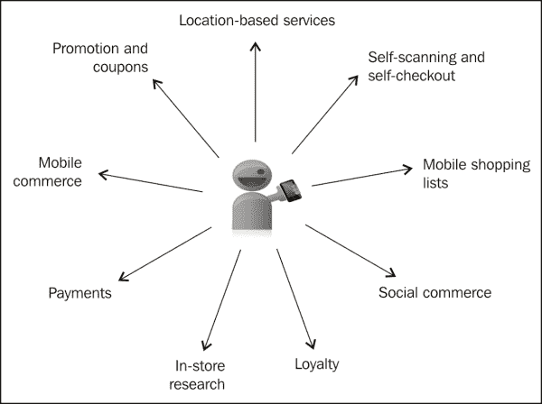
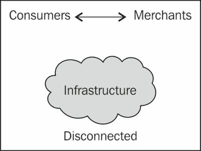
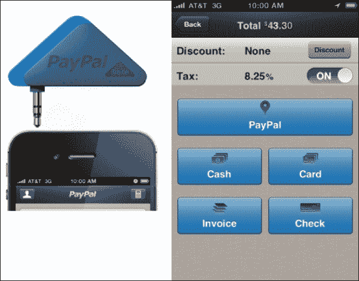
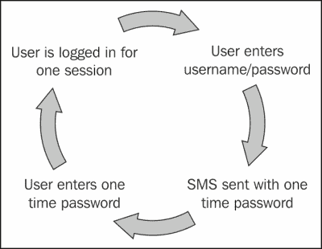
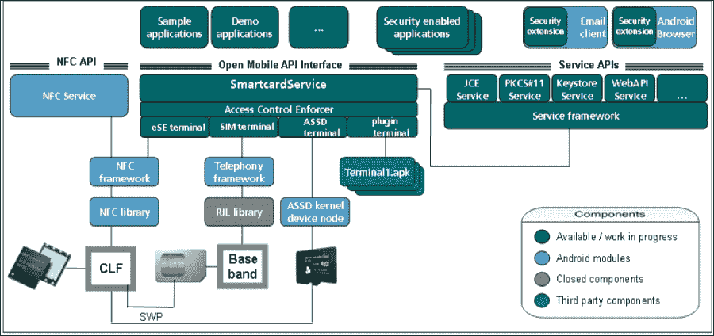

# 第十章。展望未来

你已经读到最后一章了，祝贺你！因此，让我们在这一章中找到一些乐趣，并尝试预测未来。

移动是一个相对较新的领域。它正处于实验阶段，一些技术和用例是成功的，而其他的可能没有预期的那么有吸引力。本章的重点是看一些移动领域的新技术和用例。

这一章分为几节，每一节都讨论了在移动中使用该技术或用例的一些实验。我们将首先讨论移动商务，重点是使用移动设备的产品发现、支付和销售点。接下来将讨论近距离技术，如 NFC、RFID 和蓝牙。以下几节将讨论移动设备在医疗保健和身份验证中的使用。在最后一节中，我们将从安全角度讨论硬件的最新进展。

# 移动商务

消费者行为正在改变商业。如今，商业不仅仅是去商家或商店，挑选产品并付款的简单行为。如下图所示，随着新技术的出现，移动商务包括通过地理围栏发现产品、店内和在线研究、通过自我扫描和自我结账进行支付、与朋友分享您的购买，然后管理您的帐户。我们也看到线上和线下商业之间的界限越来越模糊。

在接下来的几节中，我们将从安全的角度讨论商业的不同组成部分。

## 使用移动设备发现产品

产品发现是发现产品的过程。商家使用不同的机制要么把顾客带到他们的零售店，要么鼓励他们在网上购买。产品发现还包括购物清单、比较购物和有助于消费者购买产品的产品信息等功能。移动设备非常适合这种情况，因为消费者可以访问产品信息并实时检查产品的可用性。

移动空间中的一些示例应用包括用于条形码扫描、基于位置的购物、定向广告、当用户进入零售店时给他们的积分和额外津贴、创建购物清单并在消费者靠近持有购物清单中的项目的商店时被提醒的能力、以及将忠诚卡存储在钱包中的能力的应用。

从安全角度来看，最大的挑战是隐私。定向广告和地理围栏基于对用户数据及其购物模式的分析。应用开发人员在使用和收集用户数据和偏好，然后使用或共享时，应该了解法律法规。在几乎所有情况下，收集信息前都需要用户同意。该同意声明应包括正在收集的内容以及是否将与第三方共享。添加新功能或更新或扩展现有功能时，请注意更新此用户许可。

## 移动支付

支付是移动商务的最大组成部分。在任何支付用例中，都有三个主要实体:消费者(也称为买方、卖方或商家)和支持支付的基础设施层。

### 配置

消费者可以使用移动设备来搜索和支付产品，商家可以使用移动设备，或者消费者和商家都可以使用移动设备。理想情况下，这三个实体在交互过程中都是连接在一起的。这是完全连接的情况，也是迄今为止最安全的支付渠道。从易贝移动网站购买商品的用户就是完全连接的一个例子，如下图所示:

但是，在某些情况下，它们可能会断开。消费者和商家都连接到基础设施但彼此不连接的情况是以基础设施为中心的连接。一个例子是地理围栏，当用户靠近商店时，他们可以获得商店的优惠券。在这种情况下，商店和用户都在与基础设施(第三方或运营商)交谈，但彼此不交谈。另一种情况是当用户 a 通过使用销售点终端用设备结账时。在这种情况下，用户将设备用作身份验证机制，但可能没有连接到基础架构层。这是一个以商家为中心的连接案例，其中商家连接到消费者和基础设施，但是消费者是断开的。还有一个例子是，消费者与基础设施和商家都进行了对话，但是商家却断开了连接。一个例子是当用户从自动售货机购买苏打水时。自动售货机可以在特定的时间间隔与后端同步，否则可能会断开连接。下图说明了部分连接配置:

部分连接的基本安全挑战是端到端安全。由于在任何时候都有三个连接中的两个，客户端或服务器端的任何陈旧状态都很难检测到。然后，客户端-商家身份验证、通信身份验证和隐私存在问题，如下图所示:

然后，还有一种不相关的情况，即商家和消费者相互交谈，但没有一个人与基础设施层交谈。在这种情况下，保持设备的完整性是一项挑战。举一个消费者试图在销售终端使用优惠券的例子。

消费者可以继续多次使用优惠券，不能与服务器同步更新优惠券状态的 **PoS** ( **销售点**)终端不会检测到欺诈。类似地，客户端证书可能已经过期或被撤销，但是商家设备不会察觉到。如果您的应用被设置为在这种情况下工作，那么应该只有一组有限的功能可以脱机使用。涉及 PII 或资金的情况最好留给完全连接或至少部分连接的情况。

作为一个应用，开发人员应该知道你的用例是如何工作的。如果您的应用可以部分连接或不连接，您将需要在处理支付时采取额外的安全措施。

### PCI 标准

**支付卡行业** ( **PCI** )是一个独立的组织，致力于在支付用例中创建安全意识。他们开发了一套通用的支付标准，以确保用户安全不受损害。PCI **PTS** ( **Pin 交易安全**)是针对接受支付的附加设备；PCI **P2PE** ( **点对点加密**)用于基于硬件的安全，PCI **DSS** ( **数据安全标准**)用于安全管理、策略、程序、网络架构、软件设计等关键防护措施。最新版本是 2.0 版，它帮助组织有效地保护用户数据。它有六个核心目标，作为十二个核心要求来实现。下图列举了这些因素:

作为处理支付的应用开发人员，请注意 DSS。付款很棘手，以安全的方式正确付款本身就是一个挑战。所以，你可能会喜欢使用已经存在的支付提供商，如贝宝。

更多关于 PCI 的信息可以在他们的网站[pcisecuritystandards.org](http://pcisecuritystandards.org)找到。

### 销售点

移动销售点(PoS)是一种随着移动设备的普及和本章前面讨论的邻近技术的使用而成为可能的用途。您的移动设备本质上充当销售点终端，可以管理您的分类账和当天的所有交易。PayPal 和 Square 等公司提供的解决方案使用电话音频插孔插入刷卡设备。然后，该设备读取信用卡详细信息，并以加密的形式将其发送到该设备。其他解决方案包括移动销售点终端。

作为应用开发人员，最好与现有解决方案集成，而不是试图发明轮子。但是，在你选择解决方案之前，记得问一些问题。首先，您需要询问解决方案提供商是否采取了适当的安全措施来加密数据。请注意 PCI DSS 和 PCI PTN，正如我们在前面几节中讨论的那样。处理、存储或传输信用卡号码的零售商必须符合 PCI DSS 标准，否则他们可能会失去处理信用卡付款的能力。由于不同国家的信用卡在基础设施上存在差异，因此必须采用不同的技术来读取信用卡/借记卡。例如，在欧洲，芯片和 pin 技术是常态，因此您的 PoS 支付提供商应该在每个领域都有解决方案。你可能想选择一个提供商，你可以和他一起管理你的信用卡，支票，现金和其他形式的支付。

上图显示了移动销售点解决方案的一些示例。第一张图片是北美的贝宝读卡器和管理所有支付模式的应用。

上图是贝宝在欧洲使用蓝牙的个人识别码和芯片解决方案。

以上是移动销售点的另一个例子。送货代理和销售代表最常用。

# 邻近技术

邻近技术在英寸或厘米的半径内工作。其中包括**近场通信** ( **NFC** )、蓝牙和**射频识别** ( **射频识别**)等技术。这些技术中的大多数已经存在了一段时间，但是移动设备的普及给了它们一系列新的用例。这些技术现在正被用于移动支付、不同设备的配对、识别和认证。

蓝牙现在是大多数手机的标准。配对设备是一项奇妙的技术。随着眼镜和手表等设备进入市场，这可能是将它们结合在一起的技术。

NFC 和 RFID 都是通过产生以一定频率调制的电磁场来工作的。由于这些标签是世界可读的，当用作标签或识别机制时，这些标签会带来隐私风险。第一款支持 NFC 的安卓手机 Nexus S 于 2010 年问世。安卓软件开发工具包附带了使用 NFC 标签的应用编程接口。

由于操作范围小，邻近技术被错误地认为是安全的。然而，事实并非如此。快速搜索将揭示所有情况下的利用场景。数据调制、数据干扰和隐私是与这些技术相关的一些风险。

# 社交网络

如今，应用商店中有一系列社交网络应用，每天都在测试新的用例。这些应用让朋友、熟人、邻居、同事和有特殊兴趣的人可以共享、协作，并基本上保持联系。一些成功的例子包括脸书、推特、Pinterest、谷歌闲逛和领英。

社交网络就像将实体联系在一起的网络图。图中的任何坏节点都有可能发送垃圾邮件或感染其他节点。下图中，节点 A 和节点 B 之间的消息被拦截，并被垃圾邮件更改。这将导致连接到 B 的所有节点被感染。这种情况还在继续，并且正如您所能想象的那样，将很快在节点间蔓延:

社交网络应用的最大挑战是隐私。首先，用户必须注意他们与联系人分享的内容。在大多数情况下，用户使用他们的真实姓名和其他私人信息。

其次，用户需要注意垃圾邮件和恶意软件。不是每个人都是你的朋友。不是所有你朋友玩的游戏都是好人写的。也没有必要点击你关注的人分享的所有链接。

第三，应用开发人员必须注意如何存储和处理用户敏感信息。第一道防线是明确询问用户他们想要共享什么以及与谁共享。这种用户同意应该使开发者免于责任问题。其次，他们必须根据用户偏好定义适当的访问控制。第三，他们必须保证用户信息和 PII 的安全，无论是在休息时还是在运输途中。

社交网站的另一个问题是身份盗窃。恶意用户很容易利用他人的身份创建账户。

# 医疗保健

为医疗保健开发移动应用是非常安全敏感的用例的另一个例子。在医疗保健用例中，开发人员正在处理用户身份、电子病历、实验室测试和处方药物。泄露这些信息可能会影响患者的健康。

移动设备可以在医疗保健中发挥巨大作用，因为它们非常私人，我们总是随身携带。因此，提醒我们按时服药的应用、医生就诊、医生和患者的笔记记录应用、实验室结果的即时通知以及处方药物需要补充的提醒都是重要且有用的应用。

移动设备也可以用于紧急情况，在这种情况下，其他人可以借助移动设备帮助生病的人。用户可以分享实时视频，并与医生实时交谈以获得帮助。

医疗保健的另一个发展方向是在嵌入式设备中使用安卓平台，如扫描仪、放射科、x 光机、机器人手术和超声波设备。

准确识别一个人在医疗保健中至关重要。还要记住重要的安全规则:信任但要核实。所以，你识别了一个人，但想再做一次来确认。PII 的访问控制以及安全存储和传输也很重要。

了解医疗保健领域的标准和法规，如**健康保险便携性** **和《责任法案》** ( **HIPAA** )。

# 认证

认证是识别实体的行为。在我们的例子中，认证通常涉及到识别一个人。当前的身份验证方法是使用用户名和密码。因为密码很复杂，很难在小型设备上键入，所以电话号码和个人识别码用于验证用户。

## 双因素认证

当今最常见的方法是双因素身份验证。这是基于这样的理论，即要唯一地识别一个人，一个人应该提供以下三个标识符中的两个:

*   用户拥有的东西；这包括数字签名、安全令牌、电话、标签等等
*   用户知道的事情；这包括密码、秘密、个人识别码或只有用户才知道的问题答案
*   用户是什么；例子包括视网膜扫描、指纹和面部识别

双因素身份验证的一个示例是使用用户名/密码或电话/个人识别码登录，然后输入发送到用户设备的短信中的密码。另一个示例可能是输入用户名和密码，然后回答质询问题，如下图所示:

在安卓中实现双因素身份验证很容易。谷歌认证器通过短信或语音通话实现双因素认证。

## 生物识别

生物认证是通过使用对用户唯一的生物属性来识别用户。这些包括使用指纹、面部识别、视网膜扫描和虹膜扫描。基于虹膜扫描，印度已经实现了世界上最大的身份识别系统 Aadhar。这个雄心勃勃的项目将通过使用人口统计和生物识别信息，为所有 5 岁及以上的印度公民提供一个独特的号码。查看位于[www.uidai.gov.in](http://www.uidai.gov.in)的**印度唯一识别机构** ( **UIDAI** )网站。

安卓系统上有一些应用使用生物特征作为密钥。使用此类应用时，重要的考虑因素是确保用户识别规范没有存储在设备上。第二，如果这个信息存储在服务器上，它是如何传输和存储在那里的？第三，如何获取这些信息？

### 类型

生物识别不同于双因素身份验证，在双因素身份验证中，您可以轻松更改密码或更新 RSA 安全身份令牌。生物识别是个人的，泄露这些信息会带来巨大的风险。

有两种使用生物识别技术的情况。在第一种情况下，用户通过使用一些生物属性来验证，例如指纹。这将与存储在设备中的副本进行比较。用你的脸登录手机就是一个验证的例子，如下所示:

第二种情况是身份识别，其中将生物特征身份与数据库中存储的身份进行比较以进行匹配。印度正在实施的生物识别系统就是这样一个例子。下图说明了这一过程:

# 硬件的进步

移动操作系统已经取得了长足的进步。当我开始使用手机时，我们有糖果棒手机，它除了打电话什么也不做，还有基本的实用程序，比如计算器和一个显示时间和日期的小部件。为了支持移动的高级用例，安全性必须内置于硬件本身。在这方面有一些努力，我已经在下面的章节中讨论过了。

## 硬件安全模块

硬件安全模块，也称安全元件，是嵌入在硬件中存储密钥和其他敏感信息的一块硬件(芯片)。这个想法是提供一个隔离的，防篡改的环境来储存 PII。在某些情况下，设备还可以携带安全元件。安全元件的例子包括由移动网络运营商控制的增强型 SIM 卡、嵌入设备本身的芯片或内置特殊电路的微型 SD 卡。许多安卓手机都配备了安全元件。

在某些情况下，安全模块还充当安全加速器。这些加速器除了存储密钥之外，还在硬件中执行加密功能，例如加密、解密、散列和随机数生成。这大大减轻了中央处理器的负担，并带来了更好的性能。

为了让开发人员能够使用安全元素，必须通过 API 公开它。安卓的**安全元素评估套件** ( **SEEK** )对于安卓来说就是朝着这个方向迈出的一步。基于开放的移动应用接口，这组称为智能卡应用接口的目的是为应用提供一种与嵌入式安全元件、SIM 卡或其他设备加密模块通信的机制。查看更多信息，请访问[code.google.com/p/seek-for-android](http://code.google.com/p/seek-for-android)。以下来自[code.google.com](http://code.google.com)的图片非常有效地说明了 SEEK 的概念:

基于安卓的权限机制，智能卡 API 需要一个名为`android.permission.SMARTCARD` 的特殊权限，才能让应用访问这些 API。智能卡应用编程接口远程进程用智能卡的唯一 UID/GID 注册。请注意，这种安全机制在根设备上停止工作。`GoogleOtpAuthenticator` 通过使用双因素身份验证的智能卡应用编程接口实现。

## 信托区

由 ARM 开发，现在有了 GlobalPlatforms，TrustZone 技术是设备的完整安全解决方案。它基于片上系统，TrustZone 为支付、内容流和管理、访问控制等应用提供可信的执行环境，以及其他 PII。TrustZone 的酷特性是，每个应用都运行在自己的独立环境中，彼此完全隔离。

您可能想查看网站[www.arm.com/products/processors/technologies/trustzone.php](http://www.arm.com/products/processors/technologies/trustzone.php)了解详情。上一个网站的下图显示了这项技术的高级视图。许多移动处理器，如德州仪器和英伟达的 Tegra 内核，都是基于信任区技术构建的。

如上图所示，使用虚拟化，处理器被分为两个虚拟域:一个用于正常模式，另一个用于执行称为安全模式的敏感进程。通过使用监控模式，过程从一种模式转换到另一种模式。所有敏感代码、数据和资源都是在远离设备上的正常操作环境、软件和内存的情况下处理的。这种隔离是由 SoC 架构实施的，因此它对软件和探测攻击具有很强的鲁棒性。

## 移动可信模块

2010 年， **可信计算集团** ( **TCG** )发布了 1.0 版**移动可信模块** ( **MTM** )。TCG 是一个国际标准组织，与其成员一起制定标准和规范。MTM 的目标是将现有的 TCG 技术用于移动和嵌入式应用。

可信计算基于硬件信任根，被称为**可信平台模块** ( **TPM** )。它检测恶意软件并检查系统的完整性。这种功能称为可信平台模块。TPM 的安全性从启动过程开始。信任的硬件根(通常是密钥)被烧录在处理器本身中。引导安全性建立在这种信任的基础上。引导软件的渐进阶段被加密验证，以确保在设备中只执行正确的授权软件。

查看他们在 www.trustedcomputinggroup.org T2 的网站。它更适合内核开发人员，但对任何人来说都是非常有趣的读物。

# 应用架构

现在有三种方法可以编写应用:本机、移动 web 和混合。

原生应用特定于平台，并且是用该平台的原生语言编写的。这些应用使用操作系统制造商提供的本机工具和软件开发工具包。这些应用具有更好的性能，可以使用本机特性和 API 来实现安全的数据存储。下图说明了本机和混合应用的工作原理:

一个移动网络应用是用网络技术编写的，比如 HTML5、CSS、PHP、JavaScript 和 ASP.net。这些应用是跨平台的，一旦编写完成，它们就可以在任何有浏览器的平台上运行。它们提供了集中更新的便利性，但继承了所有浏览器漏洞。当你编写一个移动网络应用时，要注意浏览器漏洞。浏览器代码很容易让每个人看到。此外，在这种应用中，利用网址也是一种风险，因为应用不在设备上，只能通过使用有效的网址来访问。下图说明了移动 web 应用的工作原理:

编写应用的第三种方法是开发混合应用。这个应用结合了原生和移动网络的优点。一个应用只需使用网络技术编写一次。用户需要像安装本机应用一样安装应用，并使用设备的浏览器引擎在本机浏览器中运行。这样，应用可以在离线模式下运行，可以访问设备功能，并且开发人员可以瞄准多个平台。

选择使用哪种架构取决于您的用例。本地应用比混合或移动网络安全得多。它们在速度和用户体验方面也表现得更好。另一方面，混合和移动 web 应用通过使用 web 技术更容易和更快地开发，并且是跨平台的。

# 总结

本章重点介绍即将推出的用例和技术，以及它们与移动安全的关系。我们讨论了移动商务、邻近技术、医疗保健中的移动安全和身份验证。我们以硬件领域的安全增强来结束这一章。正如你会注意到的，在移动领域发生了很多事情，我认为在事情稳定下来之前，这种情况还会持续一段时间。

至此，我们已经到了这本书的结尾。我希望你在这本书里学到了一些新的东西，和我一样喜欢这次旅行。