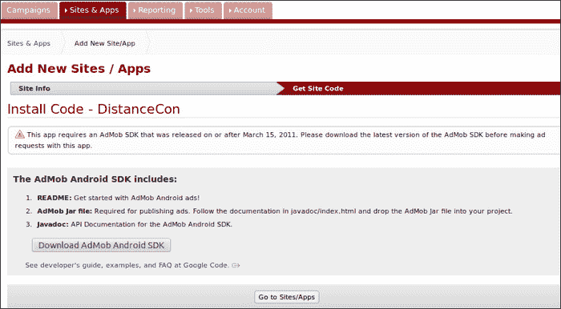
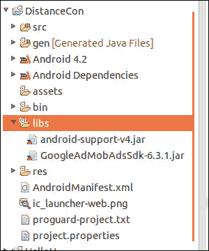
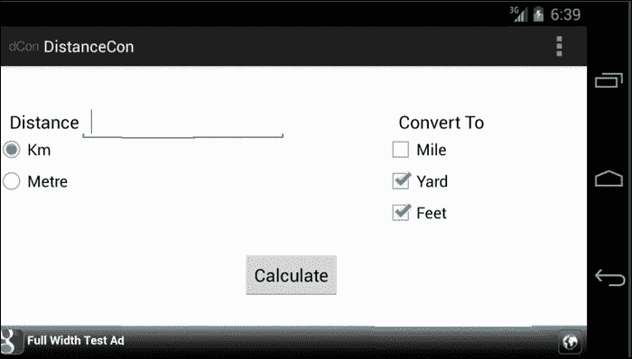

# 第七章。添加外部库

一个安卓应用程序不能靠自己实现一切，它总是需要外部 jars 库的陪伴来实现不同的目标，服务于各种目的。几乎每一个在商店发布的免费安卓应用都有广告嵌入其中，利用外部组件来实现。在安卓应用中加入广告是当今应用开发的一个重要方面。在这一章中，我们将继续我们在前几章中开发的 DistanceConverter 应用程序，并利用外部库`AdMob`，将广告合并到我们的应用程序中。覆盖范围将包括以下内容:

*   在`AdMob`网站创建账户
*   添加站点/应用程序
*   添加广告冥想网络
*   在应用程序中添加`AdMob`
*   在清单文件中进行更改
*   在布局文件中添加`AdMob`小部件/视图
*   运行应用程序

# 在 AdMob 网站创建账户

`AdMob`是在我们的安卓应用中加入广告的一种方式。要利用`AdMob`，我们首先要做的就是为自己注册并获得一个账户。要注册，请访问[http://www.admob.com](http://www.admob.com)网站并在上面注册。在右侧，点击**注册 AdMob** ，然后填表注册。

下面的截图显示了注册表单:


如果有，我们可以使用我们现有的谷歌标识，否则前面的步骤将创建一个并将其与`AdMob`账户链接。

## 添加站点/应用

一旦我们创建了我们的帐户，我们需要添加一个站点/应用程序(基本上，它为他们投放的广告识别或充当广告网络的唯一句柄)。要添加站点/应用程序，我们执行以下步骤:


1.  Navigate to **Add Site/App** from the **Sites & Apps** menu, as shown in the preceding screenshot. The **Add Site/App** screen will appear, as shown in the following screenshot:

    

2.  选择 **安卓 App** ，如前截图所示，填写其他详情。因为我们的应用不在市场上，使用 **http://** 获取**安卓包网址**，如前面截图所示。
3.  Select the corresponding category, in this case we used **Tools**, and add some description in the **App description** textarea. Also, leave the other fields to their default, and enter the captcha and create site. After this the following screen will appear:

    

4.  Next, click on the **Download AdMob Android SDK** button to download the `AdMob` SDK. Once the SDK is downloaded, click on the **Go to Sites/App** button and our site should have been added, and will appear in the sites list as shown in the following screenshot:

    

5.  **状态**显示为红色，因为它没有收到该网站的任何广告请求。一旦它开始收到这个网站的广告请求，它就会自动变绿。

## 选择广告网络中介

一旦我们完成了添加站点/应用程序和下载 SDK，让我们开始添加**广告网络中介** ( **广告媒体中介** ) 。它与不同的广告网络相协调，帮助我们最大限度地提高填充率(代表满足应用程序发送的广告请求的广告请求百分比)并增加货币化。它确保选择合适的网络随时提供广告。有关 AdMob 中介的更多信息，请参考以下网址:

[https://support.google.com/admob/topic/2403413?hl=en&ref _ topic = 1307209](https://support.google.com/admob/topic/2403413?hl=en&ref_topic=1307209)

要添加广告网络中介，请按照给定的步骤操作:

1.  Navigate to the **Ad Network Mediation** under the **Sites & Apps** menu, and follow the steps, as shown in the following screenshot:

    

2.  Select the **Ad Size** as **Banner - Typical 320x50** for support on most of the iPhones and Android phones in portrait, and **Platform** as **Android**.

    有关横幅尺寸和决策的更多信息，请参考以下网址:

    [https://developers . Google . com/mobile-ads-SDK/docs/admob/smart-横幅](https://developers.google.com/mobile-ads-sdk/docs/admob/ smart-banners)

3.  Next, select **Automatic Refresh**, and then specify the **Refresh rate,** and then click on the **Save & Continue** button. The following screen will appear. Select **Ad Network** from it, and then click on **Continue** as depicted in the following screenshot:

    

4.  从前面截图的选项中选择你想要的网络。

### 注

将为我们在同一屏幕底部选择的网络提供发布者凭据。在这种情况下，我们有`AdMob`的凭据，因为我们刚刚注册，我们只选择了 **AdMob 网络**，如前面的截图所示。但是，我们可以自由添加任意数量的网络，前提是我们有凭据详细信息。此外，我们可以随时添加任何网络。

## 向项目添加 AdMob SDK

让我们提取之前下载的`AdMob SDK zip`文件，我们应该得到文件夹`GoogleAdMobAdsSdkAndroid-6.*.*`。在那个文件夹下有 `GoogleAdMobAdsSdk-6.x.x.jar`文件。将此 JAR 文件复制到项目的`libs`文件夹中，如下图截图所示:



其他 Java 库也可以同样的方式添加到我们的项目中使用，要在项目中引用 Android 库，信息可在以下网址获得:

[http://developer . Android . com/tools/project/project-eclipse . html](http://developer.android.com/tools/projects/projects-eclipse.html)

## 在清单文件中进行更改

`AdMob`需要通过互联网请求获取广告。因此，需要在`AndroidManifest.xml`文件中添加该权限，如下代码所示:

```java
<uses-permission android:name="android.permission.INTERNET" />
<uses-permission android:name="android.permission.ACCESS_NETWORK_STATE" />
```

换句话说，它还帮助 AdMob SDK 在发出请求之前找出当前工作的互联网连接。

另外，添加`AdView`活动，负责获取和展示文件中的广告，如下代码所示:

```java
<activity
android:name="com.google.ads.AdActivity"android:configChanges="keyboard|keyboardHidden|orientation|screenLayout|uiMode|screenSize|smallestScreenSize" /> 
```

有关集成的更多信息，请参考以下网址:

[https://developers.google.com/mobile-ads-sdk/docs/](https://developers.google.com/mobile-ads-sdk/docs/)

## 在布局文件中添加 AdMob 小部件/视图

要添加`AdMob`视图，请在`layout/activity_main.xml`文件中为人像模式添加以下代码:

```java
<com.google.ads.AdView
  android:id="@+id/adView"
  android:layout_width="fill_parent"
  android:layout_height="wrap_content"
  android:layout_alignParentBottom="true"
  ads:adSize="SMART_BANNER"
  ads:testDevices="TEST_EMULATOR"
  ads:adUnitId="a1516e8871e5b38"
  ads:loadAdOnCreate="true"/>
```

同样，在`layout-land/activity_main.xml`文件中为横向模式添加相同的代码。添加之后，会显示一个错误，那是因为我们没有为`AdView`定义名称空间。我们下一步将这样做，错误将消失。

在 XML 顶部的名称空间中添加`meta`标签以及其他名称空间:

```java
xmlns:ads="http://schemas.android.com/apk/lib/com.google.ads"
```

让我们来看看之前使用的一些重要标签和`AdView`的值:

<colgroup><col style="text-align: left"> <col style="text-align: left"></colgroup> 
| 

项目

 | 

价值

 |
| --- | --- |
| `ads:adSize` | `SMART_BANNER`:横幅使用屏幕宽度根据屏幕类型和方向进行调整。 |
| `ads:testDevices` | 它用于测试代码是否正常。`TEST_EMULATOR`用于仿真器。如果用于测试，也可以指定设备标识。如果从开发转移到生产，则应该删除它。查找设备标识最简单的方法是从`AdMob` SDK 日志输出。 |
| `ads:adUnitId` | 发布者标识。替换为相应的标识。 |
| `ads:loadAdOnCreate` | 通过膨胀创建视图，并向`AdMob`发送广告请求。 |

在前面的例子中，我们正在加载`Adview`并通过 XML 发出请求。还有一种方法可以实现这一点，将下面的代码放在`onCreate()`方法的`MainActivity.java`文件中，如下面的代码片段所示:

```java
adView = (AdView)findViewById(R.id.adView);
AdRequest re = new AdRequest();
re.setTesting(true);
adView.loadAd(re)
```

### 类型

确保测试模式在安卓应用准备发布到商店之前被移除。

# 运行应用程序

在所有的努力工作之后，让我们运行应用程序来检查它的外观。在横向模式下，广告将如下图所示:



在纵向模式下，广告将出现如下截图所示:


第一次时间`AdMob`广告可能需要 1 到 2 分钟才能显示，所以要有耐心。

# 总结

在本章中，我们学习了如何通过在我们的远程转换器应用程序中加入`AdMob`移动广告来添加外部库。

在下一章中，我们将学习如何签名并准备发布应用程序。