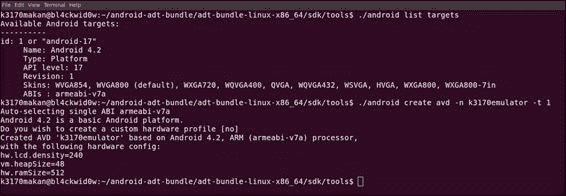
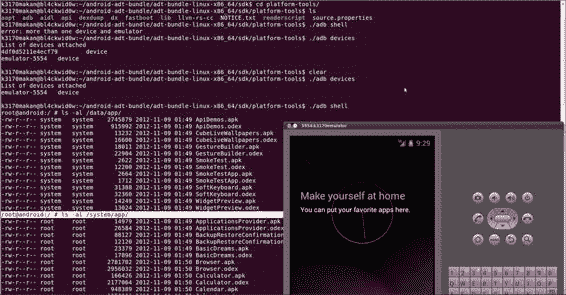
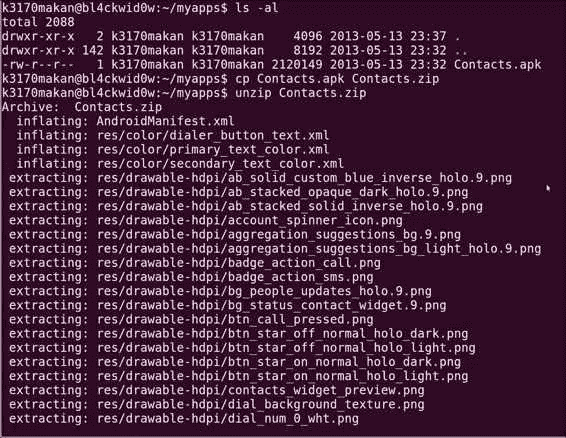
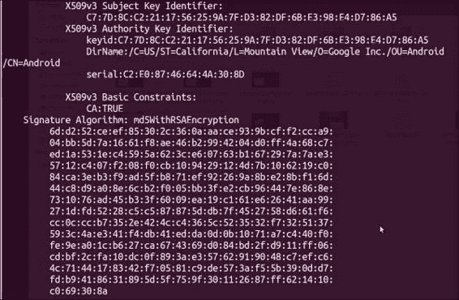
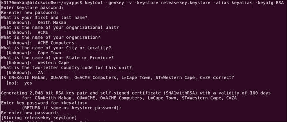

# 第二章。参与应用安全

在本章中，我们将介绍以下食谱:

*   检查申请证书和签名
*   签署安卓应用
*   验证应用签名
*   正在检查 AndroidManifest.xml 文件
*   通过亚行与活动经理互动
*   通过亚行提取应用资源

# 简介

在这一章中，我们将通过直接接触安卓安全架构的一些组件来看到它们的作用，特别是那些专注于保护应用的组件。“除非你把手弄脏了，否则你永远不会真正理解任何事情。”这是本章试图启发的；实际上对一些安全机制感到失望和厌恶，剖析它们，并真正了解它们的全部内容。

如果您想要对应用进行逆向工程或对安卓应用进行全面的实践安全评估，或者如果您只是纯粹想了解更多关于应用安全的信息，我们将在这里介绍最基本的技巧和诀窍。

# 检查申请证书和签名

应用证书是开发人员用来声明他们对发布到应用市场的应用的信任。这是通过声明他们的身份并以加密方式将他们与他们的应用相关联来实现的。应用签名通过提供一种简单有效的机制来确定和实施安卓应用的完整性，从而确保没有应用可以冒充其他应用。要求所有应用在安装前都要签署证书。

安卓应用签名是 JAR 签名的再利用。它通过对应用的内容应用加密散列函数来工作。我们将很快看到 APK 文件中的哪些内容被散列。散列随后与声明开发者身份的证书一起分发，将它与开发者的公钥和他/她的私钥相关联，因为它们在语义上是相关的。该证书通常使用开发人员的私钥加密，这意味着它是一个自签名证书。没有可信的第三方来证明开发者实际拥有给定的公钥。这个过程产生一个签名，并用这个公钥分发或发布。

应用的签名是唯一的，找到应用的证书和签名是一项至关重要的技能。您可能正在设备上寻找恶意软件签名，或者您可能想要列出共享给定公钥的所有应用。

## 做好准备

在开始之前，您需要在机器上安装以下软件:

*   **Java JDK** :这个可以安装在 Unix/Linux 发行版或者微软 Windows 系统上，如前一章所示
*   **安卓 SDK** :这个可以安装在你的 Linux Debian 或者微软 Windows 系统上，如前一章所示
*   **WinZip** (适用于 Windows):可在[http://www.winzip.com](http://www.winzip.com)下载；如果您运行的是 Windows 7，则 WinZip 不是显式必需的
*   **解压**(适用于 Debian/Ubuntu Linux 系统):这可以通过在你的终端中键入以下命令来安装:

    ```java
    sudo apt-get install unzip

    ```

假设我们心中还没有一个应用——您想要查看它的证书——并且您希望能够完全复制这里演示的内容，那么从模拟器中拉出一个应用会很方便。该方法还详细说明了如何设置模拟器。

按照这里的方式设置仿真器，可以确保您能够访问完全相同的应用和仿真系统，并最终访问相同的证书，从而轻松检查您是否处于正确的轨道上。在模拟安卓设备之前，您需要确保更新安卓软件开发工具包工具，以包括最新的应用编程接口级别和模拟器映像。如果您不确定如何升级您的安卓软件开发工具包，请参考上一章。

因此，首先，让我们通过执行以下步骤来启动一个**安卓虚拟设备** ( **AVD** ) :

1.  Open a command-line interface and execute the following command:

    ```java
    [path-to-your-sdk-install]/android create avd –n [your avd name]  –t [system image target]

    ```

    

    或者，如果您使用的是 Windows 机器，请键入:

    ```java
    C:\[path-to-your-sdk-install]\android create avd –n [your avd name] –t [system image target]

    ```

2.  If all goes well, you should have just created an AVD. You can now go ahead and launch it by executing the following command:

    ```java
    [path-to-your-sdk-install]/emulator –avd [your avd name] –no-boot-anim

    ```

    

3.  You should see an emulator pop up almost immediately. You will need to give it a second to boot up. Once it's all booted and you can see the lock screen, it means you can fire up ADB and pull some APK files off for us to dissect. You can pull an APK file off by typing the following command:

    ```java
    adb pull /system/app/Contacts.apk

    ```

    请参见下面的屏幕截图，了解一个实际示例:

    

    如果您需要另一个示例，您可以通过查看`system/app/`目录的内容来找到联系人应用或其他应用，如下图所示:

    

    您应该刚刚将“联系人”应用复制到本地设备上。如果这些有任何混淆之处，请参考前一章；它讲述了如何创建仿真器并从中复制设备。

## 怎么做…

你应该在你的硬盘上有一个你想要检查的 APK 文件的本地副本。我们现在可以开始检查应用的证书了。要查看应用的公钥证书和签名，您首先需要打开APK 文件。如果你知道如何解压缩一个档案，这是非常容易的，因为 APK 文件实际上是已经被重命名的 zip 档案。您可以通过执行以下步骤来解压缩归档文件:

1.  如果你在 Windows 机器上，你可能需要确保你已经安装了 WinZip。您所需要做的就是使用 WinZip 打开 APK 文件，它应该像任何其他 Zip 存档一样打开。在 Linux Debian 机器上，您需要将这个文件复制到一个扩展名为 ZIP 的文件中，这样 WinZip 就会很乐意为我们解压:

    ```java
    cp Contacts.apk Contacts.zip

    ```

2.  Unzip the archive to some memorable place; you can do that by firing off the following command:

    ```java
    unzip Contacts.zip

    ```

    

    解压档案后，你的目录应该如下图所示:

    

3.  Locate the folder called `META-INF`. This folder contains the signature file and the actual `CERT.RSA` file which is the self-signed public key certificate; you can view it using the keytool that comes bundled with the Java JDK that you should have installed prior to attempting this recipe. Use the following command to print the certificate:

    ```java
    keytool –printcert –file META-INF/CERT.RSA

    ```

    

    现在您面前的是声明公钥持有者的证书。

4.  To view the actual signatures related to the application content, locate a file called `CERT.SF` under the `META-INF` folder. You can view this on Windows by opening it in notepad or any other text editor that is available to you, or on Unix/Linux machines by executing the following command:

    ```java
    cat [path-to-unzipped-apk]/META-INF/CERT.SF

    ```

    你现在应该已经拿到签名文件了。它包括应用中包含的资源文件的加密哈希；请参见下面的截图示例:

    

    当`jarsigner`工具试图验证应用的内容时，使用该文件；它计算`CERT.SF`文件中列出的资源的加密哈希，并将其与为每个资源列出的摘要进行比较。在上一张截图中，哈希(`SHA-1 Digests`)是 base64 编码的。

## 它是如何工作的…

`META-INF`文件夹是一个非常重要的资源，因为它有助于建立应用的完整性。由于此文件夹的内容在应用内容的加密安全中起着重要的作用，因此有必要讨论文件夹的结构以及应该在其中出现的内容和原因。

在`META-INF`文件夹里面，你至少应该找到以下东西:

*   `MANIFEST.MF`:这个文件声明的资源非常类似于`CERT.SF`文件。
*   `CERT.RSA`:这是公钥证书，前面已经讨论过。
*   `CERT.SF`:这个文件包含应用中所有已经在应用签名中说明的资源。添加它是为了适应 JAR 特定的加密签名。
*   `CERT.RSA`:这是 X.509 v3 证书；其中的信息由 keytool 以下列方式构建:
    *   **所有者**:此字段用于声明公钥的持有者，包含与此个人相关的国家和组织的一些基本信息。
    *   **发行人**:此字段用于声明将公钥与声明的持有人相关联的 X.509 证书的发行人。这里提到的人或组织是有效地为钥匙持有人担保的人。它们确定证书中列出的公钥的真实性。
    *   **序列号**:这是作为颁发证书的标识。
    *   **有效期从...直到**:该字段指定发行人可以验证该证书及其关联属性的期限。
    *   **证书指纹**:该字段保存证书的摘要和。它用于验证证书没有被篡改。

数字签名是通过用可信第三方的私钥加密证书来计算的。在大多数安卓应用中，“可信第三方”就是开发者。这意味着该签名是通过使用他/她自己的私钥(通常是与公钥相关联的私钥)加密证书而生成的。数字签名的这种用法在功能上可能是正确的——它在功能上利用了数字签名机制——但它不如依赖可信的第三方(如**证书颁发机构** ( **CA** )那样健壮。毕竟，任何人都可以说他们通过用自己的密钥签名来开发推特应用，但没有人可以说他们拥有 VeriSign 或赛门铁克的私钥！

如果证书是自签名的，开发人员可以在填写证书相关信息的同时发挥他/她的创造力。安卓包管理器不努力验证证书的发行者、所有者或任何其他细节是否有效，或者是否是实际存在的实体。例如，“所有者”不需要明确提及关于开发者的任何有效的个人信息，或者“发行者”可以是完全捏造的组织或个人。虽然这样做是可能的，但是强烈建议不要这样做，因为这样会使应用非常难以信任；毕竟，一个移动应用经常被存储和使用在一个非常个人化的设备上，而对一个公钥证书的编造细节变得隐私的人可能不再信任这样一个应用。

生成值得信赖的应用证书的最佳方式是通过合格的证书颁发机构，方法是在生成您自己的公钥和私钥对后，请求已签名的公钥证书，或者请求证书颁发机构生成公钥/私钥对和公钥证书，因为它们通常会验证证书中发布的所有信息。赛门铁克和其他 ca 和安全供应商通常提供一系列服务来促进生成可信的公钥证书，其中一些服务是为了支持安卓应用开发。

本演练的下一部分包含一些关于公钥证书的有用链接，供您查看。

## 还有更多...

您也可以通过在 Linux 上执行以下步骤，使用 OpenSSL 库通过命令行工具查看完整的公钥证书:

1.  请确保您安装了 OpenSSL 如果没有，可以使用以下命令安装 OpenSSL:

    ```java
    apt-get install openssl

    ```

2.  Once installed, you can view the certificate using the following command, provided you are in the root of the unzipped `APK` directory:

    ```java
    openssl pcks7 –inform DER –in META-INF/CERT.RSA –noout –print_certs –text

    ```

    您应该会在终端屏幕上看到如下截图:

    

    上一张截图的后半部分如下:

    

    上一张截图中证书的最后一部分是颁发证书的 CA 的实际数字签名。

## 另见

*   位于[http://datatracker.ietf.org/doc/rfc2459/?include_text=1](http://datatracker.ietf.org/doc/rfc2459/?include_text=1)的*RFC 2459–互联网 X.509 公钥基础设施证书和 CRL 配置文件*文件
*   位于[的 *X.509 证书和证书撤销列表*甲骨文文档](http://docs.oracle.com/javase/6/docs/technotes/guides/security/cert3.html)

# 签约安卓应用

所有安卓应用在安装到安卓设备上之前都需要签名。Eclipse 和其他 IDEs 基本上为您处理应用签名；但是为了让你真正理解应用签名是如何工作的，你应该尝试使用 Java JDK 和 Android SDK 中的工具亲自签署一个应用。

首先，介绍一下应用签名的背景。安卓应用签名只是 JAR 签名的一个再利用。多年来一直用于验证 Java 类文件档案的真实性。安卓的 APK 文件不完全像 JAR 文件，包含的元数据和资源比 JAR 文件多一点；因此，安卓团队需要调整 JAR 签名，以适应 APK 文件的结构。他们这样做是为了确保安卓应用中包含的额外内容成为签名和验证过程的一部分。

因此，在不透露太多关于应用签名的信息的情况下，让我们获取一个 APK 文件并对其进行签名。在本演练的稍后部分，我们将尝试在安卓设备上安装我们的“手签”应用，作为验证我们是否已经正确签名的一种简单方法。

## 做好准备

在我们开始之前，您需要安装以下内容:

*   **Java JDK** :这里包含了所有必要的签名和验证工具
*   **APK 文件**:这是 APK 签的样本
*   **WinZip** :这是 Windows 机器需要的
*   **解压**:这是 Ubuntu 机器需要的

考虑到您可能正在使用已经签名的 APK 文件，您需要首先从 APK 文件中删除证书和签名文件。为此，您需要执行以下步骤:

1.  解压 APK 文件。重申拆开 APK 的档案是浪费；因此，如果您在这一步需要帮助，请参考*检查申请证书和签名*配方。
2.  Once the APK file has been unzipped, you'll need to remove the `META-INF` folder. The Windows folks can simply open the unzipped `APK` folder and delete the `META-INF` folder using the graphical user interface. This can be done from the command-line interface by executing the following command on Unix/Linux systems:

    ```java
    rm –r [path-to-unzipped-apk]/META-INF

    ```

    你现在应该准备好签署申请了。

## 怎么做...

可以通过执行以下步骤对您的安卓应用进行签名:

1.  您首先需要为自己设置一个密钥库，因为它将保存您签署应用所需的私钥。如果已经设置了密钥库，可以跳过这一步。要在 Windows 和 Unix/Linux 发行版上生成全新的密钥库，您需要执行以下命令:

    ```java
    keytool –genkey –v -keystore [nameofkeystore] –alias [your_keyalias] –keyalg RSA –keysize 2048 –validity [numberofdays]

    ```

2.  输入此命令后，keytool 将帮助您为密钥库设置密码；你应该确保输入一些你会真正记住的东西！此外，如果您打算将此密钥库用于实际用途，请确保将其保存在非常安全的地方！
3.  After you've set up the password for your keystore, keytool will begin prompting you for information that will be used to build your certificate; pay close attention to the information being requested and please answer as honestly as possible—even though this is not demonstrated in the following screenshot:

    

    现在，您应该建立了一个全新的密钥库，新的私钥、公钥和自签名证书安全地存储在其中，并经过加密以保护您。

4.  现在，您可以使用这个全新的密钥库对应用进行签名，您可以通过执行以下命令来做到这一点:

    ```java
    jarsigner –verbose –sigalg MD5withRSA –digestalg SHA1 –keystore [name of your keystore] [your .apk file] [your key alias]

    ```

5.  You'll be prompted for the password to the keystore. Once you enter it correctly, `jarsigner` will start signing the application in place. This means that it will modify the APK file that you gave it by adding the `META-INF` folder with all of the certificate and signature-related details.

    

    就这样。签署申请就这么简单。我还无意中演示了如何对应用进行重新签名，即替换最初与应用一起分发的签名。

## 它是如何工作的...

首先，让我们看看提供给 keytool 的选项:

*   `-genkey`:这个选项告诉 keytool 你想要生成一些密钥
*   `-v`:该选项启用详细输出；但是，该命令是可选的
*   `-keystore`:这个选项是用来定位你想要用来存储你生成的密钥的密钥库
*   `-alias`:该选项是正在生成的密钥对的别名
*   `-keyalg`:该选项告诉生成密钥所用的加密算法；您可以使用 RSA 或 DSA
*   `-keysize`:该选项指定你将要生成的密钥的实际比特长度
*   `-validity`:该选项提到生成的密钥将有效的天数；安卓官方建议使用 10000 天以上的数值

keytool 实际上对公钥和私钥所做的是用它存储包装在 X.509 v3 证书中的公钥。该证书用于声明公钥持有者的身份，并可用于确认所提及的公钥属于声明的持有者。这需要像 CA 这样的可信第三方的参与，但安卓并不要求公钥以这种方式得到肯定。有关如何使用和构造这些证书的更多信息，请参考*检查申请证书和签名*配方。

`jarsigner`的选项在以下命令后详细描述:

```java
jarsigner –verbose –sigalg MD5withRSA –digestalg SHA1 –keystore [nameof your keystore] [your .apk file] [your key alias]

```

下一节解释了前面命令的属性:

*   `-verbose`:用于启用详细输出
*   `-sigalg`:用于提供签名过程中使用的算法
*   `-digestalg`:这用于提供算法，该算法将计算`.apk`文件中每个资源的签名
*   `-keystore`:用于指定想要使用的密钥库
*   `[your .apk file]`:这是你要签署的`.apk`文件
*   `[your key alias]`:这是您关联到密钥/证书对的别名

## 另见

*   位于[的 *Jarsigner* 文档](http://docs.oracle.com/javase/6/docs/technotes/tools/windows/jarsigner.html)
*   位于[的*签署你的应用-安卓开发者*页面](http://developer.android.com/tools/publishing/app-signing.html)
*   位于[的*键工具*文档](http://docs.oracle.com/javase/6/docs/technotes/tools/solaris/keytool.html)

# 验证应用签名

在前面的菜谱中，我们已经介绍了如何对应用进行签名，以及如何安全地生成密钥来对它们进行签名。该方法将提供如何验证应用签名的详细信息。能够“手动”完成这项工作非常重要，因为它不仅让您深入了解验证实际上是如何工作的，还可以作为一个网关，让您更深入地反思加密应用的安全性。

## 做好准备

要执行此配方，您需要以下内容:

*   JDK
*   要验证的签名应用示例

这就是你需要的全部了。我们走吧！

## 怎么做...

要验证应用签名，您需要执行以下步骤:

1.  爪哇 JDK 有一个名为`jarsigner`的工具，能够处理所有的艰苦劳动；您只需要执行以下命令:

    ```java
    jarsigner –verify –verbose [path-to-your-apk]

    ```

2.  你现在需要做的就是在屏幕上寻找**罐验证过的**串；这表明应用签名已经过验证。

# 正在检查 AndroidManifest.xml 文件

应用清单可能是安卓应用安全专家最重要的信息来源。它包含了关于应用权限的所有信息，以及哪些组件构成了应用的一部分，并且它为我们提供了关于如何允许这些组件与您平台上的其他应用交互的一些细节。我将使用这个方法作为一个很好的借口来讨论应用清单，它是如何构造的，以及示例清单中的每个组件意味着什么。

## 做好准备

在开始之前，你需要有以下软件:

*   适用于 Windows 的 WinZip
*   爪哇 JDK
*   一个方便的文本编辑器；通常 Vi/Vim 就可以，但是 Emacs、Notepad++、Notepad 都很酷；我们不需要任何花哨的东西
*   Android SDK(这里不奇怪！)

你可能还需要去买一些叫做 **apktool** 的东西；这使得解码`AndroidManifest.xml`文件变得非常容易。实际上，它真正做的只是重新格式化另一个安卓软件开发工具包工具的输出。设置起来很容易；您所需要做的就是执行以下步骤:

1.  Download the tool; you can it find at [http://android-apktool.googlecode.com/files/apktool1.5.2.tar.bz2](http://android-apktool.googlecode.com/files/apktool1.5.2.tar.bz2).

    如果你安装了安卓软件开发工具包，你可以简单地把你刚刚下载的 apktool 解压到你的软件开发工具包文件夹的`platforms-tools`文件夹中，更具体地说:

    ```java
    C:\\[path to your sdk]\sdk\platform-tools\

    ```

    或者对于 Linux 机器:

    ```java
    /[path to your sdk]/sdk/platform-tools/

    ```

    请确保你得到了`apktool.jar`文件和 apktool 脚本以及其他所有东西；不要把它放在自己的子文件夹里！

2.  If you don't want to download the Android SDK, there are some dependencies that you will need to download. They can be downloaded at [http://code.google.com/p/android-apktool/downloads/list](http://code.google.com/p/android-apktool/downloads/list).

    也就是说，如果你使用的是 Windows 机器，你应该在[http://Android-apktool . googlecode . com/files/apk tool-install-Windows-r05-ibot . tar . bz2](http://android-apktool.googlecode.com/files/apktool-install-windows-r05-ibot.tar.bz2)获取 apk tool。

    而且，如果你用的是 Linux Debian 机器，你应该在[http://Android-apk tool . googlecode . com/files/apk tool-install-Linux-r05-ibot . tar . bz2](http://android-apktool.googlecode.com/files/apktool-install-linux-r05-ibot.tar.bz2)得到这个。

    您还需要确保所有下载的文件都在同一目录中。

3.  You should be able to fire it up, and you can test it out by trying to run it with the following:

    在 Windows 上:

    ```java
    C:\[path-to-apktool]\apktool -help

    ```

    在 Debian Linux 上:

    ```java
    /[path-to-apk-too]/apktool -help

    ```

    如果你已经完成了所有这些，你将能够进入下一步，也就是，实际上剖析一个`AndroidManifest.xml`文件。

## 怎么做...

要获取给定应用包的`AndroidManifest.xml`文件的副本，您需要执行以下步骤:

1.  All that you'll need to do is point apktool at your APK file. We're going to be using the `Contacts.apk` application that we pulled off of an emulator in one of the previous recipes. Type the following into your command prompt and make sure your working directory—the directory you are currently in with your terminal/command prompt—is the one you extracted apktool into.

    在 Debian Linux 上:

    ```java
    /[path-to-apktool]/apktool d -f –s [apk file] decoded-data/

    ```

    在 Windows 上:

    ```java
    C:\[path-to-apktool]/apktool d –f –s [apk file] decoded-data/

    ```

    例如，如果您正在使用`Contacts.apk`应用，并且希望所有解码的文件都保存到名为`decoded`的文件夹中，那么您可以在 Linux 机器上键入以下命令:

    ```java
    ~/adt-bundle-linux-x86_64/sdk/platform-tools/apktool d –f –s Contacts.apk decoded

    ```

    

2.  You can now view the application manifest. It should be under the folder you chose to extract it to in the previous step, inside a file aptly named `AndroidManifest.xml`. To view it, simply whip out your favorite text editor—Linux folks, you have almost a million text-editing tools bundled into your operating system—and point it at the `AndroidManifest.xml` file.

    在 Linux 上:

    ```java
    vi [path-to-your-decoded-data]/AndroidManifest.xml

    ```

    或者，您可以通过执行以下命令将其显示在终端屏幕上:

    ```java
    cat [path-to-your-decoded-data]/AndroidManifest.xml

    ```

    在 Windows 上:

    ```java
    C:\Windows\System32\notepad.exe [path-to-decoded-data]\AndroidManifest.xml

    ```

3.  You should see the manifest either on your terminal screen—if you're on a Linux machine—or notepad should pop up with the manifest open. Some of you may not understand what all of the garble on your screen is or how valuable this information is, which is why the next recipe includes an explanation of all the important parts of the application manifest structure:

    

    所以，你可能在盯着`AndroidManifest.xml`文件中列出的乱码信息。这意味着什么，以及为什么所有这些都很重要，将在本演练的下一部分中阐述。它提供了一些元素及其属性如何工作的良好背景。我只介绍了与安全性和应用安全性评估相关的最重要元素的背景。

## 它是如何工作的...

为了帮助您理解应用清单，我将在这里向您展示清单的结构，并解释最重要的部分意味着什么。如果你想了解更多关于安卓清单语言的细节，你应该查看*参见本食谱的*部分。

清单的结构如下:

```java
<?xml version="1.0" encoding="utf-8"?>

<manifest>

  <uses-permission /> <permission /> <permission-tree /> <permission-group /> <instrumentation /> <uses-sdk /> <uses-configuration /> <uses-feature /> <supports-screens /> <compatible-screens /> <supports-gl-texture />
  <application>
    <activity>
      <intent-filter>
        <action />
        <category />
        <data />
      </intent-filter>
      <meta-data />
    </activity>
    <activity-alias>
      <intent-filter> . . . </intent-filter>
      <meta-data />
    </activity-alias>
    <service>
      <intent-filter> . . . </intent-filter>
      <meta-data/>
    </service>
    <receiver>
      <intent-filter> . . . </intent-filter>
      <meta-data />
    </receiver>

    <provider>
      <grant-uri-permission />
      <meta-data />
      <path-permission />
    </provider>
    <uses-library />
  </application>
</manifest>
```

### 类型

**下载示例代码**

您可以从您在[http://www.packtpub.com](http://www.packtpub.com)的账户中下载您购买的所有 Packt 书籍的示例代码文件。如果您在其他地方购买了这本书，您可以访问[http://www.packtpub.com/support](http://www.packtpub.com/support)并注册，以便将文件直接通过电子邮件发送给您。

那么，这究竟意味着什么呢？嗯，首先，第一行更多的是关于文件和安卓清单的类型，与它做什么和打算做什么几乎没有关系。如果你从`.xml`扩展名看不出来，那就是一个**可扩展标记语言** ( **XML** ) 文件。这意味着安卓清单是一种 XML 语言。XML 是一种格式，基本上可以组成任何你想要的语言；一些资料坦率地将其描述为定义标记语言的语言。XML 被设计成一套描述任何事物的规则！

因此，当您看到下面的代码时，您知道那一行后面的内容是 XML 版本 1 中的一个 XML 文件，它是使用 UTF-8 编码的:

```java
<?xml version="1.0" encoding="utf-8"?>
```

转到安卓专用部分:

```java
<manifest>
```

此元素是应用清单中条目的开始标记；它标志着开始，被称为 XML 文档的根元素。下一个标签声明应用需要给定的权限:

```java
<uses-permission android:name="string"/>
```

这是安装应用时通常显示的字符串，具体取决于它是哪种权限。`android:name`属性指定权限的名称；因此，例如，如果您的应用需要使用设备的相机服务，那么它的清单中应该包含以下代码:

```java
<uses-permission android:name="android.permission.CAMERA">
```

下一个元素类型如下:

```java
<permission android:description="string resource" android:icon="drawable resource" android:label="string resource" android:name="string" android:permissionGroup="string" android:protectionLevel=["normal" | "dangerous" | "signature" | "signatureOrSystem"] />
```

此元素用于定义权限；例如，当开发人员认为其他应用要与特定的应用组件交互时，需要特殊的唯一权限。这个元素挺有意思的；让我们看看它的属性:

*   `android:description`:该属性用于定义当提示用户授予权限时，显示为权限描述的字符串。
*   `android:icon`:该属性用于定义提示用户授予权限时显示的描述性图标。
*   `android:label`:当提示用户授予权限时，该属性作为权限的名称，例如网络访问、读取 SMSs。
*   `android:name`:该属性是权限的实际名称。这是将在应用清单中查找的文字字符串，以确定它是否具有此权限，例如`android.permission.Camera`。
*   `android:protectionLevel`:该属性是用于表示与该权限相关的风险等级的值。级别分类如下:
    *   `"dangerous"`:该级别通常分配给允许应用访问敏感用户数据或操作系统配置数据的任何权限。这用于保护对任何可用于伤害用户的功能或数据的访问。
    *   `"normal"`:该级别用于表示任何权限，该权限授予对没有固有风险的数据或服务的访问权限。
    *   `"signature"`:该级别是设置的，当许可被自动授予与定义该许可的应用签署相同证书的任何应用时，即在`AndroidManifest.xml`中具有关联`<permission>`标签的应用。
    *   `"signatureOrSystem"`:当将权限自动授予任何与定义权限的应用使用相同证书签名的应用时，设置该级别。

您应该密切关注`protectionLevel`属性中使用的值，尤其是那些需要专业执行应用评估的人。试着想想开发者决定的保护级别是否合适。您需要能够确保向用户明确指出该权限涉及的风险。

`protectionLevel`的另一个关键属性是，它决定了在安装应用之前向用户显示哪些权限。用户总是被提示授予危险保护级别的权限，尽管只有在用户明确请求时才会显示正常权限。另一方面，`signature`和`signatureOrSystem`权限在应用安装之前不会显示给用户。这意味着，如果应用被授予`signature`或`signatureOrSystem`保护级别的高风险权限，用户将不会察觉。检查应用清单时，请考虑这一点，因为这将有助于确定应用如何向用户传达风险。转到下一个元素类型！

```java
<application>
```

此元素用于定义应用的开头。就安全性而言，这个元素的重要之处在于它的属性，以及它们如何影响在这个元素中定义的组件。为了简洁起见，这里省略了属性定义；您需要参考[http://developer . Android . com/guide/topics/manifest/application-element . html](http://developer.android.com/guide/topics/manifest/application-element.html)上提供的官方文档了解更多详细信息。

这个元素的一个重要属性是，一些属性只是为元素内部定义的组件的相应属性定义默认值；这意味着它的组件将能够覆盖它们。这些可重写属性中值得注意的一个元素是名为`permission`的属性，它声明了其他应用与之交互所需的权限。这意味着，如果一个应用设置了一个给定的权限，并且它的一个组件设置了一个不同的权限作为它的属性，那么该组件的权限将优先。如果组件用正常权限覆盖危险权限，这可能会带来相当大的风险。

其他属性不能被其组件覆盖。这取决于属性中设置并应用于每个组件的值。这些组件包括以下属性:

*   `debuggable`:该属性指定给定组件或组件组是否可调试。
*   `enabled`:该属性指定安卓应用框架是否能够启动或运行用该元素定义的组件；默认为`true`。只有当设置为`false`时，它才会覆盖所有组件的值。
*   `description`:这个属性就是简单来说就是一个用来描述应用的字符串。
*   `allowClearUserData`:该属性是决定用户是否能够清除与 app 关联的数据的标志；默认情况下，它被设置为`true`，不能被某些平台上的非系统应用设置为其他任何东西。

以下元素是应用组件的定义，允许开发人员决定它们的某些属性:

```java
<activity
  android:exported=["true" | "false"]
  android:name="string"
  android:permission="string"
  android:enabled=["true" | "false"]
  android:permission="string"
...other attributes have been omitted
>
```

这个元素定义了用户能够与之交互的组件。它还允许开发人员定义其他组件如何与之交互。可能直接影响应用安全性的属性已在前面的代码片段中声明；让我们谈谈他们做什么，为什么他们很重要。

*   `android:exported`: This attribute is used to decide whether the components of other applications will be able to interact with this element. All application components—services, broadcast receivers, and content providers—have this attribute in common.

    这里有趣的是这个属性的默认行为，如果没有为这个元素显式设置的话。是否为“`exported`”部分取决于是否为活动定义了意图过滤器。如果定义了意图过滤器并且没有设置该值，安卓系统会假设该组件打算响应来自外部应用组件的交互，并允许它们与其交互，前提是交互的发起者拥有这样做的必要权限。如果没有定义意图过滤器，也没有设置属性值，安卓应用框架将只允许针对组件解析显式意图。

    还有一个警告。由于旧版安卓 API 级别的工作方式，有些属性可以覆盖默认值；对于将`android:minSdkVersion`或`android:targetSdkVersion`设置为 16 或更低的应用，默认值为`true`。对于将`android:minSdkVersion`或`android:targetSdkVersion`设置为等于或高于 17 的应用，默认值为`false`。

    这是非常有价值的信息，因为它将帮助我们确定应用的攻击面——它确定潜在的恶意应用将如何与其组件进行交互——并且非常确切地确定良好的安全评估和无效的安全评估之间的区别。

*   `android:name`:该属性指定包含组件的 Java 代码的类文件；我在这里添加了它，因为如果您想要针对给定的组件启动明确的意图，您需要知道这个值。所有组件类型都有这个共同的属性。
*   `android:permission`:该属性为，用于指定与组件交互所需的权限。
*   `android:enabled`: This attribute is used to indicate whether the system is allowed to start/instantiate the component:

    ```java
    <service android:enabled=["true" | "false"]android:exported=["true" | "false"]android:icon="drawable resource"android:isolatedProcess=["true" | "false"]android:label="string resource"android:name="string"android:permission="string">

    </service>
    ```

    用于定义服务的属性；一些 XML 属性是服务独有的，即:

    *   `android:isolatedProcess`: This attribute indicates if the service will run in an isolated process with no permissions.

        ```java
               <receiver android:enabled=["true" | "false"]android:exported=["true" | "false"]android:icon="drawable resource"android:label="string resource"android:name="string"android:permission="string"android:process="string" ></receiver>
        ```

        这个元素声明了广播接收器组件:

        ```java
               <provider android:authorities="list"android:enabled=["true" | "false"]android:exported=["true" | "false"]android:grantUriPermissions=["true" | "false"]android:icon="drawable resource"android:initOrder="integer"  android:label="string resource"android:multiprocess=["true" | "false"]android:name="string"android:permission="string"android:process="string"android:readPermission="string"android:syncable=["true" | "false"]android:writePermission="string" ></provider>
        ```

        它定义了内容提供者类型的组件。鉴于内容提供者基本上是类似数据库的组件，他们需要能够定义访问其数据结构和内容的控件。以下属性可以帮助他们做到这一点:

    *   `android:writePermission`:该属性指定该内容提供商负责的其他应用的权限组件的名称。它是改变或增加数据结构的必备工具。
    *   `android:readPermission`:该属性指定该内容提供商负责的其他应用的权限组件的名称。它是读取或查询数据结构的必备工具。
    *   `android:authorities`:这个属性指定了一个识别 URI 当局的名字列表。通常，这些是实现提供者的 Java 类:

        ```java
               <intent-filter android:icon="drawable resource"android:label="string resource"android:priority="integer" ></intent-filter>
        ```

## 另见

*   位于[的*和 irdManifest.xml 文件*页面](http://developer.android.com/guide/topics/manifest/manifest-intro.html)

# 通过 ADB 与活动经理互动

了解**安卓调试桥** ( **ADB** )对于任何一个初露头角的安卓安全专家来说都是非常关键的。ADB 允许您直接与本机服务和资源交互，例如包管理器、活动管理器和其他各种守护程序，这些守护程序对安卓系统使用的安卓系统操作至关重要。这个食谱将通过演示几个你可以启动的命令来提供如何与活动管理器交互的细节。

## 做好准备

在我们开始之前，您将需要以下东西:

*   安卓软件开发工具包工具
*   要么是一个虚拟设备，参见*检查 AndroidManifest.xml 文件*食谱，了解如何创建和启动一个，要么是一个物理安卓设备

## 怎么做…

要使用应用管理器启动活动，您需要执行以下步骤:

1.  在以下命令的帮助下，在你的安卓设备上放置一个外壳:

    ```java
    adb shell

    ```

2.  Find yourself an activity to launch; you can do this by searching through the list of activities that are installed on the device. This can be done by using the package manager.

    ```java
    pm list packages

    ```

    一大堆包应该开始涌入你的屏幕；他们中的任何一个都应该做得很好作为例子:

    

3.  选择要启动的活动后，执行以下命令:

    ```java
    am start [package name]

    ```

## 还有更多...

除了仅仅启动活动之外，您还可以通过使用 start 命令接受的意图参数来指定发送到活动的意图，如下所示:

```java
am start <INTENT> < --user UID | current >

```

`<INTENT>`参数可以由几个参数组成，这些参数允许您详细描述意图。

*   `-a [action]`:此参数指定要指定的动作的字符串标签。它有助于详细说明发送意图的预期目的或“行动”。
*   `-d [data uri]`:该参数指定了要附加到意图的数据 URI。它指向处理意图的应用要使用的数据。
*   `-t [mime type]` : 该参数指定意图中包含的数据的 mime 类型。
*   `-c [category]` : 此参数指定意图的类别。
*   `-n [component]`:此参数指定以意图为目标的指定包的组件。它用于微调意图的目标。
*   `-f [flags]` : 该参数指定意图标志。它用于描述应该如何实现意图，并允许您控制实现意图的应用的给定数量的行为。
*   `-e [extra key] [string value]` : 此参数添加与给定键相关联的字符串值。某些意图定义允许您将字符串值的字典传递给应用。这些字符串值将在实现意图时被访问。
*   `-e [extra key] [string value]` : 这个参数的作用和`-e`一样。
*   `-ez [extra key] [boolean value]` : 此参数将布尔值与名称相关联。
*   `-ei [extra key] [integer value]` : 此参数将整数值与名称相关联。
*   `-el [extra key] [long value]`:此参数将长数值与名称相关联。
*   `-ef [extra key] [float value]` : 此参数将浮点数值与名称相关联。
*   `-eu [extra key] [uri value]` : 这个参数将 URI 和名字联系起来。
*   `-ecn [extra key] [component name]` : 该参数将一个组件名称(将被转换为`ComponentName`对象)与一个名称相关联。
*   `-eia [extra key] [integer value, integer value,...]` : 此参数允许您将整数数组与名称相关联。
*   `-efa [extra key] [float value, float value,...]`:这个参数与`-eia`相同，不同的是在这个例子中，你会将一个浮点数数组与一个名字相关联。

并非所有的意图论证都是强制性的。这个命令逻辑上合理所需的只是一个以意图或动作值为目标的组件；这些规则适用于针对应用的所有意图。

可选的`--user`参数允许您指定该应用应该作为哪个用户运行。如果该参数不是活动提供的，它将作为 ADB 用户运行。

您还可以将标志与意图相关联。有关选项的完整列表，请参考*中的*意向规范–安卓开发者*标签链接，另请参见*部分。

使用该命令的工作原理类似于以下命令:

```java
am start –n com.android.MyPackage/com.android.MyPackageLaunchMeActivity –e MyInput HelloWorld –a android.intent.MyPackageIntentAction –c android.intent.category.MyPackageIntentCategory

```

您也可以使用活动管理器启动服务；您可以使用`startservice`命令进行操作:

```java
am startservice <package name>/<component name> <INTENT>

```

使用这种方法的工作原理如下:

```java
am startservice com.android.app/com.android.app.service.ServiceComponent
you can also specify

```

活动管理器支持的另一个功能是停止服务和进程。当一个应用占用了所有的系统资源并降低了系统速度时，这就非常方便了。下面是如何使用活动管理器终止一个进程:

```java
kill < --user UID | current > <package>

```

与前面的命令一样，`UID`参数是可选的。这里，这个参数允许您将 `kill`命令限制为作为给定用户运行的包。如果不指定，ADB 将尝试终止与给定包相关联的所有用户的运行进程。

有关安卓活动管理器支持的更多命令，请参见*中标签为的*安卓调试桥-安卓开发者*链接，另请参见*部分。

## 另见

*   *安卓调试桥-安卓开发者*页面在[http://developer.android.com/tools/help/adb.html](http://developer.android.com/tools/help/adb.html)提供
*   *意向规范–安卓开发者*规范可在[http://developer.android.com/tools/help/adb.html#IntentSpec](http://developer.android.com/tools/help/adb.html#IntentSpec)获得

# 通过亚行提取应用资源

下面的食谱向你展示了如何窥探你的安卓应用。即，找出他们使用什么样的数据结构来存储重要信息，以及他们存储什么样的信息，例如高分、密码、联系人和电子邮件。除了允许您将的高分设置为负数之外，这也是您从后端影响应用行为的有效方法。它还为您提供了应用如何保护用户数据的视角，例如，数据是否加密？怎么加密的？应用是否保护用户数据的完整性？在逆向工程和评估应用安全性时，这也是一项非常有用的技能。

## 做好准备

不幸的是，对于这一个，你将需要一个“根”电话或者一个模拟器，因为你已经在模拟设备上有根访问。

如果您想访问其他应用的资源，您需要 root 权限。如果你想研究市场上应用的行为，没有什么能阻止你使用 ADB 将它们从你的设备中取出并安装到虚拟设备上。

您还需要安装安卓软件开发工具包。

## 怎么做…

在安卓设备上列出文件可以通过以下方式完成:

1.  在以下命令的帮助下，在你的安卓设备上放置一个外壳:

    ```java
    adb shell [options]

    ```

2.  Navigate to the `/data/data/` directory:

    ```java
    cd /data/data/

    ```

    该目录应该类似于下面的截图:

    

    如果列出文件权限、创建、修改等元数据，应该如下图截图所示:

    

    请注意数据目录的所有者和组，列表左侧的第一列和第二列。这里的业主是实际应用。默认情况下，Linux 以自己的 Linux 用户身份运行每个应用，这本质上就是应用沙箱的运行方式。当一个应用被授予一个它本来无权访问的资源的权限时，Linux 会将它放在相关的用户组中。

3.  Execute the following command if you wish to see all of the application resources and metadata in one go:

    ```java
    ls –alR */

    ```

    

    但是，通常情况下，你不会希望你的屏幕上充斥着大量的目录列表，除非你将它重定向到一个文件。您可能希望只显示数据库:

    ```java
    ls –alR */databases/

    ```

    

    或者，可能只显示文件或保存在每个应用的`/files/`目录中的任何内容:

    ```java
    ls –alR */files/

    ```

    

    或者，您甚至可以通过指定扩展名来搜索给定类型的文件；这里有几个例子:

    ```java
    ls –al */*/*.xml
    ls –al */*/*.png
    ls –al */*/*.mp3

    ```

4.  一旦你找到了你要找的文件，你所需要做的就是用一个好的旧的`adb pull` :

    ```java
    adb pull /data/data/[package-name]/[filepath] 

    ```

    把它们复制到你的机器上

## 还有更多...

我们在这里真正做的是列出不同的文件类型。其中一种类型是 sqlite3 数据库，也就是在某些目录中可以看到的数据库文件。我相信你很想知道如何打开它们，看看里面有什么。事情是这样的。

在我们开始之前，您需要确保安装了 sqlite3 它附带了安卓软件开发工具包。

1.  使用以下命令将数据库文件提取到机器上的某个位置:

    ```java
    adb pull /data/data/[package-name]/databases/[database-filename] 

    ```

2.  Load up the `.db` file using sqlite3:

    ```java
    sqlite3 [database-filename]

    ```

    如果你想找一个例子，请看下面的截图:

    

在本章中，我们介绍了保护应用的一些机制、涉及应用间通信的一些基本保护、应用权限以及加密签名，以及与文件系统相关的访问保护。

您应该从这里带走的是手工执行安全机制所需的提示和技巧。这允许你独立于执行这些机制的安卓设备来评估这些机制的有效性，也允许你直接与它们交互，希望能让你更好地理解它们。