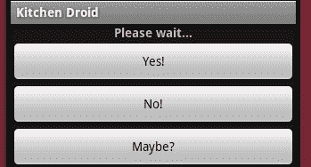
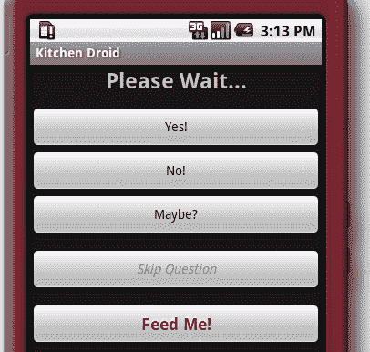

# 第一章。开展简单的活动

*在安卓的世界里，一个`Activity`就是你与用户接触的点。这是一个屏幕，您可以在其中捕获信息并将其呈现给用户。您可以通过使用 XML 布局文件或硬编码的 Java 来构建您的`Activity`屏幕。*

为了开始我们的安卓用户界面之旅，我们首先需要一个用户界面。在本章中，我们将从一个简单的`Activity`开始。我们将:

*   创建一个新的安卓项目
*   在应用资源文件中构建`Activity`布局
*   将资源文件绑定到一个`Activity`类
*   用一系列选择题动态填充`Activity`

# 发展我们的第一个例子

对于我们的第一个例子，我们将写一个选择题并回答`Activity`。我们可以将它用于诸如“谁想成为百万富翁？”，或者“你是哪种猴子？”。这个例子将提出问题，以便回答一个非常重要的问题:“我应该吃什么？”当用户回答问题时，这个应用将过滤一个食物创意数据库。用户可以在任何时候退出这个过程来查看一个建议的膳食列表，或者等到应用没有问题时再问他们。

由于这是一个用户界面示例，我们将跳过构建过滤器和配方数据库。我们只问用户与食物偏好相关的问题。对于每个问题，我们有一个预设答案列表，用户可以从中进行选择(即选择题)。他们给出的每一个答案都会让我们缩小合适食谱的范围。

# 创建项目结构

在开始编写代码之前，我们需要一个项目结构。一个安卓项目不仅仅是由 Java 代码组成的——还有清单文件、资源、图标等等。为了让事情变得简单，我们使用了默认的安卓工具集和项目结构。

你可以从[【http://developer.android.com】](http://developer.android.com)下载你喜欢的操作系统的最新版本安卓 SDK。单个安卓软件开发工具包可用于针对任意数量的目标安卓版本进行开发。您需要按照网站上的安装说明在[http://developer.android.com/sdk/installing.html](http://developer.android.com/sdk/installing.html)安装最新的 SDK“入门包”和一个或多个平台目标。本书中的大多数示例将在安卓 1.5 及更高版本上工作。安卓网站还维护了一个非常有用的图表，在这里你可以看到最受欢迎的安卓版本。

# 行动时间-设置安卓软件开发工具包

一旦您为您的操作系统下载了安卓软件开发工具包档案，您将需要安装它，然后下载至少一个安卓平台包。打开命令行或控制台，完成以下步骤:

1.  提取 Android SDK 档案。
2.  将目录更改为未打包的 Android SDK 的根目录。
3.  将目录更改为 Android SDK 的`tools`目录。
4.  通过运行以下命令更新软件开发工具包:

    ```java
    android update sdk
    ```

5.  进入**虚拟设备**屏幕，点击**新建**按钮，创建一个新的虚拟设备。命名新的虚拟设备**默认**。
6.  指定它的目标为 SDK 下载的最新版本的 Android。将 SD 卡的尺寸设置为 **4096 MiB** 。点击**创建自动驾驶仪**按钮。

## *刚刚发生了什么？*

上面的命令告诉新的 Android SDK 安装寻找可用的包并安装它们。这包括安装平台包。你安装的每个平台包都可以用来创建 **安卓虚拟设备** ( **AVD** )。您创建的每个 AVD 就像购买一个新设备，可以在其上执行测试，每个设备都有自己的配置和数据。当你想要测试的时候，安卓模拟器会在这些虚拟机上运行你的软件。

# 行动时间——开始一个新项目

Android SDK 提供了一个名为`android`的便捷命令行工具，可以用来生成新项目的框架。你会在安卓软件开发工具包的`tools`目录下找到它。它能够创建一个基本的目录结构和一个`build.xml`文件(对于 Apache Ant)来帮助你开始你的 Android 应用开发。您需要确保`tools`目录在您的可执行路径中，这样才能工作。打开命令行或控制台。

1.  在你的主目录或桌面创建一个名为`AndroidUIExamples`的新目录。你应该在这本书的每个例子中使用这个目录。
2.  将目录更改为新的`AndroidUIExamples`。
3.  运行以下命令:

    ```java
    android create project -n KitchenDroid -p KitchenDroid -k com.packtpub.kitchendroid -a QuestionActivity -t 3
    ```

## *刚刚发生的事情*

我们刚刚创建了一个框架项目。在前面的命令行中，我们使用了以下选项来指定新项目的结构:

<colgroup><col style="text-align: left"> <col style="text-align: left"></colgroup> 
| 

[计]选项

 | 

描述

 |
| --- | --- |
| `-n` | 给项目起一个名字，在我们的例子中是`KitchenDroid`。这实际上只是项目的内部标识符。 |
| `-p` | 给出项目的基目录。在这种情况下，使用与项目相同的名称。`android`工具会为你创建这个目录。 |
| `-k` | 指定应用的根 Java 包。这是一个相当重要的概念，因为它定义了我们在安卓客户端设备上的独特命名空间。 |
| `-a` | 为工具命名一个“主”`Activity`类。这个类将填充一个框架布局 XML，并作为构建应用的基点。骨架项目将被预配置为在启动时加载该`Activity`。 |

如果你运行`android list targets`命令，它给你一个可能目标的空列表，那么你还没有下载任何安卓平台的软件包。一般可以自己运行安卓工具，使用其图形界面下载安装安卓平台包。前面的例子使用了对应于安卓平台 1.5 版本的 API Level 3。

## 查看安卓项目布局

一个典型的安卓项目的目录和文件几乎和一个企业 Java 项目一样多。安卓既是一个操作环境，也是一个框架。在某些方面，你可以把安卓看作是一个为在手机和其他有限设备上运行而设计的应用容器。

作为新项目结构的一部分，您将拥有以下重要文件和目录:

<colgroup><col style="text-align: left"> <col style="text-align: left"></colgroup> 
| 

文件夹名称

 | 

描述

 |
| --- | --- |
| `bin` | 编译器会将您的二进制文件放在这个目录中。 |
| `gen` | 各种安卓工具生成的源代码。 |
| `res` | 应用资源转到这里，与您的应用一起编译和打包。 |
| `src` | 默认的 Java 源代码目录，`build`脚本将在这里寻找要编译的源代码。 |
| `AndroidManifest.xml` | 你的应用描述符，类似于`web.xml`文件。 |

### 类型

**资源类型和文件**

大多数类型的应用资源(放置在 `res`目录中)由安卓应用打包器进行特殊处理。这意味着这些文件比通常占用的空间少(因为 XML 被编译成二进制格式，而不是纯文本)。您可以通过各种方式访问资源，但总是通过安卓应用编程接口(它会为您将它们解码为原始形式)。

`res`的每个子目录表示不同的文件格式。因此，您不能将文件直接放入根`res`目录，因为包工具不知道如何处理它(并且您会得到一个编译错误)。如果需要访问原始状态的文件，将其放入`res/raw`目录。`raw`目录中的文件被逐字节复制到您的应用包中。

# 行动时间–运行示例项目

安卓工具给了我们一个安卓项目的最小例子，基本上是一个“Hello World”应用。

1.  在控制台或命令行中，将目录更改为`KitchenDroid`。
2.  要构建并签署项目，请运行:

    ```java
    ant debug
    ```

3.  你需要用你之前创建的`default` AVD 启动模拟器:

    ```java
    emulator -avd default
    ```

4.  现在在模拟器中安装您的应用:

    ```java
    ant install
    ```

5.  In the emulator, open the **Android** menu and, you should see an icon named **QuestionActivity** in the menu. Click on this icon.

    

## *刚刚发生了什么？*

安卓仿真器是一个完整的硬件仿真器，包括 ARM 中央处理器，托管整个安卓操作系统堆栈。这意味着在模拟器下运行的软件将完全像在裸机硬件上一样运行(尽管速度可能有所不同)。

当您使用蚂蚁部署您的安卓应用时，您需要使用`install`蚂蚁目标。 `install`蚂蚁目标寻找一个正在运行的模拟器，然后在其虚拟内存中安装应用档案。注意到 Ant 不会为您启动模拟器是很有用的。相反，它将发出一个错误，构建将失败。

### 类型

**申请签名**

E 非常安卓的应用包都是数字签名的。签名用于将您标识为应用的开发人员，并为应用建立权限。它还用于在应用之间建立权限。

您通常会使用自签名证书，因为安卓不要求您使用证书颁发机构。但是，所有应用都必须签名，才能由安卓系统运行。

# 屏幕布局

虽然安卓允许你用 Java 代码或者通过在 XML 文件中声明布局来创建屏幕布局，但是我们将在 XML 文件中声明屏幕布局。这是一个重要的决定，原因有几个。第一个是，在 Java 代码中使用 Android 小部件需要为每个小部件编写几行代码(一个声明/构造行，几行调用设置器，最后将小部件添加到其父级)，而用 XML 声明的小部件只占用一个 XML 标签。

将布局保存为 XML 的第二个原因是，当它存储在 APK 文件中时，会被压缩成一种特殊的安卓 XML 格式。因此，您的应用在设备上占用的空间更少，下载所需的时间更少，并且由于需要加载的字节代码更少，因此其内存大小也更小。在编译过程中，该 XML 还经过了安卓资源打包工具的验证，因此受到与 Java 代码相同的类型安全的约束。

XML 布局是一个“好主意”的第三个原因是，它们与所有其他外部资源一样，受到相同的资源选择过程的约束。这意味着布局可以根据任何定义的属性而变化，例如语言、屏幕方向和大小，甚至一天中的时间。这意味着您将来可以在同一布局上添加新的变体，只需添加新的 XML 文件，而不需要更改任何 Java 代码。

## 布局 XML 文件

所有的 XML 布局文件都必须放在你的安卓项目的`/res/layout`目录下，以便安卓打包工具找到它们。每个 XML 文件将产生一个同名的资源变量。例如，如果我们给我们的文件命名为`/res/layout/main.xml`，那么我们可以用 Java 作为`R.layout.main`来访问它。

由于我们将屏幕布局构建为资源文件，它将由应用资源加载器加载(已经由资源编译器编译)。资源要经过选择过程，因此虽然应用只加载一个资源，但应用包中可能有同一资源的多个可能版本。这个选择过程也是安卓国际化的基础。

如果我们想为几种不同类型的触摸屏构建不同版本的用户界面布局，安卓为我们定义了三种不同类型的触摸屏属性:`notouch`、`stylus`和`finger`。这大致相当于:无触摸屏、电阻式触摸屏和电容式触摸屏。如果我们想为没有触摸屏的设备定义一个更加键盘驱动的用户界面(`notouch`，我们编写了一个名为`/res/layout-notouch/main.xml`的新布局 XML 文件。当我们在`Activity`代码中加载资源时，如果我们运行的设备没有触摸屏，资源选择器将选择`notouch`版本的屏幕。

### 资源选择限定符

这里有一个常用限定词(属性名)的列表，安卓选择要加载的资源文件时会考虑到这些限定词。该表按优先级排序，最重要的属性位于顶部。

<colgroup><col style="text-align: left"> <col style="text-align: left"> <col style="text-align: left"> <col style="text-align: left"></colgroup> 
| 

名字

 | 

描述

 | 

例子

 | 

空气污染指数

 |
| --- | --- | --- | --- |
| 中冶和跨国公司 | 移动国家代码和移动网络代码。这些可以用来确定设备中的 SIM 卡绑定到哪个移动运营商和国家。移动网络代码可选择跟随移动国家代码，但不能单独使用(必须始终首先指定国家代码)。 | `mcc505``mcc505-mnc03``mcc238``mcc238-mnc02``mcc238-mnc20` | one |
| 语言和地区代码 | 语言和区域代码可能是最常用的资源属性。这通常是您将应用本地化为用户语言首选项的方式。这些值是标准的国际标准化组织语言和地区代码，不区分大小写。您不能指定没有国家代码的地区(类似于`java.util.Locale`)。 | `en``en-rUS``es``es-rCL``es-rMX` | one |
| 屏幕大小 | 这个属性只有三种变体:小型、中型和大型。该值基于可以使用的屏幕空间量:

*   小:QVGA (320×240 像素)低密度型屏幕；
*   中:WQVGA 低密度，HVGA (480x360 像素)中密度，WVGA 高密度类型屏幕；
*   大型:VGA (640x480 像素)或 WVGA 中密度类型屏幕

 | `small``medium``large` | four |
| 屏幕方面 | 这是屏幕的外观类型，基于设备“正常”使用的方式。该值不会根据设备的方向而改变。 | `long``notlong` | four |
| 屏幕方向 | 用于确定设备当前处于纵向(`port`)还是横向(`land`)模式。这仅在能够检测其方向的设备上可用。 | `land``port` | one |
| 夜间模式 | 这个值只是随着一天中的时间而变化。 | `night``notnight` | eight |
| 屏幕密度(DPI) | 设备屏幕的 DPI。该属性有四种可能的值:

*   `ldpi`:低密度，约 120dpi
*   `mdpi`:中密度，约 160dpi
*   `hdpi`:高密度，约 240dpi
*   `nodpi`:可用于`bitmap`资源，该资源不应缩放以匹配屏幕密度

 | `ldpi``mdpi``hdpi``nodpi` | four |
| 键盘状态 | 这个设备上有什么样的键盘？这个属性不应该用于确定设备是否有硬件键盘，而是用户当前是否可以看到键盘(或软件键盘)。 | `keysexposed``keyshidden``keyssoft` | one |

# 行动时间-设置问题活动

首先，我们将使用安卓最简单的布局，叫做:`LinearLayout`。与 Java AWT 或 Swing 不同，Android 布局管理器被定义为特定的容器类型。因此`LinearLayout`很像内置`LayoutManager`的`Panel`。如果你和 GWT 合作过，你会非常熟悉这个概念。我们将以简单的从上到下的结构布局屏幕(这正是`LinearLayout`的完美之处)。

1.  在您最喜欢的 IDE 或文本编辑器中打开名为`main.xml`的项目的`/res/layout`目录中的文件。
2.  删除任何模板 XML 代码。
3.  将以下 XML 代码复制到文件中:

    ```java
    <?xml version="1.0" encoding="UTF-8"?>

    <LinearLayout
        xmlns:android="http://schemas.android.com/apk/res/android"
        android:orientation="vertical"
        android:layout_width="fill_parent"
        android:layout_height="wrap_content">

    </LinearLayout>
    ```

## *刚刚发生了什么？*

我们刚刚删除了“你好世界”的例子，并放入了一个完全空的布局结构，它将作为我们构建用户界面其余部分的平台。如您所见，安卓为其资源提供了一个特殊的 XML 命名空间。

### 注

Android 中的所有资源类型都使用相同的 XML 命名空间。

我们将我们的根元素声明为`LinearLayout`。该元素直接对应类`android.widget.LinearLayout`。每个以安卓命名空间为前缀的元素或属性对应一个由安卓资源编译器解释的属性。

AAPT(安卓资产打包工具)会在你的根(或主)包中生成一个`R.java`文件。该文件包含所有用于引用各种应用资源的 Java 变量。在我们的例子中，我们在`/res/layout`目录中有`main.xml`包。该文件成为一个`R.layout.main`变量，一个常数值被指定为其标识。

# 填充视图和视图组

安卓中的一个小部件叫做 `View`，而一个容器(比如`LinearLayout`)就是`ViewGroup`。我们现在有一个空的 `ViewGroup`，但是我们需要开始填充它来构建我们的用户界面。虽然可以将一个`ViewGroup`嵌套在另一个`ViewGroup`对象中，但是一个`Activity`只有一个根`View`，因此一个布局 XML 文件可能只有一个根`View`。

# 行动时间——提问

为了向我们的用户提问，您需要在布局的顶部添加一个`TextView`。 A `TextView`有点像`Label`或者`JLabel`。它也是许多其他显示文本的安卓`View`小部件的基类。我们希望它占据所有可用的水平空间，但只有足够的垂直空间来容纳我们的问题。我们用**填充`TextView`请稍候...**为其默认文本。稍后，我们将使用动态选择的问题来替换它。

1.  回到你的`main.xml`文件。
2.  在`<LinearLayout...>`和`</LinearLayout>`之间创建一个`<TextView />`元素，以空元素`/>`语法结束，因为表示`View`对象的元素不允许有子元素。
3.  给`TextView`元素一个标识属性:

    ```java
    android:id="@+id/question"
    ```

4.  将布局宽度和高度属性分别更改为`fill_parent`和`wrap_content`(与`LinearLayout`元素相同):

    ```java
    android:layout_width="fill_parent"
    android:layout_height="wrap_content"
    ```

5.  给`TextView`一些占位符文本，这样我们可以在屏幕上看到:

    ```java
    android:text="Please wait..."
    ```

6.  使用 Apache Ant 从您的项目根文件夹中重新安装应用:

    ```java
    ant install
    ```

7.  在模拟器中再次运行该应用，它应该如下图所示:


`TextView`的代码应该是这样的:

```java
<TextView android:id="@+id/question"
          android:text="Please wait..."
          android:layout_width="fill_parent"
          android:layout_height="wrap_content"/>
```

## *刚刚发生的事情*

在前面的例子中，我们使用了`fill_parent`和`wrap_content`作为布局宽度和高度属性的值。`fill_parent`值是一个特殊值，始终等于父级大小。如果它被用作`android:layout_width`属性的值(如我们的例子)，那么它就是父视图的宽度。如果在`android:layout_height`属性中使用，它将等于父视图的高度。

值`wrap_content`可以像 Java AWT 或 Swing 中的首选大小一样使用。它对`View`对象说，“需要多少空间就拿多少，但不能再多了”。使用这些特殊属性值的唯一有效位置是在`android:layout_width`和`android:layout_height`属性中。其他任何地方都会导致编译器错误。

稍后我们需要在我们的 Java 代码中访问这个`TextView`，以便调用它的`setText`方法(它直接对应于我们用于占位符文本的`android:text`属性)。对资源变量的 Java 引用是通过给资源分配一个标识来创建的。在这个例子中，ID 在这里被声明为`@+id/question`。AAPT 将生成一个`int`值作为`id`资源的标识符，作为您的`R`类的一部分。从另一个资源文件访问资源也需要 ID 属性。

# 行动时间——为答案增加空间

W 虽然向用户提问是非常好的，但是我们需要给他们一些方法来回答这个问题。我们有几种选择:我们可以对每个可能的答案使用一个带“T1”的“T0”，或者对每个答案使用一个带项目的“T2”。但是，为了最大限度地减少所需的交互，并使事情尽可能清晰，我们对每个可能的答案使用一个`Button`。然而，这使事情稍微复杂化了，因为您不能在布局 XML 文件中声明可变数量的`Button`对象。相反，我们将声明一个新的`LinearLayout`并用 Java 代码中的`Button`对象填充它。

1.  在我们提出问题的`TextView`下，您需要添加一个`<LinearLayout />`元素。虽然这个元素通常会有子元素，但是在我们的例子中，可能的答案的数量是不同的，所以我们将它作为一个空元素。
2.  默认情况下，`LinearLayout`会将其子`View`对象水平并排放置。但是，我们希望每个孩子`View`都在彼此的垂直下方，因此您需要设置`LinearLayout` :

    ```java
    android:orientation="vertical"
    ```

    的`orientation`属性
3.  我们需要在稍后的 Java 代码中填充新的`ViewGroup` ( `LinearLayout`)，所以给它一个 ID: `answers` :

    ```java
    android:id="@+id/answers"
    ```

4.  像我们的`TextView`和`LinearLayout`一样，做宽度`fill_parent` :

    ```java
    android:layout_width="fill_parent"
    ```

5.  设置高度`wrap_content`，使其不会占用比所有填充按钮更多的空间:

    ```java
    android:layout_height="wrap_content"
    ```

生成的代码应该如下所示:

```java
<LinearLayout android:id="@+id/answers"
              android:orientation="vertical"
              android:layout_width="fill_parent"
              android:layout_height="wrap_content"/>
```

## *刚刚发生了什么？*

你可能已经注意到了，对于这个例子，我们的新`LinearLayout`没有内容。这可能看起来有点不寻常，但在这种情况下，我们希望用可变数量的按钮填充它——我们的选择题的每个可能答案都有一个按钮。然而，对于示例的下一部分，我们需要一些简单的内容`LinearLayout`中的`Button`小部件，这样我们就可以看到整个屏幕布局的动作。在布局资源文件中使用以下代码添加**是！**、**不！**和**也许？** `Button`小部件到`LinearLayout`:

```java
<LinearLayout android:id="@+id/answers"
            android:orientation="vertical"
            android:layout_width="fill_parent"
            android:layout_height="wrap_content">

    <Button android:id="@+id/yes"
            android:text="Yes!"
            android:layout_width="fill_parent"
            android:layout_height="wrap_content" />

    <Button android:id="@+id/no"
            android:text="No!"
            android:layout_width="fill_parent"
            android:layout_height="wrap_content" />

    <Button android:id="@+id/maybe"
            android:text="Maybe?"
            android:layout_width="fill_parent"
            android:layout_height="wrap_content" />
</LinearLayout>
```

在 Android XML 布局资源中，任何从`ViewGroup`类扩展而来的`View`类都被认为是容器。向它们添加小部件就像将那些`View`元素嵌套在您的`ViewGroup`元素中一样简单(与没有子 XML 元素的情况相反)。

下面是前面**的截图是的！**、**不！**、**也许？**选项:



# 行动时间-添加更多按钮

我们 有两个额外的按钮添加到屏幕布局中。一个允许用户跳过当前问题；另一个将允许他们查看到目前为止我们筛选过的简短的餐单(基于他们已经回答的问题)。

1.  首先在我们的答案`ViewGroup <LinearLayout />`下面创建一个空的`<Button />`元素(但是仍然在根`LinearLayout`元素内)。给它分配 ID `skip`，这样我们就可以用 Java 引用它:

    ```java
    android:id="@+id/skip"
    ```

2.  通过使用边距在答案和新按钮之间创建一些填充:

    ```java
    android:layout_marginTop="12sp"
    ```

3.  给它显示标签**跳过问题** :

    ```java
    android:text="Skip Question"
    ```

4.  和前面所有的小部件一样，宽度应该是`fill_parent`，高度应该是`wrap_content` :

    ```java
    android:layout_width="fill_parent"
    android:layout_height="wrap_content"
    ```

5.  现在在**跳过问题**按钮下面创建另一个空的`<Button />`元素
6.  新按钮的标识应为`view` :

    ```java
    android:id="@+id/view"
    ```

7.  我们希望此按钮显示文本:**喂我！** :

    ```java
    android:text="Feed Me!"
    ```

8.  再次，在**跳过问题**按钮和新的**喂我！**按钮:

    ```java
    android:layout_marginTop="12sp"
    ```

9.  最后，设置**喂我的宽度和高度！**按钮和我们到目前为止创建的其他元素一样:

    ```java
    android:layout_width="fill_parent"
    android:layout_height="wrap_content"

    ```

完成这两个按钮后，您的布局 XML 文件现在应该以以下内容结束:

```java
    <Button android:id="@+id/skip"
            android:text="Skip Question"
            android:layout_marginTop="12sp"
            android:layout_width="fill_parent"
            android:layout_height="wrap_content"/>

    <Button android:id="@+id/view"
            android:text="Feed Me!"
            android:layout_marginTop="12sp"
            android:layout_width="fill_parent"
            android:layout_height="wrap_content"/>
</LinearLayout>
```

## *刚刚发生的事情*

分离不相关的用户界面对象是用户界面设计中非常重要的一部分。项目组可以用空白、边框或方框分隔。在我们的例子中，我们选择使用空白，因为空白也有助于让用户界面感觉更干净。

我们通过在每个按钮上方使用一个空白来创建空白。边距和填充的工作方式与 CSS 中的完全一样。边距是小部件外部的间距，而填充是小部件内部的间距。在安卓系统中，边距是`ViewGroup`的关注点，因此它的属性名以`layout_`为前缀。因为填充是`View`对象的责任，所以填充属性没有这样的前缀:

```java
<Button android:id="@+id/view"
        android:text="Feed Me!"
        android:padding="25sp"
        android:layout_marginTop="12sp"
        android:layout_width="fill_parent"
        android:layout_height="wrap_content"/>
```

前面的代码将在`Button`的边缘和中间的文本之间创建额外的空间，同时保留按钮上方的边距。

前面例子中的所有测量都是以`sp`为单位指定的，这是“比例无关像素”的缩写。很像 CSS，你用你指定度量的大小单位作为度量数字的后缀。安卓可以识别以下测量值:

<colgroup><col style="text-align: left"> <col style="text-align: left"> <col style="text-align: left"></colgroup> 
| 

单位后缀

 | 

全名

 | 

描述和用途

 |
| --- | --- | --- |
| `px` | 像素 | 正好是设备屏幕的一个像素。这个单元在编写桌面应用时是最常见的，但是随着手机屏幕尺寸的广泛变化，它变得更加难以使用。 |
| `in` | 英寸 | 一英寸(或最接近的近似值)。这是基于屏幕的物理尺寸。如果您需要处理真实世界的测量，这很好，但是同样，由于设备屏幕大小的变化，它并不总是非常有用。 |
| `mm` | 毫米 | 另一个真实世界的测量，最接近的近似值。这只是英寸的公制版本:1 英寸 25.4 毫米。 |
| `pt` | 点 | 点的大小是 1/72 英寸。很像毫米和英寸，它们对于根据现实世界的尺寸来确定事物的大小非常有用。它们也常用于调整字体大小，因此相对于字体大小来说效果很好。 |
| `dp`或`dip` | 密度无关像素 | 单个 DP 与 160 dpi 屏幕的单个像素大小相同。这个尺寸并不总是成正比，也不总是精确的，但却是当前屏幕的最佳近似值。 |
| `sp` | 与比例无关的像素 | 很像`dp`单位，是根据用户选择的字体大小缩放的像素。这可能是最好使用的单元，因为它基于用户选择的参数。用户可能已经增加了字体大小，因为他们发现屏幕很难阅读。使用`sp`单元可确保您的用户界面与之相适应。 |

## 定义公共尺寸

Android 还允许您将自己的维度值定义为资源常数(注意:维度，而不是度量)。当您希望几个`view`小部件具有相同的大小，或者定义一个通用的字体大小时，这可能会很有用。包含维度声明的文件放在项目的`/res/values`目录中。虽然实际的文件名并不重要，但一个常见的名字是`dimens.xml`。从技术上讲，维度可以包含在其他值类型(即字符串)中，但不建议这样做，因为这样会使跟踪运行时应用的维度变得更加困难。

将维度放在自己的文件中(而不是内联声明)的一个优点是，您可以根据屏幕的大小对它们进行本地化。这使得屏幕分辨率显著的比例(如像素)更加有用。例如，可以将不同值的`dimens.xml`文件放入`/res/values-320x240`，将相同尺寸的另一个版本放入`/res/values-640x480`。

维度资源文件是一个简单的值文件(很像`strings.xml`，但是维度是用`<dimen>`标签定义的:

```java
<resources>
    <dimen name="half_width">160px</dimen>
</resources>
```

要在布局 XML 文件中以大小形式访问它，可以使用资源引用(与访问资源字符串的方式非常相似):

```java
<TextView layout_width="@dimen/half_width" />
```

当您想要构建在许多不同屏幕上看起来都很好的复杂布局时，构建一个公共维度列表会很方便，因为它避免了构建几个不同布局的 XML 文件的需要。

## 有一个围棋英雄——改进风格

现在我们已经有了这个用户界面的最基本的结构，但是它看起来并不太好。除了答案按钮之间的空白，还有**跳过问题**和**喂我！**按钮，你真的分不清。我们需要让用户知道这些按钮都做不同的事情。我们也需要引起更多人对这个问题的关注，尤其是如果他们没有很多时间斜眼看屏幕的话。你可能需要安卓文档，可以在[http://developer.android.com/reference/](http://developer.android.com/reference/)在线找到。

我们的屏幕顶部有一个问题，但正如您在前面的截图中看到的，它并不太突出。因此，用户不太清楚他们需要做什么(尤其是第一次使用应用)。

尝试对我们屏幕顶部的问题`TextView`进行以下样式更改。这些只需要向它的 XML 元素添加一些属性:

1.  将文本居中。
2.  将文本加粗。
3.  将文本大小更改为`24sp`。
4.  在问题底部和答案按钮之间添加`12sp`间距

喂我！按钮也很重要。这是一个按钮，让用户可以访问应用根据他们的答案过滤的建议食谱列表，所以它应该看起来不错。

下面的造型应该有助于**养活我！**按钮很好地突出(提示:`Button`延伸`TextView`):

1.  使文本大小`18sp`。
2.  将文本颜色改为好看的红色`#9d1111`。
3.  将文本设置为粗体。
4.  添加文字阴影:`x=0`、`y=-3`、`radius=1.5`、`color=white`(“`#fff`”)。

完成屏幕样式设置后，它应该如下图所示:



# 布局 XML 格式的限制

O 布局 XML 格式的一个最明显的限制是，您不能基于外部变量动态填充部分`Activity`—XML 文件中没有循环或方法。

在我们的例子中，这种限制以我们的空`LinearLayout`的形式表现出来。因为每个问题都有任意数量的可能答案，所以我们需要组中不同数量的按钮。出于我们的目的，我们将创建`Button`对象，并将它们作为 Java 代码的一部分放入`LinearLayout`中。

XML 布局格式的另一个缺点是动态引用外部资源。这可以在我们的示例中看到，我们将占位符文本放在`TextView`元素— `question`的`android:text`属性中。我们可以使用以下语法引用外部字符串:

```java
<TextView android:id="@+id/question"
          android:text="@string/question"
          android:gravity="center"
          android:textStyle="bold"
          android:layout_width="fill_parent"
          android:layout_height="wrap_content"/>
```

这将有效地引用`strings.xml`文件中的静态变量。不适合动态选择的问题，每次初始化`Activity`都会改变。

## 突击测验

1.  你有什么理由用 XML 而不是纯 Java 代码来编写布局？
    1.  安卓可以从外部读取布局文件进行优化。
    2.  布局成为资源选择过程的一部分。
    3.  您的用户可以从应用商店下载新的布局。
    4.  布局可以应用自定义主题。
2.  我们如何将**下一个问题**按钮的文本加粗？
    1.  使用`android:typeface`属性。
    2.  创建自定义`Button`实现。
    3.  添加一个 CSS 属性:`style="font-weight: bold"`。
    4.  使用`android:textStyle`属性。
3.  如果我们把`LinearLayout`的方位从`vertical`改为`horizontal`会发生什么？
    1.  布局会向它的一边翻转。
    2.  所有的小部件都会在屏幕上挤在一起。
    3.  只有问题`TextView`会出现在屏幕上。
    4.  根据可用的像素数量，该问题以及其他一些`View`对象可能在屏幕上可见。
    5.  布局会溢出，导致小部件在几行中彼此相邻。

# 填充问题活动

我们有一个基本的用户界面，但现在，它是静态的。我们可能想问用户许多不同的问题，每个问题都有不同的答案。我们可能还想以某种方式改变我们问的问题。简而言之，我们需要一些 Java 代码来用一个问题和一些可能的答案填充布局。我们的问题由两部分组成:

*   这个问题
*   可能答案的列表

在这个例子中，我们将利用字符串数组资源来存储所有的问答数据。我们将使用一个字符串数组来列出问题标识符，然后为每个问题及其答案使用一个字符串数组。这种方法的优点与使用布局 XML 文件而不是硬编码的优点非常相似。你的项目的`res/values`目录会有一个自动生成的`strings.xml`文件。该文件包含您希望应用使用的字符串和字符串数组资源。这里是我们的`strings.xml`文件的开始，有两个问题要问用户:

```java
<?xml version="1.0" encoding="UTF-8"?>

<resources>
    <string name="app_name">Kitchen Droid</string>

    <string-array name="questions">
        <item>vegetarian</item>
        <item>size</item>
    </string-array>

    <string-array name="vegetarian">
        <item>Are you a Vegetarian?</item>
        <item>Yes</item>
        <item>No</item>
        <item>I\'m a vegan</item>
    </string-array>

    <string-array name="size">
        <item>How much do you feel like eating?</item>
        <item>A large meal</item>
        <item>Just a nice single serving of food</item>
        <item>Some finger foods</item>
        <item>Just a snack</item>
    </string-array>
</resources>
```

每个`question`阵(`vegetarian`、`size`)的第一项是问题本身，后面的每一项都是答案。

# 该行动了——写更多的 Java 代码

1.  在编辑器或 IDE 中打开`QuestionActivity.java`文件。
2.  导入包申报下面的安卓`Resources`类:

    ```java
    import android.content.res.Resources;
    ```

3.  为了从您的`strings.xml`文件开始提问，您需要一个方法来查看`questions <string-array>`并找到包含当前问题的数组的名称。这通常不是您需要对应用资源做的事情——它们的标识符通常通过`R`类为您所知。然而，在这种情况下，我们希望按照`questions <string-array>`中定义的顺序工作，这让事情变得有点困难:

    ```java
    private int getQuestionID(Resources res, int index) {
    ```

4.  我们现在可以看一下`questions`字符串数组，它包含每个问题的识别名称(我们的索引字符串数组):

    ```java
    String[] questions = res.getStringArray(R.array.questions);
    ```

5.  我们有一系列问题，我们需要找到标识符值。这很像对`vegetarian`问题使用`R.array.vegetarian`，只是这是一个动态查找，因此比正常速度慢得多。总的来说，不建议使用下面的行，但是在我们的例子中它非常有用:

    ```java
    return res.getIdentifier(
            questions[index],
            "array",
            "com.packtpub.kitchendroid");
    ```

6.  `QuestionActivity`类将向用户显示几个问题。我们希望应用能够对手机及其环境“友好”。因此，每个问题都将在`QuestionActivity`的新实例中提出(允许设备控制我们的`Activity`的显示)。然而，这种方法提出了一个重要的问题:我们如何知道要向用户提出的问题的索引？答案:我们的`Intent`。一个`Activity`以一个`Intent`对象开始，每个`Intent`对象可以携带任意数量的“额外”信息(类似于`HttpServletRequest`接口中的请求属性)供`Activity`使用，类似于`main`方法的参数。所以一个`Intent`也像一个`HashMap`，包含了特殊的数据供`Activity`使用。在我们的例子中，我们使用一个名为`KitchenDroid.Question` :

    ```java
    private int getQuestionIndex() {
        return getIntent().getIntExtra("KitchenDroid.Question", 0);
    }
    ```

    的整数属性

这两种方法构成了填充我们的问题屏幕和在定义的问题列表中导航的基础。完成后，它们应该如下所示:

```java
private static int getQuestionID(
        final Resources res,
        final int index) {

    final String[] questions = res.getStringArray(R.array.questions);

    return res.getIdentifier(
            questions[index],
            "array",
            "com.packtpub.kitchendroid");
}

private int getQuestionIndex() {
    return getIntent().getIntExtra("KitchenDroid.Question", 0);
}
```

## *刚刚发生的事情*

`getQuestionID`方法相当直接。在我们的代码中，我们使用`R.array.questions`来访问`<string-array>`，它标识了我们要问用户的所有问题。每个问题都有一个`String`形式的名称和一个`int`形式的相应资源识别号。

在`getQuestionID`方法中，我们使用`Resources.getIdentifier`方法，该方法查找给定资源名称的资源标识符(整数值)。方法的第二个参数是要查找的资源类型。该参数通常是生成的`R`类的内部类。最后，我们传递资源所在的基本包。除了这三个参数，您还可以通过资源的完整名称来查找资源:

```java
return res.getIdentifier(
        "com.packtpub.kitchendroid:array/" + questions[index],
        null,
        null);
```

T 他`getQuestionIndex`方法告诉我们当前在`questions <string-array>`中的什么位置，从而告诉我们该问用户哪个问题。这是基于触发`Activity`的`Intent`中的“额外”信息。`getIntent()`方法为您提供了对触发您的`Activity`的`Intent`的访问。每个`Intent`可以有任何数量的“额外”数据，并且该数据可以是任何“原语”或“可序列化”类型。这里我们从`Intent`中获取`KitchenDroid.Question`额外的整数值，如果没有设置，则替换为 0(即默认值)。如果用户在菜单中点击我们的图标，安卓不会指定这个值，所以我们从第一个问题开始。

# 动态创建小部件

至此，我们只使用了布局 XML 文件来填充我们的屏幕。在某些情况下，这是不够的。在这个简单的例子中，我们希望用户有一个按钮列表，他们可以触摸这些按钮来回答向他们提出的问题。我们可以预先创建一些按钮，并将它们命名为`button1`、`button2`等等，但这意味着限制可能答案的数量。

为了从我们的`<string-array>`资源中创建按钮，我们需要用 Java 来做。我们早先创造了一个`ViewGroup`(以我们命名为`answers`的`LinearLayout`的形式)。这是我们添加动态创建的按钮的地方。

# 行动时间-将问题显示在屏幕上

Y 我们的应用现在知道在哪里可以找到要问的问题，并且知道它应该问哪个问题。现在它需要把问题放在屏幕上，并允许用户选择一个答案。

1.  在编辑器或 IDE 中打开`main.xml`文件。
2.  移除**是！**、**不！**和**也许？** `Button`元素来自布局资源。
3.  在编辑器或 IDE 中打开`QuestionActivity.java`文件。
4.  我们需要一个新的类字段来保存动态创建的`Button`对象(供参考):

    ```java
    private Button[] buttons;
    ```

5.  为了保持整洁，创建一个新的`private`方法将问题放在屏幕上:`initQuestionScreen` :

    ```java
    private void initQuestionScreen() {
    ```

6.  在这个方法中，我们假设布局 XML 文件已经被加载到`Activity`屏幕中(也就是说，它将在我们`onCreate`中的`setContentView`之后被调用)。这意味着我们可以将部分布局作为 Java 对象进行查找。我们需要名为`question`的`TextView`和名为`answers`的`LinearLayout`:T7
7.  这两个变量需要填充问题及其可能的答案。为此，我们需要包含该数据的`<string-array>`(来自我们的`strings.xml`文件)，因此我们需要知道当前问题的资源标识符。然后我们可以获取实际的数据数组:

    ```java
    int questionID = getQuestionID(resources, getQuestionIndex());
    String[] quesionData = resources.getStringArray(questionID);
    ```

8.  `question`字符串数组的第一个元素是要向用户提出的问题。以下`setText`调用与在布局 XML 文件中指定`android:text`属性完全相同:

    ```java
    question.setText(quesionData[0]);
    ```

9.  然后我们需要创建一个空数组来存储对我们的`Button`对象的引用:

    ```java
    int answerCount = quesionData.length – 1;
    buttons = new Button[answerCount];
    ```

10.  现在我们准备好填充屏幕了。对根据我们的数组索引的每个答案值进行循环:

    ```java
    for(int i = 0; i < answerCount; i++) {
    ```

11.  从数组中获取每个答案，跳过索引零处的问题串:

    ```java
    String answer = quesionData[i + 1];
    ```

12.  为答案创建一个`Button`对象，并设置其标签:

    ```java
    Button button = new Button(this);
    button.setText(answer);
    ```

13.  最后，我们将新的`Button`添加到我们的答案对象(`ViewGroup`)中，并在我们的`buttons`数组中引用它(稍后我们将需要它):

    ```java
    answers.addView(button);
    buttons[i] = button;
    ```

14.  这样做之后，就在`onCreate`中的`setContentView`调用之后，我们需要调用我们新的`initQuestionScreen`方法。

## *刚刚发生了什么？*

T 他`findViewById`方法遍历`View`对象的树寻找特定的识别整数值。默认情况下，任何在其资源文件中声明了`android:id`属性的资源都将有一个关联的标识。您也可以使用`View.setId`方法手动分配身份证。

与许多其他用户界面应用编程接口不同，安卓用户界面应用编程接口面向 XML 开发，而不是纯 Java 开发。这个事实的一个完美例子是`View`子类有三个不同的构造函数，其中两个是为 XML 解析应用编程接口设计的。我们不能在构造器中填充`Button`标签(就像大多数其他用户界面应用编程接口一样)，而是被迫首先构造对象，然后使用`setText`来定义它的标签。

你所做的传递给每个`View`对象的构造器的是一个`Context`对象。在上例中，您将`Activity`对象作为`this`传递给答案`Button`对象的构造函数。`Activity`类继承了`Context`类。`Context`对象由`View`和`ViewGroup`对象使用，以加载它们正确运行所需的应用资源和服务。

Y 您现在可以尝试运行该应用，在这种情况下，您将看到以下屏幕。你可能已经注意到这个截图中有额外的样式。如果你没有这个，你可能想回溯一点到前面的*有围棋英雄*部分。


# 在安卓中处理事件

安卓用户界面事件的工作方式与 Swing 事件监听器或 GWT 事件处理器非常相似。根据您希望接收的事件类型，您实现一个接口，并将一个实例传递给您希望从中接收事件的小部件。在我们的例子中，我们有`Bu` `tton`小部件，当用户触摸它们时会触发点击事件。

许多安卓类中都声明了事件侦听器接口，因此没有一个地方可以找到它们。此外，与大多数事件侦听器系统不同，许多小部件可能只有一个给定的事件侦听器。您可以通过类名以`On`为前缀来识别事件侦听器接口(很像 HTML 事件属性)。为了监听小部件上的点击事件，您可以使用`V` `iew.setOnClickListener`方法设置其`OnClickListener`。

下面的代码片段显示了如何将点击监听器添加到`Button`对象来显示`Toast`。一个`Toast`是一个小的弹出框，简单显示给用户一些信息:

```java
button.setOnClickListener(new View.OnClickListener() {
    public void onClick(View clicked) {
        Toast.makeText(this, "Button Clicked!", Toast.LENGTH_SHORT).
             show();
    }
});
```

前面的事件侦听器被声明为匿名内部类，当您将类似的事件侦听器传递给许多不同的小部件时，这是可以接受的。然而，大多数情况下，您会希望监听已经在 XML 布局资源中声明的小部件上的事件。在这些情况下，最好让您的`Activity`类实现所需的接口，或者为不同的事件驱动的动作创建专门的类。虽然安卓设备非常强大，但与台式电脑或笔记本电脑相比，它们仍然有限。因此，为了节省内存，应该避免创建不必要的对象。通过在已经创建的对象中放置尽可能多的事件侦听器方法，可以降低所需的开销。

## 突击测验

1.  当您在布局 XML 文件中声明一个对象时，如何检索它的 Java 对象？
    1.  该对象将在`R`类中声明。
    2.  使用`Activity.findViewById`方法。
    3.  通过使用`Resources.getLayout`方法。
    4.  该对象将被注入到`Activity`类的字段中。
2.  安卓应用中监听事件的“最佳”方式是什么？
    1.  将侦听器声明为匿名内部类。
    2.  为每个`Activity`创建一个单独的事件监听器类。
    3.  在`Activity`类中实现事件监听接口。
3.  为什么要把`this Activity`传到`View`对象(也就是`new Button(this)`的构造函数中。
    1.  它定义了它们将显示的`Activity`屏幕。
    2.  这是事件消息将被发送到的地方。
    3.  这就是`View`将如何参考其操作环境。

# 总结

安卓自带一些很棒的工具来创建和测试应用，即使你手边没有安卓设备。也就是说，没有什么可以代替实际接触你的应用。这是安卓如此引人注目的平台的一部分，它的感觉和响应方式(模拟器只是没有传达这一点)。

安卓开发者武库中最重要的工具之一是资源选择系统。有了它，您可以构建高度动态的应用来响应设备的变化，从而响应用户环境的变化。根据设备的方向更改屏幕布局，或者当用户滑出手机的 QWERTY 键盘时，可以让他们知道您在构建应用时已经考虑了他们的偏好。

在 Android 中构建用户界面时，强烈建议至少在一个 XML 文件中构建布局结构。XML 布局文件不仅被认为是应用资源，而且安卓也强烈支持构建 XML 用户界面，而不是编写 Java 代码。然而，有时一个布局 XML 文件是不够的，您需要用 Java 构建用户界面的一部分。在这种情况下，最好至少将一个骨架布局定义为 XML(如果可能的话)，然后使用标记 id 和容器将动态创建的`View`对象放入布局中(很像在 JavaScript 中动态添加到 HTML 文档中)。

构建用户界面时，仔细考虑结果的外观和感觉。在我们的例子中，我们使用`Button`对象作为问题的答案。我们可以使用`RadioButton`对象来代替，但是用户需要选择一个选项，然后触摸**下一个问题**按钮，需要两次触摸。我们也可以使用`List`(它与需要动态填充的事实很好地交互)，然而`List`并不像`Button`那样向用户指示“动作”。

对布局进行编码时，请小心使用的度量单位。强烈建议您在大多数情况下坚持使用`sp`，如果您不能使用特殊的`fill_parent`或`wrap_content`值。其他值高度依赖于屏幕大小，不会响应用户偏好。您可以利用资源选择过程为小、中或大屏幕构建不同的屏幕设计。您也可以定义自己的测量单位，并以屏幕尺寸为基础。

请始终考虑您的用户将如何与您的应用交互，以及他们可能有多少(或很少)时间使用它。保持每个屏幕的简单和响应，让您的用户满意。

现在我们已经学会了如何创建一个骨架安卓项目，以及一个简单的`Activiy`，我们可以专注于安卓用户界面设计更微妙的问题和解决方案。在下一章中，我们将重点关注数据驱动的小部件。安卓有几个专为显示和选择更复杂的数据结构而设计的小部件。这些小部件构成了数据驱动应用的基础，如地址簿或日历应用。