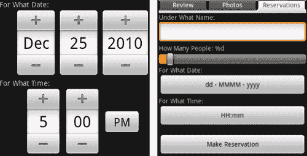
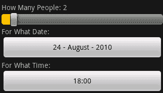

# 第三章。使用专门的安卓小部件进行开发

*除了许多通用的小部件如按钮、文本字段和复选框，安卓还包括各种更专业的小部件。虽然一个按钮相当普通，并且在许多情况下都有使用，但是一个图库小部件就更有针对性了。在本章中，我们将开始关注更专业的安卓小部件，它们出现在哪里，以及如何最好地使用它们。*

虽然这些都是非常专业的`View`类，但是非常重要。如前所述(真的怎么强调都不为过)，好的用户界面设计的基石之一是**一致性** 。一个例子是 `DatePicker`小部件。它肯定不是世界上最漂亮的日期选择器。它不是日历小部件，所以用户有时很难准确选择他们想要的日期(大多数人认为是“下周星期二”，而不是“17 号星期二”)。但是，`DatePicker`是标配！因此，用户确切地知道如何使用它，他们不必使用一个破碎的日历实现。本章将使用安卓更专业的`View`和布局类:

*   `Tab`布局
*   `TextSwitcher`
*   `Gallery`
*   `DatePicker`
*   `TimePicker`
*   `RatingBar`

这些类有非常特殊的用途，有些类在实现方式上有一些小的古怪。本章将探讨如何以及在哪里使用这些小部件，以及在哪里需要注意它们的实现细节。我们还将讨论如何最好地将这些元素合并到应用和布局中。

# 创建餐厅审查申请

在前一章中，我们构建了一个订购应用。在这一章中，我们将看一下回顾餐厅。该应用将允许用户查看其他人对餐馆的意见、餐馆的照片库，最后是在线预订的部分。我们将把应用分成三个部分:

*   **点评**:该餐厅的点评和评分信息
*   **照片**:餐厅的照片库
*   **预订**:向餐厅申请预订

当构建一个应用，其中所有这三个部分都需要快速提供给用户时，最明智的选择是将每个部分放在屏幕上的一个选项卡中。这允许用户在三个部分之间切换，而不必将它们同时显示在屏幕上。这也节省了屏幕空间，给我们每个部分更多的空间。

**评论**标签将包括人们对正在浏览的餐厅所做评论的循环列表，以及该餐厅的平均“星级”。

展示餐厅的照片是**照片**标签的工作。我们将在屏幕顶部为用户提供一个缩略图“轨迹”，以及所选图像占用剩余屏幕空间的视图。

对于**预约**标签，我们需要获取用户的姓名以及他们希望预约的时间(日期和时间)。最后，我们还需要知道将为多少人预订。

# 行动时间——创建机器人评审项目结构

为了开始这个例子，我们需要一个新的项目和一个新的`Activity`。新的布局和`Activity`将与前两章的结构略有不同。我们需要使用 `FrameLayout`类来构建选项卡式布局。首先，我们将创建一个新的项目结构，并从一个骨架开始，该骨架将成为我们的选项卡布局结构。这可以用三个内容区域来填充。

1.  使用安卓命令行工具创建一个新的安卓项目:

    ```java
    android create project -n RoboticReview -p RoboticReview -k com.packtpub.roboticreview -a ReviewActivity -t 3

    ```

2.  在编辑器或 IDE 中打开`res/layout/main.xml`文件。
3.  清除默认代码(保留在 XML 头中)。
4.  创建根`FrameLayout`元素:

    ```java
    <FrameLayout 
        xmlns:android="http://schemas.android.com/apk/res/android"
        android:layout_width="fill_parent"
        android:layout_height="fill_parent">
    ```

5.  在新的`FrameLayout`元素中，添加一个`vertical LinearLayout` :

    ```java
    <LinearLayout android:id="@+id/review"
                  android:orientation="vertical"
                  android:layout_width="fill_parent"
                  android:layout_height="wrap_content">
    </LinearLayout>
    ```

6.  在`LinearLayout`之后，添加另一个空`LinearLayout`元素:

    ```java
    <LinearLayout android:id="@+id/photos"
                  android:orientation="vertical"
                  android:layout_width="fill_parent"
                  android:layout_height="wrap_content">
    </LinearLayout>
    ```

7.  然后，在第二个`LinearLayout`元素之后，添加一个空的`ScrollView`:T2

`FrameLayout`将被安卓标签结构用作内容区域，每个子元素将成为一个标签的内容。在前面的布局中，我们为**评论**和**照片**部分添加了两个`LinearLayout`元素，并为**保留**选项卡添加了一个`ScrollView`。

## *刚刚发生了什么？*

我们刚刚启动了“餐馆评论”应用，为用户界面构建了一个框架。这个`main.xml`文件有几个关键部分，我们应该在继续这个例子之前浏览一下。

首先，我们的根元素是一个`FrameLayout`。`FrameLayout`将其所有子节点固定在自己的左上角。实际上， `LinearLayout`和`ScrollView`这两个事件会相互重叠。这种结构可以用来形成类似于 Java AWT `CardLayout`的东西，当这些对象的相对标签被激活时，`TabHost`对象将使用它来显示这些对象。

第二，`LinearLayout`和`ScrollView`都有一个 ID。为了将它们识别为标签根，我们需要能够从我们的 Java 代码中轻松地访问它们。标签结构可能是用 XML 设计的，但是它们需要用 Java 组合在一起。

# 建立一个数据库

为了继续，我们需要我们的`Activity`类将我们在`main.xml`文件中声明的三个标签内容元素设置为标签。根据偏好，安卓系统中的所有标签都应该有一个图标。

以下是不带图标的选项卡截图:


以下是带有图标的选项卡的屏幕截图:


## 创建选项卡图标

一个机器人应用有一个由系统提供的默认小部件定义的特定外观和感觉。为了保持所有应用对用户的一致性，应用开发人员应该遵循一套用户界面指南。虽然让你的应用脱颖而出很重要，但用户经常会对不熟悉或看起来不合适的应用感到沮丧(这是自动移植的应用通常非常不受欢迎的原因之一)。

## 安卓标签和图标

在为您的应用选择选项卡图标时，为不同的屏幕大小和密度包含几个不同版本的图标被认为是一种好的做法。在高密度屏幕上看起来很好的抗锯齿角落在低密度屏幕上看起来很糟糕。你也可以为非常小的屏幕提供完全不同的图标，而不是丢失你所有的图标细节。安卓标签在被选中时会升高，在未被选中时会降低。安卓标签图标应该以与它们所在的标签“相反”的蚀刻效果出现，即选中时降低，不选中时升高。因此，图标有两种主要状态:选中和未选中。为了在这两种状态之间切换，选项卡图标通常由三个资源文件组成:

*   选定的图标图像
*   未选择的图标图像
*   根据图标的两种状态描述图标的 XML 文件

选项卡图标一般是简单的形状，而图像大小是方形的(一般最大 32×32 像素)。不同像素密度的屏幕应使用不同的图像变化(详见[第 1 章](01.html "Chapter 1. Developing a Simple Activity")、*开发简单活动*“资源选择”详情)。一般来说，你会使用一个黑暗的开始图像为选定的状态，因为当一个标签被选中，标签背景是光明的。对于未选择的图标，情况正好相反，应该使用浅色插图。

安卓应用中的位图图像应该总是 PNG 格式。我们把选中的图标称为**回顾**标签`res/drawable/ic_tab_selstar.png`，把未选中的图标文件命名为`res/drawable/ic_tab_unselstar.png`。为了在这两幅图像之间自动切换状态，我们将一个特殊的`StateListDrawable`定义为一个 XML 文件。因此**审阅**图标实际上在一个名为`res/drawable/review.xml`的文件中，它看起来像这样:

```java
<selector xmlns:android="http://schemas.android.com/apk/res/android"
          android:constantSize="true">

    <item
        android:drawable="@drawable/ic_tab_selstar"
        android:state_selected="false"/>

    <item
        android:drawable="@drawable/ic_tab_unselstar"
        android:state_selected="true"/>
</selector>
```

注意`<selector>`元素的`android:constantSize="true"`。默认情况下，安卓会假设生成的`StateListDrawable`对象中的每个状态都会导致图像大小不同，这又会导致用户界面重新运行布局计算。这可能相当昂贵，所以最好声明您的每个州的大小完全相同。

对于这个例子，我们将使用三个选项卡图标，每个都有两个状态。图标命名为`review`、`photos`和`book`。每一个都由三个文件组成:一个用于选定图标的巴布亚新几内亚，一个用于未选定图标的巴布亚新几内亚，以及一个定义状态选择器的 XML 文件。在我们的应用中，我们将只直接使用状态选择器 XML 文件，而让安卓应用接口来拾取实际的 PNG 文件。

# 实施评审活动

像 一样，我们会希望在我们的`strings.xml`文件中有本地化的文本。打开`res/values/strings.xm` l 文件，将以下代码复制到其中:

```java
<resources>
    <string name="app_name">Robotic Review</string>
    <string name="review">Review</string>
    <string name="gallery">Photos</string>
    <string name="reservation">Reservations</string>
</resources>
```

# 行动时间——编写评审活动类

正如 已经说过的，我们需要在我们的 Java 代码中设置我们的选项卡式布局结构。幸运的是，安卓提供了一个非常有用的`TabActivity`类，为我们做了很多繁重的工作，为我们提供了一个现成的`TabHost`对象，我们可以用它来构建`Activity`标签结构。

1.  在编辑器或 IDE 中打开之前生成的`ReviewActivity.java`文件。
2.  不扩展`Activity`，改类继承`TabActivity` :

    ```java
    public class ReviewActivity extends TabActivity
    ```

3.  在`onCreate`方法中，完全删除`setContentView(R.layout.main)`线(由`android create project`工具生成)。
4.  现在从你的父类中获取`TabHost`对象开始:

    ```java
    TabHost tabs = getTabHost();
    ```

5.  接下来，我们将布局 XML 膨胀到`TabHost` :

    ```java
    getLayoutInflater().inflate(
            R.layout.main,
            tabs.getTabContentView(),
            true);
    ```

    的内容视图中
6.  我们需要访问我们的其他应用资源:

    ```java
    Resources resources = getResources();
    ```

7.  现在我们为**评论**标签

    ```java
    TabHost.TabSpec details =
            tabs.newTabSpec("review").
            setContent(R.id.review).
            setIndicator(getString(R.string.review),
            resources.getDrawable(R.drawable.review));
    ```

    定义一个`TabSpec`
8.  使用前面的模式为**照片**和**预约**标签定义另外两个`TabSpec`变量。
9.  将每个`TabSpec`对象添加到我们的`TabHost` :

    ```java
    tabs.addTab(details);
    tabs.addTab(gallery);
    tabs.addTab(reservation);
    ```

`ReviewActivity`类标签结构的创建到此结束。

## *刚刚发生了什么？*

我们 为我们的新`ReviewActivity`构建了一个非常基本的选项卡式布局。在使用选项卡时，我们没有简单地使用`Ac` `tivity.setContentView`方法，而是自己对布局 XML 文件进行了膨胀。然后我们利用`TabActivity`类提供的`TabHost`对象创建了三个`TabSpec`对象。一个`TabSpec`是一个构建器对象，它可以让你构建标签的内容，类似于你用`StringBuilder`构建文本的方式。

一个`TabSpec`的内容是将被附加到屏幕上标签的内容视图(使用`setContent`方法分配)。在这个例子中，我们选择了最简单的选项，并在我们的`main.xml`文件中定义了标签内容。也可以使用`TabHost.TabContentFactory`界面偷懒创建标签内容，甚至可以使用`setContent(Intent)`在标签中放置外部`Activity`(如拨号器或浏览器)。然而，为了这个例子的目的，我们使用了最简单的选项。

您会注意到`TabSpec`(很像`StringBuilder`类)支持方法调用的链接，使得以“单次”方式设置选项卡(如前所述)或者分阶段构建`TabSpec`(即从外部服务加载时)变得容易和灵活。

我们分配给`TabSpec`的`indicator`将出现在选项卡上。在前面的例子中，一串文本和我们的图标。从 API 级别 4 (Android 版本 1.6)开始，可以使用一个`View`对象作为`indicator`，允许完全定制标签的外观和感觉。为了保持示例的简单性(并且与早期版本兼容)，我们提供了一个`String`资源作为`indicator`。

# 行动时间–创建审核布局

我们有一个骨架标签结构，但是还没有。第一个标签标题为**回顾**，这是我们要开始的地方。我们刚刚完成了足够的 Java 代码来加载选项卡并将其放在屏幕上。现在我们回到`main.xml`布局文件，用一些小部件填充这个标签，这些小部件为用户提供评论信息。

1.  在编辑器或 IDE 中打开`res/layout/main.xml`。
2.  在我们命名为`review`的`<LayoutElement>`中，添加一个新的`TextView`，其中将包含餐厅的名称:

    ```java
    <TextView android:id="@+id/name"
              android:textStyle="bold"
              android:textSize="25sp"
              android:textColor="#ffffffff"
              android:gravity="center|center_vertical"
              android:layout_width="fill_parent"
              android:layout_height="wrap_content"/>
    ```

3.  在新的`TextView`下面，添加一个新的`RatingBar`，我们将在这里显示其他人对餐厅的评价:

    ```java
    <RatingBar android:id="@+id/stars"
               android:numStars="5"
               android:layout_width="wrap_content"
               android:layout_height="wrap_content"/>
    ```

4.  为了简化第一个标签，我们添加了一个`TextSwitcher`，在这里我们可以显示其他人对餐厅的评论:

    ```java
    <TextSwitcher android:id="@+id/reviews"
                  android:inAnimation="@android:anim/fade_in"
                  android:outAnimation="@android:anim/fade_out"
                  android:layout_width="fill_parent"
                  android:layout_height="fill_parent"/>
    ```

在这个例子中，**评论**标签只有三个小部件，但是可以很容易地添加更多的小部件来允许用户输入他们自己的评论。

## *刚刚发生的事情*

我们刚刚整理了第一个标签的布局。我们创造的`RatingBar`有`wrap_content`的宽度，真的很重要。如果使用`fill_parent`，那么`RatingBar`中可见的星星数量将会是屏幕上能容纳的最大数量。如果你想控制你的`RatingBar`上出现多少颗星星，坚持使用`wrap_content`，但也要确保`RatingBar`有自己的水平线(至少在纵向布局上)。如果你现在在模拟器中安装`Activity`，你将不会在`TextView`或`TextSwitcher`中看到任何东西。

`TextSwitcher`没有默认动画，所以我们将`android`包提供的“入”动画指定为默认的`fade_in`，而“出”动画将是`fade_out`。该语法用于访问可以在`android.R`类中找到的资源。

## 使用切换器类

我们已经放置好的`TextSwitcher`用于在不同的`TextView`对象之间制作动画。它对于显示股票价格变化、新闻标题，或者在我们的例子中是评论，非常有用。它继承自`ViewSwitcher`，可用于任意两个通用`View`对象之间的动画。`ViewSwitcher`扩展`ViewAnimator`，可以作为一种动画`CardLayout`。

我们想展示过去顾客的一系列评论，用一个简短的动画在每一个评论之间淡出。`TextSwitcher`需要两个`TextView`对象(它会要求我们动态创建)，举个例子。我们希望这些在一个资源文件中。

对于示例的下一部分，我们需要一些注释。本例将从应用资源中加载一些注释，而不是使用 web 服务或类似的东西来获取真实的注释。打开`res/values/strings.xml`文件，添加`<string-array name="comments">`，并在其中添加一些可能的注释:

```java
<string-array name="comments">
    <item>Just Fantastic</item>
    <item>Amazing Food</item>
    <item>What rubbish, the food was too hairy</item>
    <item>Messy kitchen; call the health inspector.</item>
</string-array>
```

# 行动时间-打开文本切换器

我们 希望`TextSwitcher`每五秒显示下一条列出的评论。为此，我们需要使用新的资源和一个`Handler`对象。A `Handler`是安卓应用和服务在线程间发布消息的一种方式，也可以用来调度未来某个时间点的消息。这是优于`java.util.Timer`的首选结构，因为`Handler`对象不会分配新的`Thread`。在我们的例子中，一个`Timer`是多余的，因为我们只想要安排一个任务。

1.  在名为`review_comment.xml`的`res/layout`目录中创建新的 XML 文件。
2.  将以下代码复制到新的`review_comment.xml`文件中:

    ```java
    <TextView 
    ```

    ```java
        xmlns:android="http://schemas.android.com/apk/res/android"
        android:gravity="left|top"
        android:textStyle="italic"
        android:textSize="16sp"
        android:padding="5dip"
        android:layout_width="fill_parent"
        android:layout_height="wrap_content"/>
    ```

3.  在编辑器或 IDE 中打开`ReviewActivity.java`文件。
4.  我们需要能够为`TextSwitcher`加载`review_comment`资源，因此`ReviewActivity`需要实现`ViewSwitcher.ViewFactory`接口。
5.  为了更新`TextSwitcher`，我们需要与一个`Handler`进行交互，这里最简单的方法就是也实现`Runnable`。
6.  在`ReviewActivity`类的顶部，声明一个`Handler`对象:

    ```java
    private final Handler switchCommentHandler = new Handler();
    ```

7.  当我们切换评论时，我们还需要引用`run()`方法的`TextSwitcher`:

    ```java
    private TextSwitcher switcher;
    ```

8.  为了显示评论，我们需要一个它们的数组，以及一个索引来记录`TextSwitcher`正在显示哪个评论:

    ```java
    private String[] comments;
    private int commentIndex = 0;
    ```

9.  现在，在`onCreate`方法中，将`TabSpec`对象添加到`TabHost`后，从`Resources`读取`comments`字符串数组:

    ```java
    comments = resources.getStringArray(R.array.comments);
    ```

10.  接下来，找到`TextSwitcher`并将其分配到`switcher`字段:

    ```java
    switcher = (TextSwitcher)findViewById(R.id.reviews);
    ```

11.  告诉`TextSwitcher`这个`ReviewActivity`对象将是它的`ViewFactory` :

    ```java
    switcher.setFactory(this);
    ```

12.  为了符合`ViewFactory`规范，我们需要写一个`makeView`方法。在我们的例子中，这非常简单——膨胀`review_comment`资源:

    ```java
    public View makeView() {
        return getLayoutInflater().inflate(
                R.layout.review_comment, null);
    }
    ```

13.  覆盖`onStart`方法，这样我们就可以在前面声明的`Handler`对象上发布第一个定时事件:

    ```java
    protected void onStart() {
        super.onStart();
        switchCommentHandler.postDelayed(this, 5 * 1000l);
    }
    ```

14.  同样，覆盖`onStop`方法取消任何未来回调:

    ```java
    protected void onStop() {
        super.onStop();
        switchCommentHandler.removeCallbacks(this);
    }
    ```

15.  最后，`run()`方法替换`TextSwitcher`中的注释，并且在`finally`块中，在五秒钟内将自己重新发布到`Handler`队列中:

    ```java
    public void run() {
        try {
            switcher.setText(comments[commentIndex++]);
            if(commentIndex >= comments.length) {
                commentIndex = 0;
            }
        } finally {
            switchCommentHandler.postDelayed(this, 5 * 1000l);
        }
    }
    ```

使用`Handler`对象而不是创建`Thread`对象意味着所有的定时任务可以共享主用户界面线程，而不是每个任务分配一个单独的线程。这减少了应用在设备上的内存和 CPU 负载量，并对应用性能和电池寿命有直接影响。

## *刚刚发生了什么？*

我们刚刚构建了一个简单的计时器结构，用一个旋转的评论数组来更新`TextSwitcher`。 `Handler`类是在两个应用线程之间发布消息和动作的便捷方式。在 Android 中，和 Swing 一样，用户界面不是线程安全的，所以线程间的通信变得非常重要。一个`Handler`对象试图将自己绑定到它所创建的线程(在前面的例子中，是`main`线程)。

创建`Handler`对象的线程必须有一个关联的`Looper`对象，这是一个先决条件。您可以通过继承`HandlerThread`类或使用`Looper.prepare()`方法在自己的线程中设置这个。发送到`Handler`对象的消息将由与同一线程关联的`Looper`执行。通过将我们的`ReviewActivity`(实现`Runnable`)发送到我们在`main`线程中创建的`Handler`对象，我们知道`ReviewActivity.run()`方法将在`main`线程上执行，而不管哪个线程将其发布在那里。

对于长时间运行的任务(如获取网页或长时间运行的计算)，安卓提供了一个与`SwingWorker`类惊人相似的类，名为`AsyncTask`。`AsyncTask` (像`Handler`)可以在`android.os`包里找到，你继承利用。`AsyncTask`用于允许后台任务和用户界面之间的交互(以便更新进度条或类似要求)。


# 创建简单的照片库

使用`Gallery`这个词有点误导，真的是一个“单品”选择模式的横排单品。在这个例子中，我们将使用`Gallery`类来显示缩略图。然而，正如您将看到的，它能够显示几乎任何内容的滚动列表。由于`Gallery`是一个旋转器，你使用它的方式与`Spinner`对象或`ListView`非常相似，也就是说，使用`Adapter`。

# 行动时间-创建照片选项卡

在给一个`Gallery`添加图像之前，我们需要屏幕上的`Gallery`对象。为了开始这个练习，我们将在选项卡的`FrameLayout`中添加一个`Gallery`对象和一个`ImageView`。这将出现在我们在本章开头创建的**照片**标签下。我们将坚持在屏幕顶部滑动缩略图的相当传统的照片库模型，并在其下方显示所选图像的完整视图。

1.  在编辑器或 IDE 中打开`res/layout/main.xml`。
2.  在第二个`LinearLayout`中，用`android:id="@+id/photos"`添加一个新的`Gallery`元素来保存缩略图:

    ```java
    <Gallery android:id="@+id/gallery"
             android:layout_width="fill_parent"
             android:layout_height="wrap_content"/>
    ```

3.  `Gallery`默认情况下，对象会将它们的内容挤压在一起，这在我们的例子中看起来并不太好。您可以使用`Gallery`类的`spacing`属性在项目之间添加一点填充:

    ```java
    android:spacing="5dip"
    ```

4.  我们在`Gallery`的正上方也有标签，在它的正下方会有一个`ImageView`。同样，不会有任何填充，所以使用边距添加一些:

    ```java
    android:layout_marginTop="5dip"
    android:layout_marginBottom="5dip"
    ```

5.  现在创建一个`ImageView`，我们可以用它来显示全尺寸图像:

    ```java
    <ImageView android:id="@+id/photo"
               android:layout_width="fill_parent"
               android:layout_height="fill_parent"/>
    ```

6.  为了确保完整显示比例正确，我们需要在`ImageView`上指定`scaleType`:

    ```java
    android:scaleType="centerInside"
    ```

`Gallery`元素为我们提供了屏幕顶部的缩略图轨迹。在`Gallery`中选择的图像将以全尺寸显示在`ImageView`小部件中。

## *刚刚发生了什么？*

我们刚刚在第二个选项卡中填充了基本照片库所需的标准小部件。这种结构非常通用，但也为用户所熟知和理解。他`Gallery`类将处理缩略图、滚动和选择。但是，您需要用所选图像填充主`ImageView`，并为`Gallery`对象提供要在屏幕上显示的缩略图部件。

`Gallery`元素上的间距属性会添加一些空白，作为缩略图之间的简单分隔符。您还可以在每个缩略图图像中添加边框，为返回的每个`ImageView`小部件添加边框，或者使用自定义小部件创建边框。

## 创建缩略图小部件

为了在`Gallery`对象中显示缩略图，我们需要为每个缩略图创建一个`ImageView`对象。我们可以很容易地在 Java 代码中做到这一点，但是像往常一样，最好使用 XML 资源构建最基本的小部件。在这种情况下，在`res/layout`目录中创建新的 XML 资源。命名新文件`gallery_thn.xml`并将以下代码复制到其中:

```java
<ImageView xmlns:android="http://schemas.android.com/apk/res/android"
           android:scaleType="fitXY"/>
```

没错，它只有两行 XML，但重申一下，这允许我们为许多不同的配置定制这个小部件，而无需编辑 Java 代码。虽然编辑代码看起来不是问题(无论如何都需要重新编译资源)，但是您也不希望以一长串的语句来决定您应该如何创建`ImageView`对象。

## 实现一个 GalleryAdapter

例如，我们将坚持使用应用资源来保持事情简单。我们将有两个资源标识阵列，缩略图和全尺寸图像。`Adapter`实现预期为每个项目提供一个标识符。在下一个示例中，我们将提供一个标识符作为全尺寸图像的资源标识符，这使得我们可以在`Adapter`实现之外的类中轻松访问全尺寸图像。虽然这是一个不寻常的契约，但它为我们在已经定义的结构中传递图像资源提供了一种方便的方式。

为了显示您的图库，您需要显示一些图像(我的图像大小为 480 x 319 像素)。对于这些图像中的每一个，你需要一个缩略图来显示在`Gallery`对象中。一般来说，这些应该只是实际图像的缩小版本(我的缩小到 128 x 84 像素)。

# 行动时间——大广场适应者

C 创建`GalleryAdapter`很像我们在[第 2 章](02.html "Chapter 2. Presenting Data for Views")、*中创建的`ListAdapter`类，为视图呈现数据*。但是`GalleryAdapter`将使用`ImageView`对象代替`TextView`对象。它还将两个资源列表绑定在一起，而不是使用对象模型。

1.  在您的项目根包中创建一个名为`GalleryAdapter`的新 Java 类。它应该扩展`BaseAdapter`类。
2.  声明一个整数数组来保存缩略图资源标识:

    ```java
    private final int[] thumbnails = new int[]{
        R.drawable.curry_view_thn,
        R.drawable.jai_thn,
        // your other thumbnails
    };
    ```

3.  声明一个整数数组来保存全尺寸图像资源标识:

    ```java
    private final int[] images = new int[]{
        R.drawable.curry_view,
        R.drawable.jai,
        // your other full-size images
    };
    ```

4.  `getCount()`法就是`thumbnails`阵的长度:

    ```java
    public int getCount() {
        return thumbnails.length;
    }
    ```

5.  `getItem(int)`方法返回全尺寸图像资源标识:

    ```java
    public Object getItem(int index) {
        return Integer.valueOf(images[index]);
    }
    ```

6.  如前所述，`getItemId(int)`方法返回全尺寸图像资源 ID(几乎与`getItem(int)`完全一样):

    ```java
    public long getItemId(int index) {
        return images[index];
    }
    ```

7.  最后，`getView(int, View, ViewGroup)`方法使用`LayoutInflater`读取并填充我们在`gallery_thn.xml`布局资源中创建的`ImageView`:

    ```java
    public View getView(int index, View reuse, ViewGroup parent) {
        ImageView view = (reuse instanceof ImageView)
                ? (ImageView)reuse
                : (ImageView)LayoutInflater.
                             from(parent.getContext()).
                             inflate(R.layout.gallery_thn, null);
        view.setImageResource(thumbnails[index]);
        return view;
    }
    ```

`Gallery`类是`AdapterView`的子类，因此功能与`ListView`对象相同。`GalleryAdapter`将为`Gallery`对象提供`View`对象来显示缩略图。

## *刚刚发生的事情*

很像上一章构建的`Adapter`类，`GalleryAdapter`将尝试重用在其`getView`方法中指定的任何`View`对象。然而，一个主要的区别是这个`GalleryAdapter`是完全独立的，并且将总是显示相同的图像列表。

T4 他的例子非常简单。您也可以构建一个`GalleryAdapter`来保存位图对象，而不是资源标识引用。然后你可以使用 `ImageView.setImageBitmap`方法代替`ImageView.setImageResource`。

您也可以通过让`ImageView`将全尺寸图像缩放成缩略图来消除缩略图。这将只需要修改`gallery_thn.xml`资源文件，以指定每个缩略图所需的大小。

```java
<ImageView xmlns:android="http://schemas.android.com/apk/res/android"
           android:maxWidth="128dip"
           android:adjustViewBounds="true"
           android:scaleType="centerInside"/>
```

T 他`adjustViewBounds`属性告诉`ImageView`调整自己的大小，使其保持所包含图像的纵横比。我们还将`scaleType`属性更改为`centerInside`，这也将在缩放时保留图像的纵横比。最后，我们设置`ImageView`的最大宽度。使用标准的`layout_width`或`layout_height`属性被`Gallery`类忽略，因此我们改为将所需的缩略图大小指定给`ImageView`(其中`layout_width`和`layout_height`属性由`Gallery`处理，而`maxWidth`和`maxHeight`由`ImageView`处理)。

这将是标准的速度/尺寸权衡。拥有缩略图图像会占用更多的应用空间，但是让`ImageView`执行缩放会使应用变慢。`ImageView`中的缩放算法也不会像 Adobe Photoshop 等图像处理应用中执行的缩放那样高质量。在大多数情况下，这不会是一个问题，但如果你有高细节的图像，你经常会得到“缩放工件”与更简单的缩放算法。

# 行动时间——让画廊发挥作用

现在我们已经让`GalleryAdapter`工作了，我们需要将`Gallery`、`GalleryAdapter`和`ImageView`连接在一起，这样当选择一个缩略图时，该图像的全景就会显示在`ImageView`对象中。

1.  在编辑器或 IDE 中打开`ReviewActivity`源代码。
2.  将`AdapterView.OnItemSelectedListener`添加到`ReviewActivity`实现的接口中。
3.  在`TextSwitcher`的声明下面，声明一个将保存全尺寸图像的`ImageView`的引用:

    ```java
    private TextSwitcher switcher;
    private ImageView photo;
    ```

4.  在`onCreate`方法的末尾，找到名为`photo`的`ImageView`，并将其分配给您刚刚声明的引用:

    ```java
    photo = ((ImageView)findViewById(R.id.photo));
    ```

5.  现在获取`main.xml`布局资源中声明的`Gallery`对象:

    ```java
    Gallery photos = ((Gallery)findViewById(R.id.gallery));
    ```

6.  创建一个新的`GalleryAdapter`并将其设置在`Gallery`对象上:

    ```java
    photos.setAdapter(new GalleryAdapter());
    ```

7.  将`Gallery`对象的`OnItemSelectedListener`设置为`this` :

    ```java
    photos.setOnItemSelectedListener(this);
    ```

8.  在`ReviewActivity`课结束时，添加`onItemSelected`方法:

    ```java
    public void onItemSelected(
            AdapterView<?> av, View view, int idx, long id) {
        photo.setImageResource((int)id);
    }
    ```

9.  `OnItemSelectedListener`也需要一个`onNothingSelected`方法，但是对于这个例子，我们不需要它做任何事情。

他`GalleryAdapter`通过`id`参数为`ReviewActivity`提供了加载照片全景的资源。如果图像位于远程服务器上，则`id`参数也可以用作网址的索引或标识符。

## *刚刚发生了什么？*

我们现在已经将`Gallery`对象连接到了`ImageView`，在这里我们将显示全尺寸图像而不是缩略图。我们使用项目标识作为一种方式，将全尺寸图像的资源标识直接发送给事件侦听器。这是一个相当奇怪的概念，因为你通常使用对象模型。然而，这个例子中的对象模型不仅仅引入了一个新的类，它还需要另一个方法调用(以便在事件被触发时从`Adapter`获取图像对象)。

当您在像`Gallery`这样的`AbsSpinner`类上指定`Adapter`时，默认情况下，它会尝试选择从其新的`Adapter`返回的第一个项目。这又会通知`OnItemSelectedListener`对象是否已经注册。然而，由于安卓用户界面对象使用的单线程模型，该事件不会立即触发，而是在我们从`onCreate`方法返回后的一段时间内触发。当我们在`Gallery`对象上调用`setAdapter(new GalleryAdapter())`时，它会安排一个选择更改事件，然后我们会收到该事件。该事件导致`ReviewActivity`类显示`GalleryAdapter`对象中的第一张照片。

如果您现在在模拟器中重新安装应用，您将能够转到**照片**选项卡，浏览您在`GalleryAdapter`中填充的所有图像的`Gallery`。


## 突击测验

1.  如果您将`OnItemSelectedListener`替换为`OnItemClickListener`(如`ListView`示例中所做的)，在前面的示例中会发生什么？
    1.  全尺寸不会再出现了。
    2.  触摸缩略图时`Gallery`不会旋转缩略图。
    3.  只有单击缩略图，才能显示全尺寸照片。
2.  `ScaleType`值`fitXY`和`centerInside`的主要区别是什么？
    1.  `fitXY`键将图片固定在左上角，而`centerInside`将图片置于`ImageView`中心。
    2.  `fitXY`将导致图片扭曲到`ImageView`的大小，而`centerInside`将保持图片的纵横比。
    3.  `centerInside`将裁剪较大的轴，以使图片适合`ImageView`，而`fitXY`将缩放图片，使较大的轴与`ImageView`大小相同。
3.  使用`wrap_content`属性时，包含`ImageView`对象的`Gallery`对象的大小由什么决定？
    1.  `ImageView`对象的宽度和高度，由其内容图像的大小或其`maxWidth`和`maxHeight`参数决定。
    2.  `Gallery`对象上的`itemWidth`和`itemHeight`参数。
    3.  设置在`ImageView`对象上的`LayoutParams`(使用`setLayoutParams`方法，或`layout_width` / `layout_height`属性)。

## 拥有围棋英雄——动画和外部资源

现在您已经有了基本的示例，试着稍微改善一下用户体验。当你触摸图像时，它们应该是真正的动画，而不是经历瞬间的变化。它们还应该来自外部资源，而不是应用资源。

1.  将全尺寸图像的`ImageView`对象更改为`ImageSwitcher`，使用标准的安卓淡入/淡出动画。
2.  从项目中移除缩略图，并使用`gallery_thn.xml`文件中声明的`ImageView`来缩放图像。
3.  从应用资源标识列表更改为`Uri`对象列表，以便从外部网站下载图像。

# 构建预订标签

虽然本例的**评论**和**照片**标签涉及显示信息，但是**预约**标签将涉及捕捉预约的细节。我们只需要三条信息:

*   需要进行预订的名称
*   预订的日期和时间
*   预订是给多少人的

在示例的这一部分，我们将创建几个带有格式化标签的小部件。例如**人数:2** ，会随着用户改变数值更新人数。为了简单地做到这一点，我们指定小部件的文本(如布局文件中所指定的)将包含用于显示的格式。作为初始化过程的一部分，我们从`View`对象中读取文本，并使用它来创建格式结构。一旦我们有了格式，我们就用它的初始值填充`View`。

# 行动时间-实施预订布局

在我们的`main.xml`布局资源中，我们需要添加`View`对象，这将形成**保留**选项卡。目前它只有一个空的`ScrollView`，如果整个用户界面不适合屏幕，用户可以滚动垂直长的布局。

1.  在编辑器或 IDE 中打开`main.xml`文件。
2.  在我们之前为`Reservation`选项卡创建的`<ScrollView>`中。声明一个新的垂直`LinearLayout`元素:

    ```java
    <LinearLayout android:orientation="vertical"
                  android:layout_width="fill_parent"
                  android:layout_height="wrap_content">
    ```

3.  在新的`LinearLayout`元素中，创建一个`TextView`来询问用户应该以什么名字预订:

    ```java
    <TextView android:text="Under What Name:"
              android:layout_width="fill_parent"
              android:layout_height="wrap_content"/>
    ```

4.  在`TextView`标签后，创建一个`EditText`，允许用户输入预订的名称:

    ```java
    <EditText android:id="@+id/name"
              android:layout_width="fill_parent"
              android:layout_height="wrap_content"/>
    ```

5.  创建另一个`TextView`标签，询问用户有多少人要去。这包括我们将放置数字的格式元素:

    ```java
    <TextView android:id="@+id/people_label"
              android:text="How Many People: %d"
              android:layout_width="fill_parent"
              android:layout_height="wrap_content"/>
    ```

6.  添加一个`SeekBar`，用户可以用它告诉我们有多少人要去:

    ```java
    <SeekBar android:id="@+id/people"
             android:max="20"
             android:progress="1"
             android:layout_width="fill_parent"
             android:layout_height="wrap_content"/>
    ```

7.  用另一个`TextView`询问用户预约的日期:

    ```java
    <TextView android:text="For What Date:"
              android:layout_width="fill_parent"
              android:layout_height="wrap_content"/>
    ```

8.  添加`Button`显示预订日期。当用户点击这个`Button`时，我们会要求他选择一个新的日期:

    ```java
    <Button android:id="@+id/date"
            android:text="dd - MMMM – yyyy"
            android:layout_width="fill_parent"
            android:layout_height="wrap_content"/>
    ```

9.  创建另一个`TextView`标签询问预约时间:

    ```java
    <TextView android:text="For What Time:"
              android:layout_width="fill_parent"
              android:layout_height="wrap_content"/>
    ```

10.  再增加`Button`显示时间，允许用户更改:

    ```java
    <Button android:id="@+id/time"
            android:text="HH:mm"
            android:layout_width="fill_parent"
            android:layout_height="wrap_content"/>
    ```

11.  最后添加一个`Button`进行预约，并添加一些边距，将其与表单中的其余输入分开:

    ```java
    <Button android:id="@+id/reserve"
            android:text="Make Reservation"
            android:layout_marginTop="15dip"
            android:layout_width="fill_parent"
            android:layout_height="wrap_content"/>
    ```

前面的几个小部件包括它们的标签格式，而不是标签文字，实际的标签将在 Java 代码中生成和设置。这是因为当用户更改日期、时间或预订预期人数时，这些标签会发生变化。

## *刚刚发生了什么？*

在**预约**选项卡中，我们询问用户预约的人数，为了获取他们的答案，我们使用了一个`SeekBar`对象。`SeekBar`的工作方式与 Swing 中的`JSlider`非常相似，它为用户提供了一种选择预订人数的方式，只要该人数在我们定义的范围内。安卓中的`SeekBar`实际上是建立在`ProgressBar`类之上的，因此继承了它所有的 XML 属性，这有时会显得有些奇怪。不幸的是，与`JSlider`或`JProgressBar`不同的是，`SeekBar`类没有最小值，并且由于您不能为 0 人预订，因此我们在显示前总是在`SeekBar`的选定值上加 1 来解决这个问题。这意味着默认值为`1`(将显示值设置为 2 人)。

### 注

大多数人会为两个人预订餐厅，因此默认值为`1`。

在**多少人:**标签中，我们放入一个`%d`，这是一个`printf`标记，表示我们将把预订的人数放在哪里。当用户操作`SeekBar`时，我们将使用用户使用`String.format`选择的号码更新标签。在“日期”和“时间”`Button`标签中，我们希望显示当前所选的预订日期和时间。我们将 XML 文件中的标签设置为我们想要显示这些数据的格式，稍后我们将使用标准的 `java.text.SimpleDateFormat`解析它。

在我们前面的例子中，国际化怎么样？难道我们不应该把标签放在`strings.xml`文件中，这样布局就不需要改变了吗？答案是:是的，如果你想国际化你的用户界面。稍后，确保您的所有显示文本都在应用资源文件中。但是，我强烈建议直接从布局中获取格式字符串，因为它允许您将格式数据解耦一个额外的级别。

在前面的布局中，您创建了`Button`小部件来显示日期和时间。为什么不直接使用`DatePicker`和`TimePicker`对象呢？答案是:不幸的是，它们不适合正常的布局。它们占据了大量的垂直空间，并且不会水平缩放。如果我们在这个用户界面中放置一个`DatePicker`和`TimePicker`内联，它会看起来像下面左边的截图，而实际的用户界面是右边的截图。



如您所见，`Button`对象提供了一个更加清晰的用户界面。谢天谢地，安卓系统为我们提供了一个用于这种情况的`DatePickerDialog`和`TimePickerDialog`。当用户点击其中一个`Button`小部件时，我们将弹出适当的对话框，然后在他批准时更新所选的`Button`标签。

虽然`Button`和`Dialog`的使用给用户界面增加了至少两次触摸，但它极大地改善了应用的外观和感觉。没有正确对齐的用户界面会激怒用户，即使他们不知道为什么会生气。用户觉得烦人或刺激的屏幕是他们会避开的屏幕，或者更糟——简单地卸载。

# 行动时间–初始化预订标签

在**预订**标签中，我们使用了格式化标签。这些标签不应该按原样显示给用户，而是需要在我们让用户看到它们之前填充数据。为此，我们需要再次访问我们的 Java 代码，构建一些功能来记住格式，并填充标签。

1.  在编辑器或 IDE 中打开`ReviewActivity` Java 源码。
2.  在您到目前为止声明的所有字段下面，我们需要为**预订**选项卡添加更多字段。声明一个`String`来记住**有多少人:**标签的格式:

    ```java
    private String peopleLabelFormat;
    ```

3.  然后声明引用**有多少人:**标签:

    ```java
    private TextView peopleLabel;
    ```

4.  为`date Button`的格式声明一个`SimpleDateFormat`对象:

    ```java
    private SimpleDateFormat dateFormat;
    ```

5.  声明对`date Button` :

    ```java
    private Button date;
    ```

    的引用
6.  为`time Button`的格式增加另一个`SimpleDateFormat`:

    ```java
    private SimpleDateFormat timeFormat;
    ```

7.  接下来，为`time Button`对象声明一个`Button`引用:

    ```java
    private Button time;
    ```

8.  在`onCreate`方法结束时，我们需要初始化**预约**标签。首先分配`peopleLabel`并使用`TextView.getText()`方法提取`peopleLabelFormat`:

    ```java
    peopleLabel = (TextView)findViewById(R.id.people_label);
    peopleLabelFormat = peopleLabel.getText().toString();
    ```

9.  然后获取`date Button`引用及其标签格式:

    ```java
    date = (Button)findViewById(R.id.date);
    dateFormat = new SimpleDateFormat(date.getText().toString());
    ```

10.  对`time Button`及其标签格式

    ```java
    time = (Button)findViewById(R.id.time);
    timeFormat = new SimpleDateFormat(time.getText().toString());
    ```

    进行同样的操作
11.  现在我们需要用默认的日期和时间填充`Button`对象，为此我们需要一个`Calendar`对象:

    ```java
    Calendar calendar = Calendar.getInstance();
    ```

12.  如果晚于下午 4:00，很可能要预约第二天，如果是这样的话我们在`Calendar`上加一天:

    ```java
    if(calendar.get(Calendar.HOUR_OF_DAY) >= 16) {
        calendar.add(Calendar.DATE, 1);
    }
    ```

13.  现在我们在`Calendar`对象

    ```java
    calendar.set(Calendar.HOUR_OF_DAY, 18);
    calendar.clear(Calendar.MINUTE);
    calendar.clear(Calendar.SECOND);
    calendar.clear(Calendar.MILLISECOND);
    ```

    上设置一天中预定的默认时间
14.  从`Calendar`对象中设置`date`和`time`按钮的标签:

    ```java
    Date reservationDate = calendar.getTime();
    date.setText(dateFormat.format(reservationDate));
    time.setText(timeFormat.format(reservationDate));
    ```

15.  现在我们需要`SeekBar`以便获取它的默认值(在布局应用资源中声明):

    ```java
    SeekBar people = (SeekBar)findViewById(R.id.people);
    ```

16.  然后我们可以使用标签格式和`SeekBar`值来填充**有多少人**标签:

    ```java
    peopleLabel.setText(String.format(
                peopleLabelFormat,
                people.getProgress() + 1));
    ```

不我们有各种格式的标签需要显示在用户界面上。这允许我们在用户更改预订参数时重新生成标签。

## *刚刚发生了什么？*

**预订**标签现在将填充预订的默认数据，标签中的所有格式都已消失。您可能已经注意到前面代码中对`toString()`的多次调用。安卓`View`类一般接受任何`CharSequence`为标签。这允许比`String`类更高级的内存管理，因为`CharSequence`可能是一个`StringBuilder`，或者可能是一个`SoftReference`到实际的文本数据。

然而，大多数传统的 Java APIs 期望一个`String`，而不是一个`CharSequence`，所以我们使用`toString()`方法来确保我们有一个`String`对象。如果底层的`CharSequence`是一个`String`对象，`toString()`方法是一个简单的`return this;`(它将作为一个类型强制转换)。

Ag ain，为了解决`SeekBar`没有最小值的问题，当我们填充`peopleLabel`时，我们在最后一行将`1`添加到其当前值。当`date`和`time`格式存储为`SimpleDateFormat`时，我们将`peopleLabelFormat`存储为`String`，并在需要更新标签时通过`String.format`运行。



# 行动时间——聆听先知的声音

用户界面现在填充了默认数据。然而，它一点也不互动。如果拖动`SeekBar`**人数:**标签将保持其默认值 **2** 。当使用`SeekBar`时，我们需要一个事件监听器来更新标签。

1.  在编辑器或 IDE 中打开`ReviewActivity` Java 源码。
2.  将`SeekBar.OnSeekBarChangeListener`添加到`ReviewActivity`实现的接口中。
3.  在`onCreate`中，用`findViewById`取出`SeekBar`后，将其`OnSeekBarChangeListener`设置为`this` :

    ```java
    SeekBar people = (SeekBar)findViewById(R.id.people);
    people.setOnSeekBarChangeListener(this);
    ```

4.  执行`onProgressChanged`方法更新`peopleLabel` :

    ```java
    public void onProgressChanged(
                SeekBar bar, int progress, boolean fromUser) {
        peopleLabel.setText(String.format(
                peopleLabelFormat, progress + 1));
    }
    ```

5.  执行空`onStartTrackingTouch`方法:

    ```java
    public void onStartTrackingTouch(SeekBar bar) {}
    ```

6.  执行空`onStopTrackingTouch`方法:

    ```java
    public void onStopTrackingTouch(SeekBar bar) {}
    ```

`String.format`方法是 Android 中常见的将参数放置在本地化字符串中的方法。虽然这与普通的`java.text.MessageFormat`类相当不同，但它是安卓系统中的首选方法(尽管`MessageFormat`仍然受支持)。

## *刚刚发生了什么？*

当您在模拟器中重新安装应用时，您现在可以使用`SeekBar`来选择预订的人数。虽然我们没有实现`onStartTrackingTouch`或`onStopTrackingTouch`方法，但如果您默认隐藏实际状态值，它们会非常有用。例如，您可以使用包含人员图标的`Dialog`来通知用户预订的人数。当他们触摸`SeekBar`时—显示`Dialog`，然后当他们释放`SeekBar`时—再次隐藏`Dialog`。


# 行动时间–选择日期和时间

我们已经让`SeekBar`按预期工作了，但是`date`和`time Button`小部件呢？当用户触摸它们时，他们希望能够为他们的预订选择不同的日期或时间。为此，我们需要一个好的老`OnClickListener`、`DatePickerDialog`和`TimePickerDialog`班。

1.  再次在编辑器或 IDE 中打开`ReviewActivity` Java 源码。
2.  在`ReviewActivity`实现的界面中添加`View.OnClickListener`、`DatePickerDialog.OnDateSetListener`、`TimePickerDialog.OnTimeSetListener`。你的类声明现在应该看起来像这样:

    ```java
    public class ReviewActivity extends TabActivity
            implements ViewSwitcher.ViewFactory,
            Runnable,
            AdapterView.OnItemSelectedListener,
            SeekBar.OnSeekBarChangeListener,
            View.OnClickListener,
            DatePickerDialog.OnDateSetListener,
            TimePickerDialog.OnTimeSetListener {
    ```

3.  实现一个实用方法，用指定的`SimpleDateFormat` :

    ```java
    private Calendar parseCalendar(
            CharSequence text, SimpleDateFormat format) {
    ```

    将`CharSequence`解析为`Calendar`对象
4.  打开一个`try`块，如果`CharSequence`没有按照`SimpleDateFormat`格式化，允许处理解析错误。
5.  将`CharSequence`解析成一个`Date`对象:

    ```java
    Date parsedDate = format.parse(text.toString());
    ```

6.  然后创建一个新的`Calendar`对象:

    ```java
    Calendar calendar = Calendar.getInstance();
    ```

7.  将`Calendar`对象上的时间设置为`Date`对象中的时间:

    ```java
    calendar.setTime(parsedDate);
    ```

8.  返回解析的`Calendar`对象:

    ```java
    return calendar;
    ```

9.  在这个方法中你需要`catch(ParseException)`。我建议把它包装在一个`RuntimeException`里，然后重新扔出去:

    ```java
    catch(ParseException pe) {
        throw new RuntimeException(pe);
    }
    ```

10.  在`onCreate`方法中，设置好`date`和`time Button`小部件的标签后，将其`OnClickListener`设置为`this` :

    ```java
    date.setText(dateFormat.format(reservationDate));
    time.setText(timeFormat.format(reservationDate));
    date.setOnClickListener(this);
    time.setOnClickListener(this);

    ```

11.  当用户点击`date`或`time Button`时，执行`onClick`方法监听:

    ```java
    public void onClick(View view) {
    ```

12.  使用`View`参数确定点击的`View`是否为`date Button` :

    ```java
    if(view == date) {
    ```

13.  如果是，使用`parseCalendar`方法解析`date Button`小部件标签的当前值:

    ```java
    Calendar calendar = parseCalendar(date.getText(), dateFormat);
    ```

14.  创建一个`DatePickerDialog`并用`Calendar`中的日期填充它，然后`show()`到`DatePickerDialog` :

    ```java
    new DatePickerDialog(
            this, // pass ReviewActivity as the current Context
            this, // pass ReviewActivity as an OnDateSetListener
            calendar.get(Calendar.YEAR),
            calendar.get(Calendar.MONTH),
            calendar.get(Calendar.DAY_OF_MONTH)).show();
    ```

15.  现在检查用户是否点击了`View Button`而不是`date` :

    ```java
    else if(view == time) {
    ```

16.  如果是，使用`time Button`小部件的标签值

    ```java
    Calendar calendar = parseCalendar(time.getText(), timeFormat);
    ```

    解析一个`Calendar`
17.  现在用选定的时间创建一个`TimePickerDialog`，然后`show()`新的`TimePickerDialog`给用户:

    ```java
    new TimePickerDialog(
            this, // pass ReviewActivity as the current Context
            this, // pass ReviewActivity as an OnTimeSetListener
            calendar.get(Calendar.HOUR_OF_DAY),
            calendar.get(Calendar.MINUTE),
            false) // we want an AM / PM view; true = a 24hour view
            .show();
    ```

18.  现在执行`onDateSet`方法，当用户接受选择了新日期的`DatePickerDialog`时进行监听:

    ```java
    public void onDateSet(
            DatePicker picker, int year, int month, int day)
    ```

19.  创建一个新的`Calendar`实例，将日期填入:

    ```java
    Calendar calendar = Calendar.getInstance();
    ```

20.  在日历上设置年、月、日:

    ```java
    calendar.set(Calendar.YEAR, year);
    calendar.set(Calendar.MONTH, month);
    calendar.set(Calendar.DAY_OF_MONTH, day);
    ```

21.  将 的标签设置为格式化的`Calendar` :

    ```java
    date.setText(dateFormat.format(calendar.getTime()));
    ```

22.  选择新时间后，当用户接受`TimePickerDialog`时，执行`onTimeSet`方法收听:

    ```java
    public void onTimeSet(TimePicker picker, int hour, int minute)
    ```

23.  创建新的`Calendar`实例:

    ```java
    Calendar calendar = Calendar.getInstance();
    ```

24.  根据`TimePickerDialog` :

    ```java
    calendar.set(Calendar.HOUR_OF_DAY, hour);
    calendar.set(Calendar.MINUTE, minute);
    ```

    给出的参数设置`Calendar`对象的`hour`和`minute`字段
25.  通过格式化`Calendar`对象来设置`time Button`的标签:

    ```java
    time.setText(timeFormat.format(calendar.getTime()));
    ```

存储了`date`和`time`对象的格式后，我们现在可以在`Button`小部件中显示用户选择的值。当用户选择了新的日期或时间，我们更新`Button`标签以反映新的选择。

## *刚刚发生的事情*

如果 在模拟器中安装并运行应用，您现在可以点击`date`或`time Button`小部件，您将看到一个模态`Dialog`让您选择一个新值。当心过度使用模态`Dialog`小部件，因为它们会阻止对应用其余部分的访问。您应该避免使用它们来显示状态消息，因为在此期间，它们实际上会使应用的其余部分变得无用。如果您确实显示了模式`Dialog`，请确保用户有办法在没有任何其他交互的情况下关闭`Dialog`(即**取消**按钮或类似按钮)。

使用`DatePickerDialog`和`TimePickerDialog`的第一个优势来自于两者都包含**设置**和**取消**按钮。这允许用户操作`DatePicker`或`TimePicker`，然后取消更改。如果您使用内嵌的`DatePicker`或`TimePicker`小部件，您可以提供**重置**按钮，但这会占用额外的屏幕空间，并且通常会显得不合适(直到实际需要为止)。

`DatePickerDialog`相对于`DatePicker`小部件的另一个优势是`DatePickerDialog`在其标题区域显示所选日期的长格式。该长格式日期通常包括用户当前选择的星期几。“一周中的某一天”是`DatePicker`小部件中明显缺少的字段，这使得它难以使用。大多数人认为是“下周四”，而不是“2010 年 8 月 2 日”一周中的某一天是可见的，这使得`DatePickerDialog`成为比内嵌`DatePicker`更好的日期选择。


# 使用包含、合并和视图存根创建复杂布局

在本章中，我们构建了一个包含三个不同选项卡的布局资源。因此，`main.xml`文件变得相当大，因此更难管理。安卓提供了几种方法，可以将大的布局文件(比如这个)分成更小的块。

## 使用包含标签

`include`标签是最简单的标签。这是一个布局 XML 文件到另一个布局 XML 文件的直接导入。对于我们前面的例子，我们可以将每个选项卡分离到它自己的布局资源文件中，然后在`main.xml`中的每个选项卡`include`。`include`标签只有一个强制属性:`layout`。该属性指向要包含的布局资源。该标记不是静态或编译时标记，因此包含的布局文件将通过标准的资源选择过程来选择。这允许你有一个单一的`main.xml`文件，但随后添加一个特殊的`reviews.xml`文件(可能是西班牙语)。

包含标签上的`layout`属性是**而不是以`android` XML 命名空间为前缀的**。如果您试图将`layout`属性用作`android:layout`，您将不会得到任何编译时错误，但是您的应用将奇怪地无法运行。

`include`元素也可用于分配或覆盖根包含元素的几个属性。这些包括元素`android:id`和任何`android:layout`属性。这允许您在应用的几个部分中重用相同的布局文件，但是使用不同的布局属性和不同的 ID。您甚至可以在同一个屏幕上多次`include`相同的布局文件，但每个实例的标识不同。如果我们要更改我们的`main.xml`文件以包含其他布局资源中的每个选项卡，该文件看起来会更像这样:

```java
<?xml version="1.0" encoding="UTF-8"?>
<FrameLayout xmlns:android="http://schemas.android.com/apk/res/android"
             android:layout_width="fill_parent"
             android:layout_height="fill_parent">

    <include
        android:id="@+id/review"
        layout="@layout/review"/>

    <include
        android:id="@+id/photos"
        layout="@layout/photos"/>

    <includeandroid:id="@+id/reservation"
        layout="@layout/reservations"/>
</FrameLayout>
```

## 合并布局

当您想要将单个`View`或`ViewGroup`包含到更大的布局结构中时，`include`元素非常精细。但是，如果您想将多个元素包含到一个更大的布局结构中，而不暗示在包含的结构中需要一个根元素，该怎么办？在我们的示例中，每个选项卡需要一个根`View`，以便每个选项卡携带一个唯一的标识引用。

然而，仅仅为了一个`include`而增加一个`ViewGroup`会对大布局树的性能产生不利影响。在这种情况下，`merge`号前来救援。您可以将布局的根元素声明为`<merge>`，而不是将其声明为`ViewGroup`。在这种情况下，包含的布局 XML 中的每个`View`对象将成为包含它们的`ViewGroup`的直接子对象。例如，如果您有一个名为`main.xml`的布局资源文件，其中的`LinearLayout`包含一个`user_editor.xml`布局资源，那么代码将如下所示:

```java
<LinearLayout android:orientation="vertical">
 <include layout="@layout/user_editor"/>
    <Button android:id="@+id/save"
            android:text="Save User"
            android:layout_width="fill_parent"
            android:layout_height="wrap_content"/>
</LinearLayout>
```

`user_editor.xml`的简单实现如下所示:

```java
<LinearLayout
    xmlns:android="http://schemas.android.com/apk/res/android"
    android:orientation="vertical"
    android:layout_width="fill_parent"
    android:layout_height="wrap_content">

    <TextView android:text="User Name:"
              android:layout_width="fill_parent"
              android:layout_height="wrap_content"/>

    <EditText android:id="@+id/user_name"
              android:layout_width="fill_parent"
              android:layout_height="wrap_content"/>

    <!-- the rest of the editor -->
</LinearLayout>
```

然而，当这被包含到`main.xml`文件中时，我们将`user_editor.xml LinearLayout`嵌入到`main.xml LinearLayout`中，导致两个`LinearLayout`对象具有相同的布局属性。显然，简单地将`user_editor.xml`中的`TextView`和`EditView`直接放入`main.xml LinearLayout`元素中会好得多。这正是`<merge>`标签的用途。如果我们现在使用`<merge>`标签而不是`LinearLayout`来重写`user_editor.xml`文件，它看起来像这样:

```java
<merge xmlns:android="http://schemas.android.com/apk/res/android">
    <TextView android:text="User Name:"
              android:layout_width="fill_parent"
              android:layout_height="wrap_content"/>

    <EditText android:id="@+id/user_name"
              android:layout_width="fill_parent"
              android:layout_height="wrap_content"/>

    <!-- the rest of the editor -->
</merge>

```

注意，我们不再有`LinearLayout`元素，取而代之的是`TextView`和`EditView`将被直接添加到`main.xml`文件中的`LinearLayout`中。当心有太多嵌套`ViewGroup`对象的布局，因为它们几乎肯定会带来麻烦(超过十层嵌套可能会导致您的应用崩溃！).也要小心有太多`View`对象的布局。同样，超过 30 很可能会导致问题或使您的应用崩溃。

## 使用视图存根类

当您加载包含另一个布局的布局资源时，资源加载器会立即将包含的布局加载到内存中，以便将其附加到您请求的布局。当`main.xml`被`LayoutInflator`读入时，`reviews.xml`、`photos.xml`和`reservations.xml`文件也被读入。在布局结构非常大的情况下，这会消耗大量的应用内存，甚至导致应用崩溃。安卓应用编程接口包括一个名为`ViewStub`的专用`View`，它允许布局资源的延迟加载。

默认情况下，一个`ViewStub`是一个零乘零大小的空`View`，当它专门化时，调用`inflate()`方法。它加载布局资源并用加载的`View`对象替换自身。这个过程允许`ViewStub`在其`inflate()`方法被调用后立即被垃圾收集。

如果我们要使用示例中的`ViewStub`，当用户选择一个标签时，您需要延迟初始化它的内容。这也意味着在选择选项卡之前，选项卡中的所有`View`对象都不存在。虽然使用一个`ViewStub`比一个直的`include`要多一点工作，但是它可以让你使用比其他方式更大更复杂的布局结构。

在`ViewStub`上设置的任何布局属性都将传递给其膨胀的`View`对象。您也可以为膨胀的布局分配一个单独的标识。如果我们想在一个`ViewStub`中包含我们的每个标签，`main.xml`文件看起来像这样:

```java
<?xml version="1.0" encoding="UTF-8"?>
<FrameLayout
         xmlns:android="http://schemas.android.com/apk/res/android"
         android:layout_width="fill_parent"
         android:layout_height="fill_parent">

 <ViewStub android:id="@+id/review"
 android:inflatedId="@+id/inflated_review"
 android:layout="@layout/review"/>

 <ViewStub android:id="@+id/photos"
 android:inflatedId="@+id/inflated_photos"
 android:layout="@layout/photos"/>

 <ViewStub android:id="@+id/reservations"
 android:inflatedId="@+id/inflated_reservations"
 android:layout="@layout/reservations"/>
</FrameLayout>
```

请注意，与`include`标签不同的是，`ViewStub`需要`android` XML 名称空间作为其`layout`属性。在你`inflate()`其中一个`ViewStub`对象之后，它将不再被它原来的`android:id`引用。相反，您将能够使用`android:inflatedId`引用访问膨胀的布局对象。

## 有一个围棋英雄–分开标签

将每个选项卡提取到自己的布局资源文件中，并使用`include`标签加载每个选项卡。这不需要对 Java 源代码进行任何更改。

更多的挑战，尝试使用`ViewStub`对象代替`include`标签。这将要求你分解`onCreate`方法，并在点击标签时监听。为此，您需要使用`TabHost.OnTabChangeListener`来了解何时加载特定选项卡的内容。

# 总结

标签是将一个`Activity`分成不同工作领域的好方法。由于屏幕空间有限，它们是让用户更容易使用`Activity`的好方法。它们还会对性能产生影响，因为一次屏幕上只呈现一个选项卡。

`RatingBar`和`SeekBar`是捕捉或向用户显示数字数据的两种不同方法。虽然它们密切相关，并且两者的功能相同，但每个类都用于处理不同类型的数据。在决定是否和在哪里使用它们之前，请记住这两者的局限性。

`Gallery`类非常出色，允许用户查看大量不同的对象。虽然在这个例子中，我们使用它来简单地显示缩略图，但它可以通过在实际浏览器视图上方显示页面缩略图列表来替代网页浏览器中的选项卡。定制它的功能只需要改变从`Adapter`实现返回的`View`对象。

当涉及到日期和时间捕捉时，尽量坚持使用`DatePickerDialog`和`TimePickerDialog`而不是它们的内联对应物(除非你有充分的理由)。这些`Dialog`小部件的使用有助于节省屏幕空间和改善用户体验。当他们打开一个`DatePickerDialog`或`TimePickerDialog`时，他们可以更好地访问编辑器，而不是你通常提供的用户界面(尤其是在一个小屏幕的设备上)。

在下一章中，我们将仔细研究`Intent`对象、活动堆栈和安卓应用的生命周期。我们将研究如何使用`Intent`对象和活动堆栈来保持应用更加可用。此外，我们将学习如何提高`Activity`类的重用。