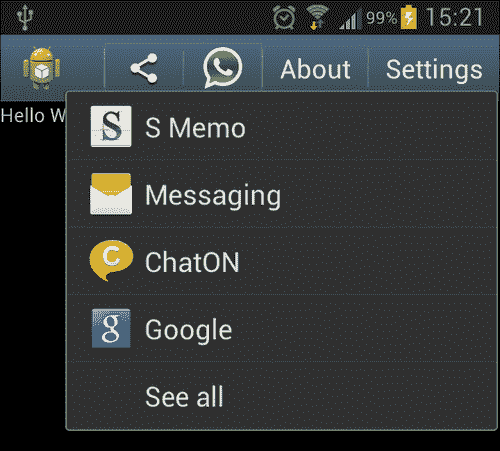
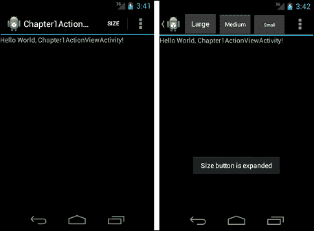

# 第一章。面向所有人的动作栏

**动作栏** API 最早是随安卓 3.0 推出的。有了安卓冰淇淋三明治，动作栏支持小屏幕尺寸。本章介绍如何使用和配置操作栏。

本章涵盖的主题如下:

*   动作栏类型
*   添加操作栏
*   添加操作提供程序和共享操作提供程序
*   添加操作视图
*   使用操作栏进行导航

# 动作栏

动作栏是位于用户设备屏幕顶部的用户界面元素。它向用户提供操作和导航功能。自从 API Level 11 (Android 3.0 蜂巢)发布以来，以及冰淇淋三明治发布后，动作栏就已经可用了，它也支持小屏幕设备。下面的屏幕截图显示了一个带有选项卡的示例操作栏:


从前面的截图中可以看到，在栏的左侧有一个应用程序徽标和标题，然后是用于导航的选项卡。最后，动作按钮被放置在标签之后。不适合屏幕的操作按钮显示为溢出菜单，在栏的右侧有三个点。在上一个截图中，动作栏显示在大屏幕设备上。但是，在小屏幕设备中，操作栏显示为一堆栏，如下图所示:


从前面的截图可以看出，没有足够的空间显示所有的动作栏项目，动作栏在屏幕顶部显示为两栏。

另一种类型的动作栏是**分割**动作栏。在这种类型的操作栏中，操作按钮显示在屏幕底部的窄屏幕栏中，如下图所示:


## 添加动作栏

冰淇淋三明治之后，安卓不需要菜单按钮就能到达选项菜单。最佳做法是使用操作栏代替菜单按钮。从选项菜单迁移到操作栏非常容易。现在我们将创建一个菜单，然后将该菜单迁移到操作栏。

首先，创建一个安卓项目，然后添加一个包含`Settings`和`About`作为菜单项的菜单。生成的菜单 XML 文件应该类似于下面的代码块:

### 类型

**下载示例代码**

您可以从您在[http://www.PacktPub.com](http://www.PacktPub.com)的账户中下载您购买的所有 Packt 书籍的示例代码文件。如果您在其他地方购买了这本书，您可以访问[http://www.PacktPub.com/support](http://www.PacktPub.com/support)并注册，以便将文件直接通过电子邮件发送给您。

```java
<?xml version="1.0" encoding="utf-8"?>
<menu xmlns:android="http://schemas.android.com/apk/res/android" >

    <item android:id="@+id/settings" android:title="Settings"></item>

    <item android:id="@+id/about" android:title="About"></item>

</menu>
```

此示例的布局 XML 是一个带有`TextView`组件的 `LinearLayout`布局，如以下代码块所示:

```java
<?xml version="1.0" encoding="utf-8"?>
<LinearLayout xmlns:android="http://schemas.android.com/apk/res/android"
    android:layout_width="fill_parent"
    android:layout_height="fill_parent"
    android:orientation="vertical" >

    <TextView
        android:layout_width="fill_parent"
        android:layout_height="wrap_content"
        android:text="@string/hello" />

</LinearLayout>
```

执行`onCreateOptionsMenu`和 `onOptionsItemSelected`方法，如下代码块所示，以显示菜单项:

```java
package com.chapter1;

import android.app.Activity;
import android.os.Bundle;
import android.view.Menu;
import android.view.MenuInflater;
import android.view.MenuItem;
import android.widget.Toast;

public class Chapter1Activity extends Activity {

    @Override
    public void onCreate(Bundle savedInstanceState) {
        super.onCreate(savedInstanceState);
        setContentView(R.layout.main);
    }

    @Override
    public boolean onCreateOptionsMenu(Menu menu) {
            //Inflate the menu.xml of the android project
 //in order to create menu
    MenuInflater inflater = getMenuInflater();
    inflater.inflate(R.menu.menu, menu);
    return true;
    }

    @Override
  public boolean onOptionsItemSelected(MenuItem item) {
    // Handle item selection
 //According to selection, show the Toast message
 //of the selected button
    switch (item.getItemId()) {

    case R.id.settings:
      Toast.makeText(this, "Settings options menu button is pressed", Toast.LENGTH_LONG).show();
      return true;
    case R.id.about:
      Toast.makeText(this, "About options menu button is pressed", Toast.LENGTH_LONG).show();
      return true;
      default:
      return super.onOptionsItemSelected(item);
    }
  }
}
```

为了显示动作栏，安卓应用程序应该在`AndroidManifest.xml`文件中以至少 11 级应用编程接口为目标，如以下代码块中的所示:

```java
<?xml version="1.0" encoding="utf-8"?>
<!—set targetSDKversion to 11 because Action Bar is
 available since API Level 11-->
<manifest xmlns:android="http://schemas.android.com/apk/res/android"
    package="com.chapter1"
    android:versionCode="1"
    android:versionName="1.0" >

    < uses-sdk android:minSdkVersion="5" 
 android:targetSdkVersion="11"  />

    <application
        android:icon="@drawable/ic_launcher"
        android:label="@string/app_name" >
        <activity
            android:name=".Chapter1Activity"
            android:label="@string/app_name" >
            <intent-filter>
                <action android:name="android.intent.action.MAIN" />

                <category android:name="android.intent.category.LAUNCHER" />
            </intent-filter>
        </activity>
    </application>

</manifest>
```

通过这种配置，当应用程序在安卓 3.0 或更高版本的设备上运行时，将显示操作栏。

当我们在带有 API Level 15 的仿真器上运行这个应用程序时，我们将在操作栏的右侧看到溢出菜单，当按下溢出菜单时，将显示选项菜单按钮。为了在动作栏上显示选项菜单按钮(不是溢出菜单)，只需在菜单 XML 文件的`item`标签中添加`android:showAsAction="ifRoom|withText"`。生成的菜单 XML 文件应该类似于下面的代码块:

```java
<?xml version="1.0" encoding="utf-8"?>
<menu xmlns:android="http://schemas.android.com/apk/res/android" >

    <item android:id="@+id/settings" android:title="Settings" android:showAsAction="ifRoom|withText"></item>

    <item android:id="@+id/about" android:title="About" android:showAsAction="ifRoom|withText"></item>

</menu>
```

如果没有足够的空间(`ifRoom`)来显示选项菜单按钮，这些按钮将显示为溢出菜单。为了显示仅带有图标的选项菜单按钮(如果提供了图标)，应移除`withText`。当您运行应用程序时，它看起来像下面的截图:


在某些情况下，您可能不想显示动作栏。为了移除动作栏，将`android:theme="@android:style/Theme.Holo.NoActionBar"`添加到`AndroidManifest.xml`文件中的`activity`标签。生成的`AndroidManifest.xml`应该类似于下面的代码块:

```java
<?xml version="1.0" encoding="utf-8"?>
<manifest xmlns:android="http://schemas.android.com/apk/res/android"
    package="com.chapter1"
    android:versionCode="1"
    android:versionName="1.0" >

    <uses-sdk android:minSdkVersion="5" 
              android:targetSdkVersion="11"  />

    <application
        android:icon="@drawable/ic_launcher"
        android:label="@string/app_name" >
        <activity
            android:name=".Chapter1Activity"
            android:label="@string/app_name" 
            android:theme="@android:style/Theme.Holo.NoActionBar" >
            <intent-filter>
                <action android:name="android.intent.action.MAIN" />

                <category android:name="android.intent.category.LAUNCHER" />
            </intent-filter>
        </activity>
    </application>

</manifest>
```

为了将动作栏显示为一个*分割*动作栏，在`AndroidManifest.xml`中的`activity`标签中添加`android:uiOptions="splitActionBarWhenNarrow"` 应用程序。生成的`AndroidManifest.xml`应该类似于下面的代码块:

```java
<?xml version="1.0" encoding="utf-8"?>
<manifest xmlns:android="http://schemas.android.com/apk/res/android"
    package="com.chapter1"
    android:versionCode="1"
    android:versionName="1.0" >

    <uses-sdk android:minSdkVersion="5"   
        android:targetSdkVersion="11"  />

    <application
        android:icon="@drawable/ic_launcher"
        android:label="@string/app_name" 
 android:uiOptions="splitActionBarWhenNarrow">
        <activity
            android:name=".Chapter1Activity"
            android:label="@string/app_name" 
            >
            <intent-filter>
                <action android:name="android.intent.action.MAIN" />

                <category android:name="android.intent.category.LAUNCHER" />
            </intent-filter>
        </activity>
    </application>

</manifest>
```

当您在模拟器上运行此应用程序时，屏幕将如下图所示:


# 添加操作提供程序

为了使用自定义视图而不是操作栏中的简单按钮，`ActionProvider`类可能是解决方案。**行动提供者**自 14 级空气污染指数以来一直可用。ActionProvider 可以在操作栏中生成自定义视图，可以生成子菜单，还可以处理它生成的视图的事件。为了创建一个 ActionProvider，我们应该扩展`ActionProvider`类。下面的代码显示了一个扩展`ActionProvider`类的示例类，并显示了一个自定义布局，而不是操作栏中的一个简单按钮:

```java
import android.content.Context;
import android.view.ActionProvider;
import android.view.LayoutInflater;
import android.view.View;
import android.widget.ImageButton;
import android.widget.Toast;

public class Chapter1ActionProvider extends ActionProvider {

  Context mContext;

  public Chapter1ActionProvider(Context context) {
    super(context);
    mContext = context;
  }

  @Override
  public View onCreateActionView() {
        //This method is the place where we generate a custom layout for the Action Bar menu item
     LayoutInflater layoutInflater = LayoutInflater.from(mContext);
         View view = layoutInflater.inflate(R.layout.action_provider, null);
         ImageButton button = (ImageButton) view.findViewById(R.id.button);

         button.setOnClickListener(new View.OnClickListener() {
  @Override
  public void onClick(View v) {
          Toast.makeText(mContext, "Action Provider click", Toast.LENGTH_LONG).show();
             }
         });
    return view;
  }

  @Override
  public boolean onPerformDefaultAction() {
          //This is the method which is called when the Action Bar menu item is in overflow menu and clicked from there
          Toast.makeText(mContext, "Action Provider click", Toast.LENGTH_LONG).show();
    return true;
  }
}
```

我们必须添加一个构造函数并覆盖方法。在构造函数中，我们将`Context`赋给一个变量，因为我们将在进一步的实现中需要它。 `onCreateActionView()`方法是我们为动作栏菜单项生成自定义布局的地方。 `onPerformDefaultAction()`是当动作栏菜单项在溢出菜单中并从那里被点击时调用的方法。如果 ActionProvider 提供子菜单，则永远不会调用此方法。在 `onCreateActionView()`方法中使用的自定义布局的布局 XML 显示在以下代码块中:

```java
<?xml version="1.0" encoding="utf-8"?>
<LinearLayout xmlns:android="http://schemas.android.com/apk/res/android"
    android:layout_width="wrap_content"
    android:layout_height="match_parent"
    android:layout_gravity="center"
    android:focusable="true"
    android:addStatesFromChildren="true"
    android:background="?android:attr/actionBarItemBackground"
    style="?android:attr/actionButtonStyle">

    <ImageButton android:id="@+id/button"
        android:background="@drawable/ic_launcher"
        android:layout_width="32dip"
        android:layout_height="32dip"
        android:layout_gravity="center"
        android:scaleType="fitCenter"
        android:adjustViewBounds="true" />
    <TextView
        android:id="@+id/textView"
        android:layout_width="wrap_content"
        android:layout_height="wrap_content"
        android:text="Some Text"
        android:textAppearance="?android:attr/textAppearanceLarge" />

</LinearLayout>
```

正如您在 XML 文件中看到的，我们在`LinearLayout`布局中添加了一个 `ImageButton`组件和一个`TextView`组件。`ImageButton`的 `onClickListener()`事件在`Chapter1ActionProvider`类的`onCreateActionView()`方法中实现。在这种情况下，会显示一条`Toast`信息。

显示动作栏的`Activity`类显示为以下代码块:

```java
public class Chapter1ActionProviderActivity extends Activity{

  @Override
  protected void onCreate(Bundle savedInstanceState) {
    // TODO Auto-generated method stub
    super.onCreate(savedInstanceState);
    setContentView(R.layout.main);
  }

  @Override
  public boolean onCreateOptionsMenu(Menu menu) {
    MenuInflater inflater = getMenuInflater();
    inflater.inflate(R.menu.menu, menu);
    return true;
  }

   @Override
    public boolean onOptionsItemSelected(MenuItem item) {
    // Handle item selection
    switch (item.getItemId()) {

    case R.id.about:
        Toast.makeText(this, "About options menu button is pressed", Toast.LENGTH_LONG).show();
        return true;
      default:
        return super.onOptionsItemSelected(item);
      }
    }
}
```

为了显示动作栏菜单项的自定义布局，我们必须在`menu` XML 文件中分配一个`ActionProvider`类。我们将在早期代码中实现的`Chapter1ActionProvider`指定为`ActionProvider`。我们示例中的菜单 XML 文件如下:

```java
<?xml version="1.0" encoding="utf-8"?>
<menu xmlns:android="http://schemas.android.com/apk/res/android" >

    <item android:id="@+id/settings" android:title="Settings" android:showAsAction="ifRoom|withText"

 android:actionProviderClass="com.chapter1.Chapter1ActionProvider"></item>

    <item android:id="@+id/about" android:title="About" android:showAsAction="ifRoom|withText"></item>

</menu>
```

正如您在`menu` XML 文件中看到的，我们为`settings`菜单项提供了一个`ActionProvider`类。最后一件重要的事情是在`AndroidManifest.xml`文件中将最低 SDK 版本设置为 API Level 14，因为`ActionProvider`是 API Level 14 中发布的新功能。 `AndroidManifest.xml`文件应该看起来像下面的代码块:

```java
<?xml version="1.0" encoding="utf-8"?>
<manifest xmlns:android="http://schemas.android.com/apk/res/android"
    package="com.chapter1"
    android:versionCode="1"
    android:versionName="1.0" >
<!—set minSDKversion to 11 because ActionProvider is
 available since API Level 11-->

    <uses-sdk android:minSdkVersion="14" 
        android:targetSdkVersion="14"  />

    <application
        android:icon="@drawable/ic_launcher"
        android:label="@string/app_name" >
        <activity
            android:name=".Chapter1ActionProviderActivity"
            android:label="@string/app_name" 
            >
            <intent-filter>
                <action android:name="android.intent.action.MAIN" />

                <category android:name="android.intent.category.LAUNCHER" />
            </intent-filter>
        </activity>
    </application>

</manifest>
```

当您在模拟器中运行此应用程序时，带有图像按钮和文本视图的用户界面组件将显示在操作栏中。如果您按下图像按钮，将显示祝酒信息。屏幕将如下所示:


## 向动作提供者添加子菜单

可以使用 ActionProvider 显示子菜单。为了添加子菜单，我们应该覆盖`Chapter1ActionProvider`类中的`onPrepareSubMenu(SubMenu subMenu)`和 `hasSubMenu()`方法。`Chapter1ActionProvider`类的最终代码应该如下代码块所示:

```java
package com.chapter1;

import android.app.Activity;
import android.content.Context;
import android.view.ActionProvider;
import android.view.LayoutInflater;
import android.view.MenuInflater;
import android.view.MenuItem;
import android.view.MenuItem.OnMenuItemClickListener;
import android.view.SubMenu;
import android.view.View;
import android.widget.ImageButton;
import android.widget.Toast;

public class Chapter1ActionProvider extends ActionProvider implements 
OnMenuItemClickListener {

  Context mContext;

  public Chapter1ActionProvider(Context context) {
    super(context);
    mContext = context;
  }

  @Override
  public View onCreateActionView() {
         return null;
  }

  @Override
  public boolean onPerformDefaultAction() {

    Toast.makeText(mContext, "Action Provider click", Toast.LENGTH_LONG).show();
    return true;
  }

  @Override
  public void onPrepareSubMenu(SubMenu subMenu) {
 //In order to add submenus, we should override this method
 // we dynamically created submenus

    subMenu.clear();
    subMenu.add("SubItem1").setOnMenuItemClickListener(this);
    subMenu.add("SubItem2").setOnMenuItemClickListener(this);
  }

  @Override
  public boolean onMenuItemClick(MenuItem item) {

    Toast.makeText(mContext, "Sub Item click", Toast.LENGTH_LONG).show();
    return true;
  }

  @Override
  public boolean hasSubMenu() {
 // we implemented it as returning true because we have menu
    return true;
  }

}
```

在`onPrepareSubMenu(SubMenu subMenu)`方法中， 我们动态创建子菜单并设置它们的 `onMenuItemClickListener`事件。如果 `hasSubMenu()`方法返回真，则调用 `onPrepareSubMenu(SubMenu subMenu)`方法，因此我们将其实现为返回真。

也可以从`menu` XML 文件创建子菜单。如果您想从一个`menu` XML 文件创建子菜单，`onPrepareSubMenu(SubMenu subMenu)`应该看起来像下面的代码块:

```java
  @Override
  public void onPrepareSubMenu(SubMenu subMenu) {

    MenuInflater inflater = ((Activity)mContext).getMenuInflater();
    inflater.inflate(R.menu.menu2, subMenu);
  }
```

这段代码展示了我们如何膨胀一个 XML 文件来使用`menu` XML 文件`menu2`创建子菜单。

## ShareActionProvider

**共享行动提供商** 提供了一致的共享方式。它在动作栏上放置一个带有共享图标的动作按钮。当您单击该按钮时，它会列出可供共享的应用程序。您只需要在`menu`项中声明`ShareActionProvider`，如下代码块所示:

```java
<?xml version="1.0" encoding="utf-8"?>
<menu xmlns:android="http://schemas.android.com/apk/res/android" >

    <item android:id="@+id/share" android:title="Share" android:showAsAction="ifRoom"
    android:actionProviderClass="android.widget.ShareActionProvider"></item>
    <item android:id="@+id/about" android:title="About" android:showAsAction="ifRoom"></item>
    <item android:id="@+id/settings" android:title="Settings" android:showAsAction="ifRoom"></item>

</menu>
```

使用`ShareActionProvider`的`Activity`类应该看起来像下面的代码块:

```java
package com.chapter1;

import android.app.Activity;
import android.content.Intent;
import android.os.Bundle;
import android.view.Menu;
import android.view.MenuInflater;
import android.view.MenuItem;
import android.widget.ShareActionProvider;

public class Chapter1ShareActionProviderActivity extends Activity {

    @Override
    public void onCreate(Bundle savedInstanceState) {
        super.onCreate(savedInstanceState);
        setContentView(R.layout.main);
    }

    @Override
    public boolean onCreateOptionsMenu(Menu menu) {

      ShareActionProvider myShareActionProvider;
    MenuInflater inflater = getMenuInflater();
    inflater.inflate(R.menu.menu, menu);
    MenuItem item = menu.findItem(R.id.share);
    myShareActionProvider = (ShareActionProvider)item.getActionProvider();
    myShareActionProvider.setShareHistoryFileName(ShareActionProvider.DEFAULT_SHARE_HISTORY_FILE_NAME);
 myShareActionProvider.setShareIntent(getShareIntent());

    return true;
    }

    private Intent getShareIntent() {
      Intent shareIntent = new Intent(Intent.ACTION_SEND);
      shareIntent.setType("text/plain");
      shareIntent.putExtra(Intent.EXTRA_TEXT, "www.somesite.com");
      return shareIntent;
      }

}
```

正如你在代码中看到的，我们在`onCreateOptionsMenu(Menu menu)`方法中得到中`menu`项的 `ShareActionProvider`属性。然后我们定义与`ShareActionProvider`的`setShareIntent`方法共享的意图。`getShareIntent()`方法创建用于共享文本的**意图**。我们使用这种方法来定义`ShareActionProvider`实例的意图。

ShareActionProvider 将用于共享的应用程序的历史记录保存在文件中。ShareActionProvider 使用的默认文件是`ShareActionProvider.DEFAULT_SHARE_HISTORY_FILE_NAME`。可以使用 `setShareHistoryFileName`方法更改该文件。您只需要传递一个带有。此方法的 xml 扩展。ShareActionProvider 使用此文件来查找最常用的共享应用程序。然后，它将共享操作按钮附近最常用的应用程序显示为默认共享目标。

带有共享操作提供程序的应用程序屏幕如下所示:



由于 ShareActionProvider 是在 API Level 14 中引入的，因此我们必须在`AndroidManifest.xml`文件中将最小 SDK 设置为 14，如以下代码块所示:

```java
<?xml version="1.0" encoding="utf-8"?>
<manifest xmlns:android="http://schemas.android.com/apk/res/android"
    package="com.chapter1"
    android:versionCode="1"
    android:versionName="1.0" >
<!—set minSdkVersion to 14 because ShareActionProvider is available
 since API Level 14-->

    <uses-sdk android:minSdkVersion="14" />

    <application
        android:icon="@drawable/ic_launcher"
        android:label="@string/app_name" >
        <activity
            android:name=".Chapter1ShareActionProviderActivity"
            android:label="@string/app_name" >
            <intent-filter>
                <action android:name="android.intent.action.MAIN" />

                <category android:name="android.intent.category.LAUNCHER" />
            </intent-filter>
        </activity>
    </application>

</manifest>

```

# 添加动作视图

**动作视图**是出现在动作栏中的用户界面组件，而不是动作按钮。此视图是可折叠的，也就是说，如果它被配置为可折叠的，这意味着当按下操作按钮时它会展开。如果未将其配置为可折叠，则默认情况下会将其展开查看。在下面的示例中，我们添加了一个操作视图，并展示了它的事件以及如何处理这些事件。

首先，为动作视图添加一个布局，该布局有三个按钮，文本为`Large`、`Medium`和`Small`，如下代码块所示:

```java
<?xml version="1.0" encoding="utf-8"?>
<LinearLayout xmlns:android="http://schemas.android.com/apk/res/android"
    android:layout_width="match_parent"
    android:layout_height="match_parent"
    android:orientation="horizontal" >
    <Button
        android:id="@+id/buttonLarge"
        android:layout_width="match_parent"
        android:layout_height="wrap_content"
        android:layout_weight="1"
        android:text="Large"
        android:textSize="15dp" />

    <Button
        android:id="@+id/buttonMedium"
        android:layout_width="match_parent"
        android:layout_height="wrap_content"
        android:layout_weight="1"
        android:text="Medium"
        android:textSize="12dp" />

    <Button
        android:id="@+id/buttonSmall"
        android:layout_width="match_parent"
        android:layout_height="wrap_content"
        android:layout_weight="1"
        android:text="Small"
        android:textSize="9dp" />

</LinearLayout>
```

然后我们需要将这个动作视图绑定到一个动作栏`menu`项。`menu`的 XML 代码如下代码块所示:

```java
<?xml version="1.0" encoding="utf-8"?>
<menu xmlns:android="http://schemas.android.com/apk/res/android" >

 <item android:id="@+id/size" android:title="Size" android:showAsAction="ifRoom|collapseActionView"
 android:actionLayout="@layout/actionview"></item>

    <item android:id="@+id/about" android:title="About" android:showAsAction="ifRoom"></item>
    <item android:id="@+id/settings" android:title="Settings" android:showAsAction="ifRoom|withText"></item>

</menu>
```

正如您在`menu` XML 代码中看到的，我们通过设置 `actionLayout`属性将动作视图绑定到`size`菜单项。我们还将`showAsAction`属性设置为`collapseActionView`。这样，操作视图是可折叠的，当按下操作按钮项时，它会展开。这个选项帮助我们节省动作栏的空间。如果该属性未设置为`collapseActionView`，默认情况下操作视图显示为展开状态。

处理动作视图事件的 `Activity`类显示在下面的代码块中:

```java
package com.chapter1;

import android.app.Activity;
import android.os.Bundle;
import android.view.Menu;
import android.view.MenuInflater;
import android.view.MenuItem;
import android.view.MenuItem.OnActionExpandListener;
import android.view.View;
import android.view.View.OnClickListener;
import android.widget.Button;
import android.widget.Toast;

public class Chapter1ActionViewActivity extends Activity implements 
OnClickListener {
  Button buttonLarge;
  Button buttonMedium;
  Button buttonSmall;
  Menu menu;

    /** Called when the activity is first created. */
    @Override
    public void onCreate(Bundle savedInstanceState) {
        super.onCreate(savedInstanceState);
        setContentView(R.layout.main);
    }

    @Override
    public boolean onCreateOptionsMenu(Menu menu) {
      //you can set on click listeners of the items in Action View in this method

      this.menu = menu;
    MenuInflater inflater = getMenuInflater();
    inflater.inflate(R.menu.menu, menu);
    MenuItem item = menu.findItem(R.id.size);
    item.setOnActionExpandListener(new Chapter1ActionListener(this));
    buttonLarge = (Button)item.getActionView().findViewById(R.id.buttonLarge);
    buttonLarge.setOnClickListener(this);

    buttonMedium = (Button)item.getActionView().findViewById(R.id.buttonMedium);
    buttonMedium.setOnClickListener(this);

    buttonSmall = (Button)item.getActionView().findViewById(R.id.buttonSmall);
    buttonSmall.setOnClickListener(this);

    return true;
    }

    @Override
  public boolean onOptionsItemSelected(MenuItem item) {
    // Handle item selection
    switch (item.getItemId()) {

    case R.id.size:
      Toast.makeText(this, "Size options menu button is pressed", Toast.LENGTH_LONG).show();
      return true;
    case R.id.about:
      Toast.makeText(this, "About options menu button is pressed", Toast.LENGTH_LONG).show();
      return true;
      case R.id.settings:
      Toast.makeText(this, "Settings options menu button is pressed", Toast.LENGTH_LONG).show();
      return true;
    default:
      return super.onOptionsItemSelected(item);
    }
  }

  @Override
  public void onClick(View v) {

    if(v == buttonLarge )
    {
      Toast.makeText(this, "Large button is pressed", Toast.LENGTH_LONG).show();
 //Collapse the action view
      menu.findItem(R.id.size).collapseActionView();
    }
    else if(v == buttonMedium )
    {
      Toast.makeText(this, "Medium button is pressed", Toast.LENGTH_LONG).show();
                    //Collapse the action view
      menu.findItem(R.id.size).collapseActionView();
    }
    else if(v == buttonSmall)
    {
      Toast.makeText(this, "Small button is pressed", Toast.LENGTH_LONG).show();
                    //Collapse the action view
      menu.findItem(R.id.size).collapseActionView();
    }

  }

      // This class returns a callback when Action View is expanded or collapsed
  public static class Chapter1ActionListener implements OnActionExpandListener
  {
    Activity activity;

    public Chapter1ActionListener(Activity activity)
    {
      this.activity = activity;
    }

    @Override
    public boolean onMenuItemActionCollapse(MenuItem item) {

      Toast.makeText(activity, item.getTitle()+" button is collapsed", Toast.LENGTH_LONG).show();
      return true;
  }

   @Override
    public boolean onMenuItemActionExpand(MenuItem item) {
      Toast.makeText(activity, item.getTitle()+" button is expanded", Toast.LENGTH_LONG).show();
      return true;
    }

  }
}
```

正如您在`Chapter1ActionViewActivity`中所看到的，您可以在的`onCreateOptionsMenu(Menu menu)`方法中设置动作视图中项目的事件监听器。我们在`onCreateOptionsMenu(Menu menu)` 方法中设置动作视图中按钮的`onClickListener`事件。

可以使用`expandActionView()`和`col` `lapseActionView()`方法以编程方式展开和折叠动作视图。正如你在`Chapter1ActionViewActivity`方法的`onClick(View v)`方法中看到的，我们用 `collapseActionView()`方法手动折叠了动作视图。

当动作视图用`OnActionExpandListener`类展开或折叠时，您可以执行一个动作。正如您在代码中看到的，我们定义了实现`OnActionExpandListener`的`Chapter1ActionListener`类。我们覆盖这个类的`onMenuItemActionCollapse(MenuItem item)`和`onMenuItemActionExpand(MenuItem item)`方法来显示`Toast`消息。我们将`Activity`作为参数传递给`Chapter1ActionListener`的构造器，因为我们在显示`Toast`消息时需要`Activity`。我们必须向`OnActionExpandListener`类注册`setOnActionExpandListener()`方法，以便处理扩展和折叠事件。从代码中可以看到，我们在`onCreateOptionsMenu(Menu menu)`方法中注册了这个事件。当操作视图折叠和展开时，我们会显示一条`Toast`消息。

由于动作视图是在 API Level 14 中引入的，我们必须在`AndroidManifest.xml`文件中将最小 SDK 属性设置为 14 或更大，如以下代码块所示:

```java
<?xml version="1.0" encoding="utf-8"?>
<manifest xmlns:android="http://schemas.android.com/apk/res/android"
    package="com.chapter1"
    android:versionCode="1"
    android:versionName="1.0" >
<!—set minSdkVersion to 14 because Action View is
 available since API Level 14-->

    <uses-sdk android:minSdkVersion="14" />

    <application
        android:icon="@drawable/ic_launcher"
        android:label="@string/app_name" >
        <activity
            android:name=".Chapter1ActionViewActivity"
            android:label="@string/app_name" >
            <intent-filter>
                <action android:name="android.intent.action.MAIN" />

                <category android:name="android.intent.category.LAUNCHER" />
            </intent-filter>
        </activity>
    </application>

</manifest>
```

当您在模拟器上运行此应用程序时，它看起来像下面的截图:



# 使用动作栏进行导航

标签导航也可以用`TabWidget`类来实现。但是，动作栏有一些优点。动作栏自动根据设备屏幕大小自行调整。例如，如果没有足够的空间放置制表符，它将以堆叠条形图的方式显示制表符。因此，最好使用操作栏来实现选项卡式导航。

现在，我们将了解如何使用操作栏进行选项卡式导航。首先，创建一个安卓项目，添加两个片段:一个显示`Fragment A`，另一个显示`Fragment B`。片段的布局 XML 应该类似于下面的代码块:

```java
<?xml version="1.0" encoding="utf-8"?>
<LinearLayout xmlns:android="http://schemas.android.com/apk/res/android"
    android:layout_width="match_parent"
    android:layout_height="match_parent"
    android:orientation="vertical" >

    <TextView
        android:id="@+id/textView1"
        android:layout_width="wrap_content"
        android:layout_height="wrap_content"
        android:text="Fragment A"
        android:textAppearance="?android:attr/textAppearanceLarge" android:layout_gravity="center_horizontal"/>

</LinearLayout>
<?xml version="1.0" encoding="utf-8"?>
<LinearLayout xmlns:android="http://schemas.android.com/apk/res/android"
    android:layout_width="match_parent"
    android:layout_height="match_parent"
    android:orientation="vertical" >

    <TextView
        android:id="@+id/textView1"
        android:layout_width="wrap_content"
        android:layout_height="wrap_content"
        android:text="Fragment B"
        android:textAppearance="?android:attr/textAppearanceLarge" 
        android:layout_gravity="center_horizontal"/>

</LinearLayout>
```

为两个片段扩展`Fragment`类的类应该看起来像下面的代码块:

```java
package com.chapter1;

import android.app.Fragment;
import android.os.Bundle;
import android.view.LayoutInflater;
import android.view.View;
import android.view.ViewGroup;

public class FragmentA extends Fragment {

  @Override
  public View onCreateView(LayoutInflater inflater, ViewGroup container,
      Bundle savedInstanceState) {
      View view = inflater.inflate(R.layout.fragment_a, container,false);
    return view;
  }
}
package com.chapter1;

import android.app.Fragment;
import android.os.Bundle;
import android.view.LayoutInflater;
import android.view.View;
import android.view.ViewGroup;

public class FragmentB extends Fragment {

  @Override
  public View onCreateView(LayoutInflater inflater, ViewGroup container,
      Bundle savedInstanceState) {
    View view = inflater.inflate(R.layout.fragment_b, container, false);
    return view;
  }
}
```

为了使用动作栏进行选项卡式导航，我们应该首先实现`ActionBar.TabListener` 类。实现`TabListener`的类将在`Activity`类中用于添加标签。带有`TabListener`实现的`Activity`类应该类似于下面的代码块:

```java
package com.chapter1;

import android.app.ActionBar;
import android.app.ActionBar.Tab;
import android.app.ActionBar.TabListener;
import android.app.Activity;
import android.app.Fragment;
import android.app.FragmentTransaction;
import android.os.Bundle;

public class Chapter1ActionBarTabActivity extends Activity {

  @Override
  public void onCreate(Bundle savedInstanceState) {
    super.onCreate(savedInstanceState);
    setContentView(R.layout.main);

    ActionBar actionBar = getActionBar();
    actionBar.setNavigationMode(ActionBar.NAVIGATION_MODE_TABS);

    Tab tab = actionBar
        .newTab()
        .setText("First tab")
        .setTabListener(
          new Chapter1TabListener<FragmentA>(this, "fragmentA",FragmentA.class));
    actionBar.addTab(tab);

    tab = actionBar
        .newTab()
        .setText("Second Tab")
        .setTabListener(
            new Chapter1TabListener<FragmentB>(this, "fragmentB",FragmentB.class));
    actionBar.addTab(tab);
  }

  public static class Chapter1TabListener<T extends Fragment> implements
 TabListener {
    private Fragment mFragment;
    private final Activity mActivity;
    private final String mTag;
    private final Class<T> mClass;

    public Chapter1TabListener(Activity activity, String tag, Class<T> clz) {
      mActivity = activity;
      mTag = tag;
      mClass = clz;
    }

    @Override
    public void onTabSelected(Tab tab, FragmentTransaction ft) {
 // we initialize and add the fragment to our Activity if it doesn't exist

      if (mFragment == null) {

        mFragment = Fragment.instantiate(mActivity, mClass.getName());			
        ft.add(android.R.id.content, mFragment, mTag);

        } else {
 // If it exists, we simply attach it
        ft.attach(mFragment);
      }
    }

    @Override
    public void onTabUnselected(Tab tab, FragmentTransaction ft) {
 // in this method we detach the fragment because // it shouldn't be displayed
    if (mFragment != null) {
        ft.detach(mFragment);
        }
    }
    @Override
    public void onTabReselected(Tab tab, FragmentTransaction ft) {
 // This method is called when the tab is reselected
    }
  }
}
```

在`Chapter1TabListener` 类中，有三种方法需要被覆盖:`onTabReselected(Tab tab, FragmentTransaction ft)`、`onTabUnselected(Tab tab, FragmentTransaction ft)`和`onTabSelected(Tab tab, FragmentTransaction ft)`。在`onTabSelected(Tab tab, FragmentTransaction ft)`方法中，如果片段不存在，我们初始化并将其添加到我们的活动中。如果它存在，我们就简单地附加在它上面。当选项卡为 未选中时，调用`onTabUnselected(Tab tab, FragmentTransaction ft)`方法。在这个方法中，我们分离片段，因为它不应该被显示。重新选择标签时，调用`onTabReselected(Tab tab, FragmentTransaction ft)`方法。我们在这个方法中什么也不做。在`Chapter1ActionBarTabActivity`类中，我们创建并设置动作栏。我们活动的布局只有一个`LinearLayout`布局，我们使用片段作为用户界面。首先，我们将动作栏的导航模式设置为`ActionBar.NAVIGATION_MODE_TABS`，因为我们想要选项卡式导航。然后我们创建两个选项卡，设置它们的`TabListener`事件，并将它们添加到`action bar`实例中。当您运行应用程序时，您将看到两个选项卡，名为**第一个选项卡**和**第二个选项卡**。第一个选项卡将显示**片段 A** ，第二个选项卡将显示**片段 B** 。屏幕将如下所示:


重要的是不要忘记将最小 SDK 级别设置为 API Level 11 或更高，因为动作栏是在 API Level 11 中引入的。

# 总结

在本章中，您学习了如何使用操作栏，因为这种方法比使用选项菜单更一致。您还看到了如何使用 ActionProvider 在操作栏中创建自定义布局。您学习了如何使用共享操作提供程序，以及它是如何在您的应用程序中实现共享的有效方法。您学习了如何使用动作视图以及如何使其可折叠。最后，您学习了如何将操作栏用于选项卡式导航。它有使自己适应设备屏幕大小的优点，所以使用动作栏比使用旧的 API 更好。在下一章中，我们将了解一个名为 GridLayout 的安卓布局，我们将看到如何添加和配置它。