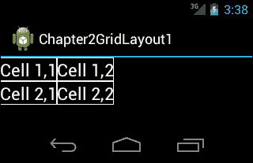
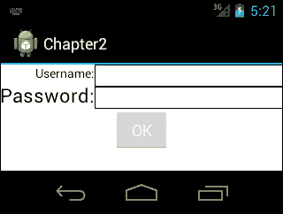
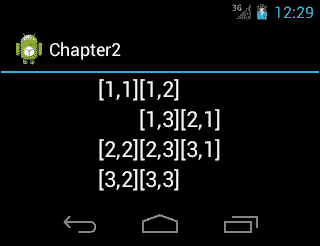
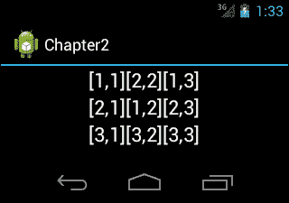

# 第二章。新布局–网格布局

安卓冰淇淋三明治引入了一种新的布局，称为**网格布局**。这个布局是一个优化的布局，可以用来代替**线性布局**和**相对布局**。本章介绍如何使用和配置网格布局。

本章涵盖的主题如下:

*   为什么要使用网格布局
*   添加网格布局
*   配置网格布局

# 网格布局

**网格布局**是将其视图空间分成行、列和单元格的布局。网格布局自动将视图放入其中，但也可以定义列和行索引，将视图放入网格布局。利用单元格的 span 属性，可以使视图跨越多行或多列。以下代码块显示了使用 `GridLayout`布局的布局文件示例:

```java
<?xml version="1.0" encoding="utf-8"?>
<GridLayout xmlns:android="http://schemas.android.com/apk/res/android"
android:id="@+id/GridLayout1"
android:layout_width="match_parent"
android:layout_height="match_parent"
android:columnCount="2"
android:orientation="horizontal" android:rowCount="2">

<TextView
android:id="@+id/textView1"
android:text="Cell 1,1"
android:textAppearance="?android:attr/textAppearanceLarge" />

<TextView
android:id="@+id/textView2"
android:text="Cell 1,2"
android:textAppearance="?android:attr/textAppearanceLarge" />

<TextView
android:id="@+id/textView3"
android:text="Cell 2,1"
android:textAppearance="?android:attr/textAppearanceLarge" />

<TextView
android:id="@+id/textView4"
android:text="Cell 2,2"
android:textAppearance="?android:attr/textAppearanceLarge" />

</GridLayout>
```

当在模拟器中查看这个布局 XML 时，它看起来像下面的截图:



在这个布局 XML 文件中，我们放置了四个 `TextView`组件，文本为`Cell 1,1`、`Cell 1,2`、`Cell 2,1`和`Cell 2,2`。当网格布局`orientation`设置为`horizontal`、 `columnCount`、 `rowCount`属性设置为`2`时，网格布局首先将项目自动放置到第一行，当项目数达到`columnCount`时；它开始将项目放在第二行。

在这个布局中你首先会注意到的是`TextView`组件没有`layout_width` 和 `layout_height`属性。不使用这些属性是因为`GridLayout`使用`layout_gravity`属性来确定细胞的大小，而不是`layout_width`和`layout_height`属性。通常`gravity`属性用于对齐视图的内容，但在`GridLayout`中，它用于不同的目的。可用的重力常数包括`left`、`top`、`right`、`bottom`、`center_horizontal`、`center_vertical`、`center`、`fill_horizontal`、`fill_vertical`和`fill`。

在`GridLayout`中，可以通过指定列和行的索引来明确定义视图将被放置的单元格。如果未指定索引，`GridLayout`将根据`GridLayout`布局的方向自动将视图放置到第一个可用位置。

## 为什么要使用网格布局

**线性布局**和**相对布局**是安卓用户界面设计中最常用的布局。对于简单的用户界面，它们是一个很好的选择，但是当用户界面变得复杂时，嵌套线性布局的使用往往会增加。嵌套布局(任何类型)都会影响性能，而且深度超过 10 的嵌套线性布局可能会导致应用程序崩溃。因此，您应该避免使用太多嵌套的线性布局块，或者应该使用相对布局来减少嵌套的线性布局块。这些复杂用户界面布局的另一个缺点是可读性困难。很难维护嵌套的 LinearLayout 或 RelativeLayout 具有许多视图的布局。在这些情况下使用**网格布局**是一个不错的选择。使用网格布局可以避免过多的嵌套线性布局。此外，维护网格布局要容易得多。许多使用线性布局、相对布局或**表格布局**的用户界面可以转换为网格布局，网格布局将提供性能增强。与其他布局相比，网格布局的一个主要优势是，您可以控制视图在水平轴和垂直轴上的对齐。

## 添加网格布局

在本节中，我们将把一个安卓应用程序从T2 线性布局迁移到**网格布局**。带有`LinearLayout`的应用程序的布局的 XML 代码显示在下面的代码块中:

```java
<?xml version="1.0" encoding="utf-8"?>
<LinearLayout xmlns:android="http://schemas.android.com/apk/res/android"
android:layout_width="match_parent"
android:layout_height="match_parent"
android:orientation="vertical" android:background="#ffffff">
<!-- we used 3 nested LinearLayout-->
<LinearLayout
android:layout_width="match_parent"
android:layout_height="wrap_content"
android:orientation="horizontal" >
<!—LinearLayout that contains labels-->
<LinearLayout
android:layout_width="wrap_content"
android:layout_height="wrap_content"
android:orientation="vertical" >

<TextView
android:id="@+id/textView1"
android:layout_width="wrap_content"
android:layout_height="wrap_content"
android:text="Username:"
android:textAppearance="?android:attr/textAppearanceSmall"
android:textColor="#000000" android:layout_gravity="right"/>

<TextView
android:id="@+id/textView2"
android:layout_width="wrap_content"
android:layout_height="wrap_content"
android:text="Password:"
android:textAppearance="?android:attr/textAppearanceLarge"
android:textColor="#000000" />
</LinearLayout>
<!—Linearlayout that contains fields-->
<LinearLayout
android:layout_width="match_parent"
android:layout_height="wrap_content"
android:orientation="vertical" >

<EditText
android:id="@+id/editText1"
android:layout_width="match_parent"
android:layout_height="wrap_content"
android:background="@drawable/borders_bottom_right"
android:ems="10" >

</EditText>

<EditText
android:id="@+id/editText2"
android:layout_width="match_parent"
android:layout_height="wrap_content"
android:layout_weight="1"
android:background="@drawable/borders_bottom_right"
android:ems="10" />
</LinearLayout>
</LinearLayout>

<Button
android:id="@+id/button1"
android:layout_width="wrap_content"
android:layout_height="wrap_content"
android:text="OK" android:layout_gravity="center_horizontal"/>

</LinearLayout>
```

在之前的布局文件中使用的可绘制 `borders_bottom_right`背景显示在以下代码块中:

```java
<?xml version="1.0" encoding="utf-8"?>
  <layer-list xmlns:android="http://schemas.android.com/apk/res/android" >
  <item>
    <shape android:shape="rectangle">
    <stroke android:width="1dp" android:color="#FFFFFF" />
    <solid android:color="#000000" />
    </shape>
  </item>
  </layer-list>
```

屏幕将如下所示:



在布局 XML 代码中可以看到，为了实现简单的登录屏幕，我们使用了三个嵌套的`LinearLayout`实例。如果这个屏幕是用`GridLayout`设计的，布局的 XML 代码看起来像下面的代码块:

```java
<?xml version="1.0" encoding="utf-8"?>
<GridLayout xmlns:android="http://schemas.android.com/apk/res/android"
  android:layout_width="fill_parent"
  android:layout_height="fill_parent"
  android:background="#ffffff"
  android:columnCount="2"
  android:orientation="horizontal" >

  <TextView
    android:id="@+id/textView1"
    android:layout_gravity="right"
    android:text="Username:" android:textColor="#000000"/>

  <EditText
  android:id="@+id/editText1"
  android:ems="10" android:background="@drawable/borders"/>

  <TextView
    android:id="@+id/textView2"
    android:text="Password:"
    android:textAppearance="?android:attr/textAppearanceLarge" android:textColor="#000000"/>

  <EditText
    android:id="@+id/editText2"
    android:ems="10" android:background="@drawable/borders">

  </EditText>

  <Button
    android:id="@+id/button1"
    android:layout_columnSpan="2"
    android:text="Button" android:layout_gravity="center_horizontal"/>

</GridLayout>
```

我们将 `columnCount`属性设置为`2`，因为我们在一行中有一个`TextView`组件和一个`EditText`组件。之后，我们放置了视图，但没有指定行或列索引。**网格布局**根据`orientation`和`columnCount`自动放置。我们在中将 `layout_columnSpan`属性设置为`2`，以使按钮跨越两列。利用`layout_gravity`属性，我们使按钮出现在行的中心。正如您在布局的 XML 代码中看到的，使用 GridLayout 设计同一个屏幕非常简单和容易。此外，使用 GridLayout 可以更容易地进行对齐，并且这段代码具有更好的可读性。

自 API Level 14 以来，GridLayout 一直可用，因此`AndroidManifest.xml`文件中的最小 SDK 属性应设置为`14`或更大，如下代码行所示:

```java
<uses-sdkandroid:minSdkVersion="14" />
```

## 配置网格布局

首先，我们将编写一个示例`GridLayout` XML 代码，然后我们将使用该代码作为其他示例的基础。示例布局的 XML 代码看起来像下面的代码块:

```java
<?xml version="1.0" encoding="utf-8"?>
<GridLayout xmlns:android="http://schemas.android.com/apk/res/android"
android:layout_width="wrap_content"
android:layout_height="wrap_content"
android:layout_gravity="center_horizontal"
android:columnCount="3"
android:rowCount="3" >

<TextView
android:text="[1,1]" 
android:textAppearance="?android:attr/textAppearanceLarge"/>

<TextView
android:text="[1,2]" 
android:textAppearance="?android:attr/textAppearanceLarge"/>

<TextView
android:text="[1,3]" 
android:textAppearance="?android:attr/textAppearanceLarge"/>

<TextView
android:text="[2,1]" 
android:textAppearance="?android:attr/textAppearanceLarge"/>

<TextView
android:text="[2,2]" 
android:textAppearance="?android:attr/textAppearanceLarge"/>

<TextView
android:text="[2,3]" 
android:textAppearance="?android:attr/textAppearanceLarge"/>

<TextView
android:text="[3,1]" 
android:textAppearance="?android:attr/textAppearanceLarge"/>

<TextView
android:text="[3,2]" 
android:textAppearance="?android:attr/textAppearanceLarge"/>

<TextView
android:text="[3,3]" 
android:textAppearance="?android:attr/textAppearanceLarge"/>

</GridLayout>
```

使用前面的代码块，屏幕将如下所示:


在布局 XML 代码中可以看到，`TextView`组件放置时没有索引，根据`orientation`、`columnCount`和`rowCount`自动定位在`GridLayout`中。现在我们将`[1, 3]`的索引号设置为`[2, 1]`。布局 XML 代码应该如下所示:

```java
<?xml version="1.0" encoding="utf-8"?>
<GridLayout xmlns:android="http://schemas.android.com/apk/res/android"
android:layout_width="wrap_content"
android:layout_height="wrap_content"
android:layout_gravity="center_horizontal"
android:columnCount="3"
android:rowCount="3" >

<TextView
android:text="[1,1]" 
android:textAppearance="?android:attr/textAppearanceLarge"/>

<TextView
android:text="[1,2]" 
android:textAppearance="?android:attr/textAppearanceLarge"/>
<!-- set the row and column index with layout_row and layout_column
properties-->
<TextView
android:text="[1,3]"
android:textAppearance="?android:attr/textAppearanceLarge"
android:layout_row="1" android:layout_column="1"/>

<TextView
android:text="[2,1]" 
android:textAppearance="?android:attr/textAppearanceLarge"/>

<TextView
android:text="[2,2]" 
android:textAppearance="?android:attr/textAppearanceLarge"/>

<TextView
android:text="[2,3]" 
android:textAppearance="?android:attr/textAppearanceLarge"/>

<TextView
android:text="[3,1]" 
android:textAppearance="?android:attr/textAppearanceLarge"/>

<TextView
android:text="[3,2]" 
android:textAppearance="?android:attr/textAppearanceLarge"/>

<TextView
android:text="[3,3]" 
android:textAppearance="?android:attr/textAppearanceLarge"/>

</GridLayout>
```

屏幕应该如下所示:



正如您在布局 XML 代码(突出显示的部分)中看到的，我们使用`layout_row`和`layout_column`属性设置行和列索引。索引从零开始，因此带有文本`[1, 3]`的`TextView`组件位于第二行第二列。这里有趣的部分是带有文字`[2, 1]`的 `TextView`组件放在`[1, 3]`之后。这是因为`[2, 1]`没有索引， **GridLayout** 在`[1, 3]`之后继续定位。也就是说**网格布局**在最后放置的视图之后寻找第一个可用的位置。另一个值得注意的事情是，在移动索引后，行数增加到`4`，尽管我们将行数设置为`3`。 **GridLayout** 在这种情况下不抛出异常。

在下面的示例中，我们将交换`[1, 2]`和`[2, 2]`。布局 XML 代码应该如下所示:

```java
<?xml version="1.0" encoding="utf-8"?>
<GridLayout xmlns:android="http://schemas.android.com/apk/res/android"
android:layout_width="wrap_content"
android:layout_height="wrap_content"
android:layout_gravity="center_horizontal"
android:columnCount="3"
android:rowCount="3" >

<TextView
android:text="[1,1]" 
android:textAppearance="?android:attr/textAppearanceLarge"/>
<!-- set layout_row of [1, 2] to 1-->
<TextView
android:text="[1,2]"
android:textAppearance="?android:attr/textAppearanceLarge"
android:layout_row="1"/>
<!-- set layout_row of [1, 2] to 1-->
<TextView
android:text="[1,3]"
android:textAppearance="?android:attr/textAppearanceLarge"
android:layout_row="0"/>

<TextView
android:text="[2,1]" 
android:textAppearance="?android:attr/textAppearanceLarge"/>
<!-- set the layout_row of [2, 2] to 0 and layout_column to 1-->
<TextView
android:text="[2,2]"
android:textAppearance="?android:attr/textAppearanceLarge"
android:layout_row="0" android:layout_column="1"/>
<!-- set layout_row of [2, 3] to 1 in order to make it appear after [1,2]'s
new position-->
<TextView
android:text="[2,3]"
android:textAppearance="?android:attr/textAppearanceLarge"
android:layout_row="1"/>

<TextView
android:text="[3,1]" 
android:textAppearance="?android:attr/textAppearanceLarge"/>

<TextView
android:text="[3,2]" 
android:textAppearance="?android:attr/textAppearanceLarge"/>

<TextView
android:text="[3,3]" 
android:textAppearance="?android:attr/textAppearanceLarge"/>

</GridLayout>
```

屏幕应该如下图所示:



正如您在布局 XML 代码中看到的，我们首先将`[1, 2]`的`layout_row`设置为`1`。这样，它就会代替`[2, 2]`出现。然后我们必须将`[1, 3]`的`layout_row`设置为`0`、`layout_column`设置为`2`，因为`GridLayout`的光标位置是通过设置`[1, 2]`的索引来改变的。如果我们不改变`[1, 3]`的指数，它将被放在`[1, 2]`指数的新位置之后。之后，为了使`[2, 2]`出现在`[1, 2]`的位置，我们将`[2, 2]`的`layout_row`设置为`0`，将`layout_column`设置为`1`。最后，我们必须将`[2, 3]`的`layout_row`设置为`1`，以使其出现在`[1, 2]`指数的新位置之后。在 **GridLayout** 中配置视图似乎有点复杂，但是如果你在模拟器中尝试一下，你会发现并没有那么难。

在下面的示例代码中，我们将删除`[2, 2]`并使`[1, 2]`跨越两行。布局 XML 代码如下所示:

```java
<?xml version="1.0" encoding="utf-8"?>
<GridLayout xmlns:android="http://schemas.android.com/apk/res/android"
android:layout_width="wrap_content"
android:layout_height="wrap_content"
android:layout_gravity="center_horizontal"
android:columnCount="3"
android:rowCount="3" >

<TextView
android:text="[1,1]" 
android:textAppearance="?android:attr/textAppearanceLarge"/>
<!-- set layout_rowSpan property of [1,2] to 2\. By this way [1,2] will
cover 2 rows.-->
<TextView
android:text="[1,2]"
android:textAppearance="?android:attr/textAppearanceLarge"
android:layout_rowSpan="2" android:layout_gravity="fill"
android:gravity="center"/>

<TextView
android:text="[1,3]" 
android:textAppearance="?android:attr/textAppearanceLarge"/>

<TextView
android:text="[2,1]" 
android:textAppearance="?android:attr/textAppearanceLarge"/>

<TextView
android:text="[2,3]" 
android:textAppearance="?android:attr/textAppearanceLarge"/>

<TextView
android:text="[3,1]" 
android:textAppearance="?android:attr/textAppearanceLarge"/>

<TextView
android:text="[3,2]" 
android:textAppearance="?android:attr/textAppearanceLarge"/>

<TextView
android:text="[3,3]" 
android:textAppearance="?android:attr/textAppearanceLarge"/>

</GridLayout>
```

使用前面的代码块，我们得到如下屏幕:


在布局 XML 代码中可以看到，我们删除了单元格`[2,2]`，将`layout_rowSpan` `property of `[1,2]`设置为`2`。这样的话，`[1,2]`将会覆盖两排。我们将`layout_gravity`属性设置为`fill`，以使其填充两行的空间。然后我们将`gravity`属性设置为`center`，以便使`TextView`组件的内容与其覆盖的空间中心对齐。`

 `# 一个新的视角——空间

**太空**是安卓冰淇淋三明治推出的新观点。用于在视图之间放置空间。在**网格布局**中非常有用。在下面的布局 XML 示例代码中，我们删除了带有文本`[2, 2]`和`[2, 3]`的`TextView`组件，然后放入**空间**来代替它们，如下代码块所示:

```java
<?xml version="1.0" encoding="utf-8"?>
<GridLayout xmlns:android="http://schemas.android.com/apk/res/android"
android:layout_width="wrap_content"
android:layout_height="wrap_content"
android:layout_gravity="center_horizontal"
android:columnCount="3"
android:rowCount="3" >

<TextView
android:text="[1,1]" 
android:textAppearance="?android:attr/textAppearanceLarge"/>

<TextView
android:text="[1,2]" 
android:textAppearance="?android:attr/textAppearanceLarge"/>

<TextView
android:text="[1,3]" 
android:textAppearance="?android:attr/textAppearanceLarge"/>

<TextView
android:text="[2,1]" 
android:textAppearance="?android:attr/textAppearanceLarge"/>
<Space
android:layout_row="1"
android:layout_column="1"
android:layout_columnSpan="2"
android:layout_gravity="fill"/>

<TextView
android:text="[3,1]" 
android:textAppearance="?android:attr/textAppearanceLarge"/>

<TextView
android:text="[3,2]" 
android:textAppearance="?android:attr/textAppearanceLarge"/>

<TextView
android:text="[3,3]" 
android:textAppearance="?android:attr/textAppearanceLarge"/>

</GridLayout>
```

正如您在布局 XML 代码中看到的，我们删除了带有文本`[2,2]`和`[2,3]`的`TextView`组件。我们将`Space`视图放在第`1`行和第`1`列。我们将`layout_columnSpan`设置为`2`，以使其跨越两列。 屏幕将如下所示:


# 总结

**线性布局**和**相对布局**是安卓应用开发中最常见的布局。然而，当设计复杂的用户界面时，您可能需要使用嵌套的线性布局或相对布局。这是代码性能和可读性的一个缺点，因为这些布局增加了视图层次结构，导致视图刷新时不必要的迭代。 **GridLayout** 是安卓冰淇淋三明治中引入的新布局，它克服了这些问题。您可以在不需要嵌套布局的情况下设计用户界面。如果您正在为 API Level 14 及更高版本开发应用程序，最好使用 GridLayout。在下一章中，我们将了解安卓冰淇淋三明治引入的新社交应用编程接口。`