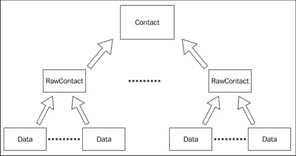
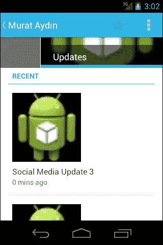
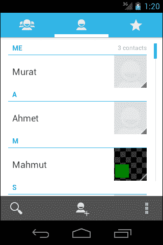

# 三、社交 API

安卓冰淇淋三明治引入了新的社交应用编程接口，该接口使社交网络的集成变得容易。此外，安卓冰淇淋三明治发布后，高分辨率照片可以用作联系照片。本章通过示例展示了社交应用编程接口的使用。

本章涵盖的主题如下:

*   安卓系统中联系人的基础知识
*   使用社交应用编程接口

# 安卓系统联系人基础

一个人可能有多个联系信息详细信息。 在安卓系统中，这些多个联系人信息详细信息被连接并显示为一个联系人详细信息。比如；一个人可能有一个 Google+联系人、一个 Skype 联系人和一个电话联系人，Android 会将所有这些联系人加入一个联系人。这些联系人的每个来源都是 **原始联系人**。每个 RawContact 都有一个或多个数据行，其中保存了一些关于联系人的数据，如电话号码、电子邮件等。请参考以下框图，以更好地理解它们之间的关系:



每个 RawContact 都支持用安卓冰淇淋三明治存储社交网络流——文本和照片。每个 RawContact 与 **StreamItems** 相关联，StreamItems 包含文本、时间戳和来自社交媒体更新的评论，例如 Google+，每个 StreamItem 与**stream items photos**相关联，stream items 包含照片(例如 Google+帖子中的照片)。但是，RawContact 中存储的 StreamItems 的数量是有限制的。这个号码可以通过`StreamItems.CONTENT_LIMIT_URI URI`查询获取。当数量超过限制时，删除时间戳最早的流项目。下面的框图描述了这些块之间的关系:


# 使用社交 API

在下面的例子中，我们将展示如何添加**流项目**，然后如何显示添加的流项目。首先，我们在用户界面中插入了两个按钮，一个用于触发插入，一个用于列出流项目。为了显示 StreamItems，我们在布局中放置了三个`TextView`组件。布局 XML 应该如下所示:

```java
<?xml version="1.0" encoding="utf-8"?>
<LinearLayout xmlns:android="http://schemas.android.com/apk/res/android"
    android:layout_width="fill_parent"
    android:layout_height="fill_parent"
    android:orientation="vertical" >
    <!-- we put two buttons to the user interface, one for triggering insert and one for listing stream items-->
    <LinearLayout
        android:layout_width="match_parent"
        android:layout_height="wrap_content" >
        <Button
            android:id="@+id/buttonInsert"
            android:layout_width="wrap_content"
            android:layout_height="wrap_content"
            android:text="Insert" />

        <Button
            android:id="@+id/buttonList"
            android:layout_width="wrap_content"
            android:layout_height="wrap_content"
            android:text="List" />
    </LinearLayout>
 <!-- In order to display stream items, we put three TextViews to the layout-->
    <TextView
        android:id="@+id/txt1"
        android:layout_width="fill_parent"
        android:layout_height="wrap_content"
        android:textAppearance="?android:attr/textAppearanceLarge"/>
    <TextView
        android:id="@+id/txt2"
        android:layout_width="wrap_content"
        android:layout_height="wrap_content"
        android:textAppearance="?android:attr/textAppearanceLarge" />
    <TextView
        android:id="@+id/txt3"
        android:layout_width="wrap_content"
        android:layout_height="wrap_content"
        android:textAppearance="?android:attr/textAppearanceLarge" />
</LinearLayout>
```

我们将逐步实现 `Activity`类，首先添加一个联系人，然后添加`StreamItems`并显示它们。带有 `onCreate()`方法的`Activity`类如下代码块所示:

```java
package com.chapter3;

import java.io.IOException;
import java.io.InputStream;
import java.util.Calendar;
import android.app.Activity;
import android.content.ContentResolver;
import android.content.ContentUris;
import android.content.ContentValues;
import android.database.Cursor;
import android.net.Uri;
import android.os.Bundle;
import android.provider.ContactsContract;
import android.provider.ContactsContract.CommonDataKinds.Email;
import android.provider.ContactsContract.CommonDataKinds.Phone;
import android.provider.ContactsContract.CommonDataKinds.StructuredName;
import android.provider.ContactsContract.Data;
import android.provider.ContactsContract.RawContacts;
import android.provider.ContactsContract.StreamItemPhotos;
import android.provider.ContactsContract.StreamItems;
import android.view.View;
import android.view.View.OnClickListener;
import android.widget.Button;
import android.widget.TextView;

public class Chapter3_1Activity extends Activity implements OnClickListener {

  Button insertButton;
  Button listButton;
  Button chooseButton;
  TextView txt1;
  TextView txt2;
  TextView txt3;
  long rawContactId;

  @Override
  public void onCreate(Bundle savedInstanceState) {
    super.onCreate(savedInstanceState);
    setContentView(R.layout.main);
 //initialize UI components
    insertButton = (Button) this.findViewById(R.id.buttonInsert);
    insertButton.setOnClickListener(this);
    listButton = (Button) this.findViewById(R.id.buttonList);
    listButton.setOnClickListener(this);
    txt1 = (TextView) this.findViewById(R.id.txt1);
    txt2 = (TextView) this.findViewById(R.id.txt2);
    txt3 = (TextView) this.findViewById(R.id.txt3);

  }
       @Override
  public void onClick(View v) {
 // when the insert button is clicked, addContact method // is called
    if (v == insertButton)
      this.rawContactId = addContact("Murat Aydın", "9999999",
          "maydin@gmail.com", "Murat", "com.google");
    else if (v == listButton) {
      getStreams(this.rawContactId);
    } 
  }

}
```

正如您在这段代码中看到的，我们首先在`onCreate(Bundle savedInstanceState`方法的布局中获得`Button`和`TextView`的实例。`Chapter3_1Activity`类实现了按钮的`OnClickListener`。在`onClick(View v)`方法中可以看到，当点击**插入**按钮时，调用`addContact()`方法。 `addContact()`方法定义如下:

```java
public long addContact(String name, String phone, String email,
      String accountName, String accountType) {
 // firstly a raw contact is created with the // addRawContact method
    Uri rawContactUri = addRawContact(accountName, accountType);

    if (rawContactUri != null) {
      long rawContactId = ContentUris.parseId(rawContactUri);
 // we use the ID of the created raw contact in // creating name, email, phone number and stream // items
      addName(name, rawContactId);

      addPhoneNumber(phone, rawContactId);

      addEmail(email, rawContactId);

 addContactStreamItem(rawContactId, accountName,
 accountType, "Social Media Update 1");
 addContactStreamItem(rawContactId, accountName,
 accountType, "Social Media Update 2");
 addContactStreamItem(rawContactId, accountName,
 accountType, "Social Media Update 3");

      return rawContactId;
    }
    return 0;
  }
```

在 `addContact()`方法中，首先用`addRawContact()`方法创建一个 RawContact。在`addRawContact()`方法中，我们使用`accountName`和`accountType`来创建原始联系。 `addRawContact()`方法定义如下:

```java
public Uri addRawContact(String accountName, String accountType) {
             // we use account name and type to create a raw contact
    ContentResolver cr = getContentResolver();
    ContentValues values = new ContentValues();
 values.put(RawContacts.ACCOUNT_TYPE, accountType);
 values.put(RawContacts.ACCOUNT_NAME, accountName);
    Uri rawContactUri = cr.insert(RawContacts.CONTENT_URI, values);
    return rawContactUri;
  }
```

创建原始联系人后，我们使用创建的原始联系人的标识来创建姓名、电子邮件、电话号码和流项目。 `addName()`、`addEmail()`、和`addPhoneNumber()` 方法是使用`ContentValues`类创建姓名、电子邮件和电话号码数据，如下代码块所示:

```java
 // This method is for creating email data
  private void addEmail(String email, long rawContactId) {
    ContentResolver cr = getContentResolver();
    ContentValues values = new ContentValues();
    values.put(Email.ADDRESS, email);
    values.put(Email.TYPE, Email.TYPE_OTHER);
    values.put(Email.MIMETYPE, Email.CONTENT_ITEM_TYPE);
    values.put(Data.RAW_CONTACT_ID, rawContactId);
    cr.insert(Data.CONTENT_URI, values);
  }
 //This method is for creating phone number data
  private void addPhoneNumber(String phone, long rawContactId) {

    ContentResolver cr = getContentResolver();
    ContentValues values = new ContentValues();
    values.put(Phone.NUMBER, phone);
    values.put(Phone.TYPE, Phone.TYPE_OTHER);
    values.put(Phone.MIMETYPE, Phone.CONTENT_ITEM_TYPE);
    values.put(Data.RAW_CONTACT_ID, rawContactId);
    cr.insert(Data.CONTENT_URI, values);
  }
       //This method is for adding name data
  private void addName(String name, long rawContactId) {
    ContentValues values = new ContentValues();
    values.put(Data.RAW_CONTACT_ID, rawContactId);
    values.put(Data.MIMETYPE, StructuredName.CONTENT_ITEM_TYPE);
    values.put(StructuredName.DISPLAY_NAME, name);
    getContentResolver().insert(Data.CONTENT_URI, values);
  }
```

在 `addContactStreamItem()`方法中，我们创建了 StreamItems。我们提供原始联系人标识、流项目的文本、创建流项目的时间戳(以毫秒为单位)、帐户名以及创建流项目的类型。原始联系人标识、帐户名和类型是创建流项目的必填字段。`addContactStreamItem()`方法定义如下:

```java
 //StreamItems are created in this method
  private long addContactStreamItem(long rawContactId, String accountName,
 String accountType, String text) {
 // Raw contact ID, account name and type are required // fields for creating a stream item.

 ContentResolver cr = getContentResolver();
 ContentValues values = new ContentValues();
 values.put(StreamItems.RAW_CONTACT_ID, rawContactId);
 values.put(StreamItems.TEXT, text);
 values.put(StreamItems.TIMESTAMP, Calendar.getInstance().getTime()
 .getTime());
 Uri.Builder builder = StreamItems.CONTENT_URI.buildUpon();
 builder.appendQueryParameter(RawContacts.ACCOUNT_NAME,
 accountName);
 builder.appendQueryParameter(RawContacts.ACCOUNT_TYPE,
 accountType);
 Uri streamItemUri = cr.insert(builder.build(), values);
 long streamItemId = ContentUris.parseId(streamItemUri);

 addContactStreamPhoto(streamItemId, accountName, accountType);

 return streamItemId;
 }

```

`addContactStreamPhoto()`方法用于为流项目创建流项目照片。我们必须提供一张二进制的照片，或者`PHOTO_FILE_ID`，或者`PHOTO_URI`。正如您在下面的代码块中看到的，我们使用了一个 drawable 来使用`loadPhotoFromResource`和`readInputStream`方法创建二进制照片。我们还提供了流项目标识、排序索引、帐户名和创建流照片的类型。如果我们不提供排序索引，ID 列将用于排序。`addContactStreamPhoto()`方法定义如下:

```java
 //This method is used for creating a stream photo for a stream item
 private long addContactStreamPhoto(long streamItemId,String accountName,
 String accountType) {
 // provide stream item ID, sort index, account name and type for creating a stream photo
 ContentValues values = new ContentValues();
 values.put(StreamItemPhotos.STREAM_ITEM_ID, streamItemId);
 values.put(StreamItemPhotos.SORT_INDEX, 1);
 values.put(StreamItemPhotos.PHOTO, loadPhotoFromResource(R.drawable.ic_launcher));
 Uri.Builder builder = StreamItems.CONTENT_PHOTO_URI.buildUpon();
 builder.appendQueryParameter(RawContacts.ACCOUNT_NAME, accountName);
 builder.appendQueryParameter(RawContacts.ACCOUNT_TYPE, accountType);
 Uri photoUri = getContentResolver().insert(builder.build(), values);
 long photoId = ContentUris.parseId(photoUri);
 return photoId;
 }
 //This method is used for creating a photo in binary
  private byte[] loadPhotoFromResource(int resourceId) {
        InputStream is = getResources().openRawResource(resourceId);
        return readInputStream(is);
    }
  private byte[] readInputStream(InputStream is) {
        try {
            byte[] buffer = new byte[is.available()];
            is.read(buffer);
            is.close();
            return buffer;
        } catch (IOException e) {
            throw new RuntimeException(e);
        }
    }
```

点击**列表**按钮，调用`getStreams()`方法。从下面的代码中可以看到，在`getStream()`方法中，我们首先使用`getContactId()`方法检索原始联系人的`contactId`详细信息。然后我们通过传递`contactId`作为搜索参数，在查询流项目时使用这个联系人标识。既然我们查询了 StreamItems，`ContactsContract.StreamItems.CONTENT_URI`被用作 URI。最后，用光标检索流项目，流项目的文本显示在文本视图中。`getStreams()`方法和`getContactId()`方法定义如下:

```java
 public void getStreams(long rawContactId) {
 long contactId = getContactId(rawContactId);
 ContentResolver cr = getContentResolver();
 Cursor pCur = cr.query(ContactsContract.StreamItems.CONTENT_URI,
 null,
 ContactsContract.StreamItems.CONTACT_ID + " = ?",
 new String[] { String.valueOf(contactId) }, null);
 int i = 0;
 if (pCur.getCount() > 0) {
 while (pCur.moveToNext()) {
 String text = pCur.getString(pCur
 .getColumnIndex(ContactsContract.StreamItems.TEXT));
 if (i == 0)
 this.txt1.setText(text);
 else if (i == 1)
 this.txt2.setText(text);
 else if (i == 2)
 this.txt3.setText(text);
 i++;

 }
 }
 pCur.close();
 }
  public long getContactId(long rawContactId) {
    Cursor cur = null;
    try {
      cur = this.getContentResolver().query(
          ContactsContract.RawContacts.CONTENT_URI,
          new String[] { 
          ContactsContract.RawContacts.CONTACT_ID },
          ContactsContract.RawContacts._ID + "=" + rawContactId, null, null);
      if (cur.moveToFirst()) {
        return cur
            .getLong(cur
                .getColumnIndex(ContactsContract.RawContacts.CONTACT_ID));
      }
    } catch (Exception e) {
      e.printStackTrace();
    } finally {
      if (cur != null) {
        cur.close();
      }
    }
    return -1l;
  }
```

最后，我们需要一些读写社交流和联系人的权限:`READ_SOCI``AL_STREAM``WRITE_SOCIAL_STREAM, READ_CONTACTS`和`WRITE_CONTACTS`。此外，为了使用社交应用编程接口，我们必须将最低软件开发工具包设置为应用编程接口级别 15。`AndroidManifest.xml`文件应该看起来像下面的代码块:

```java
<?xml version="1.0" encoding="utf-8"?>
<manifest xmlns:android="http://schemas.android.com/apk/res/android"
    package="com.chapter3"
    android:versionCode="1"
    android:versionName="1.0" >

 <uses-sdk android:minSdkVersion="15" />
 <uses-permission android:name="android.permission.READ_CONTACTS" />
 <uses-permission android:name="android.permission.READ_SOCIAL_STREAM" />
 <uses-permission android:name="android.permission.WRITE_SOCIAL_STREAM" />
 <uses-permission android:name="android.permission.WRITE_CONTACTS" />

    <application
        android:icon="@drawable/ic_launcher"
        android:label="@string/app_name" >
        <activity
            android:name=".Chapter3_1Activity"
            android:label="@string/app_name" >
            <intent-filter>
                <action android:name="android.intent.action.MAIN" />

                <category android:name="android.intent.category.LAUNCHER" />
            </intent-filter>
        </activity>
    </application>

</manifest>
```

当我们在模拟器中执行应用时，点击 **插入**按钮，然后点击**列表**按钮；屏幕将如下所示:


当您在模拟器中执行`People`应用程序时，您将看到名为**的联系人穆拉特·艾登**被创建，如下图所示:


您还将看到我们以编程方式创建的照片的最近社交网络更新:



## 设备用户配置文件

从 API Level 14 开始，Android 将联系人顶部的 设备用户配置文件显示为 **ME** ，如下图所示:



`ContactsContract.Profile. CONTENT_URI and ContactsContract.Profile.CONTENT_RAW_CONTACTS_URI`可以使用 URIs 来读取和写入设备用户配置文件。除了在`AndroidManifest.xml`文件中需要`READ_PROFILE`和`WRITE_PROFILE`权限之外，操作类似于读写联系人。

# 总结

随着安卓冰淇淋三明治引入新的社交应用程序接口，联系人和社交网络的集成变得更加容易。`StreamItems`和`StreamItemPhotos`类用于存储社交网络更新以存储在联系人中。在本章中，我们学习了如何使用这些类。此外，我们还学习了显示设备用户联系信息的设备用户配置文件。

安卓冰淇淋三明治引入了新的应用编程接口来管理日历。在下一章中，我们将学习新的日历应用编程接口以及如何使用它。