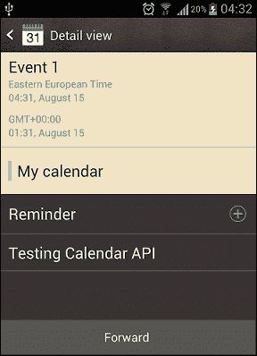

# 四、日历 API

安卓冰淇淋三明治引入了新的日历应用程序接口来管理日历。使用这些 API 可以管理事件、与会者、警报和提醒数据库。这些应用编程接口使我们能够轻松地将日历与我们的安卓应用程序集成在一起。本章通过示例展示了如何使用日历应用编程接口。

本章涵盖的主题如下:

*   使用日历应用程序接口
*   创建事件
*   添加与会者
*   添加提醒

# 使用日历应用程序接口

管理日历数据的主要类是`CalendarContract`类。存储日历信息的值得注意的表格如下:

*   `CalendarContract.Calendar`:此 表存储每个日历的日历特定数据
*   `CalendarContract.Event`:该表存储每个事件的 事件特定数据
*   `CalendarContract.Attendee`:该表 存储了事件参与者的数据
*   `CalendarContract.Reminder`:此表 存储事件提醒的相关数据

### 注

在下面的例子中，我们将在安卓设备中执行应用程序，因为为了在模拟器中测试日历应用编程接口，需要一个帐户。如果你想在模拟器中测试示例，确保在创建 **AVD** 时选择**谷歌应用编程接口**的应用编程接口等级 14 或更高。谷歌应用编程接口允许你添加一个谷歌帐户到模拟器，这是日历应用编程接口所需要的。您还需要设置日历以与 Gmail 同步。添加账号时可以使用[m.google.com](http://m.google.com)作为服务器，`<[your_email@gmail.com](mailto:your_email@gmail.com)>`作为域/用户名。创建并同步您的帐户后，您可以在模拟器中运行以下示例。

## 创建事件

为了创建一个日历事件，我们需要创建一个`ContentValues`实例，并将事件信息放到这个实例中。然后，使用`ContentResolver`类，我们可以将事件信息插入日历。为了将事件插入到日历中，有一些必填字段。这些字段如下:

*   事件的开始时间
*   如果事件没有重复，则事件的结束时间
*   事件重复时的重复规则或重复日期
*   事件重复时的持续时间
*   事件时区和日历标识

插入事件的`Activity`类定义如下:

```java
package com.chapter4;

import java.util.Calendar;
import java.util.TimeZone;

import android.app.Activity;
import android.content.ContentValues;
import android.database.Cursor;
import android.os.Bundle;
import android.content.ContentUris;
import android.net.Uri;
import android.provider.CalendarContract;
import android.view.View;
import android.view.View.OnClickListener;
import android.widget.Button;

public class Chapter4_1Activity extends Activity implements OnClickListener {

  Button insertButton;
  long calendarID;
  long eventID;

    /** Called when the activity is first created. */
    @Override
    public void onCreate(Bundle savedInstanceState) {
        super.onCreate(savedInstanceState);
        setContentView(R.layout.main);

        insertButton = (Button)this.findViewById(R.id.buttonInsertEvent);
        insertButton.setOnClickListener(this);
    }

  @Override
  public void onClick(View v) {

    addEvent();

  }

  private void addEvent() {
    calendarID = getCalendarID();
    ContentValues eventValues = new ContentValues ();
 // provide the required fields for creating an event to
 // ContentValues instance and insert event using // ContentResolver
    eventValues.put (CalendarContract.Events.CALENDAR_ID,calendarID);
    eventValues.put (CalendarContract.Events.TITLE,"Event 1");
    eventValues.put (CalendarContract.Events.DESCRIPTION,
    "Testing Calendar API");
    eventValues.put 
(CalendarContract.Events.DTSTART,Calendar.getInstance().getTimeInMillis());
    eventValues.put 
(CalendarContract.Events.DTEND,Calendar.getInstance().getTimeInMillis());

  eventValues.put(CalendarContract.Events.EVENT_TIMEZONE,
TimeZone.getDefault().toString());

    Uri eventUri = this.getContentResolver().insert 
(CalendarContract.Events.CONTENT_URI, eventValues);
             eventID = ContentUris.parseId(eventUri);
  }
 // we use this method in order to get the ID of the calendar because
 // calendar ID is a required field in creating an event
  public long getCalendarID() {
    Cursor cur = null;
    try {
 // provide CalendarContract.Calendars.CONTENT_URI to
 // ContentResolver to query calendars
      cur = this.getContentResolver().query(
          CalendarContract.Calendars.CONTENT_URI,
          null,null,null, null);
      if (cur.moveToFirst()) {
        return cur
            .getLong(cur

  .getColumnIndex(CalendarContract.Calendars._ID));
      }
      } catch (Exception e) {
      e.printStackTrace();
    } finally {
      if (cur != null) {
      cur.close();
      }
    }
    return -1L;
  }
}
```

在这段代码中可以看到，我们使用 `getCalendarID()`方法来获取日历的 ID，因为`calendarID`是创建事件的中的必填字段。我们提供了`CalendarContract.Calendars.CONTENT_URI`到`ContentResolver`来查询日历。

我们使用按钮点击事件来添加事件。点击此按钮，我们称之为 `addEvent()`方法。在 `addEvent()`方法中，我们向 `ContentValues`实例提供创建事件所需的字段，并使用`ContentResolver`插入事件。我们向`ContentResolver`提供`CalendarContract.Events.CONTENT_URI`以便添加事件。

这个应用程序布局的 XML 代码是`LinearLayout`，带有一个`Button`组件，如下面的代码块所示:

```java
<?xml version="1.0" encoding="utf-8"?>
<LinearLayout xmlns:android="http://schemas.android.com/apk/res/android"
    android:layout_width="fill_parent"
    android:layout_height="fill_parent"
    android:orientation="vertical" >

    <Button
        android:id="@+id/buttonInsertEvent"
        android:layout_width="wrap_content"
        android:layout_height="wrap_content"
        android:text="insert event" />

</LinearLayout>
```

当您执行该代码时，屏幕将如下所示:


为了使用新的日历 API，`AndroidManifest.xml`文件中的最低 SDK 版本应该是 API 级别 14 或更高。此外，`WRITE_CALENDAR` 和 `READ_CALENDAR`权限是读取和写入日历所必需的。`AndroidManifest.xml`文件应该如下所示:

```java
<?xml version="1.0" encoding="utf-8"?>
<manifest xmlns:android="http://schemas.android.com/apk/res/android"
    package="com.chapter4"
    android:versionCode="1"
    android:versionName="1.0" >

 <uses-sdk android:minSdkVersion="14" />
<uses-permission android:name="android.permission.WRITE_CALENDAR" />
<uses-permission android:name="android.permission.READ_CALENDAR" />
    <application
        android:icon="@drawable/ic_launcher"
        android:label="@string/app_name" >
        <activity
            android:name=".Chapter4_1Activity"
            android:label="@string/app_name" >
            <intent-filter>
                <action android:name="android.intent.action.MAIN" />

                <category android:name="android.intent.category.LAUNCHER" />
            </intent-filter>
        </activity>
    </application>

</manifest>
```

创建事件时，日历将如下所示:



## 使用意图创建事件

同样的事件也可以使用`Intent` `objects`来创建。 下面的方法展示了如何使用`Intent objects`添加事件:

```java
private void addEventUsingIntent() {
    calendarID = getCalendarID();
    Intent intent = new Intent(Intent.ACTION_INSERT)
        .setData(CalendarContract.Events.CONTENT_URI)
        .putExtra(CalendarContract.Events.DTSTART, 
Calendar.getInstance().getTimeInMillis())
        .putExtra(CalendarContract.Events.DTEND, 
Calendar.getInstance().getTimeInMillis())
        .putExtra(CalendarContract.Events.TITLE,"Event 1")
        .putExtra(CalendarContract.Events.DESCRIPTION,"Testing Calendar API");
    startActivity(intent);     
  }
```

我们可以调用这个方法来代替 `addEvent()`方法，以便使用`Intent`对象创建一个事件。通过使用`Intent`对象，我们不需要创建视图来创建事件。使用`Intent`对象是 修改和显示日历的最佳实践。

## 添加与会者

添加与会者类似于创建活动。我们使用`CalendarContract.Attendees.CONTENT_URI`作为插入与会者的 URI。插入与会者所需的字段包括事件标识、与会者电子邮件、与会者关系、与会者状态和与会者类型。我们在应用程序的 XML 布局中放置了一个`Button`组件。最终布局如下:

```java
<?xml version="1.0" encoding="utf-8"?>
<LinearLayout xmlns:android="http://schemas.android.com/apk/res/android"
    android:layout_width="fill_parent"
    android:layout_height="fill_parent"
    android:orientation="vertical" >

    <Button
        android:id="@+id/buttonInsertEvent"
        android:layout_width="wrap_content"
        android:layout_height="wrap_content"
        android:text="insert event" />

    <Button
        android:id="@+id/buttonInsertAttendee"
        android:layout_width="wrap_content"
        android:layout_height="wrap_content"
        android:text="insert attendee" />
</LinearLayout>
```

然后，我们在单击插入与会者按钮时调用以下方法:

```java
  private void addAttendee()
  {
    ContentValues cv = new ContentValues();
    cv.put(Attendees.ATTENDEE_NAME, "Murat AYDIN");
    cv.put(Attendees.ATTENDEE_EMAIL, "maydin@gmail.com");
    cv.put(Attendees.EVENT_ID, eventID);
    cv.put(Attendees.ATTENDEE_RELATIONSHIP, 
Attendees.RELATIONSHIP_ATTENDEE);
    cv.put(Attendees.ATTENDEE_STATUS, 
Attendees.ATTENDEE_STATUS_INVITED);
    cv.put(Attendees.ATTENDEE_TYPE,Attendees.TYPE_OPTIONAL);

  this.getContentResolver().insert(CalendarContract.Attendees.CONTENT_URI, 
cv);
  }
```

在点击插入与会者按钮之前，应该创建一个事件，因为我们在插入与会者时使用了一个事件标识。

## 添加提醒

我们使用`CalendarContract.Reminder.CONTENT_URI`作为中的 URI，插入事件的提醒。插入提醒的必填字段有事件标识、事件前提醒需要触发的分钟数、方法。我们在应用程序的 XML 布局中放置了一个 `Button`组件。最终布局如下:

```java
<?xml version="1.0" encoding="utf-8"?>
<LinearLayout xmlns:android="http://schemas.android.com/apk/res/android"
    android:layout_width="fill_parent"
    android:layout_height="fill_parent"
    android:orientation="vertical" >

    <Button
        android:id="@+id/buttonInsertEvent"
        android:layout_width="wrap_content"
        android:layout_height="wrap_content"
        android:text="insert event" />

    <Button
        android:id="@+id/buttonInsertAttendee"
        android:layout_width="wrap_content"
        android:layout_height="wrap_content"
        android:text="insert attendee" />

    <Button
        android:id="@+id/buttonInsertReminder"
        android:layout_width="wrap_content"
        android:layout_height="wrap_content"
        android:text="insert reminder" />

</LinearLayout>
```

然后，我们单击插入提醒按钮，调用以下方法:

```java
private void addReminder()
  {
    ContentValues values = new ContentValues();
    values.put(Reminders.MINUTES, 15);
    values.put(Reminders.EVENT_ID, eventID);
    values.put(Reminders.METHOD, Reminders.METHOD_ALERT);

  this.getContentResolver().insert(CalendarContract.Reminders.CONTENT_URI, 
  values);
  }
```

正如您在这段代码中看到的，该提醒将在事件发生前 15 分钟发出。在按下插入提醒按钮之前，应该创建一个事件，因为我们在插入提醒时使用的是事件 ID。

添加提醒后，日历将如下所示:


# 总结

有了新的日历应用编程接口，将日历集成到安卓应用程序变得更加容易。在本章中，我们学习了如何创建事件以及创建事件所需的字段。然后，我们了解了如何为活动添加参与者和提醒。我们需要设置修改日历所需的权限。

虽然片段是在安卓 3.0 中引入的，但它们现在可以用于带有安卓冰淇淋三明治的小屏幕设备。在下一章中，我们将介绍**片段**的基础知识以及如何使用它们。