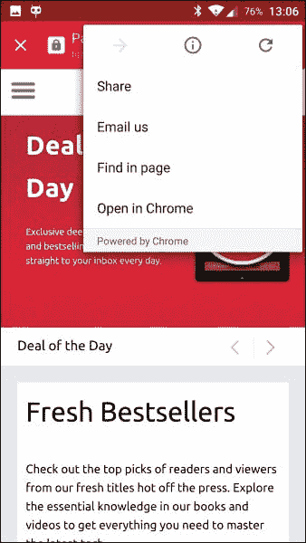

# 七、Chrome 自定义选项卡

您是否曾想在应用中添加一个**网络视图**？也许您想添加一些网页浏览功能，并在应用中显示一些相关内容？我知道我必须这么做。几乎在每一个场合，我都不愿意使用网络视图功能，因为这是应用中最丑陋的部分之一。

你可以清楚地看到，网络视图功能是一个网络部分，用户界面添加了相当多的安卓版本，这导致了我的强迫症用户界面/UX 感爆棚。谷歌发布的最新内容之一是 **Chrome 定制标签**。

在本章中，我们将探索 Chrome 自定义选项卡，并尝试解释和演示使用它代替普通的旧 WebView 的好处:

*   什么是 Chrome 自定义选项卡？
*   何时使用 Chrome 自定义选项卡
*   实施指南

# 什么是 Chrome 自定义标签？

嗯，我们大多数人都是从每天的网络浏览中知道标签的。你用哪个浏览器真的不重要；所有浏览器都支持选项卡和多个选项卡的浏览。这允许我们同时打开多个网站，并在打开的实例之间导航。在安卓系统中，情况大致相同，但是使用 WebView 时，你没有选项卡。

## 什么是 WebView？

网络视图是安卓操作系统中负责在大多数安卓应用中呈现网络页面的部分。如果你在安卓应用中看到网络内容，你很可能看到的是网络视图。这个规则的主要例外是一些安卓浏览器，比如 Chrome、火狐等等。

在安卓 4.3 及更低版本中，网络视图使用基于苹果**网络工具包**的代码。在安卓 4.4 及更高版本中，WebView 基于**Chrome**项目，这是谷歌 Chrome 的开源基础。在安卓 5.0 中，WebView 被解耦到一个单独的应用中，该应用允许通过谷歌 Play 及时更新，而不需要发布固件更新，同样的技术也被用于谷歌 Play 服务。

现在，让我们再次讨论一个简单的场景:我们希望在我们的应用中显示 web 内容(与 URL 相关)。我们有两个选择:要么启动浏览器，要么使用 WebView 构建我们自己的应用内浏览器。如果我们写下来，这两种选择都有利弊。浏览器是一个外部应用，你不能真正改变它的 UI；使用时，你将用户推至其他应用，你可能会在*野外*失去他们。另一方面，使用 WebView 将把用户紧紧地关在里面。然而，实际上在 WebView 中处理所有可能的动作是相当大的开销。

谷歌听到了我们的咆哮，用 Chrome 定制标签来拯救我们。现在，我们可以更好地控制应用中的网络内容，并且可以以更干净、更美观的方式将网络内容缝合到应用中。

## 定制选项

Chrome 自定义选项卡允许进行多项修改和调整:

*   工具栏颜色
*   输入和退出动画
*   工具栏和溢出菜单的自定义操作
*   预启动和预取内容，以加快加载速度

# 何时使用 Chrome 自定义标签

自从 WebView 问世以来，应用一直在以多种方式使用它，嵌入内容——APK 内部的本地静态内容和动态内容，作为加载最初不是为移动设备设计的网页。后来，我们看到了移动网络时代的兴起(完全是混合应用)。

Chrome 自定义标签不仅仅是加载本地内容或手机兼容的网页内容。当您加载 web 数据，希望实现简单、代码维护更容易，并且希望将 web 内容作为应用的一部分时，就应该使用它们，就好像它总是在应用中一样。

您应该使用自定义选项卡的原因如下:

*   易于实现:您可以在需要时使用支持库，或者只是在您的`View`意图中添加额外内容。就这么简单。
*   在应用用户界面修改中，您可以执行以下操作:
    *   设置工具栏颜色
    *   添加/更改操作按钮
    *   向溢出菜单添加自定义菜单项
    *   进入选项卡或退出到上一位置时，设置并创建自定义输入/输出动画
*   更简单的导航和导航逻辑:如果需要，你可以得到一个回调通知你一个外部导航。您知道用户何时导航到 web 内容，以及完成后应该返回到哪里。
*   Chrome 自定义选项卡允许您使用额外的性能优化:
    *   可以说，您可以保持引擎运行，实际上让自定义选项卡提前启动，并在使用前做一些预热。这样做不会干扰或占用宝贵的应用资源。
    *   您可以在等待其他用户交互的同时，在后台提供一个预先加载的网址。这加快了用户可见的页面加载时间，并给用户一种极快的应用感觉，所有内容只需点击一下即可。
*   使用自定义选项卡时，应用不会被收回，因为即使选项卡在前台，应用级别仍会在前台。因此，我们在整个使用时间内都保持在顶层(除非一个电话或其他用户交互导致了变化)。
*   使用相同的 Chrome 容器意味着用户已经登录到他们过去连接的网站；以前授予的特定权限也适用于此处；甚至填充数据、自动完成和同步都在这里工作。
*   Chrome 自定义选项卡允许我们在 WebView 不是最新版本的棒棒糖之前的设备上为用户提供最新的浏览器实现。

# 实施指南

如前所述，我们有几个集成到 Chrome 定制标签中的特性。第一个定制用户界面和与定制选项卡的交互。第二个允许页面加载更快，并保持应用活跃。

## 我们可以使用 Chrome 自定义标签吗？

在我们开始使用自定义选项卡之前，我们希望确保它们得到支持。Chrome 自定义选项卡公开了一个服务，所以最好的支持检查是尝试并绑定到该服务。成功意味着支持并可以使用自定义选项卡。您可以查看这个要点，它向助手展示了如何检查它，或者稍后查看项目源代码，网址为:

[https://gist.github.com/MaTriXy/5775cb0ff98216b2a99d](https://gist.github.com/MaTriXy/5775cb0ff98216b2a99d)

在检查并了解支持存在后，我们将从 UI 和交互部分开始。

## 自定义 UI 和选项卡交互

在这里，我们将使用众所周知的`ACTION_VIEW`意图动作，通过在发送到 Chrome 的意图上附加额外的内容，我们将触发 UI 中的更改。请记住`ACTION_VIEW`意图兼容所有浏览器，包括 Chrome。有些手机没有 Chrome，或者有些手机的默认浏览器不是 Chrome。在这些情况下，用户将导航到特定的浏览器应用。

意图是传递我们希望 Chrome 获得的额外数据的一种便捷方式。

调用 Chrome 自定义选项卡时，不要使用以下任何标志:

*   `FLAG_ACTIVITY_NEW_TASK`
*   `FLAG_ACTIVITY_NEW_DOCUMENT`

在使用 API 之前，我们需要将其添加到我们的`gradle`文件中:

```java
compile 'com.android.support:customtabs:23.1.0'
```

这将允许我们在应用中使用自定义选项卡支持库:

```java
CustomTabsIntent.EXTRA_SESSION
```

前面的代码是自定义选项卡支持库中的一个额外代码；它用于匹配会话。打开自定义选项卡时，它必须包含在意图中。如果不需要将任何服务端会话与意图相匹配，则它可以为空。

### 注

我们有一个示例项目来显示位于 https://github.com/MaTriXy/ChubbyTabby T4 的名为楚比的用户界面的选项。

我们也将检查这里的重要部分。我们的主要交互来自于支持库中一个名为`CustomTabsIntent.Builder`的特殊构建器；本课程将帮助我们构建自定义选项卡所需的意图:

```java
CustomTabsIntent.Builder intentBuilder = new CustomTabsIntent.Builder(); //init our Builder

//Setting Toolbar Color
int color = getResources().getColor(R.color.primary);

//we use primary color for our toolbar as well - you can define any color you want and use it.
intentBuilder.setToolbarColor(color);

//Enabling Title showing
intentBuilder.setShowTitle(true);

//this will show the title in the custom tab along the url showing at the bottom part of the tab toolbar.

//This part is adding custom actions to the over flow menu
String menuItemTitle = getString(R.string.menu_title_share);
PendingIntent menuItemPendingIntent = createPendingShareIntent();
intentBuilder.addMenuItem(menuItemTitle, menuItemPendingIntent);
String menuItemEmailTitle = getString(R.string.menu_title_email);
PendingIntent menuItemPendingIntentTwo = createPendingEmailIntent();
intentBuilder.addMenuItem(menuItemEmailTitle, menuItemPendingIntentTwo);

//Setting custom Close Icon.
intentBuilder.setCloseButtonIcon(mCloseButtonBitmap);

//Adding custom icon with custom action for the share action.
intentBuilder.setActionButton(mActionButtonBitmap, getString(R.string.menu_title_share), createPendingShareIntent());

//Setting start and exit animation for the custom tab.
intentBuilder.setStartAnimations(this, R.anim.slide_in_right, R.anim.slide_out_left);
intentBuilder.setExitAnimations(this, android.R.anim.slide_in_left, android.R.anim.slide_out_right);
CustomTabActivityHelper.openCustomTab(this, intentBuilder.build(), Uri.parse(URL), new WebviewFallback(), useCustom);
```

这里要注意的几件事如下:

*   Every menu item uses a pending intent; if you don't know what a pending intent is, head to:

    [http://developer . Android . com/reference/Android/app/pendiningtent . html](http://developer.android.com/reference/android/app/PendingIntent.html)

*   当我们设置自定义图标时，例如*关闭*按钮或*动作*按钮，就此而言，我们使用位图，并且我们必须在将位图传递给构建器之前对其进行解码
*   设置动画很简单，可以使用之前创建的动画的 XML 文件；只需确保在发布应用之前测试结果

以下截图是 Chrome 自定义选项卡的示例:


### 自定义动作按钮

作为开发人员，我们可以完全控制自定义选项卡中的操作按钮。对于大多数用例，我们可以考虑一个共享操作，或者您的用户将执行的一个更常见的选项。动作按钮基本上是一个捆绑包，带有一个动作按钮图标和一个挂起的意图，当用户点击动作按钮时，Chrome 会调用这个意图。根据规格，图标高度应为 24 dp，宽度应为 24-48 dp 。

```java
//Adding custom icon with custom action for the share action
intentBuilder.setActionButton(mActionButtonBitmap, getString(R.string.menu_title_share), createPendingShareIntent());
```

### 配置自定义菜单

默认情况下，Chrome 自定义选项卡通常有一个三图标行，顶部始终有**前进**、**页面信息**、**刷新**，菜单页脚有**在页面中查找**和**在浏览器中打开(在 Chrome 中打开**也可以出现)。

我们开发人员能够添加和自定义多达三个菜单项，这些菜单项将出现在图标行和底部项目之间，如下图所示:



我们看到的菜单实际上是由一系列包表示的，每个包都有菜单文本和一个待定的意图，当用户点击该项目时 Chrome 将代表我们调用该意图:

```java
//This part is adding custom buttons to the over flow menu
String menuItemTitle = getString(R.string.menu_title_share);
PendingIntent menuItemPendingIntent = createPendingShareIntent();
intentBuilder.addMenuItem(menuItemTitle, menuItemPendingIntent);
String menuItemEmailTitle = getString(R.string.menu_title_email);
PendingIntent menuItemPendingIntentTwo = createPendingEmailIntent();
intentBuilder.addMenuItem(menuItemEmailTitle, menuItemPendingIntentTwo);
```

### 配置自定义进入和退出动画

没有几个动画的陪伴，没有什么是完整的。这没有什么不同，因为我们有两个过渡要做:一个是进入自定义选项卡，另一个是退出；我们可以选择为每个开始和退出动画设置特定的动画:

```java
//Setting start and exit animation for the custom tab.
intentBuilder.setStartAnimations(this,R.anim.slide_in_right, R.anim.slide_out_left);
intentBuilder.setExitAnimations(this, android.R.anim.slide_in_left, android.R.anim.slide_out_right);
```

### 镀铬预热

通常，在我们用意图生成器设置完意图后，我们应该调用`CustomTabsIntent.launchUrl (Activity context, Uri url)`，这是一个非静态的方法，将触发一个新的自定义选项卡活动来加载网址并在自定义选项卡中显示它。这可能会占用相当多的时间，并影响应用提供的流畅感。

我们都知道用户需要近乎即时的体验，所以 Chrome 有一项服务，我们可以连接到它，并要求它预热浏览器及其本机组件。调用此函数将要求 Chrome 执行以下操作:

*   网址主域的域名系统预解析
*   最有可能的子资源的域名系统预解析
*   预连接到目的地，包括 HTTPS/TLS 协商

预热 Chrome 的过程如下:

1.  连接到服务。
2.  附加一个导航回调，以便在完成页面加载时得到通知。
3.  在服务上，调用`warmup`在后台启动 Chrome。
4.  创建`newSession`；该会话用于对 API 的所有请求。
5.  告诉 Chrome 用户可能会加载哪些页面`mayLaunchUrl`。
6.  使用步骤 4 中生成的会话标识启动意图。

### 连接到 Chrome 服务

连接到 Chrome 服务需要处理**安卓界面定义语言** ( **AIDL** )。

如果你不了解 AIDL，请阅读:

[http://developer.android.com/guide/components/aidl.html](http://developer.android.com/guide/components/aidl.html)

这个接口是用 AIDL 创建的，它会自动为我们创建一个代理服务类:

```java
CustomTabsClient.bindCustomTabsService()
```

所以，我们检查 Chrome 包名；在我们的示例项目中，我们有一种特殊的方法来检查 Chrome 是否存在于所有变体中。在我们设置了包之后，我们绑定到服务，并获得一个`CustomTabsClient`对象，我们可以使用它，直到我们与服务断开连接:

```java
pkgName - This is one of several options checking to see if we have a version of Chrome installed can be one of the following
static final String STABLE_PACKAGE = "com.android.chrome";
static final String BETA_PACKAGE = "com.chrome.beta";
static final String DEV_PACKAGE = "com.chrome.dev";
static final String LOCAL_PACKAGE = "com.google.android.apps.chrome";

private CustomTabsClient mClient;

// Binds to the service.
CustomTabsClient.bindCustomTabsService(myContext, pkgName, new CustomTabsServiceConnection() {
  @Override
  public void onCustomTabsServiceConnected(ComponentName name, CustomTabsClient client) {
    // CustomTabsClient should now be valid to use
    mClient = client;
  }

  @Override
  public void onServiceDisconnected(ComponentName name) {
  // CustomTabsClient is no longer valid which also invalidates sessions.
    mClient = null;
  }
});
```

在我们绑定到服务之后，我们可以调用我们需要的合适的方法。

### 预热浏览器进程

这个的方法如下:

```java
boolean CustomTabsClient.warmup(long flags)

//With our valid client earlier we call the warmup method.
mClient.warmup(0);
```

### 注

旗帜目前没有被使用，所以我们暂时通过`0`。

预热过程加载本机库和浏览器进程，以支持以后的自定义选项卡浏览。这是异步的，返回值指示请求是否被接受。返回`true`表示成功。

### 创建新的选项卡会话

其方法如下:

```java
boolean CustomTabsClient.newSession(ICustomTabsCallback callback)
```

新的选项卡会话被用作绑定`mayLaunchUrl`调用的分组对象、我们构建的`VIEW`意图以及一起生成的选项卡。我们可以获得与创建的会话相关联的回拨，该回拨将被传递给任何连续的`mayLaunchUrl`呼叫。当会话创建成功时，该方法返回`CustomTabsSession`；否则，返回`Null`。

### 设置预取网址

其方法如下:

```java
boolean CustomTabsSession.mayLaunchUrl (Uri url, Bundle extras, List<Bundle> otherLikelyBundles)
```

此方法将通知浏览器很快会导航到该网址。在调用这个方法之前一定要`warmup()`-这是必须的。首先必须指定最可能的网址，我们可以发送一个可选的其他可能网址的列表(`otherLikelyBundles`)。列表必须按降序排序，可选列表可能会被忽略。对该方法的新调用将降低先前调用的优先级，并可能导致 URL 未被预取。布尔值通知我们操作是否已经成功完成。

### 自定义选项卡连接回调

其方法如下:

```java
void CustomTabsCallback.onNavigationEvent (int navigationEvent, Bundle extras)
```

我们在自定义选项卡中的每个导航事件上触发一个回调。`int navigationEvent`元素是定义页面状态的六个元素之一。有关更多信息，请参考以下代码:

```java
//Sent when the tab has started loading a page.
public static final int NAVIGATION_STARTED = 1;
//Sent when the tab has finished loading a page.
public static final int NAVIGATION_FINISHED = 2;
//Sent when the tab couldn't finish loading due to a failure.
public static final int NAVIGATION_FAILED = 3;
//Sent when loading was aborted by a user action.
public static final int NAVIGATION_ABORTED = 4;
//Sent when the tab becomes visible.
public static final int TAB_SHOWN = 5;
//Sent when the tab becomes hidden.
public static final int TAB_HIDDEN = 6;
private static class NavigationCallback extends CustomTabsCallback {
  @Override
  public void onNavigationEvent(int navigationEvent, Bundle extras) {
    Log.i(TAG, "onNavigationEvent: Code = " + navigationEvent);
  }
}
```

# 总结

我们了解到了一个新增加的特性，Chrome 自定义标签，它允许我们将网页内容嵌入到我们的应用中并修改用户界面。Chrome 定制标签允许我们为用户提供更全面、更快速的应用内 web 体验。我们在引擎盖下使用 Chrome 引擎，这比普通的 WebViews 或者加载整个 Chrome(或者另一个浏览器)应用更快。

我们看到我们可以在后台预加载页面，让它看起来好像我们的数据非常快。我们可以定制我们的 Chrome 标签的外观和感觉，使其与我们的应用相匹配。我们看到的变化包括工具栏颜色、过渡动画，甚至工具栏中添加了自定义操作。

自定义选项卡还受益于 Chrome 功能，如保存的密码、自动填充、点击搜索和同步；这些都可以在自定义选项卡中找到。对于开发人员来说，集成非常容易，只需要在基础层多写几行代码。如果需要，支持库有助于更复杂的集成。

这是 Chrome 的一个功能，这意味着你可以在任何安装了最新版本 Chrome 的安卓设备上获得它。请记住，Chrome 自定义选项卡支持库随着新功能和修复而变化，这与其他支持库相同，因此请更新您的版本，并确保您使用最新的应用编程接口来避免任何问题。

在下一章中，我们将深呼吸，看看安卓棉花糖提供的一些新的身份验证/安全功能。