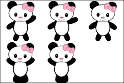
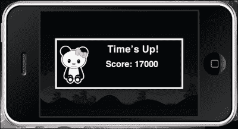
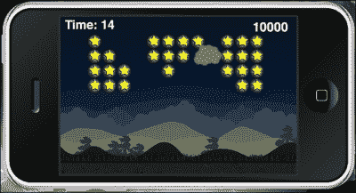
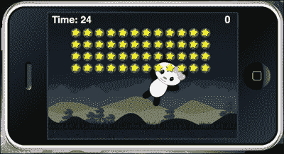

# 五、使我们的游戏动起来

> *我们的移动游戏开发之旅有了一个很好的开始。我们已经经历了大量的编程，从游戏逻辑到在屏幕上显示对象。Corona SDK 最强大的一点是，任何显示对象都可以被动画化。这是 Corona 提供的灵活图形模型的证明。*
> 
> *动画为游戏中的用户体验增加了很多角色。这是通过生成从一帧到另一帧平滑发展的帧序列来实现的。我们将学习这项技能，并将其应用到我们将要创建的新游戏中。*

在本章中，我们将:

*   处理运动和过渡
*   用图像表制作动画
*   为显示对象创建游戏循环
*   构建我们的下一个游戏框架

让我们制作动画！

# 熊猫捕星器

这部分涉及到创建我们的第二个游戏，叫做熊猫追星。主角是一只名叫玲玲的熊猫，它需要被发射到天空，在计时器用完之前捕捉尽可能多的星星。熊猫将被制作成动画，并且在每一个动作过程中都有单独的动作，比如在发射前的准备阶段和在空中的时候。弹弓力学也将应用于将玲玲发射到空中。你可能在游戏中见过类似的功能，如*愤怒的小鸟*和*粉碎城堡*。

# 让我们开始行动吧

我们已经在[第 3 章](03.html "Chapter 3. Building Our First Game – Breakout")、*中引入了过渡，构建了我们的第一个游戏——突破*，并简单地用它触底。让我们更详细地讨论一下。

## 过渡

过渡库允许您在显示对象的一个或多个属性之间进行补间，从而只需一行代码即可创建动画。我们已经在[第 3 章](03.html "Chapter 3. Building Our First Game – Breakout")、*构建我们的第一个游戏-突破*中讨论了过渡的基础。

这可以通过`transition.to`方法完成，该方法获取一个显示对象和一个包含控制参数的表。控制参数指定动画的持续时间和显示对象的最终属性值。属性的中间值由可选的宽松函数确定，该函数也被指定为控制参数。

`transition.to()`方法使用“缓和”算法，随着时间的推移动画显示对象的属性。

语法是`handle = transition.to( target, params )`。

返回函数是一个对象。参数如下:

*   `target`:这是一个将成为过渡目标的对象。这包括显示对象。
*   `params`:这是一个表格，指定了将被动画化的显示对象的属性，以及以下一个或多个可选的非动画属性:
    *   `params.time`:以毫秒为单位指定过渡的持续时间。默认情况下，持续时间为 500 毫秒(0.5 秒)。
    *   `params.transition`:默认为`easing.linear`。
    *   `params.delay`:指定补间开始前的延迟时间，单位为毫秒(默认为无)。
    *   `params.delta`:这是一个布尔值，指定非控制参数被解释为最终结束值还是值的变化。默认为`nil`，表示假。
    *   `params.onStart`:这是补间开始前调用的函数或表监听器。
    *   `params.onComplete`:这是补间完成后调用的函数或表监听器。

## 放松

缓和库是过渡库使用的插值函数的集合。一个例子是打开抽屉。第一个动作开始是快速的，然后是缓慢的精确动作，然后停止。以下是一些宽松的例子:

*   `easing.linear(t, tMax, start, delta)`:这定义了无加速度的恒定运动
*   `easing.inQuad(t, tMax, start, delta)`:这在过渡中执行动画属性值的二次插值
*   `easing.outQuad(t, tMax, start, delta)`:这将快速启动运动，然后在执行时减速至零速度
*   `easing.inOutQuad(t, tMax, start, delta)`:这从零速度开始动画，加速，然后减速到零速度
*   `easing.inExpo(t, tMax, start, delta)`:这从零速度开始运动，然后在执行时加速
*   `easing.outExpo(t, tMax, start, delta)`:这将快速启动运动，然后在执行时减速至零速度
*   `easing.inOutExpo(t, tMax, start, delta)`:这从零速度开始运动，加速，然后使用指数缓和方程减速到零速度

您可以创建自己的缓和函数，在起始值和最终值之间进行插值。函数的参数定义如下:

*   `t`:这是转换开始后的时间，单位为毫秒
*   `tMax`:这是过渡的持续时间
*   `start`:这是起始值
*   `delta`:这是数值的变化(最终数值= `start` + `delta`)

例如:

```java
local square = display.newRect( 0, 0, 50, 50 )
square:setFillColor( 1,1,1 )
square.x = 50; square.y = 100

local square2 = display.newRect( 0, 0, 50, 50 )
square2:setFillColor( 1,1,1 )
square2.x = 50; square2.y = 300

transition.to( square, { time=1500, x=250, y=0 } )
transition.from( square2, { time=1500, x=250, y=0, transition = easing.outExpo } )
```

# 定时功能的值

在应用中组织游戏对象出现的时间时，使用一个稍后可以调用的函数可能会有所帮助。计时器库将允许我们及时处理我们的功能。

## 计时器

定时器功能使您能够在您选择的特定延迟(毫秒)触发事件。

*   `timer.performWithDelay(delay, listener [, iterations])`:这将在毫秒延迟后调用侦听器，并返回一个对象句柄，您可以将其传递给`timer.cancel()`，以便在调用侦听器之前取消计时器。例如:

    ```java
    local function myEvent()
      print( "myEvent called" )
    end
    timer.performWithDelay( 1000, myEvent )
    ```

*   `timer.cancel(timerId)`:这取消了由`timer.performWithDelay()`启动的定时器操作。参数如下:
    *   `timerId`:这是调用`timer.performWithDelay()`返回的对象句柄。例如:

        ```java
        local count = 0

        local function myEvent()
          count = count + 1
          print( count )

          if count >= 3 then
            timer.cancel( myTimerID ) -- Cancels myTimerID
            end
          end
        ```

*   `timer.pause(timerId)`:这将暂停以`timer.performWithDelay()`开始的计时器对象。该参数为:
    *   `timerId`:这个是来自`timer.performWithDelay()`的定时器 ID 对象。例如:

        ```java
        local count = 0

        local function myEvent()
          count = count + 1
          print( count )

          if count >= 5 then
            timer.pause( myTimerID ) -- Pauses myTimerID
            end
        end

        myTimerID = timer.performWithDelay(1000, myEvent, 0)
        ```

*   `timer.resume(timerId)`:这将恢复用`timer.pause(timerId)`暂停的计时器。参数如下:
    *   `timerID`:这是来自`timer.performWithDelay()`的定时器标识。例如:

        ```java
        local function myEvent()
          print( "myEvent called" )
        end

        myTimerID = timer.performWithDelay( 3000, myEvent )  -- wait 3 seconds

        result = timer.pause( myTimerID ) -- Pauses myTimerID
        print( "Time paused at " .. result )

        result = timer.resume( myTimerID ) -- Resumes myTimerID
        print( "Time resumed at " .. result )
        ```

# 什么是图像表？

Corona软件开发工具包包括一个图像表功能，以构建动画精灵(也称为精灵表)。

### 注

关于图片单的更多信息，请参考[http://docs . coronalabs . com/guide/media/imageSheets/index . html](http://docs.coronalabs.com/guide/media/imageSheets/index.html)的以下链接。

图像表是节省纹理内存的有效方法。它们被推荐用于复杂的角色动画或者当涉及许多类型的动画时。

图像表需要更多的编码和更高级的设置。它们需要构造一大张动画帧。

# 是雪碧狂潮！

图像工作表是 2D 动画，将多个帧编辑成一个纹理图像。这是节省纹理内存的有效方法。它有利于移动设备，并最大限度地减少加载时间。

## 图像表 API

`graphics.newImageSheet`功能创建一个新的图像表。参考以下代码:

```java
graphics.newImageSheet( filename, [baseDir, ] options )
```

例如，假设图像表单中的帧数为`floor(imageWidth/frameWidth) * floor(imageHeight/frameHeight)`。第一帧放在左上角位置，从左到右读取，如果适用，跟随下一行。下面的图片有五帧，每帧 128 x 128 像素。图像表图像总共是 384 像素 x 256 像素。如果将它集成到 Corona 中，将显示一个示例方法，如下所示:

```java
local options =
{
  width = 128,
  height = 128,
  numFrames = 5,
  sheetContentWidth=384, 
  sheetContentHeight=256
}
local sheet = graphics.newImageSheet( "mySheet.png", options )
```



`display.newSprite(imageSheet, sequenceData)`功能从图像表创建一个新的精灵。子画面定义了属于同一角色或其他移动资产的帧集合，然后可以将其细分为不同的动画序列进行回放。`sequenceData`参数是您设置的一系列动画序列。序列可以在多个子画面对象之间共享。以下是一些例子:

*   单个序列(连续帧):

    ```java
    local sequenceData =
    {
      name="run", start=1, count=5, time=200, loopCount=0
    }

    local myCharacter = display.newSprite(imageSheet, sequenceData)
    ```

*   单个序列(非连续帧):

    ```java
    local sequenceData =
    {
      name="jump", 
      frames= { 6, 7, 8 }, 
      time=200,
      loopCount=0
    }

    local myCharacter = display.newSprite(imageSheet, sequenceData)
    ```

*   多个序列(连续帧和非连续帧):

    ```java
    local sequenceData =
    {
      { name="run", start=1, count=5, time=200 },
      {name="jump", frames= { 6, 7, 8 }, time=200, loopCount=0 }
    }

    local myCharacter = display.newSprite(imageSheet, sequenceData)
    ```

*   `object:pause()`:此暂停当前动画。该框架保留在当前显示的框架上。
*   `object:play()`:这将播放动画序列，从当前帧开始。
*   `object:setFrame()`:这将设置当前加载序列中的帧。
*   `object:setSequence()`:这将按名称加载动画序列。

# 比赛时间！

现在我们已经学会了如何设置图片表单，让我们尝试将它们合并到熊猫捕星器中！你可以从帕克特出版网站下载本书附带的项目文件。在`Chapter 5`文件夹中有一个名为`Panda Star Catcher`的项目文件夹。它已经为您设置了`config.lua`和`build.settings`文件。艺术资源也包含在文件夹中。从[第 3 章](03.html "Chapter 3. Building Our First Game – Breakout")、*构建我们的第一个游戏–突破*和[第 4 章](04.html "Chapter 4. Game Controls")、*游戏控件*中，您可能已经注意到构建和运行时配置具有类似的设置。本教程兼容 iOS 和安卓设备。项目文件夹中包含的图形已被设计为在两个平台上正确显示。游戏的欢迎屏幕如下所示:


# 行动时间-设置变量

让我们从介绍运行游戏所需的所有变量开始:

1.  创建一个全新的`main.lua`文件，并将其添加到`Panda Star Catcher`项目文件夹中。
2.  让我们对设备隐藏状态栏，设置游戏中需要的所有变量:

    ```java
    display.setStatusBar( display.HiddenStatusBar ) -- Hides the status bar in iOS only

    -- Display groups
    local hudGroup = display.newGroup() -- Displays the HUD
    local gameGroup = display.newGroup()
    local levelGroup = display.newGroup()
    local stars = display.newGroup() -- Displays the stars

    -- Modules
    local physics = require ("physics")

    local mCeil = math.ceil
    local mAtan2 = math.atan2
    local mPi = math.pi
    local mSqrt = math.sqrt

    -- Game Objects
    local background
    local ground
    local powerShot
    local arrow
    local panda
    local poof
    local starGone
    local scoreText
    local gameOverDisplay

    -- Variables
    local gameIsActive = false
    local waitingForNewRound
    local restartTimer
    local counter
    local timerInfo 
    local numSeconds = 30 -- Time the round starts at
    local counterSize = 50
    local gameScore = 0 -- Round starts at a score of 0
    local starWidth = 30
    local starHeight = 30
    ```

## *刚刚发生了什么？*

我们在应用开始时隐藏了状态栏。这仅适用于 iOS 设备。成立了四个不同的小组，他们都在游戏中扮演着重要的角色。

注意`gameIsActive`设置为`false`。这使我们能够在显示对象需要停止动画、出现在屏幕上并受到触摸事件影响时，激活应用的属性来影响回合。

计时器的元素也已经在代码的开头设置好了。将`numSeconds`设置为`30`表示回合将从多长时间开始倒数，以秒为单位。`starWidth`和`starHeight`描绘了物体的尺寸。

# 让我们开始回合

我们需要在游戏启动前将熊猫加载到游戏屏幕上。熊猫将从屏幕底部过渡，并在任何触摸事件发生之前在屏幕上向上移动。

# 行动时间-开始游戏

现在，我们需要为熊猫设置屏幕外的位置，并让它转换到它的起始发射位置，这样用户就可以与它互动。

1.  添加变量后，创建一个名为`startNewRound()`的新的局部函数，并添加一个`if`语句，将`panda`对象初始化到场景中:

    ```java
    local startNewRound = function()
      if panda then
    ```

2.  在`startNewRound()`内增加一个新的名为`activateRound()`的本地函数。在屏幕上设置`panda`显示对象的起始位置，并添加`ground:toFront()`，使地面出现在熊猫字符

    ```java
      local activateRound = function()

        waitingForNewRound = false

        if restartTimer then
          timer.cancel( restartTimer )
        end

        ground:toFront()
        panda.x = 240
        panda.y = 300
        panda.rotation = 0
        panda.isVisible = true
    ```

    的前面
3.  创建另一个名为`pandaLoaded()`的本地函数。将`gameIsActive`设置为`true`，将`panda`对象的空气和命中属性设置为`false`。添加`panda:toFront()`使其出现在屏幕上所有其他游戏对象的前面，并将身体类型设置为`"static"` :

    ```java
        local pandaLoaded = function()

          gameIsActive = true
          panda.inAir = false
          panda.isHit = false
          panda:toFront()

          panda.bodyType = "static"

        end
    ```

4.  Transition the panda to `y=225` in 1,000 milliseconds. When the tween is completed, call the `pandaLoaded()` function using the `onComplete` command. Close the `activateRound()` function with `end` and call out to it. Close the `if` statement for `panda` and the `startNewRound()` function with `end`:

    ```java
        transition.to( panda, { time=1000, y=225, onComplete=pandaLoaded } )
        end

        activateRound()

      end
    end
    ```

    

## *刚刚发生了什么？*

当关卡被激活时，熊猫会被放在地面下，玩家才能看到它。对于`pandaLoaded()`，游戏由`gameIsActive = true`激活，熊猫由玩家准备启动。熊猫从地面过渡到屏幕上可以进入的区域。

# 噗！走开！

熊猫需要在转身后从舞台上消失。当它与屏幕上的任何物体碰撞时，我们将添加一个“噗”的效果，而不是让它消失在稀薄的空气中。

# 行动时间——在舞台上重新装载熊猫

当熊猫在空中飞行一定时间或者碰到屏幕外任何一个界外区域，都会变成一团烟雾。当屏幕边缘或地面发生碰撞事件时，熊猫将被替换为“噗”的图像。熊猫的可见属性必须被关闭，才能让“噗”的效果生效。当碰撞发生后，熊猫需要在游戏仍然激活的情况下重新加载到屏幕上。

1.  创建一个名为`callNewRound()`的本地函数。包括一个名为`isGameOver`的局部变量，并将其设置为`false` :

    ```java
    local callNewRound = function()
      local isGameOver = false
    ```

2.  在当前函数内，创建一个名为`pandaGone()`的新的局部函数。为熊猫添加新属性，这样它就不再显示在游戏舞台上:

    ```java
      local pandaGone = function()

        panda:setLinearVelocity( 0, 0 )
        panda.bodyType = "static"
        panda.isVisible = false
        panda.rotation = 0

        poof.x = panda.x; poof.y = panda.y
        poof.alpha = 0
        poof.isVisible = true
    ```

3.  为名为`fadePoof()`的`poof`对象添加一个新函数。使用`onComplete`命令，将`time`设置为`50`并将`alpha`设置为`1`进行转换。将`poof`对象淡出，将`time`设置为`100`，将`alpha`设置为`0`。关闭`pandaGone()`功能，使用`timer.performWithDelay` :

    ```java
        local fadePoof = function()
           transition.to( poof, { time=100, alpha=0 } )
        end
        transition.to( poof, { time=50, alpha=1.0, onComplete=fadePoof } )

        restartTimer = timer.performWithDelay( 300, function()
           waitingForNewRound = true; 
           end, 1)

      end

      local poofTimer = timer.performWithDelay( 500, pandaGone, 1 )
    ```

    对其进行调用
4.  当 `isGameOver`仍为`false`时，为`startNewRound()`增加一个`timer.performWithDelay`法。关闭`callNewRound()`功能:

    ```java
      if isGameOver == false then
        restartTimer = timer.performWithDelay(1500, startNewRound, 1)
      end
    end
    ```

## *刚刚发生了什么？*

当熊猫不再显示在屏幕上，并且时钟还在倒计时时，新一轮被调用。当`isGameOver`还是`false`的时候，熊猫通过叫`startNewRound()`来重新加载。

熊猫碰撞通过`pandaGone()`发生。通过应用`panda.isVisible = false`，所有物理属性变得无效。

烟雾正好出现在熊猫消失的地方。这发生在`poof.x = panda.x; poof.y = panda.y`的时候。`poof`通过`fadePoof()`短暂可见。一旦褪色，新一轮等待着，这将把`waitingForNewRound`设定为`true`。

# 获得一些积分

当熊猫抓住天空中的任何星星时，就可以获得积分。游戏是在计时器上运行的，所以玩家的工作是在时间耗尽之前尽可能多地捕捉星星。让我们总结一些要点吧！

# 行动时间-跟踪分数

分数通过一个名为`scoreNum`的参数更新，并在游戏过程中显示出来。分数通过`gameScore`接收。

1.  下一个将要创建的函数叫做`setScore`，参数叫做`scoreNum` :

    ```java
    local setScore = function( scoreNum )
    ```

2.  使用名为`newScore`的局部变量，并将其设置为`scoreNum`。设置`gameScore = newScore`。为`gameScore`提供一个`if`语句，使游戏过程中的得分设置为 0:

    ```java
      local newScore = scoreNum
      gameScore = newScore

      if gameScore < 0 then gameScore = 0; end
    ```

3.  添加`scoreText`显示对象，使其等于`gameScore`。关闭功能:

    ```java
      scoreText.text = gameScore
      scoreText.xScale = 0.5; scoreText.yScale = 0.5
      scoreText.x = (480 - (scoreText.contentWidth * 0.5)) - 15
      scoreText.y = 20
    end
    ```

## *刚刚发生了什么？*

对于`setScore = function(scoreNum)`，我们设置一个名为`scoreNum`的参数。`scoreNum`参数会通过`local newScore`不断更新游戏分数。`newScore`将通过`gameScore`更新，这为记分提供了依据。同时，`scoreText`会在游戏中显示`gameScore`的数值。

# 游戏结束时

这场比赛没有失败者。每个人都赢了！通过在计时器耗尽之前尽可能多地捕捉星星，你仍然可以保持肾上腺素激增。当一切都结束时，我们仍然需要被通知时间到了。

# 行动时间–在屏幕上显示游戏

我们需要在屏幕上设置游戏，并让它显示玩家在回合结束时取得的最终分数:

1.  创建名为`callGameOver()` :

    ```java
    local callGameOver = function()
    ```

    的新本地函数
2.  将`gameIsActive`设置为`false`，暂停物理引擎。从舞台上移除`panda`和`stars`物体:

    ```java
      gameIsActive = false
      physics.pause()

      panda:removeSelf()
      panda = nil
      stars:removeSelf()
      stars = nil
    ```

3.  将游戏显示在物体上，并将其插入`hudGroup`组。使用`transition.to`方法将游戏显示在屏幕上的物体上:

    ```java
      local shade = display.newRect( 0, 0, 480, 320 )
      shade:setFillColor( 0, 0, 0, 0.5)
      shade.x = display.contentCenterX
      shade.y = display.contentCenterY

      gameOverDisplay = display.newImage( "gameOverScreen.png")
      gameOverDisplay.x = 240; gameOverDisplay.y = 160
      gameOverDisplay.alpha = 0

      hudGroup:insert( shade )
      hudGroup:insert( gameOverDisplay )

      transition.to( shade, { time=200 } )
      transition.to( gameOverDisplay, { time=500, alpha=1 } )
    ```

4.  Update the final score with a local variable called `newScore`. Set `isVisible` to `false` for the `counter` and `scoreText`. Introduce `scoreText` again to display the final score in a different location on the device screen. Close the function:

    ```java
      local newScore = gameScore
      setScore( newScore )

      counter.isVisible = false

      scoreText.isVisible = false
      scoreText.text = "Score: " .. gameScore
      scoreText.xScale = 0.5; scoreText.yScale = 0.5
      scoreText.x = 280
      scoreText.y = 160
      scoreText:toFront()
      timer.performWithDelay( 1000, function() scoreText.isVisible = true; end, 1 )

    end
    ```

    

## *刚刚发生了什么？*

`callGameOver()`方法在时间耗尽或所有的星星都被收集时，在屏幕上显示游戏。我们已经将`gameIsActive`设置为`false`，并暂停了所有的物理操作，这样熊猫就不能被任何其他屏幕触摸所移动。熊猫和星星随后从场景中移除。通过`transition.to`可以看到`shade`和`gameOverDisplay`物体，所以它通知玩家回合结束。最终得分将在回合结束时显示在`gameOverDisplay`对象前面。

# 背景显示

熊猫需要一个它在游戏中所处位置的大致设定。让我们设置背景和地面物体。

# 行动时间-添加背景元素

1.  将`background`和`ground`显示对象中的添加到`drawBackground()`功能。将对象插入名为`gameGroup` :

    ```java
    local drawBackground = function()

      background = display.newImage( "background.png" )
      background.x = 240; background.y = 160

      gameGroup:insert( background )

      ground = display.newImage( "ground.png" )
      ground.x = 240; ground.y = 300

      local groundShape = { -240,-18, 240,-18, 240,18, -240,18 }
      physics.addBody( ground, "static", { density=1.0, bounce=0, friction=0.5, shape=groundShape } )

      gameGroup:insert( ground )

    end
    ```

    的组中

## *刚刚发生了什么？*

`background`和`ground`显示对象放置在名为`drawBackground()`的功能中。`ground`对象具有与原始显示对象大小不同的自定义物理形状。所以如果熊猫碰巧撞到地面，它会与它相撞，但不会掉下来。

# 抬头！

在游戏可以玩之前，我们需要一个如何操作游戏控制的大致想法。幸运的是，我们将添加一个帮助屏幕，解释如何玩。还需要显示**抬头显示** ( **HUD)** ，这样玩家就可以在时钟上剩下的时间上更新，看看自己累积了多少积分。

# 行动时间–显示计时器和分数

让我们设置游戏过程中需要显示的帮助画面和 HUD 元素:

1.  创建名为`hud()` :

    ```java
    local hud = function()
    ```

    的新本地函数
2.  游戏开始时显示`helpText`10 秒。将其向左滑动，并将可见性转至`false`，使其过渡。将`helpText`添加到`hudGroup` 组:

    ```java
      local helpText = display.newImage("help.png")
      helpText.x = 240; helpText.y = 160
      helpText.isVisible = true
      hudGroup:insert( helpText )

      timer.performWithDelay( 10000, function() helpText.isVisible = false; end, 1 )

      transition.to( helpText, { delay=9000, time=1000, x=-320, transition=easing.inOutExpo })
    ```

3.  在屏幕顶部附近显示`counter`和`scoreText`。将`scoreText`也加入到`hudGroup`组。用`end` :

    ```java
      counter = display.newText( "Time: " .. tostring(numSeconds), 0, 0, "Helvetica-Bold", counterSize )
      counter:setFillColor( 1, 1, 1 )
      counter.xScale = 0.5; counter.yScale = 0.5
      counter.x = 60; counter.y = 15 
      counter.alpha = 0

      transition.to( counter, { delay=9000, time=1000, alpha=1, transition=easing.inOutExpo })

      hudGroup:insert( counter )

      scoreText = display.newText( "0", 470, 22, "Helvetica-Bold", 52 )
      scoreText: setFillColor( 1, 1, 1 )--> white
      scoreText.text = gameScore
      scoreText.xScale = 0.5; scoreText.yScale = 0.5
      scoreText.x = (480 - (scoreText.contentWidth * 0.5)) - 15
      scoreText.y = 15
      scoreText.alpha = 0

      transition.to( scoreText, { delay=9000, time=1000, alpha=1, transition=easing.inOutExpo })

      hudGroup:insert( scoreText )

    end
    ```

    关闭功能

## *刚刚发生了什么？*

`helpText`对象在游戏开始前出现，在主设备显示屏上停留9 秒，并在 1 秒内沿 *x* 方向过渡到-320。这是通过`transition.to( helpText, { delay=9000, time=1000, x=-320, transition=easing.inOutExpo })`发生的。

`counter`对象显示`"Time: " .. tostring( numSeconds )`，其中`numSeconds`表示从 30 开始倒计时的秒数。它位于屏幕左上角附近。

`scoreText`对象显示`gameScore`，并在每次恒星碰撞时更新。这将放在屏幕的右上角。`local hud = function()`中的所有对象都插入`hudGroup`中。

# 一次又一次

这个游戏有一个计时器，玩家必须与它对抗，以便在它用完之前抓住尽可能多的星星。帮助文本一离开舞台，我们就开始倒计时。

# 行动时间-设置计时器

我们将需要创建几个功能来激活倒计时，并且在游戏结束时在 0 秒停止:

1.  使用名为`myTimer()` :

    ```java
    local myTimer = function()
    ```

    的本地功能设置游戏的计时器倒计时
2.  将计时器倒计时的秒数增加 1。使用`counter`文本对象，使用`numSeconds`显示时间。打印出`numSeconds`查看终端窗口倒计时:

    ```java
      numSeconds = numSeconds - 1
      counter.text = "Time: " .. tostring( numSeconds )
      print(numSeconds)
    ```

3.  创建一个`if`语句，用于计时器超时或所有星星都没了的情况。在区块内，取消定时器，调用`callGameOver()`结束回合。用`end` :

    ```java
      if numSeconds < 1 or stars.numChildren <= 0 then
        timer.cancel(timerInfo)
        panda:pause()
        restartTimer = timer.performWithDelay( 300, function() callGameOver(); end, 1 )
      end

    end
    ```

    关闭`myTimer()`功能
4.  使用名为`startTimer()`的新本地功能启动`myTimer()`功能。这将在游戏开始时开始倒计时:

    ```java
    local startTimer = function()
      print("Start Timer")
      timerInfo = timer.performWithDelay( 1000, myTimer, 0 )
    end
    ```

## *刚刚发生了什么？*

主定时器功能在`myTimer()`内。我们使用`numSeconds = numSeconds – 1`倒计时。秒将在`counter`显示对象中更新。`print(numSeconds)`会在终端窗口更新，看看倒计时在代码里面跑得有多快。

当时间用完或者所有的星星都被收集后，会创建一个`if`语句来检查是否有任何参数是真的。当任一语句评估为真时，计时器停止倒计时，熊猫动画暂停，调用`callGameOver()`函数。这将调用函数在屏幕上显示游戏。

计时器通过`local startTimer = function()`以 1000 毫秒的速率启动倒计时，相当于 1 秒。

# 好阴沉

熊猫需要另一个元素来显示将它发射到天空需要多大的力。我们将添加一个微妙的类似发光的显示对象来表示这一点。

# 行动时间——发力

我们需要为`powerShot`单独创建一个功能，这样熊猫设定发射时就可以调用了:

1.  通过名为`createPowerShot()`的新本地函数显示`powerShot`对象。将其插入`gameGroup`组:

    ```java
    local createPowerShot = function()
      powerShot = display.newImage( "glow.png" )
      powerShot.xScale = 1.0; powerShot.yScale = 1.0
      powerShot.isVisible = false

      gameGroup:insert( powerShot )
    end
    ```

## *刚刚发生了什么？*

通过`createPowerShot()` 功能创建`powerShot`对象，并在熊猫准备发射时调用。

# 熊猫！

在屏幕上看到一些动画将是令人兴奋的。我们的主角将为游戏中的每个动作指定动画。

# 行动时间——创造熊猫角色

我们需要设置熊猫碰撞事件，并使用图像表相应地制作动画:

1.  我们需要创建一个本地功能，为熊猫引入碰撞和触摸事件。我们称之为`createPanda()` :

    ```java
    local createPanda = function()
    ```

2.  当熊猫与星星相撞时，使用`onPandaCollision()`参数`self`和`event`。每次与星星或屏幕边缘发生碰撞时，使用`callNewRound()` :

    ```java
      local onPandaCollision = function( self, event )
        if event.phase == "began" then

          if panda.isHit == false then

            panda.isHit = true

            if event.other.myName == "star" then
              callNewRound( true, "yes" )
            else
              callNewRound( true, "no" )
            end

            if event.other.myName == "wall" then
              callNewRound( true, "yes" )
            else
              callNewRound( true, "no" )
            end

            elseif panda.isHit then
              return true
            end
        end
      end
    ```

    重新加载`panda`
3.  创建一个方向箭头，让用户瞄准一个区域发射熊猫。将其插入`gameGroup`组:

    ```java
      arrow = display.newImage( "arrow.png" )
      arrow.x = 240; arrow.y = 225
      arrow.isVisible = false

      gameGroup:insert( arrow )
    ```

4.  为熊猫创建图像表，该图像表有三个不同的动画序列，分别是`"set"`、`"crouch"`和`"air"` :

    ```java
      local sheetData = { width=128, height=128, numFrames=5, sheetContentWidth=384, sheetContentHeight=256 }
      local sheet = graphics.newImageSheet( "pandaSprite.png", sheetData )

      local sequenceData = 
      {
        { name="set", start=1, count=2, time=200 }, 
        { name="crouch", start=3, count= 1, time=1 }, 
        { name="air", start=4, count=2, time=100 }  
      }

      panda = display.newSprite( sheet, sequenceData )

      panda:setSequence("set")
      panda:play()
    ```

5.  在发射到空中之前，在`panda`上增加以下属性:

    ```java
      panda.x = 240; panda.y = 225
      panda.isVisible = false

      panda.isReady = false
      panda.inAir = false
      panda.isHit = false
      panda.isBullet = true
      panda.trailNum = 0

      panda.radius = 12
      physics.addBody( panda, "static", { density=1.0, bounce=0.4, friction=0.15, radius=panda.radius } )
      panda.rotation = 0
    ```

6.  使用`"collision"`为`panda`设置碰撞，并应用事件监听器:

    ```java
      panda.collision = onPandaCollision
      panda:addEventListener( "collision", panda )
    ```

7.  创建`poof`对象:

    ```java
      poof = display.newImage( "poof.png" )
      poof.alpha = 1.0
      poof.isVisible = false
    ```

8.  将`panda`和`poof`对象插入到`gameGroup`组中。关闭功能:

    ```java
      gameGroup:insert( panda )
      gameGroup:insert( poof )
    end
    ```

9.  我们需要向上滚动到`activateRound()`功能，为熊猫添加`"set"`动画序列:

    ```java
      panda:setSequence("set")
      panda:play()
    ```

## *刚刚发生了什么？*

熊猫发生的碰撞事件从`if event.phase == "began"`开始。熊猫通过几个`if`语句重新加载到屏幕上。`event.other.myName == "star"`当熊猫向舞台的右侧、左侧或顶部发射时，它将开始新的一轮。

熊猫的图片有三组动画。他们被称为`"set"`、`"air"`和`"crouch"`。图像表中总共有五帧。

熊猫的物理属性是在发射前设定的。体型设置为`"static"` ，在空中时会发生变化。

熊猫的碰撞事件被称为`panda:addEventListener( "collision", panda )`。

现在图像单已经设置好了，需要在`activateRound()`功能中添加`"set"`动画来启动移动。

# 星空

明星在这场比赛中扮演了重要角色。它们是熊猫必须通过的主要障碍，以便在时间用完之前得分。

# 行动时间——创造恒星碰撞

需要进行星碰撞，并将其移出舞台，以便为玩家积累积分。

1.  为恒星碰撞创建一个名为`onStarCollision()`的函数，并有一个`self`和`event`参数:

    ```java
    local onStarCollision = function( self, event )
    ```

2.  Add the `if` statements that remove the `stars` children from the game screen when a collision is made. Increment the score by 500 for each star removed from the screen. Close the function with `end`:

    ```java
      if event.phase == "began" and self.isHit == false then

        self.isHit = true
        print( "star destroyed!")
        self.isVisible = false

        stars.numChildren = stars.numChildren - 1

        if stars.numChildren < 0 then
          stars.numChildren = 0
        end

        self.parent:remove( self )
        self = nil

        local newScore = gameScore + 500
        setScore( newScore )
      end
    end
    ```

    

## *刚刚发生了什么？*

恒星碰撞发生在第一次接触`if event.phase == "began"`和`self.isHit == false`时，假设恒星没有被熊猫接触过。`self.parent:remove( self )`和`self = nil`将星星从屏幕上移除。分数通过`gameScore` 增加 500，更新到`setScore = (scoreNum)`。

## 玩一个围棋英雄——追踪星星数

试着追踪熊猫在玩游戏时抓到了多少颗星星。逻辑类似于游戏分数是如何产生的。每一颗被捕获的恒星必须增加 1 作为每次碰撞的计数。星级计数位于`onStarCollision()`功能内。必须创建一个新的函数和方法来显示星形计数的文本，并且每次计数改变时都必须更新。

# 屏幕触摸

熊猫将不得不通过创造一个类似于弹弓的发射机制来穿越运动场到达星星。力会在推动熊猫向上的过程中起到很大的作用。

# 行动时间——发射熊猫

让我们为熊猫增加一个触摸事件，让它向星星投掷。`powerShot`物体将起到帮助玩家想象熊猫发射到空中之前需要施加多少能量的作用。

1.  为熊猫实现触摸事件。创建一个名为`onScreenTouch()`的本地函数，其事件参数为:

    ```java
    local onScreenTouch = function( event )
    ```

2.  启动`gameIsActive`后，使用`event.phase ==` `"began"`添加一条`if`语句，说明触摸事件开始的时间。在本次活动中，使用“蹲伏”动画集准备`panda`发射:

    ```java
      if gameIsActive then
        if event.phase == "began" and panda.inAir == false then

          panda.y = 225
          panda.isReady = true
          powerShot.isVisible = true
          powerShot.alpha = 0.75
          powerShot.x = panda.x; powerShot.y = panda.y
          powerShot.xScale = 0.1; powerShot.yScale = 0.1

          arrow.isVisible = true

          panda:setSequence("crouch")
          panda:play()
    ```

3.  Add an `elseif` statement for when the touch event ends by using `event.phase == "ended"`.Create a new local function called `fling()`, which will hold the properties of `panda` when it is launched toward the `star` objects. Apply a force opposite to where the touch event is dragged. Scale the `powerShot` display object outward when the touch event is pulled farther from the character:

    ```java
        elseif event.phase == "ended" and panda.isReady then

          local fling = function()
            powerShot.isVisible = false
            arrow.isVisible = false

            local x = event.x
            local y = event.y
            local xForce = (panda.x-x) * 4
            local yForce = (panda.y-y) * 4

            panda:setSequence("air")
            panda:play()

            panda.bodyType = "dynamic"
            panda:applyForce( xForce, yForce, panda.x, panda.y )
            panda.isReady = false
            panda.inAir = true

          end

        transition.to( powerShot, { time=175, xScale=0.1, yScale=0.1, onComplete=fling} )

        end

        if powerShot.isVisible == true then

          local xOffset = panda.x
          local yOffset = panda.y

          local distanceBetween = mCeil(mSqrt( ((event.y - yOffset) ^ 2) + ((event.x - xOffset) ^ 2) ))

          powerShot.xScale = -distanceBetween * 0.02
          powerShot.yScale = -distanceBetween * 0.02

          local angleBetween = mCeil(mAtan2( (event.y - yOffset), (event.x - xOffset) ) * 180 / mPi) + 90

          panda.rotation = angleBetween + 180
          arrow.rotation = panda.rotation
        end

      end
    end
    ```

    

## *刚刚发生了什么？*

一旦游戏激活并且熊猫已经加载到屏幕上，启动熊猫的触摸事件就可以被启动。熊猫将从`"static"`物理状态进入`"dynamic"`物理状态。事件触摸将熊猫拉得越远，显示对象的尺寸就会越大。

熊猫发射的力由`local fling = function()`施加。发射力由`xForce`和`yForce`产生。熊猫物体由`panda:applyForce( xForce, yForce, panda.x, panda.y )`推动。请注意，身体类型变为`"dynamic"`，因此重力会影响物体。

# 组织显示对象

设定回合后，需要重新安排游戏对象的显示层次。最重要的对象显示在屏幕的前面。

# 行动时间-重新排序图层

1.  需要创建新的本地功能`reorderLayers()`来组织游戏过程中屏幕上对象的显示层次:

    ```java
    local reorderLayers = function()

      gameGroup:insert( levelGroup )
      ground:toFront()
      panda:toFront()
      poof:toFront()
      hudGroup:toFront()

    end
    ```

## *刚刚发生了什么？*

`gameGroup`、`hudGroup`等显示对象在游戏画面的显示层次中重新组织。最重要的对象被设置在前面，而最不重要的对象被设置在后面。

# 创造恒星

天空背景需要布满星星，这样熊猫才能捕捉到尽可能多的星星。

# 行动时间——在关卡中创造星星

我们需要在游戏中添加星星的布局，并让它们移动，以便添加一点效果来显示它们是活跃的。需要应用碰撞事件，当熊猫与它们碰撞时，碰撞事件会将它们移除。

1.  创建一个名为`createStars()`的新函数，并在`for`循环中布局`star`对象。加入`onStarCollision()`将召集的`"collision"`事件，当星星被熊猫击中时移除星星。以 10 秒、1080 度和-1080 度的速度前后旋转恒星。这将允许恒星前后旋转三整圈。为屏幕的左侧和右侧创建墙壁:

    ```java
    local createStars = function()

      local numOfRows = 4
      local numOfColumns = 12
      local starPlacement = {x = (display.contentWidth  * 0.5) - (starWidth * numOfColumns ) / 2  + 10, y = 50}

      for row = 0, numOfRows - 1 do
        for column = 0, numOfColumns - 1 do

          -- Create a star
          local star = display.newImage("star.png")
          star.name = "star"
          star.isHit = false
          star.x = starPlacement.x + (column * starWidth)
          star.y = starPlacement.y + (row * starHeight)
          physics.addBody(star, "static", {density = 1, friction = 0, bounce = 0, isSensor = true})
          stars.insert(stars, star)

          star.collision = onStarCollision
          star:addEventListener( "collision", star )

          local function starAnimation()
            local starRotation = function()
              transition.to( star, { time=10000, rotation = 1080, onComplete=starAnimation })
            end

            transition.to( star, { time=10000, rotation = -1080, onComplete=starRotation })
          end

          starAnimation()

        end
      end

      local leftWall  = display.newRect (0, 0, 0, display.contentHeight)
      leftWall.name = "wall"

      local rightWall = display.newRect (display.contentWidth, 0, 0, display.contentHeight)
        rightWall.name = "wall"

        physics.addBody (leftWall, "static", {bounce = 0.0, friction = 10})
        physics.addBody (rightWall, "static", {bounce = 0.0, friction = 10})

        reorderLayers()
    end
    ```

## *刚刚发生了什么？*

屏幕上显示的星星数量由`numOfRows`和`numOfColumns`设定。一个`for`循环用于显示每个单独的恒星物体，并放置在`stars`组中。事件监听器通过`onStarCollision()`检测到`star`的碰撞。

`leftWall`和`rightWall`物体也有物理属性，会考虑到与熊猫的碰撞检测。

星星被`starAnimation()`和`starRotation()`激活。每个函数将每个星形对象旋转 10 秒(10，000 毫秒)，并在 1，080 度和-1，080 度之间交替。

# 开始游戏

当时钟开始倒计时，熊猫被载入屏幕时，游戏开始。一旦熊猫被设置在屏幕上，玩家需要瞄准并快速启动它，这样熊猫的重装就可以立即进行。

# 行动时间-初始化游戏

运行游戏需要初始化物理和剩余的游戏功能。所有游戏动作都需要延迟，直到帮助屏幕离开舞台。

1.  通过创建一个名为`gameInit()`的新功能开始游戏，该功能将保存物理属性并激活舞台上的显示对象:

    ```java
    local gameInit = function()
      physics.start( true )
      physics.setGravity( 0, 9.8 )

      drawBackground()
      createPowerShot()
      createPanda()
      createStars()
      hud()
    ```

2.  添加一个`Runtime`事件监听器，使用`"touch"`代表`onScreenTouch()` :

    ```java
      Runtime:addEventListener( "touch", onScreenTouch )
    ```

3.  让水平仪和计时器在 10 秒后启动，以便用户有时间通读帮助文本。关闭功能，用`gameInit()` :

    ```java
      local roundTimer = timer.performWithDelay( 10000, function() startNewRound(); end, 1 )
      local gameTimer = timer.performWithDelay( 10000, function() startTimer(); end, 1 )
    end

    gameInit()
    ```

    开始游戏

所有代码都完成了！在模拟器中运行游戏，亲自看看它是如何工作的。如果出现错误，请确保检查代码中的任何错别字。

## *刚刚发生了什么？*

回合通过`gameInit()`初始化。物理引擎和其余功能此时正在运行。还添加了`onScreenTouch()`的事件监听器。通过`timer.performWithDelay`启动应用 10 秒后，`startNewRound()`和`startTimer()`功能启动。

## 突击测验-动画图形

Q1。暂停图片动画的正确方法是什么？

1.  `object:stop()`
2.  `object:pause()`
3.  `object:dispose()`
4.  以上都不是

Q2。如何让一个动画序列永远循环？

1.  `local sequenceData =`

    ```java
     {
     name="run", start=1, count=5, time=100, loopCount=1 
     }

    ```

2.  `local sequenceData =`

    ```java
     {
     name="run", start=1, count=5, time=100, loopCount=0 
     }

    ```

3.  `local sequenceData =`

    ```java
     {
     name="run", start=1, count=5, time=100, loopCount=-1
     }

    ```

4.  `local sequenceData =`

    ```java
     {
     name="run", start=1, count=5, time=100, loopCount=100
     }

    ```

Q3。如何创建新的图像表？

1.  `myCharacter = display.newSprite(sequenceData)`
2.  `myCharacter = display.newSprite(imageSheet, sequenceData)`
3.  `myCharacter = sprite.newSpriteSheet("myImage.png", frameWidth, frameHeight)`
4.  以上都不是

# 总结

我们的第二场比赛，熊猫追星，终于完成了！我们现在对编写更多功能和不同类型的游戏逻辑有了很好的掌握，而且我们还拥有动画！干得好！

在本章中，我们执行了以下操作:

*   更深入地研究了过渡和应用的放松技巧
*   理解图像表和精灵动画
*   为必须在屏幕上连续重新加载的显示对象创建了一个游戏循环
*   向显示对象施加力，将显示对象推向指定方向
*   添加了从一个显示对象切换到另一个显示对象的碰撞事件

我们已经完成了在一整章中制作另一个游戏！在 Corona SDK 工作就是这么简单，学起来也很快。创建一个简单的游戏甚至不需要几千行代码。

在下一章，我们将学习另一个创造游戏、音效和音乐的重要元素！你会受到款待的。