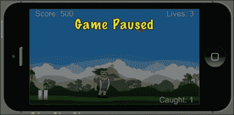
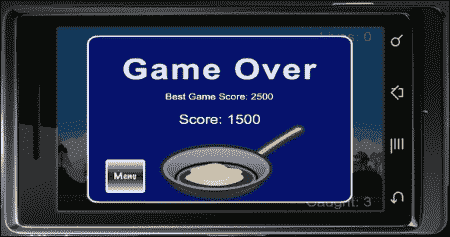
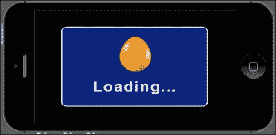
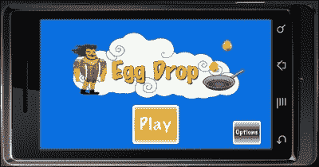
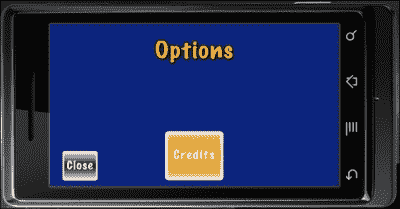
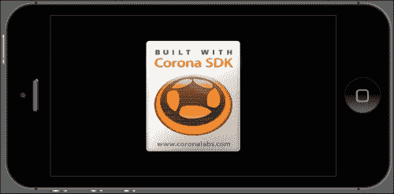

# 第八章。操作编写器

> *我们已经拍摄了我们的游戏《蛋蛋掉落》，并探索了创建游戏物理的方法，以应对碰撞检测并跟踪其他有用的数据，如生命和积分系统。我们还定制了身体，并为我们的显示对象创建了适用于游戏分数计数的名称。*

接下来，我们将添加一个菜单系统，该系统包含游戏介绍，在游戏过程中应用暂停菜单，并在游戏结束时保存高分。

我们正在完成一个具有必要元素的应用程序，为应用程序商店和谷歌 Play 商店做好准备。

在本章中，我们将:

*   保存并加载高分
*   添加暂停菜单
*   使用编辑器应用编程接口管理场景
*   添加加载屏幕
*   添加主菜单、选项菜单和信用屏幕

所以，我们走吧！

# 继续落蛋

我们已经完成了蛋蛋掉落的主要游戏部分，作为我们应用的主要基础。现在，是时候让我们包括如何在游戏中暂停动作，并保存高分了。我们还将添加一些新的场景，这将有助于我们以简单快捷的方式引入和过渡到游戏中。

在`Chapter 8`的`Resources`文件夹中，抓取里面所有的图像和文件资源，复制到你当前的`Egg Drop`项目文件夹中。您可以从 Packt 出版网站下载本书附带的项目文件。我们将使用这些文件为我们的游戏添加最后的润色。

# 数据保存

保存文件信息用于游戏开发的很多方面。我们用它来保存高分和游戏设置，比如声音开/关，锁定/解锁等级等等。没有必要拥有这些特性，但是由于它们很好，也许您希望将它们包含在您的应用程序中。

在 Corona SDK 中，应用程序是沙箱化的；这意味着您的文件(应用程序图像、数据和首选项)存储在其他应用程序无法访问的位置。您的文件将驻留在特定于应用程序的文档、资源或临时文件目录中。此限制与设备上的文件有关，而与您在 Mac 或 PC 上编码时无关。

## 用于保存和加载值的 BeebeGames 类

我们将使用由乔纳森·毕比创建的毕贝根类。它提供了许多简单实用的游戏功能。一些值得注意的功能包括一个简单的保存和加载数据的方法，我们将能够添加到我们的游戏中。关于 BeebeGames 类的更多文档可以在`Chapter 8`文件夹中找到。

### 注

也可以参考[https://github . com/lewisNotestine/Luacorona/blob/master/just atest/code/beebegames . Lua](https://github.com/lewisNotestine/luaCorona/blob/master/justATest/code/beebegames.lua)来跟踪类的更新。

如果你想在将来使用的话，你可以看看其他与动画、过渡、计时器等相关的方法。现在，我们将重点关注我们可以用来轻松保存和加载游戏值的方法。

以下是保存和加载值的示例:

```java
-- Public Method: saveValue() --> save single-line file (replace contents)

function saveValue( strFilename, strValue )
  -- will save specified value to specified file
  local theFile = strFilename
  local theValue = strValue

  local path = system.pathForFile( theFile, system.DocumentsDirectory)

  -- io.open opens a file at path. returns nil if no file found
  -- "w+": update mode, all previous data is erased
  local file = io.open( path, "w+" )
  if file then
  -- write game score to the text file
  file:write( theValue )
  io.close( file )
  end
end

-- Public Method: loadValue() --> load single-line file and store it into variable

function loadValue( strFilename )
  -- will load specified file, or create new file if it doesn't exist

  local theFile = strFilename

  local path = system.pathForFile( theFile, system.DocumentsDirectory)

  -- io.open opens a file at path. returns nil if no file found
  -- "r": read mode
  local file = io.open( path, "r" )
  if file then
    -- read all contents of file into a string
    -- "*a": reads the whole file, starting at the current position
    local contents = file:read( "*a" )
    io.close( file )
    return contents
  else
    -- create file b/c it doesn't exist yet
    -- "w": write mode
    file = io.open( path, "w" )
    file:write( "0" )
    io.close( file )
    return "0"
  end
end
```

## 获取文件路径

这些文件的路径对于您的应用程序是唯一的。要创建文件路径，可以使用`system.pathForFile`功能。该函数为应用程序生成图标文件的绝对路径，使用应用程序的资源目录作为`Icon.png`的基础目录:

```java
local path = system.pathForFile( "Icon.png", system.ResourceDirectory)
```

通常，您的文件必须位于三个可能的基本目录之一:

*   `system.DocumentsDirectory`:这应该用于需要在应用程序会话之间保持的文件。
*   `system.TemporaryDirectory`:这是临时目录。写入此目录的文件不能保证存在于后续的应用程序会话中。它们可能存在，也可能不存在。
*   `system.ResourceDirectory`:这是所有应用资产存在的目录。请注意，您永远不应该创建、修改或添加文件到这个目录。

### 注

更多关于文件的信息可以在[http://docs.coronalabs.com/api/library/system/index.html](http://docs.coronalabs.com/api/library/system/index.html)找到。

## 读取文件

要读取文件，使用`io`库。这个库允许你管理文件，给定一个绝对路径。

## 写文件

要写文件，你需要遵循许多与读取文件相同的步骤。您不是使用 read 方法，而是将数据(字符串或数字)写入文件。

# 行动时间-保存并加载高分

当**游戏结束**屏幕显示时，我们将保存并加载我们的最终得分和最高得分的值。为此，请执行以下步骤:

1.  打开我们为“蛋花”创建的`main.lua`文件。我们将继续使用相同的文件，并在游戏中加入更多的新代码。
2.  添加两个新变量`local highScoreText`和`local highScore`，所有其他初始化变量位于代码顶部附近:

    ```java
    local highScoreText
    local highScore
    ```

3.  预装声音文件后介绍`saveValue()`功能:

    ```java
      local saveValue = function( strFilename, strValue )
        -- will save specified value to specified file
        local theFile = strFilename
        local theValue = strValue

        local path = system.pathForFile( theFile, system.DocumentsDirectory )

        -- io.open opens a file at path. returns nil if no file found
        local file = io.open( path, "w+" )
        if file then
          -- write game score to the text file
          file:write( theValue )
          io.close( file )
        end
      end
    ```

4.  加入`loadValue()`功能:

    ```java
      local loadValue = function( strFilename )
        -- will load specified file, or create new file if it doesn't exist

        local theFile = strFilename

        local path = system.pathForFile( theFile, system.DocumentsDirectory )

        -- io.open opens a file at path. returns nil if no file found
        local file = io.open( path, "r" )
        if file then
          -- read all contents of file into a string
          local contents = file:read( "*a" )
          io.close( file )
          return contents
         else
          -- create file b/c it doesn't exist yet
          file = io.open( path, "w" )
          file:write( "0" )
          io.close( file )
           return "0"
        end
      end
    ```

5.  在`callGameOver()`功能结束时，创建一个`if`语句来比较`gameScore`和`highScore`。使用`saveValue()`功能

    ```java
        if gameScore > highScore then
          highScore = gameScore
          local highScoreFilename = "highScore.data"
          saveValue( highScoreFilename, tostring(highScore) )
        end
    ```

    保存最高分
6.  接下来，在相同的`callGameOver()`功能中加入的`highScoreText`显示文本，显示游戏结束时的高分:

    ```java
        highScoreText = display.newText( "Best Game Score: " .. tostring( highScore ), 0, 0, "Arial", 30 )
        highScoreText:setTextColor( 1, 1, 1 )	
        highScoreText.xScale = 0.5; highScoreText.yScale = 0.5
        highScoreText.x = 240
        highScoreText.y = 120

        gameGroup:insert( highScoreText )
    ```

7.  At the end of the `gameStart()` function, have the high score loaded by using the `loadValue()` function:

    ```java
          local highScoreFilename = "highScore.data"
          local loadedHighScore = loadValue( highScoreFilename )

          highScore = tonumber(loadedHighScore)
    ```

    

## *刚刚发生了什么？*

在初始化了游戏级别的`saveValue()`和`loadValue()`功能后，我们创建了一个`if`语句来比较`gameScore`，这是游戏过程中的当前分数，以及`highScore`，这是迄今为止累积的最高分数。当`gameScore` 的结果较高时，则替换保存的`highScore`数据。

为了保存该值，需要创建一个数据文件。我们创建了一个名为`local highScoreFilename = "highscore.data"`的变量。我们使用`highScoreFilename`作为参数调用了`saveValue()`函数。`tostring(highScore)`参数将`highScore`的数值转换为字符串。

当**游戏结束**屏幕可见时，`highScoreText`显示从`gameScore`上方的`highScore`保存的值。增加一个高分会激励玩家获得最高分，并增加游戏的重播价值。

在`gameStart()`功能中，重要的是在游戏开始时加载`highScore.data`的值。使用我们创建的相同数据文件来保存`highScore`，我们也可以在整个游戏中加载该值。要加载该值，`local highScore`调用`loadValue(highScoreFileName)`。这是从`highScore.data`获取的信息。要获得该值，`tonumber(loadedHighScore)`将其从字符串转换为整数，并可用于显示`highScore`的值。

# 暂停游戏

你有没有发现自己正在玩游戏，突然不得不上厕所或者手抽筋？显然，这些情况中的任何一种都需要你阻止你对游戏进程的关注，你需要暂时停止当前的动作来满足这些需求。这是暂停按钮派上用场的时候，这样你就可以及时停止那个动作，然后当你准备再次播放时，继续你停止的地方。

# 行动时间-暂停游戏

不仅仅是做一个按钮；它还通过执行以下步骤暂停屏幕上的所有动作，包括物理和计时器:

1.  加入`local pauseBtn`和`local pauseBG`变量，所有其他变量在代码开头附近初始化。在靠近脚本顶部的`gameOverSound`后预加载`btnSound`音频:

    ```java
    -- Place near other game variables
    local pauseBtn
    local pauseBG

    -- Place after gameOverSound
    local btnSound = audio.loadSound( "btnSound.wav" )
    ```

2.  在`hud()`功能内和`scoreText`块后，创建另一个运行暂停按钮事件的功能。调用`onPauseTouch(event)`功能。通过将`gameIsActive`设置为`false`来暂停游戏中的物理，并让暂停元素出现在屏幕上:

    ```java
        local onPauseTouch = function( event )
          if event.phase == "release" and pauseBtn.isActive then
            audio.play( btnSound )

            -- Pause the game

            if gameIsActive then

              gameIsActive = false
              physics.pause()

              local function pauseGame()
                timer.pause( startDrop )
                print("timer has been paused")
              end
              timer.performWithDelay(1, pauseGame)

              -- SHADE
              if not shade then
                shade = display.newRect( 0, 0, 570, 380 )
                shade:setFillColor( 0, 0, 0 )
                shade.x = 240; shade.y = 160
                gameGroup:insert( shade )
              end
              shade.alpha = 0.5

              -- SHOW MENU BUTTON
              if pauseBG then
                pauseBG.isVisible = true
                pauseBG.isActive = true
                pauseBG:toFront()
              end

              pauseBtn:toFront()
    ```

3.  当游戏取消暂停时，让物理再次激活并移除所有暂停显示对象:

    ```java
              else

                if shade then
                  display.remove( shade )
                  shade = nil
                end

                if pauseBG then
                  pauseBG.isVisible = false
                  pauseBG.isActive = false
                end

                gameIsActive = true
                physics.start()

                local function resumeGame()
                timer.resume( startDrop )
                print("timer has been resumed")
              end
              timer.performWithDelay(1, resumeGame)

            end
          end
        end
    ```

4.  在`onPauseTouch()`功能后添加用户界面按钮和`pauseBG` 显示对象:

    ```java
        pauseBtn = ui.newButton{
          defaultSrc = "pausebtn.png",
          defaultX = 44,
          defaultY = 44,
          overSrc = "pausebtn-over.png",
          overX = 44,
          overY = 44,
          onEvent = onPauseTouch,
          id = "PauseButton",
          text = "",
          font = "Helvetica",
          textColor = { 255, 255, 255, 255 },
          size = 16,
          emboss = false
        }

        pauseBtn.x = 38; pauseBtn.y = 288
        pauseBtn.isVisible = false
        pauseBtn.isActive = false

        gameGroup:insert( pauseBtn )

        pauseBG = display.newImageRect( "pauseoverlay.png", 480, 320 )
        pauseBG.x = 240; pauseBG.y = 160
        pauseBG.isVisible = false
        pauseBG.isActive = false

        gameGroup:insert( pauseBG )
    ```

5.  为了让`pauseBtn`在游戏过程中显示，在`gameActivate()`功能中使其可见并激活:

    ```java
        pauseBtn.isVisible = true
        pauseBtn.isActive = true
    ```

6.  When the game is over, disable `pauseBtn` in the `callGameOver()` function Place the code right after the `physics.pause()` line:

    ```java
        pauseBtn.isVisible = false
        pauseBtn.isActive = false
    ```

    

## *刚刚发生了什么？*

我们创建了`onPauseTouch(event)`功能来控制游戏中发生的所有暂停事件。为了暂停游戏中的所有动作，我们将`gameIsActive`的布尔型改为`false`，并使用`physics.pause()`功能来阻止所有落下的鸡蛋移动。接下来，`startDrop`定时器暂停，这样只要暂停功能仍然有效，从天而降的鸡蛋就不会随着时间的推移而堆积。

当按下暂停按钮时，会调用一个名为`shade`的稍微透明的覆盖。这将阻止对游戏场景的关注，并允许用户区分游戏何时不活跃。

**游戏暂停**横幅也显示在屏幕顶部，使其可见且活跃。`pauseBG`对象被`pauseBG:toFront()`推到显示层次的前面。

为了解开游戏，我们颠倒了暂停显示项目出现的过程。第二次按下 `pauseBtn`时，`shade`被`display.remove(shade); shade = nil`带走。`pauseBG.isVisible`和`pauseBG.isActive`属性都设置为`false`。

记住，我们之前已经将`gameIsActive`设置为`false`好了，现在是时候将它设置回真了。这也意味着和`physics.start()`一起恢复物理。定时器由`resumeGame()`本地功能恢复，并在该功能内调用`timer.resume(startDrop)`。

`pauseBtn`和`pauseBG`显示对象插入到`if`语句块的末尾。一旦游戏可玩，则`pauseBtn`对象显示为可见且活动的。当**游戏结束**屏幕出现时，它是不可见和不活动的，因此当游戏结束时，没有其他触摸事件可以干扰。

# 作曲家 API

Composer API 为开发人员提供了一个简单的解决方案来控制有无过渡的场景。这是一个很棒的场景管理库，可以显示菜单系统，甚至管理游戏中的多个关卡。Composer 还附带了各种过渡效果。更多信息可以在[http://docs.coronalabs.com/api/library/composer/index.html](http://docs.coronalabs.com/api/library/composer/index.html)的科罗纳文档中找到。

我们的场景管理将类似于[显示的场景模板。](http://docs.coronalabs.com/api/library/composer/index.html#scene-template)

## 使用 Composer API 进行游戏开发

你可能想知道我们将如何应用《蛋花作曲家》。真的很简单。我们将不得不修改游戏代码中的一些行，使其与 Composer 兼容，并为游戏显示前应用的菜单系统创建一些新场景。

# 行动时间-修改游戏文件

我们将把我们当前的`main.lua`文件重命名为`maingame.lua`，并在我们的游戏代码中增加一些额外的行。请务必在您的`Egg Drop`项目文件夹中更改文件名。要重命名文件，请按照下列步骤操作:

1.  删除代码顶部附近的以下行。我们将在本章稍后创建的另一个场景中隐藏状态栏。`gameGroup`显示组将被更改以符合作曲者参数:

    ```java
    display.setStatusBar( display.HiddenStatusBar )
    local gameGroup = display.newGroup()
    ```

2.  在代码的最顶端，通过添加`local composer = require( "composer" )`和`local scene = composer.newScene()`来实现 Composer，这样我们就可以将场景事件称为:

    ```java
    local composer = require( "composer" )
    local scene = composer.newScene()
    ```

3.  在`local loadValue = function( strFilename )`之后，加入`create()`事件。我们也将添加回我们的`gameGroup`显示组，但是在场景的视图属性下。另外，加入`composer.removeScene( "loadgame" )`。`"loadgame"`场景将在本章后面介绍:

    ```java
    -- Called when the scene's view does not exist:
    function scene:create ( event )
      local gameGroup = self.view

      -- completely remove loadgame's view
      composer.removeScene( "loadgame" )

      print( "\nmaingame: create event")
    end
    ```

4.  在`create()`事件之后，创建`show()`事件并将其添加到`gameActivate()`功能之前。`show()`活动将在屏幕上过渡我们所有的游戏功能。将`gameGroup`也包括在场景的视图属性中:

    ```java
    -- Called immediately after scene has moved onscreen:
    function scene:show( event )
      local gameGroup = self.view
    ```

5.  在`gameStart()`功能后，删除`return gameGroup`线:

    ```java
    return gameGroup -- Code will not run if this line is not removed 
    ```

6.  接下来，用`end` :

    ```java
      print( "maingame: show event" )

    end
    ```

    关闭`function scene: show( event )`
7.  创建`hide()`和`destroy()`事件:

    ```java
    -- Called when scene is about to move offscreen:
    function scene:hide( event )

      print( "maingame: hide event" )

    end

    -- Called prior to the removal of scene's "view" (display group)
    function scene:destroy( event )

      print( "destroying maingame's view" )

    end 
    ```

8.  最后，为所有场景事件创建事件监听器，并在代码末尾添加【T0:

    ```java
    -- "create" event is dispatched if scene's view does not exist
    scene:addEventListener( "create", scene )

    -- "show" event is dispatched whenever scene transition has finished
    scene:addEventListener( "show", scene )

    -- "hide" event is dispatched before next scene's transition begins
    scene:addEventListener( "hide", scene )

    -- "destroy" event is dispatched before view is unloaded, which can be
    scene:addEventListener( "destroy", scene )

    return scene 
    ```

## *刚刚发生了什么？*

使用 Composer API 将帮助我们更容易、更快地过渡场景。每次想要加载新场景到视图中，都需要添加`require("composer")`。`local scene = composer.newScene()`语句允许我们调用场景事件、`create()`、`show()`、`hide()`和`destroy()`。

在游戏代码的最后，我们为所有场景事件和`return scene`添加了事件监听器。

使用 Composer 管理每个场景的格式类似于前面的代码。当`create()` 和`show()`事件显示一个场景时，大部分游戏代码都会被调度。当您想要清理或卸载听众、音频、资产等时，会使用`hide()`和`destroy()`事件。

# 组织比赛

我们已经习惯了将`main.lua`作为我们的主要源文件来展示我们游戏代码的每一个细节。是时候在 Composer API 的帮助下高效地组织它了。

# 行动时间-添加新的 main.lua 文件

当使用 Composer 时，我们的`main.lua`文件仍然至关重要，因为这是 Corona SDK 在模拟器中启动应用程序的第一件事。我们将添加一些代码行来改变我们游戏的场景:

1.  创建一个名为`main.lua`的全新文件，让我们将其重新添加到状态栏中:

    ```java
    display.setStatusBar( display.HiddenStatusBar )
    ```

2.  导入 Composer 并加载第一个名为`loadmainmenu`的场景。我们将在接下来的几节中创建这个场景:

    ```java
    -- require controller module
    local composer = require ( "composer" )

    -- load first screen
    composer.gotoScene( "loadmainmenu" )
    ```

## *刚刚发生了什么？*

为了在整个应用程序中包含 Composer，我们调用了`local composer = require ( "composer" )`模块。场景将通过`composer.gotoScene( "loadmainmenu" )`改变，这是一个引导用户进入主菜单屏幕的加载屏幕。

# 新游戏过渡

现在我们已经引入了 Composer API，我们可以应用一些期待已久的过渡，这对我们的游戏会有所帮助。一种方法是在游戏结束后退出游戏。

# 行动时间——游戏结束后换屏

现在我们已经重命名了我们的游戏文件，让我们添加一个场景过渡，这样一旦游戏结束，我们的游戏就不会停留在**游戏**T3 屏幕上。要更改屏幕，请执行以下步骤:

1.  In our `maingame.lua` file, add in a new variable called `local menuBtn`, where all the other variables are initialized in the beginning of the code. Inside the `callGameOver()` function, add the following lines after the `highScoreText` code:

    ```java
        local onMenuTouch = function( event )
          if event.phase == "release" then
            audio.play( btnSound )
            composer.gotoScene( "mainmenu", "fade", 500  )

          end
        end

        menuBtn = ui.newButton{
          defaultSrc = "menubtn.png",
          defaultX = 60,
          defaultY = 60,
          overSrc = "menubtn-over.png",
          overX = 60,
          overY = 60,
          onEvent = onMenuTouch,
          id = "MenuButton",
          text = "",
          -- Can use any font available per platform
          font = "Helvetica",   
          textColor = { 255, 255, 255, 255 },
          size = 16,
          emboss = false
        }

        menuBtn.x = 100; menuBtn.y = 260

        gameGroup:insert( menuBtn )
    ```

    

## *刚刚发生了什么？*

在中，为了在屏幕上切换出游戏，创建了一个菜单按钮来改变场景。在`onMenuTouch()`功能中，释放按钮后，我们称之为`composer.gotoScene( "mainmenu", "fade", 500 )`。这将允许应用程序在 500 毫秒内使用渐变过渡到主菜单，我们将在本章后面创建渐变。

## 玩个围棋英雄——重启游戏

既然你已经很清楚 Composer API 是如何处理变化的场景并使用 UI 按钮在它们之间转换的，那么创建一个在游戏结束屏幕出现后重启游戏的按钮怎么样？到目前为止，一旦游戏结束，应用程序允许用户返回菜单屏幕。

在`callGameOver()` 功能中，需要创建一个新的本地功能，该功能将使用用户界面按钮系统运行一个事件，以使用 Composer 更改场景。请注意，如果您当前在同一个场景中，则不能调用该场景。

# 创建加载屏幕

加载屏幕提供程序正在加载的反馈。这有助于通知用户下一个屏幕正在运行，这样他们就不会认为应用程序已经崩溃，尤其是在下一个屏幕加载大量数据的情况下。

# 行动时间-添加加载屏幕

我们将在应用程序启动时和游戏开始前放置加载屏幕。这告诉用户更多的内容或信息正在路上。

1.  在项目文件夹中创建一个名为`loadmainmenu.lua`的新文件。
2.  导入 Composer 并加入`composer.newScene()`功能:

    ```java
    local composer = require( "composer" )
    local scene = composer.newScene()
    ```

3.  创建两个名为`myTimer`和`loadingImage`的局部变量。加入`create()`事件和一个`sceneGroup`显示组:

    ```java
    local myTimer
    local loadingImage

    -- Called when the scene's view does not exist:
    function scene:create( event )
      local sceneGroup = self.view

      print( "\nloadmainmenu: create event" )
    end
    ```

4.  创建`show()`事件并添加一个`sceneGroup`显示组:

    ```java
      -- Called immediately after scene has moved onscreen:
    function scene:show( event )
      local sceneGroup = self.view

      print( "loadmainmenu: show event" )
    ```

5.  介绍的`loadingImage`显示对象:

    ```java
      loadingImage = display.newImageRect( "loading.png", 480, 320)
      loadingImage.x = 240; loadingImage.y = 160
      sceneGroup:insert( loadingImage )
    ```

6.  创建另一个名为`goToMenu()`的本地函数，并调用`composer.gotoScene( "mainmenu", "zoomOutInFadeRotate", 500 )`将场景更改为`"mainmenu"` :

    ```java
        local goToMenu = function()
          composer.gotoScene( "mainmenu", "zoomOutInFadeRotate", 500)
        end
    ```

7.  使用`timer`功能，让它每 1000 毫秒调用一次`goToMenu()`。用`myTimer`定时器标识定义。用`end` :

    ```java
        myTimer = timer.performWithDelay( 1000, goToMenu, 1 )
      end
    ```

    结束`show()`事件
8.  调用`hide()`和`destroy()`事件。在`hide()`事件中，取消`myTimer` :

    ```java
    -- Called when scene is about to move offscreen:
    function scene:hide()

      if myTimer then timer.cancel( myTimer ); end

      print( "loadmainmenu: hide event" )

    end

    -- Called prior to the removal of scene's "view" (display group)
    function scene:destroy( event )

      print( "destroying loadmainmenu's view" )
    end
    ```

9.  为所有场景事件和`return scene`添加事件监听器。保存并关闭文件:

    ```java
    -- "create" event is dispatched if scene's view does not exist
    scene:addEventListener( "create", scene )

    -- "show" event is dispatched whenever scene transition has finished
    scene:addEventListener( "show", scene )

    -- "hide" event is dispatched before next scene's transition begins
    scene:addEventListener( "hide", scene )

    -- "destroy" event is dispatched before view is unloaded, which can be
    scene:addEventListener( "destroy", scene )

    return scene
    ```

10.  Create a new file called `loadgame.lua` in your project folder. We'll make another loading screen that occurs right before the game scene, `maingame.lua`. Use `composer.gotoScene( "maingame", "flipFadeOutIn", 500 )` to transition scenes. Save and close your file:

    ```java
    local composer = require( "composer" )
    local scene = composer.newScene()

    local myTimer
    local loadingImage

    -- Called when the scene's view does not exist:
    function scene:create( event )
      local sceneGroup = self.view

      -- completely remove mainmenu
      composer.removeScene( "mainmenu" )

      print( "\nloadgame: create event" )
    end

    -- Called immediately after scene has moved onscreen:
    function scene:show( event )
      local sceneGroup = self.view

      print( "loadgame: show event" )

      loadingImage = display.newImageRect( "loading.png", 480, 320)
      loadingImage.x = 240; loadingImage.y = 160
      sceneGroup:insert( loadingImage )

      local changeScene = function()
        composer.gotoScene( "maingame", "flipFadeOutIn", 500 )
      end
      myTimer = timer.performWithDelay( 1000, changeScene, 1 )

    end

    -- Called when scene is about to move offscreen:
    function scene:hide()

      if myTimer then timer.cancel( myTimer ); end

      print( "loadgame: hide event" )

    end

    -- Called prior to the removal of scene's "view" (display group)
    function scene:destroy( event )

      print( "destroying loadgame's view" )
    end

    -- "create" event is dispatched if scene's view does not exist
    scene:addEventListener( "create", scene )

    -- "show" event is dispatched whenever scene transition has finished
    scene:addEventListener( "show", scene )

    -- "hide" event is dispatched before next scene's transition begins
    scene:addEventListener( "hide", scene )

    -- "destroy" event is dispatched before view is unloaded, which can be
    scene:addEventListener( "destroy", scene )

    return scene
    ```

    

## *刚刚发生了什么？*

在`loadmainmenu.lua`文件中，一旦`loadingImage`被添加到屏幕上，我们创建了`goToMenu()`功能来将场景更改为`"mainmenu"`，并使用`"zoomOutInFadeRotate"`过渡来缩小和旋转加载的屏幕图像，使其淡出背景。`myTimer = timer.performWithDelay( 1000, goToMenu, 1 )`语句在 1000 毫秒(一秒)内执行该功能并运行一次。这足够长，可以查看图像并使其淡出。

所有显示对象通过`function scene:show( event )`进入场景。`loadingImage`对象放置在 `sceneGroup`中。为了确保场景切换后没有计时器在运行，使用`function scene:hide()`下的`timer.cancel(myTimer)` 停止运行`myTime` r。

`loadgame.lua`的代码类似于`loadmainmenu.lua`。对于此文件，Composer 将场景过渡到游戏播放文件`maingame.lua`。

# 创建主菜单

主菜单或标题屏幕是玩家在玩游戏之前看到的第一印象之一。它通常显示与实际游戏相关的图像或场景的小片段，并显示应用程序的标题。

有**开始**或**播放**等按钮，如果玩家选择进入游戏，会催促玩家进入游戏，还有一些辅助按钮，如**选项**查看设置和其他信息。

# 行动时间-添加主菜单

我们将通过引入游戏标题和**播放**和**选项**按钮来创建我们游戏的前端，这些按钮将在应用程序的不同场景中轻松过渡。

1.  创建一个名为`mainmenu.lua`的新文件，并导入 Composer 和 UI 模块、`composer.newScene()`函数以及定时器和音频的变量:

    ```java
    local composer = require( "composer" )
    local scene = Composer.newScene()

    local ui = require("ui")

    local btnAnim

    local btnSound = audio.loadSound( "btnSound.wav" )
    ```

2.  创建`create()`事件。加入`composer.removeScene( "maingame" )` 和 `composer.removeScene( "options" )`行，去掉`"maingame"`和`"options"`场景。玩家从游戏主屏幕过渡到主菜单屏幕后，可以移除`"maingame"` 。当玩家从选项屏幕转移到主菜单屏幕后，您可以移除`"options"` :

    ```java
    -- Called when the scene's view does not exist:
    function scene:create( event )
      local sceneGroup = self.view

      -- completely remove maingame and options
      composer.removeScene( "maingame" )
      composer.removeScene( "options" )

      print( "\nmainmenu: create event" )
    end
    ```

3.  加入`show()`事件和`backgroundImage`显示对象；

    ```java
    -- Called immediately after scene has moved onscreen:
    function scene:show( event )
      local sceneGroup = self.view

      print( "mainmenu: show event" )

      local backgroundImage = display.newImageRect( "mainMenuBG.png", 480, 320 )
      backgroundImage.x = 240; backgroundImage.y = 160
      sceneGroup:insert( backgroundImage )
    ```

4.  引入`playBtn`显示对象，创建一个名为`onPlayTouch(event)`的函数，使用`composer.gotoScene()`将场景更改为`"loadgame"`。使用`"fade"`效果改变场景:

    ```java
      local playBtn

      local onPlayTouch = function( event )
        if event.phase == "release" then

          audio.play( btnSound )
          composer.gotoScene( "loadgame", "fade", 300  )

        end
      end

      playBtn = ui.newButton{
        defaultSrc = "playbtn.png",
        defaultX = 100,
        defaultY = 100,
        overSrc = "playbtn-over.png",
        overX = 100,
        overY = 100,
        onEvent = onPlayTouch,
        id = "PlayButton",
        text = "",
        font = "Helvetica",
        textColor = { 255, 255, 255, 255 },
        size = 16,
        emboss = false
      }

      playBtn.x = 240; playBtn.y = 440
        sceneGroup:insert( playBtn )
    ```

5.  使用`easing.inOutExpo`转换，在 500 毫秒内将`playBtn`显示对象转换为 y = 260。通过`btnAnim` :

    ```java
    btnAnim = transition.to( playBtn, { time=1000, y=260, transition=easing.inOutExpo } )
    ```

    初始化
6.  引入`optBtn`显示对象，创建一个名为`onOptionsTouch(event)`的函数。使用`composer.gotoScene()`将场景过渡到`"options"`，使用`"crossFade"`效果:

    ```java
    local optBtn

      local onOptionsTouch = function( event )
        if event.phase == "release" then

          audio.play( btnSound )
          composer.gotoScene( "options", "crossFade", 300)

        end
      end

      optBtn = ui.newButton{
        defaultSrc = "optbtn.png",
        defaultX = 60,
        defaultY = 60,
        overSrc = "optbtn-over.png",
        overX = 60,
        overY = 60,
        onEvent = onOptionsTouch,
        id = "OptionsButton",
        text = "",
        font = "Helvetica",
        textColor = { 255, 255, 255, 255 },
        size = 16,
        emboss = false
      }
      optBtn.x = 430; optBtn.y = 440
      sceneGroup:insert( optBtn )
    ```

7.  使用`easing.inOutExpo`转换，在 500 毫秒内将`optBtn`显示对象转换到`y = 280`。通过`btnAnim`进行初始化。用`end` :

    ```java
      btnAnim = transition.to( optBtn, { time=1000, y=280, transition=easing.inOutExpo } )

    end
    ```

    关闭`scene:show( event )`功能
8.  创建事件并取消`btnAnim`过渡。另外，创建`destroy()`事件:

    ```java
    -- Called when scene is about to move offscreen:
    function scene:hide()

      if btnAnim then transition.cancel( btnAnim ); end

      print( "mainmenu: hide event" )

    end

    -- Called prior to the removal of scene's "view" (display group)
    function scene:destroy( event )

      print( "destroying mainmenu's view" )
    end
    ```

9.  Add the event listeners for all the scene events and for `return scene`. Save and close your file:

    ```java
    -- "create" event is dispatched if scene's view does not exist
    scene:addEventListener( "create", scene )

    -- "show" event is dispatched whenever scene transition has finished
    scene:addEventListener( "show", scene )

    -- "hide" event is dispatched before next scene's transition begins
    scene:addEventListener( "hide", scene )

    -- "destroy" event is dispatched before view is unloaded, which can be
    scene:addEventListener( "destroy", scene )

    return scene
    ```

    

## *刚刚发生了什么？*

在主菜单屏幕上，我们添加了一个显示游戏标题和**播放**和**选项**按钮的图像。此时**选项**按钮仍然不起作用。`onPlayTouch()`功能将场景转换到`"loadgame"`。这会将场景切换到`loadgame.lua`。**播放**按钮置于`x = 240`；`y = 440`(中间和屏幕外)。场景加载时，`playBtn`过渡到`y = 260`，所以 1000 毫秒从屏幕底部弹出。

**选项**按钮做类似的事情。`optBtn`对象放在舞台右侧，500 毫秒后在`y = 280`弹出。

通过`scene:hide()` 功能`transition.cancel( btnAnim )`取消`btnAnim`转换。每次更改场景时，清理计时器、转换和事件侦听器非常重要，这样在应用程序中就不会发生潜在的内存泄漏。

# 创建选项菜单

一个选项菜单允许用户更改游戏中的各种设置或包含主菜单中无法显示的其他信息。游戏可以从有很多选择到只有几个。有时，选项菜单可以被称为设置菜单，它为玩家的体验提供相同类型的定制。

# 行动时间–添加选项菜单

我们将添加一个可通过主菜单访问的选项菜单。我们将添加一个名为**积分**的新用户界面按钮，一旦按下，它将引导用户进入积分屏幕。要添加选项菜单，请执行以下步骤:

1.  创建一个名为`options.lua`的新文件，并导入 Composer 和 UI 模块、`composer.newScene()`函数以及定时器和音频的变量:

    ```java
    local composer = require( "composer" )
    local scene = composer.newScene()

    local ui = require("ui")

    local btnAnim

    local btnSound = audio.loadSound( "btnSound.wav" )
    ```

2.  创建`create()`事件。加入`composer.removeScene( "mainmenu" )`，将删除`"mainmenu"`场景。这将在播放器从主菜单屏幕转换并发送到选项屏幕后发生。接下来，加入`composer.removeScene( "creditsScreen" )`。这将在玩家从积分屏幕转换回选项屏幕后移除`"creditsScreen"`:

    ```java
    -- Called when the scene's view does not exist:
    function scene:create( event )
      local sceneGroup = self.view

      -- completely remove mainmenu and creditsScreen
      composer.removeScene( "mainmenu" )
      composer.removeScene( "creditsScreen" )

      print( "\noptions: create event" )
    end
    ```

3.  加入`show()`事件和`backgroundImage`显示对象:

    ```java
    -- Called immediately after scene has moved onscreen:
    function scene:show( event )
      local sceneGroup = self.view

      print( "options: show event" )

      local backgroundImage = display.newImageRect( "optionsBG.png", 480, 320 )
      backgroundImage.x = 240; backgroundImage.y = 160
      sceneGroup:insert( backgroundImage )
    ```

4.  为信用屏幕创建按钮。使用`easing.inOutExpo`转换，在 1000 毫秒内将`creditsBtn`显示对象转换到`y = 260`。通过`btnAnim`初始化:

    ```java
      local creditsBtn

      local onCreditsTouch = function( event )
        if event.phase == "release" then

          audio.play( btnSound )
          Composer.gotoScene( "creditsScreen", "crossFade", 300 )

        end
      end

      creditsBtn = ui.newButton{
        defaultSrc = "creditsbtn.png",
        defaultX = 100,
        defaultY = 100,
        overSrc = "creditsbtn-over.png",
        overX = 100,
        overY = 100,
        onEvent = onCreditsTouch,
        id = "CreditsButton",
        text = "",
        font = "Helvetica",
        textColor = { 255, 255, 255, 255 },
        size = 16,
        emboss = false
      }

      creditsBtn.x = 240; creditsBtn.y = 440
      sceneGroup:insert( creditsBtn )

      btnAnim = transition.to( creditsBtn, { time=1000, y=260, transition=easing.inOutExpo } )
    ```

5.  创建加载主菜单的**关闭**按钮。用`end` :

    ```java
      local closeBtn

      local onCloseTouch = function( event )
        if event.phase == "release" then
          audio.play( tapSound )
          composer.gotoScene( "mainmenu", "zoomInOutFadeRotate", 500 ) 
        end
      end

      closeBtn = ui.newButton{
        defaultSrc = "closebtn.png",
        defaultX = 60,
        defaultY = 60,
        overSrc = "closebtn-over.png",
        overX = 60,
        overY = 60,
        onEvent = onCloseTouch,
        id = "CloseButton",
        text = "",
        font = "Helvetica",
        textColor = { 255, 255, 255, 255 },
        size = 16,
        emboss = false
      }

      closeBtn.x = 50; closeBtn.y = 280
      sceneGroup:insert( closeBtn ) 
    end
    ```

    关闭`scene:show( event )`
6.  Create the `hide()` event and cancel the `btnAnim` transition. Also, create the `destroy()` event. Add the event listeners for all the scene events and the `return scene` statement. Save and close your file:

    ```java
    -- Called when scene is about to move offscreen:
    function scene:hide()

      if btnAnim then transition.cancel( btnAnim ); end

      print( "options: hide event" )

    end

    -- Called prior to the removal of scene's "view" (display group)
    function scene:destroy( event )

      print( "destroying options's view" )
    end

    -- "create" event is dispatched if scene's view does not exist
    scene:addEventListener( "create", scene )

    -- "show" event is dispatched whenever scene transition has finished
    scene:addEventListener( "show", scene )

    -- "hide" event is dispatched before next scene's transition begins
    scene:addEventListener( "hide", scene )

    -- "destroy" event is dispatched before view is unloaded, which can be
    scene:addEventListener( "destroy", scene )	

    return scene
    ```

    

## *刚刚发生了什么？*

在这个场景中，`creditsBtn`将以类似于我们主菜单创建方式的方式运行。此时**信用**按钮仍然不起作用。在`onCreditsTouch()`功能中，场景过渡到`"creditsScreen"`并使用`"crossFade"`作为效果。从屏幕外位置，`creditsBtn`在加载场景时，在 1，000 毫秒内过渡到 y=260。

为该场景创建了一个**关闭**按钮，以便用户可以返回到上一个屏幕。使用`onCloseTouch()`功能，作曲家在发布`closeBtn`时将场景更改为`"mainmenu"`。当您按下关闭按钮时，将显示主菜单屏幕。通过`scene:hide()` 功能取消`btnAnim`转换。

# 创建信用屏幕

一个积分屏幕通常会显示并列出参与游戏制作的所有人。它还可以包括其他信息，比如感谢某些个人和项目来创建最终项目。

# 行动时间-添加信用屏幕

我们将创建的信用屏幕将基于一个触摸事件，该事件会过渡到引入它的前一个屏幕。要添加信用屏幕，请执行以下步骤:

1.  创建一个名为`creditsScreen.lua`的新文件，并导入 Composer、`composer.newScene()`函数和`backgroundImage`变量:

    ```java
    local composer = require( "composer" )
    local scene = composer.newScene()

    local backgroundImage
    ```

2.  创建`create()`事件。添加`composer.removeScene("options")`行，删除`"options"`场景。这将在玩家从选项屏幕转换并被发送到积分屏幕后发生:

    ```java
    -- Called when the scene's view does not exist:
    function scene:create( event )
      local sceneGroup = self.view

      -- completely remove options
      composer.removeScene( "options" )

      print( "\ncreditsScreen: create event" )
    end
    ```

3.  加入`show()`事件和`backgroundImage`显示对象:

    ```java
    -- Called immediately after scene has moved onscreen:
    function scene:show( event )
      local sceneGroup = self.view

      print( "creditsScreen: show event" )

      backgroundImage = display.newImageRect( "creditsScreen.png", 480, 320 )
      backgroundImage.x = 240; backgroundImage.y = 160
      sceneGroup:insert( backgroundImage )
    ```

4.  用事件参数创建一个名为`changeToOptions()`的局部函数。使用`backgroundImage`上的触摸事件，使用 Composer 将场景切换回选项屏幕。用`end` :

    ```java
      local changeToOptions = function( event )
        if event.phase == "began" then

          composer.gotoScene( "options", "crossFade", 300  )

        end
      end

      backgroundImage:addEventListener( "touch", changeToOptions)
    end
    ```

    关闭`scene:show(event)`功能
5.  Create the `hide()` and `destroy()` events. Add the event listeners for all the scene events and the `return scene` statement. Save and close your file:

    ```java
    -- Called when scene is about to move offscreen:
    function scene:hide()

      print( "creditsScreen: hide event" )

    end

    -- Called prior to the removal of scene's "view" (display group)
    function scene:destroy( event )

      print( "destroying creditsScreen's view" )
    end

    -- "create" event is dispatched if scene's view does not exist
    scene:addEventListener( "create", scene )

    -- "show" event is dispatched whenever scene transition has finished
    scene:addEventListener( "show", scene )

    -- "hide" event is dispatched before next scene's transition begins
    scene:addEventListener( "hide", scene )

    -- "destroy" event is dispatched before view is unloaded, which can be
    scene:addEventListener( "destroy", scene )

    return scene
    ```

    

## *刚刚发生了什么？*

信用屏幕与事件监听器一起工作。`changeToOptions(event)`功能将告诉 Composer 使用`composer.gotoScene( "options", "crossFade", 500 )`将场景更改为`"options"` 。在功能结束时，`backgroundImage`将在触摸屏幕时激活事件监听器。`backgroundImage`对象插入`scene:show( event )` 功能下的`sceneGroup`中。鸡蛋下降现在可以使用 Composer 完全操作。在模拟器中运行游戏。您将能够过渡到我们在本章中创建的所有场景，以及玩游戏。

## 拥有一个围棋英雄——增加更多关卡

现在落蛋完成，有了工作菜单系统，通过创造更多关卡挑战自己。小的改动将不得不增加一些额外的层次。更改场景时，请记住应用 Composer。

尝试创建以下内容:

*   水平选择屏幕
*   添加附加级别的级别编号按钮

创建新级别时，请参考`maingame.lua`中显示的格式。新的关卡可以通过改变鸡蛋从天而降的间隔来改变，或者增加其他掉落但必须躲开的游戏资产来避免受到惩罚。有这么多的可能性添加你自己的旋转这个游戏框架。试试看！

## 突击测验–游戏过渡和场景

Q1。用 Composer 换场景调用什么函数？

1.  `composer()`
2.  `composer.gotoScene()`
3.  `composer(changeScene)`
4.  以上都不是

Q2。什么函数可以将任何参数转换成数字或零？

1.  `tonumber()`
2.  `print()`
3.  `tostring()`
4.  `nil`

Q3。如何暂停计时器？

1.  `timer.cancel()`
2.  `physics.pause()`
3.  `timer.pause( timerID )`
4.  以上都不是

Q4。如何恢复计时器？

1.  `resume()`
2.  `timer.resume( timerID )`
3.  `timer.performWithDelay()`
4.  以上都不是

# 总结

恭喜你！我们有一个完整的游戏，可以进入应用商店或谷歌 Play 商店。当然，我们不会使用这种精确的游戏，但是你已经学到了足够的知识来创建一个。完成游戏框架是一项伟大的成就，尤其是在创建如此简单的东西所花费的短暂时间内。

以下是您在本章中学到的一些技巧:

*   使用 saveValue()和 loadValue()保存高分
*   了解如何暂停物理/计时器
*   显示暂停菜单
*   使用作曲者应用编程接口更改场景
*   使用加载屏幕创建场景之间的过渡
*   使用主菜单介绍游戏标题和子菜单

在这一章中，我们实现了一个重要的里程碑。我们在前面几章中讨论的所有内容都适用于这个示例游戏。最棒的是，我们花了不到一天的时间开发代码。另一方面，艺术资产是另一回事。

关于 Corona SDK 的能力，我们还有一些东西需要学习。在下一章中，我们将更详细地介绍如何针对高分辨率设备优化我们的游戏资产。我们还将看到如何通过您的应用程序在脸书和推特上发布消息。