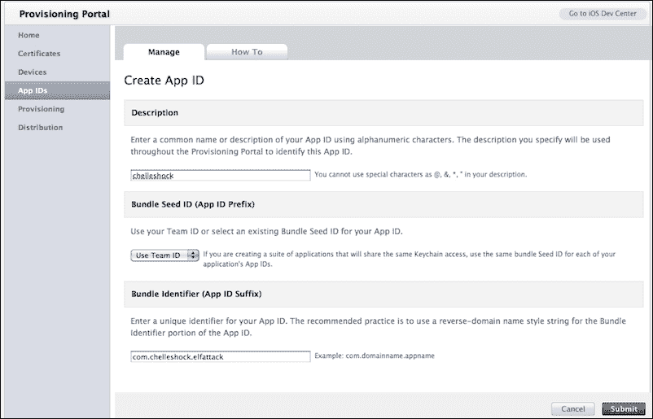
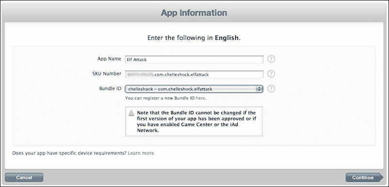
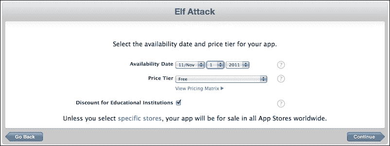
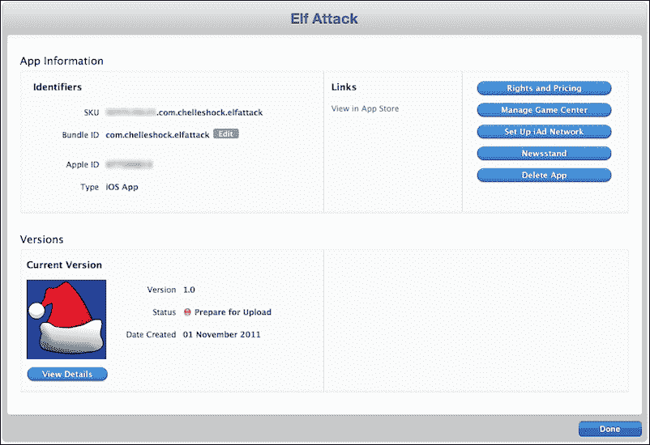
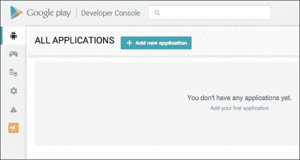
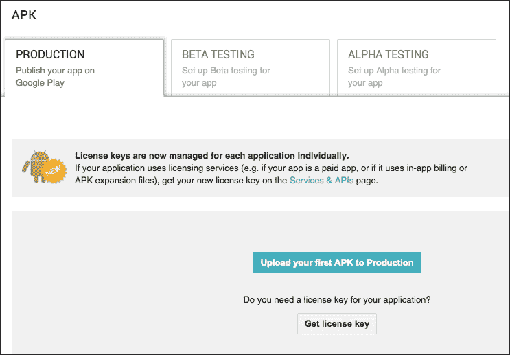
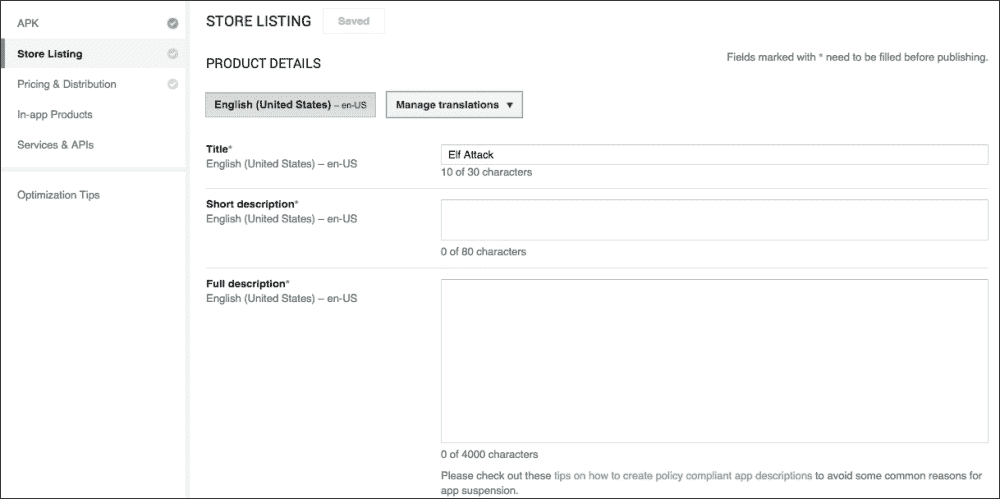
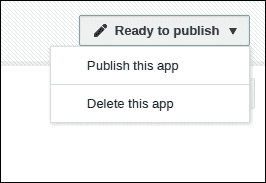

# 十、优化、测试和交付您的游戏

> *把一个游戏开发到完成的地步，是一个很大的成就。它离与世界其他地方分享又近了一步，这样其他人就可以玩你的新游戏了。用 Corona SDK 创建游戏的好处是，您可以选择为 iOS 和/或安卓构建。您希望确保您的应用已准备好提交，以便可以在您正在开发的移动平台中分发。我们将讨论为你的游戏发行做准备的过程。*

### 注

这里使用的应用界面经常更新；但是，无论您使用什么界面，您都可以执行所有步骤。

在本章中，我们将涵盖以下主题:

*   提高应用的性能
*   为应用商店设置分发设置配置文件
*   管理 iTunes Connect 中的应用信息
*   了解如何向应用商店的应用加载器提交应用
*   为安卓系统签署应用
*   了解如何向谷歌 Play 商店提交申请

# 理解记忆效率

当您开发应用时，您应该始终考虑您的设计选择如何影响应用的性能。尽管计算能力和内存有所提高，但设备内存仍有其局限性。设备内的性能和优化不仅可以实现更快的响应时间，还有助于最大限度地减少内存使用并延长电池寿命。可以在[https://gist.github.com/JesterXL/5615023](https://gist.github.com/JesterXL/5615023)找到如何检查内存使用情况的示例的链接。

内存是移动设备上的重要资源。当消耗太多内存时，设备可能会在您最意想不到的时候被迫退出您的应用。以下是开发时需要注意的一些事项:

*   **消除内存泄漏**:允许泄漏存在意味着在应用中有额外使用的内存，占用宝贵的空间。即使 Lua 实现了自动内存管理，内存泄漏仍然可能发生在您的代码中。例如，当您向应用中引入全局变量时，您的工作是告诉 Lua 何时不再需要它们，以便释放内存。这是通过在代码中使用`nil`(`myVariable = nil`)来完成的。
*   **显示图像应该尽可能的小文件大小**:你可能希望场景中有很多显示图像，但是它们可能会占用太多的纹理内存。雪碧表会消耗你应用的内存。它们应该尽可能方便地创建小，并有适当数量的帧来清晰地演示动画。对于您显示的所有项目，计划哪些元素始终在您的背景和前景中。如果有一种方法可以将几个图像组合在一起，这样它们就不会移动，那么就这样做。添加多张显示图片会节省一些内存。
*   **不要一次加载你所有的资源**:避免加载资源文件，直到真正需要它们。这将有助于节省内存，并防止您的应用在试图一次加载太多东西时崩溃。
*   **Remove objects from the display hierarchy**: When a display object is created, it is implicitly added to a display hierarchy. When you no longer need a display object, you should remove it from the display hierarchy, especially when the objects contain images. This can be done using `display.remove( myImage ); myImage = nil` or `myImage:removeSelf()`.

    这里有一个例子:

    ```java
    local box = display.newRect( 0, 50, 100, 100)
    box:setFillColor( 1, 1, 1)
    box.alpha = 1

    local function removeBox()
      if box.alpha == 1 then
        print("box removed")
        display.remove( box )
        box = nil
      end
    end
    timer.performWithDelay( 1000, removeBox, 1 ) -- Runs timer to 1000 milliseconds before calling the block within removeBox()
    ```

*   **声音文件应该做得尽可能小**:使用一个免费的程序，比如 Audacity at，或者你喜欢的音频软件来压缩音乐或者音效并为设备构建。最好将未接触的音频与压缩音频进行比较，以了解质量差异。这将帮助您确定声音质量和文件大小之间的良好中间值。

## 图形

显示如果不注意一下子使用的图像的大小和数量，图像会占用大量的纹理内存。

### 分组对象

如果几个对象的属性设置为相同的值，最好将这些对象添加到一个组中，然后修改该组的属性。这将使你更容易编码，并优化你的动画。

### 关闭不使用的动画

很容易忘记在不需要动画时或者当你使它们不可见时停止动画在后台运行。

当你包含一个监听器如`"enterFrame"`并且在监听器下注册的对象已经被设置为`.isVisible = false`时，它将继续在后台运行，即使在屏幕上看不到它。确保侦听器在不需要时被移除。

### 优化图像尺寸

当你有大文件大小，尤其是全屏图像时，你的应用的响应速度会因为加载时间而变慢，另外，它会占用大量内存。使用大图像时，尝试使用图像编辑工具尽可能压缩文件大小，例如 Photoshop 或 ImageOptim([https://imageoptim.com](https://imageoptim.com))。这将有助于减少文件大小，并为您节省应用延迟的痛苦。从长远来看，压缩大的图像尺寸对你有好处。如果图像是背景，请考虑切换到平铺图像。

# 分发 iOS 应用

一旦你的游戏最终调试完成，接下来会怎样？假设您已经在 iOS 开发者计划中注册，在将应用提交到应用商店之前，必须遵循一些指导原则。

## 准备好你的应用图标

您的应用图标需要各种图像大小和命名约定，具体取决于您的应用是为哪些 iOS 设备开发的。在苹果开发者网站[https://Developer . Apple . com/library/iOS/documentation/user experience/conceptive/mobile hig/appicons . html #//Apple _ ref/doc/uid/TP 40006556-CH19-SW1](https://developer.apple.com/library/ios/documentation/UserExperience/Conceptual/MobileHIG/AppIcons.html#//apple_ref/doc/uid/TP40006556-CH19-SW1)可以找到 iOS 人机界面指南**图标和图像设计**部分 **App Icon** 小节下的最新信息。

以下是 app 图标要求，也需要是非插入`.png`格式:

*   `iTunesArtwork@2x`:这是一张 1024 x 1024 px 的图片。此图像需要删除`.png`扩展名。
*   `Icon-60@2x.png`:这是一张 120 x 120 px 的图片，用于 Retina iPhone。
*   `Icon-60@3x.png`:这是一张 180 x 180 px 的图片，用于 iPhone 6 Plus。
*   `Icon-76.png`:这是一张 76 x 76 px 的图片，用于 iPad。
*   `Icon-76@2x.png`:这是一张 152 x 152 px 的图片，用于 Retina iPad。
*   `Icon-Small-40.png`:这是一张 40 x 40 px 的图片，用于 iPad 2 和 iPad mini 搜索。
*   `Icon-Small-40@2.png`:这是一张 80 x 80 px 的图片，用于 Retina iPhone/iPad 搜索。
*   `Icon-Small-40@3x.png`:这是一张 120 x 120 px 的图片，用于 iPhone 6 Plus 搜索。
*   `Icon-Small.png`:这是一张 29 x 29 px 的图片，用于 iPad 2 和 iPad mini 的设置。
*   `Icon-Small@2x.png`:这个是 58 x 58 px 的图片，用于 Retina iPhone/iPad 设置。
*   `Icon-Small@3x.png`:这是一张 87 x 87 px 的图片，用于 iPhone 6 Plus 的设置。

在您的`build.settings`文件中，您需要包含您在应用中构建的所有设备的图标引用。以下是在创建通用版本时如何设置文件的示例:

```java
settings =
{
  orientation =
  {
    default = "landscapeRight", 
  },

  iphone =
    {
       plist =
       {
         CFBundleIconFiles = {
           "Icon-60@2x.png",
           "Icon-60@3x.png",
           "Icon-76.png",
           "Icon-76@2x.png",
           "Icon-Small-40.png",
           "Icon-Small-40@2x.png",
           "Icon-Small-40@3x.png",
           "Icon-Small.png",
           "Icon-Small@2x.png",
           "Icon-Small@3x.png",
         },

       },
    },

}
```

您不需要在`plist`中包含`iTunesArtwork@2x`图像，但请确保它已插入到应用的基础项目文件夹中。

# 行动时间-为应用商店设置您的分发证书和供应配置文件

我们专注于创建开发证书和配置文件，以在设备上测试和调试我们的应用。现在，我们必须创建它们的分发版本，以便提交 iOS 应用。请注意，苹果可以随时更改他们网站的设计。因此，如果步骤和截图不匹配，不要沮丧:

1.  Log in to your Apple Developer account and go to **Certificates, Identifiers, & Profiles**. Click on **App IDs**. Create a new App ID by selecting the **+** icon in the upper-right corner and create a description that pertains to your application so that you can identify it. If you have an existing App ID that you have been using during development, you can disregard this step.

    

2.  单击**供应配置文件**下的**配送**上的。选择 **+** 按钮，在**分发**部分选择**应用商店**。按**继续**。
3.  选择您想要与文件关联的应用标识，点击**继续**。接下来，选择将与您的配置文件关联的证书，并单击**继续**。
4.  为您的供应配置文件提供一个配置文件名称，并选择**生成**按钮。
5.  在下一个屏幕上，点击**下载**按钮，双击文件将其安装到您的机器上。

## *刚刚发生了什么？*

您使用的应用标识对于识别将要提交的应用至关重要。最好有一个唯一的反向域样式字符串。确保为 Corona 应用创建明确的应用标识。不要使用通配符应用标识。

为了为应用商店分发，您需要创建一个应用商店分发配置文件和一个生产证书。不接受任何发展概况。该过程类似于制作开发配置文件和开发证书。

您可以在苹果开发者网站上找到更多关于分发配置文件的信息，网址为[。](https://developer.apple.com/ios/manage/distribution/index.action)

# iTunes 连接

iTunes Connect 是一套基于网络的工具，允许您提交和管理应用，以便在应用商店上分发。在 iTunes Connect 中，您将能够检查您的合同状态；设置您的税务和银行信息；获取销售和财务报告；请求促销代码；并管理用户、应用、元数据和应用内购买目录。

## 合同、税收和银行业务

如果你打算出售你的应用，你需要有一个付费的商业协议，这样它就可以发布到应用商店。你必须申请一份关于 iOS 付费应用的合同。所有这些都是通过**合同**、**税务**和**银行**链接下的 iTunes Connect 完成的。

在申请合同时，请注意可能发生的潜在问题，例如苹果首次处理您的信息时的延迟和/或在 iTunes Connect 中更改您当前的联系信息时的问题(即，如果您已经移动到不同的位置，请更改地址)。您有责任定期联系苹果寻求支持，以确保您的合同中的信息始终是最新的。

# 行动时间-在 iTunes Connect 中管理您的应用

我们现在将讨论如何在 iTunes Connect 中设置我们的应用信息。您想要设置的任何其他与用户帐户、合同和银行业务相关的信息都可以在[https://developer.apple.com/app-store/review/](https://developer.apple.com/app-store/review/)找到。

1.  Log in to iTunes Connect at [http://itunesconnect.apple.com/](http://itunesconnect.apple.com/). Your login information is the same as your iOS Developer account. Once logged in, select **Manage Your Applications**. Click on the **Add New App** button. **App** **Name** is the name of your application. **SKU Number** is a unique alphanumeric identifier for the app. **Bundle ID** is the one you created in the iOS Provisioning Portal. Fill in the information and click on **Continue**:

    

2.  The next step is to select the date on which you want your application to be live in the App Store and **Price Tier** that you want to charge. There is an optional checkbox for **Discount for Educational Institutions**. This is only if you want your app to be discounted for educational institutions that want to purchase multiple copies at the same time. Click on **Continue** when done:

    

3.  Next, fill in the **Metadata** section about your application. This includes the version number, description of your game, categories, keywords pertaining to your app, copyright, contact information, and support URL:

    

4.  The **Rating** section is based on the content of your application. For each description, choose the level of frequency that best describes your app. There are certain content types that will result in automatic rejection, such as realistic violence portrayed in your app or personal attacks to a target individual or group. You can learn more about *App Store Review Guidelines* at [https://developer.apple.com/appstore/resources/approval/guidelines.html](https://developer.apple.com/appstore/resources/approval/guidelines.html).

    

5.  正如前面在**上传**部分所讨论的，您将需要一个大版本的应用图标，即应用中内容的 iPhone/iPod Touch 截图和 iPad 截图(如果您的应用在 iPad 上运行)。
6.  You will be greeted with a page summary of your application information. Check to make sure that the information displayed is correct and then click on **Done**:

    

7.  You will be sent back to your version details page. Notice a button that says **Ready to Upload Binary**. Click on the button, and you will be required to answer a couple of questions about **Export** **Compliance**. Once completed, you will have the permission to upload your binary through **Application** **Loader**.

    

## *刚刚发生了什么？*

iTunes Connect 是您将应用分发到应用商店时从现在开始管理应用的地方。您想要显示的关于应用的每一条信息都是通过 iTunes Connect 完成的。

一旦你进入**应用信息**部分，确保你的 **SKU 号码**是唯一的，并且它与你的应用相关，这样你可以在以后识别它。此外，请确保您为您的应用指定的**捆绑包** **标识是正确的。**

**权限和定价**部分中的应用可用性控制着您希望应用在获得批准后何时上线。从你提交的时候算起，最好在未来几周内确定一个日期。只要提交没有问题，从**下的** **审核**到**准备** **进行** **销售**可能需要几天到几周的时间。价格层是您为应用设置价格的地方，也可以设置为**免费**。您可以点击**查看定价矩阵**来确定您销售应用的目标价格。

**元数据**部分中的信息是客户将在应用商店中看到的。**评级**部分涉及苹果内容描述。确保频率水平尽可能接近应用的内容。

在**上传**部分，您可以包含您的 1024 x 1024 px 应用图标和最适合您的应用视觉的截图。确保您提供了正确的图像尺寸。一旦您返回到**应用信息**屏幕，您会注意到状态显示为**准备上传**。当您点击**版本详情**页面的**准备上传二进制**按钮时，您将回答关于**出口符合性**的问题。不久后，状态将变为**等待上传**。

更多关于 iTunes Connect 的信息可以在[http://developer.apple.com/library/ios/iTunesConnectGuide](http://developer.apple.com/library/ios/iTunesConnectGuide)找到。

# 构建一个 iOS 应用，用于在 Corona 进行分发

我们已经到了将您的 iOS 应用提交到应用商店的最后阶段。假设您已经测试了您的应用，并使用您的开发配置文件对其进行了调试，那么您已经准备好创建一个分发版本，该版本将创建您的应用的二进制 ZIP 文件。

# 行动时间——构建您的应用并将其上传到应用加载器

时间到为 iOS 发行版创建最终的游戏构建，并将其上传到 Application Loader，供苹果董事会审查。

1.  Launch the Corona simulator, navigate to the application project folder, and run it. Go to the Corona simulator menu bar and then to **File** | **Build** | **iOS**. Fill in all your application details. Make sure that your **Application Name** and **Version** fields match what is displayed in your iTunes Connect account. Choose **Device** to build an app bundle. Next, select the target device (iPhone or iPad) your app is created for from the **Supported Devices** drop-down menu. Under the **Code Signing Identity** drop-down menu, choose the **Distribution** **Provisioning** **Profile** option you created in the iOS Provisioning Portal. In the **Save to folder** section, click on **Browse** and choose where you would like your application to be saved. Click on the **Build** button when done:

    

2.  编译完构建后，您将看到一个显示，表明您的应用已准备好进行分发。选择**上传至应用商店**按钮。
3.  当**欢迎使用应用加载器**窗口弹出时，用你的 iTunes Connect 信息登录。然后，您将被带到另一个窗口，选择**交付您的应用**或**创建新包**。选择**交付您的应用。**下一个窗口显示下拉菜单；选择您将要提交的申请的名称，然后点击**下一步**按钮。
4.  将显示 iTunes Connect 中的可用应用信息。确认无误后点击**选择**按钮。
5.  提交前点击省略号( **…** )按钮替换当前文件，然后选择**发送**按钮。
6.  应用加载器将开始向应用商店提交您的应用二进制文件。
7.  如果上传成功，您的二进制文件将被确认发送到应用商店。当您的应用进入审查、准备销售、直播等状态时，您可以在 iTunes Connect 中检查它的状态。一旦您的申请状态发生变化，我们将向您发送一封电子邮件。就这样！这是您向应用商店提交应用的方式！
8.  When your application has been reviewed and approved by the App Store, you can go into iTunes Connect and adjust the availability date if it is approved before your proposed launch date. Your app will be live in the App Store instantly:

    

## *刚刚发生了什么？*

重要的是当你在**代码签名身份**下构建你的应用时，你选择了为你的分发构建创建的分发配置文件。编译您的构建后，您可以启动应用加载器。请确保您安装了 Xcode。选择**上传至应用商店**按钮后，应用加载器将立即启动。

当您在应用加载器中时，一旦您完成将二进制信息加载到 iTunes Connect，您的应用的名称将显示在下拉列表中。交付应用时，从保存文件的位置选择压缩的二进制文件。

文件上传后，将出现一个确认窗口，并向分配给您的苹果帐户的苹果标识发送一封电子邮件。您的二进制文件将在 iTunes Connect 中以**等待查看**状态显示。

在所有这些步骤之后，你现在知道如何向 App Store 提交 iOS 应用了。万岁！

## 有一个围棋英雄——制作一个通用的 iOS 版本

如果你只为 iPhone 开发了一个应用，试着把它也实现为 iPad 版本，这样它就可以成为一个通用版本。利用您的`build.settings`和`config.lua`文件来调整应用的大小，从前面的章节中吸取经验教训。此外，不要忘记对你的应用图标的要求。简直是一举两得！

# 谷歌 Play 商店

谷歌 Play Store 是一个发布平台，帮助您向全球用户宣传、销售和分发您的安卓应用。

要注册成为谷歌游戏开发者并开始发布，请访问谷歌游戏安卓开发者控制台发布者网站。你可以在[https://play.google.com/apps/publish/](https://play.google.com/apps/publish/)注册一个账户。

## 创建启动器图标

启动器图标是代表您的应用的图形。启动器图标由应用使用，并出现在用户的主屏幕上。它们也可以用来表示应用中的快捷方式。这些类似于为 iOS 应用创建的图标。以下是启动器图标要求，也需要 32 位`.png`格式:

*   `Icon-ldpi.png`:这是一张 120 dpi 的 36 x 36 px 图像，用于低密度屏幕
*   `Icon-mdpi.png`:这是一张 160 dpi 的 48 x 48 px 图像，用于中密度屏幕
*   `Icon-hdpi.png`:这是一张 240 dpi 的 72 x 72 px 图像，用于高密度屏幕
*   `Icon-xhdpi.png`:这是一张 320 dpi 的 96 x 96 px 图像，用于 x 高密度屏幕
*   `Icon-xxhdpi.png`:这是一张 480 dpi 的 144 x 144 px 图像，用于 xx-高密度屏幕
*   `Icon-xxxhdpi.png`:这是 640 dpi 的 192 x 192 px 图像，用于 XXX-高密度屏幕。

启动程序图标需要在你构建应用的时候放在你的项目文件夹中。谷歌 Play 商店还要求你有一个 512 x 512 px 版本的图标，它可以在你构建时上传到开发者控制台。关于启动器图标的更多信息，请访问。

# 行动时间到了——为谷歌 Play 商店签署你的应用

安卓系统要求所有安装的应用都用证书进行数字签名，证书的私钥由应用的开发者持有。安卓系统使用证书来识别应用的作者，并在应用之间建立信任关系。证书不用于控制用户可以安装哪些应用。证书不需要由证书颁发机构签名；它可以自签名。证书可以在苹果或视窗系统上签名。

1.  On the Mac, go to **Applications** | **Utilities** | **Terminal**. On Windows, go to **Start Menu** | **All Programs** | **Accessories** | **Command Prompt**. Using the `keytool` command, add in the following lines and press *Enter*:

    ```java
    keytool -genkey -v -keystore my-release-key.keystore -alias aliasname -keyalg RSA -validity 999999

    ```

    ### 注

    将`my-release-key`替换为应用的名称，将`aliasname`替换为相似或相等的别名。此外，如果您添加任何超过`999999`的额外数字(即额外的 9)，应用将显示为已损坏。

    

2.  您将被要求输入密钥库密码。从这里，您将创建一个唯一的密码，作为开发人员，您必须想出这个密码。您将被要求重新输入。剩下要问的问题与您的开发人员/公司信息、位置等有关。全部填上。一旦您填写了所需的信息，您就生成了一个密钥来签署您的安卓构建。更多关于应用签名的信息，请访问。
3.  Launch the Corona simulator, navigate to the application project folder and run it. Go to the Corona simulator menu bar and then to **File** | **Build** | **Android**. Fill in the information for **Application Name**, **Version Code**, and **Version Name** pertaining to your app. Specify a **Package** name using the Java scheme. Select **Google Play** from the **Target App Store** menu. Under **Keystore**, select the **Browse** button to locate your signed private key and then from the pull-down menu, select your generated key for your release build. You will be prompted to enter your keystore password you used to sign your application in the `keytool` command. Under **Key Alias**, choose the alias name you created for your key from the pull-down menu and enter your password when prompted. Select the **Browse** button to choose a location for your app build. Choose the **Build** button when finished:

    

## *刚刚发生了什么？*

`keytool`命令将密钥库生成为名为`my-release-key.keystore`的文件。密钥库和密钥受您输入的密码保护。密钥库包含一个密钥，有效期为 999999 天。别名是您稍后在签署应用时用来引用此密钥库的名称。

您的密钥库密码是您创建的，当您在 Corona 中构建应用时必须记住。如果您想为别名使用不同的密码，将会有一个选项。当您在终端或命令提示符下时，您可以按*进入*来使用同一个。

在 Corona 中创建构建时，请确保您的版本号是没有特殊字符的整数。此外，您必须确保您的`build.settings`文件也包括`versionCode`。这将与您的版本号相同。有关更多信息，请参考[第 9 章](09.html "Chapter 9. Handling Multiple Devices and Networking Your Apps")、*处理多台设备并联网您的应用*。

您的构建中的 Java 方案是域名的反义词，附加了您的产品/公司名称和您的应用名称，例如`com.mycompany.games.mygame`。

当您使用您的私钥构建了您的应用并选择了一个别名时，将创建`.apk`文件，并准备在谷歌 Play 商店上发布。

# 行动时间——向谷歌 Play 商店提交应用

我们将使用开发人员控制台。这是您的开发者档案将被创建发布到谷歌 Play 商店的地方。

1.  Once you're logged in to the Developer Console, click on the Android icon and select the button that says **Add new application**. You will be greeted with a pop-up window that will allow you to upload your build. Select your default language from the drop-down menu and enter the name of your app under **Title**. Click on the **Upload APK** button to proceed to the next page.

    

2.  Click on **Upload your first APK to Production** and then on **Browse files** to locate the `.apk` file of your application. Select the **Open** button to upload your file.

    

3.  After your `.apk` file is uploaded, select the **Store Listing** tab. Fill out the information with the details of your app, including **Title**, **Short description**, and **Full description**:

    

4.  在图形资产部分，添加你的应用截图。提交你的应用至少需要两张截图。其他必需的图形是**高分辨率图标**和**特征图形**。
5.  需要解决分类、联系方式和隐私政策部分。确保您完成了这些部分，并在进入下一个选项卡之前单击页面顶部的**保存**按钮。
6.  Select the **Pricing & Distribution** tab. Select the information that pertains to your app. The pricing default setting is **Free**. If you want to make a paid version, you must set up a merchant account with Google Checkout. Click on **Save** when you're finished:

    

7.  填写完与您的应用相关的所有信息后，请确保“APK”、“商店列表”和“定价和分销”标签旁边有绿色复选标记。
8.  Finally, click on the **Ready to Publish** button and select **Publish this app** in the drop-down menu. Congratulations! You have just published your app to the Google Play Store!

    

## *刚刚发生了什么？*

开发者控制台页面显示了一个关于如何发布`.apk` 文件的简单的分步过程。

发布应用所需的资源在每个部分旁边显示了可接受的分辨率和图像类型。可以选择包含宣传图片、专题图片和宣传视频，但为应用页面添加足够的内容对您最有利。这将使它对潜在客户有吸引力。

完成与您的应用相关的所有信息后，请确保保存您的进度。一旦你选择**发布这个应用**菜单，你就完成了！你应该能够在发布应用的一小时内在谷歌 Play 商店看到它。

## 玩个围棋英雄——增加更多宣传片

谷歌 Play 商店为您提供了许多如何推广应用的选项。可以从开发人员控制台包含其他资产。尝试以下方法:

*   添加促销图片作为营销工具来展示您的应用。
*   添加特征图形。
*   创建你的应用的宣传视频。像 YouTube 这样的网站是分享游戏预告片的好方法。

## 突击测验–发布应用

Q1。创建 iOS 分发配置文件时，您需要使用什么分发方法？

1.  发展
2.  应用商店
3.  特别的
4.  以上都不是

Q2。关于提交的 iOS 应用的状态，您可以参考哪里？

1.  iTunes 连接
2.  iOS 配置门户
3.  应用加载器
4.  以上都不是

Q3。为谷歌 Play 商店开发一款应用需要什么？

1.  在`keytool`命令下创建一个私钥
2.  使用调试密钥对应用进行签名
3.  用您的私钥签署您的应用
4.  a 和 c

# 总结

我们用这一章完成了一个巨大的里程碑。我们不仅知道如何向一个主要应用市场提交，还知道如何向两个主要应用市场提交！毕竟，将你的应用发布到应用商店和谷歌 Play 商店并不可怕。

我们已经讨论了以下主题:

*   记忆效率的重要性
*   创建供应配置文件以分发到应用商店
*   管理 iTunes 连接
*   向应用加载器提交二进制文件
*   签署安卓应用的发布版本
*   向谷歌 Play 商店提交文件

在下一章中，我们将看看苹果 iTunes 商店中针对 iOS 平台的应用内购买。