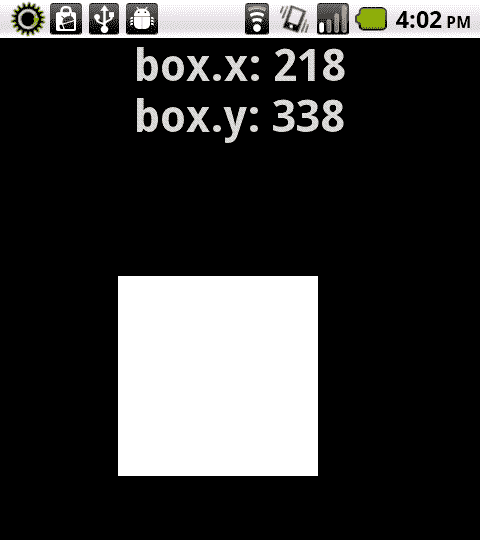
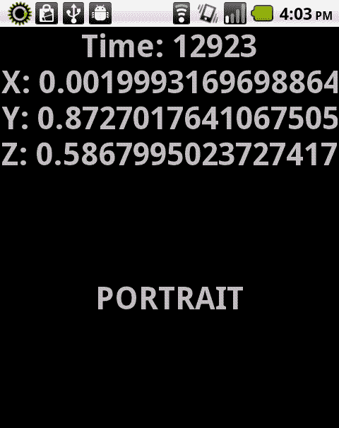
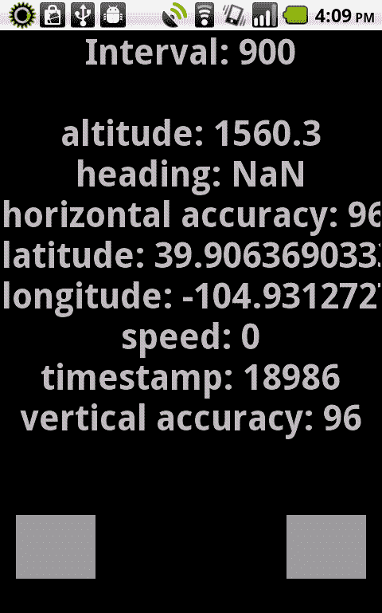

# 第三章。穿越空间的运动:加速度计和地理位置传感器

本章将涵盖以下食谱:

*   检测安卓设备是否支持加速度计
*   检测安卓设备在三维空间中的移动
*   调整加速度计传感器更新间隔
*   通过加速计传感器更新显示对象位置
*   基于设备倾斜在纵向和横向之间切换
*   检测设备是否支持地理位置传感器
*   检测用户是否禁用了地理位置传感器
*   检索设备地理位置传感器数据
*   调整地理位置传感器更新间隔
*   通过地理位置坐标检索地图数据

# 简介

安卓设备不仅配备了触摸面板、虚拟键盘和其他输入机制，还包括加速度计等传感器，用于检测 3D 空间的变化，以及精细(卫星)和粗略(三角测量)级别的地理定位。本章将研究如何在基于闪存平台的安卓应用中以有意义的方式利用这些传感器。

本章中的所有方法都表示为纯 ActionScript 3 类，不依赖于外部库或 Flex 框架。因此，我们将能够在任何我们希望的 IDE 中使用这些示例。

# 检测安卓设备是否支持加速度计

当开发针对安卓操作系统的项目时，确保设备上实际支持某些传感器(如加速度计)总是一个好主意。在安卓手机的情况下，这可能永远是这样，但我们永远不应该假设任何设备的能力。

## 怎么做...

我们需要使用加速度计应用编程接口类来检测加速度计是否受支持:

1.  首先，将以下类导入到您的项目中:

    ```java
    import flash.display.StageScaleMode;
    import flash.display.StageAlign;
    import flash.display.Stage;
    import flash.display.Sprite;
    import flash.text.TextField;
    import flash.text.TextFormat;
    import flash.sensors.Accelerometer;

    ```

2.  声明一个`TextField`和`TextFormat`对象对，以允许在设备上显示输出:

    ```java
    private var traceField:TextField;
    private var traceFormat:TextFormat;

    ```

3.  我们现在将设置我们的`TextField`，应用一个`TextFormat`，并将其添加到`DisplayList`。这里，我们创建一个方法来为我们执行所有这些操作:

    ```java
    protected function setupTextField():void {
    traceFormat = new TextFormat();
    traceFormat.bold = true;
    traceFormat.font = "_sans";
    traceFormat.size = 44;
    traceFormat.align = "center";
    traceFormat.color = 0x333333;
    traceField = new TextField();
    traceField.defaultTextFormat = traceFormat;
    traceField.selectable = false;
    traceField.mouseEnabled = false;
    traceField.width = stage.stageWidth;
    traceField.height = stage.stageHeight;
    addChild(traceField);
    }

    ```

4.  然后，只需调用`Accelerometer.isSupported`确认对该功能的支持:

    ```java
    protected function checkAccelerometer():void {
    traceField.appendText("Accelerometer: " + Accelerometer.isSupported + "\n");
    }

    ```

5.  This invocation will return a Boolean value of `true` or `false`, indicating device support for this sensor:

    

## 它是如何工作的...

检测设备是否包括加速度计传感器将确定用户是否能够有效地利用依赖于这种数据的应用。如果我们的查询返回 false，则由我们来通知用户，或者提供某种替代方式来从设备收集加速度计数据，作为一种交互形式。

# 检测安卓设备在 3D 空间的移动

`Accelerometer`类与设备的运动传感器协同工作，当设备在 3D 空间中移动时，测量并报告移动和加速度坐标。为了测量这些数据并对这些测量做出反应，我们必须执行某些操作，以便在应用中收集加速度计数据。

## 怎么做...

我们需要使用某些动作脚本类来监控加速度计反馈:

1.  首先，将以下类导入到您的项目中:

    ```java
    import flash.display.Sprite;
    import flash.display.Stage;
    import flash.display.StageAlign;
    import flash.display.StageScaleMode;
    import flash.events.AccelerometerEvent;
    import flash.sensors.Accelerometer;
    import flash.text.TextField;
    import flash.text.TextFormat;

    ```

2.  声明一个`TextField`和`TextFormat`对象对，以允许在设备上显示输出，同时声明一个`Accelerometer`对象:

    ```java
    private var traceField:TextField;
    private var traceFormat:TextFormat;
    private var accelerometer:Accelerometer;

    ```

3.  我们现在将设置我们的`TextField`，应用一个`TextFormat`，并将其添加到`DisplayList`。这里，我们创建一个方法来为我们执行所有这些操作:

    ```java
    protected function setupTextField():void {
    traceFormat = new TextFormat();
    traceFormat.bold = true;
    traceFormat.font = "_sans";
    traceFormat.size = 44;
    traceFormat.align = "center";
    traceFormat.color = 0x333333;
    traceField = new TextField();
    traceField.defaultTextFormat = traceFormat;
    traceField.selectable = false;
    traceField.mouseEnabled = false;
    traceField.width = stage.stageWidth;
    traceField.height = stage.stageHeight;
    addChild(traceField);
    }

    ```

4.  我们现在必须实例化一个`Accelerometer`对象来注册一个`AccelerometerEvent`监听器。在这种情况下，我们将让它调用一个名为`movementDetected.`的函数。我们还首先通过检查`Accelerometer.isSupported`属性:

    ```java
    protected function registerListeners():void {
    if(Accelerometer.isSupported) {
    accelerometer = new Accelerometer();
    accelerometer.addEventListener(AccelerometerEvent.UPDATE, movementDetected);
    }else{
    traceField.text = "Accelerometer not supported!";
    }
    }

    ```

    来检查设备是否支持`Accelerometer API`
5.  我们现在能够通过`movementDetected`方法监控和响应设备移动:

    ```java
    protected function movementDetected(e:AccelerometerEvent):void {
    traceField.text = "";
    traceField.appendText("Time: " + e.timestamp + "\n");
    traceField.appendText("X: " + e.accelerationX + "\n");
    traceField.appendText("Y: " + e.accelerationY + "\n");
    traceField.appendText("Z: " + e.accelerationZ + "\n");
    }

    ```

6.  The output will look similar to this:

    

## 它是如何工作的...

通过向`AccelerometerEvent.UPDATE`注册一个事件监听器，我们能够检测安卓设备上的运动传感器报告的变化。通过该事件报告了四个属性:`accelerationX, accelerationY, accelerationZ`和`timestamp`。

*   `accelerationX:`一个`Number`测量沿 x 轴的加速度，当设备处于直立位置时，该加速度从左向右。当设备向右移动时，指示正加速度。向左移动表示为负数。
*   `accelerationY:`一个`Number`测量沿 y 轴的加速度，当设备处于直立位置时，该加速度从下向上延伸。当设备向上移动时，指示正加速度。向下移动表示为负数。
*   `accelerationZ:`测量沿 z 轴加速度的`Number`，该轴垂直于设备表面。当移动设备使面部指向天空时，表示正加速度。将面定位在地球角度的运动将表示为负数。
*   `timestamp:`一个`int`，测量应用初始化后的毫秒数。这可用于跟踪一段时间内的更新事件。

## 还有更多...

当在安卓上创建基于平衡的游戏时，例如让一个球基于设备倾斜穿过迷宫，加速度计经常被使用，但是我们可以以任何我们希望的方式使用这些数据来监控空间、倾斜或其他基于运动的动作的变化。

# 调整加速计传感器更新间隔

虽然默认的加速度计传感器更新间隔对于大多数应用来说可能刚刚好，但是如果我们希望为了特定的目的而加快或减慢该间隔呢？

## 怎么做...

我们需要使用`Accelerometer`类中包含的方法来更改加速度计传感器更新间隔:

1.  首先，将以下类导入到您的项目中:

    ```java
    import flash.display.Sprite;
    import flash.display.Stage;
    import flash.display.StageAlign;
    import flash.display.StageScaleMode;
    import flash.events.AccelerometerEvent;
    import flash.events.TouchEvent;
    import flash.sensors.Accelerometer;
    import flash.text.TextField;
    import flash.text.TextFormat;
    import flash.ui.Multitouch;
    import flash.ui.MultitouchInputMode;

    ```

2.  我们现在将声明一些在示例中使用的对象。首先，一个`TextField`和`TextFormat`对象对允许在设备上的可视输出，以及一个`Accelerometer`对象。
3.  然后我们还需要使用`Number`来记录我们的间隔量。
4.  还需要两个`Sprite`对象供用户交互。T1】
5.  我们现在将设置我们的`TextField`，应用一个`TextFormat`，并将其添加到`DisplayList`。这里，我们创建一个方法来为我们执行所有这些操作:

    ```java
    protected function setupTextField():void {
    traceFormat = new TextFormat();
    traceFormat.bold = true;
    traceFormat.font = "_sans";
    traceFormat.size = 44;
    traceFormat.align = "center";
    traceFormat.color = 0xFFFFFF;
    traceField = new TextField();
    traceField.defaultTextFormat = traceFormat;
    traceField.selectable = false;
    traceField.mouseEnabled = false;
    traceField.width = stage.stageWidth;
    traceField.height = stage.stageHeight;
    addChild(traceField);
    }

    ```

6.  为了通过触摸检测用户输入，我们将创建两个`Sprite`实例，并将每个实例添加到`Stage`中。为了区分我们向这些对象注册的任何事件侦听器中的`Sprite`实例，我们将为每个`Sprite:`

    ```java
    protected function setupBoxes():void {
    boxUp = new Sprite();
    boxUp.name = "boxUp";
    boxUp.graphics.beginFill(0xFFFFFF, 1);
    boxUp.x = 20;
    boxUp.y = stage.stageHeight/2;
    boxUp.graphics.drawRect(0,0,100,80);
    boxUp.graphics.endFill();
    addChild(boxUp);
    boxDown = new Sprite();
    boxDown.name = "boxDown";
    boxDown.graphics.beginFill(0xFFFFFF, 1);
    boxDown.x = stage.stageWidth - 120;
    boxDown.y = stage.stageHeight/2;
    boxDown.graphics.drawRect(0,0,100,80);
    boxDown.graphics.endFill();
    addChild(boxDown);
    }

    ```

    提供唯一的`name`属性
7.  我们还首先通过检查`Accelerometer.isSupported`属性来检查设备上是否实际支持加速度计应用编程接口。
8.  然后，我们需要通过将`Multitouch.inputMode`设置为`MultitouchInputMode.TOUCH_POINT`常数来设置多点触摸应用编程接口支持触摸输入的具体输入模式。
9.  每个精灵将注册一个`TouchEvent.TOUCH_TAP`监听器，这样它将能够调用一个方法来改变触摸点击的更新间隔。
10.  现在，我们可以实例化一个`Accelerometer`对象并调用`setRequestedUpdateInterval`方法，这需要一个以毫秒为单位的间隔传递到方法调用中。
11.  我们还将注册一个事件监听器来响应任何设备移动:

    ```java
    protected function registerListeners():void {
    if(Accelerometer.isSupported) {
    Multitouch.inputMode = MultitouchInputMode.TOUCH_POINT;
    boxUp.addEventListener(TouchEvent.TOUCH_TAP, shiftInterval);
    boxDown.addEventListener(TouchEvent.TOUCH_TAP, shiftInterval);
    accelerometer = new Accelerometer();
    accelerometerInterval = 100;
    accelerometer.setRequestedUpdateInterval (accelerometerInterval);
    accelerometer.addEventListener(AccelerometerEvent.UPDATE, movementDetected);
    }else{
    traceField.text = "Accelerometer not supported!";
    }
    }

    ```

12.  我们的`shiftInterval`方法现在将对我们创建的两个`Sprite`框截取的任何触摸点击做出响应。我们正在检查每个`Sprite`的`name`属性，并相应地移动`accelerometerInterval`:

    ```java
    protected function shiftInterval(e:TouchEvent):void {
    switch(e.target.name){
    case "boxUp":{
    accelerometerInterval += 100;
    break;
    }
    case "boxDown":{
    accelerometerInterval -= 100;
    break;
    }
    }
    if(accelerometerInterval < 0){
    accelerometerInterval = 0;
    }
    accelerometer.setRequestedUpdateInterval(accelerometerInterval);
    }

    ```

13.  加速度计传感器更新间隔现在将调用以下功能，该功能将通过我们的`TextField:`

    ```java
    protected function movementDetected(e:AccelerometerEvent):void {
    traceField.text = "Interval: " + accelerometerInterval + "\n\n";
    traceField.appendText("Time: " + e.timestamp + "\n");
    traceField.appendText("X: " + e.accelerationX + "\n");
    traceField.appendText("Y: " + e.accelerationY + "\n");
    traceField.appendText("Z: " + e.accelerationZ + "\n");
    }

    ```

    输出检测到的移动和间隔数据
14.  The result will appear similar to the following:

    

## 它是如何工作的...

通过`setRequestedUpdateInterval()`设置加速度计更新间隔，我们可以根据特定应用的情况调整该间隔。在前面的演示课中，我们已经渲染了两个`Sprites`作为增加和减少`TouchEvent.TOUCH_TAP`事件接收器。点击这些`DisplayObjects`将增加或减少加速度计更新间隔，这是通过我们在屏幕上的`TextField`监控的。

## 还有更多...

请注意，默认加速度计传感器更新间隔取决于运行我们应用的设备。这种策略也可以用来尝试并平衡设备之间的时间间隔。

# 通过加速计事件更新显示对象位置

加速度传感器可以在为安卓设备创建各种游戏或应用时使用。该数据更频繁的用途之一是更新`Stage`上`DisplayObject`的位置，以响应加速度计更新事件数据。

## 怎么做...

我们需要使用特定的动作脚本类来通过`DisplayObject`实例监控加速度计反馈。在这个例子中，我们将使用一个简单的`Shape`对象，并根据这个数据改变它的位置:

1.  首先，将以下类导入到您的项目中:

    ```java
    import flash.display.Shape;
    import flash.display.Sprite;
    import flash.display.Stage;
    import flash.display.StageAlign;
    import flash.display.StageScaleMode;
    import flash.events.AccelerometerEvent;
    import flash.sensors.Accelerometer;
    import flash.text.TextField;
    import flash.text.TextFormat;

    ```

2.  我们现在将声明一些在示例中使用的对象。首先，一个`TextField`和`TextFormat`对象对，以及一个`Shape`以允许在设备上的可视输出。
3.  我们还必须声明一个`Accelerometer`对象，以便监控和响应设备移动:

    ```java
    private var traceField:TextField;
    private var traceFormat:TextFormat;
    private var box:Shape;
    private var accelerometer:Accelerometer;

    ```

4.  我们现在将设置我们的`TextField`，应用一个`TextFormat`，并将其添加到`DisplayList`。这里，我们创建一个方法来为我们执行所有这些操作:

    ```java
    protected function setupTextField():void {
    traceFormat = new TextFormat();
    traceFormat.bold = true;
    traceFormat.font = "_sans";
    traceFormat.size = 44;
    traceFormat.align = "center";
    traceFormat.color = 0xFFFFFF;
    traceField = new TextField();
    traceField.defaultTextFormat = traceFormat;
    traceField.selectable = false;
    traceField.mouseEnabled = false;
    traceField.width = stage.stageWidth;
    traceField.height = stage.stageHeight;
    addChild(traceField);
    }

    ```

5.  创建一个名为`box`的新`Shape`对象，用`Graphics` API 绘制一个矩形，并将其添加到`Stage:`

    ```java
    protected function setupBox():void {
    box = new Shape();
    box.graphics.beginFill(0xFFFFFF, 1);
    box.x = stage.stageWidth/2;
    box.y = stage.stageHeight/2;
    box.graphics.drawRect(-100,-100,200,200);
    box.graphics.endFill();
    addChild(box);
    }

    ```

    中
6.  我们现在必须实例化一个`Accelerometer`对象来注册一个`AccelerometerEvent`监听器。在这种情况下，我们将让它调用一个名为`movementDetected`的函数。我们还首先通过检查`Accelerometer.isSupported`属性:

    ```java
    protected function registerListeners():void {
    if(Accelerometer.isSupported) {
    accelerometer = new Accelerometer();
    accelerometer.addEventListener(AccelerometerEvent.UPDATE, movementDetected);
    }else{
    traceField.text = "Accelerometer not supported!";
    }
    }

    ```

    来检查设备上是否实际支持加速度计应用编程接口
7.  我们现在能够通过`movementDetected`方法，基于通过所报告的`AccelerometerEvent.UPDATE`数据报告的`accelerationX`和`accelerationY`数据，通过调整我们的`Shape`对象的 x 和 y 坐标来监控和响应设备移动。
8.  在下面的功能中，我们将执行一些检查，以确保当设备倾斜时，我们的`Shape`不会离开`Stage`。我们还将把我们的`Sprite`的 x 和 y 属性输出到一个`TextField`

    ```java
    protected function movementDetected(e:AccelerometerEvent):void {
    traceField.text = "";
    var speed:Number = 20;
    if(box.x > box.width/2){
    box.x -= Math.floor(e.accelerationX*speed);
    }else{
    box.x = box.width/2;
    }
    if(box.x < stage.stageWidth-(box.width/2)){
    box.x -= Math.floor(e.accelerationX*speed);
    }else{
    box.x = stage.stageWidth-(box.width/2);
    }
    if(box.y > box.height/2){
    box.y += Math.floor(e.accelerationY*speed);
    }else{
    box.y = box.height/2;
    }
    if(box.y < stage.stageHeight-(box.height/2)){
    box.y += Math.floor(e.accelerationY*speed);
    }else{
    box.y = stage.stageHeight-(box.height/2);
    }
    traceField.appendText("box.x: " + box.x + "\n");
    traceField.appendText("box.y: " + box.y + "\n");
    }

    ```

9.  The resulting output will appear similar to the following:

    

## 它是如何工作的...

通过向`AccelerometerEvent.UPDATE`注册一个事件监听器，我们能够检测安卓设备上的运动传感器报告的变化。使用动作脚本，我们可以根据报告的传感器数据，通过在屏幕上移动`DisplayObject`来响应这些移动和倾斜的变化，如代码示例所示。

在这个例子中，我们不仅在屏幕上移动`Shape`对象，而且考虑到对象的宽度、高度和检测到的屏幕尺寸，我们还注意不要让形状通过许多条件语句离开屏幕。

# 基于设备倾斜在纵向和横向之间切换

大多数安卓设备将允许用户同时使用纵向和横向视图进行交互。当设备保持 y 轴从上到下对齐时，启用纵向模式，而当设备保持从左到右测量 y 轴时，启用横向模式。通过使用加速度传感器报告的数据，我们可以知道这些运动何时发生，并在我们的应用中做出响应。

## 怎么做...

我们需要使用`Accelerometer`应用编程接口来检测设备旋转和倾斜:

1.  首先，将以下类导入到您的项目中:

    ```java
    import flash.display.Sprite;
    import flash.display.Stage;
    import flash.display.StageAlign;
    import flash.display.StageScaleMode;
    import flash.events.AccelerometerEvent;
    import flash.sensors.Accelerometer;
    import flash.text.TextField;
    import flash.text.TextFormat;

    ```

2.  我们现在将声明一些在示例中使用的对象。首先，一个`TextField`和`TextFormat`对象对允许在设备上可视输出。
3.  我们还必须声明一个`Accelerometer`对象，以便监控和响应设备移动:

    ```java
    private var traceField:TextField;
    private var traceFormat:TextFormat;
    private var accelerometer:Accelerometer;

    ```

4.  我们现在将设置我们的`TextField`，应用一个`TextFormat`，并将其添加到`DisplayList`。这里，我们创建一个方法来为我们执行所有这些操作:

    ```java
    protected function setupTextField():void {
    traceFormat = new TextFormat();
    traceFormat.bold = true;
    traceFormat.font = "_sans";
    traceFormat.size = 44;
    traceFormat.align = "center";
    traceFormat.color = 0xFFFFFF;
    traceField = new TextField();
    traceField.defaultTextFormat = traceFormat;
    traceField.selectable = false;
    traceField.mouseEnabled = false;
    traceField.width = stage.stageWidth;
    traceField.height = stage.stageHeight;
    addChild(traceField);
    }

    ```

5.  然后，我们必须创建一个`Accelerometer`实例，并为其分配一个类型为`AccelerometerEvent.UPDATE`的事件侦听器。每当检测到加速度计数据的变化时，这将触发`movementDetected`方法。我们还首先通过检查`Accelerometer.isSupported`属性:

    ```java
    protected function registerListeners():void {
    if(Accelerometer.isSupported) {
    accelerometer = new Accelerometer();
    accelerometer.addEventListener(AccelerometerEvent.UPDATE, movementDetected);
    }else{
    traceField.text = "Accelerometer not supported!";
    }
    }

    ```

    来检查设备上是否实际支持加速度计应用编程接口
6.  在我们的`movementDetected`方法中，我们只需要监控传感器报告的加速度数据，并相应地调整我们的应用。我们还将向我们的`TextField`输出数据，以监控设备运动:

    ```java
    protected function movementDetected(e:AccelerometerEvent):void {
    traceField.text = "";
    traceField.appendText("Time: " + e.timestamp + "\n");
    traceField.appendText("X: " + e.accelerationX + "\n");
    traceField.appendText("Y: " + e.accelerationY + "\n");
    traceField.appendText("Z: " + e.accelerationZ + "\n");
    if(e.accelerationY > 0.5){
    traceField.appendText("\n\n\nPORTRAIT");
    }else{
    traceField.appendText("\n\n\nLANDSCAPE");
    }
    }

    ```

7.  The result will appear similar to the following:

    

## 它是如何工作的...

当在我们的应用中检测到加速度计移动时，`movementDetected`方法将报告关于设备的`x, y`和`z`轴的数据。如果我们监控报告的加速度值，我们可以通过考虑垂直方向来响应设备倾斜，从而知道是否调整`Stage`上的元素以进行纵向或横向观看。

## 还有更多...

在这个例子中，我们使用纯动作脚本来检测加速度传感器数据并对其做出响应。在使用移动 Flex 框架开发我们的应用时，我们可以通过选择**移动设置**对话框中的**自动重定向**选项，在设置 **Flex 移动项目**时允许框架为我们处理设备方向。


## 另请参见…

[第 6 章](06.html "Chapter 6. Structural Adaptation: Handling Device Layout and Scaling")、*结构适应:处理设备布局和缩放*，也有更多关于使用替代检测方法适应设备方向变化的信息。

# 检测设备是否支持地理位置传感器

当开发针对安卓操作系统的项目时，确保设备上实际支持某些传感器(如地理位置传感器)总是一个好主意。在安卓设备的情况下，这可能永远是这样，但是我们永远不应该假设任何设备的能力。

## 怎么做...

我们需要使用内部类来检测是否支持地理定位应用编程接口:

1.  首先，将以下类导入到您的项目中:

    ```java
    import flash.display.StageScaleMode;
    import flash.display.StageAlign;
    import flash.display.Stage;
    import flash.display.Sprite;
    import flash.text.TextField;
    import flash.text.TextFormat;
    import flash.sensors.Geolocation;

    ```

2.  声明一个`TextField`和`TextFormat`对象对，以允许在设备上显示输出:

    ```java
    private var traceField:TextField;
    private var traceFormat:TextFormat;

    ```

3.  我们现在将设置我们的`TextField`，应用`TextFormat`，并将`TextField`添加到`DisplayList`。在这里，我们创建一个方法来为我们执行所有这些操作:

    ```java
    protected function setupTextField():void {
    traceFormat = new TextFormat();
    traceFormat.bold = true;
    traceFormat.font = "_sans";
    traceFormat.size = 44;
    traceFormat.align = "center";
    traceFormat.color = 0x333333;
    traceField = new TextField();
    traceField.defaultTextFormat = traceFormat;
    traceField.selectable = false;
    traceField.mouseEnabled = false;
    traceField.width = stage.stageWidth;
    traceField.height = stage.stageHeight;
    addChild(traceField);
    }

    ```

4.  然后，只需调用`Geolocation.isSupported`确认对该功能的支持:

    ```java
    protected function checkGeolocation():void {
    traceField.appendText("Geolocation: " + Geolocation.isSupported);
    }

    ```

5.  This invocation will return a Boolean value of `true` or `false`, indicating device support for this sensor. This result will be output to the `TextField` we created:

    

## 它是如何工作的...

检测设备是否包括地理位置传感器将确定用户是否能够有效地利用依赖于这种数据的应用。如果我们的查询返回 false，那么就由我们来通知用户，或者提供某种替代方法来从用户那里收集这些数据。这通常由用户手动输入特定的位置数据来处理。

## 另请参见…

应用开发人员必须通过安卓清单文件请求地理位置传感器的可用性。为了让我们的应用使用这些传感器，必须在清单文件中声明权限。详见[第九章](09.html "Chapter 9. Manifest Assurance: Security and Android Permissions")、*货单保障:安全和安卓权限*。

检测用户是否禁用了地理位置传感器

安卓地理位置传感器可能无法在我们的应用中使用的原因有很多。用户可以简单地关闭这个传感器来节省电池寿命，或者我们作为开发人员，没有通过安卓清单文件提供足够的权限来允许地理位置访问。无论如何，如果传感器已被禁用，最好进行检查并给出善意的提示。

## 怎么做...

我们需要检查包含在`Geolocation`类中的`muted`属性:

1.  首先，将以下类导入到您的项目中:

    ```java
    import flash.display.Sprite;
    import flash.display.Stage;
    import flash.display.StageAlign;
    import flash.display.StageScaleMode;
    import flash.events.StatusEvent;
    import flash.sensors.Geolocation;
    import flash.text.TextField;
    import flash.text.TextFormat;

    ```

2.  声明一个`TextField`和`TextFormat`对象对，以允许与一个`Geolocation`对象一起在设备上可视输出:

    ```java
    private var traceField:TextField;
    private var traceFormat:TextFormat;
    private var geo:Geolocation;

    ```

3.  我们现在将设置我们的`TextField`，应用`TextFormat`，并将`TextField`添加到`DisplayList`。在这里，我们创建一个方法来为我们执行所有这些操作:

    ```java
    protected function setupTextField():void {
    traceFormat = new TextFormat();
    traceFormat.bold = true;
    traceFormat.font = "_sans";
    traceFormat.size = 44;
    traceFormat.align = "center";
    traceFormat.color = 0x333333;
    traceField = new TextField();
    traceField.defaultTextFormat = traceFormat;
    traceField.selectable = false;
    traceField.mouseEnabled = false;
    traceField.width = stage.stageWidth;
    traceField.height = stage.stageHeight;
    addChild(traceField);
    }

    ```

4.  Now, we must instantiate a `Geolocation` instance and register an event listener to determine whether geolocation becomes disabled while our application is running.

    ### 注

    既然我们已经定义了`Geolocation`实例，我们也可以随时简单地检查`muted`属性。

    ```java
    protected function registerListeners():void {
    geo = new Geolocation();
    geo.addEventListener(StatusEvent.STATUS, checkGeolocationMuted);
    traceField.appendText("Geolocation Disabled? \n\n" + geo.muted);
    }

    ```

5.  一旦我们调用方法，检查静音属性。如果返回`true`，我们可以访问设备地理位置传感器；如果它返回`false`，那么我们知道传感器已经被禁用:

    ```java
    protected function checkGeolocationMuted(e:StatusEvent):void {
    traceField.appendText("Geolocation Disabled? \n\n" + geo.muted);
    }

    ```

6.  The result will be output to the device screen as shown in the following screenshot:

    

# 它是如何工作的...

一旦我们构造了一个`Geolocation`实例，我们就能够访问该类的`muted`属性。通过检查`Geolocation`对象的`muted`属性，我们可以在应用中禁用地理定位功能，提示用户手动输入其位置，或者简单地通知用户必须启用设备上的地理定位传感器才能继续。

# 还有更多...

如我们的示例所示，`Geolocation`对象可以注册一个`status`事件，当`muted`属性发生变化时，它会提醒我们。我们可以在运行应用时使用它来检测属性的变化，并做出相应的响应。

# 另请参见…

应用开发人员必须通过安卓清单文件请求地理位置传感器的可用性。为了让我们的应用使用这些传感器，必须在清单文件中声明权限。详见[第九章](09.html "Chapter 9. Manifest Assurance: Security and Android Permissions")。

# 检索设备地理位置传感器数据

`Geolocation`类可用于揭示跟踪设备在地球上位置的全套属性。这对于地图、天气、旅行和其他位置感知应用非常有用。为了测量这些数据并对这些测量做出反应，我们必须执行某些操作。

## 怎么做...

我们需要使用某些动作脚本类来监控地理位置反馈:

1.  首先，将以下类导入到您的项目中:

    ```java
    import flash.display.Sprite;
    import flash.display.Stage;
    import flash.display.StageAlign;
    import flash.display.StageScaleMode;
    import flash.events.GeolocationEvent;
    import flash.sensors.Geolocation;
    import flash.text.TextField;
    import flash.text.TextFormat;

    ```

2.  声明一个`TextField`和`TextFormat`对象对，以允许与一个`Geolocation`对象一起在设备上可视输出:

    ```java
    private var traceField:TextField;
    private var traceFormat:TextFormat;
    private var geolocation:Geolocation;

    ```

3.  我们现在将设置我们的`TextField`，应用`TextFormat`，并将`TextField`添加到`DisplayList`。这里，我们创建一个方法来为我们执行所有这些操作:

    ```java
    protected function setupTextField():void {
    traceFormat = new TextFormat();
    traceFormat.bold = true;
    traceFormat.font = "_sans";
    traceFormat.size = 44;
    traceFormat.align = "center";
    traceFormat.color = 0x333333;
    traceField = new TextField();
    traceField.defaultTextFormat = traceFormat;
    traceField.selectable = false;
    traceField.mouseEnabled = false;
    traceField.width = stage.stageWidth;
    traceField.height = stage.stageHeight;
    addChild(traceField);
    }

    ```

4.  我们现在必须实例化一个`Geolocation`对象来注册一个`GeolocationEvent`监听器。在这种情况下，我们将让它调用一个名为`geolocationUpdate`的函数。我们还首先通过检查`Geolocation.isSupported`属性:

    ```java
    protected function registerListeners():void {
    if(Geolocation.isSupported) {
    geolocation = new Geolocation();
    geolocation.addEventListener(GeolocationEvent.UPDATE, geolocationUpdate);
    }else{
    traceField.text = "Geolocation not supported!";
    }
    }

    ```

    来检查设备上是否实际支持地理定位应用编程接口
5.  我们现在能够通过`geolocationUpdate`方法监控和响应设备移动。在这种情况下，我们将收集的数据输出到`TextField:`

    ```java
    protected function geolocationUpdate(e:GeolocationEvent):void {
    traceField.text = "";
    traceField.appendText("altitude: " + e.altitude + "\n");
    traceField.appendText("heading: " + e.heading + "\n");
    traceField.appendText("horizontal accuracy: " + e.horizontalAccuracy + "\n");
    traceField.appendText("latitude: " + e.latitude + "\n");
    traceField.appendText("longitude: " + e.longitude + "\n");
    traceField.appendText("speed: " + e.speed + "\n");
    traceField.appendText("timestamp: " + e.timestamp + "\n");
    traceField.appendText("vertical accuracy: " + e.verticalAccuracy);
    }

    ```

6.  The output will look something like this:

    

## 它是如何工作的...

通过向`GeolocationEvent.UPDATE`注册一个事件监听器，我们能够检测安卓设备上地理位置传感器报告的变化。请注意，并非每个安卓设备都能够报告所有这些属性；它将根据所使用的设备而变化。通过该事件报告了八种可能的属性:`altitude, heading, horizontalAccuracy, latitude, longitude, speed, timestamp`和`verticalAccuracy`。

*   `altitude:` A `Number`测量当前高度，单位为米。
*   `heading:`一个代表运动方向的`Number`，单位为度。
*   `horizontalAccuracy:` A `Number`测量传感器测量的水平精度，单位为米。
*   `latitude:` A `Number`代表当前设备纬度，单位为度。
*   `longitude:` A `Number`代表当前设备经度，单位为度。
*   `speed:` A `Number`测量速度，单位为米每秒。
*   `timestamp:`一个表示应用初始化后的毫秒数的`int`。
*   `verticalAccuracy:` A `Number`测量传感器测量的垂直精度，单位为米。

# 调整地理位置传感器更新间隔

虽然默认的地理位置传感器更新间隔对于大多数应用来说可能是合适的，但是如果我们希望为了特定的目的而加快或减慢该间隔呢？

## 怎么做...

我们需要使用`Geolocation`类中包含的方法来更改地理位置传感器更新间隔:

1.  首先，将以下类导入到您的项目中:

    ```java
    import flash.display.Sprite;
    import flash.display.Stage;
    import flash.display.StageAlign;
    import flash.display.StageScaleMode;
    import flash.events.GeolocationEvent;
    import flash.events.TouchEvent;
    import flash.sensors.Geolocation;
    import flash.text.TextField;
    import flash.text.TextFormat;
    import flash.ui.Multitouch;
    import flash.ui.MultitouchInputMode;

    ```

2.  我们现在将声明一些在示例中使用的对象。首先，一个`TextField`和`TextFormat`对象，以及一个`Geolocation`对象，允许在设备上进行可视输出。
3.  然后我们还需要使用`Number`来记录我们的间隔量。还需要两个`Sprite`对象供用户交互。

    ```java
    private var traceField:TextField;
    private var traceFormat:TextFormat;
    private var geolocation:Geolocation;
    private var geolocationInterval:Number;
    private var boxUp:Sprite;
    private var boxDown:Sprite;

    ```

4.  我们现在将设置我们的`TextField`，应用`TextFormat`，并将`TextField`添加到`DisplayList`。在这里，我们创建一个方法来为我们执行所有这些操作:

    ```java
    protected function setupTextField():void {
    traceFormat = new TextFormat();
    traceFormat.bold = true;
    traceFormat.font = "_sans";
    traceFormat.size = 44;
    traceFormat.align = "center";
    traceFormat.color = 0x333333;
    traceField = new TextField();
    traceField.defaultTextFormat = traceFormat;
    traceField.selectable = false;
    traceField.mouseEnabled = false;
    traceField.width = stage.stageWidth;
    traceField.height = stage.stageHeight;
    addChild(traceField);
    }

    ```

5.  为了通过触摸检测用户输入，我们将创建两个`Sprite`实例，并将每个实例添加到`Stage`中。为了区分我们向这些对象注册的任何事件侦听器中的`Sprite`实例，我们将为每个`Sprite:`

    ```java
    protected function setupBoxes():void {
    boxUp = new Sprite();
    boxUp.name = "boxUp";
    boxUp.graphics.beginFill(0xFFFFFF, 0.6);
    boxUp.x = 20;
    boxUp.y = stage.stageHeight/2;
    boxUp.graphics.drawRect(0,0,100,80);
    boxUp.graphics.endFill();
    addChild(boxUp);
    boxDown = new Sprite();
    boxDown.name = "boxDown";
    boxDown.graphics.beginFill(0xFFFFFF, 0.6);
    boxDown.x = stage.stageWidth - 120;
    boxDown.y = stage.stageHeight/2;
    boxDown.graphics.drawRect(0,0,100,80);
    boxDown.graphics.endFill();
    addChild(boxDown);
    }

    ```

    提供唯一的名称属性
6.  我们首先通过检查`Geolocation.isSupported`属性来检查设备上是否实际支持地理定位应用编程接口。
7.  然后，我们需要通过将`Multitouch.inputMode`设置为`MultitouchInputMode.TOUCH_POINT`常数来设置多点触摸应用编程接口支持触摸输入的具体输入模式。每个`Sprite`将注册一个`TouchEvent.TOUCH_TAP`监听器，这样它将能够调用一种方法，在轻触时改变更新间隔。
8.  现在，我们还可以实例化一个`Geolocation`对象并调用`setRequestedUpdateInterval`方法，这需要一个以毫秒为单位的时间间隔传递到方法调用中。
9.  我们将注册一个事件监听器来响应任何设备移动:

    ```java
    protected function registerListeners():void {
    if(Geolocation.isSupported) {
    Multitouch.inputMode = MultitouchInputMode.TOUCH_POINT;
    boxUp.addEventListener(TouchEvent.TOUCH_TAP, shiftInterval);
    boxDown.addEventListener(TouchEvent.TOUCH_TAP, shiftInterval);
    geolocation = new Geolocation();
    geolocationInterval = 100;
    geolocation.setRequestedUpdateInterval(geolocationInterval);
    geolocation.addEventListener(GeolocationEvent.UPDATE, geolocationUpdate);
    }else{
    traceField.text = "Geolocation not supported!";
    }
    }

    ```

10.  我们的`shiftInterval`方法现在将对我们创建的两个`Sprite`框截取的任何触摸点击做出响应。我们正在检查每个`Sprite`的名称属性，并相应地移动`accelerometerInterval`:

    ```java
    protected function shiftInterval(e:TouchEvent):void {
    switch(e.target.name){
    case "boxUp":{
    geolocationInterval += 100;
    break;
    }
    case "boxDown":{
    geolocationInterval -= 100;
    break;
    }
    }
    if(geolocationInterval < 0){
    geolocationInterval = 0;
    }
    geolocation.setRequestedUpdateInterval(geolocationInterval);
    }

    ```

11.  地理位置传感器更新间隔现在将调用以下功能，该功能将通过我们的`TextField:`

    ```java
    protected function geolocationUpdate(e:GeolocationEvent):void {
    traceField.text = "Interval: " + geolocationInterval + "\n\n";
    traceField.appendText("altitude: " + e.altitude + "\n");
    traceField.appendText("heading: " + e.heading + "\n");
    traceField.appendText("horizontal accuracy: " + e.horizontalAccuracy + "\n");
    traceField.appendText("latitude: " + e.latitude + "\n");
    traceField.appendText("longitude: " + e.longitude + "\n");
    traceField.appendText("speed: " + e.speed + "\n");
    traceField.appendText("timestamp: " + e.timestamp + "\n");
    traceField.appendText("vertical accuracy: " + e.verticalAccuracy);
    }

    ```

    输出检测到的移动和间隔数据
12.  The result will appear similar to the following screenshot:

    

## 它是如何工作的...

通过`setRequestedUpdateInterval()`设置地理位置更新间隔，我们可以根据特定应用中的情况调整该间隔。在前一节的`demonstration`类中，我们已经渲染了两个`Sprites`作为增加和减少`TouchEvent.TOUCH_TAP`事件受体。点击这些`DisplayObjects`将增加或减少地理位置更新间隔，这是通过我们在屏幕上的`TextField`监控的。

## 还有更多...

请注意，默认地理位置传感器更新间隔取决于运行我们应用的设备。这种策略也可以用来尝试并平衡设备之间的时间间隔。然而，有些事情是我们完全无法控制的。例如，如果用户位于建筑物深处，并且全球定位系统信号很差，更新间隔实际上可以超过一分钟。诸如此类的各种因素应该牢记在心。

# 通过地理位置坐标检索地图数据

通过使用地理位置坐标来检索地图是 ActionScript 地理位置 API 的基本用途之一。在本食谱中，我们将研究如何在舞台上渲染地图，并基于设备地理位置传感器使用闪存的谷歌地图应用编程接口报告的经纬度坐标生成标记。

## 做好准备...

在进入食谱本身之前，我们需要采取一些步骤。这些步骤将为我们的项目准备适当的代码库，并允许我们访问谷歌地图服务:

1.  首先，我们必须从[http://code.google.com/apis/maps/documentation/flash/](http://code.google.com/apis/maps/documentation/flash/)下载 Flash 的谷歌地图 API
2.  该包将包括两个单独的`.swc`文件。一个用于 Flex，另一个用于 ActionScript 项目。在这个例子中，我们将把纯`AS3 .swc`提取到我们的本地硬盘。
3.  From the same URL (in the first point) click on the link that reads **Sign up for a Google Maps API Key** to generate an API key and register a URL. You will need both of these items to complete the example.

    

4.  Now, include the Google Maps SDK into your development environment by either adding the .swc through the **ActionScript Build Path** properties dialog in the case of Flash Builder (you can also simply drag the `.swc` into the `libs` directory) or FDT or through the **Advanced ActionScript Properties** dialog in Flash Professional:

    

5.  我们现在准备继续食谱。

## 怎么做...

我们需要创建我们的地图`DisplayObject`，为`Geolocation`应用编程接口更新生成事件监听器，并根据我们当前的位置调整地图属性:

1.  首先，将以下类导入到您的项目中:

    ```java
    import flash.display.Sprite;
    import flash.display.Stage;
    import flash.display.StageAlign;
    import flash.display.StageScaleMode;
    import flash.events.GeolocationEvent;
    import flash.geom.Point;
    import flash.sensors.Geolocation;
    import flash.text.TextField;
    import flash.text.TextFormat;

    ```

2.  接下来，我们将希望导入谷歌地图软件开发工具包中包含的一些类。这些类将允许我们在`Stage`上渲染`Map`，监听特定于地图的事件，并在我们当前的位置

    ```java
    import com.google.maps.LatLng;
    import com.google.maps.Map;
    import com.google.maps.MapEvent;
    import com.google.maps.MapType;
    import com.google.maps.overlays.Marker;

    ```

    上渲染`Marker`
3.  我们现在将创建一些在这个例子中使用的对象引用。首先，一个`TextField`和`TextFormat`对象对，允许在设备上的可视输出，以及一个`Geolocation`对象。
4.  然后，我们还需要使用`Map`和`LatLng`对象来渲染我们的位置地图:

    ```java
    private var traceField:TextField;
    private var traceFormat:TextFormat;
    private var geolocation:Geolocation;
    private var map:Map;
    private var coordinates:LatLng;

    ```

5.  我们现在准备创建我们的`Map`，方法是传入我们在谷歌注册时设置的 API 密钥和 URL，并将`Map`添加到显示列表中:

    ```java
    protected function setupMap():void {
    map = new Map();
    map.key = "{GOOGLE_MAPS_API_KEY}";
    map.url = "{APP_URL}";
    map.sensor = "true";
    map.setSize(new Point(stage.stageWidth, stage.stageHeight));
    addChild(map);
    }

    ```

6.  我们现在将设置我们的`TextField`，应用`TextFormat`，并将`TextField`添加到`DisplayList`。这里，我们创建一个方法来为我们执行所有这些操作:

    ```java
    protected function setupTextField():void {
    traceFormat = new TextFormat();
    traceFormat.bold = true;
    traceFormat.font = "_sans";
    traceFormat.size = 44;
    traceFormat.align = "center";
    traceFormat.color = 0x333333;
    traceField = new TextField();
    traceField.defaultTextFormat = traceFormat;
    traceField.selectable = false;
    traceField.mouseEnabled = false;
    traceField.width = stage.stageWidth;
    traceField.height = stage.stageHeight;
    addChild(traceField);
    }

    ```

7.  重要的是，我们为地理位置更新和`Map`完成事件注册监听器，以便我们能够读取坐标数据，并知道我们的`Map`何时准备好交互。我们还首先通过检查`Geolocation.isSupported`属性:

    ```java
    protected function registerListeners():void {
    if(Geolocation.isSupported) {
    geolocation = new Geolocation();
    geolocation.addEventListener(GeolocationEvent.UPDATE, geolocationUpdate);
    map.addEventListener(MapEvent.MAP_READY, mapReady);
    }else{
    traceField.text = "Geolocation not supported!";
    }
    }

    ```

    来检查设备上是否实际支持地理定位 API
8.  由于地理位置更新是在本地处理的，这很可能是我们第一个触发的事件侦听器。我们将通过该事件从设备地理位置传感器提供的数据中获取`longitude`和`latitude`，并由此创建一个`LatLong`对象，该对象将在初始化时输入到`Map`:

    ```java
    protected function geolocationUpdate(e:GeolocationEvent):void {
    traceField.text = "";
    traceField.appendText("latitude:\n" + e.latitude + "\n\n");
    traceField.appendText("longitude:\n" + e.longitude);
    coordinates = new LatLng(e.latitude, e.longitude);
    }

    ```

9.  一旦我们的`mapReady`监听器方法启动，我们就已经拥有了通过`Map`显示当前坐标所需的坐标信息，并且还在这个精确的位置渲染了一个简单的`Marker`:

    ```java
    protected function mapReady(e:MapEvent):void {
    map.setCenter(coordinates, 16, MapType.NORMAL_MAP_TYPE);
    var marker:Marker = new Marker(map.getCenter());
    map.addOverlay(marker);
    }

    ```

10.  The result will look similar to this:

    

## 它是如何工作的...

通过利用谷歌地图等地图服务，我们可以监听本地设备的地理位置更新，并将必要的数据输入地图服务，以执行大量任务。

在本例中，我们只需将`Map`置于设备坐标的中心，并将`Marker`覆盖在`Map`上。每当您使用这样的服务时，彻底阅读文档以了解服务的可能性和局限性总是一个好主意。

`url`属性应该按照谷歌的要求，设置到一个描述应用的目的和范围的在线位置。

### 注

我们正在将`Map`实例的`sensor`属性设置为`true`。如果`Map`对基于谷歌设备地理位置传感器的数据做出反应，这是必需的。如果我们简单地允许用户输入坐标并以这种方式调整`Map`的位置，我们会将`sensor`属性设置为`false`。

## 还有更多...

在这种情况下，我们将谷歌地图应用编程接口用于闪存。它相当健壮，但您可能想使用另一个映射系统，如雅虎！地图、MapQuest 或其他服务。这很好，因为他们都需要类似的信息；只有特定的 API 设置会有所不同。