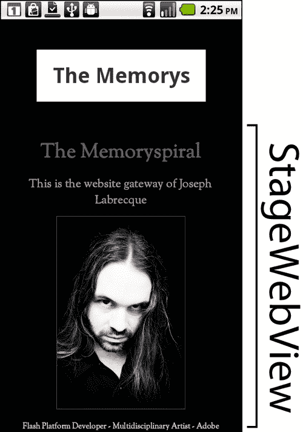
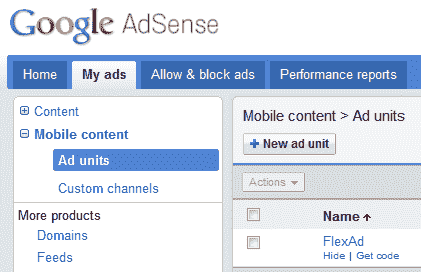
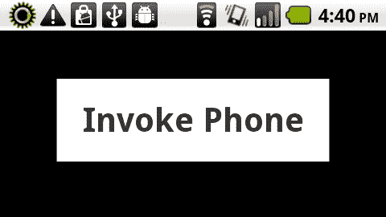
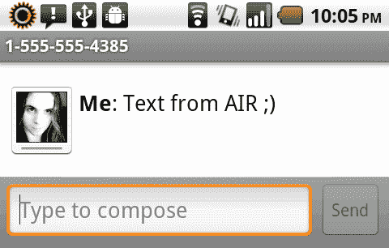
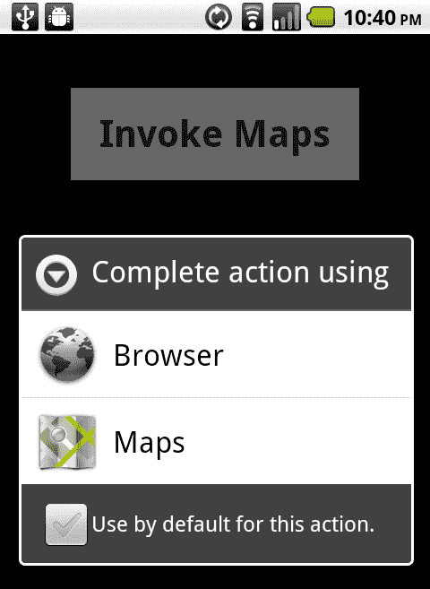
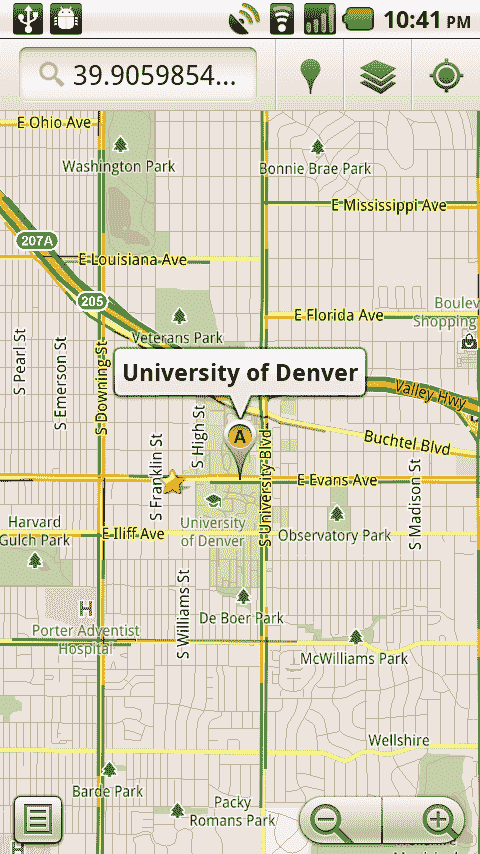
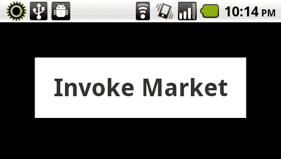
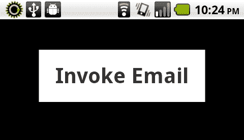
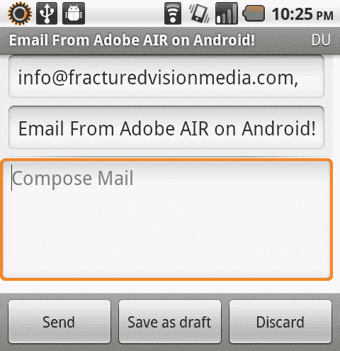

# 七、本地交互：舞台网络视图和 URI 处理器

本章将涵盖以下食谱:

*   在默认安卓浏览器中打开网站
*   在应用中呈现网站
*   管理舞台网络视图历史
*   使用 StageWebView 使用动作脚本加载广告
*   使用 StageWebView 在 Flex 移动项目中加载广告
*   从应用拨打电话
*   从应用发送文本消息
*   从应用调用谷歌地图
*   使用 URIs 应用调用安卓市场
*   从应用发送电子邮件

# 简介

传统上，Flash 平台开发人员无法将 HTML 网站作为其应用的一部分进行渲染；随着针对安卓的 AIR 中 StageWebView 的引入，这一切都发生了变化。本章包含了使这种机制不同于普通显示列表对象的提示，以及如何有效地使用它。我们还将研究 URI 处理功能，它允许我们在安卓设备上使用本地应用，如网络浏览器、电子邮件客户端、地图和电话。

# 在默认安卓浏览器中打开网站

与桌面 Flash 和 AIR 应用类似，默认的系统 Web 浏览器可以基于一些用户交互通过`flash.net`包中的类来调用。在安卓系统上，由于所有应用占用了一个完整的窗口，我们必须格外注意用户与我们的应用交互时可能导致的任何中断。例如，当用户收到电话或文本消息，必须退出应用时。

## 怎么做...

让应用调用`navigateToURL`并传入新的`URLRequest`将打开默认的网络浏览器。在本例中，一旦检测到`TOUCH_TAP`事件，我们将打开一个网站:

1.  首先，将以下类导入到您的项目中:

    ```java
    import flash.display.Sprite;
    import flash.display.StageAlign;
    import flash.display.StageScaleMode;
    import flash.events.TouchEvent;
    import flash.text.TextField;
    import flash.text.TextFormat;
    import flash.net.navigateToURL;
    import flash.net.URLRequest;
    import flash.ui.Multitouch;
    import flash.ui.MultitouchInputMode;

    ```

2.  我们现在将声明一个`Sprite`作为我们的交互元素，同时声明一对`TextField`和`TextFormat`作为按钮标签:

    ```java
    private var fauxButton:Sprite;
    private var traceField:TextField;
    private var traceFormat:TextFormat;

    ```

3.  现在，我们将继续设置我们的`TextField`，应用一个`TextFormat`对象，并使用图形应用编程接口构建一个带有简单背景填充的`Sprite`。我们按钮构建的最后一步是将`TextField`添加到我们的`Sprite`中，然后将`Sprite`添加到`DisplayList`中。在这里，我们创建了一个方法来为我们执行所有这些操作以及一些风格增强:

    ```java
    protected function setupTextButton():void {
    traceFormat = new TextFormat();
    traceFormat.bold = true;
    traceFormat.font = "_sans";
    traceFormat.size = 42;
    traceFormat.align = "center";
    traceFormat.color = 0x333333;
    traceField = new TextField();
    traceField.defaultTextFormat = traceFormat;
    traceField.autoSize = "left";
    traceField.selectable = false;
    traceField.mouseEnabled = false;
    traceField.text = "Invoke Browser";
    traceField.x = 30;
    traceField.y = 25;
    fauxButton = new Sprite();
    fauxButton.addChild(traceField);
    fauxButton.graphics.beginFill(0xFFFFFF, 1);
    fauxButton.graphics.drawRect(0, 0, traceField.width+60, traceField.height+50);
    fauxButton.graphics.endFill();
    fauxButton.x = (stage.stageWidth/2) - (fauxButton.width/2);
    fauxButton.y = 60;
    addChild(fauxButton);
    }

    ```

4.  If we now run the application on our device, the interactive `Sprite` should appear as follows:

    

5.  我们现在将通过`MultitouchInputMode.TOUCH_POINT`常数分配`Multitouch.inputMode`来响应原始触摸事件。在`Sprite`按钮上注册类型为`TouchEvent.TOUCH_TAP`的事件监听器。这将检测用户发起的任何触摸点击事件，并调用名为`onTouchTap`的方法，该方法包含我们逻辑的剩余部分:

    ```java
    protected function registerListeners():void {
    Multitouch.inputMode = MultitouchInputMode.TOUCH_POINT;
    fauxButton.addEventListener(TouchEvent.TOUCH_TAP, onTouchTap);
    }

    ```

6.  一旦检测到轻触，我们的`onTouchTap`方法就会启动，调用`navigateToURL`并传入一个`URLRequest`，其中包含我们希望从应用中打开的 HTTP 或 HTTPS 地址:

    ```java
    protected function onTouchTap(e:TouchEvent):void {
    navigateToURL(newURLRequest("http://memoryspiral.com/"));
    }

    ```

7.  When we run the application upon our device, a simple touch tap upon our button will invoke the native web browser application and load up our `URL request:`

    

## 它是如何工作的...

当我们的应用的用户轻触我们创建的交互式`Sprite`时，它们会从我们的应用中取出，进入默认的安卓网络浏览器，因为我们提供的网址是通过网络加载的，显示所请求的网站。这是通过让`URLRequest`通过`navigateToURL`方法来实现的，这与我们用桌面应用完成同样事情的方式非常相似。

## 还有更多...

虽然从我们的应用中调用安卓网络浏览器非常有用。能够将网页加载到应用中而不必在应用之间跳转要有趣得多。当然，用户可以使用 Android back 按钮从浏览器返回到我们的应用(如果它仍处于打开状态)，但有一些方法可以确保更无缝的体验。接下来的几个食谱将描述如何实现这一点。

# 在应用中呈现网站

使用 Flash 内容，传统上不可能在应用中显示完全呈现的 HTML 网站。Adobe AIR 最初改变了这一点，允许网页加载到桌面上的应用中，并通过网络工具包渲染引擎的内部 AIR 构建仅通过桌面`HTMLLoader`类进行解释。在安卓系统上，AIR 允许我们通过`StageWebView`的使用来做类似的事情。

## 怎么做...

我们将构建一个新的`StageWebView`实例，在我们的移动安卓应用中显示一个网页:

1.  首先，将以下类导入到您的项目中:

    ```java
    import flash.display.Sprite;
    import flash.display.StageAlign;
    import flash.display.StageScaleMode;
    import flash.events.Event;
    import flash.events.TouchEvent;
    import flash.geom.Rectangle;
    import flash.media.StageWebView;
    import flash.net.URLRequest;
    import flash.net.navigateToURL;
    import flash.text.TextField;
    import flash.text.TextFormat;
    import flash.ui.Multitouch;
    import flash.ui.MultitouchInputMode;

    ```

2.  我们现在将声明一个`Sprite`作为我们的交互元素，同时声明一对`TextField`和`TextFormat`作为按钮标签。另外，声明一个`StageWebView`实例和一个`Rectangle`来定义我们的视图端口:

    ```java
    private var fauxButton:Sprite;
    private var swv:StageWebView;
    private var swvRect:Rectangle;
    private var traceField:TextField;
    private var traceFormat:TextFormat;

    ```

3.  现在，我们将继续设置我们的`TextField`，应用一个`TextFormat`对象，并使用图形应用编程接口构建一个带有简单背景填充的`Sprite`。我们按钮构建的最后一步是将`TextField`添加到我们的`Sprite`中，然后将`Sprite`添加到`DisplayList`中。在这里，我们创建了一个方法来为我们执行所有这些操作以及一些风格增强:

    ```java
    protected function setupTextButton():void {
    traceFormat = new TextFormat();
    traceFormat.bold = true;
    traceFormat.font = "_sans";
    traceFormat.size = 42;
    traceFormat.align = "center";
    traceFormat.color = 0x333333;
    traceField = new TextField();
    traceField.defaultTextFormat = traceFormat;
    traceField.autoSize = "none";
    traceField.selectable = false;
    traceField.mouseEnabled = false;
    traceField.text = "Load Website";
    traceField.x = 30;
    traceField.y = 25;
    fauxButton = new Sprite();
    fauxButton.addChild(traceField);
    fauxButton.graphics.beginFill(0xFFFFFF, 1);
    fauxButton.graphics.drawRect(0, 0, traceField.width+60, traceField.height+50);
    fauxButton.graphics.endFill();
    fauxButton.x = (stage.stageWidth/2) - (fauxButton.width/2);
    fauxButton.y = 60;
    addChild(fauxButton);
    }

    ```

4.  创建一个方法，通过定义一个新的`Rectangle`来构造我们的`StageWebView`对象，这个新的`Rectangle`具有我们希望`StageWebView`视图端口出现在我们的应用中的位置和大小。在本例中，我们根据先前创建的`Sprite`的位置和应用`Stage`的尺寸来确定`Rectangle`的属性。
5.  在构建我们的`StageWebView`实例之前，通过调用`StageWebView.isSupported`来检查`StageWebView`是否得到支持是一个很好的做法。为了实际创建一个`StageWebView`对象，我们做了一个简单的实例化，并将应用`stage`分配给`StageWebView.stage`。现在将先前构建的`Rectangle`分配给`StageWebView viewport`属性:

    ```java
    protected function setupStageWebView():void {
    swvRect = new Rectangle(0,fauxButton.y+fauxButton. height+40,stage.stageWidth,stage. stageHeight-fauxButton.y+fauxButton.height+40);
    if(StageWebView.isSupported){
    swv = new StageWebView();
    swv.stage = this.stage;
    swv.viewPort = swvRect;
    }
    }

    ```

6.  If we now run the application upon our device, the interactive `Sprite` with accompanying `StageWebView` should appear as follows:

    

7.  我们现在将通过`MultitouchInputMode.TOUCH_POINT`常数分配`Multitouch.inputMode`来响应原始触摸事件。在`Sprite`按钮上注册类型为`TouchEvent.TOUCH_TAP`的事件监听器。这将检测用户发起的任何触摸点击事件，并调用名为`onTouchTap`的方法，该方法将实例化页面加载。我们还将在我们的`StageWebView`对象上注册类型为`Event.COMPLETE`的事件，以确定页面加载何时完成:

    ```java
    protected function registerListeners():void {
    Multitouch.inputMode = MultitouchInputMode.TOUCH_POINT;
    fauxButton.addEventListener(TouchEvent.TOUCH_TAP, onTouchTap);
    swv.addEventListener(Event.COMPLETE, locationChanged);
    }

    ```

8.  当检测到轻触时，我们的`onTouchTap`方法将会触发，调用`navigateToURL`；它将开始使用`StageWebView.loadURL()`加载网页，将页面地址作为`String`参数传递给:

    ```java
    protected function onTouchTap(e:TouchEvent):void {
    swv.loadURL("http://memoryspiral.com/");
    }

    ```

9.  一旦页面加载完成，我们就可以收集关于加载内容的信息，例如页面`title`。在这种情况下，我们将页面`title`分配给我们的`TextField`作为示例:

    ```java
    protected function locationChanged(e:Event):void {
    traceField.text = e.target.title;
    }

    ```

10.  The resulting application, once the web page has been completely loaded, will appear as follows:

    

## 它是如何工作的...

`StageWebView`类将使用主机操作系统上默认的 web 控件来呈现视图端口中显示的任何 HTML。需要注意的是`StageWebView`不是传统 Flash `DisplayList`的一部分，不能像在`DisplayList`中添加视觉元素一样(通过`addChild())`添加到我们的应用中。

由于`StageWebView`不是传统`DisplayList`的一部分，我们必须用另一种方式来定义它将出现在`stage`的什么位置以及它将占据什么空间。这是通过使用分配给`StageWebView.viewPort`属性的`Rectangle`对象来完成的。`StageWebView`类还需要一个`stage`属性，该属性被分配给当前应用`stage`。只要这两个属性被正确分配，一个视口就会出现在我们的应用中。

### 注

由于`StageWebView`不是`DisplayList`的一部分，一旦我们使用完`dispose()`方法，我们应该总是调用它，以允许从我们的应用中完全移除。

## 还有更多...

如前所述，安卓 AIR 在调用`StageWebView`时会使用原生的 WebKit 渲染引擎。WebKit 被许多流行的网络浏览器使用，包括安卓浏览器、苹果 Safari 和谷歌 Chrome。同样值得注意的是:WebKit 实际上是 Adobe AIR 桌面运行时的一部分。有关网络工具包的更多信息，请访问[http://www.webkit.org/](http://www.webkit.org/)。

# 管理舞台网络视图历史

当为安卓开发应用时，AIR 允许我们通过使用 tageWebView 类来呈现完整的网站。我们还可以挖掘`StageWebView`实例的导航历史，并在我们的应用中以不同的方式应用它。

## 怎么做...

一旦用户在我们的`StageWebView`实例中加载了多个页面，我们将能够在导航历史中来回导航:

1.  首先，将以下类导入到您的项目中:

    ```java
    import flash.display.Sprite;
    import flash.display.StageAlign;
    import flash.display.StageScaleMode;
    import flash.events.Event;
    import flash.events.LocationChangeEvent;
    import flash.events.TouchEvent;
    import flash.geom.Rectangle;
    import flash.media.StageWebView;
    import flash.net.URLRequest;
    import flash.net.navigateToURL;
    import flash.text.TextField;
    import flash.text.TextFormat;
    import flash.ui.Multitouch;
    import flash.ui.MultitouchInputMode;

    ```

2.  我们现在将声明两个`Sprite`对象作为我们的交互元素，同时声明一个`TextField`和`TextFormat`对作为地址指示器。另外，声明一个`StageWebView`实例和一个`Rectangle`来定义我们的视口:

    ```java
    private var prevButton:Sprite;
    private var nextButton:Sprite;
    private var swv:StageWebView;
    private var swvRect:Rectangle;
    private var addressField:TextField;
    private var addressFormat:TextFormat;

    ```

3.  现在我们将创建两个方法，它们将构建我们的上一个和下一个历史控件，并将它们添加到`stage`中。为每个实例化一个新的`Sprite`，并添加一个唯一的`name`属性，指定所需的交互功能。我们将能够在稍后的`touch tap`事件中读到这一点，以确定哪个`Sprite`被点击了。在将每个`Sprite`添加到`DisplayList:`

    ```java
    protected function setupPrevButton():void {
    prevButton = new Sprite();
    prevButton.name = "prev";
    prevButton.graphics.beginFill(0xFFFFFF, 1);
    prevButton.graphics.drawRect(0, 0, 50, 50);
    prevButton.graphics.endFill();
    prevButton.x = 0;
    prevButton.y = 0;
    addChild(prevButton);
    }
    protected function setupNextButton():void {
    nextButton = new Sprite();
    nextButton.name = "next";
    nextButton.graphics.beginFill(0xFFFFFF, 1);
    nextButton.graphics.drawRect(0, 0, 50, 50);
    nextButton.graphics.endFill();
    nextButton.x = stage.stageWidth - 50;
    nextButton.y = 0;
    addChild(nextButton);
    }

    ```

    之前，使用图形应用编程接口绘制基本背景并在`stage`上执行定位
4.  为了完成我们的地址指示器，我们将继续设置我们的`TextField`并应用一个`TextFormat`对象。在这个例子中，我们将`TextField`放在`stage`上(在我们的两个交互`Sprites)`之间)来模拟一个网络浏览器地址栏。创建一个方法来执行所有这些动作以及一些风格增强，并将**加载**的默认`String`分配给`TextField`，以便让用户知道正在发生的事情。

    ```java
    protected function setupAddressBar():void {
    addressFormat = new TextFormat();
    addressFormat.bold = true;
    addressFormat.font = "_sans";
    addressFormat.size = 26;
    addressFormat.align = "center";
    addressFormat.color = 0xFFFFFF;
    addressField = new TextField();
    addressField.defaultTextFormat = addressFormat;
    addressField.autoSize = "left";
    addressField.selectable = false;
    addressField.mouseEnabled = false;
    addressField.text = "Loading...";
    addressField.x = 60;
    addressField.y = 8;
    addChild(addressField);
    }

    ```

5.  创建一个方法，通过定义一个新的`Rectangle`来构造我们的`StageWebView`对象，这个新的`Rectangle`具有我们希望`StageWebView`出现在我们的应用中的位置和大小。在本例中，我们基于先前创建的`Sprite`和`TextField`对象的位置以及应用`Stage`的尺寸来确定`Rectangle`的属性。
6.  在构建我们的`StageWebView`实例之前，通过调用`StageWebView. is supported`来检查`StageWebView`是否得到支持是一个很好的做法。为了实际创建一个`StageWebView`对象，我们做了一个简单的实例化，并将应用`stage`分配给`StageWebView.stage`。现在将先前构建的`Rectangle`分配给`StageWebViewviewport`属性:

    ```java
    protected function setupStageWebView():void {
    swvRect = new Rectangle(0,addressField.y+addressField.
    height+40,stage.stageWidth ,stage.stageHeight-addressField. y+addressField.height+40);
    if(StageWebView.isSupported){
    swv = new StageWebView();
    swv.stage = this.stage;
    swv.viewPort = swvRect;
    }
    }

    ```

7.  我们现在将通过`MultitouchInputMode.TOUCH_POINT`常数分配`Multitouch.inputMode`来响应原始触摸事件。在我们的两个`Sprite`按钮上注册一个`TouchEvent.TOUCH_TAP`类型的事件监听器。这将检测用户发起的任何触摸点击事件，并调用名为`onTouchTap`的方法，该方法将根据哪个`Sprite`被点击来确定在导航历史中是返回还是前进。我们还将在我们的`StageWebView`对象上注册类型为`LocationChangeEvent.LOCATION_CHANGE`的事件，以确定页面加载何时完成。最后，我们可以调用`StageWebView.loadURL`，传入网址作为唯一的参数。这将开始加载我们的默认位置:

    ```java
    protected function registerListeners():void {
    Multitouch.inputMode = MultitouchInputMode.TOUCH_POINT;
    prevButton.addEventListener(TouchEvent.TOUCH_TAP, onTouchTap);
    nextButton.addEventListener(TouchEvent.TOUCH_TAP, onTouchTap);
    swv.addEventListener(LocationChangeEvent.LOCATION_CHANGE, locationChanged);
    swv.loadURL("http://memoryspiral.com/");
    }

    ```

8.  If we were to run the application at this point, we would see all of our interactive elements appear on the stage and the desired Web page would render within our `StageWebView` instance:

    

9.  当检测到`Sprite`交互时，我们通过检查实例化后直接提供的`name`属性来确定哪个特定的`Sprite`被点击。这样，我们就知道是通过使用`historyBack()`还是`historyForward()`方法来试图在`StageWebView`历史中前进还是后退。为了检测我们是否真的可以这样做，我们可以首先检查设备上是否启用了后退或前进历史记录，如以下代码片段所示:

    ```java
    protected function onTouchTap(e:TouchEvent):void {
    switch(e.target.name){
    case "prev":
    if(swv.isHistoryBackEnabled){
    swv.historyBack();
    }
    break;
    case "next":
    if(swv.isHistoryForwardEnabled){
    swv.historyForward();
    }
    break;
    }
    }

    ```

10.  随着当前位置由我们的`StageWebView`实例渲染的改变，我们用当前的 URL 更新我们的`TextField`，就像一个标准的网络浏览器地址栏会做的那样:

    ```java
    protected function locationChanged(e:LocationChangeEvent):void {
    addressField.text = e.location;
    }

    ```

11.  The user will now be able to navigate back and forth through the `StageWebView` history as they begin to click on various hyperlinks as shown in the following screenshot:

    

## 它是如何工作的...

`StageWebView`类将使用主机操作系统上默认的 web 控件来呈现视图端口中显示的任何 HTML。需要注意的是`StageWebView`不是传统 Flash `DisplayList`的一部分，不能像在`DisplayList`中添加视觉元素一样(通过`addChild())`添加到我们的应用中。

要管理`StageWebView`历史，我们可以使用`historyBack()`或`historyForward()`方法在应用中浏览用户历史。

### 注

除非用户已经开始点击超链接并在`StageWebView`实例中执行实际导航，否则这两种方法都不起作用。我们基本上刚刚创建了自己的小网页浏览器。

# 使用 StageWebView 加载广告使用动作脚本

使用 Flash 平台的移动安卓开发最受欢迎的功能之一是能够在应用中包含来自谷歌 AdSense 或 AdMob 等服务的广告。这允许开发人员免费向用户分发他们的应用，但仍然从应用本身显示的广告中获得收入。

## 怎么做...

`StageWebView`为移动应用开发开辟了很多可能性，其中之一就是能够在运行的应用中加载基于 HTML 的广告。在下面的示例中，我们将研究管理它有多简单:

1.  首先，将以下类导入到您的项目中:

    ```java
    import flash.display.Sprite;
    import flash.display.StageAlign;
    import flash.display.StageScaleMode;
    import flash.events.TimerEvent;
    import flash.geom.Rectangle;
    import flash.media.StageWebView;
    import flash.utils.Timer;

    ```

2.  我们现在将声明一个`StageWebView`实例和一个`Rectangle`来定义我们的视口。最后，建立一个`Timer`，作为更新我们广告的机制。

    ```java
    private var swv:StageWebView;
    private var swvRect:Rectangle;
    private var adTimer:Timer;

    ```

3.  创建一个方法，通过定义一个新的`Rectangle`来构造我们的`StageWebView`对象，这个新的`Rectangle`具有我们希望`StageWebView`出现在我们的应用中的位置和大小。在构建我们的`StageWebView`实例之前，通过调用`StageWebView.isSupported`来检查`StageWebView`是否得到支持是一个很好的做法。
4.  为了实际创建一个`StageWebView`对象，我们做了一个简单的实例化，并将应用`stage`分配给`StageWebView.stage`。现在将先前构建的`Rectangle`分配给`StageWebViewviewport`属性，或者使用`loadURL()`加载网页，将页面地址作为`String:`

    ```java
    protected function setupStageWebView():void {
    swvRect = new Rectangle(0, 0, stage.StageWidth, 70);
    if(StageWebView.isSupported){
    swv = new StageWebView();
    swv.stage = this.stage;
    swv.viewPort = swvRect;
    swv.loadURL("http://memoryspiral.com/admob.html");
    }
    }

    ```

    传入
5.  如果我们还没有这样做，为了让它正常运行，我们必须在我们的服务器上设置一个网页，与我们选择的广告服务接口。在这个例子中，我们使用的是 AdMob([http://www.admob.com/](http://www.admob.com/))，因为广告是针对移动网络和移动设备应用进行调整和定向的。
6.  这里有一点很重要，就是一定要通过 CSS 将`bodymargin`、`padding`设置为`0`，避免我们的广告周围出现任何空格。`StageWebView`本质上只是在运行 HTML，所以如果我们不稍微修改一下的话，默认的 HTML 渲染引擎(在安卓的情况下，这是 web Kit)会简单的通过它的默认设置来解读所有的风格元素。
7.  您将希望用自己的属性替换`pubid`属性，或者注册不同的广告服务。使用这个片段作为参考，创建您自己的 HTML 文件存储在服务器上，并通过您的特定应用调用，就像我们在这个例子中所做的那样:

    ```java
    <html>
    <head>
    <style type="text/css">
    body {
    background-color: #333;
    margin: 0px;
    padding: 0px;
    }
    </style>
    </head>
    <body>
    <script type="text/javascript">
    var admob_vars = {pubid: 'xxxxxxxxxxx',bgcolor: '000000',text: 'FFFFFF',ama: false,test: true};
    </script>
    <script type="text/javascript" src="http://mmv.admob.com/static/iphone/iadmob.js"></script>
    </body>
    </html>

    ```

8.  下一步是设置我们的`Timer`每 10 秒切换一次广告。我们通过实例化一个新的`Timer`对象，并传递 10000 毫秒(或者你喜欢的时间量)来做到这一点。现在，注册一个类型为`TimerEvent.Timer`的事件监听器，在每次`Timer`达到 10 秒时触发一个我们构建的方法。要启动`Timer`，我们调用`Timer.start():`

    ```java
    protected function setupTimer():void {
    adTimer = new Timer(10000);
    adTimer.addEventListener(TimerEvent.TIMER, onTimer);
    adTimer.start();
    }

    ```

9.  剩下的就是创建我们的`onTimer`方法，在每次`Timer`命中 10 秒时重新加载`StageWebView`实例。这将对网络进行新的调用，再次拉低 HTML，从而重新调用广告服务脚本。

    ```java
    protected function onTimer(e:TimerEvent):void {
    swv.reload();
    }

    ```

10.  The page will refresh every time our `Timer` is fired, revealing a new advertisement in our application:

    

## 它是如何工作的...

`StageWebView`类将使用主机操作系统上默认的 web 控件来呈现视图端口中显示的任何 HTML。需要注意的是`StageWebView`不是传统 Flash `DisplayList`的一部分，不能像在`DisplayList`中添加视觉元素一样(通过`addChild())`添加到我们的应用中。

为了在应用中实际呈现广告，我们可以首先使用`loadURL()`加载网页，将页面地址作为`String`传递。这个地址应该指向一个 HTML 文档，它与我们选择的广告服务接口，我们之前已经注册了这个广告服务。通常，这些服务简单地为您提供了一大块 JavaScript 放入您的 HTML 中，这将在页面加载时为您调用广告。要刷新我们的视图端口并加载新的添加，我们可以简单地调用`StageWebView.reload()`。在我们的例子中，我们使用`Timer`每 10 秒执行一次这个动作。

## 还有更多...

虽然我们决定在这个例子中使用 AdMob，但是开发人员通常可以包含他们喜欢的任何广告系统。在下面的截图中，我以同样的方式从谷歌 AdSense 上摄取广告。但是你会注意到，在普通版本的 AdSense 中(当不使用移动内容单元时)，广告并没有以智能的方式符合屏幕。AdMob 是为移动设备量身定制的，因此在这些情况下工作得更好。未来，除了这里提到的两家广告提供商之外，这个领域应该还有很多新的机会。我们还必须记住，这些都是第三方服务，随时可能发生变化。


# 使用 StageWebView 在 Flex 移动项目中加载广告

由于`StageWebView`实例不是`DisplayList`的一部分，当在`ViewNavigatorApplication`中使用它时，我们可能会有一个感知到的问题。主要问题是`StageWebView`将始终保持覆盖在所有其他对象之上，并且它将无法在特定视图中与其他项目一起过渡。在这个食谱中，我们将研究这一点，并展示一些应对`StageWebView`物体过度行为的技巧。

## 准备…

在这个例子中，我们将使用谷歌 AdSense **移动内容|广告单元**。您需要在[https://www.google.com/adsense/](http://https://www.google.com/adsense/)注册一个 AdSense 帐户，并配置一个**移动内容广告单元:**



如果你已经有了一个 AdMob 帐户(或其他服务)，你可以随时使用它，甚至可以为这个演示创建一个简单的广告。

## 怎么做...

我们将创建一个具有两个不同视图的新`ViewNavigatorApplication`，演示`StageWebView`如何存在于该结构之外，如何从视图中移除`StageWebView`，并为额外的广告服务系统提供参考。

在这个例子中会涉及许多文件；为了清楚起见，我们将使用不同的部分来接近他们的组件。

### 创建 HTML 文件来显示我们的广告

如果我们还没有这样做，为了让它正常运行，我们必须在我们的服务器上设置一个网页来与谷歌 AdSense 接口。您将希望用自己的属性替换以下示例中的`client`属性。使用这个片段作为参考，创建您自己的 HTML 文件存储在服务器上，并通过您的特定应用调用:

```java
<html>
<head>
<style type="text/css">
body {
background-color: #333;
margin: 0px;
padding: 0px;
}
</style>
</head>
<body>
<script type="text/javascript"><!--
// XHTML should not attempt to parse these strings, declare them CDATA.
/* <![
CDATA[ */
window.googleAfmcRequest = {
client: 'your-id-goes-here',
format: '320x50_mb',
output: 'html',
slotname: '5725525764',
};
/* ]]> */
//--></script>
<script type="text/javascript" src="http://pagead2.googlesyndication.com/pagead/show_afmc_ads.js"></script>
</body>
</html>

```

### 为我们的视图导航应用创建 MXML 文件

1.  首先，我们用根节点`ViewNavigatorApplication`创建主应用文件，以便利用它提供的基于视图的布局。如果需要，我们可以设置`applicationDPI`，并使用`firstView`属性来引用初始的`View`。我们将在稍后的食谱中定义这个`View`。在继续之前，让我们注册一个名为`init()`的方法，一旦我们的应用完成就启动:

    ```java
    <?xml version="1.0" encoding="utf-8"?>
    <s:ViewNavigatorApplication xmlns:fx="http://ns.adobe.com/mxml/2009"
    xmlns:s="library://ns.adobe.com/flex/spark" applicationDPI="160"
    firstView="views.FlexAdsHomeView" applicationComplete="init()">
    </s:ViewNavigatorApplication>

    ```

2.  创建一个脚本块来保存我们应用的所有动作脚本。为了清楚起见，将在另一个步骤中定义这样做的代码。

    ```java
    <fx:Script>
    <![
    CDATA[
    ]]>
    </fx:Script>

    ```

3.  现在我们将通过向`navigationContent`节点添加两个`Button`控件来为我们的`ActionBar`添加一些功能。这些`Button`控件中的每一个都将调用`ViewNavigator.pushView()`方法。这个方法接受一个`View`引用作为参数，并且当被调用时，将把那个`View`带到我们视图栈的顶部:

    ```java
    <s:navigationContent>
    <s:Button label="V1" click="navigator.pushView(views.FlexAdsHomeView)"/>
    <s:Button label="V2" click="navigator.pushView(views.FlexAdsOtherView);"/>
    </s:navigationContent>

    ```

4.  Now we will assemble our two views for this example. Place a `Button` control in each `View` along with a `click` event handler, which will invoke a method in our main application file to toggle the ads on and off:

    FlexAdsHomeView.mxml

    ```java
    <?xml version="1.0" encoding="utf-8"?>
    <s:View xmlns:fx="http://ns.adobe.com/mxml/2009"
    xmlns:s="library://ns.adobe.com/flex/spark"
    title="Primary View" >
    <s:Button y="120" label="Toggle Ads" horizontalCenter="0" click="this.parentApplication.toggleAds()"/>
    </s:View>

    ```

    FlexAdsOtherView.mxml

    ```java
    <?xml version="1.0" encoding="utf-8"?>
    <s:View xmlns:fx="http://ns.adobe.com/mxml/2009"
    xmlns:s="library://ns.adobe.com/flex/spark"
    title="Secondary View">
    <s:Button y="120" label="Toggle Ads" horizontalCenter="0" click="this.parentApplication.toggleAds()"/>
    </s:View>

    ```

#### 生成动作脚本代码，将所有动作绑定在一起

这段代码将存在于我们之前定义的主应用文件`script`块中:

1.  首先，将以下类导入到项目中:

    ```java
    import flash.events.TimerEvent;
    import flash.geom.Rectangle;
    import flash.media.StageWebView;
    import flash.utils.Timer;

    ```

2.  我们现在将声明一个`StageWebView`实例和一个`Rectangle`来定义我们的视图端口。最后，建立一个`Timer`，作为更新我们广告的机制:

    ```java
    private var swv:StageWebView;
    private var swvRect:Rectangle;
    private var adTimer:Timer;

    ```

3.  设置前面提到的初始化函数，它将简单地调用我们将要构建的方法来设置`StageWebView`实例和我们的广告刷新`Timer:`

    ```java
    protected function init():void {
    setupStageWebView();
    setupTimer();
    }

    ```

4.  创建一个方法，通过定义一个新的`Rectangle`来构造我们的`StageWebView`对象，这个新的`Rectangle`具有我们希望`StageWebView`出现在我们的应用中的位置和大小。在构建我们的`StageWebView`实例之前，通过调用`StageWebView.isSupported`来检查`StageWebView`是否得到支持是一个很好的做法。
5.  为了实际创建一个`StageWebView`对象，我们做了一个简单的实例化，并将应用`stage`分配给`StageWebView.stage`。现在将先前构建的`Rectangle`分配给`StageWebViewviewport`属性，或者使用`loadURL()`加载网页，将页面地址作为`String:`

    ```java
    protected function setupStageWebView():void {
    swvRect = new Rectangle(0, 68, stage.stageWidth, 76);
    if(StageWebView.isSupported){
    swv = new StageWebView();
    swv.stage = this.stage;
    swv.viewPort = swvRect;
    swv.loadURL("http://memoryspiral.com/adsense.html");
    }
    }

    ```

    传入
6.  要在单个视图中打开和关闭广告，我们只需检查`StageWebView.viewPort`是否为`null`，并根据该结果，将其设置为`Rectangle`对象或为其分配值`null`。如果`viewPort`为`null`，则用户将无法再看到该广告:

    ```java
    public function toggleAds():void {
    if(swv.viewPort != null){
    swv.viewPort = null;
    }else{
    swv.viewPort = swvRect;
    }
    }

    ```

7.  下一步是设置我们的`Timer`每 8 秒切换一次广告。我们通过实例化一个新的`Timer`对象来做到这一点，传递 8000 毫秒(或者你喜欢的时间量)。现在，注册一个类型为`TimerEvent.Timer`的事件监听器，在每次`Timer`命中 8 秒时触发一个我们的构造方法。要启动`Timer`，我们调用`Timer.start():`

    ```java
    protected function setupTimer():void {
    adTimer = new Timer(8000);
    adTimer.addEventListener(TimerEvent.TIMER, onTimer);
    adTimer.start();
    }

    ```

8.  剩下的就是创建我们的`onTimer`方法，在每次`Timer`命中 10 秒时重新加载`StageWebView`实例。这将对网络进行新的调用，再次下拉 HTML，从而重新调用广告服务脚本:

    ```java
    protected function onTimer(e:TimerEvent):void {
    swv.reload();
    }

    ```

9.  When the application is run, an ad will immediately be displayed within the `StageWebView` instance and our initial `View` is made present to the user. At this point, the user can interact with the `ActionBar` and switch between each `View`. The `StageWebView` instance will remain in place even though the `View` contents shift as the application `ViewNavigator` shuffles views. At any point, the user can toggle the ads off or on through the `Button` instances in either `View:`

    

### 它是如何工作的...

在一个`ViewNavigatorApplication`中使用`StageWebView`起初可能看起来很麻烦，如果我们记住这个特定对象的一些限制，并以一种谨慎的方式管理`StageWebView`，产生一个可行的实现并不难。

### 还有更多...

如果我们想从我们的应用中完全移除一个`StageWebView`对象，我们可以调用`StageWebView.dispose(),which`来移除`StageWebView`对象，并允许它被垃圾收集器处理。即使我们以这种方式删除了一个`StageWebView`实例，如果需要，我们也可以创建一个新实例。

# 从应用拨打电话

凭借安卓操作系统的所有出色功能和强大功能，人们很容易忘记这些设备主要是电话。在本食谱中，我们将演示如何从应用中调用本机安卓电话实用程序，传递要拨打的电话号码。

## 怎么做...

让应用调用`navigateToURL`并传入一个带有正确的`tel:`URI 的新`URLRequest`将打开默认电话应用，同时加载指定的电话号码并准备拨号。在本例中，一旦检测到`TOUCH_TAP`事件，我们将执行此操作:

1.  首先，将以下类导入到您的项目中:

    ```java
    import flash.display.Sprite;
    import flash.display.StageAlign;
    import flash.display.StageScaleMode;
    import flash.events.TouchEvent;
    import flash.text.TextField;
    import flash.text.TextFormat;
    import flash.net.navigateToURL;
    import flash.net.URLRequest;
    import flash.ui.Multitouch;
    import flash.ui.MultitouchInputMode;

    ```

2.  我们现在将声明一个`Sprite`作为我们的交互元素，同时声明一对`TextField`和`TextFormat`作为按钮标签:

    ```java
    private var fauxButton:Sprite;
    private var traceField:TextField;
    private var traceFormat:TextFormat;

    ```

3.  现在，我们将继续设置我们的`TextField`，应用一个`TextFormat`对象，并使用图形应用编程接口构建一个带有简单背景填充的`Sprite`。我们按钮构建的最后一步是将`TextField`添加到我们的`Sprite`中，然后将`Sprite`添加到`DisplayList`中。在这里，我们创建了一个方法来为我们执行所有这些操作以及一些风格增强:

    ```java
    protected function setupTextButton():void {
    traceFormat = new TextFormat();
    traceFormat.bold = true;
    traceFormat.font = "_sans";
    traceFormat.size = 42;
    traceFormat.align = "center";
    traceFormat.color = 0x333333;
    traceField = new TextField();
    traceField.defaultTextFormat = traceFormat;
    traceField.autoSize = "left";
    traceField.selectable = false;
    traceField.mouseEnabled = false;
    traceField.text = "Invoke Phone";
    traceField.x = 30;
    traceField.y = 25;
    fauxButton = new Sprite();
    fauxButton.addChild(traceField);
    fauxButton.graphics.beginFill(0xFFFFFF, 1);
    fauxButton.graphics.drawRect(0, 0, traceField.width+60, traceField.height+50);
    fauxButton.graphics.endFill();
    fauxButton.x = (stage.stageWidth/2) - (fauxButton.width/2);
    fauxButton.y = 60;
    addChild(fauxButton);
    }

    ```

4.  If we now run the application upon our device, the interactive `Sprite` should appear as the following screenshot:

    

5.  我们现在将通过`MultitouchInputMode.TOUCH_POINT`常数分配`Multitouch.inputMode`来响应原始触摸事件。在`Sprite`按钮上注册类型为`TouchEvent.TOUCH_TAP`的事件监听器。这将检测用户发起的任何触摸点击事件，并调用名为`onTouchTap`的方法，该方法包含我们逻辑的剩余部分:

    ```java
    protected function registerListeners():void {
    Multitouch.inputMode = MultitouchInputMode.TOUCH_POINT;
    fauxButton.addEventListener(TouchEvent.TOUCH_TAP, onTouchTap);
    }

    ```

6.  一旦检测到轻触，我们的`onTouchTap`方法将启动，调用`navigateToURL`并传入一个包含`tel:` URI 前缀的`URLRequest`，后跟我们要从应用拨打的电话号码:

    ```java
    protected function onTouchTap(e:TouchEvent):void {
    navigateToURL(new URLRequest("tel:15555554385"));
    }

    ```

7.  When we run the application upon our device, a simple touch tap on our button will invoke the native telephone application along with our specified phone number already entered:

    

## 它是如何工作的...

当我们的应用的用户轻触我们创建的交互式`Sprite`时，它们会从我们的应用中取出，进入默认的安卓电话实用程序。伴随着这个调用，提供了一个电话号码，通过`navigateToURL`方法传递一个带有`tel:` URI 前缀的`URLRequest`给这个呼叫。通过这种方式，我们可以轻松地允许我们应用的用户访问电话号码，而他们甚至不必拨打它。

# 从应用发送文本消息

借助安卓系统上的 Flash，我们能够基于用户交互通过`flash.net`包中的类调用原生安卓短信实用程序。不幸的是，我们没有能力为短信提供任何内容。在安卓系统上，由于所有应用占用了一个完整的窗口，我们必须格外注意用户与我们的应用交互时可能导致的任何中断。

## 怎么做...

让应用调用`navigateToURL`并传入一个新的`URLRequest`，其正确的 URI 前缀为`sms:`，将打开默认的短信工具，并加载指定的电话号码，准备发送文本。在本例中，一旦检测到`TOUCH_TAP`事件，我们将执行此操作:

1.  首先，将以下类导入到您的项目中:

    ```java
    import flash.display.Sprite;
    import flash.display.StageAlign;
    import flash.display.StageScaleMode;
    import flash.events.TouchEvent;
    import flash.text.TextField;
    import flash.text.TextFormat;
    import flash.net.navigateToURL;
    import flash.net.URLRequest;
    import flash.ui.Multitouch;
    import flash.ui.MultitouchInputMode;

    ```

2.  我们现在将声明一个`Sprite`作为我们的交互元素，同时声明一对`TextField`和`TextFormat`作为按钮标签:

    ```java
    private var fauxButton:Sprite;
    private var traceField:TextField;
    private var traceFormat:TextFormat;

    ```

3.  现在，我们将继续设置我们的`TextField`，应用一个`TextFormat`对象，并使用图形应用编程接口构建一个带有简单背景填充的`Sprite`。我们按钮构建的最后一步是将`TextField`添加到我们的`Sprite`中，然后将`Sprite`添加到`DisplayList`中。在这里，我们创建了一个方法来为我们执行所有这些操作以及一些风格增强:

    ```java
    protected function setupTextButton():void {
    traceFormat = new TextFormat();
    traceFormat.bold = true;
    traceFormat.font = "_sans";
    traceFormat.size = 42;
    traceFormat.align = "center";
    traceFormat.color = 0x333333;
    traceField = new TextField();
    traceField.defaultTextFormat = traceFormat;
    traceField.autoSize = "left";
    traceField.selectable = false;
    traceField.mouseEnabled = false;
    traceField.text = "Invoke SMS";
    traceField.x = 30;
    traceField.y = 25;
    fauxButton = new Sprite();
    fauxButton.addChild(traceField);
    fauxButton.graphics.beginFill(0xFFFFFF, 1);
    fauxButton.graphics.drawRect(0, 0, traceField.width+60, traceField.height+50);
    fauxButton.graphics.endFill();
    fauxButton.x = (stage.stageWidth/2) - (fauxButton.width/2);
    fauxButton.y = 60;
    addChild(fauxButton);
    }

    ```

4.  If we now run the application upon our device, the interactive `Sprite` should appear as follows:

    

5.  我们现在将通过`MultitouchInputMode.TOUCH_POINT`常数分配`Multitouch.inputMode`来响应原始触摸事件。在`Sprite`按钮上注册类型为`TouchEvent.TOUCH_TAP`的事件监听器。这将检测用户发起的任何触摸点击事件，并调用名为`onTouchTap`的方法，该方法包含我们逻辑的剩余部分:

    ```java
    protected function registerListeners():void {
    Multitouch.inputMode = MultitouchInputMode.TOUCH_POINT;
    fauxButton.addEventListener(TouchEvent.TOUCH_TAP, onTouchTap);
    }

    ```

6.  一旦检测到轻触，我们的`onTouchTap`方法将启动，调用`navigateToURL`并传入一个包含`tel:` URI 前缀的`URLRequest`，后跟我们要从应用拨打的电话号码:

    ```java
    protected function onTouchTap(e:TouchEvent):void {
    navigateToURL(new URLRequest("sms:15555554385"));
    }

    ```

7.  At this point, we will lose application focus and be presented with the Android SMS utility, prepopulated with our desired phone number and ready to compose a text message:

    

8.  Finally, once we hit **Send**, our text message is transmitted to the targeted recipient specified through the phone number used. In this example, it is not a real phone number, of course:

    

## 它是如何工作的...

当我们应用的用户轻触我们创建的交互式`Sprite`时，它们会从我们的应用中取出，进入默认的安卓短信实用程序。伴随着这个调用，提供了一个电话号码，通过`navigateToURL`方法传递一个带有`sms:` URI 前缀的`URLRequest`给这个文本消息。通过这种方式，我们可以很容易地允许我们应用的用户访问一个电话号码来发短信，而他们甚至不需要输入一个数字序列。

# 从应用调用谷歌地图

由于大多数安卓设备都是移动的，开发人员和用户都希望能够利用某种映射。安卓操作系统由谷歌管理，该公司在网络地图技术方面有着悠久的历史。这对开发人员来说非常好，因为我们可以在安卓上搭载非常酷的地图应用，并从我们的应用中传递各种坐标。

## 怎么做...

让应用检测设备地理位置坐标，调用`navigateToURL,`并传入一个新的`URLRequest`，该新的`URLRequest`带有一个正确格式的 URL，以访问安卓地图应用:

1.  首先，将以下类导入到您的项目中:

    ```java
    import flash.display.Sprite;
    import flash.display.StageAlign;
    import flash.display.StageScaleMode;
    import flash.events.TouchEvent;
    import flash.events.GeolocationEvent;
    import flash.text.TextField;
    import flash.text.TextFormat;
    import flash.net.navigateToURL;
    import flash.net.URLRequest;
    import flash.ui.Multitouch;
    import flash.ui.MultitouchInputMode;
    import flash.sensors.Geolocation;

    ```

2.  我们现在将声明一个`Sprite`作为我们的交互元素，同时声明一对`TextField`和`TextFormat`作为按钮标签。我们将使用`Geolocation`应用编程接口，并为此目的声明一个对象以及`Number`变量来保存纬度和经度数据值:

    ```java
    private var fauxButton:Sprite;
    private var traceField:TextField;
    private var traceFormat:TextFormat;
    private var geo:Geolocation;
    private var longitude:Number;
    private var latitude:Number;

    ```

3.  现在，我们将继续设置我们的`TextField`，应用一个`TextFormat`对象，并使用图形应用编程接口构建一个带有简单背景填充的`Sprite`。我们按钮构建的最后一步是将`TextField`添加到我们的`Sprite`中，然后将`Sprite`添加到`DisplayList`中。在这里，我们创建了一个方法来为我们执行所有这些操作，以及一些风格增强:

    ```java
    protected function setupTextButton():void {
    traceFormat = new TextFormat();
    traceFormat.bold = true;
    traceFormat.font = "_sans";
    traceFormat.size = 42;
    traceFormat.align = "center";
    traceFormat.color = 0x333333;
    traceField = new TextField();
    traceField.defaultTextFormat = traceFormat;
    traceField.autoSize = "left";
    traceField.selectable = false;
    traceField.mouseEnabled = false;
    traceField.text = "Invoke Maps";
    traceField.x = 30;
    traceField.y = 25;
    fauxButton = new Sprite();
    fauxButton.addChild(traceField);
    fauxButton.graphics.beginFill(0xFFFFFF, 1);
    fauxButton.graphics.drawRect(0, 0, traceField.width+60, traceField.height+50);
    applicationGoogle maps, invokingfauxButton.graphics.endFill();
    fauxButton.x = (stage.stageWidth/2) - (fauxButton.width/2);
    fauxButton.y = 60;
    addChild(fauxButton);
    }

    ```

4.  If we now run the application upon our device, the interactive `Sprite` should appear as in the following screenshot:

    

5.  我们现在将通过`MultitouchInputMode.TOUCH_POINT`常数分配`Multitouch.inputMode`来响应原始触摸事件。在`Sprite`按钮上注册类型为`TouchEvent.TOUCH_TAP`的事件监听器。这将检测用户发起的任何触摸点击事件，并调用名为`onTouchTap`的方法，该方法包含我们逻辑的剩余部分:

    ```java
    protected function registerListeners():void {
    Multitouch.inputMode = MultitouchInputMode.TOUCH_POINT;
    fauxButton.addEventListener(TouchEvent.TOUCH_TAP, onTouchTap);
    }

    ```

6.  一旦检测到触摸点击事件，我们将设置一个`Geolocation`对象，并为其分配一个事件监听器，专门监听一个`GeolocationEvent.UPDATE`事件。我们将不再需要监听我们的`TouchEvent.TOUCH_TAP`事件，因此可以移除它以允许垃圾收集:

    ```java
    protected function onTouchTap(e:TouchEvent):void {
    fauxButton.removeEventListener(TouchEvent.TOUCH_TAP, onTouchTap);
    geo = newGeolocation();
    geo.addEventListener(GeolocationEvent.UPDATE, onGeoEvent);
    }

    ```

7.  一旦`Geolocation`数据被收集并报告回我们的应用，`onGeoEvent`方法将会启动，为我们提供需要传递到原生安卓地图应用的`longitude`和`latitude`数据。
8.  为了完成我们的序列，我们将调用`navigateToURL`并传入一个包含`http://maps.google.com/` URL 的`URLRequest`，后跟一个包含来自我们的`Geolocation`更新事件数据的`latitude`和`longitude`值的查询字符串。既然我们现在已经有了我们需要的所有数据，移除`GeolocationEvent.UPDATE`事件监听器:

    ```java
    protected function onGeoEvent(e:GeolocationEvent):void {
    geo.removeEventListener(GeolocationEvent.UPDATE, onGeoEvent);
    longitude = e.longitude;
    latitude = e.latitude;
    navigateToURL(new URLRequest("http://maps.google.com/?q="+ String(latitude)+", "+String(longitude)));
    }

    ```

9.  As the URI prefix used in this example is simply `http://`, a model dialog will appear over our application, asking whether we would like to open the `URLRequest` using the **Browser** or **Maps** application. We will choose **Maps**. Selecting the **Use by default for this action** checkbox will prevent this dialog from appearing in the future:

    

10.  Finally, the **Maps** application will appear and present the user with a view based upon the detected latitude and longitude Geolocation coordinates that our application was able to detect:

    

## 它是如何工作的...

当我们的应用的用户轻触我们创建的交互式`Sprite`时，我们配置一个`Geolocation`对象来监听位置数据。一旦获取了这些数据，我们就可以通过`navigateToURL`方法传递一个带有`http://` URI 前缀的`URLRequest`来召唤`maps.google.com`。我们还附加了一个由收集的`Geolocation`纬度和经度数据形成的查询字符串，通知**地图**应用要在我们的地图上导航到的确切坐标。

## 还有更多...

检测来自设备传感器的`Geolocation`数据的另一种方法是在应用中存储各种坐标，然后向用户提供多种选择。这对于专门的餐厅应用来说非常有用，例如，允许用户在地图上轻松查看位置。

# 使用应用 URIs 调用安卓市场

安卓市场是安卓平台独有的，有一个专用的应用，允许用户在他们的设备上轻松搜索、查找和安装应用。安卓允许开发者通过输入特定的搜索词来进入市场应用。

## 怎么做...

我们将构建一个小应用来调用`navigateToURL`，并通过一个带有`market:` URI 前缀的`URLRequest`对象传递一个预定义的搜索词。这将打开安卓市场应用，并让它为我们执行搜索。在本例中，一旦检测到`TOUCH_TAP`事件，我们将打开一个新请求:

1.  首先，将以下类导入到您的项目中:

    ```java
    import flash.display.Sprite;
    import flash.display.StageAlign;
    import flash.display.StageScaleMode;
    import flash.events.TouchEvent;
    import flash.text.TextField;
    import flash.text.TextFormat;
    import flash.net.navigateToURL;
    import flash.net.URLRequest;
    import flash.ui.Multitouch;
    import flash.ui.MultitouchInputMode;

    ```

2.  我们现在将声明一个`Sprite`作为我们的交互元素，同时声明一对`TextField`和`TextFormat`作为按钮标签:

    ```java
    private var fauxButton:Sprite;
    private var traceField:TextField;
    private var traceFormat:TextFormat;

    ```

3.  现在，我们将继续设置我们的`TextField`，应用一个`TextFormat`对象，并使用图形应用编程接口构建一个带有简单背景填充的`Sprite`。我们按钮构建的最后一步是将`TextField`添加到我们的`Sprite`中，然后将`Sprite`添加到`DisplayList`中。在这里，我们创建了一个方法来为我们执行所有这些操作以及一些风格增强:

    ```java
    protected function setupTextButton():void {
    traceFormat = new TextFormat();
    traceFormat.bold = true;
    traceFormat.font = "_sans";
    traceFormat.size = 42;
    traceFormat.align = "center";
    traceFormat.color = 0x333333;
    traceField = new TextField();
    traceField.defaultTextFormat = traceFormat;
    traceField.autoSize = "left";
    traceField.selectable = false;
    traceField.mouseEnabled = false;
    traceField.text = "Invoke Market";
    traceField.x = 30;
    traceField.y = 25;
    fauxButton = new Sprite();
    fauxButton.addChild(traceField);
    fauxButton.graphics.beginFill(0xFFFFFF, 1);
    fauxButton.graphics.drawRect(0, 0, traceField.width+60, traceField.height+50);
    fauxButton.graphics.endFill();
    fauxButton.x = (stage.stageWidth/2) - (fauxButton.width/2);
    fauxButton.y = 60;
    addChild(fauxButton);
    }

    ```

4.  If we now run the application upon our device, the interactive `Sprite` should appear as shown in the following screenshot:

    

5.  我们现在将通过`MultitouchInputMode.TOUCH_POINT`常数分配`Multitouch.inputMode`来响应原始触摸事件。在`Sprite`按钮上注册类型为`TouchEvent.TOUCH_TAP`的事件监听器。这将检测用户发起的任何触摸点击事件，并调用一个名为`onTouchTap`的方法，该方法包含我们逻辑的剩余部分。

    ```java
    protected function registerListeners():void {
    Multitouch.inputMode = MultitouchInputMode.TOUCH_POINT;
    fauxButton.addEventListener(TouchEvent.TOUCH_TAP, onTouchTap);
    }

    ```

6.  一旦检测到轻触，我们的`onTouchTap`方法将启动，调用`navigateToURL`并传入一个带有`market:`URI 前缀的`URLRequest`，其中包含我们希望应用针对市场库存执行的搜索词:

    ```java
    protected function onTouchTap(e:TouchEvent):void {
    navigateToURL(new URLRequest("market://search?q=Fractured Vision Media, LLC"));
    }

    ```

7.  When we run the application upon our device, a simple touch tap upon our button will invoke the Android Market application and perform a search for the terms that we've passed over from our application:

    

## 它是如何工作的...

当我们应用的用户轻触我们创建的交互式`Sprite`时，它们会从我们的应用中取出，进入安卓市场应用，在那里会立即根据我们请求中指定的搜索词进行搜索。安卓市场应用将向用户展示它在当前库存中找到的任何应用。例如，传入我们应用的确切标题将允许用户从应用中手动检查更新。输入我们公司或开发人员的名字将会调出我们提供给用户浏览的所有应用。

如果需要进一步的特异性，可以执行额外的搜索查询。

要搜索特定的应用，我们可以使用以下格式:

```java
navigateToURL(new URLRequest("market://search?q=pname:air.com.fracturedvisionmedia.SketchNSave"));v

```

要搜索特定的发布者，我们使用以下内容(请注意，我们在查询字符串中使用“\”字符来转义引号):

```java
navigateToURL(new URLRequest("market://search?q=pub:\"Fractured Vision Media, LLC\""));

```

# 从应用发送电子邮件

与桌面 Flash 和 AIR 应用类似，默认的系统电子邮件客户端可以基于一些用户交互通过`flash.net`包中的类来调用。在安卓系统上，由于所有应用占用了一个完整的窗口，我们必须格外注意用户与我们的应用交互时可能导致的任何中断。

## 怎么做...

让应用调用`navigateToURL`并通过带有`mailto:` URI 前缀的新`URLRequest`传递电子邮件地址将会打开默认的电子邮件实用程序。在本例中，一旦检测到`TOUCH_TAP`事件，我们将打开一封新的电子邮件:

1.  首先，将以下类导入到您的项目中:

    ```java
    import flash.display.Sprite;
    import flash.display.StageAlign;
    import flash.display.StageScaleMode;
    import flash.events.TouchEvent;
    import flash.text.TextField;
    import flash.text.TextFormat;
    import flash.net.navigateToURL;
    import flash.net.URLRequest;
    import flash.ui.Multitouch;
    import flash.ui.MultitouchInputMode;

    ```

2.  我们现在将声明一个`Sprite`作为我们的交互元素，同时声明一对`TextField`和`TextFormat`作为按钮标签:

    ```java
    private var fauxButton:Sprite;
    private var traceField:TextField;
    private var traceFormat:TextFormat;

    ```

3.  现在，我们将继续设置我们的`TextField`，应用一个`TextFormat`对象，并使用图形应用编程接口构建一个带有简单背景填充的`Sprite`。我们按钮构建的最后一步是将`TextField`添加到我们的`Sprite`中，然后将`Sprite`添加到`DisplayList`中。在这里，我们创建了一个方法来为我们执行所有这些操作以及一些风格增强:

    ```java
    protected function setupTextButton():void {
    traceFormat = new TextFormat();
    traceFormat.bold = true;
    traceFormat.font = "_sans";
    traceFormat.size = 42;
    traceFormat.align = "center";
    traceFormat.color = 0x333333;
    traceField = new TextField();
    traceField.defaultTextFormat = traceFormat;
    traceField.autoSize = "left";
    traceField.selectable = false;
    traceField.mouseEnabled = false;
    traceField.text = "Invoke Email";
    traceField.x = 30;
    applicatione-mail, sending fromtraceField.y = 25;
    fauxButton = new Sprite();
    fauxButton.addChild(traceField);
    fauxButton.graphics.beginFill(0xFFFFFF, 1);
    fauxButton.graphics.drawRect(0, 0, traceField.width+60, traceField.height+50);
    fauxButton.graphics.endFill();
    fauxButton.x = (stage.stageWidth/2) - (fauxButton.width/2);
    fauxButton.y = 60;
    addChild(fauxButton);
    }

    ```

4.  If we now run the application upon our device, the interactive `Sprite` should appear as follows:

    

5.  我们现在将通过`MultitouchInputMode.TOUCH_POINT`常数分配`Multitouch.inputMode`来响应原始触摸事件。在`Sprite`按钮上注册类型为`TouchEvent.TOUCH_TAP`的事件监听器。这将检测用户发起的任何触摸点击事件，并调用名为`onTouchTap`的方法，该方法包含我们逻辑的剩余部分:

    ```java
    protected function registerListeners():void {
    Multitouch.inputMode = MultitouchInputMode.TOUCH_POINT;
    fauxButton.addEventListener(TouchEvent.TOUCH_TAP, onTouchTap);
    }

    ```

6.  一旦检测到轻触，我们的`onTouchTap`方法将触发，调用`navigateToURL`并传入带有`mailto:`URI 前缀的 aURLRequest，该前缀包含我们希望从应用打开的电子邮件地址，以及主题参数(如果需要):

    ```java
    protected function onTouchTap(e:TouchEvent):void {
    navigateToURL(new URLRequest("mailto:info@fracturedvisionmedia. com?subject=Email%20From%20Adobe%20AIR%20on%20Android!"));
    }

    ```

7.  When we run the application on our device, a simple touch tap upon our button will invoke the native e-mail client and populate it with the values that we've passed over from our application.

    

## 它是如何工作的...

当我们应用的用户轻触我们创建的交互式`Sprite`时，它们会从我们的应用中取出，进入默认的安卓电子邮件客户端。这是通过将所需的电子邮件地址通过一个带有 URI 前缀`mailto:`的`URLRequest`以及一组通过`navigateToURL`方法附加的参数来实现的，这与我们使用桌面或 web 应用完成同样事情的方式非常相似。

## 还有更多...

当然，我们总是可以编写一个在内部处理电子邮件的应用，就像在 web 应用中一样。只要我们能够访问具有电子邮件功能的服务器；对于某些应用，这可能是优选的。