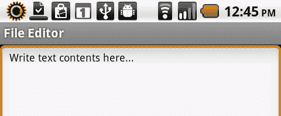
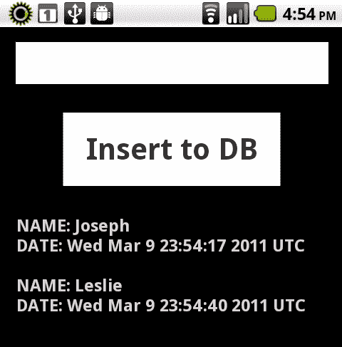
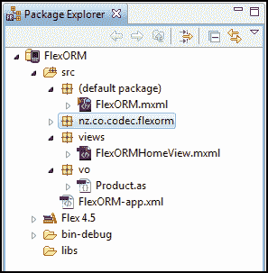
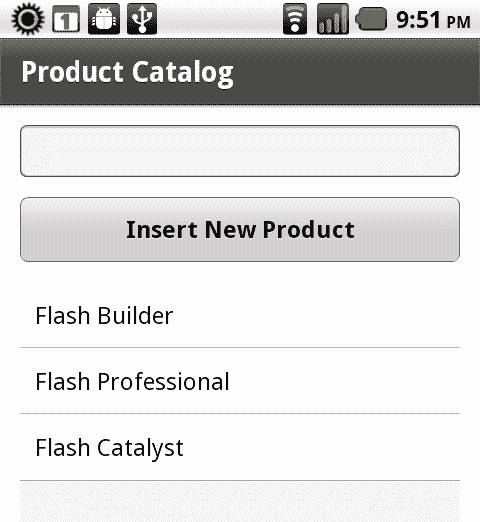

# 第八章。丰富的访问:文件系统和本地数据库

本章将涵盖以下食谱:

*   从设备存储打开本地文件
*   将文件保存到设备存储器
*   通过本地共享对象跨会话保存数据
*   使用 Flex 自动存储应用程序状态
*   创建本地 SQLite 数据库
*   提供默认应用程序数据库
*   使用 FlexORM 自动化数据库任务

# 简介

许多文件系统属性在桌面和移动设备之间共享，然而在安卓设备上有特定的用例来处理会话中断时的应用程序状态保存，或者简单地跨会话保存数据。本章将介绍加载和保存单个文件、创建和管理本地数据库、处理本地共享对象以及使用移动 Flex 框架保存导航状态的技巧。

# 从设备存储器打开本地文件

通常，我们可能希望从应用程序存储或安卓设备上的其他位置读取某些文件。在下面的例子中，我们将对一个简单的文本文件执行这个动作，但是这也可以用来读入从图像数据到编码的`MP3`音频字节的各种文件。

## 怎么做...

在`flash.filesystem`包中使用各种类来打开应用程序中的本地文件数据:

1.  首先，我们需要导入以下类:

    ```java
    import flash.display.Sprite;
    import flash.display.StageAlign;
    import flash.display.StageScaleMode;
    import flash.events.Event;
    import flash.filesystem.File;
    import flash.filesystem.FileMode;
    import flash.filesystem.FileStream;
    import flash.text.TextField;
    import flash.text.TextFormat;

    ```

2.  我们现在将开始定义一组在整个应用程序中使用的常量和变量。初始化一个`String`常量以保留文件路径，该路径将在示例中使用。为了在我们的应用程序中打开文本文件，我们还需要一个`File`和附带的`FileStream`，以及一对`TextField`和`TextFormat`作为我们的最终输出显示:

    ```java
    private const PATH:String = "android.txt";
    private var file:File;
    private var stream:FileStream;
    private var traceField:TextField;
    private var traceFormat:TextFormat;

    ```

3.  现在，我们将继续设置我们的`TextField`，应用一个`TextFormat`，并将其添加到`DisplayList`。这里，我们创建一个方法来为我们执行所有这些操作:

    ```java
    protected function setupTextField():void {
    traceFormat = new TextFormat();
    traceFormat.bold = true;
    traceFormat.font = "_sans";
    traceFormat.size = 24;
    traceFormat.align = "center";
    traceFormat.color = 0xCCCCCC;
    traceField = new TextField();
    traceField.defaultTextFormat = traceFormat;
    traceField.selectable = false;
    traceField.multiline = true;
    traceField.wordWrap = true;
    traceField.mouseEnabled = false;
    traceField.x = 20;
    traceField.y = 20;
    traceField.width = stage.stageWidth-40;
    traceField.height = stage.stageHeight-40;
    addChild(traceField);
    }

    ```

4.  为了在我们的应用程序中实际打开文件，我们将首先实例化我们的`File`对象，并通过`File.applicationDirectory`将其分配给当前的应用程序目录。然后，我们可以通过传入常数来指定该位置中的文件，该常数通过`File.resolvePath()`方法来声明它。
5.  这个过程的第二部分包括实例化一个`FileStream`，这将允许我们执行剩余的过程。在`FileStream`上注册一个类型为`Event.COMPLETE`的事件监听器。最后，调用`FileStream.openAsync()`传入先前定义的`File`作为第一个参数，然后是`FileMode`。我们将简单地读入这个文件的字节，所以使用`FileMode.READ:`

    ```java
    protected function beginFileOpen():void {
    file = new File();
    file = File.applicationDirectory;
    file = file.resolvePath(path);
    stream = new FileStream();
    stream.addEventListener(Event.COMPLETE, fileOpened);
    stream.openAsync(file, FileMode.READ);
    }

    ```

6.  一旦`FileStream`完成了它的工作，我们的`fileOpened`方法将会启动，允许我们以纯文本的形式读入`File`字节(由`File.systemCharset)`指定)，并将文本分配给我们的`TextField`。每当我们处理完一个`FileStream`对象时，我们必须对其调用`close()`:

    ```java
    protected function fileOpened(e:Event):void {
    traceField.text = stream.readMultiByte(stream.bytesAvailable, File.systemCharset);
    stream.close();
    }

    ```

7.  When we compile and run our application upon a device, it should appear as follows:

    

## 它是如何工作的...

我们可以通过创建`File`引用并通过`FileStream`打开该引用来打开应用程序中的文件。一旦过程完成，我们就可以处理文件本身的内容，或者通过直接赋值，或者通过处理其中的字节。在这个例子中，我们读入一个文本文件的内容，并将其输出到我们的应用程序中的一个基本的`TextField`中。`FileStream`类有许多不同的方法和属性，可以或多或少有效地用于不同的文件类型和进程。例如，我们在这里使用`FileStream.openAsync()`方法实际打开`FileStream`。我们也可以使用`FileStream.open()`方法，但是使用`openAsync()`将允许我们使用一个事件监听器，这样我们就可以对充满信心的数据做出反应。重要的是通过文档阅读这些内容，并使用最适合您特定情况的方法。

我们可以利用`flash.filesystem.File`类的许多静态属性来快速访问各种存储位置。具体如下:

*   `File.applicationStorageDirectory:`唯一的应用程序存储目录[读/写]
*   `File.applicationDirectory:`应用程序安装目录【只读】
*   `File.desktopDirectory:`映射到 SD 卡根[读/写]
*   `File.documentsDirectory:`映射到 SD 卡根[读/写]
*   `File.userDirectory:`映射到 SD 卡根[读/写]

要全面了解`File`课程，请参考 Adobe LiveDocs:

[http://help . adobe . com/en _ US/FlashPlatform/reference/action script/3/flash/file/file . html](http://help.adobe.com/en_US/FlashPlatform/reference/actionscript/3/flash/filesystem/File.html)T2】

## 还有更多...

在本例中，当我们打开一个文本文件时，任何文件都可以以类似的方式打开和处理。但是，如果您对复杂文件类型的工作原理没有很好的了解，那么读取这种类型的字节会非常困难，对于较大的文件，由于您可能对加载的字节执行大量的处理，移动设备上的过程可能会很慢。

# 将文件保存到设备存储器

我们可以通过多种方式将数据从应用程序保存到本地设备存储中。音频、图像和文本数据都可以由用户创建并保存到应用程序定义的位置，或者用户可以选择在安卓设备中的哪个特定位置存储文件。在本例中，我们将通过生成一个简单的文本文件来演示这一点。

## 怎么做...

我们将允许用户选择他们将在我们的应用程序中生成的基本文本文件的位置和名称，并保存到他们的安卓设备中:

1.  首先，我们需要导入以下类:

    ```java
    import flash.display.Sprite;
    import flash.display.StageAlign;
    import flash.display.StageScaleMode;
    import flash.events.Event;
    import flash.events.TouchEvent;
    import flash.filesystem.File;
    import flash.text.TextField;
    import flash.text.TextFormat;
    import flash.ui.Multitouch;
    import flash.ui.MultitouchInputMode;

    ```

2.  我们需要声明一些在这个应用程序中使用的对象。一个`String`常量将用于定义我们的文件名。接下来，我们声明一个`File`对象，它最终将用于将我们的文本文件保存到磁盘。一对`TextField`和`TextFormat`将在设备显示屏上转发短信。最后，声明一个`Sprite`作为我们的交互元素，另外还有一对`TextField`和`TextFormat`作为按钮标签:

    ```java
    private const FILE_NAME:String = "airandroid.txt";
    private var file:File;
    private var traceField:TextField;
    private var traceFormat:TextFormat;
    private var fauxButton:Sprite;
    private var buttonField:TextField;
    private var buttonFormat:TextFormat;

    ```

3.  现在，我们将继续设置我们的`TextField`，应用一个`TextFormat`，并将其添加到`DisplayList`。在这里，我们创建一个方法来为我们执行所有这些操作。请务必将`TextField.type`设置为`input`，以便用户输入！

    ```java
    protected function setupTextField():void {
    traceFormat = new TextFormat();
    traceFormat.bold = true;
    traceFormat.font = "_sans";
    traceFormat.size = 44;
    traceFormat.align = "center";
    traceFormat.color = 0x000000;
    traceField = new TextField();
    traceField.defaultTextFormat = traceFormat;
    traceField.type = "input";
    traceField.border = true;
    traceField.multiline = true;
    traceField.wordWrap = true;
    traceField.background = true;
    traceField.border = true;
    traceField.x = 20;
    traceField.y = 20;
    traceField.width = stage.stageWidth-40;
    traceField.height = 250;
    addChild(traceField);
    }

    ```

4.  现在；我们将继续设置我们的`TextField`，应用一个`TextFormat`对象，并使用图形 API 构建一个带有简单背景填充的`Sprite`。我们按钮构建的最后一步是将`TextField`添加到我们的`Sprite`中，然后将`Sprite`添加到`DisplayList`中。在这里，我们创建了一个方法来为我们执行所有这些操作以及一些风格增强:

    ```java
    protected function setupTextButton():void {
    buttonFormat = new TextFormat();
    buttonFormat.bold = true;
    buttonFormat.font = "_sans";
    buttonFormat.size = 42;
    buttonFormat.align = "center";
    buttonFormat.color = 0x333333;
    buttonField = new TextField();
    buttonField.defaultTextFormat = buttonFormat;
    buttonField.autoSize = "left";
    buttonField.selectable = false;
    buttonField.mouseEnabled = false;
    buttonField.text = "Save as File";
    buttonField.x = 30;
    buttonField.y = 25;
    fauxButton = new Sprite();
    fauxButton.addChild(buttonField);
    fauxButton.graphics.beginFill(0xFFFFFF, 1);
    fauxButton.graphics.drawRect(0, 0, buttonField.width+60, buttonField.height+50);
    fauxButton.graphics.endFill();
    fauxButton.x = (stage.stageWidth/2) (fauxButton.width/2);
    fauxButton.y = traceField.y+traceField.height+40;
    addChild(fauxButton);
    }

    ```

5.  If we run our application, we can see how everything lays out on the display. We can also, at this point, freely edit the `TextField`, which serves as input for our text file:

    

6.  我们现在将通过`MultitouchInputMode.TOUCH_POINT`常数分配`Multitouch.inputMode`来响应原始触摸事件。在`Sprite`按钮上注册类型为`TouchEvent.TOUCH_TAP`的事件监听器。这将检测用户发起的任何触摸点击事件，并调用名为`onTouchTap`的方法，该方法包含我们逻辑的剩余部分:

    ```java
    protected function registerListeners():void {
    Multitouch.inputMode = MultitouchInputMode.TOUCH_POINT;
    fauxButton.addEventListener(TouchEvent.TOUCH_TAP, onTouchTap);
    }

    ```

7.  当用户与应用程序交互并在按钮上执行轻触以将任何文本输入保存为文件时，将触发以下方法。在这个函数中，我们首先创建一个新的`File`对象，并在调用`File.save()`之前注册一个类型为`Event.COMPLETE`的事件监听器。`File.Save()`方法需要两个参数，要创建的文件的内容和文件的名称:

    ```java
    protected function onTouchTap(e:TouchEvent):void {
    file = new File();
    file.addEventListener(Event.COMPLETE, fileSaved);
    file.save(traceField.text, FILE_NAME);
    }

    ```

8.  Once the user inputs some text and hits the button to save it as a file, Android will produce an overlay requesting confirmation to perform the save. The user, at this point, can rename the file or save to an alternate location. By default, the file is saved to the root of the device SD card. If we want to avoid a save dialog, we can employ a `flash.filesystem.FileStream` class to do so:

    

9.  一旦保存成功，我们可以移除事件监听器，清除输入`TextField`并更改按钮标签`TextField`，让用户知道所有内容都已正确保存:

    ```java
    protected function fileSaved(e:Event):void {
    fauxButton.removeEventListener(TouchEvent.TOUCH_TAP, onTouchTap);
    file.removeEventListener(Event.COMPLETE, fileSaved);
    traceField.text = "";
    buttonField.text = "File Saved!";
    }

    ```

10.  The following image illustrates what the user will see upon a successful save:

    

11.  The user can now use a file browser or some other application to open the text file within the default Android text viewer, as seen in the following screenshot:

    

## 它是如何工作的...

将纯文本文件写入设备存储器相当简单。该过程包括创建一个`File`对象，然后在该对象上调用`save()`方法。使用这种方法，我们传递要保存的文件的内容以及所需的文件名。请注意，在这种情况下，当我们传递简单的文本时，我们也可以以音频文件或图像的形式保存字节。如果我们需要对整个过程进行更多的控制，我们还可以使用`FileStream`对象来设置各种编码，并以更多样的方式写入字节。使用`FileStream`还将允许我们向先前创建的文件添加新信息，并避免本例中看到的保存对话框。

## 还有更多...

您将需要提供任何写入本地文件的应用程序访问权限，以便通过安卓清单文件写入本地文件系统。关于这方面的更多信息，请参见[第 9 章](09.html "Chapter 9. Manifest Assurance: Security and Android Permissions")、*清单保证:安全性和安卓权限。*

# 通过本地共享对象跨会话保存数据

共享对象已经在基于浏览器的 Flash 应用程序中使用了多年。它们有时被称为“闪存 cookie”或“超级 cookie”，确实提供了与普通基于浏览器的 cookie 相同的功能，但更适合闪存环境。通常，使用网络上的闪存应用程序保存此类数据需要明确的权限；然而，使用 AIR 使我们摆脱了许多这些限制。

## 怎么做...

创建本地`SharedObject`以跨会话保存特定的应用程序数据。我们将使用互动的`Sprite`来直观地说明这一点:

1.  首先，我们需要导入以下类:

    ```java
    import flash.display.Sprite;
    import flash.display.StageAlign;
    import flash.display.StageScaleMode;
    import flash.events.Event;
    import flash.events.TouchEvent;
    import flash.geom.Point;
    import flash.net.SharedObject;
    import flash.net.SharedObjectFlushStatus;
    import flash.text.TextField;
    import flash.text.TextFormat;
    import flash.ui.Multitouch;
    import flash.ui.MultitouchInputMode;

    ```

2.  然后，我们需要声明一些在这个应用程序中使用的对象。声明一个`SharedObject`，用于保存会话数据。`Point`对象将用于在`SharedObject`上书写坐标。A `Sprite`将作为本例的用户交互元素和视觉参考。最后，声明一对`TextField`和`TextFormat`将文本消息传递到设备显示屏上:

    ```java
    private var airSO:SharedObject;
    private var ballPoint:Point;
    private var ball:Sprite;
    private var traceField:TextField;
    private var traceFormat:TextFormat;

    ```

3.  现在，我们将继续设置我们的`TextField`，应用一个`TextFormat`，并将其添加到`DisplayList`。这里，我们创建一个方法来为我们执行所有这些操作:

    ```java
    protected function setupTextField():void {
    traceFormat = new TextFormat();
    traceFormat.bold = true;
    traceFormat.font = "_sans";
    traceFormat.size = 24;
    traceFormat.align = "center";
    traceFormat.color = 0xCCCCCC;
    traceField = new TextField();
    traceField.defaultTextFormat = traceFormat;
    traceField.selectable = false;
    traceField.multiline = true;
    traceField.wordWrap = true;
    traceField.mouseEnabled = false;
    traceField.x = 20;
    traceField.y = 20;
    traceField.width = stage.stageWidth-40;
    traceField.height = stage.stageHeight-40;
    addChild(traceField);
    }

    ```

4.  我们需要为用户设置一个基于触摸的交互对象。该对象的坐标最终将在应用程序会话中保留。让我们用图形应用编程接口

    ```java
    protected function setupBall():void {
    ball = new Sprite();
    ball.graphics.beginFill(0xFFFFFF);
    ball.graphics.drawCircle(0, 0, 60);
    ball.graphics.endFill();
    ball.x = stage.stageWidth/2;
    ball.y = 260;
    addChild(ball);
    }

    ```

    创建一个基本的循环`Sprite`
5.  在深入这个例子之前，我们必须对已经声明的`SharedObject`执行一些操作。首先，在我们的`SharedObject`实例上调用`SharedObject.getLocal("airandroid")`。这将在名为`airandroid`的`SharedObject`中读取，如果它存在的话。如果`SharedObject`还不存在，这个调用会为我们创建它。
6.  现在我们可以检查`ballPoint`对象是否存在于`SharedObjectdata`属性中。如果是这样，这意味着我们已经完成了之前的一个会话，并且可以将`ballPoint x`和`y`属性分配给我们的`ballSprite:`

    ```java
    protected function setupSharedObject():void {
    airSO = SharedObject.getLocal("airandroid");
    if(airSO.data.ballPoint != undefined){
    ball.x = airSO.data.ballPoint.x;
    ball.y = airSO.data.ballPoint.y;
    traceField.text = "Existing Shared Object!";
    }else{
    traceField.text = "No Shared Object Found!";
    }
    }

    ```

7.  When we run the application for the first time, we are told that no shared object is detected and the ball is placed in the default position:

    

8.  我们现在将通过`MultitouchInputMode.TOUCH_POINT`常数分配`Multitouch.inputMode`来响应原始触摸事件。在通告`Sprite`上注册两个`TouchEvent.TOUCH_MOVE`和`TouchEvent.TOUCH_END`类型的事件监听器。这将检测用户发起的任何触摸事件，并调用某些方法来处理每一个:

    ```java
    protected function registerListeners():void {
    Multitouch.inputMode = MultitouchInputMode.TOUCH_POINT;
    ball.addEventListener(TouchEvent.TOUCH_MOVE, onTouchMove);
    ball.addEventListener(TouchEvent.TOUCH_END, onTouchEnd);
    }

    ```

9.  当在我们的`Sprite`上检测到`TouchEvent.TOUCH_MOVE`事件时，`onTouchMove`方法触发，允许我们更改`Sprite`的`x`和`y`坐标，以允许用户在`Stage:`

    ```java
    protected function onTouchMove(e:TouchEvent):void {
    ball.x = e.stageX;
    ball.y = e.stageY;
    }

    ```

    周围拖动它
10.  当我们的应用程序在`Sprite`对象上检测到`TouchEvent.TOUCH_END`事件时，我们将利用这个机会将`Sprite x`和`y`坐标包装在`Point`对象中，并将其分配给我们的`SharedObject`。要执行此操作，我们首先将`Sprite`坐标分配给我们的`Point`对象，然后将其分配给我们的`SharedObjectdata`属性。
11.  为了将`SharedObject`写入本地文件系统，我们必须调用`SharedObject.flush()`。我们可以将`flush()`命令返回值分配给`String`，以便监控和响应其状态。在本例中，我们只需使用 switch/case 语句来检查`SharedObjectFlushStatus`并将消息写入我们的`TextField`，让用户知道发生了什么:

    ```java
    protected function onTouchEnd(e:Event):void {
    ballPoint = new Point(ball.x, ball.y);
    airSO.data.ballPoint = ballPoint;
    var flushStatus:String;
    flushStatus = airSO.flush();
    if(flushStatus != null) {
    switch(flushStatus) {
    case SharedObjectFlushStatus.FLUSHED:
    traceField.text = "Ball location x:" + ball.x + "/y:" + ball.y + " saved!";
    break;
    default:
    traceField.text = "There was a problem :(";
    break;
    }
    }
    }

    ```

12.  The user can now interact with the ball by touching and moving it around the display. When the user stops interacting with the ball, these coordinates are saved to our local shared object:

    

    ### 注

    如果用户存在，并且在未来某个时间再次打开应用程序，则读入本地共享对象，并基于该保留的数据重新定位球。为了在设备上真正测试这一点，开发人员需要使用安卓**设置**菜单下的应用程序管理功能来杀死应用程序，或者使用第三方“任务杀手”来确保应用程序完全停止。

    

## 它是如何工作的...

Flash 中的一个`SharedObject`很像网络浏览器中使用的 cookie 实现。它最初是在基于浏览器的闪存中实现的，以便在开发人员希望跨用户会话保存小块数据时提供类似的体验。幸运的是，这也适用于 AIR，并且可以在我们的安卓应用程序中用作简单的存储。

要读取`SharedObject`，只需调用上面的`getLocal()`方法，传入我们想要检索的`SharedObject`的名称。为了保存一个`SharedObject`，我们给它分配新的数据，并调用`flush()`方法，将新的信息保存到磁盘。

## 还有更多...

在这种情况下，我们使用本地`SharedObject`，但也可以将这些数据保存到本地或远程数据库、文本或 XML 文件中，甚至根据我们的需要使用远程`SharedObject`。

# 使用 Flex 自动存储应用状态

虽然在我们的会话被其他设备功能(如来电)中断的情况下，我们需要存储特定的应用程序参数，但移动 Flex 框架确实提供了很好的会话保留级别，可以为我们自动处理。

## 怎么做...

通过启用`persistNavigatorState:` ，指示 Flex 自动为我们保留应用程序状态

1.  我们将首先用两个视图建立一个新的移动 Flex 项目，我们简单地称之为`first`和`second`。我们最初的`ViewNavigatorApplication`文件会这样出现:

    ```java
    <?xml version="1.0" encoding="utf-8"?>
    <s:ViewNavigatorApplication xmlns:fx="http://ns.adobe.com/mxml/ 2009"
    xmlns:s="library://ns.adobe.com/flex/spark" firstView="views.first">
    </s:ViewNavigatorApplication>

    ```

2.  在我们的`first`视图中添加一个按钮，使我们能够从那里按下`second`视图:

    ```java
    <s:Button label="Engage Second State" click="navigator.pushView(views.second);"/>

    ```

3.  在我们的`second`视图中添加一个按钮，允许我们返回到`first`视图。现在我们可以来回导航，建立我们的`ViewNavigator`历史:

    ```java
    <s:Button label="Engage First State" click="navigator.pushView(views.first)"/>

    ```

4.  为了允许 Flex 保留我们的`ViewNavigator`历史，并在我们的会话中断时保留我们在该历史中的当前位置，我们将修改`ViewNavigatorApplication`以包括一个名为`persistNavigatorState`的属性，并将它设置为`true`。让我们也声明一个`creationComplete`事件，它将调用一个名为`init()`的函数。我们将使用它来设置一些附加功能:

    ```java
    <?xml version="1.0" encoding="utf-8"?>
    <s:ViewNavigatorApplication xmlns:fx="http://ns.adobe.com/mxml/2009"
    xmlns:s="library://ns.adobe.com/flex/spark" firstView="views.first"
    persistNavigatorState="true" creationComplete="init()">
    </s:ViewNavigatorApplication>

    ```

5.  在 MXML 内创建一个`Script`标签，并导入`FlexEvent`类:

    ```java
    <fx:Script>
     <![CDATA[
     import mx.events.FlexEvent;
     ]]>
     </fx:Script>

    ```

6.  现在，我们必须声明我们的`init()`方法，它将在`creationComplete`上被调用。在此方法中，我们将在应用程序中注册类型为`FlexEvent.NAVIGATOR_STATE_SAVING`:

    ```java
    public function init():void {
    this.addEventListener(FlexEvent.NAVIGATOR_STATE_SAVING, stateSaving);
    }

    ```

    的事件侦听器
7.  每当我们的应用程序通过 Flex 持久性管理器在应用程序退出时开始保存应用程序状态时，我们的`stateSaving`方法就会触发，允许我们执行额外的操作，甚至在`FlexEvent`上调用`preventDefault()`来允许我们自己的逻辑在退出前接受命令。在开发和测试中，我们可以很容易地在这个方法中放置一个断点，以便反思我们的应用程序状态。T3】
8.  When we compile and run our application, it will appear as shown in the next screenshot. Flipping from our first to second view and back a number of times will populate the application `ViewNavigator` history:

    

9.  If our application session is interrupted by a phone call, or some other event, the navigation history and current view will be preserved. When the application is run again, the user will be able to continue exactly where the interruption occurred:

    

## 它是如何工作的...

使用移动 Flex 框架时，我们可以选择在应用程序中启用`persistNavigatorState`。这将自动保存我们的`ViewNavigator`历史，并记住我们在应用程序会话中断时正在与哪个视图交互。它通过将会话信息保存到设备上的本地共享对象来实现这一点。保存的数据包括关于应用程序版本号、完整导航堆栈和当前导航视图的信息。

此外，当应用程序开始退出时，我们可以拦截`FlexEvent.NAVIGATOR_STATE_SAVING`事件，并在它的位置执行我们自己想要的操作，例如将关键的应用程序数据保存到文件系统、本地共享对象甚至 SQLite 数据库中。

# 创建本地 SQLite 数据库

Adobe AIR 从一开始就支持嵌入式 SQLite 数据库。这是在我们的安卓应用程序中存储结构化信息的最佳方式之一。SQLite 是一个软件库，它实现了一个独立的、无服务器的、零配置的事务型 SQL 数据库引擎。它创建的数据库文件只是单独的`.db`文件，可以像任何其他文件类型一样通过网络传输、复制和删除。

## 怎么做...

我们将创建一个移动应用程序以及一个本地 SQLite 数据库，它可以使用 SQL 查询语言来允许用户添加新记录，并基于这些条目运行一个简单的查询:

1.  首先，导入本例所需的以下类:

    ```java
    import flash.data.SQLConnection;
    import flash.data.SQLStatement;
    import flash.data.SQLResult;
    import flash.display.Sprite;
    import flash.display.StageAlign;
    import flash.display.StageScaleMode;
    import flash.events.Event;
    import flash.events.TouchEvent;
    import flash.filesystem.File;
    import flash.text.TextField;
    import flash.text.TextFormat;
    import flash.ui.Multitouch;
    import flash.ui.MultitouchInputMode;

    ```

2.  我们需要声明一些在这个应用程序中使用的对象。一个`SQLConnection`将允许我们与一个本地 SQLite 数据库交互。第一对`TextField`和`TextFormat`将作为输入字段供用户输入。另一对`TextField`和`TextFormat`将在设备显示屏上转发短信。最后，声明一个`Sprite`作为我们的交互元素，同时声明最后一对`TextField`和`TextFormat`作为按钮标签:

    ```java
    private var sqlConnection:SQLConnection;
    private var itemField:TextField;
    private var itemFormat:TextFormat;
    private var fauxButton:Sprite;
    private var buttonField:TextField;
    private var buttonFormat:TextFormat;
    private var traceField:TextField;
    private var traceFormat:TextFormat;

    ```

3.  现在，我们将继续设置我们的`TextField`，应用一个`TextFormat`，并将其添加到`DisplayList`。在这里，我们创建一个方法来为我们执行所有这些操作。请务必将`TextField.type`设置为`input`，以便用户输入！

    ```java
    protected function setupTextField():void {
    itemFormat = new TextFormat();
    itemFormat.bold = true;
    itemFormat.font = "_sans";
    itemFormat.size = 44;
    itemFormat.align = "center";
    itemFormat.color = 0x000000;
    itemField = new TextField();
    itemField.defaultTextFormat = itemFormat;
    itemField.type = "input";
    itemField.border = true;
    itemField.multiline = true;
    itemField.wordWrap = true;
    itemField.background = true;
    itemField.border = true;
    itemField.x = 20;
    itemField.y = 20;
    itemField.width = stage.stageWidth-40;
    itemField.height = 60;
    addChild(itemField);
    }

    ```

4.  对于我们的交互式`Sprite`，我们将设置一个`TextField`，应用一个`TextFormat`对象，并使用图形应用编程接口构建一个带有简单背景填充的`Sprite`。我们按钮构造的最后一步是将`TextField`添加到我们的`Sprite`中，然后将`Sprite`添加到`DisplayList`中。在这里，我们创建了一个方法来为我们执行所有这些操作以及一些风格增强:

    ```java
    protected function setupTextButton():void {
    buttonFormat = new TextFormat();
    buttonFormat.bold = true;
    buttonFormat.font = "_sans";
    buttonFormat.size = 42;
    buttonFormat.align = "center";
    buttonFormat.color = 0x333333;
    buttonField = new TextField();
    buttonField.defaultTextFormat = buttonFormat;
    buttonField.autoSize = "left";
    buttonField.selectable = false;
    buttonField.mouseEnabled = false;
    buttonField.text = "Insert to DB";
    buttonField.x = 30;
    buttonField.y = 25;
    fauxButton = new Sprite();
    fauxButton.addChild(buttonField);
    fauxButton.graphics.beginFill(0xFFFFFF, 1);
    fauxButton.graphics.drawRect(0, 0, buttonField.width+60, buttonField.height+50);
    fauxButton.graphics.endFill();
    fauxButton.x = (stage.stageWidth/2) - (fauxButton.width/2);
    fauxButton.y = itemField.y+itemField.height+40;
    addChild(fauxButton);
    }

    ```

5.  我们最后的视觉元素涉及另一对`TextField`和`TextFormat`来显示设备上的数据库记录:

    ```java
    protected function setupTraceField():void {
    traceFormat = new TextFormat();
    traceFormat.bold = true;
    traceFormat.font = "_sans";
    traceFormat.size = 24;
    traceFormat.align = "left";
    traceFormat.color = 0xCCCCCC;
    traceField = new TextField();
    traceField.defaultTextFormat = traceFormat;
    traceField.selectable = false;
    traceField.multiline = true;
    traceField.wordWrap = true;
    traceField.mouseEnabled = false;
    traceField.x = 20;
    traceField.y = fauxButton.y+fauxButton.height+40;
    traceField.width = stage.stageWidth-40;
    traceField.height =stage.stageHeight - traceField.y;
    addChild(traceField);
    }

    ```

6.  我们现在将通过`MultitouchInputMode.TOUCH_POINT`常数分配`Multitouch.inputMode`来响应原始触摸事件。在`Sprite`按钮上注册类型为`TouchEvent.TOUCH_TAP`的事件监听器。这将检测用户发起的任何触摸点击事件，并调用名为`onTouchTap`的方法来执行附加动作。

    ```java
    protected function registerListeners():void {
    Multitouch.inputMode = MultitouchInputMode.TOUCH_POINT;
    fauxButton.addEventListener(TouchEvent.TOUCH_TAP, insertDBItem);
    }

    ```

7.  要创建应用程序数据库，我们必须首先初始化我们的`SQLConnection`对象，并将`File.db`引用传递到`SQLConnection.open()`方法中以建立连接。如果数据库文件不存在，将自动创建它。为了编写与我们的数据库交互的 SQL 语法，我们必须初始化一个`SQLStatement`对象，并将我们建立的`SQLConnection`分配给`SQLStatement.sqlConnection`属性。此时，我们可以将一组`String`SQL 语句传入`SQLStatement.text`属性，并调用`SQLConnection.execute()`来实际执行该语句。该语法将在我们的数据库中创建一个包含两列的表，`name`和`time`。如果该表已经存在，该语句将被忽略:

    ```java
    protected function createDB():void {
    sqlConnection = new SQLConnection();
    sqlConnection.open(File.applicationStorageDirectory. resolvePath("airandroid.db"));
    var sqlStatement:SQLStatement = new SQLStatement();
    sqlStatement.sqlConnection = sqlConnection;
    sqlStatement.text = "CREATE TABLE IF NOT EXISTS items (name TEXT, time TEXT)";
    sqlStatement.execute();
    getDBItems();
    }

    ```

8.  为了从数据库中检索现有记录，我们将再次初始化一个`SQLStatement`并将建立的`SQLConnection`分配给`SQLStatement.sqlConnection`属性。然后，我们将把一组`String`SQL 语句传入`SQLStatement.text`属性，并调用`SQLConnection.execute()`从数据库中检索所有记录。
9.  要将返回的数据写到一个`TextField`中，我们只需初始化一个新的`Array`来包含返回的记录，方法是将`data`属性(它本身是`SQLStatement.getResult()`的`Array)`分配给`Array`。现在创建一个`for`循环来解析结果，将分配给每个记录的各种属性输出到我们的`TextField`中。这将在安卓设备上直观地显示查询结果:

    ```java
    protected function getDBItems():void {
    traceField.text = "";
    var sqlStatement:SQLStatement = new SQLStatement();
    sqlStatement.sqlConnection = sqlConnection;
    sqlStatement.text = "SELECT * FROM items";
    sqlStatement.execute();
    var sqlArray:Array = new Array();
    var sqlResult:SQLResult = sqlStatement.getResult();
    if(sqlResult.data != null){
    sqlArray = sqlResult.data;
    }
    var itemCount:int = sqlArray.length;
    for(var i:int=0; i<itemCount; i++){
    traceField.appendText("NAME: " + sqlArray[i].name + "\n");
    traceField.appendText("DATE: " + sqlArray[i].time + "\n");
    traceField.appendText("\n");
    }
    }

    ```

10.  我们需要编写的最后一个方法将允许用户向数据库插入记录。这其中很多与我们在过去两种方法中建立和执行`SQLStatement`对象的方式非常相似。然而，插入可能更加复杂和结构化，所以我们利用内置的`SQLStatement.parametersArray`为记录赋值。对于`name`值，我们从用户提供的输入`TextField`值中读取。为了生成时间戳来填充`time`的值，我们实例化一个新的`Date`对象并调用`toUTCString()`。执行完这个完整格式的语句后，我们再次调用`getDBItems()`返回新的数据库结果，让用户立即看到记录已经正确插入:

    ```java
    protected function insertDBItem(e:TouchEvent):void {
    var date:Date = new Date();
    var sqlStatement:SQLStatement = new SQLStatement();
    sqlStatement.sqlConnection = sqlConnection;
    sqlStatement.text = "INSERT into items values(:name, :time)";
    sqlStatement.parameters[":name"] = itemField.text;
    sqlStatement.parameters[":time"] = date.toUTCString();
    sqlStatement.execute();
    getDBItems();
    itemField.text = "";
    }

    ```

11.  Running the application on our Android device allows us to input a name using the native virtual keyboard touch tap the **Insert to DB** button, which will create a new entry in our database consisting of the input text and current timestamp.

    

12.  Each time we enter a new name into the application, the new entry is inserted and a query is made to trace all entries out into the `TextField`, along with the timestamp from when they were inserted:

    

## 它是如何工作的...

SQLite 是一个本地的、独立的数据库，它可以在 AIR 中用于 Android 应用程序的各种任务，从简单到复杂。为了使用这个功能，我们必须在设备上建立一个到本地`.db`文件的`SQLConnection`。一旦建立了这个连接，我们就可以使用一组`SQLStatements`通过标准的 SQL 语法来执行表创建和管理任务、选择、插入和删除查询。在本例中，用户可以插入记录，并对应用程序存储目录中的数据库文件执行一般选择查询。

在这个演示中，我们使用`flash.data.SQLStatement`来执行`INSERT`和`SELECT`操作。关于这方面的进一步探索，以及相关的课程，我们建议您参考 Adobe LiveDocs:

[http://help . adobe . com/en _ US/FlashPlatform/reference/action script/3/flash/data/sqlstatement . html](http://help.adobe.com/en_US/FlashPlatform/reference/actionscript/3/flash/data/SQLStatement.html)

# 提供默认应用数据库

允许用户直接或间接在应用程序数据库中添加和删除项目，在各种场景中都非常有用。也许，我们想让用户从一个标准的数据集开始，或者提供一些默认的设置让用户在以后操作？这些场景要求应用程序能够为自己提供一个默认数据库。在这个食谱中，我们将演示如何通过文件系统智能地处理这个问题。

## 做好准备...

在这个方法中，我们将在应用程序目录中绑定一个已经建立的 SQLite 数据库文件。如果您还没有访问 SQLite 数据库文件的权限，您可以使用本章中的一些其他方法来生成一个，或者使用各种其他免费可用的机制来创建这些可移植的小数据库文件。

## 怎么做...

我们将打包一个默认的 SQLite 数据库和我们的应用程序，检查用户定义的数据库是否存在，如果需要的话，为用户提供我们的默认数据库:

1.  首先，导入本例所需的以下类:

    ```java
    import flash.data.SQLConnection;
    import flash.data.SQLStatement;
    import flash.display.Sprite;
    import flash.display.StageAlign;
    import flash.display.StageScaleMode;
    import flash.filesystem.File;
    import flash.text.TextField;
    import flash.text.TextFormat;

    ```

2.  我们需要声明几个在这个应用程序中使用的对象。一个`SQLConnection`将允许我们与本地 SQLite 数据库交互，一个`TextField`和`TextFormat`配对将把文本消息传递到设备显示屏上:

    ```java
    private var sqlConnection:SQLConnection;
    private var traceField:TextField;
    private var traceFormat:TextFormat;

    ```

3.  现在，我们将设置我们的`TextField`，应用一个`TextFormat`，并将其添加到`DisplayList`以及一些风格增强。这里，我们创建一个方法来为我们执行所有这些操作:

    ```java
    protected function setupTraceField():void {
    traceFormat = new TextFormat();
    traceFormat.bold = true;
    traceFormat.font = "_sans";
    traceFormat.size = 24;
    traceFormat.align = "left";
    traceFormat.color = 0xCCCCCC;
    traceField = new TextField();
    traceField.defaultTextFormat = traceFormat;
    traceField.selectable = false;
    traceField.multiline = true;
    traceField.wordWrap = true;
    traceField.mouseEnabled = false;
    traceField.x = 20;
    traceField.y = 20;
    traceField.width = stage.stageWidth-40;
    traceField.height = stage.stageHeight-40;
    addChild(traceField);
    }

    ```

4.  一旦`TextField`建立，这个方法就会启动，因为我们将在复制过程的每一步完成时向这个视觉元素输出消息。
5.  首先要做的是确定应用程序数据库是否存在，因为这将决定我们是否需要复制默认数据库。为此，我们将实例化一个新的`File`对象，并在应用程序安装目录中引用一个名为`products.db`的文件。如果此文件不存在，我们必须创建另一个`File`对象，引用我们希望将文件复制到的文件名和位置。
6.  一旦建立，在源`File`上使用`File.copyTo()`方法，通过目的地`File`。如果一切顺利，您现在应该在应用程序存储目录中有一个默认数据库的精确副本:

    ```java
    protected function checkDefaultDB():void {
    traceField.appendText("Checking if DB exists...\n\n");
    var dbFile:File = File.applicationStorageDirectory;
    dbFile = dbFile.resolvePath("products.db");
    if(dbFile.exists){
    traceField.appendText("Application DB Okay!\n\n");
    }else{
    traceField.appendText("Application DB Missing!\n\n");
    traceField.appendText("Copying Default DB...\n\n");
    var sourceFile:File = File.applicationDirectory;
    sourceFile = sourceFile.resolvePath("default.db");
    var destination:File = File.applicationStorageDirectory;
    destination = destination.resolvePath("products.db");
    sourceFile.copyTo(destination, true);
    traceField.appendText("Database Copy Completed!\n\n");
    }
    connectDB();
    }

    ```

7.  要打开应用程序数据库，我们必须首先初始化我们的`SQLConnection`对象，并将一个`File.db`引用传递到`SQLConnection.open()`方法中以建立连接。现在我们已经连接到新复制的数据库，我们调用`getDBItems()`方法来检索显示的记录:

    ```java
    protected function connectDB():void {
    sqlConnection = new SQLConnection();
    sqlConnection.open(File.applicationStorageDirectory. resolvePath("products.db"));
    getDBItems();
    }

    ```

8.  为了从复制的数据库中检索所有记录，我们将初始化一个`SQLStatement`并将建立的`SQLConnection`分配给`SQLStatement.sqlConnection`属性。然后，我们将把一组`String`SQL 语句传入`SQLStatement.text`属性，并调用`SQLConnection.execute()`从数据库中检索所有记录。
9.  要将返回的数据写到一个`TextField`中，我们只需初始化一个新的`Array`来包含返回的记录，方法是将`data`属性(它本身是`SQLStatement.getResult()`的`Array)`分配给`Array`。现在创建一个`for`循环来解析结果，将分配给每个记录的各种属性输出到我们的`TextField`中。这将在安卓设备上直观地展示查询结果:

    ```java
    protected function getDBItems():void {
    traceField.appendText("Gathering items from application DB...\ n\n");
    var sqlStatement:SQLStatement = new SQLStatement();
    sqlStatement.sqlConnection = sqlConnection;
    sqlStatement.text = "SELECT * FROM Products";
    sqlStatement.execute();
    var sqlArray:Array = sqlStatement.getResult().data;
    var itemCount:int = sqlArray.length;
    traceField.appendText("Database Contains:\n");
    for(var i:int=0; i<itemCount; i++){
    traceField.appendText("PRODUCT: " + sqlArray[i].ProductName + "\n");
    }
    }

    ```

10.  The first time the application is run, a database is not found within the application storage directory. The default database is then copied into the expected position and then records are retrieved and displayed for the user to view:

    

11.  If the user runs this application subsequent times, the database is now in the expected location and the application simply performs a query and displays the records without any need to copy files from one location to another:

    

## 它是如何工作的...

在这个方法中，我们使用`File`和`SQLConnection/SQLStatement`对象的组合来确定数据库是否存在，然后进行简单的查询和记录显示，或者使用`File.copyTo()`将更复杂的文件从应用程序安装目录复制到应用程序存储目录中。此方法将文件引用作为初始参数传入指定位置。还有许多其他类似的文件操作方法。我们将列出其中一些如下:

*   `File.copyTo():`将文件或目录复制到新位置
*   `File.moveTo():`将文件或目录移动到新位置
*   `File.deleteFile()XE`“默认应用数据库:File.deleteFile()方法”:删除指定文件
*   `File.createDirectory():`创建一个目录以及任何需要的父目录
*   `File.deleteDirectory():`删除指定目录

要全面了解`File`课程，请参考 Adobe LiveDocs:

[http://help . adobe . com/en _ US/FlashPlatform/reference/action script/3/flash/file/file . html](http://help.adobe.com/en_US/FlashPlatform/reference/actionscript/3/flash/filesystem/File.html)

数据库文件只是一个常规文件，可以像任何其他文件一样通过 ActionScript 轻松地进行操作。在这种情况下，公平地理解应用程序对哪些目录有写权限或没有写权限是很重要的。例如，`File.applicationDirectory`是只读的。我们无法将文件写入此目录。

如果你需要一个工具来创建或管理 SQLite 数据库文件，你可能会对一个软件项目感兴趣，比如 SQLite 数据库浏览器，可以从[http://sqlitebrowser.sourceforge.net/](http://sqlitebrowser.sourceforge.net/)免费下载。

# 使用 FlexORM 自动执行数据库任务

虽然我们确实可以通过支持的 SQLite 语法完全控制应用程序数据库，但也有一些代码库可以让事情变得简单一些。一个这样的库叫做**flexrm**，顾名思义，它只能在 Flex 项目中使用，所以纯 ActionScript 已经过时了。

FlexORM 是一个对象关系映射框架，它避免了开发人员为项目编写任何数据库代码或 SQL。对象是持久的，任何数据库转换都由框架本身在幕后处理。

## 做好准备...

在准备这个应用程序示例时，您将需要采取一些额外的步骤来做好准备，因为获取 FlexORM 库并在项目中设置它涉及到一些设置:

1.  首先，我们必须打开一个网络浏览器，转到柔性版的项目页面[http://flexorm.riaforge.org/](http://flexorm.riaforge.org/)。
2.  通过屏幕底部的`ZIP`包或通过 SVN 存储库下载文件。
3.  一旦文件在您的系统上，我们将希望导航到**trunk | flex RM | src**并获取 **src** 下的所有内容。为了使用 FlexORM，我们必须将这个包导入到 Flash Builder 中。
4.  创建一个新的移动弹性项目，并将文件从 **src** 拖动到弹性项目 **src** 文件夹下。我们现在可以开始在我们的应用程序中使用**flex RM**。
5.  Your project will look very similar to the one shown in the following screenshot:

    

## 怎么做...

使用**flexrm**框架，我们将定义一个持久对象结构，并通过一个简单的 Flex 移动项目来管理对象条目的创建和删除:

1.  我们要做的第一件事是在名为`Product`的`vo`【值对象】包中创建一个类。这将作为我们的可绑定对象的声明，并反映我们将从数据库中插入和读取的内容。使用特定于**flex RM**的元数据，我们声明了一个名为`Products`的表，该表有一个名为`id`的 ID 列和一个名为`ProductName`的附加列。这些对象充当我们实际表结构的接口，并允许我们通过熟悉的面向对象范例来管理 SQL 命令:

    ```java
    package vo {
    [Bindable]
    [Table(name="Products")]
    public class Product {
    [Id]public var id:int;
    [Column]public var ProductName:String;
    }
    }

    ```

2.  下一步将编写一个`ViewNavigatorApplication` MXML 文件作为我们的主应用程序文件。我们可以包括指向特定`View`的`firstView`属性和`applicationComplete`属性，这将为我们调用初始化函数:

    ```java
    <?xml version="1.0" encoding="utf-8"?>
    <s:ViewNavigatorApplication xmlns:fx= "http://ns.adobe.com/mxml/2009"
    xmlns:s="library://ns.adobe.com/flex/spark" firstView="views.FlexORMHomeView" applicationComplete="init()">
    </s:ViewNavigatorApplication>

    ```

3.  现在我们将声明一个`Script`块并执行一组导入，这对我们应用程序的这一部分是必要的。我们只需要**柔性版**的`EntityManager`。这是用来读写我们的数据库的。我们还必须导入我们的`vo`对象类，以便与**flex RM**一起使用，以及`ArrayCollection`来保存生成的任何记录:

    ```java
    <fx:Script>
    <![
    CDATA[
    import nz.co.codec.flexorm.EntityManager;
    import vo.Product;
    import mx.collections.ArrayCollection;
    ]]>
    </fx:Script>

    ```

4.  这里，我们将实例化`EntityManager`和`ArrayCollection`以便在应用程序中使用。调用`EntityManager.getInstance()`将允许我们开始使用**柔轮:**

    ```java
    protected var entityManager:EntityManager = EntityManager.getInstance();
    [Bindable] public var productArrayCollection:ArrayCollection;

    ```

5.  我们必须定义`ViewNavigatorApplication`标签中提到的初始化方法。在该方法中，使用`File`类来引用要在应用程序存储目录中创建的数据库文件。创建一个新的`SQLConnection`并用它打开先前定义的`File`参照。`SQLConnection`现在可以绑定到我们的`EntityManager`的`sqlConnection`属性，允许我们使用**flex RM:**

    ```java
    protected function init():void {
    var databaseFile:File =
    File.applicationStorageDirectory.resolvePath("products.db");
    var connection:SQLConnection = new SQLConnection();
    connection.open(databaseFile);
    entityManager.sqlConnection = connection;
    loadProducts();
    }

    ```

    与数据库交互
6.  每当我们想从数据库中刷新集合时，都可以调用这个方法。只需在`EntityManager`上调用`findAll()`并传入我们想要检索的类名，就会返回绑定到该类的表中的所有记录:

    ```java
    protected function loadProducts():void {
    productArrayCollection = entityManager.findAll(Product);
    productArrayCollection.refresh();
    }

    ```

7.  我们需要设置从应用程序数据库中插入和删除记录的方法。为了保存记录，我们根据与我们希望保存到的表对应的类创建一个对象。现在，我们将根据我们为这次插入写入值的字段，为这个类分配属性。传入该对象时调用`EntityManager.save()`将指示**flex RM**将新记录插入数据库:

    ```java
    public function saveProduct(e:String):void {
    var ProductEntry:Product = new Product();
    ProductEntry.ProductName = e;
    entityManager.save(ProductEntry);
    loadProducts();
    }

    ```

8.  从数据库中删除记录同样简单。在传递我们集合中的对象时调用`EntityManager.remove()`，这对应于要从我们的数据库中删除的特定记录，这将确保**flex RM**为我们删除真实记录:

    ```java
    public function deleteProduct(index:int):void {
    entityManager.remove(productArrayCollection.getItemAt(index));
    loadProducts();
    }

    ```

9.  现在来构建我们的应用程序视图。创建一个新的`View` MXML 文件，该文件具有适合您的特定项目视图的任何属性。在这种情况下，我们给它分配了一个带有大量填充的【T1:

    ```java
    <?xml version="1.0" encoding="utf-8"?>
    <s:View xmlns:fx="http://ns.adobe.com/mxml/2009"
    xmlns:s="library://ns.adobe.com/flex/spark" title="Product Catalog">
    <s:layout>
    <s:VerticalLayout gap="20" paddingBottom="20" paddingLeft="20" paddingRight="20" paddingTop="20"/>
    </s:layout>
    </s:View>

    ```

10.  The controls in our application which a user is able to interact with will consist of a `TextInput` to type in, a `Button` to submit from, and a `List` to display all of our database records. We will invoke a function called `addProduct()` on button click, and another function called `removeProduct()`, which is tied to our list change event. The final modification will be to bind our `ListdataProvider` to the defined `productArrayCollection` within our main MXML file.

    ### 注

    我们在这个例子中使用`parentApplication`作为方便。根据应用程序的结构，您可能不想这样做，因为它经常会在应用程序及其各种模块之间建立不必要的关系。

    ```java
    <s:TextInput id="entry" width="100%"/>
    <s:Button click="addProduct(event)" width="100%" label="Insert New Product"/>
    <s:List id="productList" change="removeProduct(event)" dataProvider="{this.parentApplication.productArrayCollection}" labelField="ProductName" width="100%" height="100%"></s:List>

    ```

11.  创建一个`Script`块并导入我们的`List`变更事件所需的`IndexChangeEvent`类，以正确触发:

    ```java
    <fx:Script>
    <![
    CDATA[
    import spark.events.IndexChangeEvent;
    ]]>
    </fx:Script>

    ```

12.  现在剩下要做的就是创建一些本地函数，将信息传递给我们的主 MXML 文件，并执行本地清理任务。首先，我们为`Button`点击事件创建方法，它将数据传递给我们之前创建的`saveProduct()`方法。我们将传递输入的文本，然后清除我们的`TextInput`，以便进一步定义记录:

    ```java
    protected function addProduct(e:MouseEvent):void {
    this.parentApplication.saveProduct(entry.text);
    entry.text = "";
    }

    ```

13.  最后，编写函数，根据从`List`生成的变更事件处理记录的删除。在`List`上检测到的任何索引变化都会将索引数据传递给我们之前创建的`deleteProduct()`方法。然后我们将`ListselectedIndex`设置为`-1`，表示没有选择任何项目:

    ```java
    protected function removeProduct(e:IndexChangeEvent):void {
    this.parentApplication.deleteProduct(e.newIndex);
    productList.selectedIndex = -1;
    }

    ```

14.  When the user runs our application upon a device, they are able to type in data through the native Android virtual keyboard. Tapping the **Insert New Product** button will add their information to the database:

    

15.  The user will be able to add multiple records to the database and they will immediately appear within the `List` control. Tapping an item within the `List` will cause a change event to fire and consequently remove the corresponding record from the application database:

    

## 它是如何工作的...

FlexORM 需要一些初始设置来让框架以一种对我们开发应用程序有利的方式运行，但是一旦一切就绪，对于不太复杂的数据库来说，它可以节省大量时间。而 SQL 在语法和用法上根本不像动作脚本。FlexORM 提供了一个界面，通过这个界面，我们可以用面向对象的方式管理数据库记录，方法是使用与我们应用程序其余部分使用的相同的语言，ActionScript！

## 还有更多...

FlexORM 非常适合简单的事务，但并不完全支持 SQLite 提供的所有功能。例如，我们无法使用 FlexORM 创建和管理加密数据库。对于这样的具体活动，最好是手写您的查询。