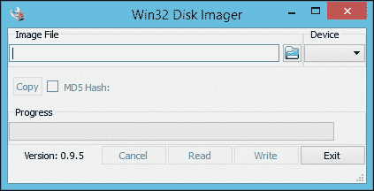
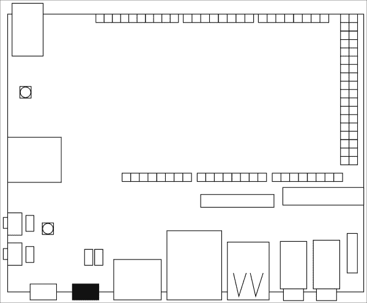

# 第一章。打开引擎

任何想法都应该从原型开始。无论是游戏、网络或移动应用程序，还是通用软件组件，都没有关系。每次我们想要向最终用户交付一些东西，我们必须首先创建一个原型。这是最重要的一步，因为这是我们开始面对第一个困难的时候，也是我们可能改变项目一些重要方面的时候。

如果我们正在编写一个软件组件，第一个原型不会太贵，因为我们需要的是我们的时间和激情。然而，当我们的项目有一些硬件部分时，这是不适用的，因为它可能太贵了，买不起所有需要的组件。直到程序员、工程师和开源爱好者开始发布像 **Arduino** 这样的项目，这种说法才变得真实。

快速原型板让人们用廉价或可重复使用的旧组件实现项目，这一点，加上**自己动手** ( **自己动手**)的理念，允许创建一个遍布全球的巨大社区。这就是 UDOO 板在制造商社区中发挥重要作用的地方:硬件原型生态系统，以及编写软件应用程序的传统方式，代表了交互式项目创建的强大组合。

在这一章中，我们将探索关于 UDOO 板的更多细节，重点是入门的重要元素。特别是，我们将涵盖:

*   探索 UDOO 平台及其主要特点
*   用安卓操作系统安装主板
*   为 Arduino 和 Android 配置开发环境
*   引导一个简单的安卓应用程序
*   部署安卓应用程序

# 介绍 UDOO 平台

UDOO 板旨在为我们提供工具、编程语言和构建第一个原型的环境的极大灵活性。该板的主要目标是参与*物联网*时代，这就是为什么嵌入式 Atmel SAM3X8E ARM Cortex-M3 处理器是其第一个构建模块。

这款处理器与 Arduino Due 板的处理器相同，并且完全符合 Arduino 引脚排列。这个特性的结果是，该板兼容所有 Arduino Due 屏蔽和大多数 Arduino Uno 屏蔽，因此开发人员可以转换和重用他们的旧程序和电路。

### 注

UDOO 输入/输出引脚符合 3.3V 标准。例如，如果你使用的传感器由 5V 供电，以 3.3V 向 UDOO 引脚输出信号，那么你就没事了。另一方面，如果传感器以 5V 输出信号给 UDOO，会损坏你的电路板。每次使用屏蔽或传感器时，请注意提供给 UDOO 引脚的输出电压。这种预防措施与传统的 Arduino Due 板相同。

第二个构建模块是功能强大的飞思卡尔 i.MX 6 ARM Cortex-A9 处理器，提供双核和四核版本。官方支持的操作系统是 *UDOObuntu* ，这是一个基于 *Lubuntu 12.04 LTS armHF* 的操作系统，开箱即用，带有许多预装工具，可以快速启动和运行。事实上，在第一次引导之后，您已经有了一个完全配置好的开发环境，可以从主板本身对板载 Arduino 进行编程。

尽管如此，让 UDOO 与其他主板真正不同的是**安卓支持**。该操作系统能够流畅运行，对于新手或有经验的安卓开发者来说是一个很好的机会，因为他们可以创建一种新的现实世界应用程序，该应用程序由安卓用户界面、其强大的设计模式甚至其他开发者的应用程序提供动力。

### 注

开发人员可以选择使用 Linux 操作系统编写他们的真实应用程序。在这种情况下，他们可以使用许多众所周知的编程语言来编写 web 服务或桌面应用程序，例如 Python、Javascript (Node.js)、Php 和 Java。但是，我们将重点关注 Android 下的应用开发。

最新的构建模块与所有输入/输出组件相关。UDOO 可以通过内置 Wi-Fi 和千兆以太网购买，这是 Linux 和安卓都认可的。它还提供 **HDMI** ( **高清多媒体接口**)输出连接，并附带集成的**晶体管-晶体管逻辑** ( **TTL** )至**低压差分信号** ( **LVDS** )扩展槽，以便开发人员可以连接外部 LVDS 触摸屏。

### 注

在本书的过程中，假设您正在通过 HDMI 电缆将 UDOO 连接到外部显示器。但是，如果您拥有外部 LVDS 面板，您可以在本章第一次运行*部分之前继续连接。要让安卓使用外接面板，你应该遵循一些步骤，这些步骤可以在【http://www.udoo.org/faq-items/how-do-i-set-up-my-lvds/】的官方文档中找到。*

官方支持的另一个重要组件是相机模块，它易于插入电路板，可用于需要计算机视觉或图像分析的项目。最后一个集成组件是声卡，通过外部麦克风进行全功能音频播放和录制。

这些构建模块的组合，加上互联网接入和许多安卓应用编程接口，使我们有机会构建真实世界的应用程序，这些应用程序可以通过一个可以参与*物联网*的板来倾听环境并与设备交谈。

# 下载安装安卓

我们有一个关于 UDOO 组件列表的想法，我们可以用它来开始构建惊人的项目。然而，在我们继续之前，我们需要配置我们的板来运行安卓操作系统和我们的开发环境，以便我们可以开始编写和部署我们的第一个应用程序。

### 注

您在本书中构建的所有原型都基于安卓 KitKat 4.4.2，这是在撰写本文时支持的最新版本。在本书的过程中，您将构建许多利用 **安卓支持库**的项目，以确保与 UDOO 板将支持的较新安卓版本兼容。

UDOO 板没有内部存储或内置引导程序，因为它依赖外部存储，即 microSD 卡，您可以在其中安装引导加载程序和兼容的操作系统。创建可引导 microSD 卡的最简单方法是下载并复制预编译映像，尽管也可以使用发布的二进制文件和内核源创建一个干净的操作系统。

[http://www.udoo.org/downloads/](http://www.udoo.org/downloads/)指向官方 UDOO 下载页面，该页面包含所有可用预编译映像的链接。

在 Linux 镜像中，我们可以找到并下载最新支持的安卓 KitKat 4.4.2 版本。如前所述，UDOO 有两个不同的版本，分别搭载双处理器和四处理器，因此我们必须根据所拥有的平台下载正确的版本。

## 从窗口安装

要从 Windows 安装安卓映像，您需要一些额外的工具来将映像解包并复制到 microSD 卡中。下载的`.zip`文件是 7-Zip 压缩格式，需要安装 7-Zip 等第三方未归档程序。当提取过程完成后，我们有一个未压缩的`.img`文件准备复制到一张空卡片上。

要将未压缩的图像写入我们的 microSD 卡，请执行以下步骤:

1.  将您的 microSD 卡插入内置读卡器或外置读卡器。
2.  使用`FAT32`文件系统格式化卡片。
3.  要在 micsoSD 卡上写入图像，我们需要使用 Win32DiskImager 工具。从[http://sourceforge.net/projects/win32diskimager/](http://sourceforge.net/projects/win32diskimager/)下载。
4.  运行应用程序，但请记住，如果我们使用的是 Windows 7 或 Window 8.x，我们必须右键单击`Win32DiskImager.exe`可执行文件，并确保从上下文菜单中选择**以管理员身份运行**选项。
5.  Win32DiskImager 是一个使用低级指令写入原始磁盘映像的工具。这意味着您需要严格遵循接下来的步骤，并确保正确选择输出设备。如果该选项是错误的，您可能会从不需要的存储内存中丢失所有数据。
6.  Once the application starts, you can see the main window, as illustrated in the following screenshot:

    

7.  从应用程序的主窗口中，在**图像文件**框中，选择先前提取的`.img`文件。
8.  在**设备**下拉菜单中准确选择 microSD 驱动器，请记住，如果我们使用了错误的驱动器，我们可能会破坏计算机硬盘上的所有数据。
9.  点击**写入**按钮，等待该过程完成，以便在 microSD 卡中有一个可引导的安卓操作系统。

## 从 Mac OS X 安装

要从 Mac OS X 安装安卓镜像，我们需要第三方工具来解包下载的`.zip`文件，因为是 7-Zip 压缩格式，不能使用内置的解包软件。我们必须下载[http://www.kekaosx.com/](http://www.kekaosx.com/)免费提供的软件，如凯卡。

如果我们喜欢苹果 OS X 终端，我们可以使用 http://brew.sh/提供的自制软件包管理器。

在这种情况下，从命令行中，我们可以简单地安装`p7zip`包，并使用`7za`实用程序如下解包文件:

```java
brew install p7zip
7za x [path_to_zip_file]

```

要继续并将未压缩的图像写入我们的 microSD 卡，请执行以下步骤:

1.  启动**终端**应用，进入我们下载并提取安卓图像的文件夹。假设`Downloads`是那个文件夹的名称，我们可以发出如下命令:

    ```java
    cd Downloads

    ```

2.  使用以下命令获取所有已安装设备的列表:

    ```java
    df -h

    ```

3.  The list of all systems and internal hard drive partitions will be similar to the following screenshot:

    

4.  使用内置或外置读卡器连接 microSD 卡。
5.  通过我们系统中已有的磁盘工具应用程序格式化 microSD 卡。启动它，并从左侧列表中选择正确的磁盘。
6.  从窗口的主面板中，从上方菜单中选择**擦除**选项卡，并在**格式**下拉菜单中选择 **MS-DOS (FAT)** 文件系统。准备好之后，点击**擦除**按钮。
7.  从终端应用程序中，再次启动前一个命令:

    ```java
    df –h

    ```

8.  The list of mounted partitions has been changed, as we see in the following screenshot:

    

9.  我们可以假设在第一次运行期间丢失的设备是我们的 microSD 卡，因此我们可以记住**文件系统**列下的新值。如果你看前面的截图，我们的分区名是`/dev/disk1s1`，而不是`/dev/disk0s2`，因为是我们的硬盘。
10.  找到正确的分区后，我们必须使用以下命令卸载它:

    ```java
    sudo diskutil unmount /dev/[partition_name]

    ```

11.  To write the image into the microSD card, we must find the raw disk device so that we can erase and write the Android image into the card. Assuming that the partition name found before was `/dev/disk1s1`, the related raw disk will be `/dev/rdisk1`.

    ### 注

    我们将使用`dd`工具。此命令使用低级指令写入原始磁盘映像。这意味着您需要严格遵循接下来的步骤，并确保您选择了正确的磁盘设备，因为如果它是错误的，您可能会从不需要的存储中丢失所有数据。

12.  Write the image previously extracted into the microSD card using `dd` with the following command:

    ```java
    sudo dd bs=1m if=[udoo_image_name].img of=/dev/[raw_disk_name]

    ```

    上一个命令的完整示例如下:

    ```java
    sudo dd bs=1m if=[udoo_image_name].img of=/dev/rdisk1

    ```

13.  当我们启动命令时，似乎什么都没发生，但实际上，`dd`正在后台写安卓图像。过程完成后，输出传输字节报告，如下例所示:

    ```java
    6771+1 records in
    6771+1 records out
    7100656640 bytes transferred in 1395.441422 secs (5088466 bytes/sec)

    ```

14.  现在我们有了可引导的安卓操作系统，我们可以通过以下命令弹出 microSD 卡:

    ```java
    sudo diskutil eject /dev/[raw_disk_name]

    ```

## 从 Linux 安装

要从 Linux 安装安卓镜像，我们需要第三方工具来解压下载的`.zip`文件。因为文件是 7-Zip 压缩格式，我们需要使用我们发行版的包管理器从命令行安装`p7zip`包移植。然后，我们可以使用`7za`实用程序来打开文件或任何其他让你舒服的图形文件。

我们可以使用以下步骤将未压缩的图像写入 microSD 卡:

1.  打开 Linux 终端，进入我们下载并提取安卓图像的文件夹。假设文件在我们的`Downloads`文件夹中，我们可以发出以下命令:

    ```java
    cd Downloads

    ```

2.  使用内置或外置读卡器连接 microSD 卡。
3.  通过以下命令找到正确的设备名称:

    ```java
    sudo fdisk -l | grep Disk

    ```

4.  The output is a filtered list of all the devices found, and it contains, among others output lines, something like:

    ```java
    Disk /dev/sda: 160.0 GB, 160041885696 bytes
    Disk /dev/mapper/ubuntu--vg-root: 157.5 GB, 157454172160 bytes
    Disk /dev/sdb: 7948 MB, 7948206080 bytes

    ```

    在这种情况下，`/dev/sda`是我们的硬盘，`/dev/sdb`是我们的 microSD 卡。如果这不是你的情况，而你使用的是内部读卡器，那么这个设备就有可能被命名为`/dev/mmcblk0`。

    找到正确的设备名称后，请记住它，以便我们以后使用。

5.  通过以下命令找到上述设备的所有挂载分区:

    ```java
    mount | grep [device_name]

    ```

6.  If the previous command generates an output, find the partition name available in the first column of the output and unmount any listed partitions through the following command:

    ```java
    sudo umount /dev/[partition_name]

    ```

    ### 注

    `dd`是使用低级指令写入原始磁盘映像的工具。这意味着您需要严格遵循接下来的步骤，并确保您选择了正确的磁盘设备，因为如果它是错误的，您可能会从不需要的存储内存中丢失所有数据。

7.  Write the image previously extracted to the above device name using the `dd` command:

    ```java
    sudo dd bs=1M if=[udoo_image_name].img of=/dev/[device_name]

    ```

    假设`/dev/sdb`是我们的 microSD 卡，下面是一个完整的例子:

    ```java
    sudo dd bs=1M if=[udoo_image_name].img of=/dev/sdb

    ```

8.  当我们启动命令时，似乎什么都没有发生，但实际上，`dd`正在后台写图像。一旦该过程完成，它输出传输的字节报告，如下所示:

    ```java
    6771+1 records in
    6771+1 records out
    7100656640 bytes transferred in 1395.441422 secs (5088466 bytes/sec)

    ```

9.  现在我们有了可引导的安卓操作系统，我们可以通过以下命令弹出 microSD 卡:

    ```java
    sudo eject /dev/[device_name]

    ```

## 我们的第一次跑步

一旦我们有了可引导的 microSD 卡，我们可以将它插入我们的 UDOO 板，使用我们的外部显示器或 LVDS 面板，并连接鼠标和键盘。打开电源后，安卓 logo 显示出来，加载过程结束后，我们终于可以看到安卓家庭界面了。

# 设置开发环境

现在我们 UDOO 板的安卓已经功能齐全，是时候配置开发环境了。我们要构建的每个项目都是由两个不同运行的应用组成:第一个是由一个能够通过 UDOO I/O 引脚控制外部电路的 Arduino 程序组成的物理应用；第二个是安卓应用程序，它将在主板上运行，处理用户界面。

因为我们必须编写两个相互交互的不同应用程序，所以我们需要用两个不同的 ide 来配置我们的开发环境。

## 安装和使用 Arduino IDE

在我们开始上传我们的程序之前，我们需要安装 *microUSB 串口驱动程序*，这样我们就可以正确地与机载 Arduino 通信。与主板上的 CP210x 转换器兼容的**通用异步收发器** ( **通用异步收发器**)驱动程序的通用串行总线可从下载

[http://www . sil ABS . com/products/MCU/pages/usbtouartbridgevcpdrivers . aspx](http://www.silabs.com/products/mcu/pages/usbtouartbridgevcpdrivers.aspx)。

这里我们得根据我们的操作系统选择正确的版本。下载完成后，我们可以提取档案并双击可执行文件到继续安装。安装过程完成后，我们可能需要重新启动系统。

现在 microUSB 桥驱动已经工作了，从 Arduino 网站，我们必须下载 IDE 1.5x 测试版，因为目前测试版是唯一支持 Arduino Due 板的版本。链接[http://arduino.cc/en/Main/Software#toc3](http://arduino.cc/en/Main/Software#toc3)直接指向最新版本。

### 注

要上传一个新的程序，UDOO 需要在上传前后分别从串口接收到 ERASE 和 RESET 信号。在官方的 Arduino Due 板上，这个动作是由集成的 ATmega16U2 微控制器执行的，这是 UDOO 板中缺少的。 Arduino IDE 会照顾这个过程，但是如果以后你更喜欢用另一个 IDE，那就要自己照顾了。

### 安装在窗户上

要在 Windows 中安装，我们有两种不同的选择:使用提供的安装程序或使用非管理员安装的存档文件。如果我们选择使用安装程序，我们可以双击可执行文件。当安装程序询问我们要安装哪些组件时，请确保选中所有复选框。如果我们选择使用归档文件而不是安装程序，提取文件并将结果目录放入您的用户文件夹。

### 安装在 Mac OS X

要安装在 Mac OS X，我们需要下载存档版本。如果我们运行大于 10.7 的 OS X 版本，我们可以下载 Java 7 版本。在任何其他情况下，或者如果您不确定，请下载 Java 6 版本。

当我们完成下载时，我们必须双击档案继续提取，然后在我们的`Applications`文件夹中拖放 Arduino 应用程序图标。

### 安装在 Linux 中

要安装在 Linux 中，我们需要下载我们的 32 或 64 位架构支持的存档版本。下载完成后，我们可以提取 IDE 并将其放入我们的`home`文件夹或您选择的任何其他文件夹中。

### 首次发射

现在我们已经用正确的补丁完成了通信驱动和 IDE 的配置，我们可以启动并看到 Arduino IDE 了，如下图截图所示:


## 安装使用安卓工作室

搭载安卓操作系统的 UDOO 就像任何其他传统安卓设备一样。这意味着我们可以使用标准的工具链、构建系统和 IDE 来开发智能手机或平板电脑应用程序。目前，可用的工具链与两个主要的 IDEs 相关:Eclipse 和 Android 工作室。

Eclipse 是一个开源 IDE，它有一个高级插件系统，允许你轻松扩展它的许多核心功能。这使得谷歌开发了一个**安卓开发工具** ( **ADT** )插件，以创建一个集成的开发环境，开发人员可以在其中编写、调试和打包他们的安卓应用程序。

安卓工作室是一个更近的项目，其第一个测试版于 2013 年 5 月发布，而第一个稳定版本是在 2014 年 12 月。它基于著名的 Java IDE IntelliJ IDEA，由 **Gradle** 构建系统提供动力，该系统将 **Ant** 的灵活性与 **Maven** 的依赖性管理相结合。所有这些特点，加上不断增加的插件、最佳实践、**谷歌云平台** 集成，以及 **Travis CI** 等第三方服务集成，让 Android Studio 成为未来项目开发的绝佳选择。

本书涵盖的所有安卓项目都是使用安卓工作室构建的，如果你是新手或者是经验丰富的安卓开发者，Eclipse 是你常用的 IDE，这可能是尝试新安卓工作室的绝佳机会。

首先要做的是从[https://developer.android.com/sdk/](https://developer.android.com/sdk/)下载最新版本的安卓工作室，用于你的操作系统。

当下载开始时，我们将被重定向到与我们的操作系统相关的安装说明，当我们完成安装时，我们可以启动 IDE。在第一次运行期间，集成开发环境将进行所有必要的检查，以检索和安装最新可用的软件开发工具包、虚拟设备和构建系统，从而让您开始开发第一个应用程序。在**设置向导- SDK 设置**页面，务必选择**安卓 SDK** 和**安卓虚拟设备**组件，然后点击**下一步**。在下一页，您应该接受所有安卓许可证，然后点击**完成**。

IDE 安装好后，我们就可以启动安卓 Studio 了。以下屏幕截图显示了项目未打开时的主窗口:


# 运行你的第一个安卓应用

现在我们的 UDOO 板上安装了 Android，所有的开发环境都配置好了，我们就可以开始编写和部署我们的第一个 Android 应用了。以下是其他开发人员开始钻研一项新技术时的默认模式。我们将编写和部署一个简单的安卓应用程序，打印 Hello World！。

要引导我们的第一个项目，请执行以下步骤:

1.  在安卓工作室主窗口，点击**开始一个新的安卓工作室项目**。
2.  在**应用名称**字段中，键入`HelloWorld`；在**公司域**中，写下你的域或者`example.com`如果你目前没有。然后，点击**下一步**。
3.  在外形选择窗口，选择**手机和平板**，在**最小 SDK** 中选择 **API 19:安卓 4.4 (KitKat)** 。然后，点击**下一步**。
4.  在添加活动页面，为了这个 hello world 应用，选择一个**空白活动**选项，点击**下一步**。
5.  In the **Activity Options** page, write *HelloWorld* in **Activity Name** and click on **Finish**.

    ### 类型

    在接下来的章节中，我们将从头开始创建应用程序，所以我们必须记住前面的步骤，因为我们将在本书中多次重复这个过程。

现在安卓工作室将开始下载所有的 Gradle 需求来准备我们的构建系统。当这个过程完成时，我们得到了第一个 HelloWorld 应用程序。

无需编写任何代码，我们已经创建了一个可部署的应用程序。现在，我们必须使用微型 USB 将我们的 UDOO 板连接到 USB 电缆。如果我们看一下主板，我们会看到两个不同的 microUSB 端口。左边的第一个，我们将在接下来的章节中使用，它将我们的计算机连接到两个处理器的串行端口，因此我们可以使用它将 Arduino 程序上传到 UDOO 微控制器，或者我们可以使用它访问 Android 系统外壳。串行端口的激活通信取决于 J18 跳线的状态，无论其是否插入。相反，右边的 microUSB 端口将我们的计算机连接到运行安卓系统的 i.MX 6 处理器，我们将使用它来上传我们的安卓应用程序。你可以在【UDOO 官方网站[http://www.udoo.org/features/processors-communication/](http://www.udoo.org/features/processors-communication/)找到更多关于处理器通讯的信息。

要将我们的电脑连接到安卓操作系统进行应用上传过程，我们需要使用下面截图中黑色的正确 microUSB 端口:



就像我们在传统安卓应用中所做的那样，我们可以从顶部菜单点击**运行**，然后点击**运行应用**。此时，我们需要选择一个正在运行的设备，但不幸的是，我们的可用设备列表是空的。出现这个问题是因为处理器之间的内部通信是如何工作的。

引导时间过后，两个处理器之间的连接被启用，插入 microUSB 电缆不会产生任何影响。之所以会出现这种情况，是因为安卓在与 Arduino 的通信过程中没有使用内部的 UART 串口。它使用**通用串行总线** ( **OTG** )总线，该总线允许设备充当主机，并允许闪存驱动器、鼠标、键盘或 Arduino 等其他组件通过它进行连接。

MX 6 处理器物理连接到 OTG 总线，而总线的另一端连接到 Arduino 和外部 microUSB 连接器。可以使用软件控制的开关来改变当前的活动连接。当外部 OTG 端口启用时，安卓可以通过微 USB 端口与外部计算机通信，但不能将任何数据发送回机载 Arduino。相反，当外部 OTG 端口被禁用时，安卓可以与 Arduino 通信，但与电脑的连接被中断。

后者是我们的实际配置，我们需要切换 OTG 端口，以便能够与我们的计算机进行外部通信，从而完成应用程序部署。从安卓，我们要去**设置菜单**选择**开发者选项**。在这里我们需要选择**外部 OTG 端口启用**复选框。如果连接了 USB 电缆，会弹出一个对话框要求我们允许 USB 调试。如果这是我们的主电脑，我们可能想从这台电脑中选择**始终允许**，然后点击**确定**。如果未选中此选项，每次我们将 UDOO 连接到计算机时，都会显示弹出窗口。

### 注

请记住，每次我们需要部署我们的安卓应用程序时，我们都需要启用外部 OTG 端口。相反，当我们的应用程序被部署，我们需要安卓与 Arduino 通信时，我们需要禁用外部 OTG 端口。

现在，我们的计算机可以将 UDOO 板视为传统的 Android 设备，我们可以尝试再次部署我们的应用程序。这次在**选择设备**对话框中，我们可以找到一个飞思卡尔 UDOO 安卓设备。选择并点击**确定**。我们的第一次部署已经完成，现在我们可以在连接的监视器上看到 HelloWorld 应用程序。

# 总结

在这一章中，我们学习了一些区别于其他板的 UDOO 特性。最大的区别之一与安卓平台的全面支持有关，这导致我们在板上安装和配置最新的支持版本。

我们探索了开始开发现实世界应用程序的必要工具，并配置了我们的开发环境来编写安卓应用程序和 Arduino 程序。

我们简单介绍了两个处理器之间的通信是如何工作的，以及我们如何切换 OTG 端口以支持首次部署的外部访问。在下一章中，我们将从头开始一个新的安卓应用程序，它能够使用和控制通过一组原型工具构建的物理设备。