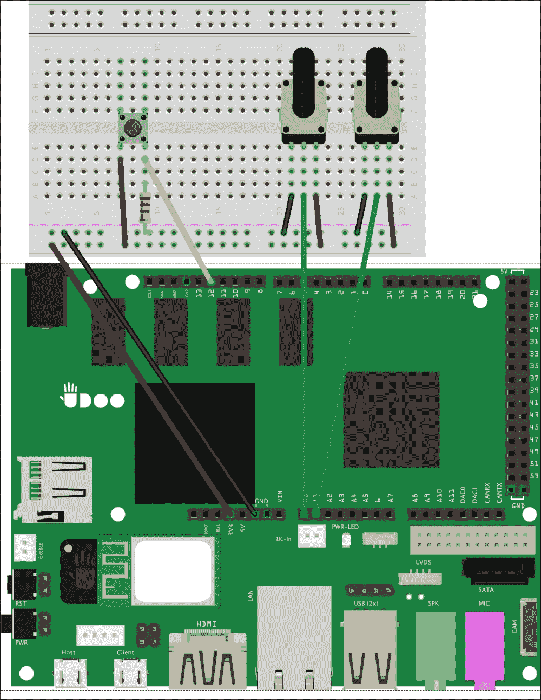
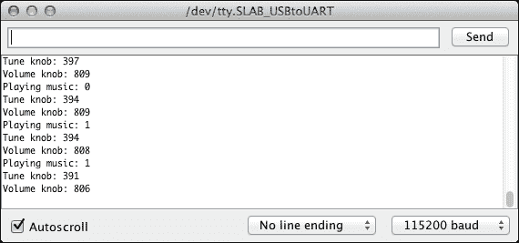
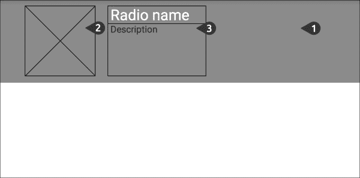

# 五、管理与物理组件的交互

电子设备改变了我们的生活。我们被许多收集并最终计算环境数据的不可见物体所包围。就像我们在上一章看到的，这些设备使用传感器来检索信息，我们可以在日常生活中找到它们，例如，在我们的车里，当我们走过超市的滑动门时，也许当我们回家时。

我们可以通过观察这些东西来启发自己，并构建令人惊叹的物理应用，这些应用能够对环境做出反应，并间接地对周围的人做出反应。然而，如果我们的项目期望直接的人工交互，我们可能需要管理与物理组件的交互。

本章的目标是构建一个网络收音机，它使用内置的安卓应用编程接口来管理互联网流，而所有的交互都由物理组件来管理，比如老式的收音机。

在本章中，我们将涵盖以下主题:

*   管理用户交互
*   通过物理交互构建网络电台
*   用 Arduino 发送多个数据
*   为音频流编写安卓应用

# 管理用户交互

区别交互式原型的一个方面是对用户做出的任何动作做出反应的能力。正如我们在上一章中看到的，传感器是实现这一重要目标的最重要的构件之一。然而，有时，我们希望提供一种物理交互，用户能够用手改变应用的行为，尽管存在传感器。这些仍在很大程度上扩散的部件是简单的机械部件**机械部件**或**电子部件**，它们将模拟的运动转换成数字值，我们的微控制器可以用这些数字值来改变程序流程。我们可以使用很多组件来与我们的设备交互:**按钮**、**开关按钮**、**操纵杆**、**旋钮**、**踏板**和**杠杆**，只是这些类组件的示例。

旋钮是我们可以用来改变一些原型配置的组件。事实上，我们可以创建一个维护控制台，改变一些设备常数，以防止新草图的重新编译和上传阶段。在其他时候，旋钮被用来做出直接的动作，它们的使用是用户交互的活跃部分。旋钮的常见用途与电气设备有关，例如音频设备中的音量控制。

另一个例子可能与机器人漫游车有关，当时我们希望为用户提供直接控制，而不是机器人自己的人工智能。在这种情况下，我们可以使用一个按钮，在激活手动模式时方便停止操作。例如，我们可以提供一个操纵杆，用于引导火星车的运动。

### 类型

使用按钮的一个例子是停止微控制器或原型的任何动作。这种按钮的使用被称为**紧急停止**，当它们完全自动化并配备有移动部件时，它被用于许多 DIY 项目中。

所有这些元件都有两个共同的基本元件:**开关**和**电位计**。按钮是机械开关的一个很好的例子，可以关闭或打开电路，并控制通过微控制器引脚的电流。这样，我们可以根据检测到的电压激活电路的特定功能，就像我们在[第 3 章](3.html "Chapter 3. Testing Your Physical Application")、*测试您的物理应用*中所做的那样。

相反，电位计是电子元件，更像电阻器。电子部分由三个端脚组成，我们可以用不同的方式来改变电位计的用途。事实上，如果我们将一端和中心腿连接到一个组件，它就像一个 **可变电阻**。另一方面，如果我们使用所有三个端子，它的工作原理就像一个可调的**分压器**。我们可以从一个方向转到另一个方向的电位计的*轴*用于改变电阻器或分压器的值。电位器应用的好例子有旋钮、操纵杆和吉他踏板。

# 通过物理交互构建网络电台

微控制器不是为复杂的工作而设计的，所以我们需要小心地将我们项目的需求划分到合适的环境中。对于网络收音机，我们可以使用微控制器来读取旋钮和开关，让安卓应用编程接口和 UDOO 强大的中央处理器来完成其余的工作。这将防止安卓在读取硬件时分心，并防止微控制器因网络流和回放的复杂情况而过载。

我们原型的第一部分是构建一个电路，并编写一个草图，从两个电位计和一个按钮收集值:

*   我们使用第一个电位计来改变激活的电台，并增加或减少音量
*   我们用物理按钮来控制收音机的播放

通过这种方式，我们移除了通过安卓用户界面完成的所有交互。

第一步，抓住两个电位计，将其连接到电路板上，这样我们就可以实现以下电路:


按照下面给出的程序将电路连接到电位计，如前面的模式所示:

1.  将两个电位计放在试验板的右侧，因为我们需要使用左侧的空闲插槽来放置按钮。
2.  将 UDOO +3.3V 引脚连接到电源总线的正极线。请确保不要连接+5V 电源引脚，因为它可能会在未来的连接过程中损坏模拟输入引脚。
3.  将 UDOO 接地连接到电源总线的负极线。
4.  Connect the left terminal of the first potentiometer to the negative line of the power bus.

    ### 类型

    电位计的作用类似于电阻，因此如果连接错误的正极端子，不会有任何差异。唯一的副作用是检测到的值不会从范围[0-1023]开始，而是从[1023-0]开始。如果您注意到这一点，*反转这些连接*。

5.  将第一个电位计的右端连接到电源总线的正极线上。
6.  将中间端子连接到模拟输入 A0。
7.  对第二个电位计重复第 4、5、6 点，并将其中间端子连接到模拟输入 A1。

利用该电路，我们使用两个电位计作为分压器，当我们转动轴时，微控制器会注意到电压输出的变化，并将该值转换为数值范围[0-1023]。该电路与上一章中创建光传感器的电路非常相似，但由于电位计的封装中已经有一个电阻，因此我们不需要任何其他电子元件来保持其工作。

现在我们需要一个按钮来开始和停止播放。我们必须在试验板的左侧添加组件，并将其连接到 UDOO，如下所示:



按照给定的步骤连接组件，如前面的模式所示:

1.  将按钮的左端子连接到电源总线的正极线。
2.  使用 10 千欧电阻将右侧端子连接至电源总线的负极线。
3.  将右侧端子连接到 UDOO 板的针脚 12。

有了这个电路，我们可以使用 UDOO 板的引脚 12 读取按钮的值；当按钮被按下时，我们可以改变微控制器的内部状态。

现在我们有了一个包含所有所需组件的电路，我们必须开始一个新的草图并准备一个我们可以用来收集所有数据的函数。草图的目标是准备一个**三重**，其具有*回放状态*、*音量*和*电台*作为有序值。当我们稍后开始与安卓应用通信时，这种方法简化了我们的工作。我们可以如下开始写新草图:

1.  Define the connections at the top of the sketch:

    ```java
    #define RADIO_POLL_PERIOD 100
    #define PLAY_BUTTON 12
    #define KNOB_VOLUME A0
    #define KNOB_TUNER A1
    ```

    我们使用引脚 12 作为播放按钮，使用输入 A0 作为音量，使用输入 A1 来更改当前电台。在这个项目中，我们设置了 100 毫秒的轮询时间，这是我们的物理组件和安卓应用之间快速交互所需的时间。

2.  Add the following variables after the previous declarations:

    ```java
    boolean playback = true;
    int buttonRead = LOW;
    int previousRead = LOW;
    int tuner = 0;
    int volume = 0;
    ```

    我们使用一个回放变量作为简单的状态指示器，这样草图就知道收音机是否在播放。因为我们正在构建一个依赖于物理交互的无线电，所以草图中包含的设备状态被认为是整个应用的真实来源非常重要，安卓应该信任这些值。我们还定义了其他变量来存储按钮和两个电位计的读数。

3.  在`setup()`功能中增加引脚模式，打开串行通信:

    ```java
    void setup() {
      pinMode(PLAY_BUTTON, INPUT);
      Serial.begin(115200);
    }
    ```

4.  Create a `readData()` function at the bottom of the sketch in which we detect the user input from physical components:

    ```java
    void readData() {
      buttonRead = digitalRead(PLAY_BUTTON);
      if (buttonRead == HIGH && previousRead != buttonRead) {
        playback = !playback;
      }
      previousRead = buttonRead;
      tuner = analogRead(KNOB_TUNER);
      volume = analogRead(KNOB_VOLUME);
    }
    ```

    在第一部分中，我们将按钮的值分配给`buttonRead`变量，以检查它是否被按下。我们还将最后检测到的值存储在`previousRead`变量中，因为我们希望避免连续读数期间错误的状态变化。这样，如果用户按住按钮，只会发生一个状态变化。

    在最后一行，我们调用`analogRead`从两个电位计收集数据。

5.  调用主`loop()`函数内的`readData()`函数，将采集到的值打印如下:

    ```java
    void loop() {
      readData();
      Serial.print("Playing music: ");
      Serial.println(playback);
      Serial.print("Radio station: ");
      Serial.println(tuner);
      Serial.print("Volume: ");
      Serial.println(volume);
      delay(RADIO_POLL_PERIOD);
    }
    ```

现在我们可以将草图上传到我们的板上，打开**串行监视器**开始播放旋钮和播放按钮。以下是预期输出的示例:



## 发送前对收集的数据进行归一化

正如我们注意到的，如果我们转动电位计轴或按下回放按钮，我们的值会立即改变。这是一个非常好的起点，但是现在我们必须转换这些数据，以便安卓应用可以轻松使用它们。

因为我们想要管理五个电台，所以草图应该将调谐器读数映射到范围[0-4]之间的值。我们将在[0-1023]范围内创建固定间隔，因此当我们转动轴并经过一个间隔时，活动站应该更新。为了实现这种映射，我们必须遵循以下步骤:

1.  At the top of the sketch, add the highlighted declarations:

    ```java
    #define KNOB_TUNER A1
    #define STATIONS 5
    #define MAX_ANALOG_READ 1024.0
    const float tunerInterval = MAX_ANALOG_READ / STATIONS;
    boolean playback = true;
    ```

    我们将管理站的数量定义为`5`，并设置最大模拟读取值。这样，我们可以重用上述类似对象的宏来定义`tunerInterval`常量，将读数映射到正确的区间。

2.  Add the `mapStations()` function at the bottom of the sketch:

    ```java
    int mapStations(int analogValue) {
      int currentStation = analogValue / tunerInterval;
    }
    ```

    为了找到`currentStation`变量，我们将模拟读数除以调谐器间隔。通过这种方式，我们确定返回值被限制在[0-4]范围内。

使用前面的地图功能不足以让我们的收音机工作。另一个必需的步骤是转换音量值，因为 Android 使用的是[0.0-1.0]范围内的浮点数。因此，我们应该通过以下步骤来标准化音量旋钮:

1.  在`mapStations()`功能下增加该功能:

    ```java
    float normalizeVolume(int analogValue) {
      return analogValue / MAX_ANALOG_READ;
    }
    ```

2.  如下更改主`loop()`功能，这样我们就可以检查是否所有的值都转换正确:

    ```java
    void loop() {
      readData();
      Serial.print("Playing music: ");
      Serial.println(playback);
      Serial.print("Radio station: ");
      Serial.println(mapStations(tuner));
      Serial.print("Volume: ");
      Serial.println(normalizeVolume(volume));
      delay(RADIO_POLL_PERIOD);
    }
    ```

3.  Upload the new sketch to see the results shown in the following screenshot:

    

    ### 注

    通过前面的步骤，我们从物理输入设备收集数据，并将这些值转换为旋钮计算当前电台和收音机音量。然而，我们甚至需要把这个逻辑放在我们的安卓应用中，因为它应该为每个可能的站点映射网络流的相关网址。这意味着相同的逻辑被复制，这不是一个好的方法，尤其是如果我们将来需要添加新的渠道。在这种情况下，我们的代码必须在两个应用中进行更改，并且我们应该始终避免*容易出错的情况*。一个好的方法是仅将微控制器用于输入报告，并让安卓应用管理和转换接收到的原始数据。我们仅在本书的范围内使用这种方法，以帮助您更好地使用草图代码。

## 用 Arduino 发送多个数据

在[第 4 章](4.html "Chapter 4. Using Sensors to Listen to the Environment")、*使用传感器监听环境*中，我们需要发送由微控制器计算的单个字节。然而，在大多数常见的情况下，我们需要从不同的传感器或物理组件读取数据，我们可能需要立即将它们发送回安卓系统。在这个原型中，我们应该遵守这一要求，因为微控制器必须读取所有三个值，并仅通过一次 ADK 写入将它们发送回来。一个简单的方法是构建一个代表我们的三元组的字符串，并使用逗号以格式`<playback>,<volume>,<station>`分隔这些值。通过这种表示，我们获得了以下值:

```java
0,0.332768,2
1,0.951197,4
```

然后我们可以在 ADK 缓冲区中编写无线电状态的*序列化*表示，并在安卓应用中继续进行*反序列化*。

### 类型

我们可能会考虑实现或使用更复杂的通信协议来将通用数据从 Arduino 传输到 Android，但我们应该始终牢记，在开始时，每个好的想法都必须遵循 **KISS 原则** : **保持简单**、**愚蠢**(美国海军在 1960 年注意到的设计原则)。因为软件越简单，越有可能运行良好。

我们需要在草图的顶部写下附件描述符，就像下面建议的代码片段:

```java
#include <adk.h>
#define BUFFSIZE 128
char accessoryName[] = "Web radio";
char manufacturer[] = "Example, Inc.";
char model[] = "WebRadio";
char versionNumber[] = "0.1.0";
char serialNumber[] = "1";
char url[] = "http://www.example.com";
uint8_t buffer[BUFFSIZE];
USBHost Usb;
ADK adk(&Usb, manufacturer, model, accessoryName, versionNumber, url, serialNumber);
```

我们还需要第二个缓冲区来保存三倍；我们可以将其声明添加到 ADK 缓冲变量之前，如下所示:

```java
char triple[BUFFSIZE];
uint8_t buffer[BUFFSIZE];
```

在草图的底部，添加以下函数，在 ADK 缓冲区中写入三元组:

```java
void writeBuffer(int playback, float volume, int station) {
  sprintf(triple, "%f,%f,%f", (float) playback, normalizeVolume(volume), (float) mapStations(station));
  memcpy(buffer, triple, BUFFSIZE);
}
```

`writeBuffer()`函数期望三重建筑中使用的三个参数。为此，我们使用`sprintf()`函数将这些值写入中间`triple`缓冲区。在`sprintf()`函数调用中，我们还使用了`normalizeVolume()`和`mapStations()`函数来获取转换后的值。然后我们使用`memcpy()`函数在 ADK `buffer`中编写`triple`变量。

### 注

我们需要这个额外的步骤，因为我们不能在 ADK `buffer`中写`triple`变量。`adk.write()`函数需要一个`unsigned char*`类型，而三重函数需要一个`char*`类型。

既然ADK 缓冲区包含了序列化数据，我们必须移除所有`Serial`调用，并将主`loop()`函数重写如下:

```java
void loop() {
  Usb.Task();
  if (adk.isReady()) {
    readData();
    writeBuffer(playback, volume, tuner);
    adk.write(BUFFSIZE, buffer);
  }
  delay(RADIO_POLL_PERIOD);
}
```

ADK 就绪后，我们从按钮和两个电位计读取数据，然后将这些值序列化为三倍，写入 ADK 输出缓冲器。一切准备就绪后，我们会将录制的输入发送回安卓。

我们现在可以更新我们的草图，用安卓应用完成原型。

# 安卓应用的流媒体音频

安卓操作系统提供了大量的用户界面组件，这是所有物理应用的重要组成部分。所有这些都是针对手机或平板电脑交互的，这是一个显著的改进，因为用户已经知道如何使用它们。然而，安卓不仅仅是用户界面组件的集合，因为它允许许多应用编程接口实现重复的任务。在我们的例子中，我们想要一个能够与 web 服务交互的物理应用来打开和再现音频流。

如果没有 i.MX6 处理器和安卓操作系统，这个任务永远不会容易实现，但是在我们的例子中，UDOO 板提供了我们需要的一切。

## 设计安卓用户界面

从安卓工作室，用**安卓 API 19** 启动一个名为**网络电台**的新应用。在引导过程中，选择名为**单选**的**空白活动**。

我们的第一个目标是改变默认布局，支持简单但花哨的界面。主布局必须显示当前激活的无线电台，提供不同的信息，如可选图像，频道名称和描述。在写下安卓绘制用户界面所需的 XML 代码之前，我们应该计划我们的工作来检测所需的组件。在下面的截图中，我们可以看一下提供所有必需元素的用户界面模型:



上述布局包括一个数字标记，用于定义组件的创建顺序。根据这种布局，我们应该按照以下顺序提供三种不同的视图:

1.  作为第一步，我们应该创建一个不同颜色的背景框架，以提供一个我们将放置所有其他组件的块。
2.  即使这是可选的，我们也可以准备一个盒子来存放广播频道的图像，如果有的话。
3.  最后一个块包括两个不同的文本区域，其中第一个表示频道名称，而另一个表示频道描述。

有了这个布局设计，我们应该继续，用以下步骤替换标准主题:

1.  在`res/values/dimens.xml`资源文件中，添加以下定义，为我们的组件提供一些尺寸，例如背景框高度和字体大小:

    ```java
    <resources>
      <dimen name="activity_horizontal_margin">16dp</dimen>
      <dimen name="activity_vertical_margin">16dp</dimen>
      <dimen name="activity_frame_height">220dp</dimen>
      <dimen name="activity_image_square">180dp</dimen>
      <dimen name="layout_padding">50dp</dimen>
      <dimen name="title_size">40sp</dimen>
      <dimen name="description_size">25sp</dimen>
    </resources>
    ```

2.  在`res/values/styles.xml`资源文件中，添加背景框架和文本元素使用的以下颜色:

    ```java
    <resources>
      <color name="picton_blue">#33B5E5</color>
      <color name="white">#FFFFFF</color>
      <style name="AppTheme" parent="Theme.AppCompat.Light.DarkActionBar">
      </style>
    </resources>
    ```

3.  In the `activity_radio.xml` file under `res/layout/`, replace the `RelativeLayout` with the following `FrameLayout` to implement the background frame:

    ```java
    <FrameLayout xmlns:android="http://schemas.android.com/apk/res/android"
      xmlns:tools="http://schemas.android.com/tools"
      android:layout_width="match_parent"
      android:layout_height="@dimen/activity_frame_height"
      android:paddingLeft="@dimen/activity_horizontal_margin"
      android:paddingRight="@dimen/activity_horizontal_margin"
      android:paddingTop="@dimen/activity_vertical_margin"
      android:paddingBottom="@dimen/activity_vertical_margin"
      android:background="@color/picton_blue"
      tools:context=".Radio">
    </FrameLayout>

    ```

    我们使用`FrameLayout`来创建一个包含所有其他具有定义的高度和背景颜色的组件的部分。

4.  Create a `LinearLayout` nested in the above `FrameLayout` parameter:

    ```java
    <LinearLayout
      android:orientation="horizontal"
      android:layout_width="match_parent"
      android:layout_height="match_parent">

        <ImageView
          android:id="@+id/radio_image"
          android:src="@drawable/ic_launcher"
          android:layout_height="@dimen/activity_image_square"
          android:layout_width=
            "@dimen/activity_image_square" />

        <LinearLayout
          android:orientation="vertical"
          android:layout_marginLeft="@dimen/layout_padding"
          android:layout_width="match_parent"
          android:layout_height="match_parent">
        </LinearLayout>
    </LinearLayout>
    ```

    第一个`LinearLayout`的将包含根据活动通道变化的`radio_image` `ImageView`。第二个`LinearLayout`用于主持电台名称和描述。

5.  在第二个`LinearLayout`内增加以下视图:

    ```java
    <TextView
      android:id="@+id/radio_name"
      android:text="Radio name"
      android:textColor="@color/white"
      android:textSize="@dimen/title_size"
      android:layout_width="wrap_content"
      android:layout_height="wrap_content" />

    <TextView
      android:id="@+id/radio_description"
      android:text="Description"
      android:textSize="@dimen/description_size"
      android:layout_width="wrap_content"
      android:layout_height="wrap_content" />
    ```

根据之前定义的样式，以下是获得的布局:


在继续逻辑实现之前，我们必须通过以下步骤在`onCreate()`回调期间获取所有视图引用:

1.  在`Radio`类的顶部添加以下声明:

    ```java
    private TextView mRadioName;
    private TextView mRadioDescription;
    private ImageView mRadioImage;
    ```

2.  在`onCreate()`回调的底部，添加高亮显示的代码:

    ```java
    setContentView(R.layout.activity_radio);
    mRadioName = (TextView) findViewById(R.id.radio_name);
    mRadioDescription = (TextView) findViewById(R.id.radio_description);
    mRadioImage = (ImageView) findViewById(R.id.radio_image);

    ```

现在布局完成，我们可以进行 ADK 配置了。

## 建立 ADK 工具包

在开始网络广播实现之前，我们应该首先配置 *ADKToolkit* ，就像我们在上一章中所做的那样。要使 ADK 配置正常工作，请执行以下步骤:

1.  在`app`下的`build.gradle`文件中添加 *ADKToolkit* 库依赖项。
2.  同步您的梯度配置。
3.  使用以下代码在`res/xml/`下创建附件过滤器文件 `usb_accessory_filter.xml`:

    ```java
    <resources>
      <usb-accessory
       version="0.1.0"
       model="WebRadio"
       manufacturer="Example, Inc."/>
    </resources>
    ```

4.  在`AndroidManifest.xml`文件中添加 *USB 附件支持*选项要求和 *USB 附件意图过滤器*选项。
5.  在`Radio.java`类文件中，声明类顶部的`AdkManager`对象。
6.  在`Radio`活动类的`onCreate`方法中添加`AdkManager`初始化。
7.  Override the `onPause()` and `onResume()` callbacks to start and stop the ADK connection according to the activity lifecycle.

    ### 类型

    每次我们开始一个新项目时，都应该使用上面的清单。写下这些步骤，并确保我们的项目总是从这个 ADK 配置开始，这是一个好主意。

8.  作为初始配置的最后一个步骤，我们需要添加互联网访问权限，因为我们将使用网络流。在您的`AndroidManifest.xml`文件的标签清单中添加以下权限:

    ```java
    <uses-permission android:name="android.permission.INTERNET" />
    ```

## 更换网络电台

下一步是编写播放和停止已配置电台所需的 Android 代码。我们需要的是将 station 对象和一个实用程序类形式化，抽象出内置媒体播放器的相同功能。以下是必修课及其用法的清单:

*   `Station`:正式确定音频通道，包括标题、描述和电台图像，以及开始远程播放所需的流 URL
*   `RadioManager`:在初始化期间配置所有可用的电台，并抽象出所有常用的方法来管理回放和频道切换

我们从`Station`类开始，我们可以通过以下步骤实现:

1.  在我们的命名空间内创建一个名为`streaming`的新 Java 包。
2.  Create the `Station` class in the newly created Java package and add the following declarations and class constructor:

    ```java
    private final static String STREAMING_BASE_URL = "https://streaming.jamendo.com/";
    private String title;
    private String description;
    private int imageId;
    public Station(String title, String description, int imageId) {
      this.title = title;
      this.description = description;
      this.imageId = imageId;
    }
    ```

    我们定义了网址的第一部分，我们将使用它来构建频道流网址。在这种情况下，我们将使用 **Jamendo** 服务，该服务提供许多音乐频道，这些频道在**创作共用**许可下发布。如果你想获得更多信息，可以看看服务网站:

    [https://www.jamendo.com](https://www.jamendo.com)

    我们将使用的其他属性是车站`title`和`description`属性以及安卓资源标识符。

3.  At the bottom of the class, the following getters are used to retrieve instance attributes:

    ```java
    public String getTitle() {
      return title;
    }
    public String getDescription() {
      return description;
    }
    public int getImageId() {
      return imageId;
    }
    public String getStreamUrl() {
      return STREAMING_BASE_URL + title;
    }
    ```

    在`getStreamUrl()`方法中，我们使用带有电台名称的基本 URL 来找到正确的音频流。

    ### 类型

    这个字符串连接与 Jamendo 服务的工作方式有关。如果您使用另一个服务，或者您不想在 URL 合成过程中使用 title 属性，则应该更改此方法。

现在我们有了一个正式的`Station`类表示，我们需要定义能够管理安卓回放的类。我们通过以下步骤实现`RadioManager`类:

1.  In the `streaming` package, create the `RadioManager` class and add the following declarations at the beginning:

    ```java
    private static ArrayList<Station> mChannels;
    private static MediaPlayer mMediaPlayer;
    private static int mPlayback;
    private static int mIndex;
    private static Station mActiveStation;
    ```

    我们使用安卓高级`MediaPlayer`对象来管理远程流；我们利用一些状态变量，例如当前活动电台及其阵列索引和播放状态。我们将在`RadioManager`类初始化期间填充`mChannels` `ArrayList`对象，它将主持所有可用的音乐频道。

2.  Add the initializer method at the bottom of the class, as follows:

    ```java
    public static void initialize() {
      // Prepare all stations object
      mChannels = new ArrayList();
      mChannels.add(new Station("JamPop", "Pop", R.drawable.ic_launcher));
      mChannels.add(new Station("JamClassical", "Classical", R.drawable.ic_launcher));
      mChannels.add(new Station("JamJazz", "Jazz", R.drawable.ic_launcher));
      mChannels.add(new Station("JamElectro", "Electronic", R.drawable.ic_launcher));
      mChannels.add(new Station("JamRock", "Rock", R.drawable.ic_launcher));
      // Initializes the MediaPlayer with listeners
      mMediaPlayer = new MediaPlayer();
      mMediaPlayer.setAudioStreamType(AudioManager.STREAM_MUSIC);
      mMediaPlayer.setOnPreparedListener(new MediaPlayer.OnPreparedListener() {
        @Override
        public void onPrepared(MediaPlayer mediaPlayer) {
          mediaPlayer.start();
        }
      });
    }
    ```

    在第一部分中，我们根据之前的`Station`构造器配置所有可用站点的列表。我们配置`MediaPlayer`对象，以便它在准备过程完成时立即启动网络流。

    ### 注

    你可以在以下网址找到更多关于安卓`MediaPlayer`类如何工作的信息:

    [http://developer . Android . com/reference/Android/media/media player . html](http://developer.android.com/reference/android/media/MediaPlayer.html)。

3.  Add the following methods to abstract the play and stop functionalities to prevent code repeating:

    ```java
    private static void stop() {
      mMediaPlayer.reset();
    }
    private static void play() {
      try {
        mMediaPlayer.setDataSource(mActiveStation.getStreamUrl());
        mMediaPlayer.prepareAsync();
      }
      catch (IOException e) {
        // noop
      }
    }
    ```

    当播放器停止时，我们必须重置媒体播放器对象，因为我们可能需要立即设置另一个数据源。`play`方法设置当前激活电台的流媒体网址，并启动无阻塞准备任务。

4.  Add the following public method that changes the playback status:

    ```java
    public static void playback(int value) {
      // If the playback status has changed
      if (value != mPlayback) {
        // Play or stop the playback
        if (value == 0) {
          stop();
        }
        else {
          play();
        }
        mPlayback = value;
      }
    }
    ```

    ADK 草图每 100 毫秒向我们的应用发送一次连续数据，这增强了用户界面的响应能力。但是，我们不想重复同一个命令很多次，所以我们只在收到的值与存储的值不同时才执行一些操作。在第二部分中，我们根据给定的参数选择开始或播放当前流。

5.  As the last part, we need a method to change the activated channel. Add the following code at the bottom of the class:

    ```java
    public static Station changeStation(int stationId) {
      Station station = null;
      if (stationId != mIndex) {
        mIndex = stationId;
        // Set the current station
        mActiveStation = mChannels.get(mIndex);
        station = mActiveStation;
        stop();
        if (mPlayback == 1) {
          play();
        }
      }
      return station;
    }
    ```

    正如我们之前所做的那样，如果接收到的值与我们当前播放的值相同，我们会避免更换电台。然后，我们更新当前频道并停止最后一个流。这样，如果我们处于回放状态，我们就可以安全地再现一个新的电台流。无论如何，我们返回选择的`Station`实例，或者如果工作站没有改变，返回`null`。

## 从物理设备读取输入

就像我们在上一章中所做的那样，我们需要准备我们的应用，使用户输入的连续读数在 ADK 缓冲区中可用。正如我们之前所做的，我们将创建一个 Java 接口，公开更新用户界面所需的方法。我们可以通过以下步骤实现:

1.  新建一个名为`OnDataChanges`的 Java 接口，添加如下方法:

    ```java
    public interface OnDataChanges {
      void updateStation(Station station);
    }
    ```

2.  让`Radio`类通过高亮显示的代码实现前面的接口:

    ```java
    public class Radio extends ActionBarActivity implements OnDataChanges {
    ```

3.  Implement the interface code at the end of the class to update the Android user interface:

    ```java
    @Override
    public void updateStation(Station station) {
      mRadioName.setText(station.getTitle());
      mRadioDescription.setText(station.getDescription());
      mRadioImage.setImageResource(station.getImageId());
    }
    ```

    在这一部分中，我们简单地根据`station`实例属性更新所有视图。

最后一个需要的步骤是实现我们的调度线程，该线程从微控制器读取已处理的数据，并与安卓用户界面一起更新`MediaPlayer`类流。要完成最后一个构建模块，请执行以下步骤:

1.  在您的命名空间中创建一个名为`adk`的新包。
2.  在`adk`包中，添加一个名为`DataReader`的新类。
3.  At the top of the class, add the following declarations:

    ```java
    private final static int INPUT_POLLING = 100;
    private final static int STATION_UPDATE = 0;
    private AdkManager mAdkManager;
    private OnDataChanges mCaller;
    private ScheduledExecutorService mScheduler;
    private Handler mMainLoop;
    ```

    就像我们在前一章所做的那样，我们定义了轮询时间和主线程处理程序所使用的消息类型。我们还存储了`AdkManager`参数和调用方活动的引用，分别用于 ADK 读取方法和`updateStation`函数的回调。然后我们和主线程`Handler`一起定义`ExecutorService`方法实现。

4.  Implement the `DataReader` constructor to set the message handler when the main thread receives a new message from the background thread:

    ```java
    public DataReader(AdkManager adkManager, OnDataChanges caller) {
      this.mAdkManager = adkManager;
      this.mCaller = caller;
      mMainLoop = new Handler(Looper.getMainLooper()) {
        @Override
        public void handleMessage(Message message) {
          switch (message.what) {
            case STATION_UPDATE:
              mCaller.updateStation((Station) message.obj);
              break;
          }
        }
      };
    }
    ```

    我们存储`AdkManager`和`caller`活动引用，然后设置一个`Handler`附加到应用的主活套。`handleMessage`回拨检查消息代码以识别`STATION_UPDATE`消息。在这种情况下，我们调用`updateStation`方法并传递附着的对象。

5.  At the bottom of `DataReader` class, add the following private class that implements the `Runnable` interface to read and manage the physical input devices:

    ```java
    private class InputThread implements Runnable {
      @Override
      public void run() {
        // Read from ADK
        AdkMessage response = mAdkManager.read();
        // Parse the response
        String[] collectedInputs = response.getString().split(",");
        int playback = (int) Float.parseFloat(collectedInputs[0]);
        int station = (int) Float.parseFloat(collectedInputs[2]);
        // Start radio and get the changed station
        RadioManager.playback(playback);
        Station currentStation = RadioManager.changeStation(station);
        // Updated station back to the main thread
        if (currentStation != null) {
          Message message = mMainLoop.obtainMessage(STATION_UPDATE, currentStation);
          message.sendToTarget();
        }
      }
    }
    ```

    当线程启动时，我们使用`AdkManager`方法读取用户输入。然后，我们从响应中获取原始字符串，并使用 split 方法对接收到的三元组进行反序列化。第一个位置指的是回放状态，我们在`RadioManager`类中使用它来开始或停止回放。第三个位置的值是激活的通道，我们将其传递给`changeStation`方法。根据前面的实现，如果`currentStation`变量没有改变，我们避免将消息发布到主线程，以防止无用的接口重绘。

6.  Add a method to the `DataReader` class to start the scheduler that spawns short-lived threads periodically:

    ```java
    public void start() {
      // Initialize threads
      InputThread thread = new InputThread();
      // Should start over and over while publishing results
      mScheduler = Executors.newSingleThreadScheduledExecutor();
      mScheduler.scheduleAtFixedRate(thread, 0, INPUT_POLLING, TimeUnit.MILLISECONDS);
    }
    ```

    就像我们在上一个项目中所做的那样，我们使用一个调度器，它每次在一个`INPUT_POLLING`变量毫秒处生成一个`InputThread`参数。

7.  在类的底部添加 stop 方法，阻止调度器通过`shutdown`执行器的方法

    ```java
    public void stop() {
      mScheduler.shutdown();
    }
    ```

    产生新的线程
8.  现在我们应该回到`Radio`类来启动和停止活动生命周期内的调度程序。在`Radio`类的顶部添加`DataReader`方法声明:

    ```java
    private AdkManager mAdkManager;
    private DataReader mReader;

    ```

9.  当通过以下突出显示的代码创建活动时，初始化`RadioManager`类和`DataReader`实例，您应该在`onCreate()`回调的底部添加:

    ```java
    mRadioImage = (ImageView) findViewById(R.id.radio_image);
    RadioManager.initialize();
    mAdkManager = new AdkManager(this);
    mReader = new DataReader(mAdkManager, this);

    ```

10.  在`onResume()`和`onPause()`活动的回调中启动和停止读取调度程序，如高亮显示的代码所示:

    ```java
    @Override
    protected void onPause() {
      super.onPause();
      mReader.stop();
      mAdkManager.close();
    }

    @Override
    protected void onResume() {
      super.onResume();
      mAdkManager.open();
      mReader.start();
    }
    ```

有了这些最后的步骤，电台就完成了，我们可以在 UDOO 板上传安卓应用，用电台旋钮和按钮开始播放。

### 注

因为我们没有管理网络错误，请确保 UDOO 已连接到互联网，并且您正在使用以太网或 Wi-Fi 网络适配器，否则应用将无法工作。

## 管理音量

在我们可以发布我们的第一个收音机原型之前，我们应该从安卓应用中管理音量旋钮。多亏了`MediaPlayer`方法 API，这部分真的很容易，因为它公开了一个公共方法来改变激活流的量。为了使用卷管理器改进我们的项目，我们需要添加以下代码片段:

1.  在`RadioManager`类中，在类的顶部添加高亮显示的声明:

    ```java
    private static Station mActiveStation;
    private static float mVolume = 1.0f;

    ```

2.  At the bottom of the `RadioManager` class, add this public method:

    ```java
    public static void setVolume(float volume) {
      if (Math.abs(mVolume - volume) > 0.05) {
        mVolume = volume;
        mMediaPlayer.setVolume(volume, volume);
      }
    }
    ```

    方法`setVolume`期望从 Arduino 接收的 float 作为参数，我们使用它来改变`mMediaPlayer`实例的体积。但是，因为我们不想因为微小的变化而改变音量，所以我们放弃了对与之前记录的输入没有太大差异的值的所有请求。

3.  在我们在`DataReader`类中编写的`InputThread`实现中添加体积解析和`setVolume`函数调用:

    ```java
    float volume = Float.parseFloat(collectedInputs[1]);
    int station = (int) Float.parseFloat(collectedInputs [2]);
    RadioManager.playback(playback);
    RadioManager.setVolume(volume);

    ```

有了最后一块，网络广播就完成了，我们可以继续进行最后的部署。现在，我们的用户可以使用旋钮和按钮来控制应用的各个方面，从而进行交互并享受原型。

# 改进原型

在我们进一步使用其他原型之前，我们应该考虑当一些意想不到的事件发生时，我们如何改进我们的设备。一个很好的起点是考虑错误处理，特别是，如果安卓应用不再听到来自附件的输入数据会发生什么。有许多方法可以防止错误的行为，一个好的解决方案是在安卓应用中包含一个默认行为，原型应该在这些紧急情况下遵循该行为。

我们可以使用另一个周期计时器，每次执行时都会增加一个变量。当`InputThread`实例成功完成读取时，应重置上述变量。这样，我们可以监控停止接收用户输入的时间，根据这个时间，我们可以决定改变应用的行为。例如，通过这个变量，我们可以停止收音机播放，或者如果附件停止提供用户输入，将音量调低一点。

关键点是我们应该始终为失败和成功设计我们的原型。大多数*如果*的问题很容易提前整合，但很难在之后加入，会发生什么。

# 总结

在本章中，您学习了如何在需要人工交互时提高原型的质量。我们探索了一些可以用来改变或控制安卓应用的常见物理组件。通过强大的安卓应用编程接口，我们构建了一个能够完成复杂任务(如网络流)的网络收音机。

在第一部分中，我们使用两个电位计和一个按钮构建了所需的电路。当我们通过串行监视器检查返回值时，我们发现它们在这种格式中并不那么有用，所以我们编写了一个映射和一个规范化函数。

我们继续为安卓应用提供新的布局，但我们避免通过用户界面添加任何类型的交互。我们编写了一个类来抽象与内置媒体播放器的所有可能的交互，这样我们就可以在应用的任何部分轻松控制这个组件。事实上，我们在后台任务中使用了它，每次它读取用户输入时，它都会立即改变收音机的状态。这样，我们启用了按钮来开始和停止播放，并启用了两个电位计来更改活动电台和音乐音量。

在下一章中，我们将开始讨论家庭自动化。我们从头开始一个新的原型，能够使用传感器值和用户设置的组合来打开和关闭外部设备。我们将使用其他安卓应用接口来存储应用的设置，并在以后使用它们来改变草图流。