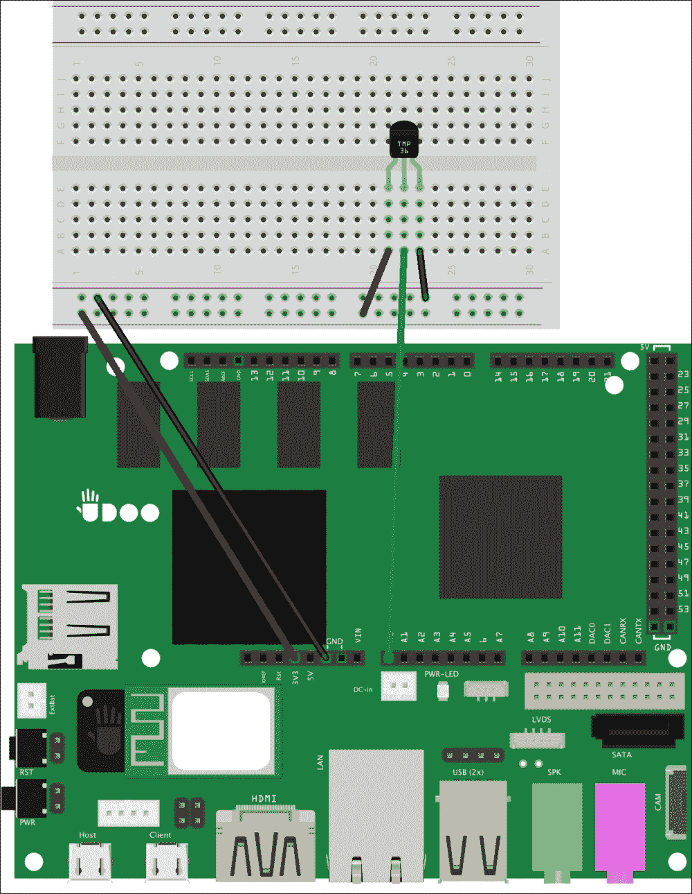
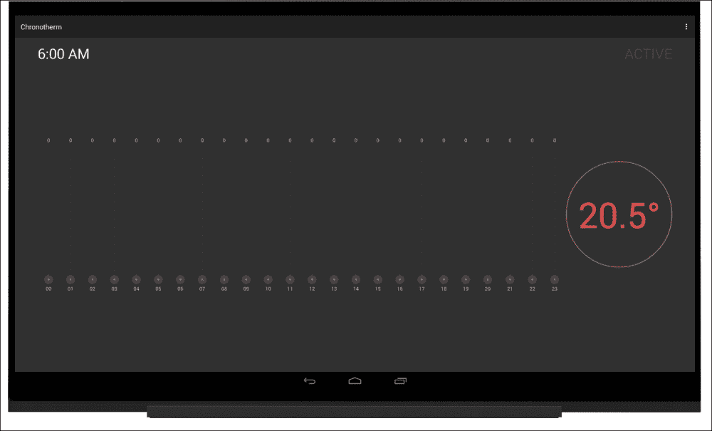
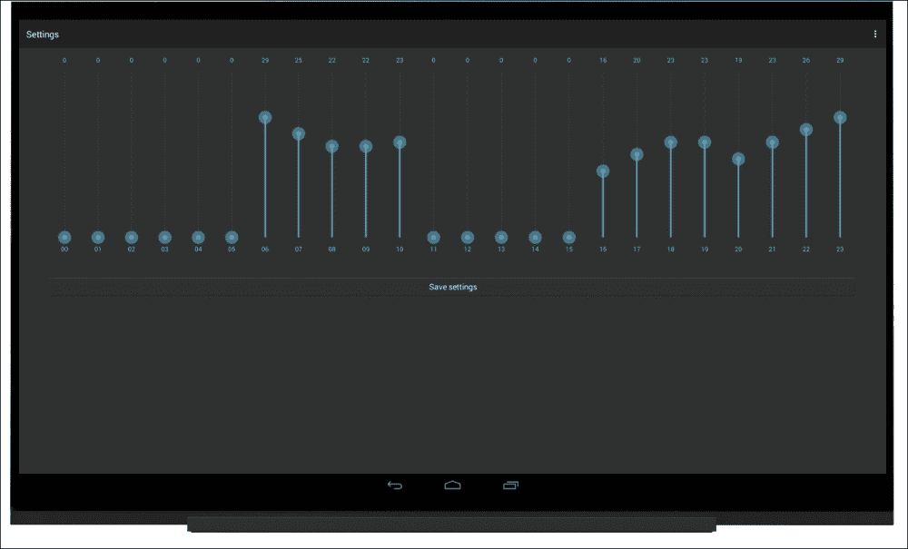

# 第六章。打造家庭自动化的超时空器

几十年来，现在已经有可能，甚至很容易，用自动和远程控制来控制家庭设备，如灯、恒温器和电器。一方面，这些自动化设备节省了精力和精力，但另一方面，即使是适度的调整也不方便最终用户，因为他们需要对系统有很好的了解才能进行任何更改。

在过去的几年里，人们不愿意采用**家庭自动化**技术，因为缺乏标准或易于定制的解决方案。如今，事物在变化，像 UDOO 这样的原型板在 **DIY** ( **自己动手**)自动化设备的设计和建造中发挥了巨大的作用。最重要的是，得益于开源项目，这些平台很容易扩展，可以由不同的设备控制，例如带有网络浏览器的个人电脑、手机和平板电脑。

在本章中，我们将涵盖以下主题:

*   探索家庭自动化的优势
*   建造一个时空电路
*   发送数据和接收命令
*   编写 Chronotherm 安卓应用程序

# 家庭自动化

术语*家庭自动化*是相当通用，可能有很多不同的含义:控制环境光的计时器、对来自外部的事件做出反应的智能系统，或者负责完成重复任务的可编程设备。

这些都是家庭自动化的有效例子，因为它们共享相同的关键概念，使我们即使不在家也能管理家务和活动。家庭自动化设备通常在公共或专用网络上运行，以相互通信，以及与智能手机或平板电脑等其他类型的设备通信，接受命令或交换关于其状态的信息。但是当我们需要自动化简单的电器或电子元件如灯泡时会发生什么？解决这个问题的一个常见解决方案是开发一种 **控制系统**设备，物理连接到我们想要管理的设备；作为控制系统，一个家庭自动化设备，我们可以使用它来驱动它所连接的每个设备的行为。

如果我们能够在家庭自动化领域获得足够的经验，我们就有可能为自己的房子开发和构建一个高端系统，该系统足够灵活，无需任何进一步的知识就可以轻松扩展。

# 建造一个时空电路

超时空器主要由*控制单元*组成，该单元负责检查环境温度是否低于预先配置的设定值，在这种情况下，打开锅炉以加热房间。这个行为很简单，但是没有任何进一步的逻辑就没那么有用了。事实上，我们可以通过将*时间*参数添加到时空逻辑来扩展这种行为。通过这种方式，用户可以为一天中的每个小时定义一个温度设定点，从而使温度检查更加智能。

### 注

在这个原型中，控制单元是机载的 Arduino，这是一个简化整体设计的实现细节。

这就是传统超时空器的工作原理，为了实现它，我们应该:

*   用温度传感器构建电路
*   实现微控制器逻辑，以当前温度检查用户的设定点

不幸的是，第二部分并不那么容易，因为用户的设定点应该存储在微控制器中，因此，我们可以将这项任务委托给我们的安卓应用程序，将设置保存在 microSD 卡中。这种方法通过以下方式分离责任:

*   Arduino 草图:
    *   从温度传感器收集数据
    *   将检测到的温度发送到安卓系统
    *   期望安卓命令启动或停止锅炉
*   安卓应用:
    *   管理用户的交互
    *   实现用户设置以存储一天中每个小时的温度设定点
    *   读取微控制器发送的温度
    *   实现选择锅炉应该打开还是关闭的逻辑
    *   向微控制器发送启动或停止锅炉的命令

有了这个计划，我们可以依靠安卓用户界面组件轻松实现一个精简可用的界面，同时避免设置存储层的复杂性。

为了开始构建原型，我们需要在实验板中插入一个温度传感器，例如 *TMP36* ，以获得以下电路:



下面是连接组件的分步过程，如前面的模式所示:

1.  将 TMP36 传感器放在试验板的右侧。
2.  将 UDOO +3.3V 引脚连接到电源总线的正极线。请确保不要连接+5V 电源引脚，因为它可能会在未来的连接过程中损坏模拟输入引脚。
3.  将 UDOO 接地连接到电源总线的负极线。
4.  Connect the left terminal of the TMP36 sensor to the positive line of the power bus.

    ### 类型

    当使用封装的传感器时，我们可以推断出看着平面部分的方向。使用这种方法来寻找左右终端。

5.  将 TMP36 传感器的右端子连接至电源总线的负极线。
6.  将 TMP36 传感器的中间端子连接到模拟输入 A0。

这种封装的传感器使用起来非常简单，它不需要任何其他元件或分压器来为微控制器提供电压变化。现在我们应该从我们的电路开始管理锅炉点火。为了原型，我们将使用一个简单的 LED 代替锅炉执行器，就像我们在[第 2 章](2.html "Chapter 2. Know Your Tools")、*了解你的工具*中所做的那样。这将使我们的电路更简单。

我们可以在试验板上添加一个发光二极管，以实现以下模式:


以下是连接组件的过程，如前图所示:

1.  将发光二极管放在试验板的左侧。
2.  将发光二极管较长的端子(阳极)连接到 UDOO 数字引脚 12。
3.  使用 220 欧姆的电阻器，将发光二极管较小的端子(阴极)连接到电源总线的负极线。

有了这个电路，我们就有了从环境中收集数据和模拟锅炉点火所需的所有组件。现在我们需要打开 Arduino IDE，开始一个新的草图。第一个目标是检索检测到的温度并将其转换为方便的测量单位。为了实现这一目标，我们必须执行以下步骤:

1.  Define these object-like macros and variables at the top of the sketch:

    ```java
    #define TEMPERATURE_POLL_PERIOD 1000
    #define SENSOR A0
    #define BOILER 12
    int reading;
    ```

    我们定义`SENSOR`对象来表示模拟引脚 A0，而`BOILER`对象与我们的数字引脚 12 相关。我们还声明了一个`reading`变量，我们稍后使用它来存储当前检测到的温度。`TEMPERATURE_POLL_PERIOD`宏表示微控制器在读数之间等待多少秒，然后通知安卓应用检测到的温度。

2.  在`setup()`功能中，添加引脚模式声明，打开串行通信，如下所示:

    ```java
    void setup() {
      pinMode(BOILER, OUTPUT);
      digitalWrite(BOILER, LOW);
      Serial.begin(115200);
    }
    ```

3.  In the bottom of the sketch, create the `convertToCelsius()`function as follows:

    ```java
    float convertToCelsius(int value) {
      float voltage = (value / 1024.0) * 3.3;
      return (voltage - 0.5) * 100;
    }
    ```

    在这个函数中，我们期望一个传感器读数，并以*摄氏度*返回它的表示。为了实现这一点，我们使用一些数学方法来计算出实际检测到的电压。因为 UDOO 微控制器的模数转换器提供[0-1023]范围内的值，但是我们想要计算从 0 到 3.3V 的范围，我们应该将该值除以 1024.0，然后将结果乘以 3.3。

    我们在摄氏度转换中使用电压，因为如果我们阅读 TMP36 数据表，我们发现传感器的每 10 毫伏变化相当于 1 摄氏度的温度变化，这就是我们将该值乘以 100 的原因。我们还需要将电压减去 0.5，因为该传感器处理 0 度以下的温度，0.5 是所选的偏移。

    ### 类型

    该功能可轻松将 TMP36 读数转换为摄氏度。如果您想使用另一种测量单位，如华氏温度，或者如果您使用不同的传感器或热敏电阻，您必须更改此实现。

4.  在主`loop()`功能中，读取来自传感器的模拟信号，并使用`loop()`功能打印转换结果:

    ```java
    void loop() {
      reading = analogRead(SENSOR);
      Serial.print("Degrees C:");
      Serial.println(convertToCelsius(reading));
      delay(TEMPERATURE_POLL_PERIOD);
    }
    ```

如果我们上传草图并打开串行监视器，我们会注意到当前的室温。事实上，如果我们将手指放在传感器周围，我们会立即看到先前检测到的温度升高。以下截图是草图输出的示例:


## 发送数据和接收命令

下一步是照常启用 ADK 通信，我们需要在草图顶部添加*附件描述符*代码，如下所示:

```java
#include <adk.h>
#define BUFFSIZE 128
char accessoryName[] = "Chronotherm";
char manufacturer[] = "Example, Inc.";
char model[] = "Chronotherm";
char versionNumber[] = "0.1.0";
char serialNumber[] = "1";
char url[] = "http://www.example.com";
uint8_t buffer[BUFFSIZE];
uint32_t readBytes = 0;
USBHost Usb;
ADK adk(&Usb, manufacturer, model, accessoryName, versionNumber, url, serialNumber);
```

现在我们必须将检测到的浮子温度发送回安卓应用程序，就像我们在[第 5 章](5.html "Chapter 5. Managing Interactions with Physical Components")、*管理与物理组件的交互*中所做的那样。要用浮点数加载缓冲区并通过内部总线发送该值，我们必须添加一个具有以下代码的`writeToAdk()`助手函数:

```java
void writeToAdk(float temperature) {
  char tempBuffer[BUFFSIZE];
  sprintf(tempBuffer, "%f", temperature);
  memcpy(buffer, tempBuffer, BUFFSIZE);
  adk.write(strlen(tempBuffer), buffer);
}
```

前面的函数期望由传感器读数转换的浮子温度。我们使用`sprintf()`函数调用填充一个临时缓冲区，然后使用`memcpy()`函数用`tempBuffer`变量替换 ADK 缓冲区内容。加载完成后，我们将缓冲区内容发送给安卓应用程序。

在主`loop()`功能期间，我们还需要收听安卓发送的任何描述需要打开或关闭锅炉的命令。为此，我们需要创建一个执行器函数，就像我们在[第 2 章](2.html "Chapter 2. Know Your Tools")、*知道你的工具*中所做的那样。然后，我们必须读取来自 ADK 的命令，并将结果传递给执行者。为此，我们需要执行以下步骤:

1.  添加读取命令并打开或关闭外部设备的`executor()`功能:

    ```java
    void executor(uint8_t command) {
      switch(command) {
        case 0:
          digitalWrite(BOILER, LOW);
          break;
        case 1:
          digitalWrite(BOILER, HIGH);
          break;
        default:
          // noop
          break;
      }
    }
    ```

2.  添加从 ADK 读取命令的`executeFromAdk()`功能，并将该命令传递给前面的`executor()`功能:

    ```java
    void executeFromAdk() {
      adk.read(&readBytes, BUFFSIZE, buffer);
      if (readBytes > 0){
        executor(buffer[0]);
      }
    }
    ```

如果我们看一下本章开头定义的计划，我们就有了 Arduino 草图所需的所有组件，因此我们可以使用以下代码将主`loop()`函数中的所有内容放在一起:

```java
void loop() {
  Usb.Task();
  if (adk.isReady()) {
    reading = analogRead(SENSOR);
    writeToAdk(convertToCelsius(reading));
    executeFromAdk();
    delay(DELAY);
  }
}
```

当 ADK 准备就绪时，我们读取传感器值，并将其摄氏度转换写入 ADK 缓冲区。然后，我们期待来自 ADK 的命令，如果它可用，我们执行该命令打开或关闭锅炉。现在草图完成了，我们可以继续编写 Chronotherm Android 应用程序了。

# 通过安卓管理超时空器

当我们通过 UDOO 平台构建物理应用时，我们必须记住，我们可以利用安卓组件和服务来提高我们项目的质量。此外，安卓的用户界面元素比硬件更加友好和可维护。因此，我们将创建一个软件组件来管理温度设定点，而不是使用电位计。

要开始应用原型制作，请打开 Android Studio，并使用 Android API 19 启动一个名为 **Chronotherm** 的新应用。在引导过程中，选择一个名为*概述*的**空白活动**。

## 建立 ADK 工具包

在我们继续应用布局之前，我们需要配置 ADKToolkit 进行内部通信。请记住遵循以下提醒，以实现正确的配置:

1.  在`app/build.gradle`文件中添加 *ADKToolkit* 库依赖项。
2.  同步您的梯度配置。
3.  在`res/xml/` 下创建附件过滤文件`usb_accessory_filter.xml`，代码如下:

    ```java
    <resources>
      <usb-accessory
        version="0.1.0"
        model="Chronotherm"
        manufacturer="Example, Inc."/>
    </resources>
    ```

4.  在`AndroidManifest.xml`文件中添加 *USB 附件支持*选项要求和 *USB 附件意图过滤器*选项。
5.  在`Overview.java`类文件中，声明类顶部的`AdkManager`对象。
6.  在`Overview`活动类的`onCreate()`方法中添加`AdkManager`对象初始化。
7.  当活动开始时，覆盖`onResume()`活动回调以启动 ADK 连接。在这个项目中，我们不会在`onPause()`回调中关闭 ADK 连接，因为我们将使用两个不同的活动，并且连接应该保持活动状态。

随着 ADK 通信的启动和运行，我们可以继续编写 Chronotherm 用户界面。

## 设计安卓用户界面

下一步是设计 Chronotherm 应用程序的用户界面，以处理正确的反馈和设定点管理。我们将通过编写两个不同的安卓活动来实现这些要求，它们的职责如下:

*   显示当前时间、检测温度和当前锅炉状态的*概述*活动。它应该包括一个小部件，显示用户一天中每个小时的设定点。这些设定点用于决定是开启还是关闭锅炉。
*   用于改变一天中每个小时的当前设定点的*设置*活动。该活动应使用`Overview`活动的相同部件来表示温度设定点。

我们从`Overview`活动和温度设定点部件开始实施。

### 撰写概述活动

本活动应提供关于 Chronotherm 应用程序当前状态的所有细节。所有必需的组件都在下面的模型中进行了总结，该模型定义了组件的创建顺序:


第一步是更新活动布局，按照前面模型中的建议，我们应该完成以下步骤:

1.  在布局的顶部，我们可以包含一个显示当前系统时间的`TextClock`视图。
2.  顶部栏应提供锅炉状态的反馈。我们可以添加一个灰色的`TextView`**激活的**文本，当锅炉打开时变成绿色。
3.  `Overview`身体必须提供当前检测到的温度。因为这是 Chronotherm 应用程序提供的最重要的细节之一，所以我们将强调这个值，使其比其他组件更大。
4.  在室温附近，我们将通过一组竖线为当前激活的时间表创建一个小部件，这些竖线显示用户一天中每个小时的设定点。在`Overview`活动中，该小部件将保持只读模式，仅提供活动程序的快速概述。
5.  在活动动作栏中，我们应该提供一个打开`Settings`活动的菜单项。该活动将用于在 Chronotherm 应用程序中存储设定点。

我们从顶栏和检测到的温度分量开始执行`Overview`；实现上述布局需要以下步骤:

1.  在`res/values/dimens.xml`文件中，添加以下突出显示的资源:

    ```java
    <resources>
      <dimen name="activity_horizontal_margin">16dp</dimen>
      <dimen name="activity_vertical_margin">16dp</dimen>
      <dimen name="text_title">40sp</dimen>
      <dimen name="temperature">100sp</dimen>
      <dimen name="temperature_round">300dp</dimen>
      <dimen name="circle_round">120dp</dimen>
    </resources>
    ```

2.  在`res/values/styles.xml`文件中，添加以下资源，并将`AppTheme parent`属性更改如下:

    ```java
    <resources>
      <color name="mine_shaft">#444444</color>
      <color name="pistachio">#99CC00</color>
      <color name="coral_red">#FF4444</color>
      <style name="AppTheme" parent="Theme.AppCompat"></style>
    </resources>
    ```

3.  为了强调当前检测到的温度，我们可以创建一个应该围绕温度值的圆形。要实现它，在`res/drawable/`下创建`circle.xml`文件，代码如下:

    ```java
    <shape
      xmlns:android="http://schemas.android.com/apk/res/android"
      android:shape="oval">

      <stroke
        android:width="2dp"
        android:color="@color/coral_red"/>

      <size
        android:width="@dimen/circle_round"
        android:height="@dimen/circle_round"/>
    </shape>
    ```

4.  我们现在可以继续并替换`res/layout/`下`activity_overview.xml`文件中的布局，突出显示的代码如下:

    ```java
    <LinearLayout xmlns:android="http://schemas.android.com/apk/res/android"
      xmlns:tools="http://schemas.android.com/tools"
      android:orientation="vertical"
      android:layout_width="match_parent"
      android:layout_height="match_parent"
      android:paddingLeft="@dimen/activity_horizontal_margin"
      android:paddingRight="@dimen/activity_horizontal_margin"
      android:paddingTop="@dimen/activity_vertical_margin"
      android:paddingBottom="@dimen/activity_vertical_margin"
      tools:context=".Overview">
    </LinearLayout>

    ```

5.  将以下代码放在前面的`LinearLayout`中，创建活动顶栏，其中包含当前系统时间和锅炉状态:

    ```java
    <LinearLayout
      android:layout_width="match_parent"
      android:layout_height="wrap_content">

      <TextClock
        android:textSize="@dimen/text_title"
        android:layout_width="wrap_content"
        android:layout_height="wrap_content" />

      <TextView
        android:id="@+id/boiler_status"
        android:text="ACTIVE"
        android:gravity="end"
        android:textColor="@color/mine_shaft"
        android:textSize="@dimen/text_title"
        android:layout_width="match_parent"
        android:layout_height="wrap_content" />
    </LinearLayout>
    ```

6.  下一步是创建活动体。它应该包含两个不同的项目:第一个是`LinearLayout`，在这里我们将使用活动`onCreate()`回调中的`LayoutInflater`类来膨胀设定点小部件，第二个是当前检测到的由我们之前创建的圆形包围的温度。在根`LinearLayout`中，嵌套以下元素:

    ```java
    <LinearLayout
      android:orientation="horizontal"
      android:gravity="center"
      android:layout_width="match_parent"
      android:layout_height="match_parent">

      <LinearLayout
        android:id="@+id/view_container"
        android:gravity="center"
        android:orientation="horizontal"
        android:layout_width="0dp"
        android:layout_weight="1"
        android:layout_height="match_parent">
      </LinearLayout>

      <TextView
        android:id="@+id/temperature"
        android:text="20.5°"
        android:background="@drawable/circle"
        android:gravity="center"
        android:textColor="@color/coral_red"
        android:textSize="@dimen/temperature"
        android:layout_width="@dimen/temperature_round"
        android:layout_height="@dimen/temperature_round" />
    </LinearLayout>
    ```

7.  作为最后一步，将所有视图引用存储在活动代码中。在`Overview`类的顶部，添加带有突出显示代码的`temperature`和`boiler_status`视图的引用:

    ```java
    private AdkManager mAdkManager;
    private TextView mTemperature;
    private TextView mStatus;

    ```

8.  在`Overview` `onCreate()`回调中，获取引用，代码如下:

    ```java
    super.onCreate(savedInstanceState);
    setContentView(R.layout.activity_overview);
    mTemperature = (TextView) findViewById(R.id.temperature);
    mStatus = (TextView) findViewById(R.id.boiler_status);

    ```

这些步骤提供了部分布局，我们将完成添加设定点小部件和设置菜单项。

### 创建自定义用户界面组件

为了保持用户界面精简、可用和直观，我们可以使用一组竖条，如音频均衡器，这样用户就可以立即知道他们想要获得的室温趋势。安卓附带了一个名为`SeekBar`的内置组件，我们可以用它来选择温度设定点。不幸的是，这个组件绘制了一个水平条，没有提供垂直条；为此，我们将扩展它的默认行为。

### 注

Android API 11 及更高版本在 XML 中为每个组件添加了`rotate`属性。即使我们使用 270 度的旋转来获得垂直分量，我们也会有一些问题来正确地将一个条放置在另一个条旁边。在这种情况下，我们最初定制这个组件的努力将简化我们以后的工作。

安卓提供了构建定制 UI 元素的复杂和组件化模型，我们可以在[http://developer . Android . com/guide/topics/UI/custom-components . html](http://developer.android.com/guide/topics/ui/custom-components.html)上深入了解更多细节。

`SeekBar`组件的定制可以组织如下:

1.  作为第一步，我们应该创建一个`TemperatureBar`类来实现垂直滑动行为。大部分变化都与继承`SeekBar`类有关，同时用其高度切换组件宽度。
2.  这个小部件需要一个 XML 布局，以编程方式从我们的代码中添加。为此，我们将创建一个布局，其中包括`TemperatureBar`视图、所选度数以及与该条相关的小时。
3.  当竖条组件发生任何变化时，度数应该更新。在这一步中，我们将创建一个监听器，将 bar 更改传播到 degrees 组件，为用户提供适当的反馈。
4.  我们的定制组件包括`TemperatureBar`类，即度数和小时视图，应该以编程方式为一天中的每个小时创建。我们将创建一个实用程序类，负责将组件布局膨胀 24 倍，添加适当的侦听器。

我们开始编写垂直`SeekBar`类，可以通过以下步骤实现:

1.  在您的命名空间中创建一个名为`widget`的新包。
2.  在新创建的包中，添加扩展`SeekBar`类实现的`TemperatureBar`类，同时定义默认的类构造函数如下:

    ```java
    public class TemperatureBar extends SeekBar {
      public TemperatureBar(Context context) {
        super(context);
      }
      public TemperatureBar(Context context, AttributeSet attrs) {
        super(context, attrs);
      }
      public TemperatureBar(Context context, AttributeSet attrs, int defStyle) {
        super(context, attrs, defStyle);
      }
    }
    ```

3.  Continue the `TemperatureBar` class implementation, adding the draw and measure methods at the bottom of the class:

    ```java
    @Override
    protected void onSizeChanged(int w, int h, int oldw, int oldh) {
      super.onSizeChanged(h, w, oldh, oldw);
    }

    @Override
    protected synchronized void onMeasure(int width, int height) {
      super.onMeasure(height, width);
      setMeasuredDimension(getMeasuredHeight(), getMeasuredWidth());
    }

    @Override
    protected void onDraw(Canvas c) {
      c.rotate(-90);
      c.translate(-getHeight(), 0);
      onSizeChanged(getWidth(), getHeight(), 0, 0);
      super.onDraw(c);
    }
    ```

    在第一个方法中，我们将小部件的宽度与其高度进行切换，这样我们就可以使用该参数来提供组件内容的精确测量。然后我们在组件绘制过程中覆盖安卓系统调用的`onDraw()`方法，对`SeekBar`画布进行平移并垂直放置。作为最后一步，我们再次调用`onSizeChanged`回调来调整画布转换后的组件大小。

4.  Because we have switched the bar width and height, we need to override the `onTouchEvent()` method to use the component height during value calculation. At the bottom of the `TemperatureBar()` class, add the following callback:

    ```java
    @Override
    public boolean onTouchEvent(MotionEvent event) {
      if (!isEnabled()) {
        return false;
      }
      switch (event.getAction()) {
        case MotionEvent.ACTION_DOWN:
        case MotionEvent.ACTION_MOVE:
        case MotionEvent.ACTION_UP:
          setProgress(getMax() - (int) (getMax() * event.getY() / getHeight()));
          onSizeChanged(getWidth(), getHeight(), 0, 0);
          break;
        case MotionEvent.ACTION_CANCEL:
          break;
      }
      return true;
    }
    ```

    使用前面的代码，我们在每次`ACTION_DOWN`、`ACTION_MOVE`或`ACTION_UP`方法事件发生时更新组件进度。对于这个项目来说，我们不需要任何其他的行为，所以我们让剩下的实现保持原样。

现在，我们可以继续编写带有度数和小时`TextView`的包含前面组件的 XML 布局。通过以下步骤，我们可以实现一个布局，我们将从我们的实用程序类进行扩展:

1.  将`bar_height`声明添加到`res/values/`下的`dimens.xml`文件中，以便我们将来需要时可以轻松更改:

    ```java
    <dimen name="activity_horizontal_margin">16dp</dimen>
    <dimen name="activity_vertical_margin">16dp</dimen>
    <dimen name="bar_height">400dp</dimen>
    <dimen name="text_title">40sp</dimen>
    ```

2.  在包含部件布局的`res/layout/`下创建`temperature_bar.xml`文件。在这个文件中，我们应该添加这个`LinearLayout`作为根元素:

    ```java
    <LinearLayout xmlns:android="http://schemas.android.com/apk/res/android"
      android:orientation="vertical"
      android:layout_width="0dp"
      android:layout_weight="1"
      android:layout_height="wrap_content">
    </LinearLayout>
    ```

3.  To the preceding `LinearLayout`, include the following components:

    ```java
    <TextView
      android:id="@+id/degrees"
      android:text="0"
      android:gravity="center"
      android:layout_width="match_parent"
      android:layout_height="match_parent" />

    <me.palazzetti.widget.TemperatureBar
      android:id="@+id/seekbar"
      android:max="40"
      android:layout_gravity="center"
      android:layout_width="wrap_content"
      android:layout_height="@dimen/bar_height" />

    <TextView
      android:id="@+id/time"
      android:text="00"
      android:gravity="center"
      android:layout_width="match_parent"
      android:layout_height="match_parent" />
    ```

    ### 类型

    始终使用您自己的名称空间更改`me.palazzetti`名称空间。

现在我们有了温度条组件和小部件布局，我们需要在`degrees`和`seekbar`视图之间创建绑定。通过以下步骤继续执行小部件实施:

1.  在`widget`包中创建`DegreeListener`类。
2.  前面的类应该实现`SeekBar`监听器，同时为连接的`degrees`视图存储引用。我们使用这个`TextView`引用来传播竖条值:

    ```java
    public class DegreeListener implements SeekBar.OnSeekBarChangeListener {
      private TextView mDegrees;
      public DegreeListener(TextView degrees) {
        mDegrees = degrees;
      }
    ```

3.  将进度值传播到`mDegrees`视图，覆盖`OnSeekBarChangeListener`界面所需的以下方法:

    ```java
      @Override
      public void onProgressChanged(SeekBar seekBar, int progress, boolean b) {
        mDegrees.setText(String.valueOf(progress));
      }

      @Override
      public void onStartTrackingTouch(SeekBar seekBar) {}

      @Override
      public void onStopTrackingTouch(SeekBar seekBar) {}
    }
    ```

最后缺少的部分是提供用于膨胀小部件布局的实用程序类，用`DegreeListener`类初始化`TemperatureBar`类。膨胀过程应该在一天中的每一个小时重复，并且它需要小部件将要膨胀的布局的参考。要完成实施，请执行以下步骤:

1.  在`widget`包中创建`TemperatureWidget`类。
2.  This class should expose a static `addTo()` method that expects the activity context, the parent element, and whether vertical bars should be created in read-only mode. In this way, we can use this widget both for visualization and edit. We can find the complete implementation in the following code snippet:

    ```java
    public class TemperatureWidget {
      private static final int BAR_NUMBER = 24;
      public static TemperatureBar[] addTo(Context ctx, ViewGroup parent, boolean enabled) {
        TemperatureBar[] bars = new TemperatureBar[BAR_NUMBER];
        for (int i = 0; i < BAR_NUMBER; i++) {
          View v = LayoutInflater.from(ctx).inflate(R.layout.temperature_bar, parent, false);
          TextView time = (TextView) v.findViewById(R.id.time);
          TextView degree = (TextView) v.findViewById(R.id.degrees);
          TemperatureBar bar = (TemperatureBar) v.findViewById(R.id.seekbar);
          time.setText(String.format("%02d", i));
          degree.setText(String.valueOf(0));
          bar.setOnSeekBarChangeListener(new DegreeListener(degree));
          bar.setProgress(0);
          bar.setEnabled(enabled);
          parent.addView(v, parent.getChildCount());
          bars[i] = bar;
        }
        return bars;
      }
    }
    ```

    在类的顶部，我们定义了生成的条的编号。在`addTo()`方法中，我们膨胀`temperature_bar`布局来创建条形对象的实例。然后，我们获取`time`、`degrees`和`seekbar`对象的所有引用，这样我们就可以设置初始值并创建带有`degrees TextView`绑定的`DegreeListener`类。我们继续将小部件添加到`parent`节点，用当前创建的栏填充`bars`数组。作为最后一步，我们返回这个数组，以便可以从调用者活动中使用它。

### 完成概述活动

设定点小部件现在已经完成，我们可以在活动创建过程中继续进行最后的步骤给温度条充气。我们还将在活动菜单中添加启动`Settings`活动的动作。要完成`Overview`课程，请遵循以下步骤:

1.  通过添加突出显示的代码

    ```java
    super.onCreate(savedInstanceState);
    setContentView(R.layout.activity_overview);
    mTemperature = (TextView) findViewById(R.id.temperature);
    mStatus = (TextView) findViewById(R.id.boiler_status);
    ViewGroup container = (ViewGroup) findViewById(R.id.view_container);
    mBars = TemperatureWidget.addTo(this, container, false);

    ```

    ，在`Overview` `onCreate()`回调中膨胀设定点部件
2.  Handle the action bar menu to start the `Settings` activity, changing the `onOptionsItemSelected()` method as follows:

    ```java
    @Override
    public boolean onOptionsItemSelected(MenuItem item) {
      int id = item.getItemId();
      if (id == R.id.action_settings) {
        Intent intent = new Intent(this, Settings.class);
        startActivity(intent);
        return true;
      }
      return super.onOptionsItemSelected(item);
    }
    ```

    ### 注

    `Settings`活动目前不可用，我们将在下一节中创建它。

我们已经完成了`Overview`类布局，下面的截图就是获得的结果:



### 编写设置活动

实现我们的 chronotherm 逻辑之前的下一步是创建`Settings`活动，该活动可用于更改白天的温度设定点。要引导一个新的活动，点击窗口菜单中的**文件**，选择**新建**打开上下文菜单。在那里，选择**活动**，然后选择**空白活动**。这将打开一个新窗口，我们可以在**活动名称**中写入`Settings`，然后点击**完成**。

### 注

即使我们可以使用带有同步首选项的内置设置模板，我们也在使用空白活动来尽可能简化这一部分。

我们开始用以下模型设计活动布局，显示所有必需的组件:


第一个必需的步骤是更新活动布局，按照前面模型中的建议，我们应该:

1.  添加一个**保存**按钮，该按钮将调用一个活动方法来保存从温度部件中选择的设定点。
2.  给设定点选择过程中使用的温度部件充气。

要实现上述布局，请使用以下更改更新`res/layout/`下的`activity_settings.xml`文件:

1.  将根布局元素替换为以下`LinearLayout` :

    ```java
    <LinearLayout xmlns:android="http://schemas.android.com/apk/res/android"
      xmlns:tools="http://schemas.android.com/tools"
      android:orientation="vertical"
      android:layout_width="match_parent"
      android:layout_height="match_parent"
      android:paddingLeft="@dimen/activity_horizontal_margin"
      android:paddingRight="@dimen/activity_horizontal_margin"
      android:paddingTop="@dimen/activity_vertical_margin"
      android:paddingBottom="@dimen/activity_vertical_margin"
      tools:context="me.palazzetti.chronotherm.Settings">
    </LinearLayout>

    ```

2.  在前面的布局中，添加小部件占位符和**保存**按钮:

    ```java
    <LinearLayout
      android:id="@+id/edit_container"
      android:orientation="horizontal"
      android:layout_width="match_parent"
      android:layout_height="wrap_content">
    </LinearLayout>

    <Button
      android:text="Save settings"
      android:layout_marginTop="50dp"
      android:layout_width="match_parent"
      android:layout_height="wrap_content" />
    ```

我们可以通过以下步骤在`Settings`类中完成添加小部件初始化的活动:

1.  在`Settings`类顶部添加高亮显示的变量:

    ```java
    public class Settings extends ActionBarActivity {
      private TemperatureBar[] mBars;
      // ... 
    ```

2.  在`Settings`类的`onCreate()`方法中，添加高亮显示的代码来膨胀设定点部件:

    ```java
    @Override
    protected void onCreate(Bundle savedInstanceState) {
      super.onCreate(savedInstanceState);
      setContentView(R.layout.activity_settings);
      ViewGroup container = (ViewGroup)   findViewById(R.id.edit_container);
      mBars = TemperatureWidget.addTo(this, container, true);
    }
    ```

如果再次上传安卓应用，可以使用菜单选项打开`Settings`活动，呈现如下截图所示:



Chronotherm 应用程序的界面已经完成，我们可以继续管理用户设置的存储层。

## 管理用户的设定点

Chronotherm 应用程序的活动提供了显示和更改用户设定点所需的用户界面组件。为了让它们工作，我们应该实现保存持久应用程序数据的逻辑。基于我们的需求，我们可以使用`SharedPreferences`类来存储键值对中的原始数据，从而为整个应用程序提供设定点值。在本项目中，我们将使用设定点小时作为关键，选择的温度作为数值。

### 注

`SharedPreferences`类是安卓框架提供的存储选项。如果在其他项目中我们需要不同的存储，我们可以看看安卓在[developer.android.com/guide/topics/data/data-storage.html](http://developer.android.com/guide/topics/data/data-storage.html)的官方文档。

### 从概述活动中读取设定点

我们从`Overview`活动开始，实施一种读取存储的设定点并更新温度条值的方法。我们可以继续以下步骤在活动创建期间读取用户的偏好:

1.  For each bar, we set the progress with the stored value. We use `0` as the default when no settings are found. This implementation requires the following code that we should add in the `Overview` class:

    ```java
    private void readPreferences() {
      SharedPreferences sharedPref = getSharedPreferences("__CHRONOTHERM__", Context.MODE_PRIVATE);
      for (int i = 0; i < mBars.length; i++) {
        int value = sharedPref.getInt(String.valueOf(i), 0);
        mBars[i].setProgress(value);
      }
    }
    ```

    我们打开应用程序的首选项，并使用一天中的小时作为键来更新每个栏。相关小时由`i`循环计数器间接表示。

2.  从`onResume()`活动回调调用前面的方法，添加高亮显示的代码:

    ```java
    protected void onResume() {
      super.onResume();
      readPreferences();
      mAdkManager.open();
    }
    ```

通过这些步骤，我们已经完成了`Overview`活动中的设定点管理，我们将继续进行`Settings`活动。

### 从设置活动中写入设定点

在`Settings`活动中，当用户点击**保存设置**按钮上的时，我们应该实现存储用户设定点的逻辑。此外，创建活动时，我们必须加载以前存储的设定点，以便在用户开始更改其首选项之前，我们可以向他们显示当前的时间表。为了实现这些功能，我们可以执行以下步骤:

1.  就像我们在`Overview`活动中所做的那样，我们需要加载设定值并更新温度条。因为我们已经实现了这个功能，我们可以简单地将`readPreferences()`方法从`Overview`类复制并粘贴到`Settings`类。
2.  Add the following code at the bottom of the `Settings` class to store the selected setpoints:

    ```java
    public void savePreferences(View v) {
      SharedPreferences sharedPref = getSharedPreferences("chronotherm", Context.MODE_PRIVATE);
      SharedPreferences.Editor editor = sharedPref.edit();
      for (int i = 0; i < mBars.length; i ++) {
        editor.putInt(String.valueOf(i), mBars[i].getProgress());
      }
      editor.apply();
      this.finish();
    }
    ```

    使用后台提交检索并存储所有设定点后，我们关闭当前活动。

3.  在`res/layout/`下的`activity_settings.xml`布局文件中，更新保存按钮，这样它将在点击时调用前面的方法，如下面突出显示的代码所示:

    ```java
    <Button
      android:onClick="savePreferences"
      android:text="Save settings"
      android:layout_marginTop="50dp"
      android:layout_width="match_parent"
      android:layout_height="wrap_content" />
    ```

这是实现 Chronotherm 应用程序界面和设置管理的最后一步。现在，我们可以执行所需的逻辑来读取检测到的温度，并打开或关闭锅炉。

## 与阿尔杜伊诺互动

我们的应用程序准备接收温度数据，检查锅炉是否应该启动。总体设计是使用运行定期计划线程的`ExecutorService`类，它应该:

1.  从 ADK 读取检测到的温度。
2.  更新锅炉状态，检查温度是否低于当前选定的设定值。
3.  将温度发送给主线程，使其能够更新`temperature` `TextView`。
4.  向 Arduino 发送打开或关闭锅炉的命令。只有当前锅炉状态与前一次任务执行相比发生变化时，才应执行该任务。在这种情况下，还应该将锅炉状态发送给主线程，以便更新相关的`TextView`。

在我们继续线程实现之前，我们应该提供一个 Java 接口，它公开了更新活动用户界面所需的方法。我们可以通过以下步骤来实现:

1.  创建一个名为`OnDataChangeListener`的新 Java 接口，并添加以下代码片段:

    ```java
    public interface OnDataChangeListener {
      void onTemperatureChanged(float temperature);
      void onBoilerChanged(boolean status);
    }
    ```

2.  使用突出显示的代码

    ```java
    public class Overview extends ActionBarActivity implements OnDataChangeListener {
    ```

    将前面的接口添加到`Overview`类中
3.  通过编写更新当前温度和锅炉状态的代码来实现接口文本视图:

    ```java
    @Override
    public void onTemperatureChanged(float temperature) {
      mTemperature.setText(String.format("%.1f°", temperature));
    }

    @Override
    public void onBoilerChanged(boolean status) {
      if (status) {
        mStatus.setTextColor(getResources().getColor(R.color.pistachio));
      }
      else {
        mStatus.setTextColor(getResources().getColor(R.color.mine_shaft));
      }
    }
    ```

现在我们可以按照之前解释的的整体设计，继续实现预定的线程:

1.  在您的命名空间中创建一个名为`adk`的新包。
2.  在`adk`包中，添加一个名为`DataReader`的新类。
3.  At the top of the class, add the following declarations:

    ```java
    private final static int TEMPERATURE_POLLING = 1000;
    private final static int TEMPERATURE_UPDATED = 0;
    private final static int BOILER_UPDATED = 1;
    private AdkManager mAdkManager;
    private Context mContext;
    private OnDataChangeListener mCaller;
    private ScheduledExecutorService mSchedulerSensor;
    private Handler mMainLoop;
    boolean mBoilerStatus = false;
    ```

    我们定义了调度线程的轮询时间和主线程处理程序中用来识别温度或锅炉更新的消息类型。我们存储`AdkManager`实例的引用、活动上下文和实现前面接口的调用者活动。然后我们定义`ExecutorService`实现，我们将使用它来为传感器读数创建短期线程。

4.  Implement the `DataReader` constructor to set the message handler when the main thread receives messages from the sensor thread:

    ```java
    public DataReader(AdkManager adkManager, Context ctx, OnDataChangeListener caller) {
      this.mAdkManager = adkManager;
      this.mContext = ctx;
      this.mCaller = caller;
      mMainLoop = new Handler(Looper.getMainLooper()) {
        @Override
        public void handleMessage(Message message) {
          switch (message.what) {
            case TEMPERATURE_UPDATED:
              mCaller.onTemperatureChanged((float) message.obj);
              break;
            case BOILER_UPDATED:
              mCaller.onBoilerChanged((boolean) message.obj);
              break;
          }
        }
      };
    }
    ```

    我们存储所有需要的引用，然后我们定义主线程处理程序。在处理程序中，我们使用`OnDataChangeListener`回调来根据消息类型更新视图中的温度或锅炉状态。

5.  At the bottom of the `DataReader` constructor, add the following `Runnable` method implementation that realizes the overall design previously defined:

    ```java
    private class SensorThread implements Runnable {
      @Override
      public void run() {
        Message message;
        // Reads from ADK and check boiler status
        AdkMessage response = mAdkManager.read();
        float temperature = response.getFloat();
        boolean status = isBelowSetpoint(temperature);
        // Updates temperature back to the main thread
        message = mMainLoop.obtainMessage(TEMPERATURE_UPDATED, temperature);
        message.sendToTarget();
        // Turns on/off the boiler and updates the status
        if (mBoilerStatus != status) {
          int adkCommand = status ? 1 : 0;
          mAdkManager.write(adkCommand);
          message = mMainLoop.obtainMessage(BOILER_UPDATED, status);
          message.sendToTarget();
          mBoilerStatus = status;
        }
      }
      private boolean isBelowSetpoint(float temperature) {
        SharedPreferences sharedPref = mContext.getSharedPreferences("__CHRONOTHERM__", Context.MODE_PRIVATE);
        int currentHour = Calendar.getInstance().get(Calendar.HOUR_OF_DAY);
        return temperature < sharedPref.getInt(String.valueOf(currentHour), 0);
      }
    }
    ```

    在这个实现中，我们创建了`isBelowSetpoint()`方法，该方法检查温度是否低于当前小时的选定设定点。我们从应用程序的共享首选项中检索这个值。

6.  向`DataReader`类添加一个方法来启动调度器，该调度器定期生成短期线程，如下所示:

    ```java
    public void start() {
      // Start thread that listens to ADK
      SensorThread sensor = new SensorThread();
      mSchedulerSensor = Executors.newSingleThreadScheduledExecutor();
      mSchedulerSensor.scheduleAtFixedRate(sensor, 0, TEMPERATURE_POLLING, TimeUnit.MILLISECONDS);
    }
    ```

7.  在类的底部添加`stop()`方法，阻止调度程序通过`shutdown()`执行器的方法

    ```java
    public void stop() {
      mSchedulerSensor.shutdown();
    }
    ```

    产生新的线程
8.  现在我们应该回到`Overview`类来启动和停止活动生命周期内的调度程序。在`Overview`类顶部添加`DataReader`申报:

    ```java
    private AdkManager mAdkManager;
    private DataReader mReader;

    ```

9.  通过以下突出显示的代码初始化`onCreate()`回调中的`DataReader`实例:

    ```java
      mAdkManager = new AdkManager(this);
      mReader = new DataReader(mAdkManager, this, this);
    }
    ```

10.  在`onResume()`和`onPause()`活动的回调中启动和停止读取调度程序，如高亮显示的代码所示:

    ```java
    @Override
    protected void onPause() {
      super.onPause();
      mReader.stop();
    }

    @Override
    protected void onResume() {
      super.onResume();
      readPreferences();
      mAdkManager.open();
      mReader.start();
    }
    ```

UDOO 和 Android 之间的通信已经启动并运行，我们的 chronotherm 的逻辑已经准备好启动和关闭锅炉。现在，我们可以再次上传安卓应用，添加一些温度设置，开始玩原型了。我们已经完成了原型，最后一个缺少的任务是用`0.1.0`版本更新`app/build.gradle`文件中的应用程序版本，如以下代码所示:

```java
defaultConfig {
  applicationId "me.palazzetti.chronotherm"
  minSdkVersion 19
  targetSdkVersion 21
  versionCode 1
  versionName "0.1.0"
}
```

# 改进原型

在本章中，我们做出了不同的设计决策，使 chronotherm 更容易实现。虽然这个应用程序很好地证明了家庭自动化的概念，但我们必须记住，要提高原型的质量和可靠性，还需要做很多事情。该应用程序是一个经典场景，分别实现了 **【人机界面】**和**控制系统**，采用安卓应用程序和 Arduino 微控制器。在这种情况下，自动化设计的一个驱动原则是，即使没有人机界面部分，控制单元也应该能够做出*合理和安全的决定*。

在我们的例子中，我们已经将打开或关闭锅炉的决定委托给安卓应用程序。虽然这不是一个关键任务系统，但采用这种设计，我们可能会面临这样的风险:如果安卓应用程序崩溃，锅炉将永远开启。更好的解耦是仅使用人机界面来显示反馈和存储用户的设定点，而改变锅炉状态的决定仍由控制单元做出。这意味着，我们应该发送存储在微控制器存储器中的当前设定点，而不是向 Arduino 发送开或关命令。这样，控制单元可以根据最后接收的设定值进行安全选择。

作为练习，我们可以考虑的另一个改进是实现一个**滞后逻辑**。我们的 chronotherm 设计用于当检测到的温度超过或低于选定的设定点时，分别打开或关闭锅炉。这种行为应该得到改善，因为在这种设计下，当温度稳定在设定值附近时，chronotherm 将开始非常频繁地打开和关闭锅炉。我们可以在[http://en.wikipedia.org/wiki/Hysteresis#Control_systems](http://en.wikipedia.org/wiki/Hysteresis#Control_systems)找到关于在控制系统中应用滞后逻辑的有用细节和建议。

# 总结

在这一章中，我们探索了家庭自动化领域，以及如何使用 UDOO 来完成一些日常任务。您了解了使用智能对象的优势，这些智能对象能够在您不在家时解决地点和时间问题。然后，我们设计了一个超时空原型，通过一个传感器来控制我们的客厅温度。为了使设备完全自动化，我们设计了一个用例，用户可以决定一天中每个小时的温度设定点。

一开始，我们使用温度传感器和发光二极管模拟锅炉来构建应用电路。我们开始为安卓用户界面编程，定制一个常规的用户界面组件来更好地满足我们的需求。我们开始编写概述活动，其中显示了当前时间、锅炉状态、当前室温，以及带有全天选定设定点的小部件。我们继续进行用于存储 chronotherm 温度时间表的设置活动。作为最后一步，我们编写了一个调度线程，读取环境温度并打开或关闭锅炉，将检测到的温度与当前设定值进行匹配。

在下一章中，我们将借助一组强大的安卓应用编程接口，用新的功能来扩展这个原型，以增强人机交互。