# 一、安卓片段管理即时操作指南

欢迎来到*安卓片段管理即时操作指南*。

安卓开发者面临的最大挑战之一是操作系统的片段化。如果我们看下面的分布图，我们可以看到安卓操作系统有三个主要版本——Froyo、姜饼和冰淇淋三明治(ICS)——每个版本都有自己的外观、行为和 API 库:


由于不同版本之间的这些差异，编写在所有设备上无缝工作的应用所需要的工作量可能会很大。这个操作应该会减轻压力，为你提供一些现成的技术来解决这些问题。

### 类型

**下载示例代码**

您可以从您在[http://www.PacktPub.com](http://www.PacktPub.com)的账户中下载您购买的所有 Packt 书籍的示例代码文件。如果您在其他地方购买了这本书，您可以访问[http://www.PacktPub.com/support](http://www.PacktPub.com/support)并注册，以便将文件直接通过电子邮件发送给您。

# 安装兼容性包(必须知道)

顾名思义，支持库为旧版本安卓操作系统上的最新应用编程接口提供支持。这为早期的操作系统版本带来了许多最新的功能，例如片段。

更多信息可以在官方安卓开发者网站[的相应部分找到，网址为 http://Developer . Android . com/tools/extras/support-library . html](http://developer.android.com/tools/extras/support-library.html)。

## 做好准备

在接下来的部分中，您需要安装所有的工具，这些工具允许您编写、编译和安装程序到您的安卓设备或模拟器中。

标准的方法是安装安卓软件开发工具包，特别是安卓开发工具，一个用于 Eclipse 集成开发环境的插件。它提供了与 SDK 和一系列实用程序的集成，以帮助您的开发。

要安装该工具，请遵循您可以在[http://developer.android.com/tools/help/adt.html](http://developer.android.com/tools/help/adt.html)找到的原始文档中的说明。

## 怎么做...

让我们安装库:

1.  Launch the Android SDK Manager from Eclipse, selecting **Window** | **Android SDK Manager**, as shown in the following screenshot:

    

2.  You will be presented with the list of all available packages (installed or not). Scroll down until you reach the **Extras** section and select **Android Support Library**; now you can click on the **install packages** button in the lower-right corner and wait several minutes (the time depends on the quality of your Internet connection):

    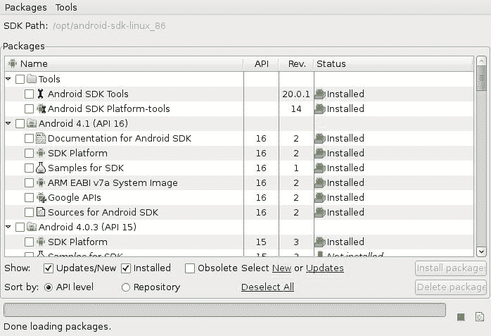

支持库文件将被下载到安卓软件开发工具包文件夹。要添加到项目中的 JAR 文件是`<AndroidSDK>\extras\android\support\v4\android-support-v4.jar`。

让我们从你的安卓项目中引用这个库:

1.  将支持库复制到项目根目录下的`libs`目录中(如果不存在，则创建它)。
2.  在 Eclipse 中打开您的项目，从**包浏览器**中选择与支持库对应的元素。右键单击，从菜单中选择**构建路径** | **添加构建路径**。
3.  最后一步是检查设置是否正常工作。为此，将以下导入添加到项目中，并验证 Eclipse 中没有错误:

    ```java
    import android.support.v4.app.FragmentActivity;
    ```

4.  Build the project:

    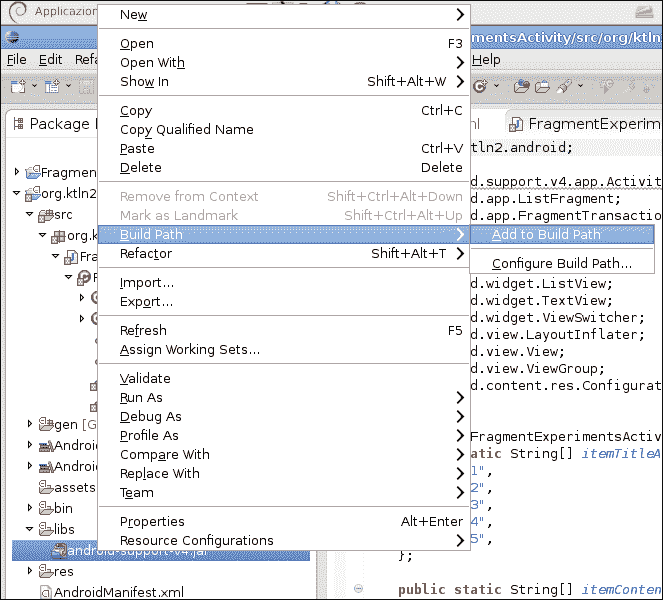

如果没有构建错误，一切正常。

## 它是如何工作的...

一个安卓应用首先是一个 Java 应用，像所有这些类型的应用一样，它需要知道在哪里可以找到你的代码中使用的类；只需将您选择的库添加到构建路径中即可。通常在 Java 中，库的路径由`JAVAPATH`环境变量指示，但是由于 Eclipse 使用它的系统，细节更加微妙，但是概念是相同的。

## 还有更多...

现在让我们谈谈一些其他的选择，或者可能是一些与这项任务相关的一般信息。

### 空气污染指数

为了更好地了解兼容性包，了解一下安卓的历史是有帮助的。

安卓平台诞生于 2003 年，是一家最初被称为安卓公司(Android Inc .)的公司的产品，该公司于 2005 年被谷歌收购。它的直接竞争对手过去是，现在仍然是苹果和 RIM 的 iOS 平台，即黑莓。从技术上来说，它的核心是一个使用 Linux 内核的操作系统，旨在安装在具有非常不同硬件的设备上(主要是移动设备，但今天它也用于一般的嵌入式系统，例如游戏控制台 OUYA，其功能是安卓 4.0 的修改版本)。

像任何已经存在了一段时间的软件一样，功能发生了许多变化，出现了许多版本，每个版本都有一个甜点的名字:

*   苹果派(原料药一级)
*   香蕉面包(空气污染指数 2 级)
*   1.5–纸杯蛋糕(原料药 3 级)
*   1.6–甜甜圈(4 级空气污染指数)
*   2.0-2.1x–艾克蕾尔(空气污染指数 5 至 7 级)
*   2.2–弗若约(空气污染指数 8 级)
*   2.3–姜饼(美国石油学会 9 级和 10 级)
*   3.0-3.2–蜂巢(美国石油学会等级 11 至 13)
*   4.0–冰淇淋三明治(API 等级 14 和 15)
*   4.1–果冻豆(美国石油学会 16 级)

像许多其他软件项目一样，名称和主题都是按字母顺序排列的(遵循这种方法的另一个项目是 Ubuntu 发行版)。

括号中写的 **API 级别**是关于这个兼容性包的要点。软件的每个版本都会引入或移除功能和错误。在它的有生之年，像安卓这样的操作系统旨在增加更多奇妙的创新，同时避免破坏旧版本中预先安装的应用，但也旨在通过技术上称为**反向支持**的过程，为这些旧版本提供相同的功能。

有关 API 级别的更多信息，请仔细阅读[上的官方文档。](http://developer.android.com/guide/topics/manifest/uses-sdk-element.html#ApiLevels)

在接下来的章节中，您将阅读的所有内容都被认为是使用反向分类来解决这些问题；具体来说，就是专门解决安卓操作系统 3.0 版本——名为蜂巢的版本——的后向兼容性问题。

3.0 版本最初打算安装在平板电脑上，一般来说，安装在大屏幕设备上。安卓是一个平台，从一开始就打算在具有非常不同特征的设备上使用(想想一个系统，其中一个应用必须在 VGA 屏幕上可用，有或没有物理键盘，有相机，等等)；随着 3.0 的发布，所有这些都通过特定的 API 得到了改进，这些 API 被认为可以扩展和简化应用的开发，并且还可以通过图形用户界面创建新的模式。

更重要的创新是引入了 Fragment 类。早些时候，开发安卓应用的唯一主要类别是活动，这是一个为用户提供屏幕以完成特定任务的类别，但这种类别过于粗糙，不可重复使用，不足以在平板电脑等大屏幕应用中使用。随着作为基本块的 Fragment 类的引入，现在可以创建响应性的移动设计；也就是说，使用回流或主活动中每个片段的组合，生成适应上下文的内容并优化块的放置。

这些概念的灵感来自所谓的响应性网页设计，即开发人员构建适应视口大小的网页；关于这一论点的杰出著作是《响应性网页设计》、*伊桑·马科特*。

如果这一切看起来有点复杂，请允许我用一个真实的应用做一个简单的例子。下图是同一个应用(Google Play，安卓市场)两个不同屏幕分辨率的截图组成；您可以看到关于开发人员的信息和关于应用的信息是如何并排放置在平板电脑版本上的，在手机版本中，它们只是一个接一个地显示。

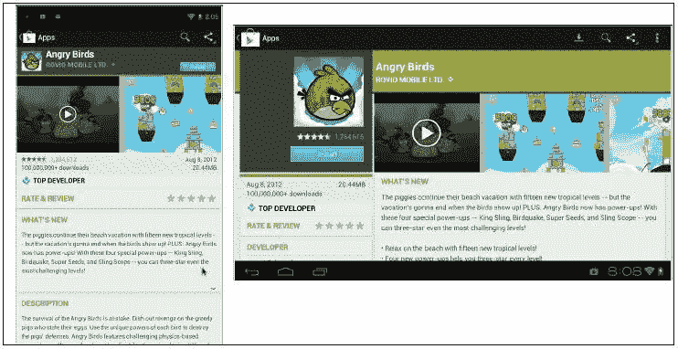

这不是创建所谓的多窗格布局的唯一可能性；根据您的计划，您可以拉伸、压缩、堆叠或扩展片段。在安卓的网站上，它可以作为一个值得遵循的指南——在网站的设计部分。可在[http://developer . Android . com/design/patterns/多窗格-layouts.html](http://developer.android.com/design/patterns/multi-pane-layouts.html) 获得。

谷歌平台中引入的另一个重要元素是名为 ActionBar 的 UI 模式——应用顶部的一个界面，其中更重要的菜单按钮被可视化，以便于访问。


此外，操作栏中还提供了一个新的上下文菜单。例如，当选择列表中的一个或多个项目(如 Gmail 应用)时，栏的外观会发生变化，并显示与选定项目的可用操作相关的新按钮。

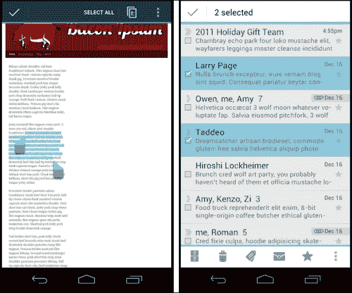

为了完整起见，让我列出蜂窝引入的其他新功能(如前所述，查看官方文档以更好地理解它们):

*   **复制粘贴**:基于剪贴板的框架
*   **加载器**:异步加载数据
*   **拖放**:允许在视图之间移动数据
*   **属性动画框架**:取代旧的动画包，允许几乎所有东西的动画进入一个应用
*   **硬件加速**:从 API 级别 11 开始，图形管道在出现时使用专用硬件
*   支持加密存储

并非此处列出的所有内容都是支持库提供的。特别是，没有正式的方法以向后兼容的方式实现新的动画框架(尽管确实存在这样的库)。

遗憾的是，支持库不支持操作系统早期版本的所有这些功能。最值得注意的是，官方的谷歌支持库不支持动作栏。

幸运的是，对于安卓开发者来说，有一个名为`ActionBarSherlock`的开源项目，它出色地将 ActionBar API 带回了安卓 1.6 (API 级别 4)。我们将在*行动栏*部分对此进行更多讨论。

# 片段(应该知道)

这是最重要的部分。在这里，您将学习如何创建一个安卓应用，该应用不仅向后兼容低至应用编程接口级别 4 的版本，而且能够根据上下文显示内容。在正常尺寸显示的手机中，它只会显示一个列表(单窗格配置)，但当有更大的屏幕可用时，也会显示包含选择细节的视图(多窗格配置)。

## 怎么做...

让我们开始创建一个由一个活动和两个片段组成的简单应用。一个显示项目列表，第二个显示与选择相关的数据。

1.  导入所有必要的类:

    ```java
    import android.content.*;
    import android.support.v4.app.*;
    import android.view.*;
    import android.widget.*;
    import android.os.Bundle;
    ```

2.  定义包含所有代码的活动，从支持库扩展`FragmentActivity`类:

    ```java
    public class FragmentCompatibility extends FragmentActivity {
       ...
    }
    ```

3.  实现它的方法`onCreate()`，我们要在这里设置初始布局，并做必要的事情来管理它:

    ```java
    @Override
    public void onCreate(Bundle savedInstanceState) {
      super.onCreate(savedInstanceState);
      setContentView(R.layout.main);

      /*
      * There is the main_container view so we are not in multi paned
      * and we attach the fragment at runtime (we cannot modify lately
      * the fragment organization if it's defined in XML)
      */
      boolean isMultiPaned = (findViewById(R.id.main_container) == null);
      if (!isMultiPaned) {

        /*
        * If we are coming from a previous instance we don't
        * have to reattach the SmallListFragment.
        */
        if (savedInstanceState != null) {
          return;
        }
        SmallListFragment slf = new SmallListFragment();

        getSupportFragmentManager().beginTransaction()
        .add(R.id.main_container, slf).commit();
      }
    }
    ```

4.  使用`ListFragment` :

    ```java
        public static class SmallListFragment extends ListFragment {
              ….
        }
    ```

    创建显示主要选项列表的片段
5.  实现这个类的`onActivityCreate()`方法，这里我们设置列表的内容:

    ```java
    @Override
    public void onActivityCreated(Bundle b) {
      super.onActivityCreated(b);
      setListAdapter(
        new ArrayAdapter<String>(getActivity(),
        android.R.layout.simple_list_item_1,
        itemTitleArray
        )
      );
      // First, we need to understand if is multi paned
      mIsMultiPaned = (getActivity().findViewById(R.id.main_container) == null);

    }
    ```

6.  执行`onListItemClick()`方法，向用户显示更新相邻片段或替换列表的选定内容:

    ```java
    @Override
    public void onListItemClick(ListView l, View v, int position, long id) {
        if (mIsMultiPaned) {
        //mDetail.updateContent(position);
        } else {
          SmallFragment sf = new SmallFragment();

          FragmentTransaction transaction =
          getActivity().getSupportFragmentManager().beginTransaction();
          transaction.replace(R.id.main_container, sf);
          transaction.addToBackStack(null);
          transaction.commit();
        }

      }
    }
    ```

7.  添加将显示详细信息的片段的定义:

    ```java
        public static class SmallFragment extends Fragment {
          ...
        }
    ```

8.  实现它的`onCreateView()`方法，这里我们简单地缩小一个表示片段内容的布局文件:

    ```java
        public View onCreateView(
            LayoutInflater inflater,
            ViewGroup container,
            Bundle savedInstanceState) {
            View v = inflater.inflate(R.layout.simple, null);

            return v;
        }
    ```

现在是时候写布局文件了。

1.  创建一个路径为`res/layout/main.xml`的文件，声明单窗格界面:

    ```java
    <?xml version="1.0" encoding="utf-8"?>
    <LinearLayout xmlns:android="http://schemas.android.com/apk/res/android"
        android:id="@+id/main_container"
        android:layout_width="match_parent"
        android:layout_height="match_parent" >
        <FrameLayout
            android:id="@+id/detail_container"
            android:layout_width="0dp"
            android:layout_height="match_parent"
        />
    </LinearLayout>
    ```

2.  用多窗格用户界面

    ```java
    <?xml version="1.0" encoding="utf-8"?>
    <LinearLayout xmlns:android="http://schemas.android.com/apk/res/android"
        android:orientation="horizontal"
        android:layout_width="match_parent"
        android:layout_height="match_parent" >
        <fragment android:name="org.ktln2.android.packt.FragmentCompatibility$SmallListFragment"
            android:id="@+id/list_fragment"
            android:layout_width="match_parent"
            android:layout_height="match_parent"
            android:layout_weight="1"
            />
        <fragment android:name="org.ktln2.android.packt.FragmentCompatibility$SmallFragment"
            android:id="@+id/detail_fragment"
            android:layout_width="match_parent"
            android:layout_height="match_parent"
            android:layout_weight="1"
            />
     </LinearLayout>
    ```

    创建路径为`res/layout-land/main.xml`的文件

## 它是如何工作的...

*中写的代码要点如何做...*部分是创建一个简单的应用，能够根据上下文调整其内容，当然，从 API 级别 4 开始，它可以从任何具有安卓版本的设备上启动。

这可以通过使用一个特定的定制类来实现，该类由名为`FragmentActivity`的兼容性包提供；请注意这一点，否则片段相关的东西将无法正常工作。

代码创建了一个包含两个片段的活动。一个是从简单数组中获取的随机项目的简单列表，另一个是包含常量文本的非常简单的片段。应用选择如何使用设备的方向来组织布局。当设备处于横向模式时，片段并排显示，否则我们从仅显示列表的应用开始，然后在列表中选择一个项目后，我们切换到用另一个片段替换列表的细节。

管理显示的片段是活动类的工作。管理片段有两种方法:

*   **静态**:通过在 XML 中包含片段
*   **动态**:通过在运行时用`FragmentManager`加载片段

这里需要注意的重要一点是，在运行时，XML 中定义的片段不能用`FragmentManager`移除，只能移除动态加载的片段。这一点非常重要，可能会导致非常错误的行为或更糟的情况；看起来工作正常，但在幕后它引入了一些非常讨厌的 bug(例如，多次出现的 UI 片段)。

### 注

一个非常有用的工具是层次查看器，它包含在软件开发工具包中。该工具在应用运行时以图形层次树的形式显示活动。`.bat`文件可以在`<SDK_ROOT\tools\hierarchyviewer.bat>`找到。

让我解释一下安卓是如何工作的，以及它如何在状态转换之间保存用户界面的状态。

当一个活动被暂停或破坏时，就会发生状态转换，这种情况经常发生，例如在打电话时(记住，安卓设备可能是手机)，甚至当设备方向改变时！

当您的应用看起来运行良好，但是当方向改变时崩溃时，最后一种情况可能会令人惊讶。

这是因为方向的改变会从零开始破坏和重建用户界面。系统使`onSaveInstanceState()`方法可用，该方法在活动可能被终止之前被调用，并将`Bundle`实例传递给它，在该实例中，我们可以保存所有我们认为有价值的东西，以便重新创建实际状态。该状态可以在`onCreate()`方法中恢复，其中系统将传递回相同的`Bundle`。

系统保存已经为其定义了标识的用户界面元素的状态，因此，例如，如果我们在 XML 中定义了一个带有关联标识的`EditText`方法，则写入其中的任何文本都将从状态更改中幸存下来。

在我们的代码中，我们选择用包含细节的片段来替换`ListFragment`，但是为了这样做，我们必须从头开始以编程方式创建它。但是这里有一个微妙的点；由于容器视图有一个与之关联的 ID，它将具有从先前状态保存的`ListFragment`。因此，我们必须检查我们是否来自以前的状态，以防再次尝试片段；使用的代码如下:

```java
if (savedInstanceState != null) {
    return;
}
```

相反，如果我们处于纵向模式，没有以前的实例，我们可以简单地附加`ListFragment`，使用`FragmentManager`及其方法。

### 注

请注意，使用正常的安卓应用编程接口时，从`getFragmentManager()`返回`FragmentManager`，必须使用`getSupportFragmentManager()`调用支持库。

为了理解剩余的代码，我们必须掌握片段的生命周期，如下表所示:

<colgroup><col style="text-align: left"> <col style="text-align: left"></colgroup> 
| 

片段

 | 

活动

 |
| --- | --- |
| `onAttach()``onCreate()` |   |
| `onCreateView()` | `onCreate()` |
| `onActivityCreated()` |   |
| `onStart()` | `onStart()` |
| `onResume()` | `onResume()` |
| `onPause()` | `onPause()` |
| `onStop()` | `onStop()` |
| `onDestroyView()` |   |
| `onDestroy()` | `onDestroy()` |
| `onDetach()` |   |

一个活动和它的片段有着紧密的联系；现在对我们来说更重要的是创建时间，也就是调用 Activity 的`onCreate()`方法的时间。如前所述，可以通过使用片段标记或在运行时动态加载片段，将片段直接放置在 XML 布局中。在所有情况下，片段的`onCreateView()`方法必须返回这个布局。

请注意，只有在活动的`onCreate()`方法返回后，我们才能依赖内容视图层次结构的正确初始化。此时，片段的`onActivityCreate()`方法被调用。

## 还有更多...

现在让我们谈谈一些其他的选择，或者可能是一些与这项任务相关的一般信息。

### 创建上下文适配界面

当我们创建片段的两种可能布局时，我们选择横向和纵向作为切换，但这并不是完全正确的方法。

我们很清楚如何通过将同一资源(布局、图像等)放在一个目录中来提供不同版本的资源，该目录的名称附加了一些特定的限定符，这些限定符标识了资源必须使用的配置(在前面的例子中，layout-land 被用作目录的名称，以指示横向设备的配置)。限定词可以混合在一起，但只能以特定的顺序。

从 API 级别 13(即 3.2 版)开始，有两个新的限定符可用:

*   `w<N>dp`:该限定符以 dp 为单位指定了资源应该使用的最小可用屏幕宽度，由`<N>`值定义。当方向在横向和纵向之间改变以匹配当前实际宽度时，该配置值将改变。
*   `h<N>dp`:该限定符以 dp 为单位指定了资源应该使用的最小可用屏幕高度-由`<N>`值定义。当方向在横向和纵向之间改变以匹配当前实际高度时，该配置值将改变。

有了这些限定符，还可以在设备上使用扩展布局，例如，纵向模式下的屏幕宽度足够大以容纳它。如果我们决定切换发生在 600 dp 的屏幕宽度，我们可以将我们的扩展布局 XML 文件放入名为`res/layout-w600dp/`的目录中。

在这种情况下，另一个有用的技巧是在布局中使用`<include>`和`<merge>`标签。这样，我们可以只创建一个特定的布局文件，如果我们认为它必须相等，就可以从另一个文件中引用它。如果我们想使用`res/layout-w600dp/main.xml`作为我们真正的扩展布局，我们可以从`res/layout-land/main.xml`引用它，代码如下:

```java
<?xml version="1.0" encoding="utf-8"?>
<merge>
  <include layout="@layout/skeleton_extended"/>
</merge>
```

在这里，我们将其重命名为`skeleton_extended.xml`，多窗格布局。

最后的话是关于管理主题并尽可能使它们独立于版本。例如，如果我们想要将浅色主题(默认为深色)特别是`Holo`主题(从蜂巢开始的所有安卓操作系统中包含的特定主题，这是运行安卓 4.0 及更高版本的安卓设备的兼容性要求)与应用编程接口级别等于或大于 11 的设备一起使用，我们需要声明我们的自定义主题。创建两个目录，一个路径为`res/values/`，另一个名为`res/values-v11/`。

首先，创建包含以下内容的`styles.xml`文件:

```java
<resources>
    <style
            name="AppTheme"
            parent="android:Theme.Light" />
</resources>
```

在另一篇中改为写下以下内容:

```java
<resources>
    <style
            name="AppTheme"
            parent="android:Theme.Holo.Light" />
</resources>
```

最后在`AndroidManifest.xml`文件中插入以下代码行作为`<application>`标签的属性:

```java
android:theme="@style/AppTheme"
```

需要注意的是，这些考虑并不能直接帮助向后兼容，但是它们避免了新设备提供的可能性的损失。

### 菜单

从蜂巢版本开始，菜单的管理方式也有所不同。因为`ActionBar`，现在可以在上面呈现一些菜单选项，这样就变得容易访问了。在选择放置在操作栏中的选项时所使用的比率应该遵循 FIT 方案——频繁、重要或典型。

因此，用于构建菜单的方法，即`OnCreateOptionsMenu()`，在活动开始时被调用——当有动作栏时(在蜂窝设备之前，该功能只能通过按菜单按钮来激活)。例如，我们可以定义一个简单的菜单，其中有两个选项，放入`res/menu/main.xml`路径的一个文件中。

```java
<?xml version="1.0" encoding="utf-8"?>
<menu xmlns:android="http://schemas.android.com/apk/res/android">
    <item android:id="@+id/menu_new"
          android:title="New"
          android:showAsAction="ifRoom"/>
    <item android:id="@+id/help"
          android:title="Help" />
</menu>
```

由于我们已经在`showAsAction`属性中指示了`ifRoom`值，该选项将被插入到动作栏的右侧(如果设置了更多相同值的选项，将只显示那些适合动作栏的选项，其他选项将通过菜单按钮正常显示)。

在没有操作栏的前蜂窝设备中，所有选项将正常显示，并带有常用菜单按钮。

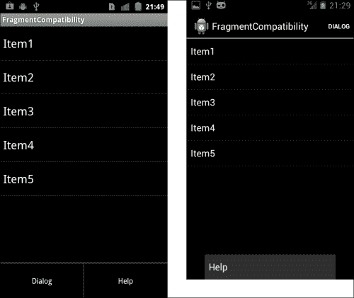

### 没有 UI 的片段

因为片段是应用级别的组件，而不是用户界面级别的组件，所以可以在不关联布局元素的情况下实例化它们。

我们通过`add(fragment, tag)`函数以编程方式实现这一点。

这可以通过`FragmentTransaction`的实例获得。`tag`参数是一个普通的字符串(不要将此参数与`View`类中使用的标签混淆)，然后可以使用`findFragmentByTag()`函数来查找片段。

如果您想知道为什么要使用没有用户界面的片段，请记住，这样在重新创建用户界面时(例如在方向改变期间)，片段不会被破坏。

### minSdkVersion 和 targetsdkversion

既然细节是魔鬼，那么理解`AndroidManifest.xml`中使用的`<uses-sdk>`标签中变量的作用就很重要了，它表达了应用与安卓平台的一个或多个版本的兼容性。

由于`minSdkVersion`的含义相当明显，我引用一下`targetSdkVersion`文档的摘录:

> *此属性通知系统您已经针对目标版本进行了测试，系统不应启用任何兼容性行为来维护您的应用与目标版本的前向兼容性。该应用仍然能够在旧版本(低至 minSdkVersion)上运行。*
> 
> *...如果平台的 API 级别高于您的应用的 targetSdkVersion 声明的版本，系统可能会启用兼容性行为，以确保您的应用继续按照您期望的方式工作。您可以通过指定 targetSdkVersion 来禁用这种兼容性行为，以匹配运行它的平台的 API 级别。*

在我们的案例中，我们希望创建可从 API 级别为 4 的设备安装的应用，特别是，我们希望使用蜂巢(即 API 级别为 11)引入的功能，因此最后`AndroidManifest.xml`文件必须包含以下内容:

```java
    <uses-sdk
        android:minSdkVersion="4"
        android:targetSdkVersion="11" />
```

对于 Eclipse 用户，最初可以从 Android 项目创建向导中设置这些值:

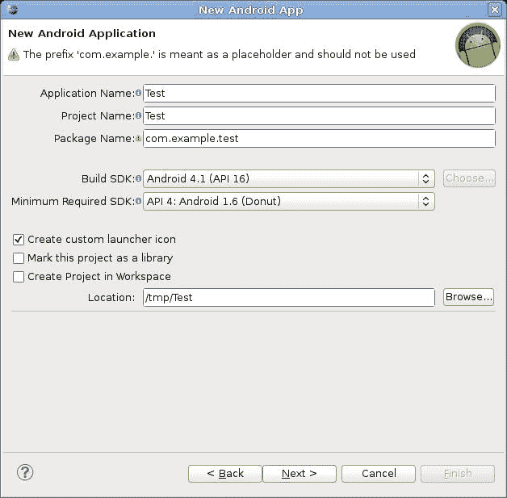

`targetSdkVersion`是**构建软件开发工具包**，如所示对话框中所设置的。

`maxSdkVersion`必须手动设置。

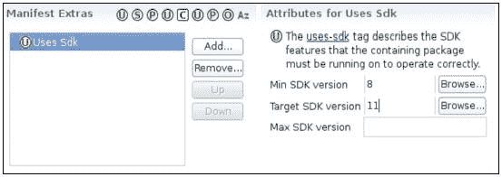

### 对话框

从代码中可以清楚地看到，有一种特殊类型的 Fragment，即`ListFragment`，它是一个片段，通过将项目绑定到数据源来显示项目列表，并在用户选择项目时公开事件处理程序。

支持库还提供了用于显示对话框窗口的`FragmentDialog`类的向后兼容实现。在文档中，解释如下:

> *显示对话窗口的片段，浮动在其活动窗口的顶部。该片段包含一个 Dialog 对象，它根据片段的状态适当地显示该对象。对话框的控制(决定何时显示、隐藏、关闭)应该通过这里的 API 来完成，而不是直接调用对话框。*

让我们编写一些示例代码来展示这是如何工作的:

1.  导入用于创建对话框的普通类:

    ```java
    import android.app.Dialog;
    import android.app.AlertDialog;
    ```

2.  创建一个类扩展`FragmentDialog` :

    ```java
        static public class DialogCompatibility extends DialogFragment {
         …
         }
    ```

3.  覆盖用于创建对话框的方法:

    ```java
          @Override
          public Dialog onCreateDialog(Bundle savedInstanceState) {
          return new AlertDialog.Builder(getActivity())
          .setTitle("Fragment and dialog")
          .create();
        }
    ```

4.  在菜单的资源文件中添加一个选项:

    ```java
        <item android:id="@+id/menu_dialog"
              android:title="Dialog"
              android:showAsAction="ifRoom"
              />
    ```

5.  最后，在 Activity 类'`onOptionsItemSelected()`函数中添加以下代码片段来调用这个 Dialog:

    ```java
      @Override
      public boolean onOptionsItemSelected(MenuItem item) {
        switch (item.getItemId()) {
          case R.id.menu_dialog:
          DialogCompatibility dc = new DialogCompatibility();
          DialogCompatibility.newInstance().show(getSupportFragmentManager(), "dialog");
          return true;
          default:
          return super.onOptionsItemSelected(item);
        }
      }
    ```

显然，这是一个非常简单的例子，还可以说得更多，但这只是留给读者的练习(例如，如何将对话框嵌入到活动中)。

### 版本 _ 代码

并非所有可能的问题都可以通过支持库来解决，因此有必要学习一些方法来管理不同版本之间功能的不同可用性。

一种解决方案可能是创建不同的 apk，每个特定版本的安卓都有一个，并在安卓市场上分别上传每个 APKs 这并不特别聪明，因为它会导致大量代码重复，是可维护性的地狱。

更好的解决方案是在感兴趣的代码中创建分支，使用`if`语句并检查`VERSION_CODES`。这可以从`android.os.Build`包中访问，它提供了安卓所有版本的枚举。为了能够在运行时检查实际版本，必须在`android.os.Build.VERSION`包中使用`SDK_INT`字段。

最后，我们应该编写一些类似如下的代码:

```java
if (android.os.Build.VERSION.SDK_INT => android.os.Build.VERSION_CODES.HONECOMB) {
   // ...
} else if (android.os.Build.VERSION.SDK_INT =>
android.os.Build.VERSION_CODES.GINGERBREAD){
     // ...
}
```

一种更复杂的方法是使用资源系统来设置具有感兴趣值的适当布尔变量。假设我们创建了两个`values`文件，一个路径为`res/values/bools.xml`，内容如下:

```java
<?xml version="1.0" encoding="utf-8"?>
<resources>
   <bool name="isHoneycomb">false</bool>
</resources>
```

另一条在路径`res/values-v11/bools.xml`处有以下内容:

```java
<?xml version="1.0" encoding="utf-8"?>
<resources>
   <bool name="isHoneycomb">true</bool>
</resources>
```

在代码内部，`isHoneycomb`变量可以用一段简单的代码引用，如下所示:

```java
Resource r = getResources();
boolean isHoneycomb = r.getBoolean(R.bool.isHoneycomb)
```

这可以直接在代码中使用。

# 装载机(应该知道)

在这个任务中，我们将展示名为`Loader`的类的使用，这个类专门用于在后台进行异步工作，以便更新应用相关的数据；在引入`Loader`和相关类之前，管理数据的唯一方法是使用带有特定活动类的方法的 Cursor:

```java
public void startManagingCursor(Cursor)
public Cursor managedQuery(Uri, String, String, String, String)
```

这种方法的问题是这些调用在主应用线程上，可能会使应用没有响应，并可能导致可怕的 ANRs！

在接下来的步骤中，我们将展示一个应用的代码，该应用通过对 web 服务器的 HTTP 请求从 Packt 的网站加载 RSS，显然这不可能是即时的；这里是`Loader`类将被使用的地方。所有这些都是通过支持库完成的；这样，应用将与以前的安卓平台兼容。

## 怎么做...

让我们列出完成任务所需的步骤:

1.  首先，包含必要的支持库类:

    ```java
    import android.support.v4.app.FragmentActivity;
    import android.support.v4.app.*;
    import android.support.v4.content.*;
    ```

2.  像往常一样定义一个子类化`FragmentActivity`类的类，并定义为我们创建图形用户界面的`onCreate()`方法:

    ```java
    public class LoaderCompatibilityApplication extends FragmentActivity {
        @Override
        public void onCreate(Bundle savedInstanceState) {
            super.onCreate(savedInstanceState);
            setContentView(R.layout.main);
        }
    }
    ```

3.  定义将显示所需数据的片段。重要的是它实现了`LoaderManager.LoaderCallbacks` :

    ```java
      static public class RSSFragment extends ListFragment
        implements LoaderManager.LoaderCallbacks<String[]> {
      }
    ```

4.  在其`onActivityCreated()`中实现自己数据的适配器，更重要的是，使用名为`initLoader()` :

    ```java
      @Override
      public void onActivityCreated(Bundle savedInstance) {
        super.onActivityCreated(savedInstance);

        setListAdapter(
        new ArrayAdapter<String>(
        getActivity(),
        android.R.layout.simple_list_item_1,
        new String[]{}
        )
        );
        /*
        * Differently to what the documentation says,
        * append forceLoad() otherwise the Loader will not be called.
        */
        getLoaderManager().initLoader(0, null, this).forceLoad();
      }
    ```

    的`LoaderManager`类方法调用 Loader
5.  现在，是时候实现`LoaderManager.LoaderCallbacks`界面中定义的方法了:

    ```java
      public RSSLoader onCreateLoader(int id, Bundle args) {
        return new RSSLoader(getActivity());
      }

      public void onLoaderReset(Loader<String[]> loader) {
      }

      public void onLoadFinished(Loader<String[]> loader, String[] data) {
        setListAdapter(
          new ArrayAdapter<String>(
            getActivity(),
            android.R.layout.simple_list_item_1,
            data
          )
        );
      }
    ```

6.  最后定义`Loader`子类(有两个函数，`doGet()`和`getNews()`，这里不显示；他们只需检索 XML 并设法将其转换成字符串数组)。特别是执行`loadInBackground()`方法。读者必须注意，这里我们扩展了支持库中包含的`AsyncTaskLoader`类:

    ```java
      static public class RSSLoader extends AsyncTaskLoader<String[]> {
        @Override
        public String[] loadInBackground() {
          String xml = "";
          String[] news;

          try {
            xml = doGet();
            news = getNews(xml);
          } catch (Exception e) {
            news = new String[] {e.getMessage()};
          }

          return news;
        }
      }
    ```

7.  添加一个简单的布局文件:

    ```java
    <?xml version="1.0" encoding="utf-8"?>
    <LinearLayout xmlns:android="http://schemas.android.com/apk/res/android"
        android:orientation="vertical"
        android:layout_width="fill_parent"
        android:layout_height="fill_parent"
        >
        <fragment   android:name="org.ktln2.android.packt.LoaderCompatibilityApplication$RSSFragment"
            android:id="@+id/rss_list"
            android:layout_width="fill_parent"
            android:layout_height="fill_parent"
            />
    </LinearLayout>
    ```

## 它是如何工作的...

前面的代码片段只是促进了加载程序所属的片段类实例和加载程序本身之间的同步。片段第一次通过其`initLoader()`方法查询`LoaderManager`时，使用`onCreateLoader()`创建一个新的加载器(如果具有给定标识的加载器已经存在，只需返回旧实例而不调用该方法)。

从现在开始，Loader 跟随 Fragment 的状态(当 Fragment 将被停止时，它将被停止)并且当数据准备好时将调用`onLoadFinished()`方法。在前面的例子中，列表是用包含建立在`loadInBackground()`上的`news`的数组更新的。

## 还有更多...

现在让我们谈谈一些其他的选择，或者可能是一些与这项任务相关的一般信息。

### 低水平

在幕后，安卓应用不是一个接一个执行的唯一指令块，而是由多个执行管道组成。这里的主要概念是过程和线程。当应用启动时，操作系统创建一个进程(技术上是一个 Linux 进程)，每个组件都与这个进程相关联。

与进程一起，还创建了名为`main`的执行线程。这是一个非常重要的线程，因为它负责将事件分派给适当的用户界面元素，并从它们那里接收事件。这个线程也叫 **UI 线程**。

需要注意的是，系统没有为每个元素创建单独的线程，而是为所有元素使用相同的 UI 线程。这对应用的响应能力来说可能是危险的，因为如果您执行密集或耗时的操作，这将阻塞整个用户界面。所有安卓开发者都反对当用户界面无响应超过 5 秒时出现的 **ANR** ( **应用无响应**)消息。


遵循安卓的文档，只有两条规则可以避免 ANR:

*   不要阻塞用户界面线程
*   不要从用户界面线程之外访问安卓用户界面工具包

这两条规则看似简单，但有些细节必须清楚。首先，让我向您展示创建新线程的最简单方法，使用名为`Thread`的类。

这个类实现了用一个叫做`run()`的方法定义的`Runnable`接口；当一个`Thread`实例调用自己的方法`start()`时，它会在后台启动`run()`方法中定义的指令。对于每个有 Java 编程经验的人来说，都不是什么新鲜事；这是普通的 Java，因此它在所有 API 级别上都是完全可用的。

例如，如果我们想创建一个休眠 5 秒钟的简单任务，而不阻塞用户界面，我们可以使用以下代码:

```java
new Thread(new Runnable() {
  public void run() {
    this.sleep(5000);
  }
}).start();
```

一切都很清楚，但在一般情况下，我们希望与用户界面交互，以便更新进度条、显示错误或更改用户界面元素的外观；使用安卓文档中的一个例子，我们很想写一段代码，通过使用远程 PNG 来更新一个`ImageView`:

```java
public void onClick(View v) {

  new Thread(new Runnable() {

    public void run() {

      Bitmap b = loadImageFromNetwork("http://example.com/image.png");

      mImageView.setImageBitmap(b);
    }

  }).start();

}
```

看起来一切正常，但是当运行这段代码时，它会导致应用日志中出现一个臭名昭著的异常:

> *只有创建视图层次结构的原始线程才能接触其视图。*

这是因为`setImageBitmap()`是在我们创建的线程中执行的，而不是在 UI 线程中执行的，违反了上面表达的第二条规则(这是不允许的，因为 UI 线程不是线程安全的，也就是说，不能保证对一个元素的并发访问不会导致问题)。

在我们解决这个问题之前，让我向您展示安卓系统引入的管理线程的最内部结构——类`Looper`和`Handler`。

第一个类的实例只是用来在线程中运行一个消息循环，该循环将由第二个类的实例处理。另一方面，`Handler`实例管理线程之间的消息实例，但是它的执行上下文是最初定义它的线程。

为了理解，最好写一个复杂的例子，涉及两个线程与消息通信。假设我们有一个通用的 Activity 类，在它的`onCreate()`方法中，我们定义了每 5 秒钟通信一次的两个线程:

```java
  new Thread(new Runnable() {
    @Override
    public void run() {
      Looper.prepare();

      mFirstHandler = new Handler() {
        @Override
        public void handleMessage(Message message) {
          android.util.Log.i(TAG, (String)message.obj);
        }
      };

      Looper.loop();
    }
  }).start();

    new Thread(new Runnable() {
    @Override
    public void run() {
      int cycle = 0;
      while (true) {
        try {
          Thread.sleep(5000);

          Message msg = mFirstHandler.obtainMessage();

          msg.obj = "Hi thread we are at " + cycle;
          mFirstHandler.sendMessage(msg);

          cycle++;
        } catch (java.lang.InterruptedException error) {
          android.util.Log.i(TAG, "error: " + error.getMessage());
        }
      }
    }
  }).start();
```

代码运行时，它在 Eclipse 的线程面板中是这样显示的:

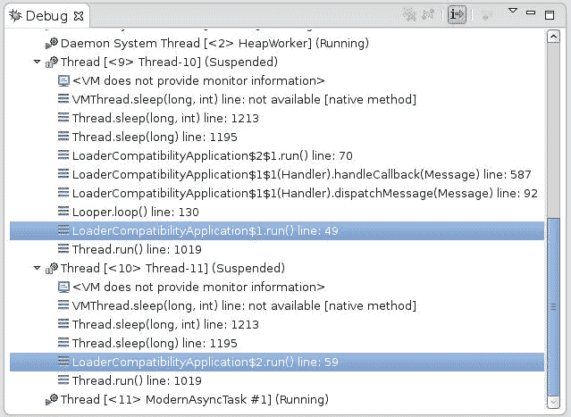

更吸引人的是，还有一种可能是将`Runnable`类排队到`Handler`类的原线程中执行。可以用一个`Runnable`类的定义作为参数来代替`sendMessage()`。

为了使用这些类，需要记住的最基本的一点是调用线程的`run()`方法中的`Looper.prepare()`和`Looper.loop()`以及其间与`Handler`类相关的代码——仅此而已。

唯一一个定义了 Looper 的线程是用户界面线程，它提供一些方法来发布`Runnable`类实例。

现在，回到前面的问题，让我解释一下如何使用`Runnable`类来解决它；我们可以通过使用任何`View`可用的实用方法来发布更新的用户界面代码，例如`View.post(Runnable)`方法。

现在，我们可以用以下代码替换导致问题的行:

```java
            mImageView.post(new Runnable() {
                public void run() {
                    mImageView.setImageBitmap(bitmap);
                }
            });
```

`Looper`和`Handler`很重要，因为它们是系统的核心，更重要的是，它们从 API 级别 1 开始就可用了，这使得它们成为编写 Android 应用的良好资源。

另一个重要的类是`AsyncTask`，自 API 级起可用。如果您已经使用后台线程处理了一个应用，那么很可能您已经使用了它，因为它是用于此目的的；以方便线程的管理，并避免`Looper`和`Handler`类的所有麻烦和容易出错的代码。

它的定义很特别。它使用泛型；也就是说，有一些用`Params`、`Progress`和`Result`表示的参数，它们标识了内部用于管理线程的一些函数的签名。

具体来说，`AsyncTask`有如下四种方法:

*   `void onPreExecute()`:它的作用是设置任务。
*   `protected Result doInBackground(Params...)`:这是`AsyncTask`类的核心，你的代码必须写在这里。就在`onPreExecute()`被终止之后，一个后台线程被创建来执行这个函数。记住不要试图从这个函数更新用户界面是很重要的。使用`onProgressUpdate()`将更新发布回用户界面。
*   `onProgressUpdate(Progress...)`:这是用来以某种方式发布进度的。
*   `onPostExecute(Result)`:接收`doInBackground()`功能的结果。

除了`doInBackground()`函数之外，其他都是在 UI 线程中执行的，所以一定要记住不要在其中执行耗时的工作。

如果我们想要复制下载远程 PNG 并使用它更新`ImageView`的代码，我们应该编写一些东西，如下面的代码片段所示:

```java
class PNGUpdate extends AsyncTask<URL, Integer, Long> {
  Bitmap mBitmap;
  ImageView mImageView;

  public PNGUpdate(ImageView iv) {
    mImageView = iv;
  }

  protected Long doInBackground(URL... urls) {
   int count = urls.length;
    for (int i = 0; i < count; i++) {
      mBitmap = loadImageFromNetwork(urls[i]);
    }

    return 0;
  }

  protected void onPostExecute(Long result) {
    mImageView.setImageBitmap(mBitmap);
  }
}
```

对于我们想要调用它的地方，我们必须插入一行，如下所示:

```java
new PNGUpdate(myImageView).execute(pngURL)
```

您可能已经注意到，在最初的步骤中，当我们定义我们的 Loader 时，我们子类化了一个名为`AsyncTaskLoader`的类。它只是一个内部有`AsyncTask`的装载机；这里唯一的区别是，它的定义中没有三个参数，只有一个，因为 Loader 并不认为它会返回关于操作状态的信息(例如，没有显示进度条)。

关于线程的串行/并行执行的文档的最后一个注释:

> *首次引入时，异步任务在单个后台线程上串行执行。从 DONUT 开始，这被更改为允许多个任务并行操作的线程池。从蜂巢开始，任务在单个线程上执行，以避免并行执行导致的常见应用错误。*
> 
> *如果真的想要并行执行，可以用 THREAD_POOL_EXECUTOR 调用 executeor(Java . util . concurrent . EXECUTOR，Object[])。*

### 装载机的一般结构

关于编写加载器的最初说明使用了简单的`AsyncTaskLoader`，这大大简化了开发人员的生活，为您在后台线程和用户界面线程之间创建了正确的细分。

这一点很重要，主要是因为它避免了浪费你的时间，错误很少，更重要的是，它使代码更加模块化，避免了重新发明轮子的需要。然而，现在我们要重新发明轮子，以便理解如何用您的应用正确管理`Loader`类。

加载器旨在用于动态数据，在动态数据中，为了刷新用户界面的相关元素，通知更新是很重要的；为了通知我们的加载器底层数据发生了变化，我们将实现一个名为`RSSObservable`的类，该类控制 XML(表示 RSS)与以前的版本不同。需要注意的是，这是一个概念证明，并不打算在现实世界中使用。加载器类和可观察类都下载 RSS，导致电池耗尽(在某些情况下，您将被收取带宽费用)。

一旦你阅读了这段代码，试着将它与你在文件`frameworks/base/core/java/android/content/AsyncTaskLoader.java`中的安卓源代码中可以找到的`AsyncTaskLoader`类的原始实现进行比较。显然，我们不会实现您在那里可以找到的所有东西。

因此，让我们实现我们的定制加载器:

1.  导入所需的类:

    ```java
    import android.content.Context;
    import android.support.v4.content.Loader;
    import android.os.AsyncTask;
    import java.util.Observer;
    import java.util.Observable;
    ```

2.  定义我们的自定义加载器，扩展`Loader`类并指示`Observer`接口的实现:

    ```java
    class RSSLowLevelLoader extends Loader<String[]> implements Observer {
        …
    }
    ```

3.  定义将引用`Task`和`Observable`实例的内部变量:

    ```java
    private Task mTask = null;
    private RSSObservable mTimerObservable = null;
    ```

4.  定义构造函数，在这里我们初始化类正确工作所需的所有东西。

    ```java
    /*
     * Don't retain a reference to the context in the class since this
     * will / can cause a memory leak.
     */
        public RSSLowLevelLoader(Context context) {
            super(context);

            mTimerObservable = new RSSObservable();
            mTimerObservable.start(mURL);
            mTimerObservable.addObserver(this);
        }
    ```

5.  定义一个定制的`AsyncTask`，返回你选择的数据；在其`doInBackground()`方法中，简单地做与前面例子相同的操作。`onPostExecute()`警告`LoaderManager`任务结束。

    ```java
      private class Task extends AsyncTask<Void, Void, String[]> {
      @Override
        protected String[] doInBackground(Void... params) {
          String xml = "";
          String[] news = null;
          try {
            xml = RemoteHelper.doGet("http://www.packtpub.com/rss.xml");
            news = RemoteHelper.getNews(xml);
          } catch (java.lang.Exception e) {
            news = new String[] {e.getMessage()};
          }

          return news;
        }

        @Override
        protected void onPostExecute(String[] results) {
        // remember: deliverResult() must be called from the UI Thread
          RSSLowLevelLoader.this.deliverResult(results);
        }
      }
    ```

6.  现在实现可以在加载器上执行的主要操作的行为:

    ```java
      @Override
      protected void onStartLoading() {
        if (takeContentChanged()) {
          forceLoad();
        }
      }
      @Override
      protected void onStopLoading() {
        if (mTask != null) {
          boolean result = mTask.cancel(false);
          android.util.Log.i(TAG, "onStopLoading() = " + result);

          mTask = null;
        }

      }
      @Override
      protected void onForceLoad() {
        android.util.Log.i(TAG, "onForceLoad()");
        super.onForceLoad();

        onStopLoading();

        mTask = new Task();
        mTask.execute();
      }

      @Override
      protected void onReset() {
        mTimerObservable.stop();
      }
    ```

7.  执行`deliverResult()`方法:

    ```java
    @Override
    public void deliverResult(String[] data) {
      if (isReset()) {
        // if there is data to be garbage collected do it now
        return;
      }

      super.deliverResult(data);
    }
    ```

8.  写`Observer`界面的回调:

    ```java
      @Override
      public void update(Observable obs, Object data) {
        /*
        * The default implementation checks to see if the loader
        * is currently started; if so, it simply calls forceLoad().
        */
        onContentChanged();
      }
    ```

9.  编写一个表示`Observable`接口的类，在这里我们实现了观察数据变化并通知我们的代码:

    ```java
    public class RSSObservable extends Observable {
      private String mContents = "";
      private String mURL = null;
      private Timer mTimer = null;  

      public RSSObservable() {
        mTimer = new Timer();
      }

      private class InnerTimer extends TimerTask {
        @Override
        public void run() {

          String xml = "";
          try {
            xml = RemoteHelper.doGet(mURL);
          } catch (Exception e) {}
          if (xml != mContents) {
            RSSObservable.this.setChanged();
            RSSObservable.this.notifyObservers(null);

            mContents = xml;
          }
        }
      }

      public void start(String URL) {
        mURL = URL;
        mTimer.schedule(new InnerTimer(), 10000, 20000);
      }

      public void stop() {
         mTimer.cancel();
      }
    }
    ```

更麻烦的部分是理解加载器的底层流程。首先，它可以存在三种状态。这些措施如下:

*   `STARTED`:加载器执行它们的加载，并使用`onLoadFinished()`通知活动类。
*   `STOPPED`:加载器继续监控变更，但不得交付结果。当相关活动/片段类被停止时，通过从`LoaderManager`调用`stopLoading()`来引发该状态。
*   `RESET`:加载程序不得监控变更、交付结果等。已经收集的数据应该进行垃圾收集。

这些状态中的每一个都可以从其他状态到达。

由于都是异步发生的，所以当状态不同于`STARTED`时，数据更新的通知有可能到达`Loader`实例；这解释了代码中存在的各种检查。

在前面的代码片段中介绍了一件事，在`AsyncTaskLoader`示例中没有提到，那就是观察者/可观察设计模式。第一个被定义为接口，第二个被定义为类，两者都在`java.util`包中(两者都可以从 API 级别 1 获得，所以不要导致兼容性问题)。观察者通过`update()`方法接收更新通知，而当发生变化时，观察者(通过`addObserver()`方法)注册一些观察者(通过`notifyObservers()`方法)以得到通知。

### 类型

**最后一个音符**

`cancelLoad()`在兼容性库的`Loader`类版本中不存在。

# 行动吧(应该知道)

兼容性包没有解决的一个问题是 ActionBar，这是一种从谷歌引入到蜂巢平台的新的用户界面模式。由于这是与安卓生态系统集成的一个非常重要的元素，一些替代方案诞生了，第一个来自谷歌本身，作为一个名为 ActionBar Compatibility 的简单代码示例，您可以在安卓 SDK 的`sample/`目录中找到。

我们将遵循不同的方法，使用一个著名的开源项目`ActionBarSherlock`。

## 做好准备

这个库的代码没有 SDK 提供，我们需要从它的网站([http://actionbarsherlock.com/](http://actionbarsherlock.com/))下载。

也可以从作者的`github`资源库下载；下载归档文件后，您可以将其提取到您选择的目录中。

## 怎么做...

让我们将`ActionBarSherlock`作为一个库包含在 Eclipse 中，然后使用它创建一个简单的项目:

1.  Open Eclipse and create a new project to import the source files that you can find in the `libraries/` directory of the `ActionBarSherlock` source code. This can be done by selecting **File** | **New** | **Other...**.

    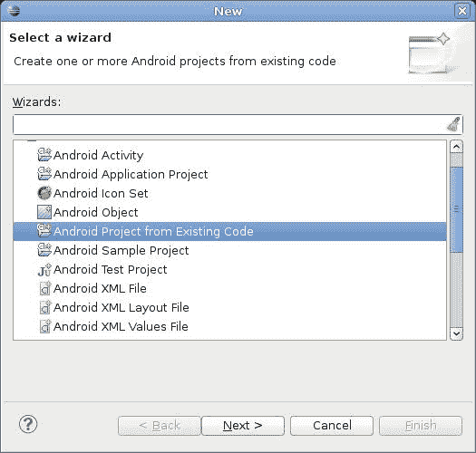

2.  打开要使用库的项目(否则创建一个新项目)。
3.  Tell Eclipse to use the `ActionBarSherlock` library by selecting the project from the Package explorer and then selecting **Project** | **Property** from the main menu. A dialog will show up. Now add the library from the **Android** section:

    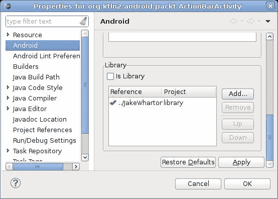

4.  在包含项目主活动的文件中，导入所需的类:

    ```java
    import com.actionbarsherlock.app.SherlockFragmentActivity;
    import com.actionbarsherlock.app.SherlockFragment;
    import com.actionbarsherlock.app.ActionBar;
    import com.actionbarsherlock.view.Menu;
    import com.actionbarsherlock.view.MenuItem;
    import com.actionbarsherlock.view.MenuInflater;
    ```

5.  实现将使用 ActionBar 的`Activity`类，扩展`SherlockFragmentActivity` :

    ```java
    public class ActionBarActivity extends SherlockFragmentActivity {
        …
    }
    ```

6.  在活动的`onCreate()`方法中，配置动作栏:

    ```java
        @Override
        public void onCreate(Bundle savedInstanceState) {
            super.onCreate(savedInstanceState);
            setContentView(R.layout.main);

            // if you wan to configure something
            // about ActionBar use this instance
            ActionBar ab = getSupportActionBar();
        }
    ```

7.  添加所需的以下代码片段以创建菜单选项:

    ```java
        @Override
        public boolean onCreateOptionsMenu(Menu menu) {
            MenuInflater inflater = getSupportMenuInflater();
            inflater.inflate(R.menu.main, menu);

            return true;
        }
    ```

8.  用期望的行为实现`Activity`类的`onOptionsItemSelected()`(这里我们只展示了一个简单的祝酒通知):

    ```java
      @Override
      public boolean onOptionsItemSelected(MenuItem item) {
          switch (item.getItemId()) {
            default:
                Toast.makeText(this, "Hi!", 1000).show();
            }

          return super.onOptionsItemSelected(item);
        }
    ```

9.  Define which menu options you want in the related XML file located at `res/menu/main.xml`:

    ```java
    <?xml version="1.0" encoding="utf-8"?>
    <menu xmlns:android="http://schemas.android.com/apk/res/android">
        <item android:id="@+id/first"
              android:title="First"
              android:showAsAction="ifRoom"/>
        <item android:id="@+id/second"
              android:title="Second"
              android:showAsAction="ifRoom"/>
    </menu>
    ```

    

## 它是如何工作的...

使用这个外部库，我们允许我们的应用实现 ActionBar 用户界面模式。`ActionBarSherlock`重新实现了在普通安卓框架中可以找到的大部分核心类。要记住的一个简单规则是在任何感兴趣的类前面加上夏洛克这个词。

由于记住哪些类属于这个库可能很棘手，让我列出这些类:

*   c `om.actionbarsherlock.ActionBarSherlock`
*   `com.actionbarsherlock.app.ActionBar`
*   `com.actionbarsherlock.app.SherlockActivity`
*   `com.actionbarsherlock.app.SherlockDialogFragment`
*   `com.actionbarsherlock.app.SherlockExpandableListActivity`
*   `com.actionbarsherlock.app.SherlockFragment`
*   `com.actionbarsherlock.app.SherlockFragmentActivity`
*   `com.actionbarsherlock.app.SherlockListActivity`
*   `com.actionbarsherlock.app.SherlockListFragment`
*   `com.actionbarsherlock.app.SherlockPreferenceActivity`
*   `com.actionbarsherlock.view.ActionMode`
*   `com.actionbarsherlock.view.ActionProvider`
*   `com.actionbarsherlock.view.CollapsibleActionView`
*   `com.actionbarsherlock.view.Menu`
*   `com.actionbarsherlock.view.MenuInflater`
*   `com.actionbarsherlock.view.MenuItem`
*   `com.actionbarsherlock.view.SubMenu`
*   `com.actionbarsherlock.view.Window`
*   `com.actionbarsherlock.widget.ActivityChooserModel`
*   `com.actionbarsherlock.widget.ActivityChooserView`
*   `com.actionbarsherlock.widget.ShareActionProvider`

如果出现一些问题，请记住仔细检查您是否使用了正确的类，并且没有从支持库或原始框架中导入该类。

该库努力保持与原始 ActionBar 的 API 兼容性。唯一需要记住的区别就是用`getSupportActionBar()`代替`getActionBar()`，用`getSupportMenuInflater()`代替`getMenuInflater()`。

`ActionBarSherlock`建立在支持库之上，所以为了获得`FragmentManager`，必须使用`getSupportFragmentManager()`功能。

## 还有更多...

现在让我们谈谈一些其他的选择，或者可能是一些与这项任务相关的一般信息。

动作栏不仅仅是一个*栏*，一个视觉元素，它还是一系列新的用户界面功能的大门；在接下来的部分中，我们将展示其中的一些功能以及如何使用它。

### 主页按钮

从一开始，安卓平台就提供了一个**后退**按钮，用户可以在活动和应用之间导航时后退。为了允许更结构化的导航，引入了**向上**按钮，以允许用户从不属于创建它的原始任务的活动创建新任务(这不完全正确，因为如果原始应用相同，则不会创建任务)。

例如，我们启动一个新闻阅读器，然后通过电子邮件选择一个我们想与朋友分享的特定新闻项目；为了做到这一点，我们启动了一个 *Email* 应用，它是在新闻阅读器的相同任务中启动的。如果*电子邮件*应用有一个**向上**按钮，点击它将开始一个新的任务与*电子邮件*应用的*主页*活动。

我们通过**向上**按钮获得的是活动应用内部的分层导航。显然，**向上**按钮不应该出现在主活动中，因为那里没有向上导航。

要在我们的代码中启用 **Up** 按钮，只需使用以下代码行将其激活:

```java
actionbarinstance.setDisplayHomeAsUpEnabled(true);
```

我们现在可以编写代码来处理点击操作栏左侧图标的操作。该代码如下:

```java
@Override
public boolean onOptionsItemSelected(MenuItem item) {
  switch (item.getItemId()) {

    case android.R.id.home:

    Intent intent = new Intent(this, MyOwnActivity.class);
    intent.addFlags(Intent.FLAG_ACTIVITY_CLEAR_TOP);
    startActivity(intent);

    return true;

    default:
    return super.onOptionsItemSelected(item);

  }
}
```

只需记住**向上**按钮在动作栏上用一个以`android.R.id.home`为标识符的小部件来表示。

### 动作视图

动作栏的另一个用户界面模式是**动作视图**。可以将特定的小部件与动作项相关联。这里的一个小部件是，一个可视元素，它可以被扩展以占据 ActionBar 的所有可用空间；在下面的代码中，我们将实现一个假的搜索条目——最初在操作栏上只有**搜索**按钮:


选择此元素后，它将显示为展开状态，如下图所示:


1.  导入所需的类:

    ```java
    import com.actionbarsherlock.view.MenuItem;
    import com.actionbarsherlock.view.MenuInflater;
    import android.widget.EditText;
    ```

2.  实现`Activity`类用于创建菜单的方法:

    ```java
    @Override
    public boolean onCreateOptionsMenu(Menu menu) {
      MenuInflater inflater = getSupportMenuInflater();
      inflater.inflate(R.menu.main, menu);

      MenuItem menuItem = menu.findItem(R.id.search);
      menuItem.setOnActionExpandListener(new MenuItem.OnActionExpandListener() {
        @Override
        public boolean onMenuItemActionCollapse(MenuItem item) {
          return true;
        }

        @Override
        public boolean onMenuItemActionExpand(MenuItem item) {
          return true;
        }
      });
      EditText fakeSearchView = (EditText)menuItem.getActionView();

      return true;
    }
    ```

3.  用动作视图定义菜单的 XML 文件:

    ```java
    <?xml version="1.0" encoding="utf-8"?>
    <menu xmlns:android="http://schemas.android.com/apk/res/android">
      <item android:id="@+id/search"
        android:title="Search"
        android:showAsAction="always|collapseActionView"
         android:actionLayout="@layout/action_view"
        />
    </menu>
    ```

4.  将动作视图的布局定义到放置在`res/layout/action_view.xml` :

    ```java
    <?xml version="1.0" encoding="utf-8"?>
    <EditText xmlns:android="http://schemas.android.com/apk/res/android"
        android:layout_width="fill_parent"
        android:layout_height="wrap_content"
        android:hint="Search"/>
    ```

    中的文件中

这个例子模仿了安卓文档中使用`SearchView`类的例子。该类在`ActionBarSherlock`中不可用，但计划在未来版本中包含(可能)。

关于这个问题的更多信息，请关注[https://github.com/JakeWharton/ActionBarSherlock/issues/70](https://github.com/JakeWharton/ActionBarSherlock/issues/70)github 项目页面的讨论。

### ShareActionProvider

动作视图概念的一个扩展是**动作提供者**—一个不仅控制其外观，还扩展其控制的小部件。安卓框架提供的一个动作提供者是`ShareActionProvider`，它允许我们轻松共享显示菜单的内容，其中有一些共享目标。

由于我们对使用`ActionBarSherlock`保持向后兼容性感兴趣，下面是实现这一点的必要步骤:

1.  导入所需的类:

    ```java
    import com.actionbarsherlock.widget.ShareActionProvider;
    import android.content.Intent;
    ```

2.  将`Intent`附加到动作提供者:

    ```java
      public boolean onCreateOptionsMenu(Menu menu) {
        // remember to use getSupportMenuInflater()
        MenuInflater inflater = getSupportMenuInflater();
        inflater.inflate(R.menu.main, menu);

        ShareActionProvider sap = (ShareActionProvider)menu.findItem(R.id.share).getActionProvider();
        // be cautious about the parameter otherwise the
        // menu can be empty
        Intent intent = new Intent(Intent.ACTION_SEND);
        intent.setType("text/plain");
        sap.setShareIntent(intent);

        return true;
      }
    ```

3.  定义 XML 文件:

    ```java
    <?xml version="1.0" encoding="utf-8"?>
    <menu xmlns:android=" http://schemas.android.com/apk/res/android">
        <item android:id="@+id/share"
          android:title="Share"
          android:showAsAction="always"
          android:actionProviderClass="com.actionbarsherlock.widget.ShareActionProvider" />
    </menu>
    ```

在下面的截图中，您可以看到菜单项是如何出现的:

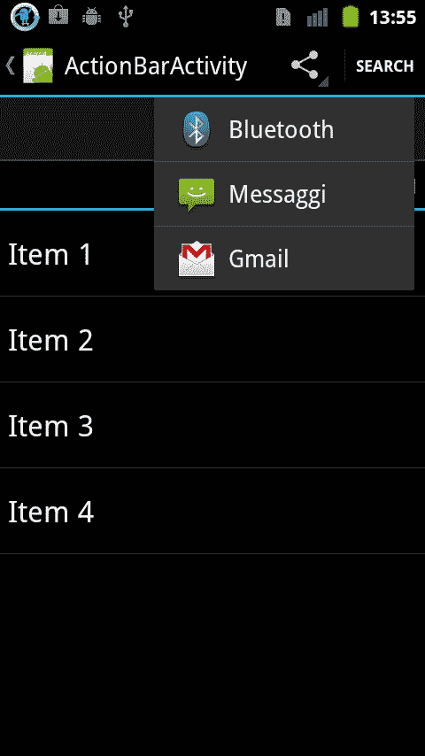

### 上下文操作栏

需要对特定元素进行简单快速的操作，例如列表项(例如，删除联系人)或将一些选定的文本复制到剪贴板，这使得上下文操作栏的使用非常有用。栏的外观会发生变化，以便显示所需操作的特定菜单项。

现在，让我们看看如何向应用添加带有两个操作项的上下文操作栏:

1.  导入所有必要的库:

    ```java
    import com.actionbarsherlock.app.SherlockFragmentActivity;
    import com.actionbarsherlock.view.ActionMode;
    ```

2.  实现`ActionMode`类的`Callback`界面；它将管理上下文菜单的生命周期:

    ```java
    private ActionMode.Callback mActionModeCallback = new ActionMode.Callback() {

        // Called after startActionMode()
        @Override
        public boolean onCreateActionMode(ActionMode mode, Menu menu) {
        // Inflate a menu resource providing context menu items
        MenuInflater inflater = mode.getMenuInflater();
        inflater.inflate(R.menu.context_menu, menu);
        return true;
      }

      // Called each time the action mode is shown. Always called after onCreateActionMode, but
      // may be called multiple times if the mode is invalidated.
      @Override
      public boolean onPrepareActionMode(ActionMode mode, Menu menu) {
        return false; // Return false if nothing is done
      }

      // Called when the user selects a contextual menu item
      @Override
      public boolean onActionItemClicked(ActionMode mode, MenuItem item) {
        switch (item.getItemId()) {
          case R.id.action_1:
          mode.finish(); // Action picked, so close the CAB
          return true;
          default:
          return false;
        }
      }

      // Called when the user exits the action mode
      @Override
      public void onDestroyActionMode(ActionMode mode) {
      }
    };
    ```

3.  将侦听器附加到将激活动作模式的所需元素(在本例中，我们将其附加到列表项上的`click`事件):

    ```java
      getListView().setOnItemClickListener(new AdapterView.OnItemClickListener() {
        @Override
        public void onItemClick(AdapterView<?>parent, View view, int position, long id) {
          if (mActionMode != null) {
            return;
          }

        // Start the CAB using the ActionMode.Callback defined above
        ActionBarActivity.this.startActionMode(mActionModeCallback);
        view.setSelected(true);
        }
      });
    ```

4.  在 XML 文件中，定义上下文菜单布局，如普通菜单:

    ```java
    <?xml version="1.0" encoding="utf-8"?>
    <menu xmlns:android="http://schemas.android.com/apk/res/android">
        <item android:id="@+id/action_1"
              android:title="Action 1" />
        <item android:id="@+id/action_2"
              android:title="Action 2" />
    </menu>
    ```

以下屏幕截图显示了上下文菜单的显示方式:


请记住**确定**按钮(位于栏最左侧的按钮)只是取消上下文动作栏，系统会为您添加它。

这种机制的明显扩展是可以选择多个元素并对其进行操作。这是存在的，它可能从蜂巢开始，使用属于`AbsListView`类的`MultiChoiceModeListener`接口。唯一的问题是它在`ActionBarSherlock`中不可用，所以正如最初的安卓文档所暗示的，最好回到浮动的上下文菜单。

### 视图页面指示器

让我们解释一下如何为您的应用创建更有趣的视觉布局，例如，我们一直看到的一种用户界面模式是安卓市场上使用的“swipey-tab”模式。

这种 UI 模式允许用户在应用的各个部分之间切换，只需向左/向右滑动，并在滑动动作后的选项卡上显示标题(有关这种设计的更多技术信息，我建议您阅读来自安卓市场设计师的帖子，网址为[(http://www . push-pixels . org/2011/08/11/Android-tips-and-ticks-swipey-tab . html](http://www.pushing-pixels.org/2011/08/11/android-tips-and-tricks-swipey-tabs.html))。

为此，我们需要从其项目的网页上下载另一个库，位于[http://viewpagerindicator.com/](http://viewpagerindicator.com/)。

将此库添加到我们的项目中所需的步骤与本节开头所示的步骤相同。只需记住，库的路径是您提取它的地方。

现在，我们准备将`ViewPageIndicator`添加到您的应用中:

1.  导入正确的类:

    ```java
    import com.actionbarsherlock.app.SherlockFragmentActivity;
    import com.actionbarsherlock.app.ActionBar;
    import android.support.v4.view.ViewPager;
    import com.viewpagerindicator.TitlePageIndicator;
    ```

2.  创建一个活动类子类`SherlockFragmentActivity`并实现`TabListener`接口:

    ```java
    public class ActionBarActivity extends SherlockFragmentActivity implements ActionBar.TabListener {
    …
    }
    ```

3.  实现`onCreate()`方法，在这里我们设置布局和配置动作栏；由于我们正在创建一个选项卡驱动的应用，我们必须将`NAVIGATION_MODE_TABS`设置为导航模式:

    ```java
      @Override
      public void onCreate(Bundle savedInstanceState) {
        super.onCreate(savedInstanceState);
        setContentView(R.layout.main);

        ActionBar ab = getSupportActionBar();
        ab.setNavigationMode(ActionBar.NAVIGATION_MODE_TABS);

        ViewPager pager = (ViewPager)findViewById(R.id.pager);
        pager.setAdapter(new TabsAdapter(getSupportFragmentManager()));

        //Bind the title indicator to the adapter
        TitlePageIndicator titleIndicator = (TitlePageIndicator)findViewById(R.id.titles);
        titleIndicator.setViewPager(pager);
      }
    ```

4.  创建一个`FragmentPageAdapter`类的子类，将每个标签绑定到一个特定的片段(这里我们使用了一个名为`DummyFragment`的唯一片段类，没有实现，只是显示了一个简单的文本):

    ```java
      public class TabsAdapter extends FragmentPagerAdapter {
        public TabsAdapter(FragmentManager fm) {
          super(fm);
        }

        @Override
        public Fragment getItem(int position) {
          return new DummyFragment();
        }

        @Override
        public int getCount() {
          return 3;
        }

        @Override
        public CharSequence getPageTitle(int position) {
          return "Page " + position;
        }

      }
    ```

5.  在 Activity 类中实现`TabListener`接口，对标签上将要发生的事件做出反应:

    ```java
      /*
      * TabListener interface's methods
      */
      public void onTabReselected(ActionBar.Tab tab, FragmentTransaction ft) {
      // User selected the already selected tab. Usually do nothing.
      }

      public void onTabUnselected(ActionBar.Tab tab, FragmentTransaction ft) {
      }

      public void onTabSelected(ActionBar.Tab tab, FragmentTransaction ft) {
      }
    ```

6.  用`TitlePageIndicator`定义布局(再次检查用作标签的完全限定名是否正确输入):

    ```java
    <?xml version="1.0" encoding="utf-8"?>
    <LinearLayout xmlns:android="http://schemas.android.com/apk/res/android"
        android:orientation="vertical"
        android:layout_width="fill_parent"
        android:layout_height="fill_parent"
        >
        <com.viewpagerindicator.TitlePageIndicator
            android:id="@+id/titles"
            android:layout_height="wrap_content"
            android:layout_width="fill_parent" />
    <android.support.v4.view.ViewPager
        android:id="@+id/pager"
        android:layout_width="fill_parent"
        android:layout_height="wrap_content"
        />
    </LinearLayout>
    ```

我们得到的是一个应用，其中从`ViewPager`类提供的各种片段被插入，每个标签一个，当标签之间发生转换时，`TitlePagerIndicator`类为我们提供了一个视觉效果。下面的截图显示了选项卡部分在我们的应用中是如何出现的(显然，不可能在纸上显示动画):

