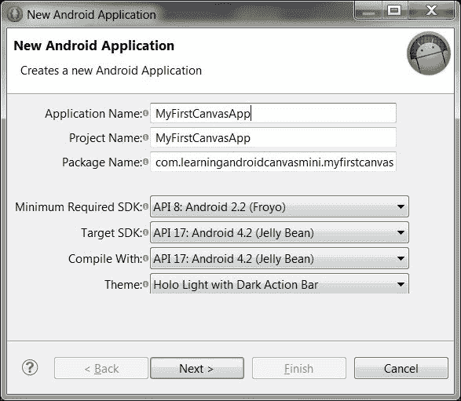
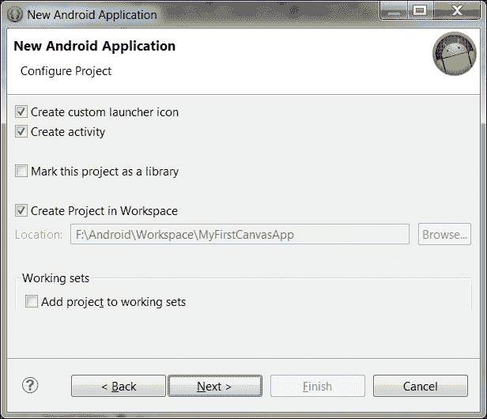
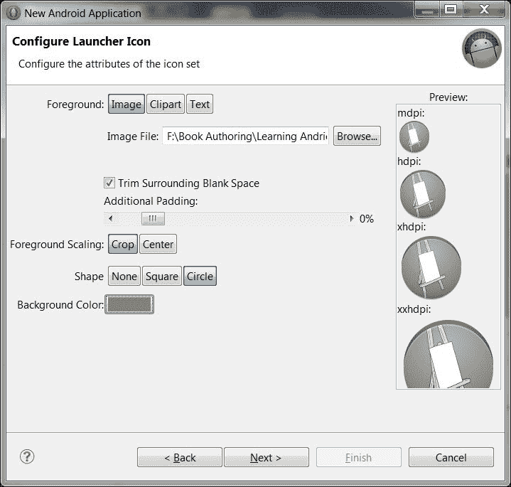
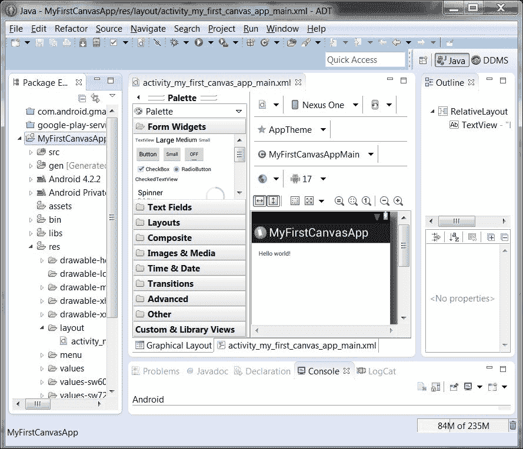
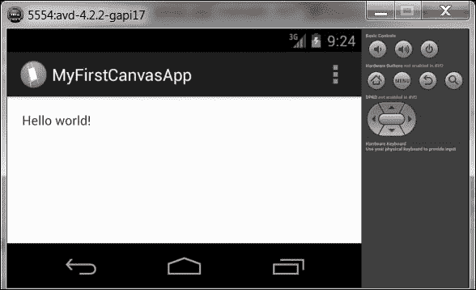
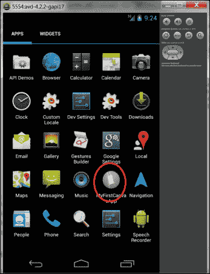
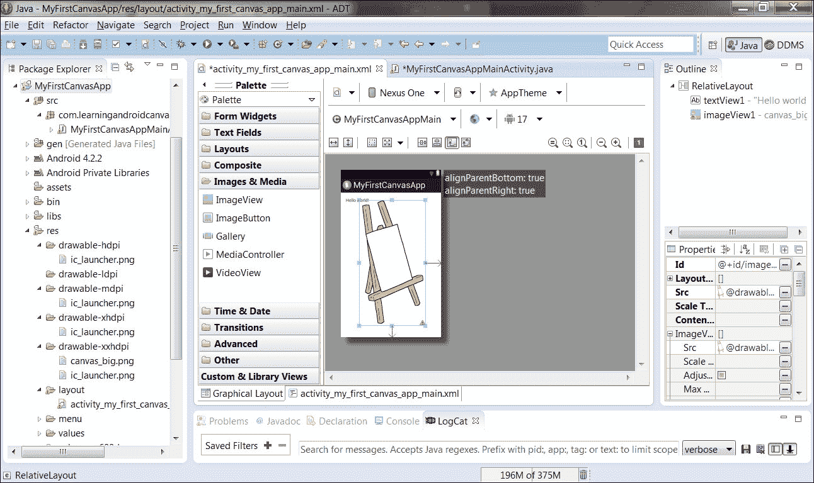
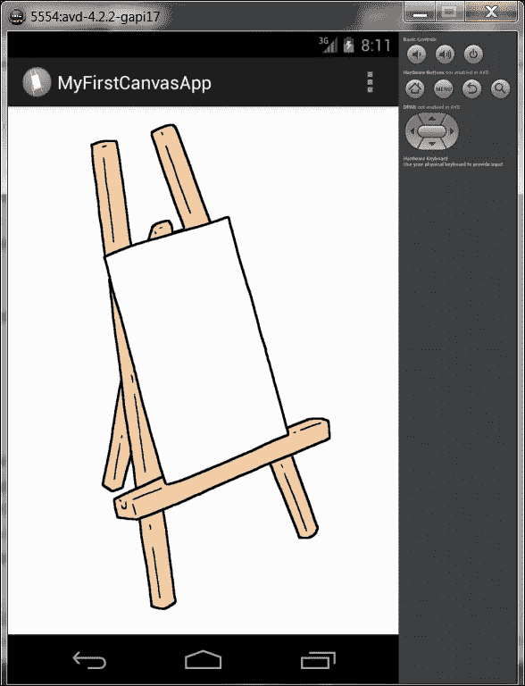

# 第一章。安卓画布入门

在这一章中，我们将学习一些关于安卓画布的知识，为什么我们需要它，以及它提供了什么。我们将创建一个简单的安卓应用，在屏幕上显示图像。我们将在模拟器上测试应用。然后我们将讨论应用的每个部分，以及读者在使用安卓画布时需要了解的事情。到本章结束时，读者将学会创建一个基本的安卓应用，该应用将使用画布提供的简单技术之一和一些附加信息以及处理应用中图形的良好约定来显示图像。

# Android Canvas

安卓画布为开发者提供了创建和修改 2D 图像和形状的能力。此外，画布可以用来创建和渲染我们自己的 2D 对象，因为这个类提供了各种绘制方法。Canvas 还可以用来创建一些基本的动画，例如逐帧动画，或者创建某些`Drawable`对象，例如带有纹理和形状的按钮，例如圆形、椭圆形、正方形、多边形和直线。安卓还提供硬件加速，以提高画布绘制的性能。现在我们知道我们想要开发什么，为什么我们需要了解图形，我们的图形需求是什么，以及我们将使用什么。我们也知道安卓画布是什么，它为我们提供了什么。简而言之，安卓画布是我们所有问题的答案，因为它为我们的图形和一些基本动画提供了完成工作的所有正确成分。对于 3D 图形，安卓提供对 OpenGL 的支持；但是在本书的上下文中，我们将不涉及 3D 图形，因此也不会讨论 OpenGL。不过，感兴趣的读者可以在[上查看详情。](http://developer.android.com/guide/topics/img/opengl.html)

# 我们的第一个安卓画布应用

我们在这一部分的目标是创建一个非常简单的应用，在屏幕上显示一个图像。不要害怕。开始开发 Canvas 似乎还为时过早——确实如此——但我们的第一个应用不会涉及任何编码或任何复杂的东西。我们将经历创建应用的不同步骤。我们将研究 SDK 版本和可用的 API，以及我们将使用什么。您可能不了解应用的某些部分或我们正在执行的步骤，但是在执行每个步骤后，我们将解释该步骤中发生了什么。我们只谈到了这一点；让我们开始一些真正的工作。我们将从打开 Eclipse 并启动一个新的安卓应用项目开始。为此，在 Eclipse 中，我们将导航到**文件** | **新的** | **安卓应用项目**。

下面的截图显示了 Eclipse 中的新应用窗口:

这是出现的第一个屏幕。我们将命名我们的应用`MyFirstCanvasApp`。

## 应用名称

**应用名称**为**设置**中 **管理应用**列表中显示的；如果我们在 **Play Store** 上发布我们的应用，同样的字符串会显示在那里。所以名字要有吸引力，有意义。

## 项目名称

**项目名称** 仅由 Eclipse 使用，但在工作区内应该是唯一的。它可以与应用名称相同。

## 包装名称

**包名** 必须是我们应用的唯一标识符。它不会显示给用户，但在应用的整个生命周期中应该保持不变。包名是帮助识别相同应用的不同版本的东西。我们的套餐名称为`com.learningandroidcanvasmini.myfirstcanvasapp`。这种特定的语法不是定义包名的硬性规则，但它是避免包名冲突的好方法。例如，如果我们有两个同名的应用，如下所示:

*   `com.learningandroidcanvasmini.myfirstcanvasapp`
*   `com.learningandroidcanvasmini.myfirstcancasapp`

假设第一个应用只是一个显示一些图像的简单应用，第二个应用是一个带有手绘的简单绘画应用。如果我们想在谷歌 Play 商店发布它们，将会发生包名冲突，并且不允许发布第二个应用，因为已经有一个应用具有完全相同的名称。有两种解决方案可以避免这种情况。首先，更改包名，使包名没有冲突，第二个应用被视为全新的应用。例如:

*   `com.learningcandroidcanvasmini.picdisplayapp`
*   `com.learningandroidcanvasmini.paintapp`

第二，我们可以保持包名不变，但更改`android:version`代码和`android:version`名称。发布会成功，给人的印象是第一个应用是核心应用(像`myfirstcanvasapp`1.0 版)，第二个应用是同一个 app 的更新版本(像`myfirstcanvasapp`2.0 版)。想了解更多关于在谷歌 Play 商店发布应用的详细信息，请点击[链接。](http://developer.android.com/distribute/googleplay/publish/preparing.html)

## SDK 的最小可能版本

选择一个可能要求较低的 SDK 意味着我们的应用将能够在最大可用设备上运行，但有一个限制，如果我们选择一个非常低的安卓版本，我们将无法使用硬件加速，因为它在较低版本的安卓上不可用。如果我们不需要硬件加速，我们可以选择更低的版本来瞄准更多的设备，但是如果我们使用一些可能需要硬件加速的动画和图形，我们需要使用更高一点的安卓版本。

## 目标 SDK

这是我们的应用将使用的最高 API 级别，但是应用通常是向前兼容的，如果使用的库没有改变，甚至会以高于我们的目标 SDK 的 SDK 级别工作。这是一种罕见的情况，但有时新版本中的一些库会发生变化，这会影响对不同类的不同方法和属性的调用，从而导致应用的功能异常。该属性通知系统，我们已经根据目标应用编程接口测试了应用，系统不应该产生任何兼容性问题。此外，应用将向后兼容，直到最低要求的软件开发工具包。我们将选择最高可用的软件开发工具包，因为我们不希望我们的应用看起来过时，因为较低版本将缺乏一些新功能(例如缺乏硬件加速)。

## 主题

主题是最后一个选项。我们将为此保留默认的选择，因为此时它并不重要。

之后点击**下一步**，出现如下画面。这是**配置项目**屏幕。

以下屏幕截图显示了新应用的配置屏幕:

这里我们将检查我们是否想要一个自定义启动器图标。选择**创建活动**，系统会自动为我们创建一个默认活动。还要配置创建项目的位置；大多数情况下，它在我们的工作区。如果我们选择了**创建自定义启动器图标**复选框，点击**下一步**将带我们进入以下屏幕，图标配置屏幕:

在此屏幕上，我们将配置自定义启动器图标属性，例如它应该读取源图像的路径。我们将配置图标的前景、形状和背景颜色。点击**下一步**进入下一屏。我们从网上随机选择了一张下载的画布图片作为我们的来源。图像为巴布亚新几内亚格式。巴布亚新几内亚图像支持透明度；例如，完全透明的图像或带有一些透明背景的图像。选择**形状**为**圆形**，选择**背景色**为深灰色。其他选择是将**做成方形**或**做成无**。有关图标的更多详细信息，请点击链接[http://developer.android.com/design/style/iconography.html](http://developer.android.com/design/style/iconography.html)。

表格右侧显示不同大小的图像，每张图像的顶部分别写有 **mdpi** 、 **hdpi** 、 **xhdpi** 、**xh dpi**；`dpi`为每英寸点数，`m`为中，`h`为高。这些是不同屏幕尺寸下我们图像的不同尺寸。安卓设备有不同的屏幕尺寸和分辨率。如果我们希望我们的应用支持多种屏幕尺寸，从旧设备到新设备，我们应该收集一些关于它们的 dpi、屏幕尺寸、屏幕分辨率、屏幕密度等信息；当我们在这里处理图形时，我们应该了解它们。然而，我们将在本章的最后谈到这一点。

以下屏幕截图显示了选择默认活动屏幕:

在此表单上，向导为我们提供了创建应用的选项，包括**空白活动**、**全屏活动**或**主/详细流程**活动表单。我们将通过选择**空白活动**并点击**下一步**来继续空白活动。现在，向导将带我们进入以下表单，即默认活动表单:

在这个表单上，我们将我们的活动命名为`MyFirstCanvasAppMainActivity`。**布局名称**将自动为我们填充，**导航类型**应选择为**无**，因为此时我们对应用中的任何导航复杂情况不感兴趣。

点击**完成**将关闭向导，我们将回到 Eclipse，屏幕如下图所示，显示了我们在**设计**模式下的应用。下面的截图显示了向导成功完成执行后我们项目的第一个 Eclipse 视图:

这里我们将创建一个**安卓虚拟设备** ( **AVD** )和我们的模拟器从 AVD 管理器与目标 SDK 版本的配置。4.2.2 测试我们的应用。为此，我们将在默认情况下出现在左侧的**包浏览器**面板中右键单击我们的项目。从出现的菜单中，我们将导航至**运行方式** | **运行配置**。在这个窗口中，我们将在**安卓**选项卡中选择我们的项目。然后我们将导航到**目标**选项卡，并选择我们之前创建的 AVD 来测试我们的应用，然后单击**运行**。这将触发模拟器运行，我们的应用将显示在模拟器中，如下图所示。

如果我们单击模拟器上的 Home 键，然后单击菜单查看模拟器上安装的所有应用，我们将看到我们的自定义启动器图标也出现在菜单中，如下图所示。为了给我们的应用留下良好的印象，我们必须为我们设计一个有吸引力的、相关的图标。为此，可以使用 Photoshop 或任何其他图形设计工具。如果开发人员拥有一个实际的设备，并且该设备是为在 Eclipse 中进行测试而配置的，则可以跳过这一步。

下面截图显示的是第一个带有 **Hello world 的默认活动！**显示:

下面的截图显示了我们的应用图标在第四行从顶部:

现在我们已经启动并运行了第一个应用，我们将尝试在 Eclipse 中理解项目中最重要的部分。在了解了重要的部分之后，我们将达到我们的目标；即在屏幕上显示图像。

# 挖掘我们的第一个应用

首先，在每个安卓应用中，有三个文件需要我们特别注意；如果不了解这三个文件，我们将无法为 Android 开发应用。下面几节将讨论这些文件。

## 配置文件

每个安卓应用中主要的配置文件是`AndroidManifest.xml`。这是一个 XML 文件，可以在**包浏览器**中的项目的根级别看到。这是我们应用的主要配置文件，也是我们项目最重要的文件之一。该文件包含包或我们的应用的信息、我们的应用使用的最小和最大 SDK、我们的应用中使用的活动以及我们的应用运行或执行某些特定任务所需的权限。每当一个应用即将安装在安卓设备上时，这个文件会为系统提供该应用所需的资源权限以及其中使用的活动的所有详细信息。读完这个文件后，系统知道这个应用的包名，兼容的 SDK 是什么，应用包含什么活动，以及应用运行或执行某些任务需要什么权限。

## 布局文件

我们应用中的布局文件是`activity_my_first_canvas_app_main.xml`，位于`res`文件夹内的`layout`文件夹中。所以完整的路径是**包浏览器**中我们项目的`res/layout/activity_my_first_canvas_app_main.xml`。这是一个 XML 文件，它负责我们的活动布局以及在我们的应用中出现在活动上的视图。其他活动可以使用相同的 XML 格式和相同的 XML 布局文件进行布局。

## 代码文件

我们应用中主要的活动代码文件是`MyFirstCanvasAppMainActivity.java`。这是我们活动的编码文件，我们在其中编码所有我们的功能。该文件位于我们项目的包文件夹中；也就是在`src`文件夹里面，所以**包浏览器**里面的项目里面的路径就变成了`src/com.learningandroidcanvasmini.myfirstcanvasapp/MyFirstCanvasAppMainActivity.java`。

下面的截图显示得很清楚:

除了前面的文件，我们将讨论`res`文件夹。`res`文件夹包含以下`Drawable`文件夹:

*   `drawable-hdpi`
*   `drawable-ldpi`
*   `drawable-mdpi`
*   `drawable-xhdpi`
*   `drawable-xxhdpi`

下面的截图显示了我们的`res`文件夹中的`drawable-xxhdpi`文件夹。这是我们的图标放置的地方。

如果我们检查所有这些文件夹，我们会发现每个文件夹都包含一个名为`ic_launcher.png`的图像，这实际上是我们在创建应用时使用的画布图像。每个文件夹中的图像都相同，但大小不同。现在假设我们希望原始的画布图像显示在屏幕上。我们会将原始画布图像复制到这些文件夹中的一个；假设我们将图像复制到`drawable-xhdpi`文件夹。刷新包浏览器中的文件夹，然后转到显示 **Hello world** 字符串的活动的**设计**视图。选择字符串并将其删除。在调色板中，点击**图像&媒体**将其展开。将图像视图拖放到**设计**视图中的活动上。对话框将提示我们选择 ImageView 的源图像。

下面的截图显示了一个对话框，提示我们为我们在**设计**模式下拖放到活动中的 ImageView 选择源图像:

我们将选择我们的画布图像并点击**确定**。我们的画布图像将出现在屏幕上。

以下屏幕显示了在**设计**模式下出现在屏幕上的图像:

我们将运行应用。下面是我们将在模拟器上看到的内容——我们的应用，图像绘制在使用画布的 ImageView 上:

这是我们需要非常小心的事情:当我们在`res`文件夹中保存图像文件时，我们需要小心地重命名我们的图像文件。尽管图像文件名在这个项目之外可能没有任何作用，但是在 Eclipse 中，如果出现以下错误之一，图像文件名将会给您带来错误:

*   Filenames containing spaces; for example, `our canvas.png`:

    这将返回一个错误，并且不会显示在项目文件的“包资源管理器”窗格中。包含除`_`和`.`以外的特殊字符的文件名；例如，`our-canvas(1).png`也会返回一个错误。

    以下屏幕截图显示了将显示的错误:

    

*   不以字母字符开头的文件名；例如`886_1_Canvas.png`。这将返回一个错误。

命名图像文件的最佳惯例是从字母字符开始；之后可以包括数字。特殊字符中只使用`_`和`.`；例如，`our_canvas_1.png`。这个文件名将被接受，我们将能够在我们的应用中使用这个图像。

我们现在已经完成了这一章的目标，但是如果我们不想在不同的屏幕尺寸和分辨率上对我们的应用的图形有任何问题，我们需要了解更多的事情。如果我们希望我们的应用支持多个屏幕，我们需要了解以下内容:

*   **屏幕尺寸**:这个是物理屏幕尺寸，通常以对角线英寸为单位。安卓系统有四组显示器:小型、普通、大型和超大。
*   **屏幕密度**:这是 dpi(每英寸点数)。这些是物理区域上的像素数量。这意味着 3 英寸高密度屏幕的像素将比 6 英寸低密度屏幕多。较低的 dpi 表示低密度屏幕，较高的 dpi 表示高密度屏幕。安卓有四组密度:低、中、高、超高。这就是`ldpi`、`hdpi`、`mdpi`、`xhdpi`进来的地方。有关屏幕尺寸和密度的更多详细信息，请点击此链接:[http://developer . Android . com/guide/practices/screens _ support . html](http://developer.android.com/guide/practices/screens_support.html)。
*   **方位**:这是屏幕的方位。这不是肖像就是风景。我们需要注意这一点，因为不同的设备以不同的模式运行，并且用户可以在运行时更改方向。因此，如果我们只为其中一个进行设计，我们必须锁定屏幕的方向。然后，即使用户旋转屏幕，我们的用户界面的图形也保持不变。最好为两个方向设计布局和图形。

# 总结

在本章中，我们学习了以下内容:

*   了解安卓画布的需求
*   安卓画布是什么，它为我们提供了什么
*   创建一个简单而基本的应用，在屏幕上显示图像
*   理解我们第一个应用的重要文件和部分
*   关于屏幕尺寸、密度和方向的一些附加信息

本章结束时，读者将了解在安卓系统中使用图形的基本知识。读者将能够创建一个简单的应用，在屏幕上显示图像，并对项目的不同部分有一个基本的了解。他/她还将获得关于将哪个文件用于什么目的以及在哪里找到它的知识。读者还将获得屏幕和密度的一些基本知识；因此，当在应用中设计和使用图形时，读者将使用这些信息来对设计应用的用户界面做出更好的决定。

在下一章中，我们将讨论线程、它们的重要性、它们如何用于画布中的绘制，以及我们的应用在使用线程时的性能权衡。