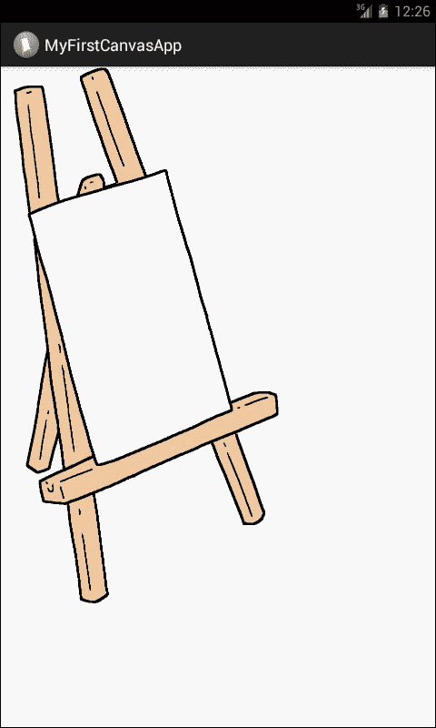

# 三、安卓画布中的绘图和绘图工具

在本章中，我们的目标是了解以下内容:

*   在画布上绘画
*   在视图上绘制
*   在表面视图上绘图
*   可抽的
*   可从资源图像中提取
*   可从资源 XML 中提取
*   可绘制形状

安卓为我们提供了 2D 绘图应用编程接口，使我们能够在画布上绘制自定义绘图。当使用 2D 绘图时，我们要么在视图上绘制，要么直接在表面或画布上绘制。对于我们的图形使用视图，绘图由系统正常的视图层次绘图过程处理。我们只定义要插入视图的图形；其余的由系统自动完成。在使用直接在画布上绘制的方法时，我们必须手动调用合适的绘制画布方法，如`onDraw()`或`createBitmap()`。这种方法需要更多的努力和编码，有点复杂，但是我们已经控制了一切，比如动画和其他一切，比如控制绘图的大小和位置以及颜色，以及通过代码将绘图从当前位置移动到另一个位置的能力。在视图部分的图中可以看到`onDraw()`方法的实现，在画布部分的*图中显示了`createBitmap()`的代码。*

如果我们正在处理静态图形(静态图形在应用执行期间不会动态变化)，或者如果我们正在处理不需要资源的图形，因为我们不希望将应用的性能置于危险之中，那么我们将使用 View 方法上的绘图。在视图上绘图可用于设计引人注目的简单应用，这些应用具有静态图形和简单的功能—简单而有吸引力的背景和按钮。使用主用户界面线程在视图上绘制是完全可以的，因为这些图形不会威胁到我们应用的整体性能。

当处理像游戏中那样动态变化的重图形时，应该使用画布上的绘图方法。在这种情况下，画布会不断地重新绘制自己，以保持图形的更新。我们可以使用主 UI 线程在 Canvas 上进行绘制，但是正如我们在[第 2 章](2.html "Chapter 2. Drawing Threads")、*绘制线程*中尽可能详细地讨论的那样，当处理繁重的、需要资源的、动态变化的图形时，应用会不断地重新绘制自己。最好用单独的线程来绘制这些图形。将这样的图形保留在主 UI 线程上，不会让它们进入无响应模式，经过这么努力，我们肯定不会喜欢这样。所以这个选择要非常慎重。

# 在画布上绘画

画布是一个界面，一个使我们能够实际访问表面的媒介，我们将使用它来绘制我们的图形。画布包含了绘制图形所需的所有必要的绘制方法。在画布上绘图的实际内部机制是，每当任何东西需要在画布上绘制时，它实际上是在底层空白位图图像上绘制的。默认情况下，这个位图是自动提供给我们的。但是如果我们想要使用一个新的 Canvas，那么我们需要创建一个新的位图图像，然后创建一个新的 Canvas 对象，同时将已经创建的位图提供给 Canvas 类的构造函数。示例代码解释如下。最初，位图是绘制的，但不是在屏幕上；它实际上是在内部画布的背景中绘制的。但是要把它带到前面，我们需要创建一个新的 Canvas 对象，并向它提供已经创建的位图，以便在屏幕上绘制。

```java
Bitmap ourNewBitmap = Bitmap.CreateBitmap(100,100,Bitmap.Config.ARGB_8888);
Canvas ourNewCanvas = new Canvas(ourNewBitmap);
```

## 绘制视图

如果我们的应用不需要大量系统资源或快速帧速率，我们应该使用`View.onDraw()`。在这种情况下，好处是系统会自动给画布它的底层位图。我们所需要的只是进行绘图调用并完成我们的绘图。

我们将通过从`View`类扩展来创建我们的类，并将在其中定义`onDraw()`方法。`onDraw()`方法是我们在画布上定义我们想要画的任何东西。安卓框架会调用`onDraw()`方法，让我们的 View 自己绘制。

`onDraw()`方法将由安卓框架根据需要调用；例如，每当我们的应用想要绘制自己时，就会调用这个方法。每当我们想要我们的视图重绘自己的时候，我们必须调用`invalidate()`方法。这意味着，每当我们想要重新绘制应用的视图时，我们将调用`invalidate()`方法，安卓框架将为我们调用`onDraw()`方法。假设我们想画一条线，那么代码应该是这样的:

```java
class DrawView extends View {
  Paint paint = new Paint();
  public DrawView(Context context) {
    super(context);
    paint.setColor(Color.BLUE);
  }
  @Override
  public void onDraw(Canvas canvas) {
    super.onDraw(canvas);
    canvas.drawLine(10, 10, 90, 10, paint);
  }
}
```

在`onDraw()`方法中，我们将使用画布类提供的各种工具，例如画布类提供的不同绘制方法。我们也可以使用其他类的绘图方法。一旦我们的`onDraw()`方法完成了所有我们想要的功能，安卓框架就会在画布上为我们绘制一个位图。如果我们使用主 UI 线程，我们将调用`invalidate()`方法，但是如果我们使用另一个线程，那么我们将调用`postInvalidate()`方法。

## 绘制表面视图

`View`类提供了一个子类`SurfaceView`，它在视图的层次结构中提供了一个专用的绘图表面。目标是使用一个辅助线程进行绘制，这样应用就不会等待资源释放并准备重绘。辅助线程可以访问`SurfaceView`对象，该对象能够以自己的重绘频率在自己的画布上绘制。

我们将从创建一个扩展`SurfaceView`类的类开始。我们应该实现一个接口`SurfaceHolder.Callback`。这个界面很重要，因为当一个表面被创建、修改或破坏时，它会为我们提供信息。当我们及时获得关于曲面的创建、更改或破坏的信息时，我们可以更好地决定何时开始绘制以及何时停止。在画布上执行所有绘图的辅助线程类也可以在`SurfaceView`类中定义。

要获取信息，`Surface`对象要通过`SurfaceHolder`处理，不能直接处理。为此，我们将在初始化 `SurfaceView`时通过调用`getHolder()`方法来获取 Holder。然后我们将告诉`SurfaceHolder`对象我们想要接收所有的回调；为此，我们将称之为`addCallBacks()`。之后，我们将覆盖`SurfaceView`类中的所有方法，根据我们的功能完成我们的工作。

下一步是从第二个线程内部绘制表面的画布；为此，我们将把我们的`SurfaceHandler`对象传递给线程对象，并使用`lockCanvas()`方法获得画布。这将为我们获得画布，并将其锁定为仅来自当前线程的绘图。我们需要这样做，因为我们不想要一个打开的画布，可以用另一根线来画；如果是这种情况，它会扰乱我们在 Canvas 上的所有图形和绘图。当我们完成在画布上绘制图形时，我们将通过调用`unlockCanvasAndPost()`方法解锁画布，并将传递我们的画布对象。要成功绘图，我们需要反复重绘；所以我们将根据需要重复这种锁定和解锁，表面将绘制画布。

要有一个均匀平滑的图形动画，我们需要有 Canvas 的前一个状态；所以我们每次都会从`SurfaceHolder`对象中检索 Canvas，每次都要重绘整个表面。例如，如果我们不这样做，不绘制整个表面，来自先前画布的绘图将持续存在，这将破坏我们图形密集型应用的整体外观。

示例代码如下:

```java
class OurGameView extends SurfaceView implements SurfaceHolder.Callback {
  Thread thread = null;
  SurfaceHolder surfaceHolder;
  volatile boolean running = false;
  public void OurGameView (Context context) {
    super(context);
    surfaceHolder = getHolder();
  }

  public void onResumeOurGameView (){
    running = true;
    thread = new Thread(this);
    thread.start();
  }
    public void onPauseOurGameView(){
  boolean retry = true;
  running = false;
  while(retry){
    thread.join();
    retry = false;
  }

  public void run() {
  while(running){
    if(surfaceHolder.getSurface().isValid()){
      Canvas canvas = surfaceHolder.lockCanvas();
    //... actual drawing on canvas
      surfaceHolder.unlockCanvasAndPost(canvas);
      }
    }
  }
}
```

## 可抽

安卓提供的二维图形绘制库叫做**可绘制**。确切的包名是`android.graphics.drawable`。这个包提供了绘制 2D 图形的所有必要的类。

一般来说，可绘制是对可以绘制的事物的抽象。安卓提供了许多类，扩展了`Drawable`类来定义特殊类型的可绘制图形。完整列表可在[http://developer . Android . com/reference/Android/img/drawing able/package-summary . html](http://developer.android.com/reference/android/img/drawable/package-summary.html)上找到。

可绘制对象可以通过三种方式定义和实例化:

*   来自保存在我们项目的`resource`文件夹中的图像
*   从一个 XML 文件
*   从正常的类构造函数

在本书的上下文中，我们将只解释前两种方法。

## 可从资源图像中提取

这是将图形添加到我们的应用中最快最简单的方法。我们已经解释了我们项目的不同重要文件夹，并在[第 1 章](1.html "Chapter 1. Getting Started with Android Canvas")、*安卓画布入门*中详细讨论了哪个文件夹包含什么类型的文件。本章结束时，我们将知道如何将图像复制到`resource`文件夹，以及在哪里可以找到`resource`文件夹。

我们将在[第 1 章](1.html "Chapter 1. Getting Started with Android Canvas")、*安卓画布入门*中的应用项目中使用我们已经在`res/drawable`文件夹中复制的图像。图片名称为`lacm_5396_01_14.png`，准确位置为`res/drawable-xhdpi`。这里重要的一点是，支持的格式是 PNG、JPEG 和 GIF。最可取的格式是 PNG，最不可取的是 GIF。每当我们在`res/drawable`文件夹中放入一张图片，在构建过程中，会对图片进行无损压缩，以节省系统内存；这个过程是自动的。压缩图像通常保持相同的质量，但尺寸要小得多。如果我们不希望系统压缩我们的图像，我们应该将我们的图像复制到`res/raw`文件夹。

我们将使用[第 1 章](1.html "Chapter 1. Getting Started with Android Canvas")、*安卓画布入门*中的相同应用源代码来解释本章的这一部分。我们将开启我们的项目`MyFirstCanvasApp`。这是我们进行任何更改之前的代码:

```java
package com.learningandroidcanvasmini.myfirstcanvasapp;
import android.os.Bundle;
import android.app.Activity;
import android.view.Menu;
public class MyFirstCanvasAppMainActivity extends Activity {
  @Override
  protected void onCreate(Bundle savedInstanceState) {
    super.onCreate(savedInstanceState);
    setContentView(R.layout.activity_my_first_canvas_app_main);
  }
  @Override
  public boolean onCreateOptionsMenu(Menu menu) {
    // Inflate the menu; this adds items to the action bar if it //is present.
    getMenuInflater().inflate(R.menu.my_first_canvas_app_main,menu);
    return true;
  }
}
```

我们将在**设计**视图中打开布局文件`activity_my_first_canvas_app_main.xml`。我们将从我们在[第 1 章](1.html "Chapter 1. Getting Started with Android Canvas")、*安卓画布*中添加的活动中删除已经放置的**图像视图**对象。现在我们将再次打开我们的代码文件，并将下面的代码行逐步添加到前面的代码中。在我们的主活动类中，我们将定义一个`LinearLayout`对象:

```java
LinearLayout myLinearLayout;
```

这将是我们的自定义布局，我们希望使用此代码在其上显示我们的图像。然后，在我们的主活动类中，我们将实例化`LinearLayout`对象:

```java
myLinearLayout = new LinearLayout(this);
```

接下来，我们将向文件中添加以下代码行:

```java
ImageView MySecondImageView = new ImageView(this);
MySecondImageView.setImageResource(R.drawable.lacm_5396_01_14);
MySecondImageView.setAdjustViewBounds(true);
MySecondImageView.setLayoutParams(new ImageView.LayoutParams(LayoutParams.WRAP_CONTENT, LayoutParams.WRAP_CONTENT));
myLinearLayout.addView(MySecondImageView);
setContentView(myLinearLayout);
```

在前面的代码块中，首先，我们定义了一个`ImageView`对象。然后我们将源设置为我们希望我们的`ImageView`对象显示的图像。在下一行中，我们调整了视图边界，使`ImageView`边界与源图像的宽度和高度相匹配。`setLayoutParams`方法将帮助我们将视图边框环绕在图像内容周围，即使尺寸有差异。之后，我们将使用代码行向自定义布局提供我们的`ImageView`控件:

```java
myLinearLayout.addView(MySecondImageView);
```

在最后一行，我们将活动布局设置为自定义布局。为此，我们将内容视图设置为自定义布局:

```java
setContentView(myLinearLayout);
```

现在，我们将在模拟器中测试我们的应用，然后我们将在模拟器屏幕上看到以下内容:



如果我们将活动屏幕上的输出图像与我们在[第 1 章](1.html "Chapter 1. Getting Started with Android Canvas")、*安卓画布入门*中看到的图像进行比较，我们看到的没有太大差异。我们在[第 1 章](1.html "Chapter 1. Getting Started with Android Canvas")、*安卓画布*入门中实现了同样的输出，非常轻松。那么，为什么我们在本章中经历了所有这些复杂的编码来实现相同的输出呢？

我们经历了所有艰苦的工作和复杂的代码，因为在[第 1 章](1.html "Chapter 1. Getting Started with Android Canvas")、*安卓画布入门*中，我们对`ImageView`对象进行了硬编码，以仅显示我们在**设计**视图的**属性**选项卡中定义的一个图像。现在，当我们在**设计**视图中从屏幕上删除`ImageView`对象并开始编码时，**设计**视图中的屏幕上当时什么都没有。我们在前面的例子中所做的是创建我们自己的自定义布局，它将承载我们的图形和绘图。我们创建了一个`ImageView`对象，为它提供了一个源图像，并设置了它的其他属性。稍后，我们将`ImageView`对象添加到我们的自定义布局中，最后，我们要求活动出现在屏幕上，没有自定义布局和自动布局。该代码为我们提供了保持图形应用动态性的灵活性。我们可以向应用提供由代码逻辑控制的运行时图像。

完整的代码现在如下所示:

```java
package com.learningandroidcanvasmini.myfirstcanvasapp;
import android.os.Bundle;
import android.app.Activity;
import android.view.Menu;
import android.widget.ImageView;
import android.widget.LinearLayout;

public class MyFirstCanvasAppMainActivity extends Activity {
  LinearLayout myLinearLayout;  
  @Override
  protected void onCreate(Bundle savedInstanceState) {
    super.onCreate(savedInstanceState);
    setContentView(R.layout.activity_my_first_canvas_app_main);
  myLinearLayout = new LinearLayout(this);
  ImageView MySecondImageView = new ImageView(this);
  MySecondImageView.setImageResource(R.drawable.lacm_5396_01_14);
  MySecondImageView.setAdjustViewBounds(true);
  MySecondImageView.setLayoutParams(new ImageView.LayoutParams(LayoutParams.WRAP_CONTENT, LayoutParams.WRAP_CONTENT));
  myLinearLayout.addView(MySecondImageView);
  setContentView(myLinearLayout);  
  }
  @Override
  public boolean onCreateOptionsMenu(Menu menu) {
    // Inflate the menu; this adds items to the action bar if it //is present.
    getMenuInflater().inflate(R.menu.my_first_canvas_app_main, menu);
    return true;
  }

}
```

如果我们希望我们的资源图像被处理为可绘制的，我们将从我们的资源图像创建一个`Drawable`对象:

```java
Resources myRes = mContext.getResources();
Drawable myImage = myRes.getDrawable(R.drawable.5396_01_14);
```

在这里，我们需要明白，我们`Resources`对象中的每个资源一次只能维护一个状态。如果我们在两个不同的实例中使用相同的资源映像，并且我们更新了一个实例的属性，那么第二个实例中的映像也将反映这一变化。因此，每当我们处理我们的`Drawable`对象的多个实例时，我们可以创建一个补间动画，而不是改变可绘制对象本身。

## 可从资源 XML 中提取

对于那些有一点安卓开发背景的开发者来说，要知道我们应用中的每一个活动都有一个 XML 布局文件。在这个文件中，我们在活动上拖放的每个视图或控件都定义了一个 XML 标记。因此，我们假设正在阅读这本书的开发人员在为安卓系统开发时知道用户界面是如何工作的。对象可以用 XML 定义和初始化。如果我们处理的图形的属性不取决于我们计划在代码中做什么，或者图形是静态的，那么用 XML 定义图形对象是一个好方法。一旦图形被实例化，它的属性总是可以根据需要进行调整。

我们将文件保存在`res/drawable`中，用 XML 定义 Drawable，通过调用`Resouces.getDrawable()`得到 Drawable。这个方法将从我们的 XML 文件中获取资源标识作为参数。

为了举例说明，并理解哪个 Drawable 可以使用这个方法，以及我们如何查看应用中自动创建的菜单，请注意前面代码`onCreateOptionMenu()`中的方法。当我们点击屏幕上的**菜单**按钮或从硬件键中，我们看到屏幕底部有一个小菜单，名为**设置**。此时菜单没有功能。现在如果我们检查`onCreateOptionMenu()`的代码，我们会看到对`inflate()` 方法的调用。我们可以在 XML 中定义任何支持`inflate()`方法的 Drawable。前面提到的菜单就是一个简单的例子。

**设置**菜单如下图所示:


假设我们想要进行可绘制的展开-折叠过渡；下面的代码将用 XML 为我们完成这项工作。该 XML 代码将保存在`res/drawable expand_collapse.xml`文件中。

```java
<transition 
xmlns:android="http://schemas.android.com/apk/res/android">
  <item android:drawable="@drawable/image_expand">
    <item android:drawable="@drawable/image_collapse">
      </transition>

```

`expand`和`collapse`文件是保存在我们项目的`drawable`文件夹中的两个不同的图像。现在，为了让这个转换正常工作，我们需要以下代码:

```java
Resources myRes = mContext.getResources();
TransitionDrawable myTransition = (TransitionDrawable)
  res.getDrawable(R.drawable.expand_collapse);
ImageView myImage = (ImageView) findViewById(R.id.toggle_image);
  myImage.setImageDrawable(myTransition);

```

首先，我们从资源中创建了一个`resources`对象，并要求该对象从这些资源中获取所有内容(资源是我们保存在项目中`res`文件夹的子文件夹中的所有图像和 XML 文件)。然后，我们创建了一个`TransitionDrawable`对象，并要求该对象从`res/drawable`文件夹中获取`expand_collapse`文件。之后，我们将创建一个`ImageView`对象，该对象将获得另一个名为`toggle_image`的视图。在前面代码的最后一行，我们将可绘制类型设置为已经创建的转换。

现在包括下面一行代码将以每秒一次的速度运行转换:

```java
myTransition.startTransition(1000);
```

由于动画本身是一个非常冗长的话题，因此我们不会对这些过渡和动画进行过多的详细描述。但是我可以解释一些关键类型的动画，可以在安卓系统中使用图形来让读者了解这个领域和动画涵盖的内容。Android 中动画的类型如下:

*   属性动画
*   观看动画
*   可绘制的动画

# 可绘制形状

每当我们想要在画布上动态或编程地绘制某些形状时，形状可绘制工具就派上了用场。使用形状可绘制，我们可以绘制圆形和所有形式的圆形，如椭圆形、正方形、矩形和许多其他形状。为了解释形状可绘制，我们将像在[第 1 章](1.html "Chapter 1. Getting Started with Android Canvas")、*安卓画布*中一样开始一个新项目。我们将命名我们的项目`MyShapeDrawablesApp`，并使用一个空白的开始活动进行与第一章相同的步骤。我们这个练习的目的是在屏幕上画一个椭圆形，里面填充一些颜色。

1.  为此，我们将在主活动类的末尾括号前添加另一个类。我们将命名我们的类`MyCustomDrawableView`，它将扩展`View`类。

    ```java
    public class MyCustomDrawableView extends View {.....
    ```

2.  在这个类的构造函数中，我们将定义我们的绘图。我们将定义一个`ShapeDrawable`对象，并将`OvalShape()`方法提供给它的构造器，作为定义形状类型的参数:

    ```java
    myDrawable = new ShapeDrawable(new OvalShape());
    ```

3.  接下来，我们将获取绘制对象并为我们的`ShapeDrawable`对象设置颜色:

    ```java
    myDrawable.getPaint().setColor(0xff74fA23);
    ```

4.  之后，我们将定义要绘制的对象的尺寸。假设我们想画一个椭圆形。第一个`x, y`是它开始的点，下一个是椭圆的宽度和高度，如图所示:

    ```java
    myDrawable.setBounds(x, y, x + width, y + height);
    ```

5.  此时我们将关闭构造函数，并为我们的对象定义`onDraw()`方法。在这个方法里面，我们将把`draw()`方法称为我们的对象。

    ```java
    protected void onDraw(Canvas canvas) {
      myDrawable.draw(canvas);
    }
    ```

6.  下一步将在主活动类中创建一个自定义类的对象，并将内容视图设置为新的自定义类:

    ```java
    MyCustomDrawableView myCustomDrawableView;
    .
    .
    .
    myCustomDrawableView = new MyCustomDrawableView(this);

      setContentView(myCustomDrawableView);
    ```

7.  我们将在模拟器中运行应用。
8.  The following screenshot shows a green oval drawn on the Canvas:

    

`MyShapeDrawablesMainActivity.java`文件的完整代码如下:

```java
package com.learningandroidcanvasmini.myshapedrawablesapp;
import android.os.Bundle;
import android.app.Activity;
import android.content.Context;
import android.graphics.Canvas;
import android.graphics.drawable.ShapeDrawable;
import android.graphics.drawable.shapes.OvalShape;
import android.view.Menu;
import android.view.View;

public class MyShapeDrawablesMainActivity extends Activity {
  MyCustomDrawableView myCustomDrawableView;

  @Override
  protected void onCreate(Bundle savedInstanceState) {
    super.onCreate(savedInstanceState);
    setContentView(R.layout.activity_my_shape_drawables_main);

    myCustomDrawableView = new MyCustomDrawableView(this);
      setContentView(myCustomDrawableView);
  }
  @Override
  public boolean onCreateOptionsMenu(Menu menu) {
    // Inflate the menu; this adds items to the action bar if it is 
    //present.
    getMenuInflater().inflate(R.menu.my_shape_drawables_main, menu);
    return true;
  }

  public class MyCustomDrawableView extends View {
    private ShapeDrawable myDrawable;

    public MyCustomDrawableView(Context context) {
      super(context);

      int x = 10;
      int y = 10;
      int width = 300;
      int height = 50;

      myDrawable = new ShapeDrawable(new OvalShape());
      myDrawable.getPaint().setColor(0xff74fA23);
      myDrawable.setBounds(x, y, x + width, y + height);
    }

    protected void onDraw(Canvas canvas) {
      myDrawable.draw(canvas);
    }
  }

}
```

# 总结

在这一章中，我们已经学习了`Canvas`类，它的方法，属性，以及我们如何使用它们来绘制。我们还学习了`View`和`SurfaceView`课程，并学习了如何使用这两个课程以及在哪个场景中使用哪一个。我们还了解了 Drawables 以及使用它们进行绘制的一些不同方式，例如从资源中的图像或从资源中的 XML 代码，以及使用代码绘制形状。我们还看到了一个使用形状可绘制和在画布上绘制的功能示例。这两个示例应用的源代码都可以从*打包发布*网站下载。在下一章中，我们将详细讨论 9 补丁(也称为 NinePatch)映像。我们将使用 9 补丁图像开发一个工作应用，并将讨论它在设计我们的移动应用布局中的重要性。