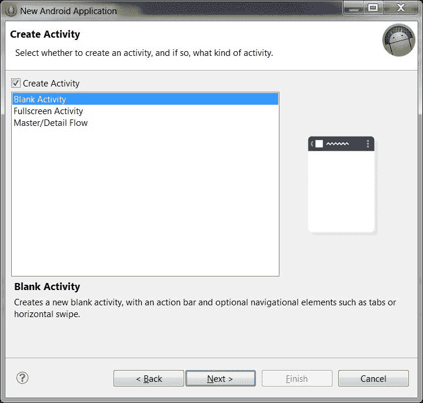
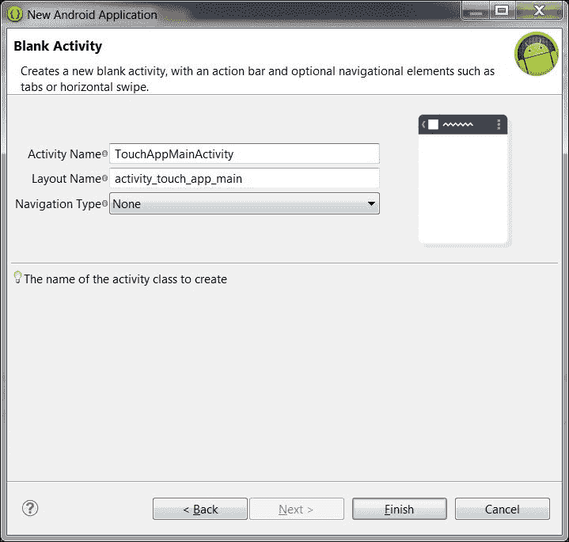
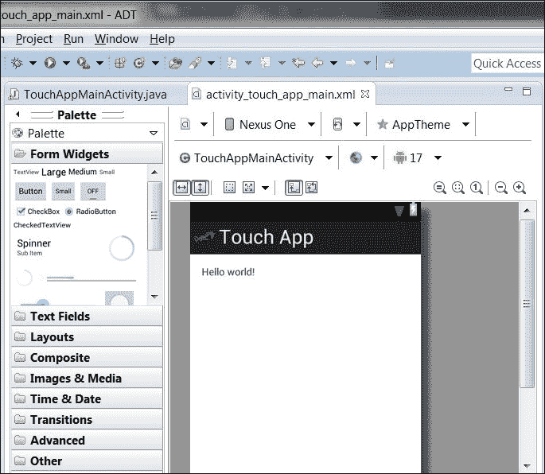
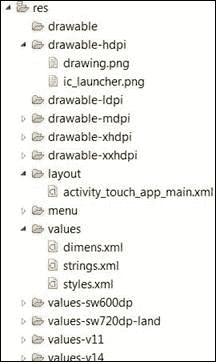
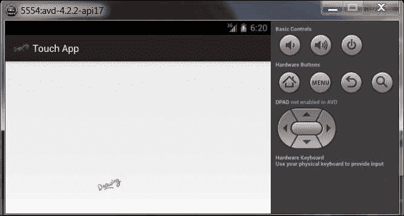

# 第五章。触摸事件和在画布上绘图

在本章中，我们将了解如何与应用交互，捕捉触摸事件并响应这些触摸事件在画布上呈现图形。为了实现这个目标，我们将开发一个非常简单的安卓应用，屏幕上显示一个图像。该应用的核心功能是，当我们点击或触摸图像并沿屏幕拖动时，图像会用手指从其当前位置拖动。当我们放开触摸，将手指从屏幕上抬起时，图像停止移动。换句话说，我们将触摸图像，并通过保持按压，将图像从点 A 拖放到点 b。

# 一些背景知识

我们首先需要了解的是，屏幕上充满了被称为像素的点。水平点为`x`，垂直点为`y`。每当我们把一个物体放在屏幕上，它就在某个`x, y`的位置。假设物体在屏幕左上角，那么它的位置就是`x = 0`和`y = 0`。

在我们的代码中，我们将在应用第一次运行时为我们的图像设置一个默认位置。默认位置将在屏幕的左上角。所以我们将设置`x = 0`和`y = 0`作为我们的图像位置。这里最重要的一点将是当我们开始拖动图像时；在我们触摸的`x, y`的每次改变时，我们将把图像位置更新到触摸的当前位置。因此，看起来好像我们正在将图像从位置 A 拖到位置 b。我们将通过首先聆听触摸事件来完成，然后我们将捕捉那些触摸事件。

之后，我们将捕捉触摸的动作。动作是向下还是向上？如果动作向下，是否有任何动作？因为如果有运动，动作是向下的，我们就要做拖动。

随着我们开发简单的应用并进行编码，更多的细节将会出现。

# 应用开发

我们将从在 Eclipse 中创建一个名为`Touch App`的新项目开始。下面的截图显示了新安卓应用向导的第一个屏幕:


下面的屏幕截图显示，我们选择了自定义创建的绘图 PNG 文件作为应用的图标:


以下截图显示，我们必须以一个空白屏幕开始我们的项目，因为我们希望它成为我们的游乐场:



下面的截图是向导中的最后一个屏幕，显示我们已经创建了一个名为`TouchAppMainActivity`的默认主活动，并且它的布局文件名被自动填充:



下面的截图显示我们的向导已经完成，现在我们有了一个工作的骨架应用:



从这一点开始，首先我们要做的是删除 **Hello 世界！**屏幕上的文本，因为我们希望我们的屏幕完全空白，只显示我们将拖动的图像。

接下来，我们将浏览到硬盘上该项目的`res`文件夹，并将创建一个名为`drawable`的新文件夹，如果该文件夹尚未创建，或者可以使用`res`文件夹中的任何可用文件夹，例如`drawable-hdpi`。

然后，我们将把我们的`drawing.png`文件复制到那个文件夹，并将再次来到 Eclipse。我们将在包资源管理器中刷新项目文件。以下截图显示了`res`文件夹的最终状态:



## 我们的自定义视图类

我们将打开扩展`Activity`类的`TouchAppMainActivity` Java 文件。在这个类中，我们将创建另一个包含所有核心功能的类，并将扩展`View`类:

```java
public class TouchAppView extends View {
```

### 定义类属性和对象

在这个类中，我们将定义一些全局的对象和变量，这样它们对于类中的所有方法都是可见的。首先我们将定义一个`Paint`对象:

```java
  private Paint paint = new Paint(Paint.ANTI_ALIAS_FLAG);
```

然后屏幕上的变量为`x, y`点:

```java
  private float x, y;
```

以下是用于检查触摸事件是否发生的布尔变量:

```java
  boolean touching = false;
```

在此之后，我们将定义一个`Bitmap`对象，并提供我们的自定义`drawing.png`文件作为其来源，我们已经在项目资源的`drawable`文件夹中复制了该文件:

```java
  Bitmap drawingPic = BitmapFactory.decodeResource(getResources(),R.drawable.drawing);
```

接下来是我们用来设置图像在屏幕上的默认位置的变量。对于`x, y`位置，初始化值将为`0, 0`，图像将显示在屏幕的左上角。稍后，当我们改变图像的位置时，这些变量的值将相应地更新。

```java
  int drawingPic_x = 0;
  int drawingPic_y = 0;
```

接下来，我们捕获显示的图像的宽度和高度:

```java
  int drawingPic_w = drawingPic.getWidth();
  int drawingPic_h = drawingPic.getHeight();
```

然后我们将定义偏移变量。偏移变量定义了对象相对于其他对象或位置的相对位置。

```java
  int drawingPic_offsetx;
  int drawingPic_offsety;
```

下面只是另一个检查触摸动作的布尔变量。默认设置为`false`。

```java
  boolean dm_touched = false;
```

第一个布尔变量检查屏幕是否被触摸，第二个布尔变量检查当屏幕被触摸时，它是否实际上是被触摸的图像，或者它是否是远离图像的某个其他点。

### 自定义视图类中的方法

现在我们将为我们的类添加以下四种方法:

*   构造函数
*   绘图方法
*   测量方法
*   触摸事件

### 施工方

我们将定义构造函数，但是主体暂时不会在其中放置任何功能。目前，我们将只调用父级的上下文。

```java
  public TouchAppView(Context context) {

    super(context);

  }
```

### 绘图方法

这是方法，每次改变位置的时候都会为我们绘制位图图像。正如我们所希望的，旧的图像被移除，相同的图像被绘制在新的位置。

```java
  protected void onDraw(Canvas canvas) {

    canvas.drawBitmap(drawingPic, drawingPic_x, drawingPic_y, paint);
  }
```

这种方法实际上是通过使用`drawingPic`作为源图像在画布上绘制位图。`drawingPic`是有我们`drawing.png`形象的物体。它从初始化的变量中获取`x`和`y`点，其中`x`是要绘制的位图左侧的位置，`Y`是要绘制的位图顶部的位置。最后，`paint`对象将绘制位图，但是，如果我们使用的是源位图，该对象的值可以为空。

### 测量方法

这是一种方法，它会告诉系统视图及其内容在垂直和水平方向需要多少空间。没有这个方法我们也能完成这个申请；然而，在这里提及它是必要的，因为当使用更复杂的图形应用时，这种方法可以为我们提供有价值的信息。代码如下:

```java
  protected void onMeasure(int widthMeasureSpec, int heightMeasureSpec) {
    setMeasuredDimension(MeasureSpec.getSize(widthMeasureSpec), MeasureSpec.getSize(heightMeasureSpec));
  }
```

### 触摸事件

我们将定义一个`onTouchEvent()`方法，它将接收一个动作作为参数。现在，动作可以有三种类型:移动、向下运动或按下按钮类型的动作，以及向上运动或释放按钮类型的动作。我们将为这三个案例定义案例和功能，并将整合我们在哪种类型的操作中想要做什么的逻辑。

我们定义`onTouchEvent()`方法:

```java
  public boolean onTouchEvent(MotionEvent event) {
```

我们定义一个变量来存储动作值:

```java
    int action = event.getAction();
```

### 注

对于所有可用的属性和方法，可以访问以下链接:

[http://developer。Android.com/reference/android/view/MotionEvent.html](http://developer.Android.com/reference/android/view/MotionEvent.html)

将采取行动并在不同情况下对其进行检查并根据每个行动执行行动的切换案例开始如下:

```java
    switch(action){
```

如果动作停止，将`x, y`值设置为当前事件`x, y`位置，并将触摸变量转到`true`。

```java
      case MotionEvent.ACTION_DOWN:
      x = event.getX();
      y = event.getY();
      touching = true;
```

现在检查动作是否按下，图像是否被触摸，因为我们不希望图像通过触摸屏幕上的其他地方而被拖动。在下面的代码中，我们将使用初始值检查图像的垂直和水平位置，并使用初始值检查图像的宽度和高度。如果完全一样，一切返回`true`，我们将把`dm_touched`变量变为`true`。这将意味着图像被触摸。

```java
      if((x > drawingPic_x) && (x < drawingPic_x+drawingPic_w) && (y > drawingPic_y) && (y < drawingPic_y+drawingPic_h)){
```

现在我们知道图像被触摸了，我们将根据新的`x, y`位置更新图像的`x, y`位置，即我们从当前位置发生的事件中得到的位置。

```java
        drawingPic_offsetx = (int)x - drawingPic_x;
        drawingPic_offsety = (int)y - drawingPic_y;
        dm_touched = true;
      }

      break;
```

在前一个代码执行一次后，执行第二个案例中提到的案例代码。将执行`if`语句，因为现在我们已经确认执行了触摸事件，并且触摸的区域实际上是我们的图像。现在检查`dm_touched`变量是否为`true`，然后更新图像的`x, y`位置。开始时，第一种情况下的代码不会被执行，因为`dm_touched`变量是`false`。

```java
      if(dm_touched){
        drawingPic_x = (int)x - drawingPic_offsetx;
        drawingPic_y = (int)y - drawingPic_offsety;
      }

      break;
```

如果动作是`MOVE`，则将先前定义的`x, y`变量的值设置为当前事件`x, y`值，并将触摸布尔变量设置为`true`。

```java
      case MotionEvent.ACTION_MOVE:
      x = event.getX();
      y = event.getY();
      touching = true;
```

如果是`ACTION_UP`的情况，说明我们在举手之劳。释放触摸只会使`touching`和`dm_touched`成为布尔变量`false`。

```java
      case MotionEvent.ACTION_UP:
      default:
      dm_touched = false;
      touching = false;
    }
```

最后，我们将调用`invalidate()`方法，以便移除先前的绘图，并根据新参数绘制新的位图。

```java
    invalidate();
    return true;
  }
}
```

## 我们的主要活动类和最终输出

我们将来到我们主课的`onCreate()`法，也就是`TouchAppMainActivity`。在`OnCreate`方法中，我们将添加以下代码:

```java
setContentView(new TouchAppView(this));
```

这种方法为我们提供了使用用户界面进行我们正在进行的活动的便利。如果我们定义了一个自定义视图，但没有将其设置为我们的自定义视图类，我们的自定义视图将不会出现。所以一切都会好的，不会产生错误，但是我们的应用不会按计划运行。`setContentView()`的重要性在于，它是负责显示我们基于 XML 的布局甚至是动态布局的方法。通过调用这个方法并提供我们的自定义视图类，即`TouchAppView`作为参数，我们使我们的应用能够执行我们在`TouchAppView`类中编码的任何内容。

下面的屏幕截图显示了在模拟器中测试时应用的最终输出:


现在我们将点击并保持按下屏幕，同时尝试用鼠标拖动图像。这将模仿触摸屏幕；保持手指按压，将屏幕上的图像从 A 点到 b 点拖动。

下面的截图显示，我们已经将图像从默认位置拖到了另一个位置:



# 总结

在本章中，我们学习了以下内容:

*   为我们的图形应用创建自定义视图类
*   捕捉触摸事件
*   识别触摸屏幕时执行的操作和可执行的操作类型
*   我们响应触摸事件所做动作的功能
*   最后，我们如何在我们的主活动类中实现这个定制视图类

在下一章中，我们将收集前几章中学习到的所有经验，并将创建一个完整的应用，其中我们将有不同的颜色。我们将从中选择，并在画布上画出我们自己的画。这将是一个非常简单的类似油漆的应用。