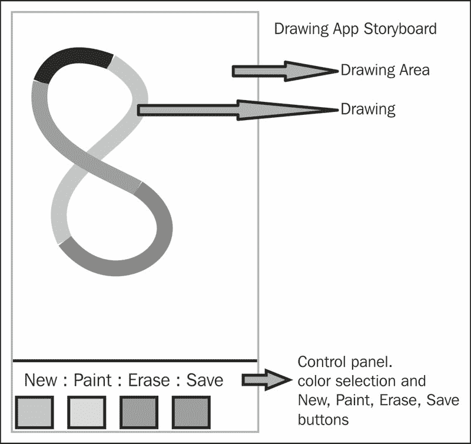
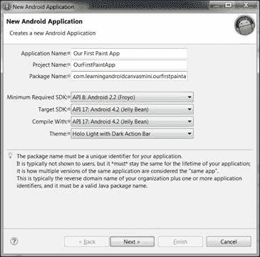
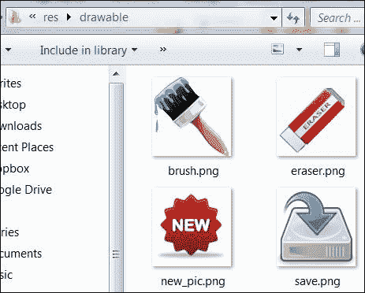
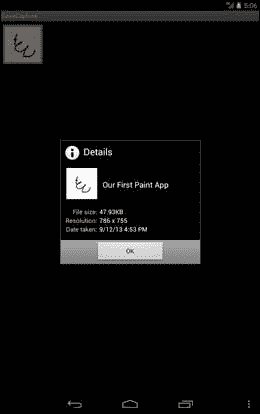
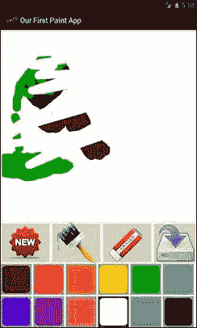

# 第六章。把它们放在一起

最后，我们已经完成了获得使用安卓画布的基本知识和技能的过程。在本章中，我们将使用前几章中使用的所有知识和技术，从零开始逐步开发一个完整的应用程序，并提供所有功能。在这本书的每一章中，我们都学习和练习了画布绘画的一个核心要素。在本章中，我们将把所有这些组件和一些附加特性结合起来，创建一个功能齐全的应用程序。

要创建任何应用程序或游戏，我们需要有一个计划、情节或故事板。故事板将告诉我们事情将如何工作并出现在我们的应用程序中，我们的应用程序的核心功能或输出是什么，以及我们需要什么额外的或支持的功能来使我们的应用程序有用和完整。该计划可以是纸上的一些粗略的项目符号注释，也可以是一些手绘草图，但它将封装我们所有的需求和我们想要的输出。附在图纸上的一些注释将完成我们的计划和我们应用的整体愿景。计划的一个好处是它冻结了需求和我们的应用程序。在正常的软件工程中，在开始开发应用程序之前，会准备一份**软件需求规范**文档，其中所有的需求都是由双方编写和签署的。它定义了项目的边界，这非常重要。如果不定义需求的边界或限制，应用程序的开发将永远不会结束，因为随着时间的推移，需求会在开发过程中增加。所以我们必须有一套定义好的需求和功能。稍后，我们可以在新版本的应用程序中添加更多功能，但至少核心需求和功能将在基础应用程序中完成。

# 故事板

我们将从我们的应用程序的线框开始，上面有一些注释和一些指针和部分；然后我们将解释草图。

下图显示了我们将开发的应用程序的故事板:



前面的图表很容易解释清楚，并且给了我们一个我们计划做什么的完整草图。最上面的区域显示了应用程序的标题，如果我们在创建应用程序时使用了小图标，还会显示一个小图标。标题栏下面是主要的空白**绘图区，**我们将在这里进行所有的手绘和绘画。在屏幕底部，我们会有一个**控制面板**，在这里我们可以选择功能以及绘图和绘画风格。**控制面板**将帮助我们选择画笔的颜色。我们可以改变画笔的大小。我们可以执行某些功能，如创建一个新的绘图，保存现有的绘图，选择一个画笔大小，点击橡皮擦选择它，并擦除当前绘制的绘画。我们将使用手指和触摸事件在画布上绘制。之后，我们可以**保存**、**擦除**，或者更改颜色和画笔大小，继续我们的绘画。因此，我们的目标是为安卓开发一个简单的类似 Paint 的应用程序。

# 项目及应用开发

我们将通过把项目分成四个阶段来实现我们的目标。在开发过程中，我们将一步一步地经历每个阶段，最后，我们将有我们的工作涂料应用。以下是各个阶段:

*   用户界面
*   启用触摸和绘画
*   启用颜色选择
*   用更多的功能来增强我们的应用程序

## 用户界面

我们将通过向导在 Eclipse 中创建一个新的安卓应用程序来开始我们的项目，就像我们在本书前面练习的那样。仅附加新安卓应用向导的第一个屏幕。

下面的截图显示了新安卓应用向导的第一个屏幕:



我们将我们的应用命名为`OurFirstPaintApp`，**项目名称**将自动填充，我们将**包名称**更改为`com.learningandroidcanvasmini`。在此应用程序的开发过程中，我们将使用`res`文件夹中的XML 文件和我们项目的`src`文件夹中的 Java 文件。

### 屏幕方向

在开始任何事情之前，我们需要决定我们的项目将支持什么样的方向。假设我们希望我们的项目应用程序始终处于**纵向**形式，即使用户在横向模式下拿着设备。为此，我们将打开`AndroidManifest.xml`文件并将`Activity`标签中的`android:screenOrientation="landscape"`更改为`android:screenOrientation="portrait"`。

### 油漆刷

从我们的故事板，我们知道我们要用不同尺寸的画笔；为此，我们将定义一些数字来表示特定的画笔大小。我们将进入`res/values`文件夹，打开`dimens.xml`文件。如果文件不在那里，我们将创建一个名为`dimens.xml`的新的 XML 文件，并将我们的值放在其中。在这个文件中，我们将寻找`<resources></resources>`标签。在这个标签中，我们将我们的价值观如下:

```java
<!-- Available brushes --> 
<dimen name="small_brush">10dp</dimen>
<integer name="small_size">10</integer>
<dimen name="medium_brush">20dp</dimen>
<integer name="medium_size">20</integer>
<dimen name="large_brush">75dp</dimen>
<integer name="large_size">75</integer>
```

我们将保持尺寸和整数值不变，这样当我们使用它进行绘图时，用户界面可以显示精确的画笔大小。

### 设计控制面板

在我们的故事板草图中的控制面板中，我们有一行颜色和另一行带有执行某些功能的按钮。现在我们开始设计**控制面板**。首先，我们将添加我们将在**控制面板**中使用的所有字符串。为此，我们将在`res/values`文件夹中打开`string.xml`文件，并将以下代码添加到该文件中:

```java
<string name="start_new_painting">New Painting</string>
<string name="brush_size">Brush Size</string>
<string name="erase">Erase</string>
<string name="save_painting">Save Painting</string>
<string name="paint">Paint</string>
```

### 设置布局

首先，我们将从网络上创建或下载以下图像，并将其复制到`res/drawable`文件夹中。以下截图显示了`res/drawable`文件夹中的图像:



现在，我们将为画布和控制面板设置**布局**、**控制面板**、绘图空间和放置按钮的空间。我们将打开`activity_main.xml`文件。在主`Layout`标签中，我们将输入三个子布局标签，如以下代码片段中所述。第一个按钮将保存新按钮、画笔按钮、擦除按钮和保存按钮的图像，接下来的两个按钮将分别保存一行颜色。

```java
<LinearLayout
  android:layout_width="wrap_content"
  android:layout_height="100dp"
  android:layout_gravity="center"
  android:orientation="horizontal">

  <!-- content code starts here -->
  <ImageButton
    android:id="@+id/new_btn"
    android:layout_width="wrap_content"
    android:layout_height="fill_parent"
    android:contentDescription="@string/start_new"
    android:src="@drawable/new_pic" />

  <ImageButton
    android:id="@+id/draw_btn"
    android:layout_width="wrap_content"
    android:layout_height="fill_parent"
    android:contentDescription="@string/brush"
    android:src="@drawable/brush" />

  <ImageButton
    android:id="@+id/erase_btn"
    android:layout_width="wrap_content"
    android:layout_height="fill_parent"
    android:contentDescription="@string/erase"
    android:src="@drawable/eraser" />

  <ImageButton
    android:id="@+id/save_btn"
    android:layout_width="wrap_content"
    android:layout_height="fill_parent"
    android:contentDescription="@string/save"
    android:src="@drawable/save" />
  <!-- content code ends here -->

</LinearLayout>
```

接下来我们将添加另外两个布局，其中我们将有两行彩色按钮，如图所示:

```java
<LinearLayout
  android:id="@+id/paint_colors"
  android:layout_width="wrap_content"
  android:layout_height="wrap_content"
  android:orientation="horizontal" >

  <ImageButton android:layout_width="@dimen/large_brush"
    android:layout_height="@dimen/large_brush"
    android:layout_margin="2dp"
    android:background="#FF660000"
    android:contentDescription="@string/paint"
    android:onClick="paintClicked"
    android:src="@drawable/paint"
    android:tag="#FF660000" />
.
.
.
```

前面代码中的点代表我们想要添加的其余颜色按钮的代码。在前面的代码块中唯一需要更改的是`android:tag="#FF660000"`代码，这是颜色的值。现在我们已经为控制面板准备好了布局。我们需要在布局中为我们的绘图留出一些空间。在这里，我们将在`src`文件夹中创建一个名为`CustomDrawingView`的新的 Java 类来扩展视图。目前，我们将只创建类的框架代码，以便在布局 XML 文件中引用它。稍后，我们将定制我们的`CustomDrawingView`类的每个部分，并将放入我们希望我们的应用程序拥有的所有功能。骨架代码如下:

```java
import android.content.Context;
import android.util.AttributeSet;

public class CustomDrawingView extends View
{
  public CustomDrawingView(Context context, AttributeSet attrs){
    super(context, attrs);
    setupDrawing();
}

private void setupDrawing(){
  //get drawing area setup for interaction
}

}
```

所以我们增加了一个带有构造函数的`CustomDrawingView`类和一个`setupDrawing()`方法。这些是目前最重要的组成部分。没有构造函数，程序会产生错误。现在我们将返回到我们的`activity_main.xml`文件，并将在父`layout`标签的开始标签下添加以下代码:

```java
<com.learningandroidcanvasmini.ourfirstpaintapp.CustomDrawingView
  android:id="@+id/drawing"
  android:layout_width="fill_parent"
  android:layout_height="0dp"
  android:layout_marginBottom="3dp"
  android:layout_marginLeft="5dp"
  android:layout_marginRight="5dp"
  android:layout_marginTop="3dp"
  android:layout_weight="1"
  android:background="#FFFFFFFF" />
```

我们的 XML 文件中的代码行`<com.learningandroidcanvasmini.ourfirstpaintapp.CustomDrawingView`显示了我们自定义视图的包目录。其次，这也向我们展示了如何在我们的 XML 布局文件中添加定制的基于代码的布局。

虽然我们现在已经几乎准备好了我们的布局，但它仍然没有完成。我们需要颜色选择按钮，这些按钮在我们的**控制面板**中是合适的矩形。到目前为止，我们已经定义了图像按钮，但是仍然需要一些配置，比如那些按钮的形状。我们想要同样的方形按钮，有轻微的圆角。为此，我们将在`res/drawables`文件夹中创建新的`paint.xml`文件。在这个文件中，我们将使用资源 XML 中的可绘制性中解释的技术。我们将创建一个两层的可绘制形状:一层用于矩形对象，另一层用于圆角。

```java
<layer-list xmlns:android="http://schemas.android.com/apk/res/android" >
<item>
  <shape android:shape="rectangle" >
    <stroke
      android:width="5dp"
      android:color="#FF999999" />
    <solid android:color="#ff000000" />
    <padding
      android:bottom="0dp"
      android:left="0dp"
      android:right="0dp"
      android:top="0dp" />
  </shape>
</item>
<item>
  <shape xmlns:android="http://schemas.android.com/apk/res/android" >
    <stroke  android:width="4dp"  android:color="#FF999999" />
    <solid android:color="#ff000000" />
    <corners android:radius="15dp" />
  </shape>
</item>
</layer-list>
```

在前面的代码中，我们使用了一个层列表标签，其中我们使用了两个项目。第一项是矩形，第二项是圆角。我们将保存所有文件，并在模拟器中运行我们的代码。

下面的截图显示了我们没有任何功能的应用程序:


到目前为止，我们已经完成了用户界面，并完成了的图形工作。现在，我们必须启用我们的应用程序触控。

## 启用触摸并使用触摸进行绘画

目标是启用触摸:换句话说，当我们在屏幕上拖动手指时，我们的应用程序将进行绘制。我们将从打开我们的`CustomDrawingView`类开始，并将添加以下对象和变量:

```java
private Path drawPath;
private Paint drawPaint, canvasPaint;
private int paintColor = 0xFF660000;
private Canvas drawCanvas;
private Bitmap canvasBitmap;
```

之后，在`setupDrawing()`方法中，我们将实例化`Path`和`Paint`对象，并将它的不同属性设置为我们希望它获得的默认值:

```java
drawPath = new Path();
drawPaint = new Paint();
drawPaint.setColor(paintColor);
drawPaint.setAntiAlias(true);
drawPaint.setStrokeWidth(20);
drawPaint.setStyle(Paint.Style.STROKE);
drawPaint.setStrokeJoin(Paint.Join.ROUND);
drawPaint.setStrokeCap(Paint.Cap.ROUND);
```

最后，在该方法中，我们将实例化 canvasPaint 对象:

```java
canvasPaint = new Paint(Paint.DITHER_FLAG);
```

现在我们将跳转到`onDraw()`方法，并将添加以下行代码:

```java
canvas.drawBitmap(canvasBitmap, 0, 0, canvasPaint);
canvas.drawPath(drawPath, drawPaint);
```

`onDraw()`方法接收类型为`Canvas`的对象作为参数，用于绘制位图和我们想要的绘图或绘画。每次我们触摸屏幕并拖动手指时，`invalidate()`方法将在画布上的上一幅画上调用，`onDraw()`方法将自动调用，显示我们当前的画。

我们几乎已经准备好了所有的东西，但是我们仍然没有启用我们的应用程序。为此，我们将为我们的`CustomDrawingView`类添加一个`onTouchEvent()`方法，如图所示:

```java
public boolean onTouchEvent(MotionEvent event) {
}
```

在这个方法里面，我们要做两个工作:检测用户的触摸和检查运动方向。触摸可以是向上的，意味着手指没有接触屏幕，也可以是向下的，意味着手指被按在屏幕上。运动可以是按下手指向任何方向移动。首先，我们将使用以下代码获得触摸的 x，y 位置:

```java
float touchX = event.getX();
float touchY = event.getY();
```

然后，我们将根据一种可能的情况来响应该触摸事件，这将包含在以下开关代码中:

```java
switch (event.getAction()) {
```

随着向下动作事件，手指被按压。将绘图点移动到触摸的位置:

```java
case MotionEvent.ACTION_DOWN:
  drawPath.moveTo(touchX, touchY);
  break;
```

在运动事件中，手指被按下并向某个方向拖动。首先，绘制点将是被触摸的点，然后在拖动动作期间沿着手指的运动绘制一条线:

```java
case MotionEvent.ACTION_MOVE:
  drawPath.lineTo(touchX, touchY);
  break;
```

最后，当手指抬起时，画布上的一条路径将被绘制，并且`Path`对象将被刷新，以便它准备从下一个被触摸的位置绘制一条新的线:

```java
case MotionEvent.ACTION_UP:
  drawPath.lineTo(touchX, touchY);
  drawCanvas.drawPath(drawPath, drawPaint);
  drawPath.reset();
  break;
  default:
  return false;
}
```

最后，我们将调用`invalidate()`方法，以便激活`onDraw()`方法:

```java
invalidate();
return true;
```

该类的整个代码如下:

```java
public class CustomDrawingView extends View {
  private Path drawPath;
  private Paint drawPaint, canvasPaint;
  private int paintColor = 0xFF660000;
  private Canvas drawCanvas;
  private Bitmap canvasBitmap;
  public CustomDrawingView(Context context, AttributeSet attrs){
    super(context, attrs);
    setupDrawing();
  }
  private void setupDrawing(){
    drawPath = new Path();
    drawPaint = new Paint();
    drawPaint.setColor(paintColor);
    drawPaint.setAntiAlias(true);
    drawPaint.setStrokeWidth(20);
    drawPaint.setStyle(Paint.Style.STROKE);
    drawPaint.setStrokeJoin(Paint.Join.ROUND);
    drawPaint.setStrokeCap(Paint.Cap.ROUND);
    canvasPaint = new Paint(Paint.DITHER_FLAG);
  }
  @Override
  protected void onSizeChanged(int w, int h, int oldw, int oldh) {
    super.onSizeChanged(w, h, oldw, oldh);
    canvasBitmap = Bitmap.createBitmap(w, h, Bitmap.Config.ARGB_8888);
    drawCanvas = new Canvas(canvasBitmap);
  }
  @Override
  protected void onDraw(Canvas canvas) {
    canvas.drawBitmap(canvasBitmap, 0, 0, canvasPaint);
    canvas.drawPath(drawPath, drawPaint);
  }
  @Override
  public boolean onTouchEvent(MotionEvent event) {
    float touchX = event.getX();
    float touchY = event.getY();
    switch (event.getAction()) {
    case MotionEvent.ACTION_DOWN:
      drawPath.moveTo(touchX, touchY);
      break;
    case MotionEvent.ACTION_MOVE:
      drawPath.lineTo(touchX, touchY);
      break;
    case MotionEvent.ACTION_UP:
      drawPath.lineTo(touchX, touchY);
      drawCanvas.drawPath(drawPath, drawPaint);
      drawPath.reset();
      break;
    default:
      return false;
    }
    invalidate();
    return true;
  }
}
```

## 启用颜色选择

我们将从前面创建的用户界面中启用颜色选择。我们知道我们有两排不同的颜色。现在，我们需要我们的应用程序能够将画笔的颜色设置为我们从可用调色板中选择的颜色。为此，我们将打开主活动类，并将`View`、`ImageButton`和`LinearLayout`的`import`语句添加到主活动类的导入部分:

```java
import android.view.View;
import android.widget.ImageButton;
import android.widget.LinearLayout;
```

接下来，在我们的主活动类中，我们将创建一个`CustomDrawingView`类的对象:

```java
private CustomDrawingView drawView;
```

在我们的主活动类的`onCreate()`方法中，我们将通过获取对其布局的引用来实例化`drawView`对象，该布局在`activity_main.xml`文件中定义:

```java
drawView = (CustomDrawingView)findViewById(R.id.drawing);
```

我们将添加另一个对象，让我们知道单击了哪个绘制按钮:

```java
private ImageButton imgBtnSelectedPaint;
```

接下来在`onCreate()`方法中，我们将添加以下代码。首先，我们将得到我们的绘画按钮的布局。`paint_colors`属性在`activity_main.xml`文件中定义:

```java
LinearLayout paintLayout =(LinearLayout)findViewById(R.id.paint_colors);
```

然后，我们将选择顶部颜色行中的第一种颜色作为默认的选定颜色:

```java
imgBtnSelectedPaint = (ImageButton)paintLayout.getChildAt(0);
```

为了区分选择颜色按钮和其他按钮，我们将为所选按钮使用不同的可绘制颜色。要使所选按钮有一个单独的`Drawable`对象，我们将首先在我们的`drawable`文件夹中定义一个单独的 XML 文件。XML 文件中所选按钮的代码如下所示:

```java
<layer-list xmlns:android="http://schemas.android.com/apk/res/android" >
    <item>
      <shape android:shape="rectangle" >
        <stroke
          android:width="4dp"
          android:color="#FF333333" />
          <solid android:color="#00000000" />
          <padding
            android:bottom="0dp"
            android:left="0dp"
            android:right="0dp"
            android:top="0dp" />
        </shape>
    </item>
    <item>
      <shape xmlns:android="http://schemas.android.com/apk/res/android" >
        <stroke
          android:width="4dp"
          android:color="#FF333333" />
          <solid android:color="#00000000" />
          <corners android:radius="10dp" />
        </shape>
    </item>

</layer-list>
```

该代码与我们在`drawable`文件夹中为正常的绘画按钮创建的前一个 XML 文件完全相同。这里唯一的区别是`android:color`和`android:color`的值不同。之后，我们将打开我们的主活动类，在下面的`onCreate()`方法中，我们最近添加的图像按钮代码，我们将添加下面的行来为选择按钮启用不同的样式:

```java
imgBtnSelectedPaint.setImageDrawable(getResources().getDrawable(R.drawable.paint_pressed));
```

接下来我们将在`CustomDrawingView`类中创建一个方法来更新我们绘制绘画时使用的绘画颜色:

```java
public void setColor(String newColor){
  invalidate();
  paintColor = Color.parseColor(newColor);
  drawPaint.setColor(paintColor);
}
```

我们将很快在我们的主活动类中使用前面的方法。请注意，在 XML 文件中我们的图像按钮的代码中，我们提到了一个名为`paintClicked`的`onClick()`方法。现在是在我们的主要活动课上创造`paintClicked`方法的时候了。我们将从如下定义方法开始:

```java
public void paintClicked(View view){
```

现在，我们将检查单击的颜色按钮是否尚未被选中:

```java
if(view!=imgBtnSelectedPaint){ 
```

如果未选中，我们将从单击的按钮中获取标记，并将我们绘画的当前颜色设置为所选的标记颜色:

```java
ImageButton imgView = (ImageButton)view;
String color = view.getTag().toString();
```

下面一行代码将调用先前在`CustomDrawingView`类中创建的`setColor()`方法来更改油漆颜色:

```java
drawView.setColor(color);
```

之后，我们将简单地更新**控制面板**，显示通过改变所选按钮的可绘制性来修改所选按钮；我们会将之前选择的按钮恢复到正常状态:

```java
imgView.setImageDrawable(getResources().getDrawable(R.drawable.pa int_pressed));
imgBtnSelectedPaint.setImageDrawable(getResources().getDrawable(R.drawable.paint));
imgBtnSelectedPaint=(ImageButton)view;
}}
```

我们的进度状态显示我们已经完成了项目的四分之三:

*   我们已经为我们的应用程序准备了一个相对有吸引力的用户界面
*   我们的应用程序支持触摸
*   我们能够使用手指触摸和拖动动作进行绘制；此外，我们可以改变我们正在绘制的颜色或画笔

下面的截图显示了我们的当前状态和一个粗略的绘图:


我尝试绘制了一个出现在画笔按钮上的画笔，如前面的截图所示。我不是一个好的艺术家，它甚至不是一幅好的画，但它足以解释我们现在的处境。

## 为我们的应用增加更多功能

我们的应用程序的核心结构已经完成，但我们仍然应该使它更加有用和有吸引力；我们需要用更多的功能让它更加辛辣，而不仅仅是提供颜色和绘画的选择。我们将从将我们的绘画保存到设备的功能开始。

### 保存画作

我们将在我们的主要活动类中创建一个`savePaintingButton`的实例:

```java
private ImageButton savePaintingButton;
```

接下来，我们将创建它的实例，并在我们的主活动类中的`onCreate()`方法中聆听它的点击:

```java
savePaintingButton = (ImageButton)findViewById(R.id.save_btn);
savePaintingButton.setOnClickListener(this);
```

当我们为 click listener 编写前一行代码时，它下面会出现一条红线，警告我们有问题。右键单击这一行将为我们提供所有可能的选项来解决问题。选择最能解决问题的选项。假设，在示例中，我们选择了实现继承的`OnClickListner`的主活动的选项；会发生两件事。首先我们的主活动类将继承`OnClickListner`，如代码行所示:

```java
public class MainActivity extends Activity implements OnClickListener {
```

其次，下面的方法将在我们的主活动类中用一个空体创建。

```java
public void onClick(View v) {
}
```

现在我们将在前面的方法中编写我们的保存逻辑。为了保存我们的绘画，我们将从引用包含我们的绘画的布局开始，并为其启用绘画缓存。然后，我们将创建一个`Bitmap`对象，并为我们的视图对象提供一个绘图缓存。

```java
View ourView = findViewById(R.id.drawing);
ourView.setDrawingCacheEnabled(true);
Bitmap ourBitmapImage = ourView.getDrawingCache();
```

接下来，我们将定义一个字符串，该字符串将包含保存文件的路径，并将创建一个`File`对象，该对象将被提供该路径:

```java
String extr = Environment.getExternalStorageDirectory().toString()
  + "/SaveCapture";
File myPath = new File(extr);
```

如果路径不存在，我们将在该位置创建一个新目录，如果路径存在，我们将在该位置创建文件，如下所示:

```java
if (!myPath.exists()) {
  boolean result = myPath.mkdir();
}
  myPath = new File(extr, getString(R.string.app_name) + ".jpg");
```

在此之后我们将创建一个`FileOutputStream`对象。输出流将字节写入文件(如果存在)；如果没有，则创建一个新文件，并将流写入其中。我们之前创建的`Bitmap`对象有我们的绘图缓存，我们将使用它来调用一个方法`compress()`向它提供压缩类型的信息，并使用`FileOutputStream`对象为我们创建一个扩展名为`JPEG`的图像文件。追溯一下，就是看这个 JPEG 文件里的绘画信息是怎么到这里的，`Bitmap`对象被提供了包含`myPath`对象的`FileOutputStream`对象。`myPath`对象包含保存文件的完整路径和保存文件的名称。此外，`Bitmap`对象已经从我们创建的`View`对象中获得了我们绘画的必要信息，以及在特定时刻绘图缓存中的可用信息。这段代码解释了输出蒸汽对象的创建，并将其提供给我们已经创建的`Bitmap`对象。`try`块的最后一行使用`MediaStore`。`MediaStore`包含外部和内部存储设备上所有可用介质的元数据。来自`MediaStore`的`insertImage`将插入一个图像，并在我们的图库中为其创建一个缩略图:

```java
FileOutputStream fos = null;
  try {
    fos = new FileOutputStream(myPath);
    ourBitmapImage.compress(Bitmap.CompressFormat.JPEG, 100, fos);
    fos.flush();
    fos.close();
    MediaStore.Images.Media.insertImage(getContentResolver(), ourBitmapImage,
      "Screen", "screen");
  }

  catch (FileNotFoundException e) {
    Log.e("Error", e + "");
  }

  catch (Exception e) {
    Log.e("Error", e + "");
  }
```

最后，我们将在`AndroidManifest.xml`文件中添加以下权限:

```java
<uses-permission android:name="android.permission.WRITE_EXTERNAL_STORAGE"/>
  <uses-permission android:name="android.permission.READ_EXTERNAL_STORAGE"/>
```

没有这些权限，我们的应用程序将不被允许从存储驱动器读取或写入。有关权限及其理解的更多详细信息，请访问链接[。](http://developer.android.com/guide/topics/security/permissions.html)

随着这段代码的结束，我们的保存功能就完成了。现在我们可以在画廊里画画和保存我们的画了。下面的截图向我们展示了保存的画作:



如果我们检查图库，我们会发现我们的图像保存在那里。如果我们检查新创建的图像的细节，它会向我们显示图像的缩略图、名称和创建日期。我们的图像用我们的应用程序名保存，因为这是我们在代码中提供的文件名。我们还必须确保我们的模拟器是用 SD 卡选项创建的。如果我们的模拟器是在没有 SD 卡选项的情况下创建的，那么这段代码将不起作用。

### 创建新图形

要创建一幅新的绘画或启用新的按钮的功能，我们需要清除画布上当前绘制的任何内容，并清除之前的绘画缓存。为此，我们将创建一个新按钮的实例、一个监听器和一个`onCreate()`方法，就像我们为`savePaintingButton`按钮创建一样。我们将在新按钮的监听器中添加以下代码:

```java
drawCanvas.drawColor(0, PorterDuff.Mode.CLEAR);
invalidate();
```

前面的代码将清除屏幕和缓存。`PorterDuff`的细节我就不赘述了，只在这里写一下不是安卓专用的。`PorterDuff`是执行波特和达夫定义的 12 条规则的`AlphaComposite`类。更多关于安卓的细节可以在以下链接中找到:

[http://developer . Android . com/reference/Android/img/porterduff . html](http://developer.android.com/reference/android/img/PorterDuff.html)

### 在我们的应用程序中启用橡皮擦

我们将在本章的中为我们的应用程序增加一个功能:使用橡皮擦。我知道我不是毕加索，在我的绘画申请中我肯定需要一块橡皮擦。因此，我们将编写更多的代码来启用我们的应用程序橡皮擦。首先，我们将为橡皮擦按钮创建一个实例和一个监听器，就像我们为`savePaintingButton`按钮所做的那样。制作橡皮擦功能的最简单方法是将绘画颜色设置为背景颜色。看起来我们正在擦除绘图，但实际上，我们将使用设置为背景色的绘画颜色对其进行绘画。

这是我们油漆选择的代码:

```java
if(view!=imgBtnSelectedPaint){
  ImageButton imgView = (ImageButton)view;
  String color = view.getTag().toString();
  drawView.setColor(color);
  imgView.setImageDrawable(getResources().getDrawable(R.drawable.paint_pressed));
  imgBtnSelectedPaint.setImageDrawable(getResources().getDrawable(R.drawable.paint));
  imgBtnSelectedPaint=(ImageButton)view;
```

我们知道我们的背景颜色是白色，从我们的 XML 布局文件中，我们知道我们为白色定义的标签是`#FFFFFFFF`，我们白色按钮的背景颜色是`#FFFFFFFF`。因此，要在我们的应用程序中启用擦除，我们只需将`String color = view.getTag().toString();`的值更改为`String color = "#FFFFFFFF";`。

保存文件并运行应用程序。现在我们的应用程序将具有擦除功能。下面的截图显示了我们在之前的画笔绘图中应用的橡皮擦:



有了橡皮擦功能，我们的基本绘画应用程序就完成了，但是，就额外的趣味而言，额外的功能不限于新建、绘画、擦除和保存。只要我们的想象力允许，我们可以加入很多其他功能。但有一点是明确的:无论我们计划在那里放什么，我们都将使用这本书过程中解释的东西之一。编码的方法和顺序可能会有所不同，但是，就基本的 2D 图形而言，本书中的课程和示例将涵盖它。

# 总结

在这一章中，我们学到的比一开始实际承诺的要多。我们学到的内容如下:

*   规划我们的应用和故事板的使用
*   使用嵌套布局创建丰富、复杂的用户界面
*   仅使用 XML 创建图形对象
*   创建我们自己单独的`View`类，并在 XML 文件和我们的主要活动文件代码中引用该类
*   使用`Path`、`Paint`、`Bitmap`和`Canvas`物体
*   定义监听器和捕捉触摸事件
*   响应这些触摸事件
*   切换画笔的颜色
*   使用文件系统和输出流
*   将文件保存到存储设备
*   向`AndroidManifest.xml`文件添加权限
*   清除画布、绘图缓存并创建新绘图
*   使用非常简单的逻辑擦除已经绘制的绘画

我们坚持到了这本书的结尾。这本书只关注非常基础的知识，从 0 级到中级知识，使用画布为安卓工作。尽管如此，本书所包含的知识将适用于各种基本的 2D 安卓图形应用。对于一个更复杂的动画应用程序，我们可能需要安卓画布的高级知识和一些在 OpenGL ES 中使用 3D 的核心知识。OpenGL ES 是 OpenGL 的一种风格，适用于嵌入式设备或手持设备。