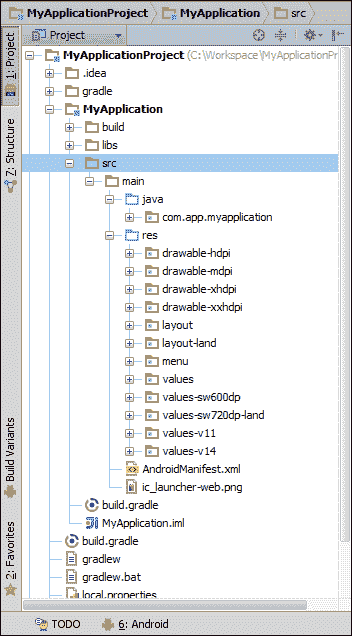
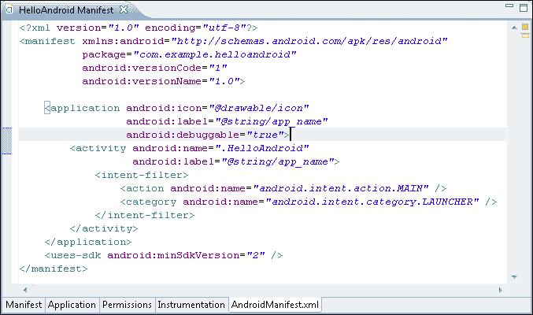

# 第一章。了解安卓

本章为你提供了一个很强的安卓理论概念。很明显，这个术语对任何技术新手来说都不陌生。由于这个伟大的操作系统的流行，许多开发人员开始从网络开发和其他平台转移。这一巨大的迁移给安卓应用市场带来了巨大的变化，并为新的移动应用开发者打开了无限的新大门。安卓是苹果公司操作系统 iOS 的强劲对手。然而，正如统计数据显示的那样，安卓在收入方面正在赶上 iOS 市场，因为就总下载量而言，谷歌 Play 是增长最快的应用市场。

本章包括以下主题:

*   介绍安卓
*   理解安卓的为什么和什么时候
*   安卓开发者的官方谷歌集成开发环境——安卓工作室
*   安卓应用程序的结构
*   展示安卓活动生命周期

# 推出安卓

安卓是一个基于 Linux 的操作系统，这使得它成为一个开源软件。谷歌根据《阿帕奇许可协议》分发其许可。安卓代码的可用性使其成为一个易于修改的操作系统，供应商也可以对其进行定制。由于高度灵活的设计，一些批评者称之为不安全，这在某个时期是正确的，但现在，安卓是一个成熟的操作系统，具有高级别的安全架构。据说最新版本的安卓(也就是果冻豆)是谷歌有史以来生产的最安全的操作系统。让我们继续概述安卓操作系统的不同版本。

## 探索安卓的不同版本

从一开始，安卓就随着不同版本的发布而不断转型。不仅仅是用户界面，在每个即将到来的版本中都添加、修改和增强了许多功能。第一个正式使用甜点名称的版本是基于 Linux 2.6.27 的安卓纸杯蛋糕 1.5。每一个新的安卓版本都会附带一套新的 API 级别，基本上是对之前的 API 做了一些修改，过时了，增加了新的控件。

从开发人员的角度来看，发布新版本的安卓会带来一些以前的方法/功能的过时。但是，这将带来警告，但不会带来错误；您仍然可以在新的应用编程接口级别中使用以前的方法调用。

下表显示了不同的安卓版本及其应用编程接口级别和主要亮点:

<colgroup><col style="text-align: left"> <col style="text-align: left"> <col style="text-align: left"> <col style="text-align: left"> <col style="text-align: left"></colgroup> 
| 

安卓版本

 | 

版本名称

 | 

主要特点

 | 

API 级别

 | 

发布日期

 |
| --- | --- | --- | --- | --- |
| Android 4.1/4.2/4.3 | 果冻豆 | 谷歌现在语音搜索锁定屏幕小部件速度提升键盘手势打字安全的 USB 调试(仅供开发人员使用)OpenGLES 3.0 支持改进的相机用户界面从右向左语言支持 | 16、17 和 18 | 2012 年 7 月 9 日、2012 年 11 月 13 日和 2013 年 7 月 24 日 |
| Android 4.0 | 冰淇淋三明治 | 主要界面变化增强的锁屏操作屏幕方向动画带有 EAS v14 的电子邮件应用程序面部解锁增强型网络浏览器平板电脑和手机支持 | 14 和 15 | 2011 年 10 月 19 日 |
| Android 3.x | 蜂巢 | 首款平板电脑操作系统添加系统栏和操作栏快速访问摄像头及其功能双窗格电子邮件用户界面视图多核支持 | 11、12 和 13 | 2011 年 2 月 22 日 |
| Android 2.3 | 姜饼 | 增强的用户界面原生 VoIP/SIP 支持谷歌聊天和谷歌钱包视频通话支持 | 9 和 10 | 2010 年 12 月 6 日 |
| Android 2.2 | 弗罗约〔t0〕 | 速度提升通用串行总线连接准时制实施 | eight | 2010 年 5 月 20 日 |
| Android 2.0/2.1 | 艾克蕾尔 | 更新的用户界面实时壁纸蓝牙 2.1 | 5、6 和 7 | 2010 年 1 月 12 日 |
| Android 1.6 | 甜甜圈 | 手势识别 | four | 2009 年 9 月 15 日 |
| Android 1.5 | 纸杯蛋糕 | 键盘中的文本预测录制和观看视频 | three | 2009 年 4 月 30 日 |

### 注

安卓的版本是按字母顺序排列的，这是一个有趣的事实。从苹果派 1.0 开始，然后是香蕉面包 1.1，它以完整的字母顺序连贯走向果冻豆，并保持了传统；预计下一个版本将是关键莱姆派。

正如前面提到的，安卓由于其开源的特性而开放供供应商修改，许多著名的移动制造商在他们的手机中放入了自己定制的安卓版本。例如，三星在安卓上定制了一个触摸界面，并将其称为触摸向导(三星 Galaxy S4 配备了触摸向导自然 UX 2.0)。同样，HTC 和索尼 Xperia 也想出了自己的定制用户界面，分别称之为 HTC Sense 和 TimeScape。


## 谷歌 Play——安卓官方应用商店

就像其他著名的移动操作系统一样，安卓有一个名为谷歌游戏的应用商店。此前，该应用商店名为安卓市场，在 2012 年年初，它以全新改进的用户体验成为谷歌游戏。这次更新将整个娱乐圈统一在谷歌 Play 的保护伞下。音乐、应用程序、书籍和电影，都变得容易被用户访问，就像苹果著名的应用商店(iTunes)一样。你可以在[http://play.google.com/about/](http://play.google.com/about/)找到安卓商店的详细信息。

### 注

谷歌电影和电视、谷歌音乐、谷歌图书和谷歌杂志仅在有限的国家提供。

Google Play 提供了广泛的应用程序、电影、电子书和音乐。最近，他们还在同一个应用商店下引入了谷歌播放电视设施。说到应用端，谷歌 Play 提供了不同的类别，用户可以在其中选择应用。它的范围从游戏到漫画和社交应用。用户可以享受许多付费应用，并可以通过谷歌 Play 提供的应用内计费服务解锁许多功能。

还有不同的供应商特定的应用商店，如 Kindle 的亚马逊应用商店、Nook 商店，以及许多其他根据自己的条款和条件提供许多应用的商店。

# 了解安卓的为什么和什么时候

安卓是一个基于 Linux 的开源操作系统，主要面向触摸屏手机和平板电脑。安迪·鲁宾、里奇·迈纳、尼克·西尔斯和克里斯·怀特于 2003 年 10 月创立了操作系统。安卓理念背后的基本意图是为数字内容开发一个操作系统。这是因为，当时手机使用塞班和视窗手机作为操作系统。

### 注

iPhone 于 2007 年 6 月由苹果公司发布，Android 于 2007 年 11 月由谷歌公司发布。

然而，当他们意识到相机等设备没有太大的市场时，他们将注意力转移到了手机上，反对塞班和视窗移动。当时 iPhone 还没有上市。安卓(Android Inc .)是智能手机操作系统的顶级品牌，截至目前，该品牌在智能手机领域占据了 75%的市场份额。他们没有向市场透露什么，只是说他们正在开发手机软件。同年，安卓联合创始人鲁宾的钱花光了，他的密友史蒂夫·帕尔曼给他带来了一个装有 1 万美元现金的信封。

2005 年 8 月，谷歌公司收购安卓公司，使其成为谷歌公司的子公司。安卓的主要员工留在安卓公司。收购后。安迪·鲁宾开发了一个由 Linux 内核驱动的移动设备平台。谷歌向手机制造商和运营商承诺了一个灵活且可升级的操作系统。由于谷歌没有在媒体上发布任何关于安卓的消息，谣言开始四处传播。流传的猜测包括谷歌正在开发谷歌品牌手机，谷歌正在定义手机原型和技术规格。这些猜测和谣言一直持续到 2006 年 12 月。

后来，在 2007 年 11 月，开放手机联盟透露，他们的目标是为移动设备开发一个开放标准。安卓作为第一款产品发布；基于 Linux 内核 2.6 版本构建的移动设备平台。开放手机联盟是一个由 65 家参与移动领域的公司组成的联盟，倡导移动行业的开源标准。

2008 年 10 月，HTC 发布了第一款部署安卓操作系统的商用手机，名为 HTC Dream。下图为宏达梦想。从那以后，安卓系统开始升级。谷歌在 2010 年推出了 nexus 系列。


HTC 梦想，首款使用安卓活动背栈的安卓手机

## 安卓操作系统的演进

安卓操作系统在 HTC Dream 首次亮相后，在消费者中迅速普及。安卓正在被谷歌不断升级。每个主要版本都包括上一个版本的错误修复和新功能。

安卓于 2008 年 9 月在 HTC 英雄设备上发布了第一个版本。安卓 1.1 是一个调整 bug 和问题的更新，没有重大版本。安卓 1.1 之后，发布了名为纸杯蛋糕的安卓 1.5，具有视频上传、文本预测等功能。Android 1.6 甜甜圈和 Android 2.0/2.1éclair 于 2009 年底发布，随后于 2010 年 1 月发布 2.1，推出了谷歌地图、增强的照片视频功能、蓝牙、多点触控支持、实时壁纸等重大更新。2010 年 5 月，名为“冷冻酸奶”的安卓 2.2 成为主要版本，增加了对无线热点连接的支持。

这个版本在开发者中变得非常流行，并且曾经是安卓应用的最低 API 级别。2010 年 5 月发布的 Android 2.3 姜饼引入了近场通信(NFC)功能，允许用户执行移动支付和数据交换等任务。这个版本的安卓成为开发者中最受欢迎的版本。安卓 3.0/3.1 蜂巢，专为平板设备优化，开发者更多 UI 控制是一大加分项。安卓 4.0 冰淇淋三明治于 2011 年 10 月发布。由于安卓 3.0/3.1 仅适用于平板电脑，冰淇淋三明治的发布彻底改变了这一差距，并得到了手机和平板电脑的支持。安卓的最新版本，安卓 4.2 果冻豆进一步完善了用户界面，完善了软件，以及其他改进。

### 注

谷歌开始以 sugar treats 命名安卓版本，按照字母顺序，排在安卓 1.1 版本之后。

下图以视觉格式显示了所有版本:


下图截图安卓版本当前分布(2013 年 3 月)。从截图中可以明显看出，安卓 2.3 姜饼是最受欢迎的版本，其次是安卓冰淇淋 4.0:


安卓版本的当前发行版

# 谷歌官方 IDE 安卓工作室

谷歌 I/O 2013 之前，安卓正式使用 Eclipse 作为其开发的 IDE。官方安卓支持明确提到了这个 IDE 的使用以及**安卓开发工具** ( **ADT** ) 和**安卓软件开发工具包** ( **SDK** )及其文档。


安卓工作室加载屏幕(视窗 7)

在谷歌 I/O 2013 中，谷歌提出了一个新的 IDE，它是专门为开发安卓应用而设计的。集成开发环境被称为安卓工作室，这是一个基于智能的软件，为开发人员提供有前途的功能。

## 安卓工作室特色

安卓工作室在基于智能的集成开发环境上提供了各种功能。安卓工作室引入的功能列表如下:

*   安卓工作室自带内置的安卓开发工具
*   安卓工作室为构建提供了基于 Gradle 的支持
*   用于构建安卓用户界面和在不同屏幕尺寸上同时查看的灵活控件
*   安卓重构、快速修复以及提示和技巧
*   具有拖放功能的安卓应用高级用户界面制作工具

下面的截图显示了带有 UI 制作工具的 Android Studio 多屏查看器:


### 注

安卓工作室的当前版本是 v0.1.1。

除此之外，安卓工作室还提供了其他各种功能。谷歌在发布会上提到，版本(v0.1)不稳定，需要进行各种修复，才能以 100%的准确率使用。

## 安卓工作室的局限性

安卓工作室处于早期阶段，这使得它成为一个不成熟的软件，有局限性。据谷歌称，他们正在进行软件的更新，很快就会纠正问题。根据版本 0.1.1，开发人员面临的限制如下:

*   安卓工作室只能用安卓 4.2 果冻豆编译
*   用户界面只能用安卓 4.2 果冻豆 ui 和小部件制作
*   一个 Eclipse 项目不能直接导入安卓工作室(参考[http://developers.android.com/](http://developers.android.com/))
*   导入库项目时的错误

# 安卓应用的构建模块

安卓应用程序由各种构件组成，帮助开发人员保持事物的有序性。它为维护资产、图片、动画、电影剪辑和实现本地化功能提供了灵活性。此外，还有一些组件包含关于您的应用程序支持的安卓最低和最高版本的信息。同样，在安卓应用项目中，菜单也是单独处理的。



安卓应用程序的各种组件，如安卓工作室所示

就像 Eclipse IDE 一样，Android Studio 提供了各种便利的功能来使用这些特性。展望 Android 应用程序的构建模块，我们可以将组件分为以下几个部分:

*   编码组件
*   媒体组件
*   XML 组件
*   引用组件
*   库组件

## 编码组件

分解组件可以让你轻松理解安卓应用的结构。编码组件是那些与安卓项目的源代码直接相关的组件。为了编写一个应用程序，开发人员需要编写一些代码行，以用户想要的方式进行响应。

在编码组件中，保存所有开发人员代码的主文件夹是`src`。该文件夹由一个或多个 Java 包组成，在这些包中，开发人员根据所做工作的类型对他们的代码进行分类。编写包名的默认方式是点分隔(例如，`com.app.myapplicationproject`)，这可以很容易地将其与任何其他项目的任何其他包区分开来。

### 注

安卓应用程序的包名用于在谷歌游戏上唯一识别它。

包内有`.java`文件，供开发者从安卓库中参考，并进行所需的输出。这些 Java 类可能是也可能不是从 Android API 继承的。我们还可以在编写代码时使用大多数的 Java 函数。

## 媒体组件

由于高度配置的硬件，用户需要具有良好图形、动画、声音和视频文件的应用程序。因此，你可以很容易地介绍它们中的任何一个，但应该确保它们都不会影响应用程序的质量，因为有成千上万种不同类型的安卓设备可用。 Android 提供了一种灵活的方法，您可以使用它将媒体文件放入项目中。根据分类，有两种方法可以在应用程序项目中维护媒体文件:

*   资产文件夹
*   与此无关

### 资产文件夹

一个安卓项目包含一个名为`assets`的文件夹。这个文件夹负责保存所有的媒体文件，包括音乐、图片等等。开发人员可以通过在继承的`Activity`类中编写`getAssets()`函数直接从代码中访问文件夹。该功能返回`AssetManager`，可方便地使用访问主`assets`文件夹内的子文件夹和文件。

`assets`文件夹的主要优点是不需要为放置的文件保留引用，这在开发人员需要进行测试和运行时更改的情况下非常方便。虽然它没有任何参考，但它可能会因键入错误而引入错误。使用资产的另一个好处是开发者可以根据自己的意愿排列文件夹；类似地，这些文件夹的命名约定可以根据开发人员的方便程度轻松选择。

### RES 文件夹

`res`文件夹用于管理安卓应用中的媒体文件、图像、用户界面布局、菜单、动画、颜色和字符串(文本)等应用资源；或者换句话说，你可以说这是处理媒体文件最智能的方式。它由许多子文件夹组成，包括`drawable`、`drawable-ldpi`、`drawable-mdpi`、`drawable-hdpi`、`drawable-xhdpi`、`drawable-xxhdpi`、`raw`、`layout`、`anim`、`menu`和`values`。

**可绘制**与安卓项目中使用的图像直接相关。这是一种在项目中保存图像的智能方式。正如我们所知，市场上有各种类型的设备支持安卓操作系统。为了区分这些设备，低分辨率图像被放置在分辨率较低的设备的`ldpi`文件夹中。同样的，`mdpi`文件夹是中屏密度的设备，`hdpi`是高密度，`xhdpi`是超高密度，以此类推。

### 类型

放置在这些可绘制文件夹中的图像应该具有唯一的名称，以便通过代码中的一个引用来访问它们。

同样，为了放置音乐和声音内容，我们使用`raw`文件夹，以便从代码中访问它们。除了音乐和声音之外的任何其他文件也可以放在`raw`文件夹中(例如 JSON 文件)。这同样适用于`anim`、`values`、`menus`和`layout`文件夹，分别用于放置动画、值、自定义菜单和不同类型的布局。

## XML 组件

在安卓系统中，开发者需要使用 XML 来制作用户界面。布局、菜单、子菜单和许多其他东西都是以基于 XML 的不同安卓标签的形式定义的。除了布局之外，您还可以以 XML 文件的形式存储字符串、颜色代码和许多其他东西。组件支持应用程序层次结构的维护，并使其易于所有开发人员理解。

让我们来看看一些最重要的 XML 文件，它们被用作任何安卓应用程序的主干。

### 布局文件夹

在`res`文件夹里面，有一个名为`layout`的文件夹，里面包含了所有活动的布局。需要注意的是这个文件夹有一些扩展，就像可抽文件夹一样。`layout-land`和`layout-port`方法专门用于分别在横向和纵向模式下保持布局井井有条。

### 类型

XML 还可以用于制作定制的可绘制图，可以在不同场景下作为图像使用。例如，自定义按钮的图像可以用 XML 制作，这在单击和未单击状态下给出了不同的用户界面行为。

前面的截图是安卓工作室的，你可以看到一个`activity_main.xml`文件，用来描述一个活动的布局。`RelativeLayout`和`TextView`有一些安卓定义的 XML 标签(阅读下面的信息框)。类似地，还有一些其他标签可供开发人员在布局中包含不同种类的小部件。

### 注

`RelativeLayout` 是将孩子放置到相对位置的布局。安卓手机开发者经常使用这种布局。

`TextView` 是用于显示任何类型文本的视图之一，包括数字、字符串和可编辑内容。

### 菜单文件夹

安卓系统有不同种类的菜单，可以按顺序使用来快速访问活动中使用的突出功能。可用的不同菜单如下:

*   上下文菜单
*   选项菜单(带操作栏)
*   弹出菜单
*   自定义菜单

由于本章的重点有限，我们不能完全详细说明功能并给出不同类型菜单的示例。然而，所有类型的菜单都是基于 XML 文件，其中安卓定义的标签，如`<menu>`、`<item>`和`<group>`用于在应用程序中引入菜单。参考以下截图:


安卓 ICS 选项菜单在左边，自定义弹出菜单在右边

### 值文件夹

`values`文件夹由各种 XML 文件组成，开发人员可以在许多场景中使用这些文件。这个文件夹最常见的文件是`styles.xml`和`strings.xml`。`style`文件由所有与任何用户界面风格相关的标签组成。类似地，`strings.xml`文件由任何安卓项目的源代码中使用的所有字符串组成。除此之外，`strings.xml`文件还包含`<color>`标记的哈希编码，用于识别安卓应用程序源代码中的许多颜色。

### AndroidManifest.xml

与前面提到的文件夹不同，`AndroidManifest.xml`是一个包含安卓应用重要信息的文件。清单文件由各种标签组成，如`<application>`、`<uses-sdk>`、`<activity>`、`<intent-filter>`、`<service>`，以及包含在`<manifest>`主标签中的许多其他标签。

就像标签建议的那样，这个 XML 文件包含了所有关于活动、服务、SDK 版本以及与应用程序相关的所有信息。如果您没有输入正确的信息或在`AndroidManifest.xml`文件中遗漏了任何内容，可能会出现各种错误。

`AndroidManifest.xml`文件的另一个主要优点是，它是跟踪任何安卓应用程序结构的最佳方式。通过这个文件可以很容易地看到活动、服务和接收者的总数。除此之外，我们可以通过调整`AndroidManifest.xml`文件来更改样式、字体、SDK 约束、屏幕大小限制和许多其他功能。

在签署`.apk`构建时，我们提到了包名、版本名和版本代码，它们由谷歌 Play 唯一识别，以便将应用程序投放市场。然后，应用程序将由这个包名来标识，并且进一步的发布是基于更改`AndroidManifest.xml`文件中描述的版本代码和版本名。



## 引用组件

安卓应用程序的另一个基本组件是引用组件。简单地说，这个组件帮助基于 XML 的文件与 Java 代码进行交互。在安卓工作室中，文件`R.java`放置在源文件夹下，源文件夹是项目层次结构中构建文件夹的子文件夹。`R.java`文件包含了所有在 XML 文件中用于布局、菜单、可绘制、动画等的引用。然后，该文件暴露给活动文件，以获取引用并获取对象来执行各种功能和参数。

大多数情况下，该`R.java`文件是作为项目导入的一部分获得的，用作`R.layout.main`。在本例中，这显然意味着我们需要获得属于`res`布局文件夹的布局，该布局的名称为`main`。因此，它将返回一个资源标识，该标识对开发人员是隐藏的，并直接引用`res`文件夹中的特定布局。

### 注

构建项目时会自动生成`R.java`文件。因此，它不应该被推送到存储库中。确保`R.java`文件的内容没有被手动修改。存在于项目的`gen`文件夹中的`R.java`文件是在项目制作或编译时由安卓定义的。

## 库组件

库是预先构建的 Java 文件/项目，任何人都可以使用它来执行这个应用程序中的某些任务。有各种第三方付费/不付费库可以为开发者提供各种功能。库组件本身不是库；相反，它们是保存库的项目文件夹。

在安卓项目中，主应用程序文件夹(安卓工作室)中有一个名为`libs`的文件夹，用作库组件。任何`.jar`库文件都可以放在这个文件夹下，以便从代码中引用它。在 Java 代码中使用这些库时，您需要导入`.jar`文件中相应的包名，以便使用该特定类的功能。

同样，您可以将任何其他安卓项目作为一个库使用，方法是将其作为一个模块并导入到您的项目中。该功能之前在 Eclipse 中被称为库项目，由**项目属性** | **安卓** | **库参考**导入。


安卓工作室模块导入窗口

# 安卓活动生命周期

安卓应用程序由一个或多个活动组成。这些活动是应用程序在执行任务、获取用户输入以及向用户显示结果时转换流程的可视化表示。每个活动都在屏幕上为用户呈现一个可视化的表示，供用户交互。安卓按照后进先出的规则将所有活动保存在一个后栈中。每当一个新的活动开始时，当前的活动就被推送到后栈。因此，安卓将重点放在了新的活动上。活动可以占据设备的整个屏幕，也可以占据部分屏幕，或者也可以拖动。无论是取屏幕整个区域的活动，还是取屏幕一小部分的活动，在 Android 中一次只聚焦一个活动。当任何现有的活动被停止时，它被推入后栈，这又导致下一个顶级活动被聚焦。

### 注

安卓 4.x 版本引入了碎片。片段可以称为子活动，它嵌入在一个活动中，在单个活动中同时执行不同的任务，与活动不同。

通常，一个安卓应用程序包含多个活动。这些活动相互之间联系松散。为要执行的特定任务创建每个活动是一种很好的做法。例如，在一个简单的电话拨号应用程序中，可能有一个显示所有联系人的活动，一个显示任何特定联系人的完整联系人详细信息，一个用于拨号，等等。在所有的应用程序中，都有一个作为应用程序起点的主要活动。当应用程序启动时，此活动开始。然后这个活动开始另一个活动，这个活动又开始另一个活动，以此类推。安卓在后台管理所有的活动。


安卓活动背栈

上图显示了后栈如何工作的简单表示。堆栈中突出显示顶级活动的区域代表前台活动，有时称为聚焦活动或运行活动。当一个新的活动被创建时，它被推入堆栈，当任何现有的活动被销毁时，它被拉出堆栈。这个被推入堆栈和拉出堆栈的过程是由 Android 中的活动生命周期来管理的。这个生命周期称为活动生命周期。生命周期管理堆栈中的活动，并通过循环的回调方法通知活动状态的变化。由于状态的变化，活动接收不同类型的状态，如创建的活动、销毁的活动等。开发人员重写这些回调方法来执行相应状态更改的必要步骤。例如，当一个活动开始时，应该加载必要的资源，或者当一个活动被销毁时，应该卸载这些资源以提高应用程序的性能。所有这些回调方法在管理活动生命周期中起着至关重要的作用。开发人员可以选择覆盖无、部分或全部方法。

## 活动的基本状态

基本上，一个活动保持三种状态:`Resumed`、`Paused`和`Stopped`。当活动恢复时，它会显示在屏幕上，并获得用户的关注。该活动保留在后台堆栈的前台部分。当另一个活动开始并在屏幕上可见时，该活动将暂停。这个活动仍然保留在前台任务上，它仍然活着，但是它没有得到任何用户的关注。新活动也有可能部分覆盖屏幕。在这种情况下，暂停活动的部分将在屏幕上可见。当活动在屏幕上完全不可见时，它将进入停止状态，并被前景中的另一个活动替换。在这种停止状态下，活动仍然有效，但它在后台堆栈的后台部分。暂停和停止状态的区别在于，在暂停状态下，活动附加到窗口管理器，但在停止状态下，它不附加到窗口管理器。

### 注

在内存极低的情况下，安卓系统可以通过请求完成来终止任何暂停或停止的活动，或者不请求就终止进程。为了避免这个问题，开发人员应该在暂停和停止回调中存储所有必要的数据，并且应该在恢复回调中检索这些数据。

## 活动生命周期的回调方法

有各种各样的回调方法，当任何活动的状态改变时都会被调用。开发人员在这些方法中执行必要的任务和操作，以提高应用程序的性能。为了展示活动的生命周期，我们在这一部分创建了一个小安卓应用程序。下面是一步一步的方法:

1.  启动**安卓工作室**。
2.  Create an empty project with the details as shown in the following screenshot:

    

    安卓工作室新项目对话框

3.  在项目的`MainActivity.java`文件中增加以下代码:

    ```java
    package com.learningandroidintents.callbacksdemo;
    import android.os.Bundle;
    import android.app.Activity;
    import android.view.Menu;
    import android.widget.Toast;
    public class MainActivity extends Activity {

     @Override
            public void onCreate (Bundle savedInstanceState){
                super.onCreate(savedInstanceState);
                Toast.makeText( this, "Activity Created!", Toast.LENGTH_SHORT
                ).show();
            }
    @Override
            protected void onStart ()
            {
                super.onStart();
                Toast.makeText(this, "Activity Started!", Toast.LENGTH_SHORT
                ).show();
            }

     @Override
            protected void onResume()
            {
                super.onResume();
                Toast.makeText(this, "Activity Resumed!", Toast.LENGTH_SHORT
                ).show();
            }

    @Override
            protected void onPause()
            {
                super.onPause();
                Toast.makeText(this, "Activity Paused!", Toast.LENGTH_SHORT
                ).show();
            }

    @Override
            protected void onStop()
            {
                super.onStop();
                Toast.makeText(this, "Activity Stopped!", Toast.LENGTH_SHORT
                ).show();
            }

    @Override
            protected void onDestroy()
            {
                super.onDestroy();
                Toast.makeText(this, "Activity Destroyed!", Toast.LENGTH_SHORT
                ).show();
            }
        }
    ```

4.  在模拟器中运行项目，您将看到屏幕上按以下顺序打印祝酒词:
    *   创建的活动
    *   活动已开始
    *   活动已恢复
    *   活动暂停
    *   活动已停止
    *   活动已销毁

让我们看看前面提到的代码的工作原理。

当您运行项目时，模拟器将在屏幕上以先前给定的顺序显示所有祝酒词。在项目开始时，创建一个活动，然后启动该活动。活动开始后，显示在屏幕上，仿真器打印**恢复**。现在，我们按回车键返回，安卓系统准备完成活动。所以，活动首先暂停，然后停止，最后销毁。所有这些回调一起被称为活动生命周期。活动生命周期从`onCreate()`方法开始，到`onStop()`方法结束。活动从`onStart()`方法到`onStop()`方法可见，活动从`onResume()`方法到`onPause()`方法保留在前景中。下图显示了这种循环分布:


## 活动生命周期流程

到目前为止，我们已经讨论了使用的生命周期回调方法、它们的状态以及它们的目的。现在，我们将研究回调方法的流程。在安卓系统中，当一个活动开始时，已经打开的活动停止，这种活动的变化是一个流程。下图显示了活动生命周期的可视化流程图:


回调方法用矩形显示。活动生命周期的第一步是创建一个活动。如果同一任务中没有运行活动的实例，安卓会创建一个活动。`noHistory`标签不允许多个活动；相反，它将确定一个活动是否会有历史跟踪(参考[http://developer . Android . com/guide/topics/manifest/activity-element . html # nohist](http://developer.android.com/guide/topics/manifest/activity-element.html#nohist))，您可以通过`android:launchmode flag`标签确定多个实例。使该标签的值`true`意味着在堆栈中只创建一个活动实例，并且每当调用一个活动意图时，相同的实例被推到堆栈的顶部，以在屏幕上显示该活动。

在`onCreate()`方法之后，调用`onStart()`方法。该方法负责初始设置，但最好在`onResume()`方法中配置这些设置，该方法在`onStart()`方法之后调用。记住，前景阶段是从`onResume()`方法开始的。假设用户在他或她的手机上接到一个电话，那么这个活动将通过`onPause()`方法暂停。因此，当活动暂停时，存储必要数据的所有步骤都应该在这里完成。这种方法在关键的内存情况下非常有用，因为在这些情况下，安卓可以停止暂停的活动，这反过来又会在应用程序中显示出意想不到的行为。如果活动由于严重的内存情况而被终止，将调用`onCreate()`方法而不是`onResume()`方法，从而创建活动的新实例。

但是，如果一切顺利，那么活动通过`onResume()`方法返回到它的相同状态。在这种方法中，用户可以在`onPause()`方法中完成重新加载存储数据的所有工作，并可以让活动恢复生机。在`onResume()`启动后关闭活动时，调用`onStop()`方法。这将根据用户操作触发`onRestart()`方法或`onDestroy()`方法。简而言之，开发人员可以使用回调方法来控制活动生命周期。无论活动是否保留前台，使用`onPause()`和`onResume()`方法进行数据管理都是一种很好的做法，`onCreate()`和`onDestroy()`应该分别只用于初始数据管理和资源清理。

### 注

除了`onCreate()`方法之外，所有回调方法都不采用参数或自变量。在内存严重不足的情况下，如果一个活动被销毁，那么在创建该活动时，该实例状态将在`onCreate()`方法中传递。

没有必要覆盖所有的方法。用户可以覆盖任意数量的方法，因为没有这样的限制。用户应该在`onCreate()`方法中设置视图。如果您没有为内容设置任何视图，将显示一个空白屏幕。在的每次回调中，首先，在做任何事情之前都应该调用超类的同一个回调方法。这种超级回调方法通过安卓系统开发的标准流程来操作活动生命周期。

# 总结

在这一章中，我们探讨了安卓的关键概念。我们讨论了安卓系统，它的版本以 sugar treats 命名，讲述了安卓系统的简史，以及它的创始人是如何与谷歌一起发布安卓系统的。我们还讨论了谷歌 Play，安卓应用的官方商店；谷歌官方 IDE 安卓工作室及其特点和局限性。然后我们将讨论转移到开发角度，讨论了任何安卓应用程序的构建模块。我们还讨论了活动生命周期，它在任何安卓应用程序中扮演着非常重要的角色，它的流程，它的回调方法，并看了一个例子。

在下一章中，我们将讨论意图、意图在安卓系统中扮演的角色、技术概述、结构及其在安卓系统中的使用。