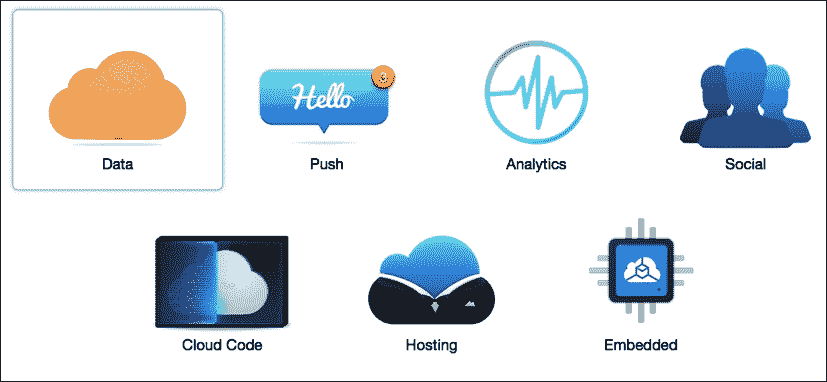
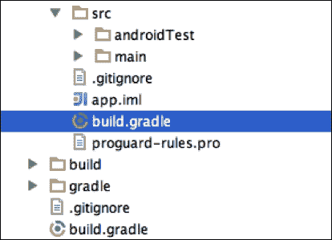
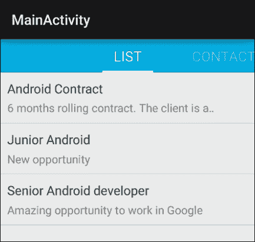

# 第三章。从云中创建和访问内容

在本章中，我们将学习如何使用我们的应用消费网络内容；这些内容可能是从互联网上检索到的 XML 或 JSON 文件(我们希望显示的内容)中的项目列表。例如，如果我们正在构建一个显示当前天气状况的应用，我们将需要联系一个外部应用接口来检索所有需要的信息。

我们将在 Parse 中创建自己的云数据库，该服务允许我们非常快速地完成这项工作，而无需创建和维护自己的服务器。除此之外，我们将用要在`MasteringAndroidApp`中显示的信息填充数据库。

我们还将介绍关于谷歌截击网络请求的最佳实践，使用超快 HTTP 库 OkHttp，并使用 Gson 高效解析请求的对象。我们将在本章中讨论以下主题:

*   创建自己的云数据库
*   从解析中消费内容
*   谷歌截击和 OkHttp
*   用 Gson 解析对象

# 创建自己的云数据库

在项目的这个阶段，我们必须开始建模我们自己版本的`MasteringAndroidApp`。请随意开发自己的想法，并将数据库用于自己的数据。以这个例子为指导；你不一定要完全按照我写的那样复制所有代码行。事实上，如果你在这本书的最后发展你自己的例子，你会有一些你可以使用的东西。例如，您可以为自己的个人用途创建一个应用，例如任务提醒、旅行日记、个人照片库，或者任何其他适合存储在云中的东西。

您也可以尝试将此应用货币化；在这种情况下，您应该尝试为用户开发一些有趣的东西。例如，它可以是新闻阅读器或食物食谱阅读器；它可以是任何应用，您可以在其中向云提交内容，并通知用户新内容可用。

在这个过程中，我们将解释`Application`类的重要性，该类用于在我们的项目中设置 Parse。

## 解析

如果每秒请求数少于 30，解析是免费的。我设想，如果你有足够多的用户每秒钟向你的应用请求 30 次信息，也就是每分钟 1800 次，你肯定可以升级到付费账户，甚至建立自己的服务器！这项服务是一个非常容易和可靠的方式，让服务器端为您的应用。它还提供推送通知服务和分析，这是另一个优势。

我们将继续创建新帐户；之后，我们需要在 Parse 中命名我们的应用。在这里，我将使用`MasteringAndroid`。一旦你命名了应用，你就会出现在你的账户主页上。我们需要导航到**数据服务** | **移动** | **安卓** | **原生 Java** 。

下图将数据服务显示为云:



## 向我们的项目添加解析软件开发工具包

要从我们的应用访问数据服务，我们需要安装**解析软件开发工具包** ( **系统开发工具包**)。为此，Parse 向我们提供了一个快速入门指南，其中包含了所有的代码，包括我们应用的 API Keys，可以复制粘贴到我们的项目中。

基本上，我们需要完成两个步骤:

1.  第一个是下载一个`.jar`库文件，我们需要复制到我们项目的`libs`文件夹中。复制之后，我们需要告诉我们的构建系统在我们的应用中包含这个库。为此，我们需要在我们的应用文件夹中找到`build.gradle`文件(注意，我们的项目中有两个`build.gradle`文件)，并添加以下行:

    ```java
    dependencies {
      compile 'com.parse.bolts:bolts-android:1.+'
      compile fileTree(dir: 'libs', include: 'Parse-*.jar')
    }
    ```

2.  In the following image, you can see the two files named `build.gradle`; the one that is selected is the right one:

    

3.  The second step is to initialize the Parse SDK in our project; for this, we can navigate directly to [https://www.parse.com/apps/quickstart?app_id=masteringandroidapp](https://www.parse.com/apps/quickstart?app_id=masteringandroidapp). Replace your own app ID in the link or find the link by clicking on your home page, as in the following screenshot:

    

4.  点击**快速入门指南**后，前往**数据** | **移动** | **安卓** | **原生** | **现有项目**。
5.  它会要求将`INTERNET`和`ACCESS_NETWORK_STATE`权限添加到您的`AndroidManifest.xml`文件中，如果它们尚未添加的话。

## 安卓的应用类

我们可以注意到的下一件事是，我们需要将初始化 Parse 的代码添加到我们的`Application`类中；但是，我们的`Application`类在我们的项目中不是默认创建的。我们需要创建并理解什么是`Application`类以及它是如何工作的。

要创建一个应用类，我们将右键单击我们的包并创建一个名为`MAApplication`扩展`Application`的新 Java 类。一旦这个扩展了`Application`，我们可以覆盖`onCreate`方法。然后，我们将右键单击我们的**类** | **生成。** | **覆盖方法** | **开启创建**。

这将覆盖`onCreate`方法，我们将准备在那里实现我们自己的功能。每次创建我们的`Application`时都会调用`onCreate`方法；因此，这是初始化我们的库和第三方 SDK 的合适位置。现在，您可以复制并粘贴解析初始化行，如快速入门指南中所示:

### 类型

小心，这是独一无二的，对于你自己的帐户，你应该有自己的钥匙。

```java
Parse.initialize(this, "yourKeyHere", "yourKeyHere");
```

最后，我们需要告诉我们的应用，我们有一个新的`Application`类，那是我们想要使用的类；如果我们不这样做，我们的`Application`班就不会被认可，`onCreate`也不会被叫。

在我们的清单中，在`<application>`标签内部，我们需要设置属性名称来匹配我们自己的应用。执行以下代码:

```java
<application
    android:name="MApplication "
    android:icon="@drawable/ic_launcher"
    android:label="@string/app_newname"
>
```

应用类封装了我们应用中的所有内容；活动包含在应用中，随后，片段包含在**活动**中。如果我们的应用需要一个所有活动/片段都可以访问的全局变量，那么就是合适的地方。在下一章中，我们将看到如何创建这个全局变量。下图是应用的图形结构:


## 创建数据库

正如我们所知，我们将在本书中创建的示例是一个应用，它将提供与安卓相关的工作机会；因此，我们需要创建一个数据库来存储这些工作邀请。

数据库可以在开发过程中更改(当应用发布并有用户时，这将更难做到)。然而，现在我们将着眼于大局，创建整个系统，而不是拥有所有字段都已完成的数据库的最终版本。

要创建表格，点击**核心**部分，如下图所示:


首先，通过点击 **+添加类**按钮创建一个表，并将其称为**工作要约**，具有以下属性，可通过点击**栏+** 按钮添加:

*   `objectId`:默认创建:`String`
*   `title`:这是职称:`String`
*   `description`:这是岗位描述:`String`
*   `salary`:表示工资或日薪:`String`
*   `company`:表示提供工作的公司:`String`
*   `type`:表示员工的类型，是永久工、合同工还是自由职业者:`String`
*   `imageLink`:这是公司的形象:`String`。
*   `Location`:表示作业的位置:`String`
*   `createdAt`、`updatedAt`:这是作业的日期；这些列是用默认日期创建的

要向表格中添加数据，选择左侧的表格，点击 **+行**。我们只需要完成我们创建的列；默认创建的列，如 ID 或日期，将自动完成。到目前为止，我们的表应该如下所示:


请随意添加更多详细信息，如联系人、电子邮件和手机号码。您还可以添加更多表格；例如，包含作业类型和字段类型的新的`JobType`表而不是`String`将是`Relation<JobType>`。

我们有我们的榜样所需要的东西；接下来要做的是使用我们的应用消费这些数据。

# 存储和消费来自解析的内容

Parse 是一个非常强大的工具，它不仅允许我们非常容易地消费内容，还允许我们从设备将内容存储在云数据库中，这是一个使用传统方法要完成的繁琐任务。

例如，如果我们想要从我们的设备上传图像到自定义服务器，我们必须创建一个`POST`请求并发送一个具有正确编码的表单，同时将图片作为一个`FileBody`对象附加到`MultiPartEntity`中，并导入 Apache HTTP 库:

```java
HttpClient httpclient = new DefaultHttpClient();
HttpPost httppost = new HttpPost("URL TO SERVER");

MultipartEntity mpEntity = new MultipartEntity(HttpMultipartMode.BROWSER_COMPATIBLE);
File file = new File(filePath);
mpEntity.addPart("imgField", new FileBody(file, "application/octet"));

httppost.setEntity(mpEntity);
HttpResponse response = httpclient.execute(httppost);
```

现在，让我们来看看解析替代方案:

```java
ParseFile imgFile = new ParseFile ("img.png", ImgByteArray);

ParseObject myParseObject = new ParseObject ("ParseClass");    
 myParseObject.put("imageField", imgFile);
 myParseObject.saveInBackground();
```

让我们不要忘记解析时的错误处理。以一种非常优雅的方式，你可以简单地写道:

```java
imageObj.saveInBackground(new SaveCallback() {
  @Override
  public void done(ParseException e) {
    if (e == null) {
      //Successful
    } else {
      //Error
    }
  }
});
```

## 存储内容

为了详细说明解析的简单性，我们将从我们的应用上传工作邀请到我们的解析云。

为了实现这一点，我们可以在 Contact Fragment 内部创建一个按钮，我们将在应用的最终版本中将其设置为不可见，因为我们不希望用户自己上传工作邀请。

用这个按钮，我们将创建`ParseObject`，类似于地图。我们将添加我们想要完成的字段，然后我们将调用`saveInBackground()`方法，这是将上传对象的方法。执行以下代码:

```java
view.findViewById(R.id.addJobOffer).setOnClickListener(new View.OnClickListener() {
  @Override
  public void onClick(View view) {

    ParseObject jobOffer = new ParseObject("JobOffer");

    jobOffer.put("title", "Android Contract");
    jobOffer.put("description", "6 months rolling    contract. /n The client" +
    "is a worldwide known digital agency");
    jobOffer.put("type", "Contract");
    jobOffer.put("salary", "450 GBP/day");
    jobOffer.put("company", "Recruiters LTD");
    jobOffer.put("imageLink", "http://.....recruitersLTD_logo.png");
    jobOffer.put("location","Reading, UK");

    jobOffer.saveInBackground();
  }
});
```

如果在你自己版本的`MasteringAndroidApp`中，你想让用户上传内容，你可以为每个字段显示一个带有`EditText`的对话框，这样用户可以写工作邀请，按上传，让你发送带有用户所写字段的`jobOffer`对象。

运行该应用，导航至 **联系**，点击按钮。如果数据上传正确，在浏览器中打开解析云数据库时，您应该会看到一个额外的行，其中包含刚刚上传的工作邀请。

### 类型

记得在`AndroidManifest.xml`、`android.permission.ACCESS_NETWORK_STATE`和`android.permission.INTERNET`中添加权限。

## 消费内容

我们在解析云中的对象默认有一个对象标识符；它是`objectId`场。让我们开始按 ID 检索一个对象，然后，我们可以检索一个包含和不包含过滤器的所有对象的列表。运行以下代码:

```java
ParseQuery<ParseObject> query = ParseQuery.getQuery("JobOffer");
query.getInBackground("yourObjectID", new GetCallback<ParseObject>() {
  public void done(ParseObject object, ParseException e) {
    if (e == null) {
      // object will be our job offer
    } else {
      // something went wrong
    }
  }
});
```

当网络请求完成时，`ParseQuery`对象将通过网络异步执行查询。方法；将执行回调中包含的`done (the ParseObject object, ParseException e)`。

测试结果的一个好方法是打印日志；在例外为`null`的情况下，表示一切正常。

```java
if (e == null) {
  Log.d("PARSE_TEST",object.getString("Title"));
} else {
  // something went wrong
}
```

我们可以从`ParseObject`中提取每个字段，并在我们的应用中用构造函数创建一个`JobOffer`类，其参数与对象的字段相匹配。使用以下代码片段:

```java
JobOffer myJobOffer = new JobOffer(object.getString("title), object.getString("description"), … );
```

然而，有一个更好的方法来做到这一点。我们可以创建一个扩展`ParseObject`的`JobOffer`类，其中所有字段将自动转换为我们类中的变量。这样，我们可以用一种非常方便的方式来使用我们自己的类，而不是使用`ParseObject`:

```java
public void done(JobOffer jobOffer, ParseException e) 
```

不要忘记在类的顶部添加`@ParseClassName("Name")`注释，让 Parse 知道我们要实例化云中的哪个对象，并在`MAApplication`中启动解析之前注册子类:

```java
public class MAApplication extends Application {

    @Override
    public void onCreate() {
        super.onCreate();

        // Enable Local Datastore.
        Parse.enableLocalDatastore(this);

        ParseObject.registerSubclass(JobOffer.class);

        Parse.initialize(this, "KEY", "KEY");
    }

}

@ParseClassName("JobOffer")
public class JobOffer extends ParseObject {

    public JobOffer() {
        // A default constructor is required.
    }

    public String getTitle() {
        return getString("title");
    }

    public void setTitle(String title) {
        put("title", title);
    }

    public String getDescription() {
        return getString("description");
    }

    public void setDescription(String description) {
        put("description", description);
    }

    public String getType() {
        return getString("type");
    }

    public void setType(String type) {
        put("type", type);
    }
    //Continue with all the fields..

}
```

现在我们已经创建了自定义类，更容易获得包含所有工作机会的列表。如果我们愿意，我们可以用一个参数过滤它。例如，我可以通过以下查询检索所有永久作业:

```java
ParseQuery< JobOffer > query = ParseQuery.getQuery("JobOffer");
query.whereEqualTo("type", "Permanent");
query.findInBackground(new FindCallback<JobOffer>() {
    public void done(List<JobOffer> jobsList, ParseException e) {
        if (e == null) {
            Log.d("score", "Retrieved " + jobsList.size() + " jobs");
        } else {
            Log.d("score", "Error: " + e.getMessage());
        }
    }
});
```

## 显示内容

一旦检索到对象的列表，就可以创建`ListView`和接收对象作为参数的`Adapter`。最后，我们将使用另一个特性，它允许我们直接从查询结果中创建一个适配器；所以，我们不必自己创建一个`Adapter`类。

在这两种情况下，我们都需要创建`ListView`并查看列表的行。目前，只显示标题和描述的第一行就可以了。我们将对此进行自定义，并在[第 7 章](07.html "Chapter 7. Image Handling and Memory Management")、*图像处理和内存管理*中添加一个图像。如下创建 `row_job_offer.xml`布局:

```java
<?xml version="1.0" encoding="utf-8"?>
<LinearLayout xmlns:android="http://schemas.android.com/apk/res/android"
    android:orientation="vertical" android:layout_width="match_parent"
    android:layout_height="wrap_content"
    android:padding="10dp">

    <TextView
        android:id="@+id/rowJobOfferTitle"
        android:layout_width="fill_parent"
        android:layout_height="wrap_content"
        android:text="Title"
        android:textColor="#555"
        android:textSize="18sp"
        />

    <TextView
        android:id="@+id/rowJobOfferDesc"
        android:layout_marginTop="5dp"
        android:layout_width="fill_parent"
        android:layout_height="wrap_content"
        android:text="Description"
        android:textColor="#999"
        android:textSize="16sp"
        android:maxLines="1"
        android:ellipsize="marquee"
        />

</LinearLayout>
```

我们现在准备创建`ParseQueryAdapter`并定制`getItemView()`方法。这个适配器的巨大优势是我们不需要通过查询下载数据，因为它是自动完成的；基本上，我们可以显示云创建适配器的项目列表。从来没有这么容易过！

要覆盖一个类中的方法——在这种情况下，我们想要覆盖`getItemView`——我们可以创建一个子类，一个扩展`ParseQueryAdapter`并覆盖这个子类中的方法的`MyQueryAdapter`类。这是一个很好的解决方案，尤其是如果我们想在应用中多次实例化对象。

然而，有一种方法可以覆盖类中的方法，而不必扩展它；我们可以在对象实例化后添加`{ }`。例如，请参考以下代码:

```java
Object object = new Object() {

 //Override methods here

 }
```

使用这种方法，我可以创建一个新的`ParseQueryAdapter`并定制`getItemView`，如下面的代码所示:

```java
ParseQueryAdapter<JobOffer> parseQueryAdapter = new ParseQueryAdapter<JobOffer>(getActivity(),"JobOffer") {

  @Override
  public View getItemView(JobOffer jobOffer, View v, ViewGroup parent) {

    if (v == null) {
      v = View.inflate(getContext(), R.layout.row_job_offer, null);
    }

    super.getItemView(jobOffer, v, parent);

    TextView titleTextView = (TextView) v.findViewById(R.id.rowJobOfferTitle);
    titleTextView.setText(jobOffer.getTitle());
    TextView descTextView = (TextView) v.findViewById(R.id.rowJobOfferDesc);
    descTextView.setText(jobOffer.getDescription());

    return v;
  }

};
```

我们现在将在我们的`ListFragment`布局中创建`ListView`，在`OnCreateView`中找到这个视图，将适配器设置到列表中，仅此而已。不需要更多的代码来检索和显示这些项目。如果您的列表为空，请确保您导入的是`com.packtpub.masteringandroidapp.fragments.ListFragment;`而不是`MyPagerAdapter`中的`android.support.v4.app.ListFragment`；它们是不同的对象，使用后者会导致显示一个空的安卓内置 `ListFragment`。



# 谷歌截击和 OkHttp

要掌握安卓，我们不能依赖 Parse 这样的解决方案。作为开发人员，我们必须准备好面对不同的服务器端解决方案。我们不能总是与`ParseObjects`一起工作，因为我们需要能够做一个 HTTP `Post`请求，并使用 JSON 或 XML 格式的数据。然而，这并不意味着我们必须手动完成所有这些；我们可以使用谷歌的官方库来帮助我们解析数据和网络请求。

为此，我们将看看**谷歌截击**，一个强大的库，来管理我们的网络请求。我们还将讨论超快 Http 客户端 **OkHttp** ，并将两者结合起来，获得一个惊人的网络请求解决方案。

## 谷歌截击

根据的官方定义和来自[https://developer.android.com/training/volley/index.html](https://developer.android.com/training/volley/index.html)的功能列表，“*凌空是一个 HTTP 库，使安卓应用的联网更容易，最重要的是，更快*”。

凌空提供了以下好处:

*   网络请求的自动调度
*   多个并发网络连接
*   具有标准 HTTP 缓存一致性的透明磁盘和内存响应缓存
*   支持请求优先化
*   取消请求 API 这意味着您可以取消单个请求，或者设置要取消的请求块或范围
*   易于定制；例如，对于重试和回退
*   强排序，这使得使用从网络异步获取的数据来正确填充用户界面变得容易
*   调试和跟踪工具

在凌空诞生之前，在安卓系统中管理网络请求是一项艰巨的任务。几乎每个应用都执行网络请求。定制重试(以防连接失败，我们需要重试)和管理并发网络连接等功能通常需要由开发人员手动实现。如今，我们已经习惯了这些类型的库，但是如果我们想想几年前的情况，凌空是解决这个问题的一个很好的方法。

在了解如何创建请求之前，我们需要了解凌空请求队列对象`RequestQueue`的概念。凌空执行的每个请求都必须被添加到这个队列中，以便执行。这背后的想法是在我们的应用中有一个单一的请求队列，所有的网络请求都可以由我们从应用的任何部分添加和访问。我们将在[第 4 章](04.html "Chapter 4. Concurrency and Software Design Patterns")、*并发和软件设计模式*中看到如何拥有一个可以全局访问的对象实例。看看下面的请求:

```java
// Instantiate the RequestQueue.
RequestQueue queue = Volley.newRequestQueue(this);
```

该请求队列只有在设备安卓版本晚于姜饼的情况下才会使用以下`HttpURLConnection`或`AndroidHttpClient`方法；`HttpURLConnection`比姜饼更早的版本不可靠。

```java
// If the device is running a version >= Gingerbread...
if (Build.VERSION.SDK_INT >= Build.VERSION_CODES.GINGERBREAD) {
    // ...use HttpURLConnection for stack.
} else {
    // ...use AndroidHttpClient for stack.
}
```

当请求队列被实例化时，我们只需要向它添加一个请求。例如，一个网络请求[https://www.google.com](https://www.google.com)，它记录响应:

```java
String url ="https://www.google.com";

// Request a string response from the provided URL.
StringRequest stringRequest = new StringRequest(Request.Method.GET, url,
            new Response.Listener<String>() {
    @Override
    public void onResponse(String response) {
        // Display the first 500 characters of the response string.
        Log.d("Volley","Response is: "+ response.substring(0,500));
    }
}, new Response.ErrorListener() {
    @Override
    public void onErrorResponse(VolleyError error) {
        Log.d("Volley","That didn't work!");
    }
});

// Add the request to the RequestQueue.
queue.add(stringRequest);
```

该请求将被执行，并且`onResponse(…)`或`onErrorResponse(…)`方法将在应用主线程中被调用，也称为 UI 线程。我们将在[第 4 章](04.html "Chapter 4. Concurrency and Software Design Patterns")、*并发和软件设计模式*中更详细地解释安卓系统中的线程。

## OkHttp

OkHttp 是来自 Square 公司的安卓和 Java 的 HTTP 和 SPDY 客户端。它不是凌空的替代品，因为它不包括请求队列。事实上，我们可以使用 OkHttp 作为凌空的底层，我们将在下一节中看到。

根据官方的定义，“ *HTTP 是现代应用的网络方式。这是我们交换数据和媒体的方式。高效做 HTTP 让你的东西加载更快，节省带宽*。

如果我们不需要处理队列中的请求、区分请求的优先级或安排请求，我们可以直接在我们的应用中使用 OkHttp 我们不一定需要凌空。

例如，以下方法打印来自给定网址的响应内容:

```java
OkHttpClient client = new OkHttpClient();

String run(String url) throws IOException {

  Request request = new Request.Builder()
      .url(url)
      .build();

  Response response = client.newCall(request).execute();
  return response.body().string();

}
```

除了比使用`AsyncTask`或`HttpUrlConnection`更容易处理请求之外，说服我们使用 OkHttp 的是 SPDY(**speed**)协议，该协议处理、标记、简化和压缩 Http 请求。

## 闪电般的网络

如果我们希望保持凌空的特性，以便能够有一个灵活和可管理的请求队列，并使用 SPDY 协议进行更快的连接，我们可以将凌空和 OkHttp 结合起来。

这真的很容易做到；在实例化请求队列时，我们可以指定我们想要哪个`HttpStack`方法:

```java
RequestQueue queue = Volley.newRequestQueue(this, new OkHttpStack());
```

这里，`OkHttpStack`是我们通过扩展`HurlStack`自己创建的类，会用到`OkUrlFactory`。这个`OkUrlFactory`会打开一个 URL 连接；这将在内部完成，不需要覆盖`createConnection`方法:

```java
/**
 * An HttpStack subclass
 * using OkHttp as transport layer.
 */
public class OkHttpStack extends HurlStack {

    private final OkUrlFactory mFactory;

    public OkHttpStack() {
        this(new OkHttpClient());
    }

    public OkHttpStack(OkHttpClient client) {
        if (client == null) {
            throw new NullPointerException("Null client.");
        }
        mFactory = new OkUrlFactory(client);
    }
}
```

# JSON 和 Gson

作为一个安卓开发者，迟早你会不得不以 JSON 格式处理网络请求。在某些情况下，您可能还会发现 XML，这使得翻译成对象变得更加繁琐。了解如何通过在 JSON 中发送参数来执行网络请求以及如何使用 JSON 格式的数据非常重要。

JSON 和 GSON 是两回事；我们需要了解其中的区别。JSON，或 JavaScript 对象符号，是一种开放的标准格式，使用人类可读的文本来传输由属性-值对组成的数据对象。它主要用于在服务器和 web 应用之间传输数据，作为 XML 的替代。这是一个 JSON 文件的例子；如您所见，我们可以有不同类型的属性，我们可以有嵌套的 JSON 结构:

```java
{
  "firstName": "Antonio",
  "lastName": "Smith",
  "isDeveloper": true,
  "age": 25,
  "phoneNumbers": [
    {
      "type": "home",
      "number": "212 555-1234"
    },
    {
      "type": "office",
      "number": "646 555-4567"
    }
  ],
  "children": [],
  "spouse": null
}
```

下面是发送参数为 JSON 的网络请求的两个例子。这些例子包括截击和 OkHttp，我们在一章的前面已经讨论过了:

```java
//With Volley

public void post(String param1, String param2, String url) {

  Map<String, String> params = new HashMap<String, String>();
  params.put("param1",param1);
  params.put("param2",param2);

  JsonObjectRequest stringRequest = new  JsonObjectRequest(Request.Method.POST, url, new JSONObject(params),  new Response.Listener<JSONObject>() {

    @Override
    public void onResponse(JSONObject responseJSON) {

    }, new Response.ErrorListener() {

      @Override
      public void onErrorResponse(VolleyError error) {
      }
    });

    // Add the request to the RequestQueue.
    requestQueue.add(stringRequest);
  }

  //With OkHttp

  public static final MediaType JSON
  = MediaType.parse("application/json; charset=utf-8");

  String post(String url, String json) throws IOException {
    RequestBody body = RequestBody.create(JSON, json);
    Request request = new Request.Builder()
    .url(url)
    .post(body)
    .build();
    Response response = client.newCall(request).execute();
    return response.body().string();

  }

  //To create a JSONObject from a string

  JSONObject responseJSON = new JSONObject(String json);
```

**Gson** ( **谷歌 Gson** )是一个开源 Java 库，用于将 Java 对象序列化和反序列化到 JSON(以及从 JSON 反序列化)。

如果我们从 JSON 中的自定义服务器下载应用的工作邀请，它将采用以下格式:

```java
{
  "title": "Senior Android developer",
  "description": "A developer is needed for…",
  "salary": "25.000 € per year",
  .
  .
  .
}
```

同样，我们不想手动创建一个新对象，并通过从 JSON 中检索来设置所有参数；我们要做的是从 JSON 创建一个`JobOffer`对象。这就叫T2【反序列化】。

为此，我们需要在`build.gradle`中导入 GSON 库作为依赖项:

```java
dependencies {
compile 'com.google.code.gson:gson:2.2.4'
}
```

Gson 分别有`fromJSON`和`toJSON`方法进行序列化和反序列化。`fromJson`方法以要转换的 JSON 代码和我们希望它转换成的对象的类作为输入。使用以下代码:

```java
Gson gson = new Gson();
JobOffer offer = gson.fromJson(JSONString, JobOffer.class);
```

如果我们有一个列表，而不是单个对象，这是请求数据时的典型情况，那么我们需要一个额外的步骤来获取类型:

```java
Gson gson = new Gson();
Type listType = new TypeToken<List<JobOffer>>(){}.getType();
List<JobOffer> listOffers = gson.fromJson(JSONString, listType);
```

最后，如果我们希望类中的字段与要反序列化的 JSON 代码的字段具有不同的名称，我们可以使用如下注释:

```java
import com.google.gson.annotations.SerializedName;

public class JobOffer extends ParseObject {

    @SerializedName("title")
    private String title;

    @SerializedName("description")
    private String desc;

    @SerializedName("salary")
    private String salary;
```

# 总结

在本章的最后，您应该能够在 Parse 中创建自己的数据库，并使用应用中的内容。您还应该具备使用凌空和 OkHttp 掌握网络请求的所有必要知识，尤其是在执行网络请求和以 JSON 格式交换数据时。

在下一章中，我们将更详细地解释本章中用于 HTTP 库的一些模式。例如，我们将理解什么是回调，它遵循哪种模式，以及安卓中其他常用的软件模式。