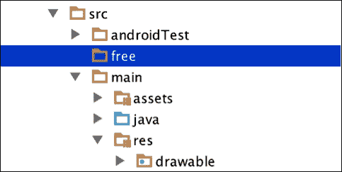
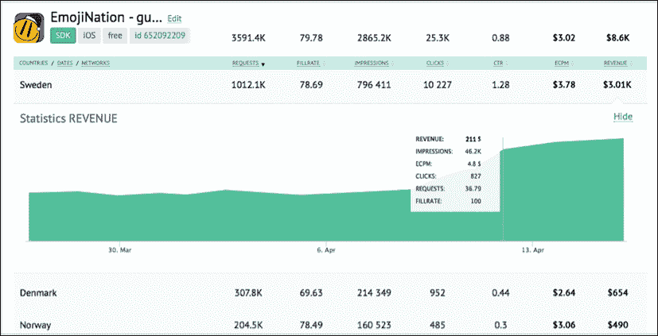
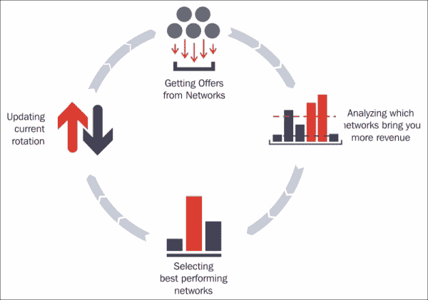
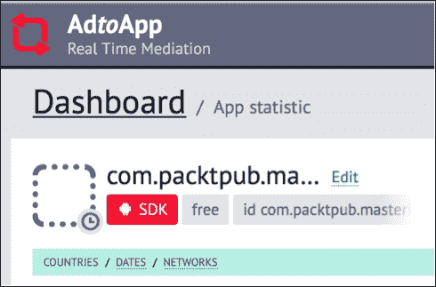
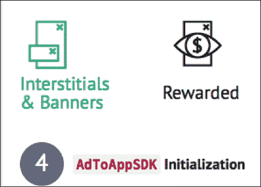
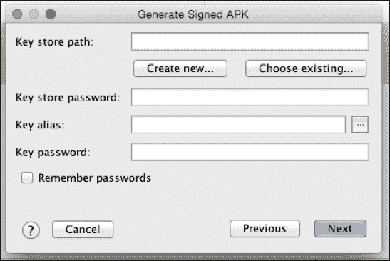
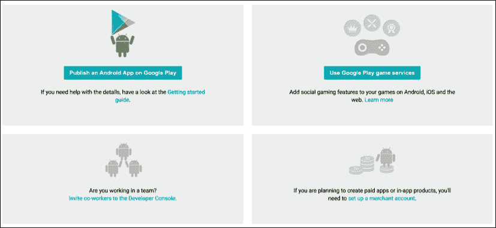
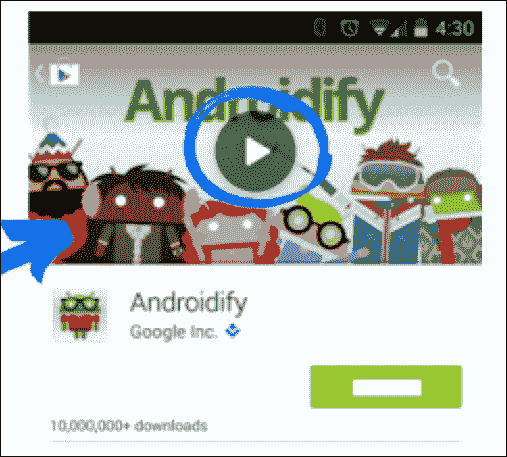

# 第十二章。货币化、构建过程和发布

这是这本书的最后一章；我们剩下要做的就是将我们的应用货币化，生成不同版本的应用，并发布和上传到 Play Store。

我们将通过创建不同的构建类型并生成不带广告的付费版本和带广告的免费版本来完成构建过程。所有这些都将在同一个项目中，但将作为两个不同的应用程序导出。

一旦构建过程完成，我们将开始实施广告，并解释关于广告货币化的要点；这将使使用我们的应用程序产生收入成为可能。

最后，我们将发布该应用程序，并创建一个 APK 的 APK 文件，用发布证书签名，混淆代码，以便可以反编译。我们将把它上传到 Play Store，并解释在应用发布过程中需要牢记的要点。

*   构建变体
*   货币铸造
    *   广告货币化的要点
    *   添加广告
*   放
    *   混淆和签名
    *   使用 Gradle 导出
*   上传到游戏商店

# 使用构建变体

为了解释广告货币化在安卓上是如何工作的，我们将在我们的应用程序中添加广告，但在此之前，我们将设置一个构建过程，允许我们导出两个版本:付费版本和免费版本。这种策略在 Play Store 中普遍使用(有带广告的免费版，有不带广告的付费版)，这样所有用户都可以免费使用 app，但是不喜欢广告又想用你的 app 投稿的用户总能买到付费版。

实施这一策略还有第二种方法，即只创建一个版本，并可以选择购买一个附加组件来移除带有应用内计费产品的应用内广告。这种方式的缺点是你的应用不会在 Play Store 中被列为免费应用；它将被列在“应用内购买优惠”下，因此可能会有用户对此感到不舒服，或者孩子的父母不允许他们使用付费应用或包括支付在内的应用。第二个问题是 App 内计费不容易实现；这个过程非常复杂，有许多步骤，包括设置服务、在 Play Store 中创建产品、从应用程序中消费这些产品，以及设置测试环境，在测试环境中，我们可以在不产生费用的情况下测试购买。要显示构建变体，我们可以导航至**查看** | **工具窗口** | **构建变体**或点击安卓工作室左侧栏中的**构建变体**:


构建变体是构建类型和产品风格的组合。

如果我们有构建类型、`A`和`B`，以及产品口味、`1`和`2`，结果将是以下构建变体:

```java
A 1
A 2
B 1
B 2
```

为了更好地理解这一点，我们可以看看什么是构建类型和构建风格，以及如何创建它们。

## 创建构建类型

构建类型允许我们为调试或发布目的配置应用的打包。

让我们先来看看我们的`build.gradle`文件:

```java
buildTypes {
  release {
    minifyEnabled false
    proguardFiles getDefaultProguardFile('proguard-android.txt'), 'proguard-rules.pro'
  }
}
```

在`build.gradle`中，我们可以看到构建类型发布有两个属性，我们将在本章的最后解释。

默认情况下，我们有两种构建类型:**调试**和**发布**。即使我们没有看到调试构建类型，所有的变体都会在发布和调试模式下生成。

我们可以用不同的参数创建更多的构建类型；我们可以使用的一些参数是:

*   签署配置
*   调试签名标志
*   更改版本名或包名后缀

这意味着我们可以使用不同的证书对不同的类型进行签名，启用调试模式或 false，并使用不同的包名。

构建类型不是为了创建我们的应用程序的不同版本，如演示或完整、免费或付费等。为此，我们有产品风味。每种构建类型都适用于每种构建风格，从而创建了我们之前看到的构建变体。

## 产品风味

我们将创建两种产品口味，并使用以下代码在`build.gradle`中声明它们:

```java
productFlavors {
  paid {
    applicationId "com.packtpub.masteringandroidapp"
  }
  free {
    applicationId "com.packtpub.masteringandroidapp.free"
  }
}
```

我们有付费版的没有广告的 app，还有免费版的有广告的免费版*。对于每个产品风格，我们可以在项目的`../src/`级别创建一个文件夹。我们不需要为我们的付费版本的文件夹，因为它将是默认的主要。*

 *

这样，我们可以为每个构建拥有不同的类和资源，甚至是不同的`AndroidManifest.xml`文件。我们的应用程序将在`main`文件夹中共享付费和免费版本之间的公共代码，在`free`文件夹中共享广告的特定代码。

要在不同版本之间切换，我们只需在构建变体窗口中更改下拉列表，如下图所示:


一旦选择了构建变体，我们可以运行应用程序或导出它，它将相应地运行或导出所选的风格。这些可以配置为具有不同的包名和不同的版本名。

现在，我们来看一下如何在免费版本中添加一个不会包含在主要付费版本中的特定代码。

# 安卓货币化

我们将描述通过应用程序赚钱的三种常见方式。

首先，我们可以在 Play Store 中以一定的价格出售该应用程序。在某些情况下，对你的应用收费比提供一个有广告或应用内产品的免费应用更有意义。如果你为少量用户创建了一个价值大的应用，你肯定要考虑这个选项。例如，如果我们发布一个为建筑师专业设计房屋的应用程序，我们会知道我们的应用程序不会被数百万用户下载；它面向特定的目标受众，寻找高质量的软件。我们不会从广告中获得足够的利润，我们的用户会热衷于为让他们的工作更容易的软件支付一大笔钱。提前要钱总是有风险的；即使用户可以选择获得该应用的退款，他/她也可能没有足够的吸引力去尝试它。这就是为什么我们应该考虑第二种模式。

第二种选择是被称为**免费增值模式**的模式。我们发布了一款免费应用，但其中包含应用内购买。应用于设计房屋的应用程序的同一个例子，我们可以免费提供三种设计，以便当用户对我们的产品感到满意时，我们可以要求他/她购买一次性许可证或订阅以继续使用该应用程序。这在游戏中很常见，你可以为你的角色购买物品。正是在游戏中，我们可以看到这种模式如何与第三种模式相结合，以获得最大可能的收入。

货币化的第三种模式是**广告模式**；我们在应用中投放广告，当用户点击广告时，我们就获得了收入。我们可以使用不同类型的广告——从全屏广告到底部的小横幅。我们将关注这个模型。实现它比你想象的要容易。但在实施之前，我们需要说明**【CPC】**(**每次点击成本**)、 **CTR** ( **点击率**)、填充率等术语是什么意思，这将有助于我们选择一个好的广告平台和提供商。这也是理解指标和能够阅读图表以了解您的应用程序中的广告表现的必要条件。在不同的地方有广告可以改变收入；然而，我们需要在不惹恼用户的情况下实现收入最大化。如果我们为用户提供选择，用应用内产品或不带广告的付费版本以少量资金移除广告，我们可以增加广告数量。如果用户知道他们可以选择，那对他们来说是最好的。如果他们选择和广告一起生活，那是他们的决定，这不会像我们放了很多广告而没有选择删除它们那样让他们烦恼。

## 广告货币化的关键点

我们将解释基础知识，了解广告货币化是如何工作的。业务中有几个概念的缩写起初可能会令人困惑。

一旦我们注册了一个广告平台，我们会看到一个报告页面，上面有我们应用的统计数据。下面是来自广告网的仪表盘示例，`AdToApp`:



在这里，我们可以看到请求、填充率、印象、点击量、点击率、eCPM 和收入。让我们考虑每一个。

请求是指我们的应用程序向广告网络请求广告的次数。例如，如果我们决定在应用程序启动时添加全屏广告，每次启动应用程序时，都会有一个请求服务器取回广告的请求。

我们的 app 里面没有广告；我们拥有的是一个占位符、一个框架和一个`AdView`，里面会填充广告网提供的内容。有时候，广告网络在请求的那一刻没有给我们一个广告，这就是为什么下一个概念很重要。

填充率是由投放的广告量除以请求的广告量得出的百分比。例如，如果我们启动我们的应用程序十次，只收到五次广告，我们将有 50%的填充率。我们在一个好的广告网络中想要的是 100%的填充率。我们希望展示尽可能多的广告，并有一个好的产品总分类。

CPC，即每次点击的成本，是用户每次点击我们应用程序中的广告所赚取的收入；它越高，我们获得的收入就越多。广告商为广告确定产品总分类。一些广告商可能愿意比其他人支付更多的每次点击费用。

点击率低的多次点击不一定比点击率高的几次点击好。这就是为什么我们的广告质量很重要。

印象是广告向用户展示的次数。在前面的例子中，有十个广告请求，五个失败，我们会有五个印象。如果用户不点击印象，印象就不会产生收入。

点击量是用户点击广告的次数。这就是基于产品总分类产生收入的原因。因此，用 0.5 美元的 CPC 点击五次将产生 5x0.5，也就是 2.5 美元。

点击率，即点击率，是你的应用程序收到的点击量除以印象量的百分比。如果我们有 100 个广告和一次点击，我们的点击率将是 1%。这个数额一般在 5%以下；用户并不会点击他们看到的每一个广告，你可能会遇到广告平台的问题，比如 **Admob** ，如果他们认为你通过强迫用户点击广告来作弊，就会取消你的账户和支付。假设我们在应用程序开始时显示一个对话框，并要求用户点击广告以继续使用我们的应用程序。这基本上会给我们 100%的 CTR 对于每个印象，都会有一次点击，这是不允许的。在任何情况下，我们都不能促进点击。

广告提供者希望他们的广告被感兴趣的人看到；他们不想为对他们的广告不感兴趣的人的点击付费，他们会在一秒钟后关闭广告。这可能是因为你有一个高点击率，因为你在你的应用程序中有一个好的位置，广告是每个用户感兴趣的。如果发生这种情况，你必须向你的广告网络解释，否则一些，如 **Admob** ，将关闭你的账户。但是我们不应该对他们太不公平；他们这样做是因为他们发现有很多人试图打破规则，而这样一个庞大的公司无法专注于个人，所以他们需要有客观的过滤器。

其他广告网络公司对此比较灵活；他们通常会给你指派一名代理，你可以通过 Skype 或电子邮件经常联系他，如果有任何问题，他们通常会让你知道。

eCPM 代表“每千印象的有效成本”。它的计算方法是总收入除以总印数(以千计)。这基本上是一种快速了解你做得有多好的方法，只需看一个数字——对比较广告网络非常有用。这个数字通常在 0 到 3 美元之间。

我们需要考虑到这不包括填充率。它是每千次印象的成本，而不是每千次请求的成本。填充率为 50%的三美元 eCPM 与填充率为 100%的一美元半 eCPM 相同。

让一个广告网络好的是高填充率和高 eCPM。我们需要两者都很高；点击费用高、填充率不够的广告不会产生任何收入，因为它们根本不会被展示。

来自 **AdToApp** 的人创造了一个很好的图形来解释这一点:


这个图形代表了我们一直在谈论的内容；eCPM 非常高且填充率低的高级广告网络被表示为关灯的高大但空旷的建筑。

我们完成了理论，可以开始整合一个广告解决方案；在这种情况下，我们将选择 AdToApp。

## 用 AdToApp 添加广告

没有办法知道哪个广告提供商更适合你；你能做的最好的事情就是尝试不同的方法，看看统计数据。

从经验来看，我们喜欢用 AddToApp，是因为除了交付效果好以外，它真的很容易集成，即使你有另一个网络，也可以包含在你的 App 中。因此，衡量它的性能真的很容易。

在本书中使用`MasteringAndroidApp`是理想的，因为它允许我们使用不同类型的广告，全屏广告，横幅，视频等。

有超过 20 个不同广告网络的中介，所以包括他们的 SDK，我们将获得大量广告，保证高填充率。关于他们的 eCPM，他们分析哪个网络给你更好的结果；所以，如果他们能从多个网络投放广告，他们会投放效果更好的。



我们可以在[https://adtoapp.com/?r=OZ-kU-W9Q2qeMmdJsaj3Ow](https://adtoapp.com/?r=OZ-kU-W9Q2qeMmdJsaj3Ow)开始创建账户。

一旦账户被创建，我们将使用我们应用的包名创建一个应用。



我们将单击软件开发工具包按钮上的下载他们的软件开发工具包，并获取集成的配置值。


集成很简单；SDK 将包含一个`AdToAppSDK.jar`文件，我们需要将复制到`libs`中。我们需要在`build.gradle`和支持库 *v7* 中添加谷歌游戏服务，但是我们已经有了这个。

我们需要使用以下代码将基本权限添加到清单中，我们也已经拥有了这些权限:

```java
<uses-permission android:name="android.permission.INTERNET" />
<uses-permission android:name="android.permission.ACCESS_NETWORK_STATE" />
<uses-permission android:name="android.permission.WRITE_EXTERNAL_STORAGE" />
<uses-permission android:name="android.permission.READ_PHONE_STATE" />
```

然后，我们需要在清单中添加额外的强制资产，可以从同一个网站复制；里面有我们账户的钥匙。您可以在第一部分下找到它们，如下图所示:


最后，我们可以看一下如何实现 **间隙&横幅**或奖励广告。奖励广告是在游戏中弹出的广告类型，上面写着:*观看此视频，获得(黄金、宝石等)*。观看这些广告完全取决于用户是否想要奖励:



如果我们选择间隙和横幅，我们需要根据我们想要的是仅视频广告、仅图像(横幅)还是间隙中的图像和视频来初始化它们。

在网站中，根据您想要的广告类型，将显示必要的代码。

SDK 真的很灵活；我们可以更进一步，设置回调来知道横幅何时被加载和点击。这使我们能够跟踪广告中的点击次数，并验证它们是否与 AdToApp 控制台中的相同，从而使过程透明。

如果我们需要额外的帮助，我们可以激活 SDK 中的日志，如果有问题会通知我们。

现在，记住我们在关于最大化广告数量而不过度打扰用户并在你的应用程序中实现它们以开始获得收入的部分开始时提到的良好做法！


# 将我们的应用发布到游戏商店

终于，我们的 app 准备好了！这是开发新 app 的最佳时刻；是时候把它上传到 Play Store，获得用户的反馈，并有望获得数千次下载。

我们需要将应用程序导出到 APK 文件；为了上传到 Play Store，必须签署发行证书。这一点很重要；一旦应用程序使用证书进行了签名，如果我们将其上传到 Play Store 并希望将来上传新版本，则必须使用相同的证书进行签名。

此证书将由我们在发布过程中创建。它需要一个别名和一个密码，所以请确保记住这些细节，并将证书文件保存在安全的地方。否则，假设你的应用获得了良好的评级和下载量，你想更新版本，但你没有证书或忘记了密码。在这种情况下，你将无法更新，你将不得不上传一个不同包名的新应用，它将从零下载零评级开始。

## 代码混淆

发布应用程序时需要考虑的另一个重要问题是代码混淆。如果我们在不混淆代码的情况下导出应用程序，任何人都可以下载 APK 并反编译它，允许他们看到您的代码，如果您在其中有 Parse IDs、服务器访问详细信息、GCM 项目号等，这可能是一个安全问题。

我们可以使用 **Proguard** 来混淆代码。Proguard 是安卓构建系统中包含的一个工具。它混淆、缩小和优化代码，删除未使用的代码并重命名类、字段和方法，以防止逆向工程。

小心这种类和方法的重命名；它会影响您的崩溃和错误报告，因为堆栈跟踪将被混淆。然而，这不是一个问题，因为我们可以用一个映射文件来追溯它们，我们将在发布应用程序时保存该文件，这将允许我们将崩溃和报告转换为可读的而不是模糊的代码。

要激活程序，我们需要在`buildTypes`中将`minifyEnabled`属性设置为`true`。您可以为此执行以下代码:

```java
buildTypes {
  release {
    minifyEnabled true
    proguardFiles getDefaultProguardFile('proguard-android.txt'), 'proguard-rules.pro'
  }
}
```

在我们的项目中，我们有一个`proguard-rules.pro`文件，我们可以在混淆的同时添加要考虑的规则。例如，如果我们混淆了一些第三方库，它们就不能正常工作，不混淆这些库是没有风险的，因为它们不是我们创建的；我们刚刚将它们添加到我们的项目中。


为了防止第三方库被混淆，我们可以添加规则`-keep along with the rule`和`-dontwarn`来忽略警告。例如，我们添加了`calligraphy`来使用自定义字体；在混淆过程中，我们可以这样忽略它:

```java
# DONT OBFUSCATE EXTERNAL LIBRARIES

# CALLIGRAPHY
-dontwarn uk.co.chrisjenx.calligraphy.**
-keep class uk.co.chrisjenx.calligraphy.** {*;}
# TIMBER
-dontwarn timber.log.**
-keep class timber.log.** {*;}
```

使用`keep`和包的名称，我们将保留这个包中的所有类。

我们将在调试模式下添加 Proguard，有意创建一个崩溃，看看堆栈跟踪看起来是如何混淆的:

```java
Caused by: java.lang.NullPointerException: Attempt to invoke virtual method 'void android.view.View.setVisibility(int)' on a null object reference
            at com.packtpub.masteringandroidapp.SplashActivity.onCreate(Unknown Source)
```

我们可以将这个`stracktrace`复制到一个文本文件中，然后转到`app/build/outputs/mapping/product_flavor_name/ release_or_debug/mapping.txt`获取我们的`mapping.txt`文件。

考虑我们在`<sdk_root>/tools/proguard`中用以下代码执行回扫命令:

```java
retrace.sh [-verbose] mapping.txt [<stacktrace_file>]
```

在这种情况下，我们将在正确的行中发生崩溃，如下所示:

```java
Caused by: java.lang.NullPointerException: Attempt to invoke virtual method 'void android.view.View.setVisibility(int)' on a null object reference
at com.packtpub.masteringandroidapp.SplashActivity.onCreate(SplashActivity.java:21)
at android.app.Activity.performCreate(Activity.java:6289)
```

记得每次发布应用时都要保存一份`mapping.txt`；这个文件在我们每次发布的时候都会被覆盖，所以在每次发布的瞬间保存这个文件是非常重要的。或者，如果您有一个存储库，并且您为每个版本标记了提交，那么您可以返回并再次生成相同的版本，理论上它将具有相同的映射文件。

既然我们的应用程序受到了逆向工程的保护，我们就可以继续发布过程了。

## 导出应用

当我们导出应用程序时，我们所做的是在发布模式下创建一个 APK 文件，并使用证书对其进行签名。该证书证明 Play Store 中的某个应用程序是我们的，有了它，我们可以上传之前解释过的同一个应用程序。这次我们将导出应用程序并创建证书。

要导出我们的应用程序，我们有两种方法:一种方法是使用 Gradle 和 Android Studio 内部的终端，第二种方法是使用 Android Studio 中的向导。我们将看到两者，但是让我们首先使用第二种方法创建证书。

导航至**构建** | **生成签名 Apk**；您将看到类似以下内容的对话框:



如果我们之前已经导出了这个应用程序并为其创建了证书，那么我们只需要选择一个路径并插入别名和密码，这将导出一个用现有证书签名的新版本的应用程序。

对我们来说，这是我们第一次出口`MasteringAndroidApp`，所以我们会点击**新建……**。在下一个屏幕上，我们需要选择保存证书的路径，这是一个`.keystore`文件。

我们还需要证书中`keystore`的密码和别名的密码。对于有有效期的日期，100 年就可以了；如果你的应用比你活得多，那就不是你的问题了！最后，至少有一个领域的一些个人信息是这里所必需的:


最后，它会问我们要导出哪种味道，它会创建`.apk`，指向我们文件的路径。

这种方式很简单，但是有一种使用命令行和 Gradle 自动导出应用程序的方法；例如，如果我们想用 Jenkins 构建应用程序，这非常有用。

为此，我们需要在`build.gradle`中添加一个签名配置，这样当 app 自动生成时，它就会知道使用哪个`keystore`以及哪个别名和密码。以下代码将有助于做到这一点:

```java
signingConfigs {
  release {
    storeFile file("certificate.keystore")
    storePassword "android"
    keyAlias "android"
    keyPassword "android"
  }
}
```

没有必要说这会导致安全问题；密码写在`build.gradle`中，证书文件包含在我们的项目中。如果我们这样做，我们需要保证项目的安全。如果这是一个问题，您可以在运行时使用以下代码读取密码和别名:

```java
storePassword new String(System.console().readPassword("\n\$ Enter keystore password: "))
keyAlias System.console().readLine("\n\$ Enter key alias: ")
keyPassword new String(System.console().readPassword("\n\$ Enter key password: "))
```

当我们运行命令生成签名的 APK 时，它会询问我们密码别名和别名密码。我们可以使用下面一行代码:

```java
>./gradlew assembleRelease
```


导出我们的应用程序后，我们可以进行最后一步:上传到 Play Store。

## 将我们的应用上传到游戏商店

要发布应用，我们需要一个谷歌开发者账号。如果没有，可以从[https://play.google.com/apps/publish/](https://play.google.com/apps/publish/)获得一个。

### 创建发布者帐户

创建发布者账号的第一步是输入基本信息，阅读并接受开发者分发协议。第二步是为创建帐户支付 25 美元的开发许可费。这是我们发布一个应用程序所要支付的全部费用，而且只需支付一次——一生的许可证只需支付一次。我们不能抱怨，考虑到在 iOS 中，费用是每年 99 美元。

最后也是第三步需要开发人员的名字，它将出现在我们应用程序的名字下。看看谷歌公司下面的例子:


我们还需要电子邮件、手机号码和可选的网站。根据谷歌的说法，这是必要的，以防有人就发布的内容联系我们。

### 谷歌游戏开发者控制台

当我们打开发布者账号，如果没有发布应用，我们会看到开发者控制台的四个主要功能，如下图所示:



第一个选项是发布一个安卓应用，这是我们将在书中遵循的选项。然而，在此之前，我们将快速描述需要记住的其他选项。

第二个选项是关于 Google Play 游戏服务的。如果你开发了一个游戏，你想让玩家保存并提交他们的分数，并有一个分数排名，你将需要一个服务器来存储这些分数并检索它们，甚至可能有一个用户名和一个玩家登录。游戏服务为我们做这些。

它提供了一个跨游戏共享的应用编程接口，与用户的谷歌账户相链接，我们可以在这里管理排行榜和成就。它甚至提供了实现多人游戏的应用编程接口和基础设施，包括实时多人游戏和基于回合的游戏。

第三个选项，在左下方，是关于共享开发人员控制台的。我们可能希望允许其他开发人员更新应用程序。这将有所帮助，例如，在一家公司的情况下，将有专人负责设置应用程序的名称、描述、图像和营销，还有其他人负责应用程序上传和开发者。我们可以配置对控制台和特定应用程序的访问。


第四个也是最后一个选项是商户账户；如果我们想销售付费应用或应用内产品，我们需要这个。这是来自付费应用的商家账户的例子；我们可以看到付款完成和取消。如果用户购买了我们的应用程序，他/她有两个小时来申请退款，以防他/她不喜欢。


我们看到一个空的开发者控制台，有四个主要选项，因为我们还没有发布应用；如果我们发布了应用程序，这就是我们会看到的。在这种情况下，**发布**按钮位于顶部:


在初始屏幕上，我们可以看到不同的应用程序，无论它们是免费的还是付费的，活动安装和总安装。主动安装是指目前拥有该应用程序并且在下载后没有卸载它的人。总安装次数是指应用程序安装的所有次数。

我们还可以看到收视率和撞车次数。如果我们点击应用程序并进入详细视图，我们可以查看更多细节，例如用户的评论和错误崩溃报告。

### 发布应用

继续的上传过程，当我们点击 **+添加**新的应用时，系统会要求我们输入姓名和默认语言。之后，我们可以通过上传 APK 或准备商店列表来选择如何开始这个过程。


这是两个不同的过程:一个是上传 APK 文件，另一个是设置应用的标题、描述、图像，如果是付费或免费的，等等——所有不同的选项都将在 Play Store 中显示。

让我们从上传 APK 文件和不同的测试组开始。

### 上传 APK 文件

请记住当我们上传一个 APK 时，我们的应用程序的包名在 Play Store 中必须是唯一的；如果我们想更新之前发布的应用程序，并且我们用来签署初始下载的证书与我们用来签署新 APK 的证书相同，那么我们只能上传具有现有软件包名称的 APK。

当我们点击**上传 APK** 时，首先注意到的是三个不同的标签，名称分别是:**生产**、**贝塔**和**阿尔法**。


我们可以在两个测试组和生产中发布我们的应用程序。制作是指在 Play Store 中发布；它是公开的，对每个人都可见。有一段时间，这是开发人员控制台中唯一可用的选项，直到他们添加了分阶段部署。

分阶段推出允许我们向有限的用户群发布应用程序。要选择用户，我们有不同的选择；我们可以通过电子邮件邀请这些用户，共享一个链接，或者创建一个谷歌群或 G+社区，邀请用户加入群，并与他们共享应用的链接。只有这些用户才能在游戏商店中看到该应用。这对于在我们的应用发布到世界之前获得一些用户的反馈是有用的，当然也是为了防止 bug和生产中对应用的不良评论。我们还可以选择我们的应用将发布到生产中的用户的百分比；例如，如果我们有 100 万用户，我们可以先发布到 10%，并在进行大规模发布之前仔细检查一切正常。

我们可以在不同的阶段有不同版本的 app 例如，我们可以发布 1.0.0 版本，测试版发布 1.0.1 版本，alpha 测试版发布 1.0.2 版本。我们可以将 APK 从阿尔法推广到贝塔，从贝塔推广到量产，但我们不能倒退。

我们现在要解释的概念非常重要。一旦我们发布了应用程序的版本，我们就不能回到以前发布的版本。可能发生的情况是，我们在 Play Store 中有一个我们应用程序的工作版本，我们开发了一个新版本，它在我们的设备中运行良好，我们认为它已经准备好上传了。现在是周五下午，我们不会费心测试，因为我们会想，“哦，我肯定没问题。我只是做了两行的小改动，那不会影响什么”。我们上传 1.0.4 版本。几个小时后，我们开始收到来自 Play Store 的崩溃报告。这是恐慌的时刻；我们现在唯一能做的就是撤销当前应用的发布，以防止更多的损害，并尽快开始修复工作。但是，如果修复不容易，最明智的做法是再次生成最后一个已知的工作版本(1.0.3)，将版本号和代码增加到 1.0.5，并将其上传到 Play Store。

然而，这可能会变得更糟；如果我们有一个数据库，并且结构从 1.0.3 更改为 1.0.4，并且我们的代码还没有准备好接受数据库从 1.0.4 降级为 1.0.3 并重命名为 1.0.5，那么我们将知道我们将整个周末都在工作，只是在周一早上被解雇。总结一下我们的观点，预防比治愈好得多；所以，使用分阶段的推出，在发布前做好所有必要的测试，避免周五下午发布以防万一。

### 准备店铺列表

为开发人员准备商店列表可能是最无聊的部分，但这需要为了发布应用程序而做；有一些我们不能跳过的强制资产和字段。

首先，我们需要一个标题为我们的应用程序，一个简短的描述多达 80 个字符，一个长的描述多达 4000。标题将是我们在搜索应用时看到的第一件事；例如，在浏览应用程序时，可以在平板电脑上看到简短的描述。这是我们 app 的*电梯俯仰*，这里需要在主功能中描述一下:


当我们转到这个应用的详细视图时，将显示详细描述。在出现在更多搜索和赚取可见性方面，在描述中识别和添加与我们的应用相关的关键词是很好的。谷歌禁止使用不相关的关键词来吸引下载，如果你这样做了，你会在开发者控制台收到一条警告，你的应用需要做一些修改才能被批准并再次发布。

在这一点上，我们可以选择国际化我们的应用程序列表，用我们想要的多种语言重复这三个字段，它们将根据用户的语言自动以不同的语言显示。

下一步是开发图形，这里需要截图。通过组合键，可以在设备中轻松拍摄截图；例如，在三星 Galaxy 3 中，这是通过同时按下*音量降低*和*菜单*键来实现的。它们也可以通过在安卓视图中选择相机图标从安卓工作室拍摄。


除了截图，我们还需要一个 512 x 512 的高分辨率图标；这必须与我们在上传版本中用于我们的应用程序的图标相同或非常相似，否则它将抛出警告。因此，最好总是在 512 x 512 中创建图标，然后将其缩小到以在我们的应用程序中使用。反之则会导致放大后的图像质量不佳。这是图标显示位置的示例:


我们需要的最后一个图像是特征图形。这是一个 1024 x 500 的图形，显示了我们的应用程序的功能。这是将在我们的谷歌游戏应用程序中显示的图形。它将显示在 Play Store 应用程序中；如果我们有一个宣传视频，在视频不播放时，特征图形仍会显示。



我们需要继续分类；根据我们的应用是游戏还是应用，我们需要选择不同的类别。如果您不确定选择哪一个类别，请在 Play Store 中查看类似您的应用程序。

之后，我们需要选择内容评级；从 2015 年 5 月开始，每个 app 都需要有新的评级系统。根据谷歌的说法，这一新的内容评级提供了一种向用户传达熟悉且与本地相关的内容的简单方式评级，并通过为您的内容锁定合适的受众来帮助提高应用参与度，如[https://support . Google . com/Google play/Android-developer/answer/188189](https://support.google.com/googleplay/android-developer/answer/188189)所示。

我们的联系方式是自动填写的，所以我们最不需要做的就是接受隐私政策，然后就可以点击**定价&配送**。


这是我们让我们的应用免费或付费的地方；这一步不能还原。如果 app 是付费的，我们可以定价，谷歌会在不同国家兑换成不同的货币；虽然，我们可以为每个国家设定不同的价格。我们可以选择不同的开发人员组；例如，如果我们为孩子开发一个应用程序，我们可以将其包含在为家庭设计的中。这将增加我们在儿童版块中被突出显示以及在与儿童应用相关的第三方网络中被分发的机会。

在这一部分，我们可以选择我们希望我们的应用程序分发到的国家。这可以在第一次发布应用程序时用作分阶段发布策略。


完成以上所有内容后，我们将能够通过点击右上角的**发布**来发布我们的应用。


如果按钮被禁用，可以点击**为什么我不能发布？**，左侧会列出需求。一旦应用程序发布，可能需要几个小时才能出现在 Play Store 中。找出应用程序是否已发布的最简单方法是使用网址中的包名导航到我们的应用程序。在我们的例子中，网址应该是，[https://play.google.com/store/apps/details?id = com . packtpub . masteringandroapp](https://play.google.com/store/apps/details?id=com.packtpub.masteringandroidapp)。

就是这里！我们已经完成了这本书，从初学者到更高级的水平，有足够的知识上传一个设计和构建良好的应用程序，向后兼容和货币化。

我们祝你的应用程序成功，我们希望你能做出下一个愤怒的小鸟或者下一个 WhatsApp！

### 注

非常感谢您购买并完成这本书。如需建议、改进或任何反馈，请随时联系我`<[Antonio@suitapps.com](mailto:Antonio@suitapps.com)>`或在推特上关注我`@AntPachon`。

# 总结

在这本书的最后一章，我们开始学习如何创建应用程序的不同构建，将构建类型与产品风格相结合以获得构建变体。

之后，我们学习了如何将我们的应用货币化，添加了不同类型的广告，并解释了广告货币化的要点。

我们还从安卓工作室和使用 Gradle 的命令行导出了经过模糊处理并签署了发行证书的应用程序。

最后，我们在 Play Store 上传并发布了我们的应用。*