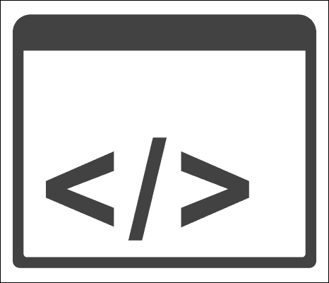
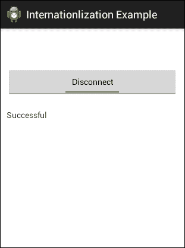
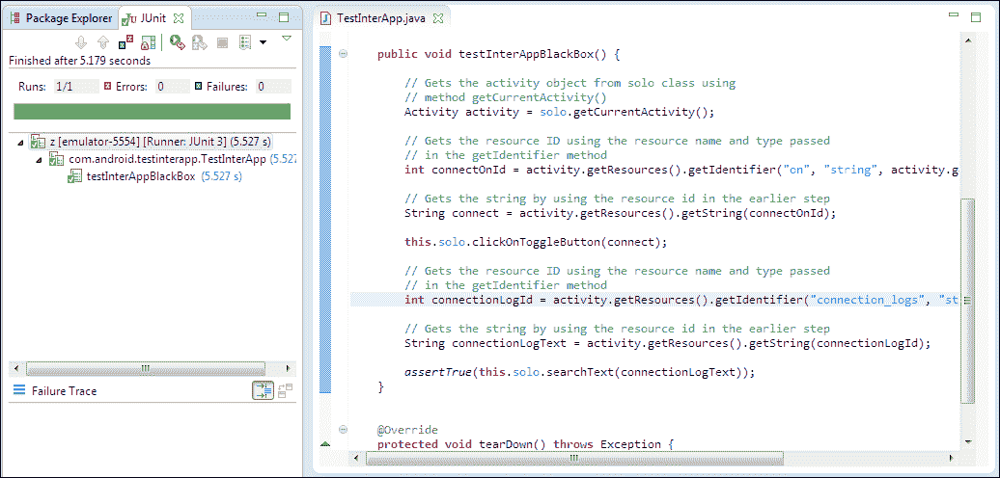

# 第三章。机器人协会

本章将向您介绍`Solo`类以及框架中存在的 API 的相关信息。完成后，我们将考虑资源标识测试用例，它向我们简要介绍了如何使用机器人实现国际化。

到本章结束时，您将了解框架和测试用例评估中的大多数 API。

# 土壤

`Solo`类是 Robotium 框架中提供的一个主类，由编写项目中测试用例的 API 组成。Robotium 可以和安卓测试类结合使用，比如`ActivityInstrumentationTestCase2`和`SingleLaunchActivityTestCase`。

`Solo`类有以下两个构造函数:

*   `Solo (android.app.Instrumentation instrumentation)`:该构造函数将检测作为参数
*   `Solo(android.app.Instrumentation instrumentation, android.app.Activity activity)`:这个构造器接受检测和活动

# API 调用

机器人框架中有许多应用编程接口，它们涵盖了安卓系统中的大部分功能。根据用户的反馈和建议，方法计数会增加。如果任何一个从事测试项目的 Robotium 测试用例开发人员发现有一些方法(指的是一个特别有用的功能)可以作为 Robotium 框架的一部分添加进来，那么它可以帮助人们完成他们各自的项目。



机器人开发团队根据优先级分析这些新需求。其中一些被实现，并作为下一个版本的一部分被添加/删除。如果任何应用编程接口支持在下一个版本停止，更新您的测试项目 Robotium lib 可能会很麻烦。

所有这些方法可通过以下链接在线获得:

[http://robotics . Google code . com/SVN/doc/com/jaywy/Android/robotics/solo/solo . html](http://robotium.googlecode.com/svn/doc/com/jayway/android/robotium/solo/Solo.html)

[http://robotics . Google code . com/SVN/doc/com/jaywy/Android/robotics/solo/solo . html](http://robotium.googlecode.com/svn/doc/com/jayway/android/robotium/solo/Solo.html)

您可以研究 API 集的 Javadoc，也可以浏览可从

[https://github . com/jayway/robotium/tree/master/robotium-solo](https://github.com/jayway/robotium/tree/master/robotium-solo)

下图显示了对 Robotium 的简要了解，包括总提交、LOC、项目模型和技术堆栈:


来自 ohloh.net 的快照

# 机器人化中的资源标识

在 Robotium 中，为了使用资源标识，您不需要将**测试中应用** ( **AUT** )资源导入到测试项目中。


无需导入资源文件夹即可完成。您只需要通过将视图的名称和类型传递给`getIdentifier()`方法，然后将获得的标识传递给`getView()`方法来获得资源标识，以获得相应的视图对象。

```java
Activity activity = solo.getCurrentActivity();

ImageView imageView = (ImageView) solo.getView(act.getResources().getIdentifier("appicon", "id", act.getPackageName()));
```

它也适用于字符串参数；例如:

```java
Solo.getView("com.robotium.R.id.icon");
```

# 理解国际化


你可能想知道什么是国际化。嗯，它是使应用适应各种语言或地区的方法。这可能会与本地化的概念混淆，但两个概念略有不同。本地化意味着使应用适应任何地区或语言，从而使用区域设置组件并翻译文本。

考虑一个可以支持多种语言的应用。如果您想测试这个应用，您不能将任何语言的任何文本硬编码为测试用例的一部分。为了概括这一点，建议您在`res/values/strings.xml`文件中添加字符串。

让我们通过下面的简单例子来看看国际化测试用例是如何实现的。

一个应用由**连接**切换按钮组成，当点击该按钮时，它会切换到**断开**按钮。在它的下面，有一个显示应用生成的所有连接日志的文本视图。用户界面如下图所示:



一旦点击连接按钮，**成功**显示在其下方的文本视图中。

我们可以将其国际化，使用`res/values/string.xml`文件中指定的值，而不是在切换按钮中为文本添加任何硬编码值，如下所示:

```java
<ToggleButton
  android:id="@+id/toggleConnection"android:layout_width="fill_parent"android:layout_height="wrap_content"android:layout_marginTop="50dp"android:textOn="@string/on"android:checked="true"android:textOff="@string/off"/>

<TextView
  android:id="@+id/tvConnectionLogs"android:layout_width="fill_parent"android:layout_height="wrap_content"android:maxLines="5"android:test="@string/connection_logs"android:layout_marginTop="120dip"/>
```

`string.xml`文件中指定的值如下:

```java
  <string name="on">Connect</string>
  <string name="off">Disconnect</string>
  <string name="connection_logs">Successful</string>
```

下面是测试项目`TestInterApp`的代码，有一个名为`testInterAppBlackBox`的测试用例，点击**连接**按钮，切换到**断开**按钮。然后，它在切换按钮下方的连接日志文本视图中搜索**成功**文本。

```java
package com.android.testinterapp;

import android.app.Activity;
import android.test.ActivityInstrumentationTestCase2;

import com.android.interapp.MainActivity;
import com.jayway.android.robotium.solo.Solo;

public class TestInterApp extends ActivityInstrumentationTestCase2<MainActivity> {
  private Solo  solo;

  public TestInterApp() {
    super(MainActivity.class);
  }

  @Override
  protected void setUp() throws Exception {
    super.setUp();
    this.solo = new Solo(this.getInstrumentation(), this.getActivity());
  }

  public void testInterAppBlackBox() {

    // Gets the activity object from solo class using
    // method getCurrentActivity()
    Activity activity = solo.getCurrentActivity();

    // Gets the resource ID using the resource name and type passed
    // in the getIdentifier method
    int connectOnId = activity.getResources().getIdentifier("on", "string", activity.getPackageName());

    // Gets the string by using the resource id in the earlier step
    String connect = activity.getResources().getString(connectOnId);

    this.solo.clickOnToggleButton(connect);

    // Similarly for the text view field, get the resource ID using the resource name and type passed in the getIdentifier method
    int connectionLogId = activity.getResources().getIdentifier("connection_logs", "string", activity.getPackageName());

    // Gets the string by using the resource id in the earlier step
    String connectionLogText = activity.getResources().getString(connectionLogId);

    assertTrue(this.solo.searchText(connectionLogText));

  }

  @Override
  protected void tearDown() throws Exception {
    this.solo.finishOpenedActivities();
  }
}
```

以下截图显示了 Junit 控制台中的测试用例结果:



测试案例和结果

国际化的结果是，如果任何用户想要改变语言区域，就不需要修改 Robotium 测试用例。相反，只需更改`string.xml`文件中区域语言的变量值，测试用例对所有区域和语言都是一样的。

# 总结

在本章中，我们已经看到了大多数 Robotium API 调用及其描述，以及如何在 Robotium 中使用国际化。在下一章中，您将学习如何使用机器人在安卓应用中访问网络视图的不同网络元素。