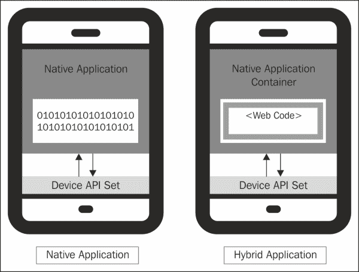
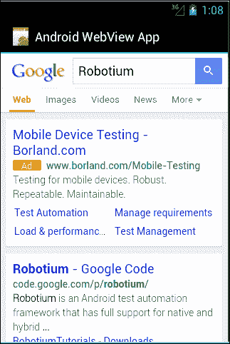
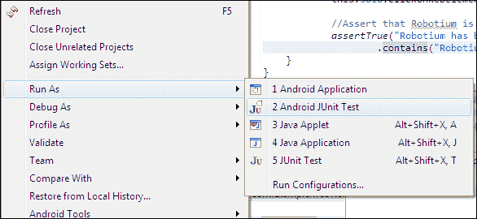

# 第四章。机器人领域的网络支持

本章将向您简要介绍如何使用 Robotium 中的网络支持来访问安卓系统中的网络元素。我们将在本章的开始部分看到这些方法，并将继续讨论一个测试混合应用的简单示例。

# API 集

自从机器人 4.0 发布以来，网络支持已经被添加到机器人框架中。Robotium 完全支持混合应用。本地应用和混合应用之间有一些关键区别。让我们一个接一个地浏览它们，如下所示:

<colgroup><col style="text-align: left"> <col style="text-align: left"></colgroup> 
| 

本机应用

 | 

混合应用

 |
| --- | --- |
| 平台相关 | 跨平台 |
| 在设备的内部软件和硬件上运行 | 使用 HTML5 和 JavaScript 构建，包装在一个瘦的本地容器中，提供对本地平台功能的访问 |
| 需要更多开发人员在不同平台上构建应用，学习时间更长 | 节省开发成本和时间 |
| 完美的表现 | 性能下降 |

本机和混合应用如下所示:



让我们看看 Robotium 中支持访问网络内容的一些现有方法。它们如下:

*   `searchText (String text)`
*   `scrollUp/Down()`
*   `clickOnText (String text)`
*   `takeScreenshot()`
*   `waitForText (String text)`

在专门为 web 支持添加的方法中，类`By`用作参数。它是一个抽象类，与 web 方法结合使用。这些方法用于根据属性(如标识和名称)选择不同的网络元素。

网络视图中使用的元素称为网络元素。它类似于 Selenium 中实现的网络驱动程序。下表列出了类`By`中的所有方法:

<colgroup><col style="text-align: left"> <col style="text-align: left"></colgroup> 
| 

方法

 | 

描述

 |
| --- | --- |
| `className (String className)` | 通过类名称选择一个网络元素 |
| `cssSelector (String selectors)` | 通过 CSS 选择器选择一个网络元素 |
| `getValue()` | 返回值 |
| `id (String id)` | 通过标识选择一个网络元素 |
| `name (String name)` | 按名称选择一个网络元素 |
| `tagName (String tagName)` | 通过标签名称选择一个网络元素 |
| `textContent (String textContent)` | 根据文本内容选择一个网络元素 |
| `xpath (String xpath)` | 通过路径选择一个网络元素 |

Robotium 框架中旨在与安卓应用中的网络内容直接通信的一些重要方法如下所示:

*   `clickOnWebElement(By by)`:点击与指定`By`类对象匹配的 WebElement。
*   `waitForWebElement(By by)`:等待与指定的`By`类对象匹配的 WebElement。
*   `getWebElement(By by, int index)`:返回与指定的`By`类对象和索引匹配的 WebElement。
*   `enterTextInWebElement(By by, String text)`:它在匹配指定`By`类对象的网络元素中输入文本。
*   `typeTextInWebElement(By by)`:它在匹配指定`By`类对象的网络元素中键入文本。在这种方法中，程序实际上是用键盘一个字母一个字母地输入文本，而`enterTextInWebElement`则直接输入特定的文本。
*   `clearTextInWebElement(By by)`:清除匹配指定`By`类对象的网络元素中的文本。
*   `getCurrentWebElements(By by)`:返回活动网页视图中显示的与指定的`By`类对象匹配的网页元素的`ArrayList`。

在实际查看混合测试示例之前，让我们获得更多关于`WebViews`的信息。

您可以使用`Solo`类获得`WebView`的实例，如下所示:

```java
WebView wb = solo.getCurrentViews(WebView.class).get(0);
```

现在您已经控制了`WebView`，您可以按照如下方式注入您的 JavaScript 代码:

```java
Wb.loadUrl("<JavaScript>");
```

这非常强大，因为我们可以调用当前页面上的每个函数；因此，它有助于自动化。

# 混合测试示例

我们来看一个混合应用，也就是被测应用，创建一个简单的测试项目来测试这个应用。

应用在其布局中提供了一个`WebView`控件，并在其中加载了谷歌的主页(如下图截图所示)。在开始编写测试用例之前，您可以查看应用的源代码:


`WebViewActivity.java`文件的源代码如下:

```java
public class WebViewActivity extends Activity {

  @Override
  public void onCreate(Bundle savedInstanceState) {
    super.onCreate(savedInstanceState);
    setContentView(R.layout.web_main);

    WebView webView = (WebView) findViewById(R.id.mainWebView);

    WebSettings webSettings = webView.getSettings();
    webSettings.setJavaScriptEnabled(true);

    webView.setWebViewClient(new CustomWebViewClient());
    webView.setScrollBarStyle(View.SCROLLBARS_INSIDE_OVERLAY);

    webView.loadUrl("http://www.google.co.in");
  }

  private class CustomWebViewClient extends WebViewClient {
    @Override
    public boolean shouldOverrideUrlLoading(WebView view, String url)     {
      view.loadUrl(url);
      return true;
    }
  }
}
```

在您的`web_main.xml`布局文件中添加以下代码:

```java
<WebView android:layout_width="match_parent" android:layout_height="match_parent" android:id="@+id/mainWebView">
</WebView>
```

如果您没有在`AndroidManifest.xml`中指定任何权限，请提供以下权限:

```java
<uses-permission android:name="android.permission.INTERNET" />
```

这将使用`WebView`设置您的应用。现在，让我们编写一个测试用例，访问谷歌主页`WebView`的一些网络元素，并提供结果。

在您的混合测试项目中，使用以下代码作为谷歌搜索测试用例:

```java
  // A test that searches for Robotium and asserts 
  // that Robotium is found.

public void testSearchRobotium()
{

  // Since Google's search form input box statement utilizes
  // a "q" in the name="q" parameter
  final By inputSearch = By.name("q");

  // Google search button utilizes "tsbb" in 
  // the id="tsbb" parameter
  final By buttonSearch = By.id("tsbb");

  // Wait for a WebElement without scrolling.
  this.solo.waitForWebElement(inputSearch);

  // Types Robotium in the search input field.
  this.solo.typeTextInWebElement(inputSearch, "Robotium");

  //Assert that Robotium is entered in the input field.
  assertTrue("Robotium has not been typed", solo.getWebElement(inputSearch, 0).getText().contains("Robotium"));

  // Clicks on the search button 
  this.solo.clickOnWebElement(buttonSearch);

  // Waits for the results page for Robotium
  solo.waitForText("Results");

  // Takes the screenshot of the current active screen
  solo.takeScreenshot();

}
```

前面的代码在谷歌搜索框中输入文本`Robotium`并点击搜索按钮。如果在输入搜索栏中找不到`Robotium`这个词，它就断言。如果有，程序点击搜索按钮，显示结果页面。

然后，它等待测试结果，并获取如下截图:



这个截图是 API 保存在`/sdcard/Robotium-Screenshots/`目录下的。它需要被测应用的`AndroidManifest.xml`文件中的写权限(`android.permission.WRITE_EXTERNAL_STORAGE`)。

这个结果可以在 JUnit 视图下查看。当测试项目作为 Android JUnit 测试执行时，该视图会自动启动。您可以看到下面的截图来跟踪运行测试项目的过程。

右键点击测试项目，点击**运行方式**，然后点击 **2 安卓 JUnit 测试**:



`testSearchRobotium`测试用例通过并由绿色条表示，如下图截图所示。完成测试大约需要 66.1062 秒:


# 总结

在本章中，我们学习了测试混合应用和用于访问网络元素的不同应用接口。借助 Robotium 的网页视图支持，我们基本上可以测试移动网页。通过这种方式，我们模拟了与使用本机浏览器打开移动网页相同的条件，因为本机浏览器具有包含网络视图的选项卡。

在下一章中，我们将比较 Robotium 框架和其他测试框架，并看到一些有趣的事实。